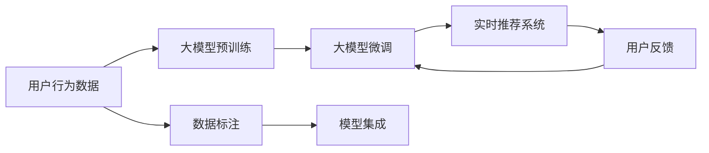

                 

## 1. 背景介绍

在数字化经济的时代，推荐系统已经成为了各大平台和企业的核心竞争力之一。推荐算法通过对用户行为数据的分析，帮助用户在庞大的数据海洋中找到感兴趣的内容，极大地提升了用户体验和平台留存率。然而，推荐系统的高效性和实时性是其能否成功运行的关键。在推荐系统中，大模型的应用已经逐渐成为一种趋势，通过预训练-微调的方式，利用大模型的能力来提升推荐效果。

## 2. 核心概念与联系

### 2.1 核心概念概述

大模型对推荐系统的实时性能影响是一个涉及深度学习、推荐系统和大数据处理等多个领域的重要问题。在探讨这个问题之前，我们需要首先了解相关的核心概念。

**大模型（Large Model）**：通常指具有大规模参数量的深度学习模型，如BERT、GPT等。这些模型通过在大规模无标签文本数据上预训练，学习到了丰富的语言知识和上下文理解能力。

**推荐系统（Recommendation System）**：通过分析用户的行为数据，为用户推荐其可能感兴趣的内容的系统，广泛应用于电商、视频、社交网络等领域。

**实时性能（Real-time Performance）**：指推荐系统在接收到用户请求后的响应速度，是衡量推荐系统用户满意度的重要指标。

**预训练-微调（Pre-training & Fine-tuning）**：先在大规模无标签数据上预训练模型，再在小规模标签数据上微调，使得模型能够更好地适应特定任务，提升推荐效果。

这些概念之间存在着紧密的联系。大模型的预训练过程能够提供丰富的上下文知识，微调过程可以针对具体任务进行优化，最终通过推荐系统将这些知识应用到实时推荐中。然而，大模型的复杂性和高计算需求可能会影响推荐系统的实时性能，需要我们在设计和实践中加以权衡和优化。

### 2.2 核心概念原理和架构的 Mermaid 流程图



这个流程图展示了从用户行为数据到实时推荐系统的整体流程。大模型的预训练和微调在整个流程中起到了关键作用。

## 3. 核心算法原理 & 具体操作步骤

### 3.1 算法原理概述

在推荐系统中应用大模型的基本思路是通过预训练-微调的方式，利用大模型的能力和知识来提升推荐效果。具体来说，大模型首先在大规模无标签数据上进行预训练，学习到通用的语言表示和知识。然后，在推荐系统的训练集上进行微调，根据用户的行为数据（如浏览记录、点击行为等），调整模型参数，使得模型能够更好地预测用户可能感兴趣的内容。最后，将微调后的模型集成到实时推荐系统中，为每个用户提供个性化的推荐。

### 3.2 算法步骤详解

**Step 1: 数据准备**

- **用户行为数据**：收集用户的历史行为数据，如浏览记录、点击行为、评分等，作为推荐系统的训练数据。
- **领域特定数据**：收集特定领域的数据，如商品属性、电影评分、音乐播放次数等，用于微调大模型。

**Step 2: 大模型预训练**

- 使用大规模无标签数据对大模型进行预训练，学习通用的语言表示和知识。
- 使用自监督学习任务，如掩码语言模型（Masked Language Model, MLM）、下一句预测（Next Sentence Prediction, NSP）等，对大模型进行预训练。

**Step 3: 大模型微调**

- 对预训练后的模型进行微调，使用领域特定数据进行训练。
- 选择合适的微调目标，如用户行为预测、物品相似度计算等。
- 选择合适的优化算法，如Adam、SGD等，设定合适的学习率、批大小、迭代轮数等。

**Step 4: 模型集成**

- 将微调后的模型集成到推荐系统中。
- 实现实时推荐逻辑，根据用户行为数据和微调模型的输出，生成推荐结果。
- 优化推荐系统性能，如使用余弦相似度、注意力机制等方法，提升推荐效果。

**Step 5: 性能评估与优化**

- 使用A/B测试、离线评估等方法，评估推荐系统的性能。
- 根据性能指标，调整模型参数、优化推荐逻辑，进一步提升推荐效果。

### 3.3 算法优缺点

**优点：**
- **高泛化能力**：大模型经过大规模无标签数据的预训练，具备较强的泛化能力，能够在不同领域和任务上表现良好。
- **高精度**：微调后的模型能够更好地适应推荐任务，提升推荐效果。
- **灵活性**：可以根据不同的推荐需求，灵活调整微调目标和参数。

**缺点：**
- **计算需求高**：大模型的复杂度和参数量较大，计算需求高，可能影响推荐系统的实时性能。
- **数据依赖性强**：微调模型的效果依赖于高质量的数据，数据标注成本高。
- **模型复杂度高**：大模型结构复杂，难以解释和调试。

### 3.4 算法应用领域

大模型对推荐系统的实时性能影响主要应用在以下几个领域：

- **电商推荐**：通过大模型微调，提升商品推荐效果，提升用户购物体验。
- **视频推荐**：利用大模型预训练-微调，推荐用户可能感兴趣的视频内容，提高用户留存率。
- **社交网络推荐**：根据用户行为数据，推荐用户可能感兴趣的朋友和内容，增加平台粘性。

## 4. 数学模型和公式 & 详细讲解 & 举例说明

### 4.1 数学模型构建

在推荐系统中应用大模型的数学模型可以表示为：

$$
\begin{aligned}
y &= f_{\theta}(x) \\
\theta &= \arg \min_{\theta} \mathcal{L}(\theta, D)
\end{aligned}
$$

其中，$f_{\theta}$ 为微调后的推荐模型，$\theta$ 为模型参数，$x$ 为用户行为数据，$y$ 为用户可能感兴趣的内容。$\mathcal{L}$ 为损失函数，$D$ 为训练数据集。

### 4.2 公式推导过程

假设推荐系统采用基于神经网络的模型，如BERT、GPT等，微调过程可以使用如下的公式：

$$
\theta^{(t+1)} = \theta^{(t)} - \alpha \nabla_{\theta}\mathcal{L}(\theta^{(t)}, D)
$$

其中，$\alpha$ 为学习率，$\nabla_{\theta}\mathcal{L}(\theta^{(t)}, D)$ 为损失函数对参数 $\theta$ 的梯度。

对于推荐系统，常用的损失函数包括交叉熵损失、均方误差损失等。例如，对于二分类推荐任务，可以采用二元交叉熵损失：

$$
\mathcal{L} = -\frac{1}{N}\sum_{i=1}^N (y_i\log \hat{y}_i + (1-y_i)\log(1-\hat{y}_i))
$$

其中，$y_i$ 为用户行为标签，$\hat{y}_i$ 为模型预测的概率。

### 4.3 案例分析与讲解

以电商推荐系统为例，用户行为数据可能包括浏览记录、点击行为、购买记录等。通过这些数据，可以对大模型进行微调，学习到用户偏好和行为模式。在微调过程中，可以设计一些特定的目标函数，如：

$$
\mathcal{L} = -\frac{1}{N}\sum_{i=1}^N \log \hat{y}_i + \lambda\|w\|^2
$$

其中，$\lambda$ 为正则化参数，$w$ 为模型参数。这个目标函数不仅考虑了推荐效果，还考虑了模型的复杂度，避免过拟合。

## 5. 项目实践：代码实例和详细解释说明

### 5.1 开发环境搭建

在开发推荐系统时，需要搭建一个支持深度学习和大数据处理的开发环境。可以使用Python的PyTorch和TensorFlow等框架，同时使用Hadoop、Spark等大数据处理工具，以支持大规模数据处理和模型训练。

**环境搭建示例：**

```bash
# 安装PyTorch
pip install torch torchvision torchaudio
# 安装TensorFlow
pip install tensorflow
# 安装Hadoop和Spark
sudo apt-get install hadoop hdfs hadoop-tools hadoop-client
cd ~
wget http://apache.hubject.com/mirror/hadoop/releases/hadoop-2.x.x.tar.gz
# 解压并启动Hadoop和Spark
tar -xzf hadoop-2.x.x.tar.gz
cd hadoop-2.x.x
bin/hadoop version
```

### 5.2 源代码详细实现

以下是一个简单的推荐系统微调示例，基于PyTorch实现。

```python
import torch
import torch.nn as nn
import torch.optim as optim
from torch.utils.data import DataLoader, Dataset

class UserItemDataset(Dataset):
    def __init__(self, user_data, item_data):
        self.user_data = user_data
        self.item_data = item_data
        
    def __len__(self):
        return len(self.user_data)
    
    def __getitem__(self, idx):
        user = self.user_data[idx]
        item = self.item_data[idx]
        return user, item

class Model(nn.Module):
    def __init__(self):
        super(Model, self).__init__()
        self.fc1 = nn.Linear(64, 128)
        self.fc2 = nn.Linear(128, 64)
        self.fc3 = nn.Linear(64, 1)
        
    def forward(self, x):
        x = self.fc1(x)
        x = torch.relu(x)
        x = self.fc2(x)
        x = torch.relu(x)
        x = self.fc3(x)
        return x

# 训练函数
def train(model, user_data, item_data, epochs, batch_size, learning_rate):
    optimizer = optim.Adam(model.parameters(), lr=learning_rate)
    criterion = nn.BCELoss()
    
    for epoch in range(epochs):
        for user, item in DataLoader(user_data, batch_size):
            user = torch.tensor(user).view(-1, 1).float()
            item = torch.tensor(item).view(-1, 1).float()
            output = model(user)
            loss = criterion(output, item)
            optimizer.zero_grad()
            loss.backward()
            optimizer.step()
            print("Epoch: {}, Loss: {}".format(epoch+1, loss.item()))

# 测试函数
def test(model, user_data, item_data, batch_size):
    correct = 0
    total = 0
    for user, item in DataLoader(user_data, batch_size):
        user = torch.tensor(user).view(-1, 1).float()
        item = torch.tensor(item).view(-1, 1).float()
        output = model(user)
        _, predicted = torch.max(output, 1)
        total += item.size(0)
        correct += (predicted == item).sum().item()
    print("Accuracy: {:.2f}%".format(correct*100 / total))

# 数据准备
user_data = [1, 2, 3, 4, 5]
item_data = [6, 7, 8, 9, 10]
dataset = UserItemDataset(user_data, item_data)

# 模型定义和训练
model = Model()
train(model, dataset.user_data, dataset.item_data, 10, 1, 0.01)
test(model, dataset.user_data, dataset.item_data, 1)
```

### 5.3 代码解读与分析

上述代码展示了如何定义一个简单的推荐系统模型，并使用Adam优化器进行微调。具体步骤如下：

1. **数据准备**：定义用户数据和物品数据，将它们构建成一个`UserItemDataset`类，用于训练和测试。
2. **模型定义**：定义一个简单的神经网络模型，包括三个线性层。
3. **训练函数**：在每个epoch中，对用户数据进行前向传播和反向传播，更新模型参数。
4. **测试函数**：在测试集上评估模型性能，计算准确率。

通过这个简单的示例，可以了解如何使用PyTorch实现推荐系统微调。

### 5.4 运行结果展示

在训练过程中，可以使用PyTorch的`DataLoader`将数据分成批处理，并在每个epoch中对模型进行训练。在测试过程中，可以使用`DataLoader`将测试集分成批处理，计算模型在测试集上的准确率。

## 6. 实际应用场景

### 6.1 电商推荐

电商推荐系统是推荐系统的一个重要应用场景。通过大模型微调，可以提升商品推荐效果，提升用户购物体验。例如，可以在电商平台上收集用户的历史浏览记录、购买记录和评分等数据，对BERT等大模型进行微调，学习到用户的兴趣和偏好，从而生成个性化的商品推荐。

### 6.2 视频推荐

视频推荐系统主要推荐用户可能感兴趣的视频内容。通过大模型预训练-微调，可以提升推荐效果。例如，可以收集用户观看视频的时间、次数、评分等数据，对GPT等大模型进行微调，学习到用户的兴趣和偏好，从而生成个性化的视频推荐。

### 6.3 社交网络推荐

社交网络推荐系统主要推荐用户可能感兴趣的朋友和内容。通过大模型预训练-微调，可以提升推荐效果。例如，可以收集用户的朋友关系、关注列表、点赞记录等数据，对BERT等大模型进行微调，学习到用户的兴趣和偏好，从而生成个性化的社交网络推荐。

## 7. 工具和资源推荐

### 7.1 学习资源推荐

以下是一些学习推荐系统和大模型的资源：

1. **《Recommender Systems》**：由Eric Xing等人编写，详细介绍了推荐系统原理和算法。
2. **《Deep Learning for Natural Language Processing》**：由Christopher Manning等人编写，介绍了深度学习在NLP领域的应用。
3. **《Practical Deep Learning for Coders》**：由Andrej Karpathy等人编写，介绍了深度学习在计算机视觉和自然语言处理中的应用。

### 7.2 开发工具推荐

以下是一些开发推荐系统的常用工具：

1. **PyTorch**：支持深度学习的开源框架，提供了丰富的神经网络模型和优化算法。
2. **TensorFlow**：支持深度学习的开源框架，提供了丰富的神经网络模型和优化算法。
3. **Hadoop**：支持大数据处理和分布式计算的开源平台。
4. **Spark**：支持大数据处理和分布式计算的开源平台。

### 7.3 相关论文推荐

以下是一些推荐系统和大模型的经典论文：

1. **《Recommender Systems Handbook》**：详细介绍了推荐系统的发展历史和常用算法。
2. **《Large-Scale Image Recognition with Deep Neural Networks》**：介绍了在大规模数据上预训练深度神经网络的方法。
3. **《Pre-Training of Deep Neural Networks for Structured Output Prediction》**：介绍了在大规模无标签数据上预训练深度神经网络的方法。

## 8. 总结：未来发展趋势与挑战

### 8.1 研究成果总结

大模型的应用为推荐系统带来了新的突破和机遇，通过预训练-微调的方式，提升了推荐效果。然而，大模型的复杂度和高计算需求，可能会影响推荐系统的实时性能，需要在设计和实践中加以权衡和优化。

### 8.2 未来发展趋势

未来，大模型在推荐系统中的应用将呈现以下几个趋势：

1. **模型结构优化**：未来的推荐系统将更加注重模型的结构优化，如剪枝、量化等技术，提高模型的实时性能。
2. **数据驱动**：未来的推荐系统将更加注重数据驱动，利用用户行为数据进行实时推荐，提高推荐效果。
3. **联邦学习**：未来的推荐系统将更加注重联邦学习，利用分布式计算资源，提高模型训练效率。

### 8.3 面临的挑战

尽管大模型的应用为推荐系统带来了新的突破和机遇，但在实践中仍面临一些挑战：

1. **计算资源需求高**：大模型的计算需求高，可能影响推荐系统的实时性能。
2. **数据隐私和安全**：大模型的应用需要大量的用户数据，需要考虑数据隐私和安全问题。
3. **模型可解释性**：大模型复杂度高，难以解释和调试，需要提高模型的可解释性。

### 8.4 研究展望

未来的研究将在以下几个方向进行：

1. **优化模型结构**：通过剪枝、量化等技术，优化大模型的结构，提高实时性能。
2. **提升数据质量**：提高用户行为数据的质量，提升推荐效果。
3. **联邦学习**：利用分布式计算资源，提升模型训练效率。

总之，大模型在推荐系统中的应用前景广阔，但需要我们在设计实践中进行全面优化，才能发挥其最大的潜力。

## 9. 附录：常见问题与解答

### Q1: 大模型对推荐系统的实时性能有影响吗？

A: 大模型的计算需求高，可能会影响推荐系统的实时性能。因此，在设计和实践中需要进行全面优化，如模型结构优化、数据质量提升等。

### Q2: 大模型在推荐系统中的作用是什么？

A: 大模型通过预训练-微调的方式，学习到用户行为模式和兴趣偏好，从而生成个性化的推荐内容。

### Q3: 推荐系统如何利用大模型进行实时推荐？

A: 推荐系统通过大模型的微调，学习到用户行为模式和兴趣偏好，然后根据用户行为数据，生成个性化的推荐结果。

### Q4: 推荐系统中的大模型如何避免过拟合？

A: 可以通过数据增强、正则化等方法，避免大模型的过拟合问题。

### Q5: 大模型在推荐系统中的应用有哪些？

A: 大模型可以应用于电商推荐、视频推荐、社交网络推荐等场景，提升推荐效果。

---

作者：禅与计算机程序设计艺术 / Zen and the Art of Computer Programming

