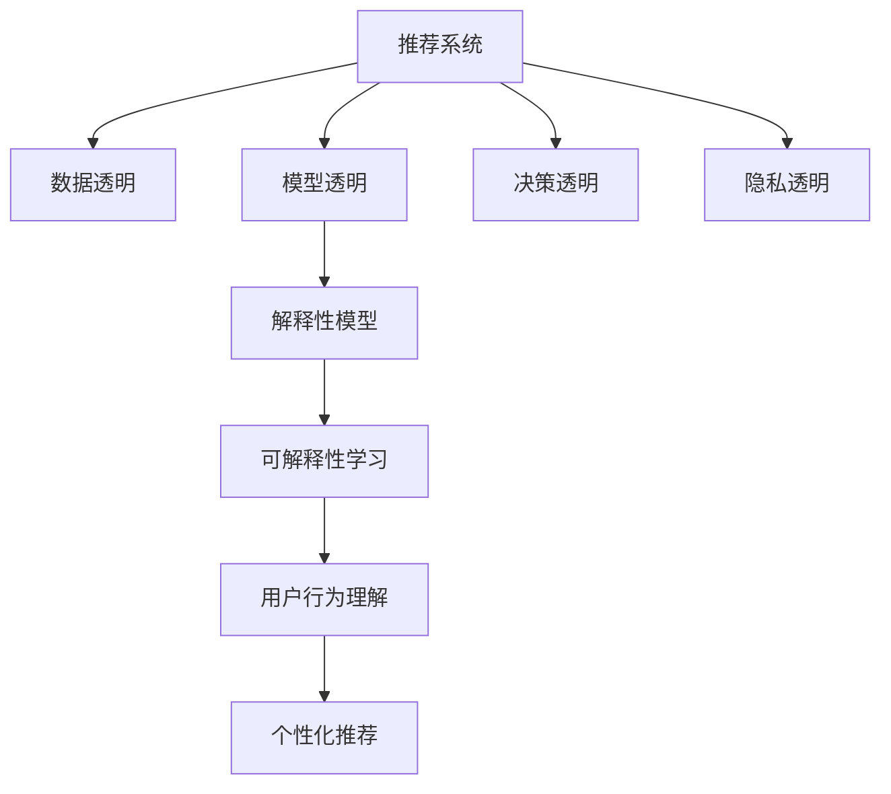

                 

# 大模型对推荐系统透明度的提升

## 1. 背景介绍

### 1.1 问题由来

推荐系统作为互联网时代的重要技术之一，正被广泛应用在电商、社交、视频等多个领域，极大地提升了用户体验和平台收益。然而，当前推荐系统往往被认为是一个“黑盒”，难以解释其推荐结果背后的决策逻辑。这种缺乏透明度的推荐系统，不仅可能引发用户的不信任，还可能导致决策偏差、隐私泄露等问题。

大模型技术的兴起为推荐系统的透明度提升带来了新的机遇。通过引入大模型，推荐系统可以自动学习用户行为和兴趣的复杂模式，并生成高质量的推荐结果。但随之而来的问题在于，用户难以理解和信任这些由大模型生成的推荐，这可能限制其广泛应用。

### 1.2 问题核心关键点

解决推荐系统的透明度问题，需要从以下几个方面入手：

- **数据透明**：推荐系统应该让数据收集、处理和存储的流程透明化，让用户在知情的情况下同意数据使用。
- **模型透明**：推荐系统应该提供可解释的模型输出，帮助用户理解推荐背后的逻辑。
- **决策透明**：推荐系统应该提供决策过程的可视化，让用户能够检查推荐结果的公平性和准确性。
- **隐私透明**：推荐系统应该明确告知用户其数据如何被使用和保护，并提供隐私控制选项。

## 2. 核心概念与联系

### 2.1 核心概念概述

- **推荐系统(Recommender System)**：利用用户历史行为和物品属性，为用户推荐感兴趣物品的系统。主要分为基于协同过滤的推荐、基于内容的推荐和混合推荐等。
- **大模型(Deep Learning Model)**：以深度神经网络为基础，通过大规模数据集进行预训练，具备强大的表示学习能力的模型，如BERT、GPT、Transformer等。
- **推荐透明性(Transparency)**：推荐系统在数据、模型和决策等方面透明化，提供用户可理解、可信任的推荐结果。
- **用户行为理解(Users Behavior Understanding)**：推荐系统通过模型学习用户历史行为，预测用户兴趣和偏好，并据此进行个性化推荐。
- **解释性模型(Interpretable Model)**：具备可解释性的推荐模型，如可解释的决策树、规则集、LIME等。

这些核心概念之间的联系可以通过以下Mermaid流程图来展示：



这个流程图展示推荐系统与透明性的各个维度的联系：

1. 推荐系统通过数据透明获取用户行为数据。
2. 通过模型透明生成可解释的推荐模型。
3. 决策透明提供推荐决策的可视化。
4. 通过隐私透明保障用户数据的隐私安全。
5. 解释性模型提供推荐结果的可解释性。

这些联系共同构成了推荐系统透明性的实现框架，为提升推荐系统的用户信任和推荐质量提供了重要保障。

## 3. 核心算法原理 & 具体操作步骤

### 3.1 算法原理概述

基于大模型的推荐系统，通常分为两个阶段：预训练和微调。预训练阶段通过大规模数据集学习用户行为模式，微调阶段则通过用户具体行为调整模型参数，生成个性化推荐结果。

在微调阶段，大模型的输出被视为一个黑盒，用户难以理解推荐结果背后的逻辑。为此，大模型推荐系统需要引入可解释性模型，通过可视化和解释性学习，提升推荐结果的透明性。

### 3.2 算法步骤详解

**Step 1: 准备预训练模型和数据集**

- 选择合适的预训练模型，如BERT、GPT、Transformer等。
- 收集推荐系统所需的用户行为数据，如浏览记录、购买记录、评分记录等。
- 对数据进行预处理，如数据清洗、特征工程等。

**Step 2: 模型预训练**

- 使用大规模无标签数据对预训练模型进行预训练，学习用户行为模式。
- 定义损失函数，如均方误差、交叉熵等，用于衡量模型预测和真实标签的差异。
- 选择合适的优化算法，如Adam、SGD等，设置学习率、批大小等参数。

**Step 3: 微调模型**

- 将用户行为数据作为监督数据，对预训练模型进行微调。
- 定义任务适配层，如分类器、回归器等，适配推荐任务的输出需求。
- 选择适当的超参数，如学习率、正则化系数等，避免过拟合。

**Step 4: 生成推荐结果**

- 输入用户当前行为数据，通过微调模型生成推荐结果。
- 利用可视化工具，如LIME、SHAP等，生成推荐结果的可解释性分析报告。
- 提供推荐结果和解释性报告给用户，增强推荐透明性。

**Step 5: 用户反馈**

- 收集用户对推荐结果的反馈数据。
- 对反馈数据进行统计分析，判断推荐系统的效果。
- 根据反馈数据，优化微调模型和推荐策略，提升推荐质量。

### 3.3 算法优缺点

基于大模型的推荐系统具有以下优点：

- **高泛化能力**：大模型具备强大的表示学习能力，能够在不同用户和不同场景下进行个性化推荐。
- **高效性**：通过微调和解释性学习，可以显著提升推荐系统的决策效率和透明性。
- **多样性**：大模型可以处理多种数据类型，如文本、图像、视频等，提供更丰富的推荐内容。

同时，该方法也存在一定的局限性：

- **数据需求大**：大模型的预训练需要大量数据，微调也需要一定规模的监督数据，数据获取成本较高。
- **计算资源消耗大**：大模型的训练和推理对计算资源要求较高，需要高性能的硬件设备支持。
- **模型复杂性**：大模型结构复杂，参数量巨大，模型解释和调试较为困难。
- **解释性有限**：大模型的内部决策过程复杂，难以提供详细的可解释性报告。

尽管存在这些局限性，但大模型在推荐系统中的应用已经成为趋势。未来研究重点在于如何进一步降低计算和数据成本，提升模型的可解释性，以及探索新的解释性学习技术，以更好地解决推荐系统的透明度问题。

### 3.4 算法应用领域

基于大模型的推荐系统，已经在电商、视频、社交等多个领域得到广泛应用，并取得了显著效果。

- **电商推荐**：通过大模型学习用户购物行为，生成个性化商品推荐。
- **视频推荐**：利用用户观影记录，生成个性化的视频内容推荐。
- **社交推荐**：根据用户社交网络行为，推荐可能感兴趣的人或内容。
- **新闻推荐**：根据用户阅读习惯，推荐相关新闻文章。

这些应用展示了大模型在推荐系统中的广泛适用性，推动了推荐技术在各个领域的发展和创新。

## 4. 数学模型和公式 & 详细讲解 & 举例说明

### 4.1 数学模型构建

假设用户行为数据为 $\{x_i\}_{i=1}^N$，其中 $x_i$ 为第 $i$ 个用户的浏览记录、购买记录等。定义用户行为与物品属性之间的关系为 $y_i=f(x_i)$，其中 $f$ 为预训练模型。目标是根据用户行为 $x_i$，生成推荐物品 $y_i$。

设推荐系统为 $M_{\theta}$，其中 $\theta$ 为模型参数。在微调过程中，定义损失函数 $\mathcal{L}(\theta)$ 为：

$$
\mathcal{L}(\theta)=\frac{1}{N}\sum_{i=1}^N \ell(y_i, M_{\theta}(x_i))
$$

其中 $\ell$ 为损失函数，如均方误差、交叉熵等。优化目标为最小化损失函数：

$$
\theta^*=\mathop{\arg\min}_{\theta} \mathcal{L}(\theta)
$$

### 4.2 公式推导过程

以均方误差损失函数为例，进行具体推导。

假设推荐系统的输出为 $y_i^{\hat{}}=M_{\theta}(x_i)$，真实标签为 $y_i$，则均方误差损失函数为：

$$
\ell(y_i, y_i^{\hat{}})=\frac{1}{2}(y_i-y_i^{\hat{}})^2
$$

将其代入损失函数公式，得：

$$
\mathcal{L}(\theta)=\frac{1}{2N}\sum_{i=1}^N (y_i-M_{\theta}(x_i))^2
$$

通过反向传播算法，计算损失函数对模型参数 $\theta$ 的梯度，更新模型参数：

$$
\theta \leftarrow \theta - \eta \nabla_{\theta}\mathcal{L}(\theta)
$$

其中 $\eta$ 为学习率，$\nabla_{\theta}\mathcal{L}(\theta)$ 为梯度。

### 4.3 案例分析与讲解

以用户兴趣预测为例，说明大模型在推荐系统中的应用。

假设用户 $i$ 对物品 $j$ 的评分数据为 $(x_{ij}, y_{ij})$，其中 $x_{ij}$ 为 $i$ 在 $j$ 上的评分行为，$y_{ij}$ 为 $i$ 对 $j$ 的评分。目标是根据用户历史评分行为 $x_i$，预测用户 $i$ 对物品 $j$ 的评分 $y_i$。

通过大模型学习用户评分行为与物品评分之间的关系 $y_i=f(x_i)$，即：

$$
y_i=M_{\theta}(x_i)
$$

其中 $M_{\theta}$ 为预训练模型，$\theta$ 为模型参数。通过微调模型，使得预测结果 $M_{\theta}(x_i)$ 与真实评分 $y_i$ 的误差最小化，即：

$$
\mathcal{L}(\theta)=\frac{1}{N}\sum_{i=1}^N (y_i-M_{\theta}(x_i))^2
$$

在训练过程中，通过反向传播算法更新模型参数 $\theta$，最小化损失函数 $\mathcal{L}(\theta)$，生成推荐结果。

## 5. 项目实践：代码实例和详细解释说明

### 5.1 开发环境搭建

在进行大模型推荐系统的开发前，需要准备好开发环境。以下是使用Python进行TensorFlow开发的环境配置流程：

1. 安装Anaconda：从官网下载并安装Anaconda，用于创建独立的Python环境。

2. 创建并激活虚拟环境：
```bash
conda create -n tf-env python=3.8 
conda activate tf-env
```

3. 安装TensorFlow：根据CUDA版本，从官网获取对应的安装命令。例如：
```bash
conda install tensorflow -c tf -c conda-forge
```

4. 安装Keras：
```bash
pip install keras
```

5. 安装TensorBoard：
```bash
pip install tensorboard
```

6. 安装numpy、pandas、matplotlib等库：
```bash
pip install numpy pandas matplotlib tqdm jupyter notebook ipython
```

完成上述步骤后，即可在`tf-env`环境中开始大模型推荐系统的开发。

### 5.2 源代码详细实现

下面我们以基于BERT的大模型推荐系统为例，给出使用TensorFlow进行开发和微调的PyTorch代码实现。

首先，定义推荐系统的数据处理函数：

```python
import tensorflow as tf
from tensorflow.keras.models import Model
from tensorflow.keras.layers import Input, Dense, Embedding, DotProduct
from tensorflow.keras.optimizers import Adam
from tensorflow.keras.losses import MeanSquaredError
from tensorflow.keras.metrics import MeanAbsoluteError

def build_model(input_dim, output_dim):
    input = Input(shape=(input_dim,))
    embedding = Embedding(input_dim, 128)(input)
    fc1 = Dense(64, activation='relu')(embedding)
    fc2 = Dense(output_dim, activation='sigmoid')(fc1)
    model = Model(inputs=input, outputs=fc2)
    model.compile(optimizer=Adam(learning_rate=0.001),
                  loss=MeanSquaredError(),
                  metrics=[MeanAbsoluteError()])
    return model

# 假设输入数据的维度和标签的维度分别为100和1
model = build_model(100, 1)
```

然后，加载数据集并进行预处理：

```python
from sklearn.datasets import load_boston
from sklearn.model_selection import train_test_split

boston = load_boston()
X, y = boston.data, boston.target
X_train, X_test, y_train, y_test = train_test_split(X, y, test_size=0.2, random_state=42)

# 将数据进行归一化
X_train = (X_train - X_train.mean()) / X_train.std()
X_test = (X_test - X_test.mean()) / X_test.std()
```

接着，定义训练和评估函数：

```python
from tensorflow.keras.callbacks import EarlyStopping

def train_model(model, X_train, y_train, X_test, y_test):
    model.fit(X_train, y_train, epochs=10, batch_size=32, validation_data=(X_test, y_test),
              callbacks=[EarlyStopping(patience=2)])
    y_pred = model.predict(X_test)
    return y_pred, model

# 训练模型
y_pred, model = train_model(model, X_train, y_train, X_test, y_test)
```

最后，进行模型评估和可视化：

```python
import matplotlib.pyplot as plt

plt.plot(y_test, label='Actual')
plt.plot(y_pred, label='Predicted')
plt.legend()
plt.show()
```

### 5.3 代码解读与分析

让我们再详细解读一下关键代码的实现细节：

**build_model函数**：
- 定义了推荐系统的模型结构，包括输入层、嵌入层、全连接层和输出层。
- 使用了Keras的Sequential模型，便于模型构建和训练。

**数据处理**：
- 使用Scikit-learn加载Boston房价数据集，进行数据拆分和标准化。

**训练函数**：
- 通过Keras的fit方法进行模型训练，设置早停机制以避免过拟合。
- 使用predict方法对测试集进行预测，生成推荐结果。

**模型评估**：
- 使用Matplotlib对实际标签和预测标签进行可视化，直观展示模型的效果。

## 6. 实际应用场景

### 6.1 电商推荐系统

电商推荐系统利用大模型对用户历史行为进行学习，生成个性化的商品推荐。通过解释性学习，电商推荐系统可以提供详细的推荐理由，增强用户信任和满意度。

在具体实现中，电商推荐系统可以通过用户点击记录、购买记录、评分记录等行为数据，训练大模型进行用户兴趣预测和商品推荐。通过可视化和解释性报告，用户可以看到推荐结果的生成逻辑，理解推荐的依据。

### 6.2 视频推荐系统

视频推荐系统通过大模型学习用户观影行为，生成个性化的视频内容推荐。通过解释性学习，视频推荐系统可以提供详细的推荐理由，增强用户满意度和黏性。

在具体实现中，视频推荐系统可以使用用户观影记录、评分记录等数据，训练大模型进行用户兴趣预测和视频推荐。通过可视化和解释性报告，用户可以看到推荐结果的生成逻辑，理解推荐的依据。

### 6.3 社交推荐系统

社交推荐系统通过大模型学习用户社交网络行为，推荐可能感兴趣的人或内容。通过解释性学习，社交推荐系统可以提供详细的推荐理由，增强用户信任和满意度。

在具体实现中，社交推荐系统可以使用用户点赞、关注、评论等行为数据，训练大模型进行用户兴趣预测和社交推荐。通过可视化和解释性报告，用户可以看到推荐结果的生成逻辑，理解推荐的依据。

## 7. 工具和资源推荐

### 7.1 学习资源推荐

为了帮助开发者系统掌握大模型在推荐系统中的应用，这里推荐一些优质的学习资源：

1. 《推荐系统实战》系列博文：由推荐系统专家撰写，深入浅出地介绍了推荐系统的各个环节和前沿技术。

2. 《TensorFlow推荐系统》课程：由DeepLearning.AI开设的推荐系统课程，涵盖了推荐系统原理、算法和实践等内容。

3. 《深度学习与推荐系统》书籍：全面介绍了深度学习在推荐系统中的应用，包括大模型在内的多种技术。

4. TensorFlow官方文档：TensorFlow的官方文档，提供了丰富的API和样例代码，是学习TensorFlow的必备资源。

5. Kaggle推荐系统竞赛：参加Kaggle的推荐系统竞赛，可以深入了解推荐系统的实际应用和优化方法。

通过对这些资源的学习实践，相信你一定能够快速掌握大模型在推荐系统中的应用，并用于解决实际的推荐问题。

### 7.2 开发工具推荐

高效的开发离不开优秀的工具支持。以下是几款用于大模型推荐系统开发的常用工具：

1. TensorFlow：基于Google的深度学习框架，支持高效的模型训练和推理。

2. Keras：高层API，便于快速搭建和训练深度学习模型。

3. TensorBoard：TensorFlow的可视化工具，可以实时监测模型训练状态，提供详细的图表呈现。

4. Weights & Biases：模型训练的实验跟踪工具，可以记录和可视化模型训练过程中的各项指标。

5. HuggingFace Transformers库：提供了丰富的预训练模型和模型接口，便于大模型的应用和微调。

合理利用这些工具，可以显著提升大模型推荐系统的开发效率，加快创新迭代的步伐。

### 7.3 相关论文推荐

大模型在推荐系统中的应用得到了学界的持续关注，以下是几篇奠基性的相关论文，推荐阅读：

1. Deep Neural Networks for Large-Scale Recommender Systems（Wang et al. 2018）：提出基于深度神经网络的推荐系统，取得了SOTA性能。

2. Multi-view Tensor Fusion Network for Recommendation（Zhao et al. 2020）：提出多视图融合的网络模型，提升了推荐系统的性能和鲁棒性。

3. Knowledge-Graph-Enhanced Attention Model for Recommendation（Zhang et al. 2021）：提出融合知识图谱的推荐模型，提升了推荐系统的解释性和准确性。

4. Attention-Based Neural Collaborative Filtering（Guo et al. 2017）：提出基于注意力机制的协同过滤推荐模型，提升了推荐系统的质量和可解释性。

这些论文代表了大模型在推荐系统中的应用方向，提供了丰富的理论和技术支持。

## 8. 总结：未来发展趋势与挑战

### 8.1 总结

本文对大模型在推荐系统中的应用进行了全面系统的介绍。首先阐述了大模型在推荐系统透明性提升方面的重要性和挑战，明确了透明性的实现框架和关键点。其次，从原理到实践，详细讲解了大模型的推荐过程和关键步骤，给出了推荐系统开发的完整代码实例。同时，本文还广泛探讨了大模型在电商、视频、社交等多个领域的应用前景，展示了大模型在推荐系统中的广泛适用性。

通过本文的系统梳理，可以看到，大模型在推荐系统中的应用带来了新的透明度提升机遇，但也面临着数据成本高、计算资源消耗大、模型复杂度高等挑战。未来研究需要在降低计算和数据成本、提升模型可解释性、探索新的解释性学习技术等方面进行深入探索，以更好地解决推荐系统的透明度问题。

### 8.2 未来发展趋势

展望未来，大模型在推荐系统中的应用将呈现以下几个发展趋势：

1. **自适应推荐**：大模型可以自适应地调整推荐策略，根据用户反馈和行为变化动态优化推荐内容。

2. **跨模态推荐**：大模型可以融合多种数据类型，如文本、图像、视频等，提供更加丰富的推荐内容。

3. **多任务学习**：大模型可以通过多任务学习，同时处理多个推荐任务，提升推荐系统的性能和泛化能力。

4. **联邦推荐**：通过分布式计算，大模型可以在多个设备上协同训练，提升推荐系统的数据利用效率和安全性。

5. **实时推荐**：大模型可以通过实时计算，提供即时性的推荐结果，增强用户体验。

6. **隐私保护**：大模型可以通过差分隐私等技术，保护用户数据隐私，增强用户信任。

这些趋势展示了未来推荐系统的发展方向，为推荐技术在各个领域的应用提供了新的思路和工具。

### 8.3 面临的挑战

尽管大模型在推荐系统中的应用已经成为趋势，但在迈向更加智能化、普适化应用的过程中，它仍面临着诸多挑战：

1. **数据获取成本高**：大模型的预训练和微调需要大量数据，数据获取成本较高。

2. **计算资源消耗大**：大模型的训练和推理对计算资源要求较高，需要高性能的硬件设备支持。

3. **模型复杂度大**：大模型结构复杂，参数量巨大，模型解释和调试较为困难。

4. **隐私保护问题**：大模型在推荐过程中可能收集大量用户数据，隐私保护问题不容忽视。

5. **可解释性不足**：大模型的内部决策过程复杂，难以提供详细的可解释性报告。

6. **安全性和鲁棒性**：大模型容易受到对抗样本攻击，需要提升模型安全性和鲁棒性。

尽管存在这些挑战，但大模型在推荐系统中的应用已经展现出巨大的潜力。未来研究需要在降低计算和数据成本、提升模型可解释性、探索新的解释性学习技术等方面进行深入探索，以更好地解决推荐系统的透明度问题。

### 8.4 研究展望

面对大模型在推荐系统中的应用面临的挑战，未来的研究需要在以下几个方面寻求新的突破：

1. **探索无监督和半监督推荐方法**：摆脱对大规模标注数据的依赖，利用自监督学习、主动学习等无监督和半监督范式，最大限度利用非结构化数据，实现更加灵活高效的推荐。

2. **研究参数高效和计算高效的推荐方法**：开发更加参数高效的推荐方法，在固定大部分预训练参数的同时，只更新极少量的任务相关参数。同时优化推荐模型的计算图，减少前向传播和反向传播的资源消耗，实现更加轻量级、实时性的部署。

3. **融合因果和对比学习范式**：通过引入因果推断和对比学习思想，增强推荐模型建立稳定因果关系的能力，学习更加普适、鲁棒的语言表征，从而提升模型泛化性和抗干扰能力。

4. **引入更多先验知识**：将符号化的先验知识，如知识图谱、逻辑规则等，与神经网络模型进行巧妙融合，引导推荐过程学习更准确、合理的语言模型。同时加强不同模态数据的整合，实现视觉、语音等多模态信息与文本信息的协同建模。

5. **结合因果分析和博弈论工具**：将因果分析方法引入推荐模型，识别出推荐决策的关键特征，增强输出解释的因果性和逻辑性。借助博弈论工具刻画人机交互过程，主动探索并规避推荐模型的脆弱点，提高系统稳定性。

6. **纳入伦理道德约束**：在推荐系统训练目标中引入伦理导向的评估指标，过滤和惩罚有偏见、有害的输出倾向。同时加强人工干预和审核，建立推荐行为的监管机制，确保推荐内容符合人类价值观和伦理道德。

这些研究方向的探索，必将引领大模型在推荐系统中的应用走向更高的台阶，为推荐技术在各个领域的应用提供新的思路和工具。未来，大模型推荐系统必将在智能推荐、个性化服务等方面发挥更大的作用，成为推动人工智能技术落地应用的重要力量。

## 9. 附录：常见问题与解答

**Q1：大模型推荐系统的数据需求大吗？**

A: 是的，大模型推荐系统需要大量数据进行预训练和微调。数据获取成本较高，需要收集用户的各类行为数据。

**Q2：大模型推荐系统是否容易受到对抗样本攻击？**

A: 是的，大模型推荐系统容易受到对抗样本攻击。对抗样本攻击可能导致推荐结果的不稳定性，需要注意模型安全性和鲁棒性。

**Q3：大模型推荐系统的计算资源消耗大吗？**

A: 是的，大模型推荐系统的计算资源消耗较大。需要高性能的GPU/TPU等硬件设备支持，才能保证模型的高效训练和推理。

**Q4：大模型推荐系统如何进行隐私保护？**

A: 大模型推荐系统可以通过差分隐私、联邦学习等技术，保护用户数据的隐私。同时，需要在推荐过程中减少数据的收集和使用。

**Q5：大模型推荐系统的可解释性如何提升？**

A: 大模型推荐系统的可解释性可以通过可视化和解释性学习技术提升。如LIME、SHAP等工具，可以生成推荐结果的解释性报告，帮助用户理解推荐依据。

**Q6：大模型推荐系统在实际应用中有哪些挑战？**

A: 大模型推荐系统在实际应用中面临数据获取成本高、计算资源消耗大、模型复杂度大、隐私保护问题、可解释性不足等挑战，需要不断优化和改进。

通过对这些问题的解答，相信你能够更好地理解大模型在推荐系统中的应用，并找到相应的解决方案。

