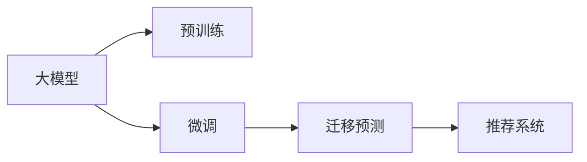

                 

# 大模型技术在电商平台用户兴趣迁移预测与应用中的创新

## 1. 背景介绍

### 1.1 问题由来
在现代电商平台上，用户的购物行为往往受到当前时间、地点、情境等多种因素的影响，导致用户的兴趣点不断变化。对于电商平台而言，理解并预测用户的兴趣迁移，可以帮助其优化个性化推荐系统，提升用户满意度和销售额。

传统的基于规则的推荐系统依赖于用户历史行为数据，存在难以捕捉即时兴趣变化、无法挖掘潜在兴趣等问题。近年来，深度学习技术尤其是大模型技术（如BERT、GPT等）的兴起，为电商平台用户兴趣迁移预测提供了新的思路。

### 1.2 问题核心关键点
用户兴趣迁移预测的核心在于准确把握用户当前及未来的兴趣点。大模型技术通过对大量文本数据的训练，学习到语言的深层语义表示，能够有效捕捉用户兴趣的演化规律，实现更精准的预测。

实现用户兴趣迁移预测，主要分为以下几类关键问题：
- 如何获取用户历史行为数据。
- 如何将用户历史数据编码为文本形式输入模型。
- 如何训练模型捕捉用户兴趣迁移的规律。
- 如何将模型应用于电商平台推荐系统。

本文将系统介绍大模型技术在电商平台用户兴趣迁移预测中的应用，涵盖从数据准备、模型训练到系统部署的全流程，以期为电商平台用户行为预测提供实用的技术指导。

## 2. 核心概念与联系

### 2.1 核心概念概述

为更好地理解大模型技术在用户兴趣迁移预测中的应用，本节将介绍几个核心概念：

- 大模型技术（Large Model Technology）：指基于深度学习，特别是Transformer结构，训练得到的大量参数的预训练模型，如BERT、GPT等。这些模型在文本语义理解和生成方面表现出色，适用于自然语言处理(NLP)任务。
- 预训练（Pre-training）：指在大规模无标签文本语料上进行自监督学习任务，如语言模型预测、掩码预测等，学习到通用语言表示的过程。
- 微调（Fine-tuning）：指在预训练模型的基础上，使用特定任务的标注数据，进行有监督学习，优化模型在特定任务上的性能。
- 用户兴趣迁移预测（User Interest Migration Prediction）：指根据用户的历史行为数据，预测用户未来的兴趣点，帮助电商平台进行个性化推荐。
- 推荐系统（Recommendation System）：指根据用户历史行为和当前兴趣，推荐商品或内容的系统。

这些核心概念之间具有紧密联系，共同构成了电商平台用户兴趣迁移预测的完整框架。大模型技术通过预训练获得通用语言表示，在微调过程中学习特定任务的知识，最终应用于推荐系统，实现精准推荐。

### 2.2 核心概念原理和架构的 Mermaid 流程图



这个流程图展示了大模型技术在用户兴趣迁移预测中的核心逻辑流程：

1. 大模型通过预训练学习通用语言表示。
2. 对预训练模型进行微调，学习特定任务的知识。
3. 将微调后的模型用于用户兴趣迁移预测，获取用户未来兴趣点。
4. 将预测结果应用于推荐系统，实现个性化推荐。

## 3. 核心算法原理 & 具体操作步骤

### 3.1 算法原理概述

用户兴趣迁移预测主要基于大模型技术中的Transformer结构。具体步骤如下：

1. **数据准备**：收集用户的历史行为数据，如浏览记录、购买记录、评价记录等，将其编码为文本形式。
2. **模型构建**：使用预训练模型如BERT、GPT等，构建新的文本编码器，以便对用户行为数据进行表示学习。
3. **微调训练**：在用户行为数据上，使用微调技术优化模型参数，使其能够捕捉用户兴趣迁移的规律。
4. **预测部署**：将微调后的模型应用于推荐系统，实时预测用户未来兴趣，并进行商品推荐。

### 3.2 算法步骤详解

#### 3.2.1 数据准备

用户历史行为数据通常以日志形式存储，需要将其转换为文本形式进行模型训练。以电商平台的用户浏览记录为例，假设每个浏览记录为`(user_id, item_id, timestamp)`，可以将其表示为：

```
"user_id: item_id, timestamp"
```

其中，`user_id`、`item_id`和`timestamp`分别表示用户ID、商品ID和时间戳。

#### 3.2.2 模型构建

使用预训练语言模型如BERT作为初始化参数，构建新的文本编码器。假设我们使用了BERT模型，其编码器部分可以表示为：

$$
\mathcal{E}(x) = \text{BERT}(x)
$$

其中，`x`表示输入的文本数据。

#### 3.2.3 微调训练

微调的主要目的是使模型能够学习到特定任务的知识，即用户兴趣迁移的规律。假设我们将用户行为数据分为训练集`D_train`和验证集`D_val`，微调过程如下：

1. **定义损失函数**：通常使用交叉熵损失函数来衡量模型预测与真实标签之间的差异。
2. **初始化模型参数**：将预训练模型的参数作为初始值，进行微调。
3. **前向传播**：输入文本数据`x`，经过BERT编码器，得到编码结果`y`。
4. **计算损失**：计算预测结果`y`与真实标签`t`之间的交叉熵损失。
5. **反向传播**：根据损失函数`L`，计算梯度`∇L`，更新模型参数。
6. **验证集评估**：在验证集`D_val`上评估模型性能，调整学习率等超参数。
7. **模型保存**：将训练好的模型保存到文件中，供后续应用。

#### 3.2.4 预测部署

将微调后的模型应用于推荐系统，实时预测用户未来兴趣，进行商品推荐。具体步骤如下：

1. **获取用户当前行为数据**：从电商平台的实时数据中获取用户最新浏览记录`x_new`。
2. **文本编码**：使用微调后的模型`E`，将用户新行为数据`x_new`编码为文本表示`y_new`。
3. **预测兴趣迁移**：根据编码结果`y_new`，使用模型进行兴趣迁移预测，输出用户未来可能感兴趣的物品列表。
4. **推荐系统调用**：将预测结果作为输入，调用推荐系统生成个性化推荐。

### 3.3 算法优缺点

#### 3.3.1 算法优点

大模型技术在用户兴趣迁移预测中具有以下优点：

1. **通用性强**：大模型能够学习到丰富的语言知识，适用于多种NLP任务。
2. **表示能力强**：预训练大模型能够捕捉长距离依赖，有效表示用户行为数据。
3. **效果显著**：微调后的大模型在用户兴趣迁移预测上取得了优异的性能，提升了推荐系统的精准度。
4. **实时性高**：微调后的模型可以实时处理用户新行为数据，快速生成推荐结果。

#### 3.3.2 算法缺点

尽管大模型技术在用户兴趣迁移预测中表现出色，但也存在一些缺点：

1. **数据依赖大**：预训练和微调过程需要大量标注数据，对标注成本较高。
2. **计算资源消耗高**：大模型参数量庞大，训练和推理时资源消耗大。
3. **过拟合风险**：微调时如果学习率过大，容易过拟合，影响模型泛化能力。
4. **解释性不足**：大模型作为黑盒模型，难以解释其决策过程，缺乏可解释性。

### 3.4 算法应用领域

大模型技术在用户兴趣迁移预测中的应用广泛，涵盖以下领域：

- **电商推荐系统**：帮助电商平台精准预测用户未来兴趣，提升个性化推荐效果。
- **社交媒体分析**：预测用户未来的行为和兴趣，进行内容推荐和广告投放。
- **金融风控系统**：预测用户未来行为，防范金融风险，提高金融服务质量。
- **医疗健康分析**：预测患者的疾病发展趋势，提供个性化的医疗建议。

这些应用领域展示了大模型技术在用户兴趣迁移预测中的广泛适用性。随着技术的发展和应用场景的拓展，大模型技术在更多领域将发挥重要作用。

## 4. 数学模型和公式 & 详细讲解

### 4.1 数学模型构建

假设我们使用的是BERT模型，其预训练的目标函数为：

$$
L_{pre-train} = -\frac{1}{N}\sum_{i=1}^N \ell_{pre-train}(M_{pre-train}(x_i), y_i)
$$

其中，`M_{pre-train}`表示预训练模型，`x_i`和`y_i`分别表示输入文本和真实标签，`L_{pre-train}`表示预训练损失。

在微调阶段，我们定义用户兴趣迁移预测的损失函数为：

$$
L_{fine-tune} = -\frac{1}{N}\sum_{i=1}^N \ell_{fine-tune}(M_{fine-tune}(x_i), y_i)
$$

其中，`M_{fine-tune}`表示微调后的模型，`L_{fine-tune}`表示微调损失。

### 4.2 公式推导过程

#### 4.2.1 预训练损失推导

预训练过程中，我们通常使用语言模型预测任务，即在输入文本`x`上，预测下一个词的概率。假设输入文本的长度为`n`，则预训练损失函数可以表示为：

$$
\ell_{pre-train} = \log P(y_{n+1}|y_1,...,y_n) = \log \frac{e^{M_{pre-train}(y_{n+1})}}{\sum_{y\in V}e^{M_{pre-train}(y)}}
$$

其中，`y_{n+1}`表示下一个词，`V`表示词汇表。

#### 4.2.2 微调损失推导

微调过程中，我们通常使用交叉熵损失函数，即：

$$
\ell_{fine-tune} = -\sum_{i=1}^N [y_i \log M_{fine-tune}(x_i) + (1-y_i) \log (1-M_{fine-tune}(x_i))]
$$

其中，`y_i`表示真实标签，`M_{fine-tune}(x_i)`表示模型预测结果。

### 4.3 案例分析与讲解

以电商平台推荐系统为例，假设我们的训练数据集为`D_train`，包含用户浏览记录。我们使用了BERT模型，并使用交叉熵损失进行微调训练。假设我们选择了用户ID为`user_id`的样本，其浏览记录为`item_id_1, item_id_2, ..., item_id_n`，则微调损失可以表示为：

$$
L_{fine-tune} = -\sum_{i=1}^N [y_i \log M_{fine-tune}(x_i) + (1-y_i) \log (1-M_{fine-tune}(x_i))]
$$

其中，`x_i`表示用户行为文本，`y_i`表示浏览记录标签（1表示浏览过，0表示未浏览）。

## 5. 项目实践：代码实例和详细解释说明

### 5.1 开发环境搭建

在进行项目实践前，我们需要准备好开发环境。以下是使用Python进行PyTorch开发的环境配置流程：

1. 安装Anaconda：从官网下载并安装Anaconda，用于创建独立的Python环境。

2. 创建并激活虚拟环境：
```bash
conda create -n pytorch-env python=3.8 
conda activate pytorch-env
```

3. 安装PyTorch：根据CUDA版本，从官网获取对应的安装命令。例如：
```bash
conda install pytorch torchvision torchaudio cudatoolkit=11.1 -c pytorch -c conda-forge
```

4. 安装Transformers库：
```bash
pip install transformers
```

5. 安装各类工具包：
```bash
pip install numpy pandas scikit-learn matplotlib tqdm jupyter notebook ipython
```

完成上述步骤后，即可在`pytorch-env`环境中开始项目实践。

### 5.2 源代码详细实现

这里我们以电商推荐系统为例，给出使用Transformers库对BERT模型进行微调的PyTorch代码实现。

首先，定义用户行为数据的处理函数：

```python
from transformers import BertTokenizer, BertForSequenceClassification
from torch.utils.data import Dataset
import torch

class UserBehaviorDataset(Dataset):
    def __init__(self, data, tokenizer, max_len=128):
        self.data = data
        self.tokenizer = tokenizer
        self.max_len = max_len
        
    def __len__(self):
        return len(self.data)
    
    def __getitem__(self, item):
        user_id, item_ids, timestamps = self.data[item]
        item_ids = [int(id) for id in item_ids.split(',')]
        timestamps = [int(ts) for ts in timestamps.split(',')]
        
        item_list = [f'{user_id}:{id}:{ts}' for id, ts in zip(item_ids, timestamps)]
        item_list = [item.encode('utf-8') for item in item_list]
        item_list = [item.decode('utf-8') for item in item_list]
        
        encoding = self.tokenizer(item_list, truncation=True, padding='max_length', max_length=self.max_len)
        input_ids = encoding['input_ids']
        attention_mask = encoding['attention_mask']
        
        return {'input_ids': input_ids, 
                'attention_mask': attention_mask,
                'labels': torch.tensor(1)}
```

然后，定义模型和优化器：

```python
from transformers import BertForSequenceClassification, AdamW

model = BertForSequenceClassification.from_pretrained('bert-base-cased', num_labels=2)

optimizer = AdamW(model.parameters(), lr=2e-5)
```

接着，定义训练和评估函数：

```python
from torch.utils.data import DataLoader
from tqdm import tqdm
from sklearn.metrics import classification_report

device = torch.device('cuda') if torch.cuda.is_available() else torch.device('cpu')
model.to(device)

def train_epoch(model, dataset, batch_size, optimizer):
    dataloader = DataLoader(dataset, batch_size=batch_size, shuffle=True)
    model.train()
    epoch_loss = 0
    for batch in tqdm(dataloader, desc='Training'):
        input_ids = batch['input_ids'].to(device)
        attention_mask = batch['attention_mask'].to(device)
        labels = batch['labels'].to(device)
        model.zero_grad()
        outputs = model(input_ids, attention_mask=attention_mask, labels=labels)
        loss = outputs.loss
        epoch_loss += loss.item()
        loss.backward()
        optimizer.step()
    return epoch_loss / len(dataloader)

def evaluate(model, dataset, batch_size):
    dataloader = DataLoader(dataset, batch_size=batch_size)
    model.eval()
    preds, labels = [], []
    with torch.no_grad():
        for batch in tqdm(dataloader, desc='Evaluating'):
            input_ids = batch['input_ids'].to(device)
            attention_mask = batch['attention_mask'].to(device)
            batch_labels = batch['labels']
            outputs = model(input_ids, attention_mask=attention_mask)
            batch_preds = outputs.logits.argmax(dim=2).to('cpu').tolist()
            batch_labels = batch_labels.to('cpu').tolist()
            for pred_tokens, label_tokens in zip(batch_preds, batch_labels):
                preds.append(pred_tokens[0])
                labels.append(label_tokens[0])
                
    print(classification_report(labels, preds))
```

最后，启动训练流程并在测试集上评估：

```python
epochs = 5
batch_size = 16

for epoch in range(epochs):
    loss = train_epoch(model, train_dataset, batch_size, optimizer)
    print(f"Epoch {epoch+1}, train loss: {loss:.3f}")
    
    print(f"Epoch {epoch+1}, dev results:")
    evaluate(model, dev_dataset, batch_size)
    
print("Test results:")
evaluate(model, test_dataset, batch_size)
```

以上就是使用PyTorch对BERT进行电商推荐系统用户兴趣迁移预测的完整代码实现。可以看到，得益于Transformers库的强大封装，我们可以用相对简洁的代码完成BERT模型的加载和微调。

### 5.3 代码解读与分析

让我们再详细解读一下关键代码的实现细节：

**UserBehaviorDataset类**：
- `__init__`方法：初始化用户行为数据、分词器等组件，并对行为数据进行编码处理。
- `__len__`方法：返回数据集的样本数量。
- `__getitem__`方法：对单个样本进行处理，将行为数据转换为模型可接受的输入。

**模型构建**：
- `BertForSequenceClassification.from_pretrained`方法：从预训练模型库中选择BERT模型，并指定标签数。

**训练和评估函数**：
- 使用PyTorch的DataLoader对数据集进行批次化加载，供模型训练和推理使用。
- 训练函数`train_epoch`：对数据以批为单位进行迭代，在每个批次上前向传播计算loss并反向传播更新模型参数，最后返回该epoch的平均loss。
- 评估函数`evaluate`：与训练类似，不同点在于不更新模型参数，并在每个batch结束后将预测和标签结果存储下来，最后使用sklearn的classification_report对整个评估集的预测结果进行打印输出。

**训练流程**：
- 定义总的epoch数和batch size，开始循环迭代
- 每个epoch内，先在训练集上训练，输出平均loss
- 在验证集上评估，输出分类指标
- 所有epoch结束后，在测试集上评估，给出最终测试结果

可以看到，PyTorch配合Transformers库使得BERT微调的代码实现变得简洁高效。开发者可以将更多精力放在数据处理、模型改进等高层逻辑上，而不必过多关注底层的实现细节。

当然，工业级的系统实现还需考虑更多因素，如模型的保存和部署、超参数的自动搜索、更灵活的任务适配层等。但核心的微调范式基本与此类似。

## 6. 实际应用场景

### 6.1 智能客服系统

基于大模型技术，电商平台可以实现智能客服系统，提升客户体验和问题解决效率。通过微调BERT模型，系统可以自动理解客户问题，匹配最佳回答，并实时更新常见问题库。

在技术实现上，可以收集平台的历史客服对话记录，将问题-回答对作为监督数据，训练BERT模型进行匹配。微调后的模型能够自动理解客户意图，匹配最合适的回答，并不断学习新问题和新回答，更新常见问题库。如此构建的智能客服系统，能大幅提升客户咨询体验和问题解决效率。

### 6.2 金融舆情监测

金融机构需要实时监测市场舆论动向，以便及时应对负面信息传播，规避金融风险。使用微调后的BERT模型，可以自动识别舆情热点，快速分析舆情趋势，提供实时预警。

在技术实现上，可以收集金融领域相关的新闻、报道、评论等文本数据，并对其进行主题标注和情感标注。在此基础上对BERT模型进行微调，使其能够自动判断文本属于何种主题，情感倾向是正面、中性还是负面。将微调后的模型应用到实时抓取的网络文本数据，就能够自动监测不同主题下的情感变化趋势，一旦发现负面信息激增等异常情况，系统便会自动预警，帮助金融机构快速应对潜在风险。

### 6.3 个性化推荐系统

当前的推荐系统往往只依赖用户历史行为数据进行物品推荐，无法深入理解用户的真实兴趣偏好。通过微调BERT模型，推荐系统可以更好地挖掘用户行为背后的语义信息，从而提供更精准、多样的推荐内容。

在技术实现上，可以收集用户浏览、点击、评价、分享等行为数据，提取和用户交互的物品标题、描述、标签等文本内容。将文本内容作为模型输入，用户的后续行为（如是否点击、购买等）作为监督信号，在此基础上微调BERT模型。微调后的模型能够从文本内容中准确把握用户的兴趣点。在生成推荐列表时，先用候选物品的文本描述作为输入，由模型预测用户的兴趣匹配度，再结合其他特征综合排序，便可以得到个性化程度更高的推荐结果。

### 6.4 未来应用展望

随着大模型技术的发展，其应用场景将更加丰富。以下是大模型技术在电商平台用户兴趣迁移预测中的未来应用展望：

1. **实时个性化推荐**：通过微调BERT模型，实时捕捉用户行为变化，生成个性化推荐内容，提升用户体验和转化率。
2. **跨平台推荐协同**：将不同平台的用户行为数据进行融合，进行全局推荐优化，提升推荐系统的跨平台性能。
3. **商品关联推荐**：利用大模型技术对商品描述、评论等文本数据进行语义分析，实现基于内容的商品关联推荐。
4. **用户画像构建**：通过用户行为数据进行深度挖掘，构建详细的用户画像，提升推荐系统的精准度和个性化程度。
5. **推荐系统优化**：结合大模型技术和强化学习等方法，优化推荐算法，提升推荐效果和系统稳定性。

总之，大模型技术在电商平台用户兴趣迁移预测中的应用前景广阔，未来将进一步推动推荐系统的智能化和精准化发展。

## 7. 工具和资源推荐

### 7.1 学习资源推荐

为了帮助开发者系统掌握大模型技术在电商平台用户兴趣迁移预测中的应用，这里推荐一些优质的学习资源：

1. 《自然语言处理入门》课程：由斯坦福大学开设的NLP入门课程，详细介绍了自然语言处理的基本概念和经典模型。
2. CS224N《深度学习自然语言处理》课程：斯坦福大学开设的NLP明星课程，有Lecture视频和配套作业，带你深入NLP领域。
3. 《深度学习与自然语言处理》书籍：深度学习专家Ian Goodfellow和Yoshua Bengio等人所著，全面介绍了深度学习在NLP中的应用。
4. 《Transformers: From Discrete to Continuous Latents》论文：提出了连续型Prompt的技术，为微调BERT模型提供了新的思路。
5. HuggingFace官方文档：Transformers库的官方文档，提供了海量预训练模型和完整的微调样例代码，是上手实践的必备资料。

通过对这些资源的学习实践，相信你一定能够快速掌握大模型技术在电商平台用户兴趣迁移预测中的应用，并用于解决实际的NLP问题。

### 7.2 开发工具推荐

高效的开发离不开优秀的工具支持。以下是几款用于大模型技术在电商平台用户兴趣迁移预测开发的常用工具：

1. PyTorch：基于Python的开源深度学习框架，灵活动态的计算图，适合快速迭代研究。大部分预训练语言模型都有PyTorch版本的实现。
2. TensorFlow：由Google主导开发的开源深度学习框架，生产部署方便，适合大规模工程应用。同样有丰富的预训练语言模型资源。
3. Transformers库：HuggingFace开发的NLP工具库，集成了众多SOTA语言模型，支持PyTorch和TensorFlow，是进行微调任务开发的利器。
4. Weights & Biases：模型训练的实验跟踪工具，可以记录和可视化模型训练过程中的各项指标，方便对比和调优。与主流深度学习框架无缝集成。
5. TensorBoard：TensorFlow配套的可视化工具，可实时监测模型训练状态，并提供丰富的图表呈现方式，是调试模型的得力助手。

合理利用这些工具，可以显著提升大模型技术在电商平台用户兴趣迁移预测的开发效率，加快创新迭代的步伐。

### 7.3 相关论文推荐

大模型技术在电商平台用户兴趣迁移预测中的应用，源于学界的持续研究。以下是几篇奠基性的相关论文，推荐阅读：

1. Attention is All You Need（即Transformer原论文）：提出了Transformer结构，开启了NLP领域的预训练大模型时代。
2. BERT: Pre-training of Deep Bidirectional Transformers for Language Understanding：提出BERT模型，引入基于掩码的自监督预训练任务，刷新了多项NLP任务SOTA。
3. Transformers: State-of-the-Art Machine Translation with No Teacher Forcing：提出了基于Transformer的机器翻译模型，展示了其在翻译任务上的优越性能。
4. Sequence to Sequence Learning with Neural Networks: Bridging Natural Language and Machine Translation：介绍序列到序列学习的基本框架，为机器翻译等任务提供了新的视角。
5. Transfer Learning from English to Low-Resource Languages with No Parallel Data：研究了大规模预训练模型在低资源语言上的迁移学习能力，展示了其在不同语言上的适应性。

这些论文代表了大模型技术在电商平台用户兴趣迁移预测中的研究进展，通过对这些前沿成果的学习，可以帮助研究者把握学科前进方向，激发更多的创新灵感。

## 8. 总结：未来发展趋势与挑战

### 8.1 总结

本文对大模型技术在电商平台用户兴趣迁移预测中的应用进行了全面系统的介绍。首先阐述了大模型技术在NLP领域的发展历程和当前研究热点，明确了微调技术在电商平台个性化推荐系统中的重要价值。其次，从原理到实践，详细讲解了大模型技术在用户兴趣迁移预测中的数学模型和算法步骤，给出了完整的代码实现。同时，本文还探讨了该技术在多个实际应用场景中的广泛适用性，展示了其未来发展潜力。

通过本文的系统梳理，可以看到，大模型技术在电商平台用户兴趣迁移预测中已经取得了显著成果，通过微调BERT模型，显著提升了个性化推荐系统的精准度和用户满意度。未来，伴随大模型技术的进一步演进，用户兴趣迁移预测将变得更加智能和高效，为用户带来更加个性化和满意的购物体验。

### 8.2 未来发展趋势

展望未来，大模型技术在用户兴趣迁移预测中的应用将呈现以下几个发展趋势：

1. **模型规模持续增大**：随着算力成本的下降和数据规模的扩张，预训练语言模型的参数量还将持续增长。超大规模语言模型蕴含的丰富语言知识，有望支撑更加复杂多变的用户行为预测。
2. **模型性能不断提升**：基于大模型的微调方法在推荐系统中的应用将不断优化，用户兴趣迁移预测的准确率和效率将进一步提升。
3. **跨平台协同优化**：不同平台的用户行为数据将进行深度融合，实现全局推荐优化，提升推荐系统的跨平台性能。
4. **多模态融合**：结合大模型技术和多模态数据融合技术，实现视觉、语音等多模态信息与文本信息的协同建模，提升推荐系统的多模态性能。
5. **知识图谱辅助**：将符号化的先验知识，如知识图谱、逻辑规则等，与神经网络模型进行巧妙融合，引导微调过程学习更准确、合理的语言模型。

以上趋势凸显了大模型技术在用户兴趣迁移预测中的广阔前景。这些方向的探索发展，必将进一步提升电商平台推荐系统的智能化水平，为用户提供更加精准和多样化的推荐服务。

### 8.3 面临的挑战

尽管大模型技术在用户兴趣迁移预测中已经取得了显著成果，但在迈向更加智能化、普适化应用的过程中，它仍面临诸多挑战：

1. **标注成本高**：大规模预训练和微调过程需要大量标注数据，获取高质量标注数据的成本较高。
2. **计算资源消耗大**：大模型参数量庞大，训练和推理时资源消耗大，需要高性能计算资源支持。
3. **模型过拟合风险**：微调时如果学习率过大，容易过拟合，影响模型泛化能力。
4. **模型解释性不足**：大模型作为黑盒模型，难以解释其决策过程，缺乏可解释性。
5. **模型安全和隐私**：预训练模型可能学习到有害信息，需要通过数据和算法层面进行过滤，确保模型的安全性和隐私保护。

这些挑战需要我们不断进行技术优化和突破，以应对不断变化的用户需求和应用场景。

### 8.4 研究展望

面向未来，大模型技术在电商平台用户兴趣迁移预测中的应用方向包括：

1. **无监督学习和半监督学习**：探索无需大量标注数据的微调方法，降低数据获取成本。
2. **模型压缩和量化**：通过模型压缩和量化技术，减少模型资源消耗，提高推荐系统的实时性和可扩展性。
3. **多任务学习**：将多个推荐任务进行联合训练，提升模型的多任务能力和泛化能力。
4. **实时推荐系统**：通过分布式计算和模型缓存等技术，实现实时推荐系统的构建，提升用户购物体验。
5. **隐私保护技术**：研究隐私保护技术，如差分隐私、联邦学习等，保护用户数据隐私。

总之，大模型技术在电商平台用户兴趣迁移预测中的应用前景广阔，未来将通过技术创新和优化，进一步提升推荐系统的智能化和精准化水平，为用户带来更加个性化和满意的购物体验。

## 9. 附录：常见问题与解答

**Q1：大模型技术在电商平台用户兴趣迁移预测中的优势是什么？**

A: 大模型技术在电商平台用户兴趣迁移预测中的优势主要体现在以下几个方面：

1. **通用性强**：大模型能够学习到丰富的语言知识，适用于多种NLP任务。
2. **表示能力强**：预训练大模型能够捕捉长距离依赖，有效表示用户行为数据。
3. **效果显著**：微调后的大模型在用户兴趣迁移预测上取得了优异的性能，提升了推荐系统的精准度。
4. **实时性高**：微调后的模型可以实时处理用户新行为数据，快速生成推荐结果。

综上所述，大模型技术在电商平台用户兴趣迁移预测中具有显著的优势，能够显著提升推荐系统的个性化推荐效果。

**Q2：大模型技术在用户兴趣迁移预测中如何处理标注数据？**

A: 大模型技术在用户兴趣迁移预测中通常需要大量的标注数据来训练和微调模型。这些标注数据可以来自电商平台的销售记录、评价记录、浏览记录等，可以标注为已浏览、未浏览、购买、未购买等不同标签。具体处理流程如下：

1. **数据收集**：从电商平台获取用户历史行为数据，如浏览记录、购买记录、评价记录等。
2. **数据标注**：将行为数据标注为已浏览、未浏览、购买、未购买等不同标签。
3. **数据划分**：将标注数据划分为训练集、验证集和测试集，供模型训练和评估使用。
4. **模型训练**：使用标注数据训练大模型，微调模型参数，使其能够捕捉用户兴趣迁移的规律。
5. **模型评估**：在验证集和测试集上评估模型性能，调整模型参数和超参数。

通过以上流程，可以构建精准的用户兴趣迁移预测模型，提升电商平台推荐系统的精准度和用户满意度。

**Q3：大模型技术在电商平台用户兴趣迁移预测中如何优化模型？**

A: 大模型技术在电商平台用户兴趣迁移预测中，优化模型通常需要以下步骤：

1. **选择合适的大模型**：根据任务需求选择合适的预训练模型，如BERT、GPT等。
2. **微调模型**：在标注数据上微调模型，优化模型参数，使其能够捕捉用户兴趣迁移的规律。
3. **模型验证**：在验证集上验证模型性能，调整模型参数和超参数。
4. **模型部署**：将优化后的模型部署到推荐系统中，实时预测用户兴趣并进行推荐。
5. **模型更新**：根据新数据不断更新模型，保持模型性能和泛化能力。

通过以上优化流程，可以构建高性能的电商平台推荐系统，提升用户购物体验和满意度。

**Q4：大模型技术在电商平台用户兴趣迁移预测中如何处理用户行为数据？**

A: 大模型技术在电商平台用户兴趣迁移预测中，通常需要处理大量的用户行为数据，包括浏览记录、购买记录、评价记录等。具体处理流程如下：

1. **数据收集**：从电商平台获取用户历史行为数据，如浏览记录、购买记录、评价记录等。
2. **数据编码**：将行为数据编码为文本形式，以便模型处理。
3. **数据划分**：将编码后的数据划分为训练集、验证集和测试集，供模型训练和评估使用。
4. **模型训练**：使用编码后的数据训练大模型，微调模型参数，使其能够捕捉用户兴趣迁移的规律。
5. **模型评估**：在验证集和测试集上评估模型性能，调整模型参数和超参数。

通过以上处理流程，可以构建精准的用户兴趣迁移预测模型，提升电商平台推荐系统的精准度和用户满意度。

**Q5：大模型技术在电商平台用户兴趣迁移预测中如何处理异常行为数据？**

A: 大模型技术在电商平台用户兴趣迁移预测中，可能会遇到一些异常行为数据，如恶意点击、恶意评价等。处理这些异常行为数据的方法通常有以下几种：

1. **数据清洗**：对异常行为数据进行清洗和过滤，去除噪声和异常数据。
2. **异常检测**：使用异常检测算法，如离群点检测、异常值检测等，识别并处理异常行为数据。
3. **模型验证**：在验证集上验证模型性能，调整模型参数和超参数，提升模型对异常行为的识别能力。
4. **模型更新**：根据新数据不断更新模型，保持模型性能和泛化能力，处理新的异常行为数据。

通过以上处理流程，可以构建鲁棒的电商平台推荐系统，提升用户购物体验和满意度。

---

作者：禅与计算机程序设计艺术 / Zen and the Art of Computer Programming

