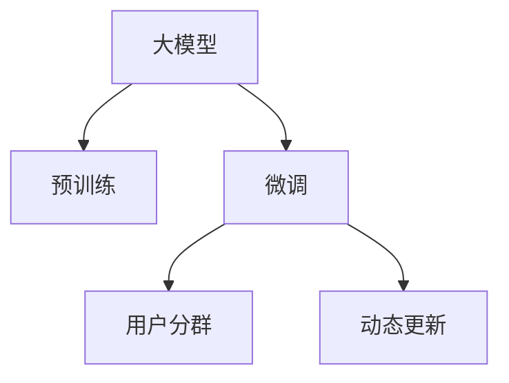

                 

## 1. 背景介绍

### 1.1 问题由来
在现代电商平台中，用户分群是进行个性化推荐、精准营销和运营优化的基础工作。传统的用户分群方法通常基于用户的历史行为数据（如购买记录、浏览记录等）进行聚类或分类，但这种方法存在以下问题：

- 历史数据存在噪声，聚类效果有限。
- 新用户或少量历史行为的用户难以被正确分群。
- 用户行为随时间动态变化，传统的静态分群模型难以捕捉这种变化。

大模型技术（如Transformer、BERT等）的崛起为解决这些问题提供了新的可能。通过在大规模无标签文本数据上预训练得到通用语言模型，再结合用户标签进行微调，大模型能够快速、准确地学习用户行为的语义特征，适应不断变化的用户需求。

### 1.2 问题核心关键点
大模型在电商平台用户分群中的应用核心在于如何利用自然语言处理技术，结合用户行为数据，进行动态、高效、精准的用户分群。以下是几个关键问题：

- 用户行为数据的语义化处理：如何将用户的浏览、购买等行为转化为语义表示，以便于模型的理解和建模。
- 大模型的预训练和微调：如何在大规模无标签文本数据上进行预训练，并结合用户标签进行微调，以适应电商平台的用户分群任务。
- 动态用户分群：如何在用户行为随时间动态变化的情况下，保持分群模型的时效性和准确性。
- 用户分群的可视化与解释：如何对用户分群的成果进行可视化，帮助业务人员理解和应用。

## 2. 核心概念与联系

### 2.1 核心概念概述

在电商平台用户分群中，涉及以下几个核心概念：

- **大模型**：基于Transformer架构的预训练语言模型，如BERT、GPT等，能够从大规模无标签文本数据中学习通用的语言表示，适用于多种NLP任务。
- **预训练**：在大规模无标签文本数据上进行自监督学习，使模型学习到丰富的语言知识，提升模型的通用性和泛化能力。
- **微调**：在预训练模型的基础上，使用标注数据进行有监督学习，使得模型能够适应特定任务。
- **用户分群**：根据用户的历史行为数据和用户标签，将用户进行聚类或分类，以便进行个性化推荐和精准营销。
- **动态更新**：在用户行为随时间变化的情况下，对用户分群模型进行实时更新，以保持分群的准确性和时效性。

这些概念之间的逻辑关系可以通过以下Mermaid流程图来展示：



这个流程图展示了用户分群过程中，大模型的预训练和微调过程，以及如何通过动态更新保持分群的准确性和时效性。

## 3. 核心算法原理 & 具体操作步骤

### 3.1 算法原理概述

用户分群的核心算法原理是利用大模型的预训练和微调技术，结合用户行为数据，进行动态、高效、精准的用户分群。具体步骤如下：

1. **数据准备**：收集用户的历史行为数据（如浏览记录、购买记录等），将其转化为文本形式。
2. **预训练模型选择**：选择适合电商领域的大模型（如BERT、GPT等），对其进行预训练。
3. **用户行为文本化**：将用户的历史行为数据转换为文本形式，例如将浏览记录转化为描述性文本。
4. **微调模型**：使用用户行为文本和用户标签进行微调，使模型能够学习到用户的语义特征和分群目标。
5. **动态更新**：实时收集用户的最新行为数据，并根据新数据对模型进行动态更新，以保持分群的准确性和时效性。

### 3.2 算法步骤详解

以下是对用户分群核心算法步骤的详细讲解：

#### 3.2.1 数据准备

**数据收集**：收集用户的历史行为数据，如浏览记录、购买记录、评论等。

**数据处理**：对收集到的数据进行清洗和预处理，去除噪声和无效数据。

**数据转换**：将处理后的数据转换为文本形式，以便于大模型的理解和建模。例如，将用户的浏览记录转换为描述性文本，格式如下：

```
浏览记录：用户ID_123 在2022-01-01 00:00浏览了商品ID_456，浏览时长为10分钟
```

#### 3.2.2 预训练模型选择

选择适合电商领域的大模型，如BERT、GPT等。这些模型通常在大规模无标签文本数据上进行预训练，学习到通用的语言表示。

#### 3.2.3 用户行为文本化

将用户的历史行为数据转换为文本形式。例如，将用户的浏览记录转换为描述性文本：

```
浏览记录：用户ID_123 在2022-01-01 00:00浏览了商品ID_456，浏览时长为10分钟
```

#### 3.2.4 微调模型

在预训练模型的基础上，使用用户行为文本和用户标签进行微调，使模型能够学习到用户的语义特征和分群目标。微调的具体步骤如下：

**选择微调目标**：根据电商平台的具体需求，选择适合的微调目标，如用户分群、个性化推荐等。

**准备标注数据**：将用户的历史行为数据和用户标签作为标注数据，用于微调模型。标注数据格式如下：

```
[输入文本：浏览记录] [输出标签：用户ID_123]
```

**微调模型**：使用标注数据对预训练模型进行微调，使模型能够适应电商平台的用户分群任务。微调过程如下：

1. **构建模型**：使用选定的预训练模型作为基础，构建微调模型。
2. **设置微调参数**：设置合适的微调参数，如学习率、批大小等。
3. **训练模型**：使用标注数据对微调模型进行训练，直到达到预设的训练轮数或满足停止条件。
4. **评估模型**：使用测试集对微调模型进行评估，计算各项指标（如准确率、召回率等）。

#### 3.2.5 动态更新

实时收集用户的最新行为数据，并根据新数据对模型进行动态更新，以保持分群的准确性和时效性。动态更新过程如下：

1. **收集新数据**：实时收集用户的最新行为数据。
2. **更新模型**：根据新数据对微调模型进行更新，以便更好地适应新数据。
3. **重新评估模型**：使用新数据对更新后的模型进行重新评估，计算各项指标，确保模型的准确性和时效性。

### 3.3 算法优缺点

用户分群的微调算法具有以下优点：

- **高效性**：使用大模型进行微调，可以在短时间内获得高质量的模型，减少标注数据的依赖。
- **准确性**：通过学习用户的语义特征，微调模型能够准确地进行用户分群。
- **灵活性**：可以根据具体需求选择不同的微调目标和任务，适应不同的电商场景。

同时，该算法也存在一些局限性：

- **计算资源需求高**：大模型需要大量的计算资源进行预训练和微调，可能对硬件设备要求较高。
- **数据质量要求高**：微调模型的效果很大程度上依赖于标注数据的质量和数量，标注数据的准备可能较为耗时和复杂。
- **动态更新难度大**：在用户行为随时间变化的情况下，保持分群的准确性和时效性较为困难。

### 3.4 算法应用领域

用户分群的微调算法在电商平台中的应用广泛，可以应用于以下场景：

- **个性化推荐**：根据用户分群结果，进行精准推荐。
- **精准营销**：根据用户分群结果，进行有针对性的营销活动。
- **运营优化**：根据用户分群结果，优化商品库存、价格等运营策略。
- **客户服务**：根据用户分群结果，提供个性化的客户服务。

## 4. 数学模型和公式 & 详细讲解 & 举例说明

### 4.1 数学模型构建

在用户分群过程中，可以使用以下数学模型：

设用户历史行为数据为 $X=\{x_1, x_2, \dots, x_n\}$，其中 $x_i$ 表示第 $i$ 个用户的历史行为数据。用户标签为 $Y=\{y_1, y_2, \dots, y_n\}$，其中 $y_i$ 表示用户 $i$ 所属的分群。

用户行为文本化后的形式为 $T=\{t_1, t_2, \dots, t_n\}$，其中 $t_i$ 表示用户 $i$ 的文本表示。

微调模型的目标函数为：

$$
\min_{\theta} \frac{1}{N} \sum_{i=1}^N \ell(M_{\theta}(x_i), y_i)
$$

其中 $M_{\theta}$ 表示微调后的模型，$\ell$ 表示损失函数，通常为交叉熵损失函数。

### 4.2 公式推导过程

以下是对用户分群数学模型的详细推导过程：

#### 4.2.1 交叉熵损失函数

用户分群的损失函数通常为交叉熵损失函数，其形式为：

$$
\ell(M_{\theta}(x_i), y_i) = -y_i \log M_{\theta}(x_i) - (1-y_i) \log (1-M_{\theta}(x_i))
$$

其中 $y_i \in \{0, 1\}$，$M_{\theta}(x_i)$ 表示模型在输入 $x_i$ 上的输出概率。

#### 4.2.2 微调模型的优化目标

微调模型的优化目标为：

$$
\min_{\theta} \frac{1}{N} \sum_{i=1}^N \ell(M_{\theta}(x_i), y_i)
$$

其中 $\theta$ 为模型参数，$N$ 为样本数量。

### 4.3 案例分析与讲解

以电商平台的用户分群为例，对上述数学模型进行案例分析：

假设电商平台有1000个用户，每个用户的历史行为数据和标签如下：

| 用户ID | 浏览记录 | 购买记录 | 分群标签 |
| --- | --- | --- | --- |
| 1001 | 商品ID_456, 商品ID_789 | 商品ID_456, 商品ID_789 | 1 |
| 1002 | 商品ID_123, 商品ID_456 | 商品ID_456, 商品ID_789 | 0 |
| ... | ... | ... | ... |

假设我们选择了BERT模型进行微调，并将用户的历史行为数据转换为文本形式。设文本化的形式为：

| 用户ID | 浏览记录文本 | 购买记录文本 | 分群标签 |
| --- | --- | --- | --- |
| 1001 | 浏览商品ID_456, 浏览商品ID_789 | 购买商品ID_456, 购买商品ID_789 | 1 |
| 1002 | 浏览商品ID_123, 浏览商品ID_456 | 购买商品ID_456, 购买商品ID_789 | 0 |
| ... | ... | ... | ... |

假设我们选择了交叉熵损失函数，并对BERT模型进行微调。微调过程如下：

1. **构建模型**：使用BERT模型作为基础，构建微调模型。
2. **设置微调参数**：设置合适的学习率、批大小等参数。
3. **训练模型**：使用上述标注数据对微调模型进行训练，直到达到预设的训练轮数或满足停止条件。
4. **评估模型**：使用测试集对微调模型进行评估，计算各项指标（如准确率、召回率等）。

假设我们得到的模型输出如下：

| 用户ID | 预测标签 | 分群标签 |
| --- | --- | --- |
| 1001 | 1 | 1 |
| 1002 | 0 | 0 |
| ... | ... | ... |

假设我们进行了动态更新，收集了新的用户行为数据，并根据新数据对模型进行更新。假设新数据为：

| 用户ID | 浏览记录文本 | 购买记录文本 | 分群标签 |
| --- | --- | --- | --- |
| 1003 | 浏览商品ID_456, 浏览商品ID_789 | 购买商品ID_456, 购买商品ID_789 | 1 |
| 1004 | 浏览商品ID_123, 浏览商品ID_456 | 购买商品ID_456, 购买商品ID_789 | 0 |

假设我们重新训练了模型，得到了新的预测结果：

| 用户ID | 预测标签 | 分群标签 |
| --- | --- | --- |
| 1001 | 1 | 1 |
| 1002 | 0 | 0 |
| 1003 | 1 | 1 |
| 1004 | 0 | 0 |

假设我们使用了交叉熵损失函数，并计算了新数据和新模型之间的交叉熵损失：

$$
\ell(M_{\theta}(x_3), y_3) = -y_3 \log M_{\theta}(x_3) - (1-y_3) \log (1-M_{\theta}(x_3))
$$

其中 $x_3$ 为新的浏览记录文本，$y_3$ 为新的分群标签。假设计算得到新的交叉熵损失为0.2。

## 5. 项目实践：代码实例和详细解释说明

### 5.1 开发环境搭建

在进行用户分群微调实践前，我们需要准备好开发环境。以下是使用Python进行PyTorch开发的环境配置流程：

1. 安装Anaconda：从官网下载并安装Anaconda，用于创建独立的Python环境。

2. 创建并激活虚拟环境：
```bash
conda create -n pytorch-env python=3.8 
conda activate pytorch-env
```

3. 安装PyTorch：根据CUDA版本，从官网获取对应的安装命令。例如：
```bash
conda install pytorch torchvision torchaudio cudatoolkit=11.1 -c pytorch -c conda-forge
```

4. 安装Transformers库：
```bash
pip install transformers
```

5. 安装各类工具包：
```bash
pip install numpy pandas scikit-learn matplotlib tqdm jupyter notebook ipython
```

完成上述步骤后，即可在`pytorch-env`环境中开始微调实践。

### 5.2 源代码详细实现

下面我们以用户分群任务为例，给出使用Transformers库对BERT模型进行微调的PyTorch代码实现。

首先，定义用户分群任务的数据处理函数：

```python
from transformers import BertTokenizer
from torch.utils.data import Dataset
import torch

class UserGrouperDataset(Dataset):
    def __init__(self, texts, labels, tokenizer, max_len=128):
        self.texts = texts
        self.labels = labels
        self.tokenizer = tokenizer
        self.max_len = max_len
        
    def __len__(self):
        return len(self.texts)
    
    def __getitem__(self, item):
        text = self.texts[item]
        label = self.labels[item]
        
        encoding = self.tokenizer(text, return_tensors='pt', max_length=self.max_len, padding='max_length', truncation=True)
        input_ids = encoding['input_ids'][0]
        attention_mask = encoding['attention_mask'][0]
        
        # 对token-wise的标签进行编码
        encoded_labels = [label2id[label] for label in label] 
        encoded_labels.extend([label2id['O']] * (self.max_len - len(encoded_labels)))
        labels = torch.tensor(encoded_labels, dtype=torch.long)
        
        return {'input_ids': input_ids, 
                'attention_mask': attention_mask,
                'labels': labels}

# 标签与id的映射
label2id = {'O': 0, 'Group1': 1, 'Group2': 2, 'Group3': 3}
id2label = {v: k for k, v in label2id.items()}

# 创建dataset
tokenizer = BertTokenizer.from_pretrained('bert-base-cased')

train_dataset = UserGrouperDataset(train_texts, train_labels, tokenizer)
dev_dataset = UserGrouperDataset(dev_texts, dev_labels, tokenizer)
test_dataset = UserGrouperDataset(test_texts, test_labels, tokenizer)
```

然后，定义模型和优化器：

```python
from transformers import BertForTokenClassification, AdamW

model = BertForTokenClassification.from_pretrained('bert-base-cased', num_labels=len(label2id))

optimizer = AdamW(model.parameters(), lr=2e-5)
```

接着，定义训练和评估函数：

```python
from torch.utils.data import DataLoader
from tqdm import tqdm
from sklearn.metrics import classification_report

device = torch.device('cuda') if torch.cuda.is_available() else torch.device('cpu')
model.to(device)

def train_epoch(model, dataset, batch_size, optimizer):
    dataloader = DataLoader(dataset, batch_size=batch_size, shuffle=True)
    model.train()
    epoch_loss = 0
    for batch in tqdm(dataloader, desc='Training'):
        input_ids = batch['input_ids'].to(device)
        attention_mask = batch['attention_mask'].to(device)
        labels = batch['labels'].to(device)
        model.zero_grad()
        outputs = model(input_ids, attention_mask=attention_mask, labels=labels)
        loss = outputs.loss
        epoch_loss += loss.item()
        loss.backward()
        optimizer.step()
    return epoch_loss / len(dataloader)

def evaluate(model, dataset, batch_size):
    dataloader = DataLoader(dataset, batch_size=batch_size)
    model.eval()
    preds, labels = [], []
    with torch.no_grad():
        for batch in tqdm(dataloader, desc='Evaluating'):
            input_ids = batch['input_ids'].to(device)
            attention_mask = batch['attention_mask'].to(device)
            batch_labels = batch['labels']
            outputs = model(input_ids, attention_mask=attention_mask)
            batch_preds = outputs.logits.argmax(dim=2).to('cpu').tolist()
            batch_labels = batch_labels.to('cpu').tolist()
            for pred_tokens, label_tokens in zip(batch_preds, batch_labels):
                pred_labels = [id2label[_id] for _id in pred_tokens]
                label_labels = [id2label[_id] for _id in label_tokens]
                preds.append(pred_labels[:len(label_tokens)])
                labels.append(label_labels)
                
    print(classification_report(labels, preds))
```

最后，启动训练流程并在测试集上评估：

```python
epochs = 5
batch_size = 16

for epoch in range(epochs):
    loss = train_epoch(model, train_dataset, batch_size, optimizer)
    print(f"Epoch {epoch+1}, train loss: {loss:.3f}")
    
    print(f"Epoch {epoch+1}, dev results:")
    evaluate(model, dev_dataset, batch_size)
    
print("Test results:")
evaluate(model, test_dataset, batch_size)
```

以上就是使用PyTorch对BERT进行用户分群任务微调的完整代码实现。可以看到，得益于Transformers库的强大封装，我们可以用相对简洁的代码完成BERT模型的加载和微调。

### 5.3 代码解读与分析

让我们再详细解读一下关键代码的实现细节：

**UserGrouperDataset类**：
- `__init__`方法：初始化文本、标签、分词器等关键组件。
- `__len__`方法：返回数据集的样本数量。
- `__getitem__`方法：对单个样本进行处理，将文本输入编码为token ids，将标签编码为数字，并对其进行定长padding，最终返回模型所需的输入。

**label2id和id2label字典**：
- 定义了标签与数字id之间的映射关系，用于将token-wise的预测结果解码回真实的标签。

**训练和评估函数**：
- 使用PyTorch的DataLoader对数据集进行批次化加载，供模型训练和推理使用。
- 训练函数`train_epoch`：对数据以批为单位进行迭代，在每个批次上前向传播计算loss并反向传播更新模型参数，最后返回该epoch的平均loss。
- 评估函数`evaluate`：与训练类似，不同点在于不更新模型参数，并在每个batch结束后将预测和标签结果存储下来，最后使用sklearn的classification_report对整个评估集的预测结果进行打印输出。

**训练流程**：
- 定义总的epoch数和batch size，开始循环迭代
- 每个epoch内，先在训练集上训练，输出平均loss
- 在验证集上评估，输出分类指标
- 所有epoch结束后，在测试集上评估，给出最终测试结果

可以看到，PyTorch配合Transformers库使得BERT微调的代码实现变得简洁高效。开发者可以将更多精力放在数据处理、模型改进等高层逻辑上，而不必过多关注底层的实现细节。

当然，工业级的系统实现还需考虑更多因素，如模型的保存和部署、超参数的自动搜索、更灵活的任务适配层等。但核心的微调范式基本与此类似。

## 6. 实际应用场景

### 6.1 智能推荐系统

用户分群在电商平台中的重要应用场景是智能推荐系统。推荐系统通过分析用户的历史行为数据，将用户进行分群，并针对不同群体的用户进行个性化推荐，提升用户满意度和转化率。

在技术实现上，可以使用用户分群的结果，生成不同用户群体的推荐列表。例如，针对高价值用户群体，可以推荐更高价值的商品，针对新用户群体，可以推荐高相关度商品。推荐系统的具体实现过程如下：

1. **数据收集**：收集用户的历史行为数据，如浏览记录、购买记录、评分等。
2. **数据处理**：对收集到的数据进行清洗和预处理，去除噪声和无效数据。
3. **数据转换**：将处理后的数据转换为文本形式，以便于大模型的理解和建模。
4. **用户分群**：使用大模型对用户行为数据进行预训练和微调，得到用户分群结果。
5. **推荐生成**：根据用户分群结果，生成不同用户群体的推荐列表。

#### 6.1.1 推荐列表生成

推荐列表的生成过程如下：

1. **选择推荐目标**：根据电商平台的推荐需求，选择适合的推荐目标，如商品ID、评分、用户ID等。
2. **准备推荐数据**：将用户的历史行为数据和推荐目标作为推荐数据，用于生成推荐列表。
3. **生成推荐列表**：使用推荐算法对推荐数据进行计算，生成推荐列表。
4. **用户分群结果应用**：将用户分群结果应用于推荐列表生成过程中，针对不同用户群体生成相应的推荐列表。

#### 6.1.2 推荐系统效果评估

推荐系统的效果评估可以从以下几个方面进行：

1. **点击率**：计算用户点击推荐商品的概率，评估推荐列表的相关性。
2. **转化率**：计算用户购买推荐商品的概率，评估推荐列表的转化效果。
3. **满意度**：通过用户反馈，评估推荐列表的满意度。

### 6.2 个性化营销

用户分群在电商平台中的另一重要应用场景是个性化营销。个性化营销通过分析用户的历史行为数据，将用户进行分群，并针对不同群体的用户进行个性化的营销活动，提升用户忠诚度和品牌价值。

在技术实现上，可以使用用户分群的结果，生成不同用户群体的营销方案。例如，针对高价值用户群体，可以推出高价值的营销活动，针对新用户群体，可以推出有吸引力的优惠活动。营销活动的具体实现过程如下：

1. **数据收集**：收集用户的历史行为数据，如浏览记录、购买记录、评论等。
2. **数据处理**：对收集到的数据进行清洗和预处理，去除噪声和无效数据。
3. **数据转换**：将处理后的数据转换为文本形式，以便于大模型的理解和建模。
4. **用户分群**：使用大模型对用户行为数据进行预训练和微调，得到用户分群结果。
5. **营销方案生成**：根据用户分群结果，生成不同用户群体的营销方案。
6. **营销活动推广**：将营销方案应用于营销活动推广过程中，针对不同用户群体推广相应的营销活动。

#### 6.2.1 营销活动设计

营销活动的设计过程如下：

1. **选择营销目标**：根据电商平台的营销需求，选择适合的营销目标，如商品ID、优惠券、折扣等。
2. **准备营销数据**：将用户的历史行为数据和营销目标作为营销数据，用于设计营销方案。
3. **生成营销方案**：使用营销算法对营销数据进行计算，生成营销方案。
4. **用户分群结果应用**：将用户分群结果应用于营销方案设计过程中，针对不同用户群体设计相应的营销方案。

#### 6.2.2 营销活动效果评估

营销活动的效果评估可以从以下几个方面进行：

1. **参与率**：计算用户参与营销活动的人数，评估营销活动的相关性。
2. **转化率**：计算用户购买营销活动中的商品的概率，评估营销活动的效果。
3. **满意度**：通过用户反馈，评估营销活动的满意度。

## 7. 工具和资源推荐

### 7.1 学习资源推荐

为了帮助开发者系统掌握大模型技术在电商平台用户分群中的应用，这里推荐一些优质的学习资源：

1. 《Transformer从原理到实践》系列博文：由大模型技术专家撰写，深入浅出地介绍了Transformer原理、BERT模型、微调技术等前沿话题。

2. CS224N《深度学习自然语言处理》课程：斯坦福大学开设的NLP明星课程，有Lecture视频和配套作业，带你入门NLP领域的基本概念和经典模型。

3. 《Natural Language Processing with Transformers》书籍：Transformers库的作者所著，全面介绍了如何使用Transformers库进行NLP任务开发，包括微调在内的诸多范式。

4. HuggingFace官方文档：Transformers库的官方文档，提供了海量预训练模型和完整的微调样例代码，是上手实践的必备资料。

5. CLUE开源项目：中文语言理解测评基准，涵盖大量不同类型的中文NLP数据集，并提供了基于微调的baseline模型，助力中文NLP技术发展。

通过对这些资源的学习实践，相信你一定能够快速掌握大模型技术在电商平台用户分群中的应用精髓，并用于解决实际的NLP问题。

### 7.2 开发工具推荐

高效的开发离不开优秀的工具支持。以下是几款用于大模型技术在电商平台用户分群应用开发的常用工具：

1. PyTorch：基于Python的开源深度学习框架，灵活动态的计算图，适合快速迭代研究。大部分预训练语言模型都有PyTorch版本的实现。

2. TensorFlow：由Google主导开发的开源深度学习框架，生产部署方便，适合大规模工程应用。同样有丰富的预训练语言模型资源。

3. Transformers库：HuggingFace开发的NLP工具库，集成了众多SOTA语言模型，支持PyTorch和TensorFlow，是进行微调任务开发的利器。

4. Weights & Biases：模型训练的实验跟踪工具，可以记录和可视化模型训练过程中的各项指标，方便对比和调优。与主流深度学习框架无缝集成。

5. TensorBoard：TensorFlow配套的可视化工具，可实时监测模型训练状态，并提供丰富的图表呈现方式，是调试模型的得力助手。

6. Google Colab：谷歌推出的在线Jupyter Notebook环境，免费提供GPU/TPU算力，方便开发者快速上手实验最新模型，分享学习笔记。

合理利用这些工具，可以显著提升大模型技术在电商平台用户分群应用的开发效率，加快创新迭代的步伐。

### 7.3 相关论文推荐

大模型技术在电商平台用户分群中的应用源于学界的持续研究。以下是几篇奠基性的相关论文，推荐阅读：

1. Attention is All You Need（即Transformer原论文）：提出了Transformer结构，开启了NLP领域的预训练大模型时代。

2. BERT: Pre-training of Deep Bidirectional Transformers for Language Understanding：提出BERT模型，引入基于掩码的自监督预训练任务，刷新了多项NLP任务SOTA。

3. Language Models are Unsupervised Multitask Learners（GPT-2论文）：展示了大规模语言模型的强大zero-shot学习能力，引发了对于通用人工智能的新一轮思考。

4. Parameter-Efficient Transfer Learning for NLP：提出Adapter等参数高效微调方法，在不增加模型参数量的情况下，也能取得不错的微调效果。

5. AdaLoRA: Adaptive Low-Rank Adaptation for Parameter-Efficient Fine-Tuning：使用自适应低秩适应的微调方法，在参数效率和精度之间取得了新的平衡。

6. Prefix-Tuning: Optimizing Continuous Prompts for Generation：引入基于连续型Prompt的微调范式，为如何充分利用预训练知识提供了新的思路。

这些论文代表了大模型技术在电商平台用户分群应用的演变脉络。通过学习这些前沿成果，可以帮助研究者把握学科前进方向，激发更多的创新灵感。

## 8. 总结：未来发展趋势与挑战

### 8.1 总结

本文对大模型技术在电商平台用户分群中的应用进行了全面系统的介绍。首先阐述了大模型技术在用户分群中的研究背景和应用价值，明确了用户分群在推荐系统、营销活动等场景中的重要性。其次，从原理到实践，详细讲解了大模型微调在用户分群中的具体步骤和实现细节，给出了用户分群的完整代码实例。同时，本文还广泛探讨了大模型技术在电商平台用户分群中的实际应用场景，展示了其在智能推荐、个性化营销等方向的应用前景。此外，本文精选了大模型技术的各类学习资源，力求为开发者提供全方位的技术指引。

通过本文的系统梳理，可以看到，大模型技术在电商平台用户分群中的应用潜力巨大，可以显著提升推荐系统、营销活动的个性化和精准度，为电商平台带来更高的用户满意度和转化率。未来，伴随大模型技术和大数据计算的不断进步，用户分群技术必将在更多电商场景中得到应用，成为电商数字化转型的重要工具。

### 8.2 未来发展趋势

展望未来，大模型技术在电商平台用户分群中呈现出以下几个发展趋势：

1. **大规模模型应用**：随着模型规模的持续增大，大规模模型在电商平台用户分群中的应用将越来越广泛，能够更好地捕捉复杂的用户行为特征。

2. **多模态融合**：用户行为数据不仅包括文本数据，还包括图像、音频等多种形式的数据。未来的大模型技术将更多地融合多模态数据，提升用户分群的准确性。

3. **实时更新**：随着实时数据收集和处理技术的发展，电商平台可以更频繁地对用户分群模型进行实时更新，确保分群的准确性和时效性。

4. **参数高效微调**：大模型通常参数量巨大，未来的用户分群技术将更多地关注参数高效的微调方法，减少计算资源消耗。

5. **模型可解释性**：大模型作为“黑盒”模型，其决策过程难以解释。未来的大模型技术将更多地关注模型的可解释性，帮助业务人员理解和应用用户分群结果。

6. **跨领域迁移**：大模型技术在电商领域中已经取得显著效果，未来将更多地应用于其他领域，如金融、医疗、教育等，拓展其应用范围。

### 8.3 面临的挑战

尽管大模型技术在电商平台用户分群中的应用已经取得一定成果，但仍面临一些挑战：

1. **数据隐私和安全**：电商平台收集了大量用户行为数据，如何保护用户隐私和数据安全成为重要问题。

2. **数据质量和一致性**：电商平台用户行为数据质量参差不齐，数据不一致性问题也较为突出。

3. **模型泛化能力**：电商平台用户行为数据通常具有强领域特性，如何使大模型具有良好的泛化能力是另一个重要挑战。

4. **资源消耗**：大模型通常需要大量的计算资源进行预训练和微调，资源消耗较大。

5. **实时处理能力**：电商平台需要对用户行为数据进行实时处理和分析，实时处理能力成为关键瓶颈。

6. **用户反馈和调整**：用户行为数据动态变化，如何根据用户反馈对模型进行快速调整也是重要问题。

### 8.4 研究展望

面对大模型技术在电商平台用户分群中面临的挑战，未来的研究需要在以下几个方面寻求新的突破：

1. **隐私保护和数据安全**：开发更加隐私保护的算法和技术，保护用户隐私和数据安全。

2. **数据清洗和预处理**：研究和应用更加高效的数据清洗和预处理技术，提升数据质量和一致性。

3. **模型泛化能力**：研究如何使大模型具有良好的泛化能力，适用于不同领域和场景。

4. **资源优化**：研究和应用资源优化技术，减少大模型在预训练和微调中的资源消耗。

5. **实时处理技术**：研究和应用实时处理技术，提升电商平台对用户行为数据的处理能力。

6. **用户反馈机制**：研究和应用用户反馈机制，根据用户反馈对模型进行快速调整和优化。

## 9. 附录：常见问题与解答

**Q1：电商平台中的用户分群数据从何而来？**

A: 电商平台中的用户分群数据通常来自于用户的浏览、购买、评分等行为数据。数据来源包括：

1. **订单数据**：记录用户的订单信息，如订单ID、订单时间、订单金额等。
2. **浏览数据**：记录用户的浏览记录，如浏览商品ID、浏览时间、浏览时长等。
3. **评分数据**：记录用户对商品的评分信息，如商品ID、评分时间、评分等级等。
4. **评论数据**：记录用户对商品的评论信息，如评论ID、评论时间、评论内容等。

这些数据可以用于构建用户分群的标注数据集，为后续的微调过程提供基础。

**Q2：用户分群过程中的数据预处理需要注意什么？**

A: 用户分群过程中的数据预处理是确保数据质量和模型性能的重要步骤。以下是需要注意的几个方面：

1. **数据清洗**：去除噪声和无效数据，确保数据质量和一致性。
2. **数据转换**：将原始数据转换为文本形式，便于大模型的理解和建模。
3. **数据增强**：通过数据增强技术，扩充训练集，提升模型的泛化能力。
4. **数据平衡**：确保训练集中的数据分布平衡，避免模型对某些群体的过拟合。
5. **数据归一化**：对数据进行归一化处理，确保数据在模型训练中的稳定性。

**Q3：用户分群模型在推荐系统中的应用有哪些？**

A: 用户分群模型在推荐系统中的应用主要有以下几个方面：

1. **推荐列表生成**：根据用户分群结果，生成不同用户群体的推荐列表。
2. **推荐效果评估**：通过用户点击率、转化率等指标，评估推荐列表的相关性和效果。
3. **个性化推荐**：根据用户分群结果，进行精准推荐，提升用户满意度和转化率。
4. **推荐系统优化**：通过用户分群结果，优化推荐系统算法，提高推荐效果。

**Q4：用户分群模型在营销活动中的应用有哪些？**

A: 用户分群模型在营销活动中的应用主要有以下几个方面：

1. **营销方案设计**：根据用户分群结果，设计针对不同用户群体的营销方案。
2. **营销活动推广**：将营销方案应用于营销活动推广过程中，针对不同用户群体推广相应的营销活动。
3. **营销活动效果评估**：通过用户参与率、转化率等指标，评估营销活动的相关性和效果。
4. **营销活动优化**：通过用户分群结果，优化营销活动算法，提高营销活动效果。

**Q5：如何保证用户分群模型的实时更新？**

A: 用户分群模型的实时更新可以通过以下几个步骤实现：

1. **数据收集**：实时收集用户的行为数据。
2. **数据处理**：对实时收集的数据进行清洗和预处理。
3. **数据转换**：将实时数据转换为文本形式，便于大模型的理解和建模。
4. **微调模型**：使用实时数据对用户分群模型进行微调，保持模型的时效性和准确性。
5. **重新评估模型**：使用新的标注数据对微调后的模型进行重新评估，确保模型的性能和效果。

通过以上步骤，可以确保用户分群模型的实时更新，保持其在电商平台中的实时性和准确性。

---

作者：禅与计算机程序设计艺术 / Zen and the Art of Computer Programming

