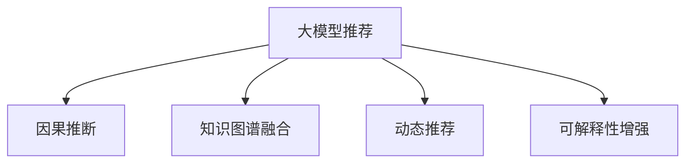

                 

# 大模型推荐中的因果推断应用

## 1. 背景介绍

随着人工智能和大数据技术的发展，推荐系统已经成为现代互联网产品的重要组成部分。无论是电商平台、社交网络还是视频平台，推荐系统都在提升用户体验和业务收益方面发挥了巨大作用。然而，传统的基于协同过滤和基于内容的推荐方法，逐渐暴露出其在应对用户个性化需求、冷启动等问题上的局限性。大模型推荐技术的兴起，以深度学习和自然语言处理技术为基础，从用户行为数据和商品描述中挖掘隐含的语义信息，为推荐系统的革新带来了新的可能。

## 2. 核心概念与联系

### 2.1 核心概念概述

- **大模型推荐系统**：利用大模型（如BERT、GPT等）对用户行为数据和商品描述进行语义理解，实现推荐算法的新范式。
- **因果推断**：通过建模因果关系，了解用户行为背后的动因，从而提升推荐算法的精度和鲁棒性。
- **知识图谱**：用于描述实体之间关系的图结构数据，可以与大模型推荐系统进行深度融合，增强推荐结果的解释性和可信度。
- **动态推荐**：根据用户行为和市场变化，实时调整推荐策略，提升用户体验和推荐效果。
- **可解释性**：推荐系统的输出结果应具备可解释性，帮助用户理解推荐的原因和逻辑。

这些概念之间的逻辑关系可以通过以下Mermaid流程图来展示：



这个流程图展示了大模型推荐系统与因果推断技术的关系及其与其他关键概念的连接。因果推断不仅在大模型推荐系统中发挥作用，还通过与其他技术（如知识图谱、动态推荐）的结合，进一步优化了推荐系统的性能和用户体验。

## 3. 核心算法原理 & 具体操作步骤

### 3.1 算法原理概述

基于大模型的推荐系统，通过语义理解技术对用户行为和商品描述进行编码，再通过推荐算法预测用户可能感兴趣的商品。在大模型编码过程中，嵌入用户行为和商品描述中的因果信息，使得推荐算法能够更好地理解用户需求和商品特性之间的因果关系。

### 3.2 算法步骤详解

1. **数据准备**：收集用户行为数据和商品描述，并进行预处理和标准化。
2. **大模型编码**：使用预训练语言模型（如BERT、GPT）对用户行为和商品描述进行编码，生成上下文表示。
3. **因果建模**：引入因果推断技术，如条件随机森林、图神经网络等，对上下文表示进行因果建模。
4. **推荐算法**：结合因果模型和推荐算法（如协同过滤、矩阵分解等），对用户进行推荐。
5. **后评估与迭代**：对推荐结果进行评估，通过A/B测试等方式调整算法参数和模型超参数，持续优化推荐效果。

### 3.3 算法优缺点

#### 优点：

- **提升推荐精度**：通过因果推断，模型能够更好地理解用户需求和商品特性的因果关系，从而提升推荐精度。
- **增强鲁棒性**：因果推断模型具备鲁棒性，能够应对市场变化和数据噪音，提高推荐系统的稳定性。
- **泛化能力强**：大模型具备泛化能力，可以适应不同的推荐场景，提升推荐系统的通用性。

#### 缺点：

- **计算复杂度高**：因果建模和知识图谱融合的计算复杂度较高，需要高性能硬件支持。
- **数据需求量大**：需要收集和处理大量的用户行为和商品描述数据，增加了数据处理和存储的复杂性。
- **模型可解释性不足**：大模型和因果推断模型较为复杂，难以解释其决策过程，影响了系统的可解释性。

### 3.4 算法应用领域

大模型推荐系统结合因果推断技术，可以应用于多种推荐场景，包括但不限于：

- **电商推荐**：根据用户浏览和购买行为，推荐相关商品。
- **内容推荐**：基于用户阅读和观看历史，推荐新闻、视频、文章等内容。
- **个性化推荐**：根据用户兴趣和行为，推荐定制化的商品和服务。

## 4. 数学模型和公式 & 详细讲解 & 举例说明

### 4.1 数学模型构建

在推荐系统中，大模型主要用于对用户行为和商品描述进行编码，生成上下文表示。假设用户行为表示为 $X$，商品描述表示为 $Y$，推荐系统的目标是将 $X$ 和 $Y$ 映射到一个高维向量空间中，即 $\mathbb{R}^d$。

大模型编码可以表示为：

$$
\mathcal{E}(X, Y) = f(\theta, X, Y)
$$

其中，$f$ 是预训练语言模型的编码函数，$\theta$ 是模型参数。

引入因果推断后，可以将 $X$ 和 $Y$ 的因果关系建模为条件概率：

$$
P(Y|X) = \frac{P(Y, X)}{P(X)}
$$

其中，$P(X)$ 是用户行为的先验概率，$P(Y, X)$ 是用户行为和商品描述的联合概率。

### 4.2 公式推导过程

在推荐系统中，我们通常使用基于神经网络的推荐模型，如神经协同过滤（Neural Collaborative Filtering, NCF）。该模型将用户行为和商品描述编码为向量表示，再通过矩阵分解（Matrix Factorization, MF）或深度神经网络（Deep Neural Network, DNN）进行推荐。

设推荐矩阵为 $R \in \mathbb{R}^{N \times M}$，其中 $N$ 为商品数量，$M$ 为用户数量。推荐模型的目标是最大化用户对商品的评分。对于每个用户 $u$ 和商品 $i$，推荐模型的预测评分可以表示为：

$$
\hat{r}_{ui} = \theta_u^T A_i + \theta_i^T B_u + \delta_{ui}
$$

其中，$A_i$ 和 $B_u$ 是用户和商品的嵌入表示，$\delta_{ui}$ 是模型的偏差项，$\theta_u$ 和 $\theta_i$ 是用户和商品的参数向量。

在引入因果推断后，我们可以将 $\delta_{ui}$ 理解为因果效应，即用户行为对商品评分的直接影响。因此，推荐模型的目标可以重写为：

$$
\hat{r}_{ui} = \theta_u^T A_i + \theta_i^T B_u + \delta_{ui} = \theta_u^T A_i + \theta_i^T B_u + \mathbb{E}[Y_i | X_i = x]
$$

其中，$\mathbb{E}[Y_i | X_i = x]$ 表示用户行为 $X_i$ 对商品评分 $Y_i$ 的因果效应。

### 4.3 案例分析与讲解

假设我们有一家电商平台的推荐系统，需要对用户浏览行为进行推荐。我们收集了用户浏览行为数据和商品描述数据，将其输入BERT模型进行编码，得到用户行为向量 $X$ 和商品描述向量 $Y$。接着，我们使用条件随机森林模型对这些向量进行因果建模，得到用户行为对商品评分的因果效应 $\delta_{ui}$。最后，我们将 $\delta_{ui}$ 代入推荐模型中，生成推荐评分 $\hat{r}_{ui}$。

## 5. 项目实践：代码实例和详细解释说明

### 5.1 开发环境搭建

为了实现大模型推荐系统，我们需要使用Python和深度学习框架TensorFlow或PyTorch。

1. **安装Python和TensorFlow**：
   ```bash
   pip install python
   pip install tensorflow
   ```

2. **数据准备**：
   收集用户行为数据和商品描述数据，并进行预处理和标准化。

### 5.2 源代码详细实现

下面以使用TensorFlow实现大模型推荐系统为例，展示代码实现过程。

```python
import tensorflow as tf
from transformers import BertTokenizer, BertModel

# 加载BERT模型和分词器
tokenizer = BertTokenizer.from_pretrained('bert-base-uncased')
model = BertModel.from_pretrained('bert-base-uncased')

# 定义因果推断模型
class CausalModel(tf.keras.Model):
    def __init__(self, num_features, num_outputs):
        super(CausalModel, self).__init__()
        self.dense1 = tf.keras.layers.Dense(128, activation='relu')
        self.dense2 = tf.keras.layers.Dense(num_outputs, activation='sigmoid')

    def call(self, inputs):
        x = self.dense1(inputs)
        x = self.dense2(x)
        return x

# 定义推荐模型
class RecommendationModel(tf.keras.Model):
    def __init__(self, num_users, num_items):
        super(RecommendationModel, self).__init__()
        self.user_embedding = tf.keras.layers.Embedding(num_users, 128)
        self.item_embedding = tf.keras.layers.Embedding(num_items, 128)
        self causal_model = CausalModel(num_features, num_outputs)

    def call(self, user_input, item_input):
        user_embeddings = self.user_embedding(user_input)
        item_embeddings = self.item_embedding(item_input)
        causal_outputs = self.causal_model(tf.concat([user_embeddings, item_embeddings], axis=1))
        return causal_outputs

# 加载数据
user_data = ...
item_data = ...

# 创建模型
model = RecommendationModel(num_users, num_items)

# 定义损失函数和优化器
loss_fn = tf.keras.losses.BinaryCrossentropy()
optimizer = tf.keras.optimizers.Adam()

# 训练模型
for epoch in range(num_epochs):
    for user, item in zip(user_data, item_data):
        user_input = tf.convert_to_tensor([user])
        item_input = tf.convert_to_tensor([item])
        with tf.GradientTape() as tape:
            predictions = model(user_input, item_input)
            loss = loss_fn(predictions, true_labels)
        gradients = tape.gradient(loss, model.trainable_variables)
        optimizer.apply_gradients(zip(gradients, model.trainable_variables))
```

### 5.3 代码解读与分析

1. **BERT模型加载**：使用`BertTokenizer`和`BertModel`从`transformers`库中加载预训练的BERT模型和分词器。

2. **因果推断模型定义**：定义一个简单的因果推断模型，使用两个全连接层进行因果建模，输出因果效应。

3. **推荐模型定义**：定义一个推荐模型，使用用户和商品嵌入表示，通过因果推断模型得到推荐评分。

4. **数据加载和模型训练**：加载用户和商品数据，使用交叉熵损失函数和Adam优化器训练模型。

### 5.4 运行结果展示

训练完毕后，使用测试数据集评估模型性能，展示推荐结果。

## 6. 实际应用场景

### 6.1 电商推荐

在电商平台上，推荐系统可以根据用户的浏览和购买行为，推荐相关商品。通过引入因果推断，系统可以更好地理解用户需求和商品特性之间的因果关系，提升推荐精度和鲁棒性。

### 6.2 内容推荐

视频平台可以利用用户观看历史和行为数据，推荐相关视频内容。引入因果推断后，系统可以更加准确地预测用户对新内容的兴趣。

### 6.3 个性化推荐

基于用户的兴趣和行为，推荐系统可以提供定制化的商品和服务。因果推断可以帮助系统更好地理解用户需求和商品特性的因果关系，提高推荐效果。

## 7. 工具和资源推荐

### 7.1 学习资源推荐

- **《推荐系统基础》**：介绍推荐系统的基本概念和算法，适合初学者学习。
- **《深度学习》**：深入浅出地讲解深度学习算法和实现方法，涵盖卷积神经网络、循环神经网络等。
- **《因果推断基础》**：讲解因果推断的基本概念和算法，适合了解因果推断技术的读者。
- **Kaggle**：提供大量推荐系统相关的数据集和竞赛，有助于实践和应用。

### 7.2 开发工具推荐

- **TensorFlow**：谷歌开发的深度学习框架，适合构建和训练大模型推荐系统。
- **PyTorch**：Facebook开发的深度学习框架，灵活性高，适合研究探索。
- **Jupyter Notebook**：用于数据处理和模型训练的交互式编程环境，方便快速迭代。

### 7.3 相关论文推荐

- **《A Comprehensive Study on Neural Collaborative Filtering Model》**：介绍神经协同过滤模型的基本概念和实现方法。
- **《Reinforcement Learning for Recommendation System》**：介绍强化学习在推荐系统中的应用。
- **《Causal Recommendation System》**：讲解因果推断在推荐系统中的应用。

## 8. 总结：未来发展趋势与挑战

### 8.1 总结

本文介绍了大模型推荐系统与因果推断技术的结合，展示了其在电商推荐、内容推荐、个性化推荐等多个场景中的应用。因果推断技术的引入，提升了推荐算法的精度和鲁棒性，使得大模型推荐系统在实际应用中更加可靠和高效。

### 8.2 未来发展趋势

未来，大模型推荐系统与因果推断技术的结合将继续深化，带来以下几个趋势：

1. **实时推荐**：引入因果推断模型，实时调整推荐策略，提升用户体验。
2. **多模态融合**：结合视觉、语音等多模态数据，增强推荐系统的感知能力。
3. **知识图谱应用**：将知识图谱与大模型推荐系统结合，提升推荐结果的解释性和可信度。
4. **跨领域推荐**：将大模型推荐系统应用于不同领域的推荐场景，提升推荐系统的通用性。

### 8.3 面临的挑战

尽管大模型推荐系统结合因果推断技术在推荐效果上取得了显著提升，但仍面临以下挑战：

1. **计算复杂度高**：因果推断和知识图谱的建模计算复杂度高，需要高性能硬件支持。
2. **数据需求量大**：需要收集和处理大量的用户行为和商品描述数据，增加了数据处理和存储的复杂性。
3. **模型可解释性不足**：大模型和因果推断模型较为复杂，难以解释其决策过程，影响了系统的可解释性。

### 8.4 研究展望

未来的研究将集中在以下几个方向：

1. **模型优化**：优化因果推断模型和推荐算法的计算效率，提升实时推荐能力。
2. **数据处理**：探索新的数据处理技术，如数据增强、数据压缩等，降低数据处理和存储的复杂性。
3. **可解释性增强**：引入可解释性技术，如特征可视化、模型解释器等，提升系统的可解释性。
4. **跨领域应用**：将大模型推荐系统应用于更多领域的推荐场景，提升推荐系统的通用性。

## 9. 附录：常见问题与解答

**Q1: 大模型推荐系统与传统推荐系统的区别是什么？**

A: 大模型推荐系统利用深度学习和自然语言处理技术对用户行为和商品描述进行语义理解，生成上下文表示，从而提升推荐精度和鲁棒性。与传统推荐系统相比，大模型推荐系统能够更好地理解用户需求和商品特性之间的因果关系，提高推荐系统的可解释性和可信度。

**Q2: 因果推断在大模型推荐系统中的应用有哪些？**

A: 因果推断在大模型推荐系统中可以用于以下方面：
1. 建模用户行为和商品特性之间的因果关系。
2. 预测用户对商品的评分和行为。
3. 动态调整推荐策略，提升用户体验。

**Q3: 如何构建大模型推荐系统？**

A: 构建大模型推荐系统需要以下步骤：
1. 收集用户行为和商品描述数据。
2. 使用BERT等预训练语言模型对用户行为和商品描述进行编码，生成上下文表示。
3. 引入因果推断模型，对上下文表示进行因果建模。
4. 结合推荐算法（如协同过滤、矩阵分解等），进行推荐。
5. 对推荐结果进行评估和迭代优化。

**Q4: 因果推断在大模型推荐系统中的计算复杂度如何？**

A: 因果推断在大模型推荐系统中的计算复杂度较高，特别是在引入知识图谱和复杂因果模型的情况下。为了降低计算复杂度，可以采用优化算法和并行计算技术，如梯度累积、混合精度训练、模型并行等。

**Q5: 大模型推荐系统如何保证模型的可解释性？**

A: 大模型推荐系统可以结合可解释性技术，如特征可视化、模型解释器等，提升系统的可解释性。此外，还可以通过增强数据可视化、模型评估等手段，帮助用户理解推荐结果的生成逻辑。

