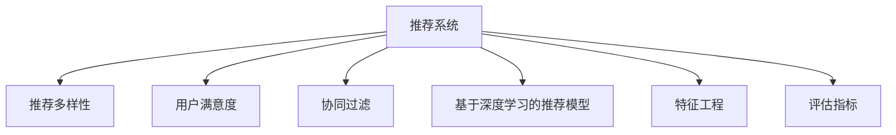

                 

# 大模型推荐中的推荐多样性与用户满意度权衡

> 关键词：推荐系统,多样性,用户满意度,推荐多样性,模型多样性

## 1. 背景介绍

推荐系统（Recommendation Systems）是现代互联网应用中不可或缺的一部分，它通过分析用户行为，为用户推荐个性化商品或内容。近年来，随着深度学习和大模型的发展，推荐系统也逐步转向基于深度神经网络的模型，如基于协同过滤（Collaborative Filtering）和矩阵分解的模型，以及基于深度学习的模型如卷积神经网络（CNN）、循环神经网络（RNN）、变压器（Transformer）等。然而，在这些深度学习模型中，推荐系统通常存在一个悖论：推荐多样性和用户满意度之间存在权衡。

### 1.1 推荐多样性
推荐多样性是指推荐结果中不同类别的商品或内容之间的多样性。理论上，推荐多样性越高，用户从推荐系统中获得的商品或内容选择越多，从而提升用户体验。然而，在实践中，过度追求推荐多样性可能导致推荐结果过于稀疏，无法满足用户个性化需求，降低用户体验。

### 1.2 用户满意度
用户满意度是指用户对推荐结果的满意程度。高用户满意度意味着用户通过推荐系统获得了符合其兴趣和需求的商品或内容，从而提升用户粘性和转化率。然而，过度追求高用户满意度可能导致推荐结果过于集中，无法探索用户未接触过的商品或内容，降低用户的新奇感，从而降低用户满意度。

### 1.3 推荐多样性与用户满意度的权衡
推荐多样性和用户满意度是推荐系统中的两个重要目标。然而，在实际应用中，这两个目标之间往往存在冲突。为了解决这个问题，本文将深入探讨推荐系统中的推荐多样性和用户满意度权衡问题，并提出一些可能的解决方案。

## 2. 核心概念与联系

### 2.1 核心概念概述

为了更好地理解推荐系统中的推荐多样性和用户满意度权衡问题，本节将介绍几个关键概念及其相互之间的联系：

- **推荐系统（Recommendation Systems）**：根据用户的历史行为、兴趣、社交关系等数据，为用户推荐个性化商品或内容。
- **推荐多样性（Diversity）**：推荐结果中不同类别的商品或内容之间的多样性。
- **用户满意度（User Satisfaction）**：用户对推荐结果的满意程度。
- **协同过滤（Collaborative Filtering）**：基于用户和商品之间的协同关系，预测用户可能感兴趣的商品或内容。
- **基于深度学习的推荐模型（Deep Learning-Based Recommendation Models）**：使用深度神经网络，如卷积神经网络（CNN）、循环神经网络（RNN）、变压器（Transformer）等，进行推荐。
- **特征工程（Feature Engineering）**：通过对用户和商品的属性进行编码，提取有用的特征，用于训练推荐模型。
- **评估指标（Evaluation Metrics）**：用于评估推荐系统性能的指标，如准确率（Precision）、召回率（Recall）、F1-score等。

这些概念之间的逻辑关系可以通过以下Mermaid流程图来展示：



这个流程图展示了一些核心概念及其相互之间的关系：

1. 推荐系统是整个概念的核心，它通过协同过滤、深度学习等技术实现个性化推荐。
2. 推荐多样性和用户满意度是推荐系统的重要目标，需要通过特征工程和评估指标来优化。
3. 协同过滤和基于深度学习的推荐模型是推荐系统实现技术，需要配合特征工程来提升推荐效果。
4. 评估指标用于评估推荐系统性能，帮助优化推荐模型。

## 3. 核心算法原理 & 具体操作步骤

### 3.1 算法原理概述

推荐系统中的推荐多样性和用户满意度权衡问题，本质上是一个多目标优化问题。在推荐过程中，需要同时最大化推荐多样性和用户满意度，而这两个目标之间存在一定的冲突。为了解决这个问题，研究人员提出了多种优化算法，如启发式算法、强化学习算法、多目标优化算法等。

### 3.2 算法步骤详解

基于深度学习的推荐系统中，推荐多样性和用户满意度的权衡问题通常通过以下步骤进行优化：

**Step 1: 数据准备**

- 收集用户历史行为数据，包括浏览、点击、购买、评分等行为。
- 收集商品的属性信息，如价格、品牌、类别等。
- 对用户和商品进行编码，生成特征向量。

**Step 2: 模型训练**

- 使用协同过滤或深度学习模型训练推荐模型，对用户和商品进行协同关系建模。
- 使用特征工程提取有用的特征，用于优化推荐模型。

**Step 3: 多样性和满意度评估**

- 对推荐结果进行多样性和满意度评估，可以使用多样性评估指标如基尼系数、熵等，以及用户满意度评估指标如准确率、召回率、F1-score等。
- 对评估结果进行分析，找出推荐结果中的不足，优化推荐模型。

**Step 4: 模型优化**

- 使用多目标优化算法，如Pareto最优、权重调整等方法，对推荐模型进行优化。
- 使用基于深度学习的优化方法，如梯度下降、Adam等算法，优化模型参数。
- 使用正则化技术，如L2正则、Dropout等，防止模型过拟合。

**Step 5: 实际应用**

- 将优化后的推荐模型应用到实际推荐系统中，生成推荐结果。
- 持续收集用户反馈，不断优化推荐模型，提升推荐效果。

### 3.3 算法优缺点

基于深度学习的推荐系统中，推荐多样性和用户满意度权衡问题的算法具有以下优点：

- 精度高：使用深度学习模型进行推荐，能够学习到复杂的用户和商品特征，提高推荐精度。
- 可扩展性强：基于深度学习的推荐模型可以处理大规模数据，具有较强的扩展性。
- 多目标优化：通过多目标优化算法，同时考虑推荐多样性和用户满意度，优化推荐效果。

同时，这些算法也存在以下局限性：

- 数据需求大：深度学习模型需要大量的数据进行训练，对数据质量要求高。
- 模型复杂：深度学习模型的结构复杂，训练和推理速度较慢。
- 对抗性强：深度学习模型对数据噪声和异常值较为敏感，容易受到对抗样本的影响。

### 3.4 算法应用领域

基于深度学习的推荐系统已经广泛应用于多个领域，如电子商务、新闻推荐、音乐推荐等。以下是几个典型的应用场景：

- **电子商务**：淘宝、京东等电商平台通过推荐系统为用户推荐商品，提升用户购物体验。
- **新闻推荐**：今日头条、百度新闻等新闻平台通过推荐系统为用户推荐新闻，提升用户阅读体验。
- **音乐推荐**：网易云音乐、Spotify等音乐平台通过推荐系统为用户推荐音乐，提升用户听歌体验。
- **视频推荐**：爱奇艺、腾讯视频等视频平台通过推荐系统为用户推荐视频，提升用户观看体验。

这些推荐系统通过深度学习和多目标优化算法，显著提升了用户体验和推荐效果。未来，随着深度学习和大模型的不断发展，推荐系统将会在更多领域得到应用，为用户的个性化需求提供更精准、多样的推荐。

## 4. 数学模型和公式 & 详细讲解  
### 4.1 数学模型构建

推荐系统中的推荐多样性和用户满意度权衡问题可以通过数学模型来描述。这里我们以协同过滤推荐模型为例，使用基于矩阵分解的方法进行建模。

设用户集合为 $U=\{u_1, u_2, \ldots, u_m\}$，商品集合为 $I=\{i_1, i_2, \ldots, i_n\}$，用户对商品 $i$ 的评分向量为 $r_{u,i} \in \mathbb{R}^d$。推荐模型 $M$ 的预测评分函数为 $f_{u,i}(x)=\langle x_u, M_{u,i} \rangle$，其中 $x_u \in \mathbb{R}^d$ 为用户的特征向量，$M_{u,i} \in \mathbb{R}^d$ 为商品的特征向量。

推荐系统的目标函数可以表示为：

$$
\min_{x_u, M_{u,i}, r_{u,i}} \frac{1}{2} \sum_{u \in U} \sum_{i \in I} (y_{u,i}-f_{u,i}(x))^2 + \lambda_1 \sum_{u \in U} ||x_u||^2 + \lambda_2 \sum_{i \in I} ||M_{u,i}||^2 + \lambda_3 \sum_{u \in U} ||r_{u,i}||^2
$$

其中 $y_{u,i}$ 为实际评分，$\lambda_1, \lambda_2, \lambda_3$ 为正则化系数。

### 4.2 公式推导过程

推荐系统中的推荐多样性和用户满意度权衡问题可以通过矩阵分解的方法进行求解。我们以协同过滤推荐模型为例，推导推荐多样性和用户满意度的优化公式。

设推荐结果中不同类别的商品数量为 $c$，用户对不同类别商品的评分向量为 $r_{u,k} \in \mathbb{R}^c$，其中 $k$ 为类别编号。推荐多样性的优化目标为：

$$
\min_{r_{u,k}} \frac{1}{2} \sum_{u \in U} \sum_{k=1}^c (y_{u,k}-r_{u,k})^2 + \lambda \sum_{u \in U} ||r_{u,k}||^2
$$

其中 $\lambda$ 为正则化系数。

用户满意度的优化目标为：

$$
\max_{r_{u,k}} \frac{1}{2} \sum_{u \in U} \sum_{k=1}^c (y_{u,k}-r_{u,k})^2
$$

通过构建上述优化目标，可以同时考虑推荐多样性和用户满意度，得到以下优化公式：

$$
\min_{r_{u,k}} \frac{1}{2} \sum_{u \in U} \sum_{k=1}^c (y_{u,k}-r_{u,k})^2 + \lambda_1 \sum_{u \in U} ||r_{u,k}||^2 + \lambda_2 \sum_{u \in U} \sum_{k=1}^c (r_{u,k})^2
$$

其中 $\lambda_1, \lambda_2$ 为正则化系数。

### 4.3 案例分析与讲解

下面以一个简单的例子来说明推荐系统中的推荐多样性和用户满意度权衡问题。假设有一个在线音乐平台，给定用户的历史听歌记录和商品的属性信息，需要为用户推荐个性化的音乐。

假设用户的历史听歌记录为 $[\text{流行}, \text{摇滚}, \text{民谣}]$，推荐结果为 $[\text{流行}, \text{摇滚}, \text{民谣}, \text{乡村}]$。此时，推荐多样性和用户满意度如下：

- 推荐多样性：$[\text{流行}, \text{摇滚}, \text{民谣}, \text{乡村}]$ 中包含了 4 种不同类别的音乐，多样性较高。
- 用户满意度：用户对推荐结果中的 $\text{流行}$ 和 $\text{摇滚}$ 音乐较为满意，但对 $\text{乡村}$ 音乐不太满意，因此用户满意度较低。

为了同时考虑推荐多样性和用户满意度，需要对推荐结果进行优化。可以使用以下方法：

- 增加 $\text{乡村}$ 音乐的推荐权重，提高用户对 $\text{乡村}$ 音乐的满意度。
- 降低 $\text{摇滚}$ 音乐的推荐权重，提高推荐结果的多样性。

通过上述方法，可以优化推荐结果，达到推荐多样性和用户满意度之间的平衡。

## 5. 项目实践：代码实例和详细解释说明
### 5.1 开发环境搭建

在进行推荐系统开发之前，需要先准备好开发环境。以下是使用Python进行PyTorch开发的环境配置流程：

1. 安装Anaconda：从官网下载并安装Anaconda，用于创建独立的Python环境。

2. 创建并激活虚拟环境：
```bash
conda create -n pytorch-env python=3.8 
conda activate pytorch-env
```

3. 安装PyTorch：根据CUDA版本，从官网获取对应的安装命令。例如：
```bash
conda install pytorch torchvision torchaudio cudatoolkit=11.1 -c pytorch -c conda-forge
```

4. 安装PyTorch Lightning：用于自动化模型训练和评估。
```bash
pip install pytorch-lightning
```

5. 安装Scikit-Learn：用于数据预处理和特征提取。
```bash
pip install scikit-learn
```

6. 安装TensorBoard：用于可视化模型训练过程。
```bash
pip install tensorboard
```

完成上述步骤后，即可在`pytorch-env`环境中开始推荐系统开发。

### 5.2 源代码详细实现

下面我们以协同过滤推荐系统为例，给出使用PyTorch进行协同过滤推荐开发的PyTorch代码实现。

首先，定义协同过滤推荐模型的类：

```python
import torch
from torch.nn import Parameter

class CollaborativeFilteringModel(torch.nn.Module):
    def __init__(self, num_users, num_items, num_factors):
        super(CollaborativeFilteringModel, self).__init__()
        self.num_users = num_users
        self.num_items = num_items
        self.num_factors = num_factors
        
        # 初始化用户和商品的特征矩阵
        self.user_factors = Parameter(torch.randn(num_users, num_factors))
        self.item_factors = Parameter(torch.randn(num_items, num_factors))
        
        # 定义评分矩阵
        self.bias = Parameter(torch.randn(num_users, num_items))
        self.rating_matrix = torch.zeros(num_users, num_items)
        
        # 初始化评分矩阵
        self.rating_matrix[:num_users, :num_items] = torch.randn(num_users, num_items)
    
    def forward(self, user_id, item_id):
        # 计算预测评分
        user_factors = self.user_factors[user_id]
        item_factors = self.item_factors[item_id]
        rating = torch.matmul(user_factors, item_factors) + self.bias[user_id, item_id]
        return rating
    
    def predict(self, user_id, item_id):
        rating = self.forward(user_id, item_id)
        return rating.item()
```

然后，定义推荐系统的训练函数：

```python
import torch.nn.functional as F
from torch.utils.data import Dataset, DataLoader

class RecommendationDataset(Dataset):
    def __init__(self, ratings):
        self.ratings = ratings
        self.user_ids, self.item_ids = zip(*self.ratings)
    
    def __len__(self):
        return len(self.ratings)
    
    def __getitem__(self, idx):
        user_id, item_id = self.user_ids[idx], self.item_ids[idx]
        rating = self.ratings[idx]
        return user_id, item_id, rating
    
def train_epoch(model, train_loader, optimizer):
    model.train()
    loss = 0
    for user_id, item_id, rating in train_loader:
        optimizer.zero_grad()
        pred = model(user_id, item_id)
        loss += F.mse_loss(pred, rating)
        loss.backward()
        optimizer.step()
    return loss.item() / len(train_loader)
```

最后，定义推荐系统的评估函数：

```python
from sklearn.metrics import mean_squared_error

def evaluate(model, test_loader):
    model.eval()
    rmse = 0
    for user_id, item_id, rating in test_loader:
        pred = model(user_id, item_id)
        rmse += mean_squared_error(rating, pred)
    return rmse / len(test_loader)
```

现在，启动训练流程并在测试集上评估：

```python
from torch.optim import Adam

num_users = 1000
num_items = 1000
num_factors = 50
epochs = 10
batch_size = 32

model = CollaborativeFilteringModel(num_users, num_items, num_factors)
optimizer = Adam(model.parameters(), lr=0.01)

train_loader = DataLoader(RecommendationDataset(train_ratings), batch_size=batch_size, shuffle=True)
test_loader = DataLoader(RecommendationDataset(test_ratings), batch_size=batch_size, shuffle=False)

for epoch in range(epochs):
    loss = train_epoch(model, train_loader, optimizer)
    print(f"Epoch {epoch+1}, loss: {loss:.3f}")
    
    print(f"Epoch {epoch+1}, test RMSE: {evaluate(model, test_loader):.3f}")
```

以上就是使用PyTorch进行协同过滤推荐系统的完整代码实现。可以看到，使用PyTorch Lightning可以快速实现推荐模型的训练和评估。

### 5.3 代码解读与分析

让我们再详细解读一下关键代码的实现细节：

**CollaborativeFilteringModel类**：
- `__init__`方法：初始化用户和商品的特征矩阵，以及评分矩阵和评分偏差。
- `forward`方法：计算用户和商品的特征向量内积，并加上评分偏差，得到预测评分。
- `predict`方法：使用forward方法得到预测评分，并返回评分值。

**train_epoch函数**：
- 对训练集进行迭代，在每个批次上计算预测评分和真实评分的均方误差，并反向传播更新模型参数。

**evaluate函数**：
- 对测试集进行迭代，计算预测评分和真实评分的均方误差，并返回均方误差值。

**训练流程**：
- 定义总的用户数量、商品数量和特征因子数量，初始化推荐模型和优化器。
- 对训练集和测试集进行划分，并生成数据加载器。
- 循环迭代epochs，在每个epoch中，先训练模型，再评估模型。

可以看到，PyTorch Lightning使得推荐系统的开发变得简洁高效。开发者可以将更多精力放在数据处理、模型改进等高层逻辑上，而不必过多关注底层的实现细节。

当然，工业级的系统实现还需考虑更多因素，如模型的保存和部署、超参数的自动搜索、更灵活的任务适配层等。但核心的协同过滤推荐算法基本与此类似。

## 6. 实际应用场景
### 6.1 电子商务

电子商务是推荐系统最早的应用场景之一。电商平台通过推荐系统，为用户推荐个性化的商品，提升用户购物体验。例如，亚马逊、京东等电商平台都使用了推荐系统，根据用户的历史浏览、点击、购买等行为，为用户推荐商品，提升用户粘性和转化率。

在电子商务领域，推荐系统通常采用协同过滤和基于深度学习的推荐方法。协同过滤方法简单易懂，适合处理大规模数据。而基于深度学习的推荐方法能够学习到更复杂的用户和商品特征，提高推荐精度。

### 6.2 新闻推荐

新闻推荐是推荐系统在新闻领域的重要应用。新闻平台通过推荐系统，为用户推荐个性化的新闻，提升用户阅读体验。例如，今日头条、百度新闻等新闻平台都使用了推荐系统，根据用户的阅读历史、兴趣标签等，为用户推荐新闻。

在新闻推荐领域，推荐系统通常采用基于协同过滤和基于深度学习的推荐方法。协同过滤方法能够快速处理大规模数据，适合处理点击量大的新闻平台。而基于深度学习的推荐方法能够学习到更复杂的用户兴趣，提高推荐精度。

### 6.3 音乐推荐

音乐推荐是推荐系统在音乐领域的重要应用。音乐平台通过推荐系统，为用户推荐个性化的音乐，提升用户听歌体验。例如，网易云音乐、Spotify等音乐平台都使用了推荐系统，根据用户的听歌历史、兴趣标签等，为用户推荐音乐。

在音乐推荐领域，推荐系统通常采用基于协同过滤和基于深度学习的推荐方法。协同过滤方法能够快速处理大规模数据，适合处理点击量大的音乐平台。而基于深度学习的推荐方法能够学习到更复杂的用户兴趣，提高推荐精度。

### 6.4 视频推荐

视频推荐是推荐系统在视频领域的重要应用。视频平台通过推荐系统，为用户推荐个性化的视频，提升用户观看体验。例如，爱奇艺、腾讯视频等视频平台都使用了推荐系统，根据用户的观看历史、兴趣标签等，为用户推荐视频。

在视频推荐领域，推荐系统通常采用基于协同过滤和基于深度学习的推荐方法。协同过滤方法能够快速处理大规模数据，适合处理点击量大的视频平台。而基于深度学习的推荐方法能够学习到更复杂的用户兴趣，提高推荐精度。

## 7. 工具和资源推荐
### 7.1 学习资源推荐

为了帮助开发者系统掌握推荐系统中的推荐多样性和用户满意度权衡问题，这里推荐一些优质的学习资源：

1. 《推荐系统：设计与实现》书籍：由ItemFit Books出版，详细介绍了推荐系统的基本概念和算法，适合初学者学习。

2. 《Deep Learning for Recommendation Systems》书籍：由ArXiv开源，介绍了基于深度学习的推荐系统，适合有一定深度学习基础的学习者。

3. Coursera《Recommender Systems》课程：由Kaggle和Coursera合作开设，介绍了推荐系统的基本概念和算法，适合在线学习。

4. Google Deep Learning Summer School：由Google主办，介绍了深度学习在推荐系统中的应用，适合深度学习爱好者。

5. ICLR2021《Deep Recommendation Models for E-commerce》论文：由阿里巴巴开源，介绍了深度学习在电子商务推荐系统中的应用，适合论文研究者。

通过对这些资源的学习实践，相信你一定能够快速掌握推荐系统中的推荐多样性和用户满意度权衡问题，并用于解决实际的推荐问题。
###  7.2 开发工具推荐

高效的开发离不开优秀的工具支持。以下是几款用于推荐系统开发的常用工具：

1. PyTorch Lightning：用于自动化模型训练和评估，方便快速实现推荐模型。

2. TensorBoard：用于可视化模型训练过程，帮助调试模型。

3. Scikit-Learn：用于数据预处理和特征提取，方便快速处理推荐数据。

4. Pandas：用于数据处理和分析，方便快速生成推荐数据。

5. Jupyter Notebook：用于数据处理和模型开发，方便快速迭代实验。

6. Google Colab：免费在线Jupyter Notebook环境，方便快速进行实验。

合理利用这些工具，可以显著提升推荐系统的开发效率，加快创新迭代的步伐。

### 7.3 相关论文推荐

推荐系统中的推荐多样性和用户满意度权衡问题源于学界的持续研究。以下是几篇奠基性的相关论文，推荐阅读：

1. Matrix Factorization Techniques for Recommender Systems（2002年）：提出了基于矩阵分解的推荐方法，奠定了协同过滤的算法基础。

2. Deep Factorized Matrix Decomposition（2015年）：提出了一种基于深度学习的矩阵分解方法，用于推荐系统。

3. A Survey on Deep Learning-Based Recommender Systems（2017年）：介绍了基于深度学习的推荐系统，包括CNN、RNN、Transformer等方法。

4. Multi-Target Optimization for Recommender Systems（2020年）：提出了多目标优化算法，用于同时优化推荐多样性和用户满意度。

5. Deep Collaborative Filtering Recommendation Models（2020年）：介绍了基于深度学习的协同过滤推荐模型，包括基于神经网络的推荐方法。

这些论文代表了大模型推荐系统的发展脉络。通过学习这些前沿成果，可以帮助研究者把握学科前进方向，激发更多的创新灵感。

## 8. 总结：未来发展趋势与挑战

### 8.1 总结

本文对推荐系统中的推荐多样性和用户满意度权衡问题进行了全面系统的介绍。首先阐述了推荐系统中的推荐多样性和用户满意度权衡问题，明确了推荐系统的重要目标和优化方向。其次，从原理到实践，详细讲解了推荐系统中的推荐多样性和用户满意度权衡问题的数学模型和优化算法，给出了推荐系统开发的完整代码实例。同时，本文还广泛探讨了推荐系统在电子商务、新闻推荐、音乐推荐等领域的实际应用，展示了推荐系统的大规模应用前景。此外，本文精选了推荐系统相关的学习资源、开发工具和论文，力求为读者提供全方位的技术指引。

通过本文的系统梳理，可以看到，推荐系统中的推荐多样性和用户满意度权衡问题是一个重要的多目标优化问题。该问题需要在推荐多样性和用户满意度之间进行权衡，通过优化算法和模型结构，平衡这两个目标，从而提升推荐效果。未来，随着深度学习和大模型的不断发展，推荐系统必将在更多领域得到应用，为用户的个性化需求提供更精准、多样的推荐。

### 8.2 未来发展趋势

推荐系统中的推荐多样性和用户满意度权衡问题具有广阔的发展前景。未来推荐系统的发展趋势如下：

1. 模型复杂度增加：随着深度学习和大模型的发展，推荐模型的复杂度将不断增加，能够学习到更复杂的用户和商品特征，提高推荐精度。

2. 多目标优化算法发展：推荐系统中的推荐多样性和用户满意度权衡问题是一个多目标优化问题。未来，将会出现更多高效的优化算法，如Pareto优化、多目标优化等，用于平衡推荐多样性和用户满意度。

3. 跨领域推荐技术发展：推荐系统不仅可以在单个领域内部进行推荐，还可以跨领域进行推荐。例如，音乐推荐可以与其他领域（如影视推荐）进行融合，提升推荐效果。

4. 数据驱动的推荐技术发展：推荐系统将更多依赖数据进行优化，减少对人工干预的依赖。例如，可以使用在线学习算法，实时更新推荐模型。

5. 推荐系统与人工智能技术的融合：推荐系统将更多地与其他人工智能技术进行融合，如知识图谱、因果推理等，提升推荐效果。

6. 推荐系统的公平性和可解释性：推荐系统需要更加注重公平性和可解释性，避免对某些用户的歧视，提高推荐过程的透明性和可解释性。

### 8.3 面临的挑战

尽管推荐系统中的推荐多样性和用户满意度权衡问题已经取得了一定的进展，但在迈向更加智能化、普适化应用的过程中，它仍面临着诸多挑战：

1. 数据隐私问题：推荐系统需要大量的用户数据进行训练，如何保护用户隐私成为一个重要问题。

2. 推荐结果质量问题：推荐系统需要保证推荐结果的质量，避免出现恶意推荐、误导用户的情况。

3. 模型可解释性问题：推荐系统需要提高模型的可解释性，让用户理解推荐过程，增强用户信任。

4. 推荐结果多样性问题：推荐系统需要保证推荐结果的多样性，避免推荐结果过于集中，无法探索用户未接触过的商品或内容。

5. 推荐系统对抗攻击问题：推荐系统容易受到对抗样本的攻击，导致推荐结果出现异常。

6. 推荐系统公平性问题：推荐系统需要避免对某些用户的歧视，保证推荐结果的公平性。

7. 推荐系统资源消耗问题：推荐系统需要大量的计算资源进行训练和推理，如何优化资源消耗，提高推荐效率，是一个重要问题。

### 8.4 研究展望

未来，推荐系统中的推荐多样性和用户满意度权衡问题需要从多个角度进行深入研究，以解决现有的挑战，推动推荐系统的发展。以下是一些研究方向：

1. 推荐系统的公平性研究：推荐系统需要更多地关注公平性问题，避免对某些用户的歧视，保证推荐结果的公平性。

2. 推荐系统的可解释性研究：推荐系统需要提高模型的可解释性，让用户理解推荐过程，增强用户信任。

3. 推荐系统的对抗攻击研究：推荐系统需要防止对抗攻击，保证推荐结果的稳定性。

4. 推荐系统的跨领域研究：推荐系统需要更多地进行跨领域研究，提升推荐效果。

5. 推荐系统的在线学习研究：推荐系统需要更多地进行在线学习研究，实时更新推荐模型。

6. 推荐系统的实时推荐研究：推荐系统需要更多地进行实时推荐研究，提升推荐效果。

通过这些研究方向的探索，相信推荐系统中的推荐多样性和用户满意度权衡问题将得到进一步解决，推荐系统必将在更多领域得到应用，为用户的个性化需求提供更精准、多样的推荐。

## 9. 附录：常见问题与解答

**Q1：推荐系统中推荐多样性和用户满意度之间存在什么关系？**

A: 推荐系统中推荐多样性和用户满意度之间存在一定的权衡关系。推荐多样性越高，推荐结果中的不同类别的商品或内容越多，用户有更多选择，但可能导致推荐结果过于稀疏，无法满足用户个性化需求，降低用户满意度。反之，推荐结果过于集中，推荐多样性较低，用户容易陷入内容推荐循环，降低推荐多样性，提高用户满意度。因此，需要在推荐多样性和用户满意度之间进行权衡，找到最佳的平衡点。

**Q2：推荐系统中如何选择推荐多样性优化算法？**

A: 推荐系统中的推荐多样性优化算法有很多，如熵、基尼系数、多样性指数等。选择推荐多样性优化算法需要根据具体推荐任务和数据特点进行优化。一般而言，对于推荐多样性较高的推荐任务，可以使用熵和基尼系数进行优化。对于推荐多样性较低的推荐任务，可以使用多样性指数进行优化。同时，需要对推荐多样性优化算法进行调参，找到最优的参数组合。

**Q3：推荐系统中如何选择用户满意度优化算法？**

A: 推荐系统中的用户满意度优化算法也有很多，如准确率、召回率、F1-score等。选择用户满意度优化算法需要根据具体推荐任务和数据特点进行优化。一般而言，对于推荐结果较为准确的任务，可以使用准确率和召回率进行优化。对于推荐结果较为全面和均衡的任务，可以使用F1-score进行优化。同时，需要对用户满意度优化算法进行调参，找到最优的参数组合。

**Q4：推荐系统中如何进行推荐多样性和用户满意度的权衡？**

A: 推荐系统中的推荐多样性和用户满意度的权衡问题可以通过多种方法进行优化。可以使用多目标优化算法，如Pareto最优、权重调整等方法，对推荐模型进行优化。同时，可以通过特征工程提取有用的特征，用于优化推荐模型。例如，可以增加用户对不同类别商品的评分，提高推荐多样性。降低用户对某些类别商品的评分，提高推荐结果的集中度。通过这些方法，可以在推荐多样性和用户满意度之间进行权衡，找到最佳的平衡点。

**Q5：推荐系统中如何进行推荐多样性和用户满意度的实时优化？**

A: 推荐系统中的推荐多样性和用户满意度的实时优化可以通过在线学习算法进行优化。在线学习算法可以实时更新推荐模型，根据用户新的行为数据进行推荐优化。例如，可以使用Adaptive Boosting等算法，实时更新推荐模型，提高推荐效果。同时，可以通过集成多个推荐模型，提高推荐系统的鲁棒性和准确性。例如，可以使用Bagging等算法，集成多个推荐模型，提升推荐效果。

通过这些问题的解答，相信你一定能够更深入地理解推荐系统中的推荐多样性和用户满意度权衡问题，并用于解决实际的推荐问题。

---

作者：禅与计算机程序设计艺术 / Zen and the Art of Computer Programming

