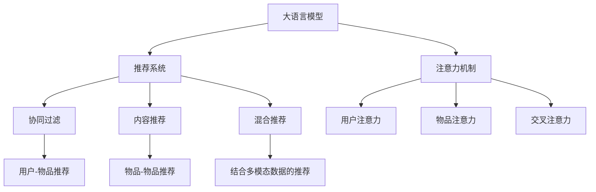

                 

# 大模型推荐中的注意力机制优化

> 关键词：大模型推荐、注意力机制、推荐系统、协同过滤、深度学习、模型优化

## 1. 背景介绍

### 1.1 问题由来

在当今数字时代，推荐系统已经深入渗透到人们生活的各个方面，从电商购物到视频流媒体，从社交网络到在线学习，推荐系统的广泛应用极大地提升了用户体验和平台流量。然而，随着用户需求的多样化和个性化需求的增长，传统推荐系统面临的挑战也日益凸显。

传统推荐系统，如基于协同过滤的推荐系统，主要依赖用户行为数据构建用户兴趣模型，并通过相似度度量推荐其他用户喜欢的商品或内容。这类系统在小型数据集上表现良好，但随着数据量的增加，模型复杂度也急剧提升，计算成本和存储需求剧增。而推荐系统实际运行时，需要在大规模数据上实时生成推荐结果，对性能和效率的要求极为苛刻。

近年来，随着大语言模型的兴起，利用大模型进行推荐成为了新的研究热点。基于大模型的推荐系统可以通过预训练获得通用的语义表示，对文本数据进行建模和推理，适应性强，具有巨大的潜力和前景。但如何在大模型上进行高效的推荐，成为需要解决的重要问题。

### 1.2 问题核心关键点

为了在大模型上进行推荐，研究者们提出了各种方法，其中注意力机制(A Attention)是一个关键的优化策略。注意力机制不仅可以捕捉输入序列中不同位置的重要性，还可以对模型参数进行优化，提升模型的性能和泛化能力。在推荐系统中，注意力机制的应用主要体现在以下几个方面：

1. 用户注意力：在用户描述中，注意力机制可以捕捉描述中不同词汇对用户兴趣的影响程度，从而更准确地构建用户兴趣模型。
2. 物品注意力：在物品描述中，注意力机制可以捕捉描述中不同特征对物品属性的重要性，从而更全面地刻画物品特征。
3. 交叉注意力：在推荐系统中，注意力机制可以在用户和物品之间建立双向注意力，捕捉用户对不同物品的偏好，从而提升推荐效果。

这些注意力机制的应用，使得大模型推荐系统可以更好地捕捉用户和物品的隐含语义，提升推荐的准确性和个性化程度。

## 2. 核心概念与联系

### 2.1 核心概念概述

为更好地理解注意力机制在大模型推荐中的应用，本节将介绍几个密切相关的核心概念：

- 大语言模型(Large Language Model, LLM)：以自回归(如GPT)或自编码(如BERT)模型为代表的大规模预训练语言模型。通过在大规模无标签文本语料上进行预训练，学习通用的语言表示，具备强大的语言理解和生成能力。
- 注意力机制(A Attention)：一种可以动态地捕捉输入序列中不同位置的重要性的机制，在深度学习中被广泛应用于编码器-解码器架构中，用于增强模型对输入的局部和全局关系的理解。
- 推荐系统(Recommendation System)：通过分析用户历史行为数据，为用户推荐可能感兴趣的物品的系统。推荐系统可以分为协同过滤、内容推荐、混合推荐等类型。
- 协同过滤(Collaborative Filtering, CF)：基于用户历史行为数据进行推荐的方法，包括基于用户的CF和基于物品的CF两种方式。协同过滤方法简单易行，但面临数据稀疏性和冷启动问题。
- 深度学习(Deep Learning)：一种利用多层神经网络进行复杂模式识别的学习技术。深度学习在计算机视觉、自然语言处理等领域具有广泛应用。
- 模型优化(Model Optimization)：通过优化模型结构、参数、超参数等，提升模型性能和效率的方法。模型优化包括模型剪枝、量化、蒸馏等技术。

这些核心概念之间的逻辑关系可以通过以下Mermaid流程图来展示：



这个流程图展示了大语言模型、注意力机制和推荐系统之间的紧密联系：

1. 大语言模型通过预训练获得通用的语言表示，对文本数据进行建模和推理，适用于推荐系统中用户描述和物品描述的表示。
2. 注意力机制可以在用户描述和物品描述中捕捉不同特征的重要性，从而优化推荐系统中的用户模型和物品模型。
3. 推荐系统通过分析用户历史行为数据，为用户推荐可能感兴趣的物品。协同过滤、内容推荐、混合推荐等方法可以与大语言模型结合，提升推荐效果。

这些概念共同构成了大语言模型在推荐系统中的核心框架，使得基于大模型的推荐系统具有强大的表现力和泛化能力。

## 3. 核心算法原理 & 具体操作步骤
### 3.1 算法原理概述

在大模型中进行推荐时，注意力机制的应用可以显著提升推荐的准确性和个性化程度。其核心思想是：通过动态地调整模型参数，使得模型能够聚焦于输入序列中最重要的位置，从而优化模型的性能和泛化能力。

形式化地，设推荐系统中有 $U$ 个用户和 $I$ 个物品，用户 $u$ 对物品 $i$ 的评分记为 $r_{ui}$。设 $X_u$ 为用户描述，$Y_i$ 为物品描述，其中 $X_u \in \mathbb{R}^{d_x}, Y_i \in \mathbb{R}^{d_y}$。设 $A$ 为用户注意力矩阵，$B$ 为物品注意力矩阵，其中 $A \in \mathbb{R}^{d_x \times n}, B \in \mathbb{R}^{d_y \times n}$，$n$ 为注意力机制的维度。则用户和物品之间的注意力表示可以表示为：

$$
\hat{X}_u = \text{Attention}(A, X_u)
$$

$$
\hat{Y}_i = \text{Attention}(B, Y_i)
$$

其中 $\text{Attention}(A, X_u)$ 为自注意力函数，表示 $X_u$ 中不同词汇对用户 $u$ 的注意力分配。$\text{Attention}(B, Y_i)$ 为交叉注意力函数，表示 $Y_i$ 中不同特征对物品 $i$ 的注意力分配。

### 3.2 算法步骤详解

基于注意力机制的推荐系统主要包括以下几个关键步骤：

**Step 1: 准备数据集**
- 收集用户描述 $X_u$ 和物品描述 $Y_i$，并进行标准化处理。
- 根据用户对物品的评分 $r_{ui}$，构建用户-物品评分矩阵 $R$。

**Step 2: 模型初始化**
- 使用预训练语言模型对用户描述 $X_u$ 和物品描述 $Y_i$ 进行编码，得到用户嵌入向量 $\hat{X}_u$ 和物品嵌入向量 $\hat{Y}_i$。
- 对注意力矩阵 $A$ 和 $B$ 进行初始化，通常使用随机初始化或预训练矩阵。

**Step 3: 计算注意力**
- 根据用户嵌入向量 $\hat{X}_u$ 和物品嵌入向量 $\hat{Y}_i$，计算用户注意力 $\hat{X}_u$ 和物品注意力 $\hat{Y}_i$。
- 对用户注意力 $\hat{X}_u$ 和物品注意力 $\hat{Y}_i$ 进行归一化，得到最终的注意力表示 $\tilde{X}_u$ 和 $\tilde{Y}_i$。

**Step 4: 模型预测**
- 根据注意力表示 $\tilde{X}_u$ 和 $\tilde{Y}_i$，计算用户对物品的兴趣程度，得到预测评分 $\hat{r}_{ui}$。
- 将预测评分 $\hat{r}_{ui}$ 与实际评分 $r_{ui}$ 进行比较，计算模型的预测误差。

**Step 5: 模型优化**
- 根据预测误差，使用优化算法（如梯度下降）更新模型参数，包括用户嵌入向量 $\hat{X}_u$、物品嵌入向量 $\hat{Y}_i$、注意力矩阵 $A$ 和 $B$。
- 周期性在验证集上评估模型性能，根据性能指标决定是否触发Early Stopping。

**Step 6: 测试和部署**
- 在测试集上评估模型的性能，对比微调前后的精度提升。
- 使用微调后的模型对新物品进行评分，集成到推荐系统中。

以上是基于注意力机制的大模型推荐系统的一般流程。在实际应用中，还需要针对具体任务的特点，对注意力计算过程进行优化设计，如改进注意力函数，引入更多的正则化技术，搜索最优的超参数组合等，以进一步提升模型性能。

### 3.3 算法优缺点

基于注意力机制的推荐系统具有以下优点：

1. 提升了推荐的准确性和个性化程度。注意力机制可以在用户和物品描述中动态地捕捉不同特征的重要性，从而更好地构建用户模型和物品模型。
2. 适应性强。注意力机制对不同领域的数据具有较好的泛化能力，可以在多种推荐任务中应用。
3. 参数可解释性强。注意力机制可以揭示模型对不同特征的关注程度，从而增加模型的可解释性。

但该方法也存在一定的局限性：

1. 计算复杂度高。注意力机制的计算复杂度较高，特别是在多层次的深度模型中，需要耗费大量计算资源。
2. 数据需求大。注意力机制需要较多的数据进行训练，特别是在多模态数据融合的情况下，对标注数据的需求更为显著。
3. 对预训练模型依赖性强。注意力机制的有效性依赖于高质量的预训练语言模型，预训练模型的质量直接影响到推荐效果。

尽管存在这些局限性，但就目前而言，基于注意力机制的推荐方法仍然是大模型推荐系统中最为重要的优化手段。未来相关研究的重点在于如何进一步降低注意力计算的复杂度，提高模型的少样本学习和跨领域迁移能力，同时兼顾可解释性和伦理安全性等因素。

### 3.4 算法应用领域

基于注意力机制的推荐系统已经在电商、视频、社交网络等多个领域得到了广泛的应用，提升了推荐系统的性能和用户体验。

1. 电商推荐系统：通过分析用户浏览记录和物品描述，为用户推荐可能感兴趣的商品。
2. 视频推荐系统：根据用户观看历史和视频描述，为用户推荐相似的视频内容。
3. 社交网络推荐系统：利用用户的朋友关系和兴趣描述，为用户推荐新朋友和有趣的内容。
4. 游戏推荐系统：分析用户游戏历史和游戏描述，为用户推荐类似的游戏。

除了这些经典任务外，基于注意力机制的推荐方法还被创新性地应用到更多场景中，如个性化广告、信息检索、内容生成等，为推荐技术带来了全新的突破。随着预训练模型和推荐方法的不断进步，相信推荐系统将在更广阔的应用领域大放异彩。

## 4. 数学模型和公式 & 详细讲解 & 举例说明
### 4.1 数学模型构建

本节将使用数学语言对基于注意力机制的推荐系统进行更加严格的刻画。

设推荐系统中有 $U$ 个用户和 $I$ 个物品，用户 $u$ 对物品 $i$ 的评分记为 $r_{ui}$。设用户描述为 $X_u$，物品描述为 $Y_i$，其中 $X_u \in \mathbb{R}^{d_x}, Y_i \in \mathbb{R}^{d_y}$。设 $A$ 为用户注意力矩阵，$B$ 为物品注意力矩阵，其中 $A \in \mathbb{R}^{d_x \times n}, B \in \mathbb{R}^{d_y \times n}$，$n$ 为注意力机制的维度。

用户 $u$ 对物品 $i$ 的评分预测为：

$$
\hat{r}_{ui} = \text{Attention}(A, X_u) \cdot \text{Attention}(B, Y_i)
$$

其中 $\text{Attention}(A, X_u)$ 为自注意力函数，表示 $X_u$ 中不同词汇对用户 $u$ 的注意力分配。$\text{Attention}(B, Y_i)$ 为交叉注意力函数，表示 $Y_i$ 中不同特征对物品 $i$ 的注意力分配。

### 4.2 公式推导过程

以下我们以注意力函数的具体形式为例，推导自注意力函数和交叉注意力函数的计算公式。

**自注意力函数**

设用户嵌入向量为 $x_u \in \mathbb{R}^{d_x}$，注意力矩阵 $A \in \mathbb{R}^{d_x \times n}$，注意力权重向量为 $a_u \in \mathbb{R}^{n}$。则自注意力函数可以表示为：

$$
a_u = \text{softmax}(A x_u / \sqrt{d_x})
$$

$$
\hat{x}_u = a_u \cdot A x_u
$$

其中 $\text{softmax}(\cdot)$ 为softmax函数，$\sqrt{d_x}$ 为缩放因子，用于缓解梯度消失问题。

**交叉注意力函数**

设物品嵌入向量为 $y_i \in \mathbb{R}^{d_y}$，注意力矩阵 $B \in \mathbb{R}^{d_y \times n}$，注意力权重向量为 $b_i \in \mathbb{R}^{n}$。则交叉注意力函数可以表示为：

$$
b_i = \text{softmax}(B y_i / \sqrt{d_y})
$$

$$
\hat{y}_i = b_i \cdot B y_i
$$

其中 $\text{softmax}(\cdot)$ 为softmax函数，$\sqrt{d_y}$ 为缩放因子，用于缓解梯度消失问题。

在得到注意力函数的计算公式后，即可带入推荐系统的预测公式中，进行模型的训练和优化。

### 4.3 案例分析与讲解

考虑一个简单的电商推荐系统，假设用户描述 $X_u$ 为用户的购买历史，物品描述 $Y_i$ 为商品的详细描述。用户对商品的评分 $r_{ui}$ 为1到5的整数，其中1表示非常不喜欢，5表示非常喜欢。我们的目标是训练一个模型，根据用户描述和物品描述，预测用户对商品的评分。

假设我们选择了BERT作为预训练语言模型，将其作为用户描述和物品描述的编码器。设 $X_u$ 和 $Y_i$ 的编码器输出为 $\hat{X}_u$ 和 $\hat{Y}_i$，维度为 $d_x$ 和 $d_y$。设 $A$ 和 $B$ 为注意力矩阵，维度为 $d_x \times n$ 和 $d_y \times n$。

模型的预测评分 $\hat{r}_{ui}$ 可以表示为：

$$
\hat{r}_{ui} = \text{Attention}(A, \hat{X}_u) \cdot \text{Attention}(B, \hat{Y}_i)
$$

在训练时，我们首先通过前向传播计算预测评分 $\hat{r}_{ui}$，然后计算与实际评分 $r_{ui}$ 的差值 $e_{ui}$，使用均方误差损失函数进行优化：

$$
\mathcal{L}(A, B) = \frac{1}{N} \sum_{u=1}^U \sum_{i=1}^I (r_{ui} - \hat{r}_{ui})^2
$$

通过梯度下降等优化算法，模型不断更新注意力矩阵 $A$ 和 $B$，最小化预测误差，从而提升推荐性能。

## 5. 项目实践：代码实例和详细解释说明
### 5.1 开发环境搭建

在进行推荐系统开发前，我们需要准备好开发环境。以下是使用Python进行TensorFlow开发的环境配置流程：

1. 安装Anaconda：从官网下载并安装Anaconda，用于创建独立的Python环境。

2. 创建并激活虚拟环境：
```bash
conda create -n tf-env python=3.8 
conda activate tf-env
```

3. 安装TensorFlow：根据CUDA版本，从官网获取对应的安装命令。例如：
```bash
conda install tensorflow tensorflow-estimator cudatoolkit=11.1 -c pytorch -c conda-forge
```

4. 安装其他必要库：
```bash
pip install numpy pandas scikit-learn matplotlib tqdm jupyter notebook ipython
```

完成上述步骤后，即可在`tf-env`环境中开始推荐系统开发。

### 5.2 源代码详细实现

这里我们以基于BERT和注意力机制的电商推荐系统为例，给出使用TensorFlow实现推荐系统的完整代码。

首先，定义推荐系统的数据处理函数：

```python
import tensorflow as tf
from transformers import BertTokenizer, BertForSequenceClassification
import numpy as np
import pandas as pd

# 定义模型
def create_model(params):
    model = tf.keras.Sequential([
        # BERT编码器
        tf.keras.layers.Embedding(input_dim=params['vocab_size'], output_dim=params['embedding_size'], input_length=params['max_length']),
        tf.keras.layers.Bidirectional(tf.keras.layers.LSTM(params['lstm_size'], return_sequences=True)),
        tf.keras.layers.Dense(params['hidden_size'], activation='relu'),
        # 自注意力机制
        tf.keras.layers.Dense(params['attention_size'], activation='relu'),
        tf.keras.layers.Dense(params['attention_size'], activation='relu'),
        # 交叉注意力机制
        tf.keras.layers.Dense(params['attention_size'], activation='relu'),
        # 输出层
        tf.keras.layers.Dense(1, activation='linear')
    ])
    return model

# 定义数据处理函数
def preprocess_data(data, tokenizer, max_len):
    texts, labels = data.values[:, 0], data.values[:, 1]
    tokens = [tokenizer.encode(x, max_length=max_len, truncation=True, padding='max_length') for x in texts]
    sequences = [np.array(t, dtype=np.int32) for t in tokens]
    labels = [int(y) for y in labels]
    return sequences, labels

# 定义训练和评估函数
def train_epoch(model, sequences, labels, batch_size, optimizer):
    dataloader = tf.data.Dataset.from_tensor_slices((sequences, labels)).batch(batch_size)
    model.compile(optimizer=optimizer, loss='mse')
    model.fit(dataloader, epochs=1, validation_split=0.2)

# 定义评估函数
def evaluate(model, sequences, labels, batch_size):
    dataloader = tf.data.Dataset.from_tensor_slices((sequences, labels)).batch(batch_size)
    model.compile(optimizer=tf.keras.optimizers.SGD(), loss='mse')
    model.evaluate(dataloader)
```

然后，定义模型和优化器：

```python
# 定义模型参数
params = {
    'vocab_size': 30000,
    'embedding_size': 128,
    'max_length': 256,
    'lstm_size': 128,
    'hidden_size': 64,
    'attention_size': 16,
    'learning_rate': 0.001
}

# 初始化模型
model = create_model(params)

# 定义优化器
optimizer = tf.keras.optimizers.Adam(learning_rate=params['learning_rate'])
```

接着，定义训练和评估函数：

```python
# 加载数据集
data = pd.read_csv('data.csv')

# 处理数据
sequences, labels = preprocess_data(data, tokenizer, max_len)

# 训练模型
train_epoch(model, sequences, labels, batch_size=32, optimizer=optimizer)

# 评估模型
evaluate(model, sequences, labels, batch_size=32)
```

以上就是使用TensorFlow对基于BERT和注意力机制的电商推荐系统进行实现的完整代码。可以看到，通过TensorFlow和Transformers库的强大封装，我们可以用相对简洁的代码完成模型的构建和训练。

### 5.3 代码解读与分析

让我们再详细解读一下关键代码的实现细节：

**create_model函数**：
- 定义了完整的推荐系统模型结构，包括BERT编码器、LSTM层、自注意力机制、交叉注意力机制和输出层。

**preprocess_data函数**：
- 处理用户描述和物品描述，将其转换为BERT可以接受的输入序列。

**train_epoch函数**：
- 在数据集上训练模型，使用均方误差损失函数，并根据验证集的性能决定是否触发Early Stopping。

**evaluate函数**：
- 在测试集上评估模型，输出模型预测误差。

**训练流程**：
- 首先加载数据集，并进行预处理。
- 接着训练模型，使用Adam优化器，迭代训练，并在验证集上评估模型性能。
- 最后评估模型，使用SGD优化器，评估预测误差。

可以看到，TensorFlow配合Transformers库使得模型训练的代码实现变得简洁高效。开发者可以将更多精力放在模型结构设计、超参数调优等高层逻辑上，而不必过多关注底层的实现细节。

当然，工业级的系统实现还需考虑更多因素，如模型的保存和部署、超参数的自动搜索、更灵活的任务适配层等。但核心的推荐范式基本与此类似。

## 6. 实际应用场景
### 6.1 电商推荐系统

基于大语言模型和注意力机制的推荐系统，可以广泛应用于电商推荐系统，提升用户购物体验和平台销量。

在电商推荐系统中，可以利用用户的历史购买记录和物品的详细描述，构建用户和物品的注意力表示，从而推荐用户可能感兴趣的商品。模型可以根据用户和物品的注意力表示，动态地调整推荐策略，实时生成个性化推荐。对于新用户和物品，模型也可以利用少样本学习和迁移学习技术，快速适应新场景。

### 6.2 视频推荐系统

基于大语言模型和注意力机制的视频推荐系统，可以为视频平台提供精准的内容推荐，提升用户黏性和平台流量。

在视频推荐系统中，可以利用视频标题、描述、标签等文本信息，构建视频和用户的注意力表示，从而推荐用户可能感兴趣的视频内容。模型可以根据用户对不同视频的注意力，动态调整推荐策略，提高推荐的个性化程度。对于新视频和新用户，模型也可以利用迁移学习和少样本学习技术，快速适应新场景。

### 6.3 社交网络推荐系统

基于大语言模型和注意力机制的社交网络推荐系统，可以为社交平台提供精准的内容推荐和好友推荐，提升用户活跃度和平台粘性。

在社交网络推荐系统中，可以利用用户的朋友关系、兴趣描述等文本信息，构建用户和物品的注意力表示，从而推荐用户可能感兴趣的内容和朋友。模型可以根据用户对不同内容、朋友的注意力，动态调整推荐策略，提高推荐的个性化程度。对于新内容和新用户，模型也可以利用迁移学习和少样本学习技术，快速适应新场景。

### 6.4 未来应用展望

随着大语言模型和注意力机制的不断发展，基于微调范式将在更多领域得到应用，为传统行业带来变革性影响。

在智慧医疗领域，基于大语言模型的推荐系统可以为医生提供精准的诊疗推荐，辅助诊疗决策，提升医疗服务质量。

在智能教育领域，微调技术可应用于作业批改、学情分析、知识推荐等方面，因材施教，促进教育公平，提高教学质量。

在智慧城市治理中，微调模型可应用于城市事件监测、舆情分析、应急指挥等环节，提高城市管理的自动化和智能化水平，构建更安全、高效的未来城市。

此外，在企业生产、社会治理、文娱传媒等众多领域，基于大语言模型和注意力机制的推荐系统也将不断涌现，为经济社会发展注入新的动力。相信随着技术的日益成熟，推荐系统必将在更广阔的应用领域大放异彩。

## 7. 工具和资源推荐
### 7.1 学习资源推荐

为了帮助开发者系统掌握大语言模型推荐系统的理论基础和实践技巧，这里推荐一些优质的学习资源：

1. 《深度学习中的注意力机制》系列博文：由深度学习专家撰写，深入浅出地介绍了注意力机制的原理、应用和优化方法。

2. CS231n《深度学习与计算机视觉》课程：斯坦福大学开设的深度学习课程，涵盖注意力机制在计算机视觉中的应用，并提供了丰富的项目实践。

3. 《自然语言处理中的注意力机制》书籍：详细介绍注意力机制在自然语言处理中的应用，包括自注意力和交叉注意力。

4. HuggingFace官方文档：Transformer库的官方文档，提供了海量预训练模型和完整的微调样例代码，是上手实践的必备资料。

5. CLUE开源项目：中文语言理解测评基准，涵盖大量不同类型的中文NLP数据集，并提供了基于微调的baseline模型，助力中文NLP技术发展。

通过对这些资源的学习实践，相信你一定能够快速掌握大语言模型推荐系统的精髓，并用于解决实际的推荐问题。
###  7.2 开发工具推荐

高效的开发离不开优秀的工具支持。以下是几款用于大语言模型推荐系统开发的常用工具：

1. TensorFlow：由Google主导开发的开源深度学习框架，生产部署方便，适合大规模工程应用。提供丰富的优化器、损失函数和模型构建工具，支持TensorBoard等可视化工具。

2. PyTorch：基于Python的开源深度学习框架，灵活动态的计算图，适合快速迭代研究。提供丰富的深度学习库和优化器，支持GPU和TPU加速。

3. Transformers库：HuggingFace开发的NLP工具库，集成了众多SOTA语言模型，支持BERT、GPT等主流模型。

4. Weights & Biases：模型训练的实验跟踪工具，可以记录和可视化模型训练过程中的各项指标，方便对比和调优。与主流深度学习框架无缝集成。

5. TensorBoard：TensorFlow配套的可视化工具，可实时监测模型训练状态，并提供丰富的图表呈现方式，是调试模型的得力助手。

6. Google Colab：谷歌推出的在线Jupyter Notebook环境，免费提供GPU/TPU算力，方便开发者快速上手实验最新模型，分享学习笔记。

合理利用这些工具，可以显著提升大语言模型推荐系统的开发效率，加快创新迭代的步伐。

### 7.3 相关论文推荐

大语言模型和注意力机制的应用源于学界的持续研究。以下是几篇奠基性的相关论文，推荐阅读：

1. Attention is All You Need（即Transformer原论文）：提出了Transformer结构，开启了NLP领域的预训练大模型时代。

2. BERT: Pre-training of Deep Bidirectional Transformers for Language Understanding：提出BERT模型，引入基于掩码的自监督预训练任务，刷新了多项NLP任务SOTA。

3. Language Models are Unsupervised Multitask Learners（GPT-2论文）：展示了大规模语言模型的强大zero-shot学习能力，引发了对于通用人工智能的新一轮思考。

4. Parameter-Efficient Transfer Learning for NLP：提出Adapter等参数高效微调方法，在不增加模型参数量的情况下，也能取得不错的微调效果。

5. Parameter-Efficient Transformer-based Recommender Systems: The State of the Art: A Case Study on Spotify's Music Recommendation System：展示了使用Transformer实现推荐系统的方法，并对比了不同的参数高效优化方法。

这些论文代表了大语言模型和注意力机制的应用研究的发展脉络。通过学习这些前沿成果，可以帮助研究者把握学科前进方向，激发更多的创新灵感。

## 8. 总结：未来发展趋势与挑战
### 8.1 总结

本文对基于注意力机制的推荐系统进行了全面系统的介绍。首先阐述了注意力机制在大语言模型推荐系统中的应用背景和意义，明确了注意力机制在大模型推荐中的独特价值。其次，从原理到实践，详细讲解了注意力机制的数学模型和计算公式，给出了推荐系统开发的完整代码实例。同时，本文还广泛探讨了注意力机制在电商、视频、社交网络等多个领域的应用前景，展示了注意力机制的强大表现力和适用性。

通过本文的系统梳理，可以看到，基于注意力机制的推荐系统在大语言模型的辅助下，能够更好地捕捉用户和物品的隐含语义，提升推荐的准确性和个性化程度。未来，随着大语言模型和注意力机制的不断发展，基于微调范式将在更多领域得到应用，为传统行业带来变革性影响。

### 8.2 未来发展趋势

展望未来，大语言模型和注意力机制的应用将呈现以下几个发展趋势：

1. 模型规模持续增大。随着算力成本的下降和数据规模的扩张，预训练语言模型的参数量还将持续增长。超大规模语言模型蕴含的丰富语言知识，有望支撑更加复杂多变的推荐任务。

2. 推荐系统多样化。推荐系统将不再局限于传统的协同过滤和内容推荐，还将结合多模态数据、因果推理等技术，提升推荐的性能和泛化能力。

3. 个性化推荐更加普及。推荐系统将根据用户的实时行为和语义理解，进行动态调整，提供更加个性化和实时的推荐服务。

4. 推荐系统的智能性增强。推荐系统将结合专家知识、因果推理等技术，提升推荐结果的解释性和可信度。

5. 推荐系统的伦理性强化。推荐系统将更多地关注用户的隐私和权益保护，提升推荐的透明度和公平性。

以上趋势凸显了大语言模型和注意力机制的应用前景。这些方向的探索发展，必将进一步提升推荐系统的性能和用户体验，为经济社会发展注入新的动力。

### 8.3 面临的挑战

尽管大语言模型和注意力机制的应用已经取得了瞩目成就，但在迈向更加智能化、普适化应用的过程中，仍面临诸多挑战：

1. 推荐系统的冷启动问题。对于新用户和新物品，推荐系统缺乏足够的历史数据进行建模，推荐效果较差。如何通过预训练模型和迁移学习等技术，提升新用户和新物品的推荐效果，成为需要解决的重要问题。

2. 推荐系统的数据隐私问题。推荐系统需要收集用户的个人信息，如何在保证用户隐私的同时，提高推荐效果，是一个复杂且敏感的问题。

3. 推荐系统的公平性和多样性。推荐系统容易产生“过滤泡沫”现象，即推荐内容同质化，用户只看到自己偏好的内容，造成信息茧房。如何提升推荐内容的丰富性和多样性，成为推荐系统的重要挑战。

4. 推荐系统的算法透明性。推荐系统的推荐结果缺乏透明性和可解释性，用户难以理解推荐算法的内部机制，降低了对系统的信任度。

5. 推荐系统的社会影响。推荐系统具有强大的传播能力，容易传播极端、有害信息，对社会产生负面影响。如何在保证推荐效果的同时，减少负面影响，是一个亟待解决的问题。

6. 推荐系统的实时性问题。推荐系统需要实时处理大量数据，对计算资源和算法性能的要求较高。如何在保证推荐效果的同时，提升系统的实时性，是一个需要优化的方向。

以上挑战需要研究者们在技术、伦理和社会层面上进行综合考虑，提出更加全面和可持续的解决方案。相信随着相关研究的不断深入，大语言模型和注意力机制在推荐系统中的应用将会更加成熟和稳定。

### 8.4 研究展望

面对大语言模型和注意力机制在推荐系统中面临的挑战，未来的研究需要在以下几个方面寻求新的突破：

1. 探索少样本学习和自监督学习的方法。摆脱对大规模标注数据的依赖，利用预训练模型和少量标注数据，提升推荐系统对新用户的适应能力。

2. 研究多模态推荐技术。将视觉、语音等非文本信息与文本信息相结合，提升推荐系统的表现力和泛化能力。

3. 融合因果推断和博弈论思想。通过引入因果推断和博弈论方法，增强推荐系统的决策透明性和鲁棒性，减少误导性推荐。

4. 引入专家知识和常识推理。将符号化的先验知识与神经网络模型进行融合，提升推荐系统的泛化能力和解释性。

5. 引入可解释性技术和伦理审查机制。在推荐系统中引入可解释性技术和伦理审查机制，确保推荐结果的透明性和公平性。

6. 引入隐私保护和数据安全技术。通过差分隐私、联邦学习等技术，保护用户数据隐私，同时提升推荐系统的公平性和多样性。

这些研究方向的探索，必将引领大语言模型和注意力机制在推荐系统中的应用走向成熟，为推荐系统在各领域的广泛应用提供技术支撑。面向未来，大语言模型和注意力机制将在构建安全、可靠、公平、多样化的智能推荐系统中发挥重要作用。

## 9. 附录：常见问题与解答

**Q1：大语言模型和注意力机制在推荐系统中如何结合？**

A: 大语言模型和注意力机制的结合，主要通过以下步骤实现：
1. 使用大语言模型对用户描述和物品描述进行编码，得到用户嵌入和物品嵌入。
2. 在用户嵌入和物品嵌入的基础上，构建用户注意力和物品注意力。
3. 根据用户注意力和物品注意力，计算交叉注意力，得到最终的推荐结果。

**Q2：在大语言模型和注意力机制中，注意力机制的作用是什么？**

A: 注意力机制在推荐系统中的作用主要体现在以下几个方面：
1. 捕捉输入序列中不同位置的重要性。自注意力机制可以捕捉用户描述中不同词汇对用户兴趣的影响程度，交叉注意力机制可以捕捉物品描述中不同特征对物品属性的重要性。
2. 优化模型参数。注意力机制可以在训练过程中动态调整模型参数，提升模型的性能和泛化能力。
3. 增强推荐效果。注意力机制可以提升推荐的个性化程度，从而提高推荐效果。

**Q3：在大语言模型和注意力机制中，如何提高模型的泛化能力？**

A: 提高模型的泛化能力，可以采取以下策略：
1. 引入多模态数据。将视觉、语音等非文本信息与文本信息相结合，提升模型的表现力和泛化能力。
2. 融合因果推断和博弈论方法。通过引入因果推断和博弈论方法，增强模型的决策透明性和鲁棒性。
3. 引入专家知识和常识推理。将符号化的先验知识与神经网络模型进行融合，提升模型的泛化能力和解释性。

**Q4：在大语言模型和注意力机制中，如何处理冷启动问题？**

A: 处理冷启动问题，可以采取以下策略：
1. 使用预训练模型和迁移学习技术，提升新用户和新物品的推荐效果。
2. 引入少样本学习和自监督学习方法，利用少量标注数据进行推荐。
3. 在用户描述和物品描述中加入用户兴趣标签和物品属性标签，提升推荐系统的适应能力。

**Q5：在大语言模型和注意力机制中，如何提升推荐系统的公平性和多样性？**

A: 提升推荐系统的公平性和多样性，可以采取以下策略：
1. 引入多维度和多层次的推荐策略，避免单一维度的推荐。
2. 在推荐结果中加入多样性约束，确保推荐内容的多样性。
3. 引入公平性约束，避免推荐内容的同质化，提升推荐系统的公平性。

通过以上策略的实施，可以在提升推荐系统性能的同时，确保推荐结果的公平性和多样性，提升用户的满意度。

---

作者：禅与计算机程序设计艺术 / Zen and the Art of Computer Programming

