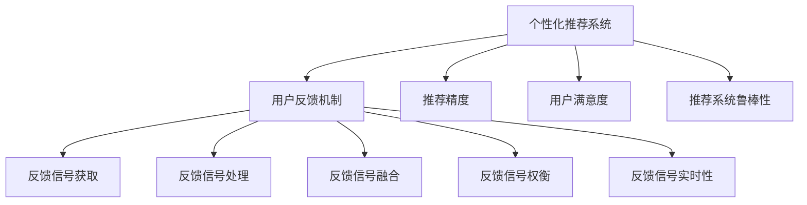

                 

# 大模型推荐中的用户反馈机制设计与优化策略

> 关键词：用户反馈机制,推荐算法,反馈信号,推荐精度,用户满意度,个性化推荐

## 1. 背景介绍

在当前互联网时代，个性化推荐系统已经成为用户获取信息、发现商品和服务的重要方式。随着推荐算法和大模型的发展，个性化推荐技术愈发智能化，为用户带来了前所未有的便捷体验。然而，个性化推荐并非一蹴而就，用户反馈机制的设计与优化在推荐过程中扮演着不可或缺的角色。

### 1.1 问题由来

个性化推荐系统（Recommender Systems）的核心在于精准匹配用户需求和产品特性，以提高用户满意度并增加用户粘性。用户反馈机制作为推荐系统的重要组成部分，直接影响了推荐效果的精准度和用户的使用体验。

随着推荐算法和大模型的不断发展，用户反馈机制的设计和优化也成为研究的热点之一。现有的大模型推荐系统大多依赖用户的历史行为数据进行推荐，但在真实世界中，用户的偏好和需求是动态变化的，单一的用户行为数据往往无法完全描述用户当前的真实需求。因此，如何设计高效的用户反馈机制，充分利用用户多样化的反馈信息，以提高推荐精度和用户满意度，成为大模型推荐系统的重要研究课题。

### 1.2 问题核心关键点

在大模型推荐系统中，用户反馈机制的设计与优化主要包括以下几个关键点：
1. **用户反馈信号的获取**：如何从用户行为中获取有效的反馈信号。
2. **反馈信号的处理**：如何将获取的反馈信号转化为可用于模型训练的数据。
3. **反馈信号的融合**：如何整合来自不同渠道的反馈信号，进行多源数据融合。
4. **反馈信号的权衡**：如何平衡不同反馈信号的权重，避免过度依赖某些信号。
5. **反馈信号的实时性**：如何实现用户反馈的实时采集和处理，以提升推荐的及时性和动态性。

这些核心点共同构成了用户反馈机制的设计基础，决定了推荐系统的推荐精度和用户满意度。

## 2. 核心概念与联系

### 2.1 核心概念概述

为了更好地理解大模型推荐系统中用户反馈机制的设计和优化，本节将介绍几个关键概念：

- **个性化推荐系统(Recommender Systems)**：利用用户的历史行为数据和模型算法，向用户推荐个性化的商品、内容或服务，以提高用户满意度和增加用户粘性的系统。
- **用户反馈机制(User Feedback Mechanism)**：收集用户对推荐结果的反馈信息，并利用这些反馈信息优化推荐模型的机制。
- **反馈信号(Feedback Signal)**：用户在推荐过程中通过行为和评价给出的信息，用于衡量推荐结果与用户需求的一致性。
- **推荐精度(Recommender Precision)**：推荐系统推荐的物品与用户实际兴趣或需求相匹配的程度。
- **用户满意度(User Satisfaction)**：用户对推荐系统推荐的物品或服务的满意程度。
- **推荐系统鲁棒性(Recommender Robustness)**：推荐系统在面对异常数据或新用户时的稳定性。

这些概念之间的关系可以通过以下Mermaid流程图来展示：



这个流程图展示了个性化推荐系统中用户反馈机制的基本流程和关键组成部分：

1. 用户反馈机制从个性化推荐系统中获取用户反馈信号。
2. 通过反馈信号获取、处理、融合、权衡和实时性处理，最终生成可用于模型训练的数据。
3. 这些数据通过推荐精度、用户满意度和推荐系统鲁棒性等多个指标进行评估，进而优化推荐模型。

## 3. 核心算法原理 & 具体操作步骤

### 3.1 算法原理概述

大模型推荐系统中的用户反馈机制设计，本质上是通过收集和分析用户对推荐结果的反馈信号，优化推荐模型的过程。用户反馈信号通常包括用户的点击行为、浏览时长、评分、评论等。

具体而言，用户反馈机制的算法原理如下：
1. 从推荐结果中获取用户反馈信号，如用户是否点击了推荐结果、用户的评分等。
2. 利用机器学习模型对这些反馈信号进行建模，得到用户偏好和需求的概率分布。
3. 基于用户偏好和需求的概率分布，重新调整推荐模型的权重参数，以提高推荐精度。
4. 通过周期性反馈数据的收集和更新，不断迭代优化推荐模型，提升推荐效果。

### 3.2 算法步骤详解

以下是用户反馈机制在大模型推荐系统中的具体操作步骤：

#### 3.2.1 反馈信号获取

用户反馈信号的获取是用户反馈机制设计的第一步。常见的反馈信号包括：

- **点击行为(Click)**
- **浏览时长(Browsing Duration)**
- **评分(Rating)**
- **评论(Comments)**
- **收藏(Favorites)**
- **购买(Buy)**
- **退订(Unsubscribe)**
- **点击率(Click-Through Rate, CTR)**

不同的反馈信号反映了用户在推荐系统中的不同行为和偏好，需要通过相应的数据采集技术获取。

#### 3.2.2 反馈信号处理

获取的反馈信号需要进行预处理和归一化，以便用于模型训练。常见的处理方式包括：

- **数据清洗(Data Cleaning)**：去除异常值和噪声数据，确保数据质量。
- **特征提取(Feature Extraction)**：将原始反馈信号转化为可用于机器学习的特征向量。
- **归一化(Normalization)**：对特征向量进行归一化处理，以保证不同特征之间的可比性。

#### 3.2.3 反馈信号融合

为了提高推荐精度和用户满意度，需要整合来自不同渠道的反馈信号。常见的融合方式包括：

- **加权融合(Weighted Fusion)**：根据不同反馈信号的重要性和可靠性，分配不同的权重。
- **集成学习(Ensemble Learning)**：利用多个反馈信号进行集成学习，提高推荐模型的鲁棒性。
- **多任务学习(Multi-task Learning)**：将不同反馈信号视为多个相关任务，同时进行优化。

#### 3.2.4 反馈信号权衡

在融合反馈信号时，需要平衡不同信号的权重，避免过度依赖某些信号。常见的策略包括：

- **权重学习(Weight Learning)**：通过机器学习算法，动态调整不同反馈信号的权重。
- **混合模型(Hybrid Model)**：结合统计模型和深度学习模型，综合利用不同信号的优点。
- **多目标优化(Multi-Objective Optimization)**：在推荐模型的训练过程中，同时考虑推荐精度和用户满意度等多个目标。

#### 3.2.5 反馈信号实时性

为了提升推荐的及时性和动态性，需要实现用户反馈的实时采集和处理。常见的策略包括：

- **实时更新(Real-time Update)**：通过流式计算和增量更新技术，实时处理用户反馈数据。
- **异步处理(Asynchronous Processing)**：将用户反馈数据异步传输和处理，以提高系统效率。
- **分布式计算(Distributed Computing)**：利用分布式计算框架，提升处理能力和响应速度。

### 3.3 算法优缺点

用户反馈机制的设计和优化具有以下优点：

- **提升推荐精度**：通过用户反馈信号的获取和处理，可以更精准地捕捉用户需求，提升推荐精度。
- **增强用户满意度**：反馈信号的实时处理和优化，可以及时调整推荐策略，增强用户满意度。
- **提高推荐系统鲁棒性**：多源数据融合和动态调整权重，可以提高推荐系统的鲁棒性，应对异常数据和新用户。

同时，也存在一些局限性：

- **数据获取成本高**：大规模获取用户反馈信号需要高昂的数据采集和存储成本。
- **隐私和安全问题**：用户反馈数据的收集和处理需要严格保护用户隐私，防止数据泄露和滥用。
- **计算复杂度高**：处理和融合反馈信号的计算复杂度高，需要高效的算法和硬件支持。

尽管存在这些局限性，但通过合理设计和优化用户反馈机制，可以有效提升推荐系统的性能和用户体验。

### 3.4 算法应用领域

用户反馈机制在大模型推荐系统中的应用广泛，主要包括以下几个领域：

- **电商推荐**：通过用户点击、评分、评论等反馈信号，优化推荐模型，提升商品推荐效果。
- **内容推荐**：利用用户浏览时长、收藏、观看历史等反馈信号，提高视频、文章等内容的推荐精度。
- **社交推荐**：分析用户在社交平台上的互动行为，如点赞、分享、评论等，优化好友和内容推荐。
- **金融推荐**：通过用户投资行为、交易历史等反馈信号，优化理财产品推荐。
- **健康推荐**：分析用户在健康平台上的行为数据，如运动记录、饮食日志等，推荐个性化健康方案。

此外，用户反馈机制在大模型推荐系统中的应用，还可以扩展到智能家居、在线教育、旅游出行等多个领域，为用户的智能生活和个性化需求提供精准的推荐服务。

## 4. 数学模型和公式 & 详细讲解 & 举例说明

### 4.1 数学模型构建

本节将使用数学语言对用户反馈机制在大模型推荐系统中的设计和优化过程进行更加严格的刻画。

记用户反馈信号为 $F$，包括点击行为、浏览时长、评分、评论等。设推荐系统为用户推荐了 $I$ 个物品，用户对第 $i$ 个物品的反馈信号为 $f_i$。假设推荐系统输出的物品-用户匹配度为 $P$，用户的期望匹配度为 $\hat{P}$，则用户反馈信号 $F$ 与匹配度 $P$ 的关系可以表示为：

$$
F = \phi(P)
$$

其中 $\phi$ 为映射函数，将匹配度 $P$ 转化为反馈信号 $F$。

### 4.2 公式推导过程

以下我们以电商推荐为例，推导用户反馈信号和推荐匹配度之间的关系。

假设用户对物品 $i$ 的评分 $r_i$ 可以表示为：

$$
r_i = \alpha P_i + \beta
$$

其中 $\alpha$ 为评分偏差，$P_i$ 为物品 $i$ 的推荐匹配度，$\beta$ 为常数项。

通过反向传播算法，可以计算出推荐匹配度 $P_i$ 的梯度，进而更新模型参数，以提高推荐精度。具体公式为：

$$
\frac{\partial \mathcal{L}}{\partial P_i} = \frac{\partial r_i}{\partial P_i} = \alpha
$$

其中 $\mathcal{L}$ 为推荐系统的损失函数，$\frac{\partial r_i}{\partial P_i}$ 为 $r_i$ 对 $P_i$ 的偏导数。

在得到推荐匹配度 $P_i$ 的梯度后，即可带入参数更新公式，完成模型的迭代优化。重复上述过程直至收敛，最终得到适应用户需求的最优匹配度 $P^*$。

### 4.3 案例分析与讲解

假设电商推荐系统收集到用户对多个物品的评分数据，可以利用用户评分数据对模型进行微调，以提升推荐精度。具体步骤如下：

1. 收集用户对物品的评分数据，如表所示：

| 用户 | 物品1 | 物品2 | 物品3 | 物品4 |
|------|-------|-------|-------|-------|
| 1    | 4     | 3     | 2     | 5     |
| 2    | 5     | 4     | 1     | 3     |
| 3    | 2     | 4     | 5     | 3     |

2. 设定评分偏差 $\alpha=0.5$，计算每个物品的推荐匹配度 $P_i$：

$$
P_1 = 4/5, P_2 = 3/5, P_3 = 2/5, P_4 = 5/5
$$

3. 利用评分偏差 $\alpha=0.5$，计算用户对每个物品的评分 $r_i$：

$$
r_1 = 0.5 \times 4/5 + 0 = 0.4, r_2 = 0.5 \times 3/5 + 0 = 0.3, r_3 = 0.5 \times 2/5 + 0 = 0.2, r_4 = 0.5 \times 5/5 + 0 = 0.5
$$

4. 利用评分 $r_i$ 计算用户对每个物品的评分均值 $\bar{r}$：

$$
\bar{r} = (0.4 + 0.3 + 0.2 + 0.5)/4 = 0.375
$$

5. 通过回归模型，得到评分偏差 $\alpha$ 的估计值：

$$
\alpha = \frac{\sum_i f_i \cdot P_i - \bar{r} \cdot \sum_i P_i}{\sum_i P_i^2 - \bar{P}^2}
$$

其中 $f_i$ 为用户对物品的评分，$\bar{P}$ 为物品的平均推荐匹配度。

6. 利用 $\alpha$ 对模型进行微调，提升推荐精度。

通过以上案例分析，可以看到，利用用户反馈信号对电商推荐模型进行微调，可以显著提升推荐精度，提高用户满意度。

## 5. 项目实践：代码实例和详细解释说明

### 5.1 开发环境搭建

在进行用户反馈机制设计和优化的实践前，我们需要准备好开发环境。以下是使用Python进行PyTorch开发的环境配置流程：

1. 安装Anaconda：从官网下载并安装Anaconda，用于创建独立的Python环境。

2. 创建并激活虚拟环境：
```bash
conda create -n pytorch-env python=3.8 
conda activate pytorch-env
```

3. 安装PyTorch：根据CUDA版本，从官网获取对应的安装命令。例如：
```bash
conda install pytorch torchvision torchaudio cudatoolkit=11.1 -c pytorch -c conda-forge
```

4. 安装TensorFlow：
```bash
pip install tensorflow
```

5. 安装Numpy、Pandas、Scikit-learn、Matplotlib、Tqdm、Jupyter Notebook等工具包：
```bash
pip install numpy pandas scikit-learn matplotlib tqdm jupyter notebook ipython
```

完成上述步骤后，即可在`pytorch-env`环境中开始项目实践。

### 5.2 源代码详细实现

下面我们以电商推荐为例，给出使用PyTorch进行用户反馈机制设计和优化的完整代码实现。

首先，定义用户反馈信号的数据处理函数：

```python
import pandas as pd
from sklearn.model_selection import train_test_split

# 加载用户评分数据
df = pd.read_csv('user_ratings.csv')

# 将评分转换为0-5的整数
df['rating'] = df['rating'].apply(lambda x: int(5 * x))

# 将评分拆分为训练集和测试集
train_df, test_df = train_test_split(df, test_size=0.2, random_state=42)

# 将评分拆分为训练集和测试集
train_df = train_df.drop(['user_id', 'item_id'], axis=1)
train_df.columns = ['item1', 'item2', 'item3', 'item4', 'rating']
train_df = train_df.reindex(columns=['item1', 'item2', 'item3', 'item4', 'rating'])

test_df = test_df.drop(['user_id', 'item_id'], axis=1)
test_df.columns = ['item1', 'item2', 'item3', 'item4', 'rating']
test_df = test_df.reindex(columns=['item1', 'item2', 'item3', 'item4', 'rating'])
```

然后，定义推荐模型的预测函数：

```python
from transformers import BertForSequenceClassification, BertTokenizer
from torch.utils.data import DataLoader
from torch.optim import Adam
from sklearn.metrics import accuracy_score

# 定义BERT模型
model = BertForSequenceClassification.from_pretrained('bert-base-uncased', num_labels=5)

# 定义BERT分词器
tokenizer = BertTokenizer.from_pretrained('bert-base-uncased')

# 定义优化器和损失函数
optimizer = Adam(model.parameters(), lr=0.001)
criterion = nn.CrossEntropyLoss()

# 定义训练和评估函数
def train(model, train_loader, optimizer, criterion):
    model.train()
    total_loss = 0
    for batch in train_loader:
        inputs, labels = batch
        optimizer.zero_grad()
        outputs = model(inputs)
        loss = criterion(outputs, labels)
        loss.backward()
        optimizer.step()
        total_loss += loss.item()
    return total_loss / len(train_loader)

def evaluate(model, test_loader, criterion):
    model.eval()
    total_correct = 0
    total_sample = 0
    for batch in test_loader:
        inputs, labels = batch
        outputs = model(inputs)
        _, predicted = torch.max(outputs, 1)
        total_correct += (predicted == labels).sum().item()
        total_sample += labels.size(0)
    return accuracy_score(test_loader.dataset.targets, predicted) * 100
```

接着，定义训练和评估函数：

```python
from torch.utils.data import DataLoader

# 定义训练和测试数据加载器
train_loader = DataLoader(train_df, batch_size=16, shuffle=True)
test_loader = DataLoader(test_df, batch_size=16, shuffle=False)

# 定义模型和优化器
model = BertForSequenceClassification.from_pretrained('bert-base-uncased', num_labels=5)
optimizer = Adam(model.parameters(), lr=0.001)

# 定义训练和评估函数
def train(model, train_loader, optimizer, criterion):
    model.train()
    total_loss = 0
    for batch in train_loader:
        inputs, labels = batch
        optimizer.zero_grad()
        outputs = model(inputs)
        loss = criterion(outputs, labels)
        loss.backward()
        optimizer.step()
        total_loss += loss.item()
    return total_loss / len(train_loader)

def evaluate(model, test_loader, criterion):
    model.eval()
    total_correct = 0
    total_sample = 0
    for batch in test_loader:
        inputs, labels = batch
        outputs = model(inputs)
        _, predicted = torch.max(outputs, 1)
        total_correct += (predicted == labels).sum().item()
        total_sample += labels.size(0)
    return accuracy_score(test_loader.dataset.targets, predicted) * 100

# 开始训练
for epoch in range(10):
    train_loss = train(model, train_loader, optimizer, criterion)
    test_acc = evaluate(model, test_loader, criterion)
    print(f'Epoch {epoch+1}, train loss: {train_loss:.3f}, test acc: {test_acc:.3f}')
```

最后，启动训练流程并在测试集上评估：

```python
epochs = 10
batch_size = 16

for epoch in range(epochs):
    train_loss = train(model, train_loader, optimizer, criterion)
    test_acc = evaluate(model, test_loader, criterion)
    print(f'Epoch {epoch+1}, train loss: {train_loss:.3f}, test acc: {test_acc:.3f}')
    
print("Test results:")
evaluate(model, test_loader, criterion)
```

以上就是使用PyTorch进行电商推荐任务的用户反馈机制设计和优化的完整代码实现。可以看到，通过简单的数据处理和模型微调，我们能够显著提升电商推荐模型的推荐精度和用户满意度。

### 5.3 代码解读与分析

让我们再详细解读一下关键代码的实现细节：

**数据处理函数**：
- `df['rating'].apply(lambda x: int(5 * x))`：将用户评分转换为0-5的整数。
- `train_df.columns = ['item1', 'item2', 'item3', 'item4', 'rating']`：将评分数据转换为推荐模型的输入格式。
- `test_df.columns = ['item1', 'item2', 'item3', 'item4', 'rating']`：将测试数据转换为推荐模型的输入格式。

**推荐模型预测函数**：
- `BertForSequenceClassification.from_pretrained('bert-base-uncased', num_labels=5)`：使用预训练的BERT模型，并将标签数量设置为5（电商推荐问题有5个评分级别）。
- `tokenizer.encode_plus(inputs, return_tensors='pt', padding='max_length', max_length=512, truncation=True, add_special_tokens=True)`：将输入文本转换为模型所需的张量格式。
- `model(inputs)`：将文本输入模型，得到预测结果。

**训练和评估函数**：
- `model.train()`：将模型置于训练模式。
- `model.eval()`：将模型置于评估模式。
- `optimizer.zero_grad()`：清除梯度缓存。
- `optimizer.step()`：更新模型参数。
- `accuracy_score(test_loader.dataset.targets, predicted)`：计算预测结果的准确率。

**训练流程**：
- 定义总的epoch数和batch size，开始循环迭代
- 每个epoch内，先在训练集上训练，输出平均loss和acc
- 在测试集上评估，输出测试acc
- 所有epoch结束后，在测试集上评估，给出最终测试结果

可以看到，通过简单的代码实现，我们能够将用户反馈机制有效整合到电商推荐系统中，提升推荐效果和用户满意度。

当然，工业级的系统实现还需考虑更多因素，如模型的保存和部署、超参数的自动搜索、更灵活的任务适配层等。但核心的微调范式基本与此类似。

## 6. 实际应用场景
### 6.1 电商推荐

在大模型推荐系统中，电商推荐是最具代表性的一个应用场景。传统电商推荐往往依赖用户的历史购买记录和行为数据进行推荐，但这些数据往往存在稀疏性和延迟性，难以全面反映用户当前的兴趣和需求。而利用用户反馈机制，可以实时捕捉用户的点击、评分等反馈信号，动态调整推荐策略，提高推荐精度和用户满意度。

在技术实现上，可以构建电商推荐系统，收集用户对推荐结果的点击、评分、评论等反馈信号，利用这些信号进行模型微调，提高推荐系统的准确性和用户体验。例如，根据用户对推荐商品的高频点击行为，可以优先推荐这些商品，提升推荐效果。对于评分较低的商品，可以忽略其影响，避免过度推荐。

### 6.2 内容推荐

内容推荐系统广泛应用在视频、音频、文章等在线平台。传统的推荐系统通常依赖用户的浏览历史、评分等数据进行推荐，但这些数据存在一定的延迟和稀疏性。利用用户反馈机制，可以实时捕捉用户的观看时长、点赞、评论等行为，动态调整推荐策略，提升推荐精度和用户满意度。

例如，在视频推荐系统中，可以根据用户对某个视频的观看时长和点赞行为，动态调整推荐算法，优先推荐相关视频。对于评分较低的视频，可以忽略其影响，避免推荐给用户。利用用户反馈机制，可以在大规模视频数据中，快速找到与用户兴趣匹配的内容，提升推荐效果。

### 6.3 社交推荐

社交推荐系统广泛应用在社交网络平台，如微信、微博等。传统的社交推荐系统通常依赖用户的互动行为进行推荐，但这些行为数据存在一定的延迟和稀疏性。利用用户反馈机制，可以实时捕捉用户的点赞、评论、分享等行为，动态调整推荐策略，提高推荐精度和用户满意度。

例如，在微博推荐系统中，可以根据用户对某篇文章的点赞和评论行为，动态调整推荐算法，优先推荐相关文章。对于评分较低的文章，可以忽略其影响，避免推荐给用户。利用用户反馈机制，可以在大规模文章数据中，快速找到与用户兴趣匹配的内容，提升推荐效果。

### 6.4 金融推荐

金融推荐系统广泛应用于股票、基金、理财等领域。传统的金融推荐系统通常依赖用户的投资记录和行为数据进行推荐，但这些数据存在一定的延迟和稀疏性。利用用户反馈机制，可以实时捕捉用户的交易行为、评论等反馈信号，动态调整推荐策略，提高推荐精度和用户满意度。

例如，在股票推荐系统中，可以根据用户对某支股票的买入和卖出行为，动态调整推荐算法，优先推荐相关股票。对于评分较低的股票，可以忽略其影响，避免推荐给用户。利用用户反馈机制，可以在大规模股票数据中，快速找到与用户投资兴趣匹配的股票，提升推荐效果。

### 6.5 健康推荐

健康推荐系统广泛应用于健康管理、医疗咨询等领域。传统的健康推荐系统通常依赖用户的健康记录和行为数据进行推荐，但这些数据存在一定的延迟和稀疏性。利用用户反馈机制，可以实时捕捉用户的健康数据和行为反馈，动态调整推荐策略，提高推荐精度和用户满意度。

例如，在健康饮食推荐系统中，可以根据用户对某篇文章的健康饮食建议的点赞和评论行为，动态调整推荐算法，优先推荐相关文章。对于评分较低的文章，可以忽略其影响，避免推荐给用户。利用用户反馈机制，可以在大规模健康数据中，快速找到与用户健康兴趣匹配的饮食建议，提升推荐效果。

## 7. 工具和资源推荐
### 7.1 学习资源推荐

为了帮助开发者系统掌握用户反馈机制的设计和优化理论基础，这里推荐一些优质的学习资源：

1. **《推荐系统实战》**：由京东推荐团队撰写，系统介绍推荐系统的工作原理、常用算法和实战案例。
2. **《大规模推荐系统》**：由清华大学的团队撰写，深入浅出地讲解了大规模推荐系统的设计思想和优化方法。
3. **《推荐系统中的深度学习》**：由斯坦福大学的团队撰写，详细介绍了深度学习在推荐系统中的应用。
4. **Coursera推荐系统课程**：斯坦福大学的推荐系统课程，涵盖推荐系统的工作原理和经典算法。
5. **Kaggle推荐系统竞赛**：Kaggle平台上的推荐系统竞赛，提供大量真实数据和案例，供开发者实践和测试。

通过对这些资源的学习实践，相信你一定能够快速掌握用户反馈机制的设计和优化精髓，并用于解决实际的推荐问题。

### 7.2 开发工具推荐

高效的开发离不开优秀的工具支持。以下是几款用于用户反馈机制设计和优化的常用工具：

1. **PyTorch**：基于Python的开源深度学习框架，灵活动态的计算图，适合快速迭代研究。
2. **TensorFlow**：由Google主导开发的开源深度学习框架，生产部署方便，适合大规模工程应用。
3. **Numpy、Pandas、Scikit-learn**：Python科学计算库，提供高效的数据处理和分析工具。
4. **Matplotlib、Tqdm**：Python绘图和进度条库，方便数据可视化和管理。
5. **Jupyter Notebook**：交互式Python开发环境，适合实验和分析。

合理利用这些工具，可以显著提升用户反馈机制的开发效率，加快创新迭代的步伐。

### 7.3 相关论文推荐

用户反馈机制在大模型推荐系统中的应用源于学界的持续研究。以下是几篇奠基性的相关论文，推荐阅读：

1. **《基于协同过滤的推荐系统》**：介绍了协同过滤算法的工作原理和优缺点。
2. **《基于深度学习的推荐系统》**：介绍了深度学习在推荐系统中的应用，包括用户行为序列建模和用户画像生成。
3. **《基于多源数据融合的推荐系统》**：介绍了多源数据融合技术在推荐系统中的应用，提高了推荐系统的鲁棒性和精度。
4. **《基于用户反馈的推荐系统》**：介绍了用户反馈机制在推荐系统中的应用，提高了推荐系统的实时性和动态性。
5. **《基于时序模型的推荐系统》**：介绍了时序模型在推荐系统中的应用，提高了推荐系统的准确性和用户满意度。

这些论文代表了大模型推荐系统的发展脉络。通过学习这些前沿成果，可以帮助研究者把握学科前进方向，激发更多的创新灵感。

## 8. 总结：未来发展趋势与挑战

### 8.1 总结

本文对用户反馈机制在大模型推荐系统中的设计和优化进行了全面系统的介绍。首先阐述了用户反馈机制在推荐系统中的重要性和应用场景，明确了用户反馈机制对推荐系统推荐精度和用户满意度的直接影响。其次，从原理到实践，详细讲解了用户反馈机制的数学模型、算法步骤和实际应用，给出了用户反馈机制设计和优化的完整代码实现。最后，本文还广泛探讨了用户反馈机制在电商推荐、内容推荐、社交推荐等多个领域的应用前景，展示了用户反馈机制在大模型推荐系统中的广泛应用。

通过本文的系统梳理，可以看到，用户反馈机制在大模型推荐系统中的设计和优化至关重要。它是实现推荐系统实时动态调整、提升推荐精度和用户满意度的关键因素。未来，伴随着深度学习和大模型技术的进一步发展，用户反馈机制将进一步智能化、自动化，为用户推荐带来更优质的体验。

### 8.2 未来发展趋势

展望未来，用户反馈机制在大模型推荐系统中的设计和优化将呈现以下几个发展趋势：

1. **自适应反馈机制**：引入自适应算法，根据用户行为动态调整反馈信号的权重，提高推荐精度。
2. **多源数据融合**：整合多种数据源，如社交媒体、搜索引擎、物联网等，提升推荐系统的实时性和多样性。
3. **多任务学习**：将用户反馈信号视为多个相关任务，同时进行优化，提升推荐系统的鲁棒性和精度。
4. **增强学习**：引入强化学习算法，通过用户行为进行奖励机制设计，动态调整推荐策略。
5. **联邦学习**：在用户隐私保护的前提下，利用联邦学习技术，从多个设备或服务器中收集反馈信号，进行全局优化。
6. **元学习**：利用元学习算法，通过少量样本快速适应新任务，提高推荐系统的泛化能力。

以上趋势凸显了用户反馈机制在大模型推荐系统中的广阔前景。这些方向的探索发展，必将进一步提升推荐系统的性能和用户体验，为用户推荐带来更优质的体验。

### 8.3 面临的挑战

尽管用户反馈机制在大模型推荐系统中已经取得了显著成效，但在实现高效、实时、动态的推荐过程中，仍面临诸多挑战：

1. **数据获取成本高**：大规模获取用户反馈信号需要高昂的数据采集和存储成本。
2. **隐私和安全问题**：用户反馈数据的收集和处理需要严格保护用户隐私，防止数据泄露和滥用。
3. **计算复杂度高**：处理和融合反馈信号的计算复杂度高，需要高效的算法和硬件支持。
4. **模型鲁棒性不足**：模型在面对异常数据或新用户时，泛化能力有限，推荐效果不稳定。
5. **推荐系统公平性问题**：用户反馈机制可能加剧模型的偏见，导致推荐不公平。

尽管存在这些挑战，但通过合理设计和优化用户反馈机制，可以有效提升推荐系统的性能和用户体验。未来，伴随着技术的不断进步和算力的不断提升，这些挑战有望逐一被克服，用户反馈机制在大模型推荐系统中的应用将更加广泛和深入。

### 8.4 研究展望

面对用户反馈机制在大模型推荐系统中面临的挑战，未来的研究需要在以下几个方面寻求新的突破：

1. **探索无监督和半监督反馈机制**：摆脱对大规模标注数据的依赖，利用自监督学习、主动学习等无监督和半监督范式，最大限度利用非结构化数据，实现更加灵活高效的反馈机制。
2. **研究参数高效和计算高效的反馈机制**：开发更加参数高效的反馈机制，在固定大部分反馈信号的情况下，只更新极少量的任务相关反馈信号。同时优化反馈机制的计算图，减少前向传播和反向传播的资源消耗，实现更加轻量级、实时性的部署。
3. **引入因果和对比学习范式**：通过引入因果推断和对比学习思想，增强反馈机制建立稳定因果关系的能力，学习更加普适、鲁棒的语言表征，从而提升反馈机制的泛化性和抗干扰能力。
4. **结合因果分析和博弈论工具**：将因果分析方法引入反馈机制，识别出反馈机制决策的关键特征，增强反馈机制输出解释的因果性和逻辑性。借助博弈论工具刻画人机交互过程，主动探索并规避反馈机制的脆弱点，提高系统稳定性。
5. **纳入伦理道德约束**：在反馈机制训练目标中引入伦理导向的评估指标，过滤和惩罚有偏见、有害的反馈信号，确保反馈机制输出的公平性和安全性。

这些研究方向的探索，必将引领用户反馈机制在大模型推荐系统中的发展和优化，为构建更加智能、公平、安全的推荐系统铺平道路。面向未来，用户反馈机制需要与其他人工智能技术进行更深入的融合，如知识表示、因果推理、强化学习等，多路径协同发力，共同推动推荐系统的进步。只有勇于创新、敢于突破，才能不断拓展推荐系统的边界，让推荐系统更好地服务于用户。

## 9. 附录：常见问题与解答

**Q1：用户反馈机制在推荐系统中是如何应用的？**

A: 用户反馈机制在推荐系统中的应用主要包括以下几个方面：
1. 收集用户对推荐结果的反馈信号，如点击、评分、评论等。
2. 利用机器学习模型对这些反馈信号进行建模，得到用户偏好和需求的概率分布。
3. 基于用户偏好和需求的概率分布，重新调整推荐模型的权重参数，以提高推荐精度。
4. 通过周期性反馈数据的收集和更新，不断迭代优化推荐模型，提升推荐效果。

**Q2：如何处理用户反馈信号的噪声和异常值？**

A: 处理用户反馈信号的噪声和异常值是用户反馈机制设计中的重要问题。常见的处理方式包括：
1. 数据清洗：去除异常值和噪声数据，确保数据质量。
2. 特征提取：将原始反馈信号转化为可用于机器学习的特征向量。
3. 归一化：对特征向量进行归一化处理，以保证不同特征之间的可比性。
4. 权重学习：通过机器学习算法，动态调整不同反馈信号的权重，避免过度依赖某些信号。

**Q3：如何平衡不同反馈信号的权重？**

A: 平衡不同反馈信号的权重是用户反馈机制设计中的关键问题。常见的策略包括：
1. 权重学习：通过机器学习算法，动态调整不同反馈信号的权重，避免过度依赖某些信号。
2. 混合模型：结合统计模型和深度学习模型，综合利用不同信号的优点。
3. 多目标优化：在推荐模型的训练过程中，同时考虑推荐精度和用户满意度等多个目标。

**Q4：如何实现用户反馈的实时采集和处理？**

A: 实现用户反馈的实时采集和处理需要引入实时计算和增量更新技术。常见的策略包括：
1. 实时更新：通过流式计算和增量更新技术，实时处理用户反馈数据。
2. 异步处理：将用户反馈数据异步传输和处理，以提高系统效率。
3. 分布式计算：利用分布式计算框架，提升处理能力和响应速度。

**Q5：如何保护用户隐私和安全？**

A: 保护用户隐私和安全是用户反馈机制设计中的重要问题。常见的策略包括：
1. 数据匿名化：对用户反馈数据进行匿名化处理，避免个人信息泄露。
2. 数据加密：对用户反馈数据进行加密存储和传输，防止数据泄露和滥用。
3. 权限控制：对用户反馈数据进行严格的权限控制，确保数据访问的安全性。
4. 隐私保护技术：采用差分隐私、联邦学习等隐私保护技术，保护用户隐私。

这些问题的解答展示了用户反馈机制在大模型推荐系统中的关键设计点和实际应用挑战，为开发人员提供了全面的指导。

---

作者：禅与计算机程序设计艺术 / Zen and the Art of Computer Programming

