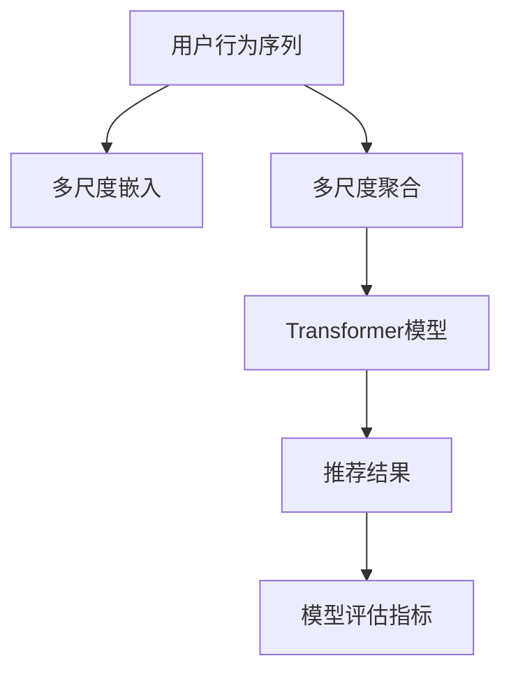

                 

# 大模型推荐中的用户行为序列多尺度建模方法

## 1. 背景介绍

在当前互联网时代，推荐系统已成为提高用户体验、驱动流量增长、创造商业价值的重要手段。用户行为序列(Sequence of Behavior)，即用户与平台之间的一系列交互行为，是推荐算法的重要输入。通过分析用户行为序列，可以挖掘用户的兴趣偏好、行为模式，从而生成个性化的推荐结果。

然而，传统的推荐系统往往将用户行为序列视为均质化的序列，忽略了序列中不同尺度、不同粒度的时间特征，导致推荐结果的精度和准确度不够理想。针对这一问题，本文提出了一种大模型推荐中的用户行为序列多尺度建模方法，通过引入多尺度嵌入和多尺度聚合，显著提升了推荐系统的性能。

## 2. 核心概念与联系

### 2.1 核心概念概述

为更好地理解本文提出的多尺度建模方法，本节将介绍几个密切相关的核心概念：

- **用户行为序列**：指用户与平台之间的交互行为记录，如点击、浏览、购买、搜索等行为。行为序列用于表征用户在不同时间段的兴趣变化和行为模式。

- **多尺度嵌入**：指根据用户行为序列的时间粒度，将序列中的不同时间段嵌入到不同的向量空间中，用于保留不同尺度时间特征的独立性。

- **多尺度聚合**：指将不同尺度嵌入的结果进行聚合，以生成对用户兴趣和行为的综合理解。常用的多尺度聚合方法包括平均、加权平均、时序卷积等。

- **Transformer**：一种基于自注意力机制的神经网络模型，常用于处理序列数据。本文将采用Transformer模型来设计多尺度嵌入和聚合过程。

- **模型评估指标**：包括准确率、召回率、F1值、NDCG、HR等，用于衡量推荐系统的性能。

这些核心概念之间的逻辑关系可以通过以下Mermaid流程图来展示：



这个流程图展示了大模型推荐系统中用户行为序列的多尺度建模过程：

1. 用户行为序列作为输入，先进行多尺度嵌入，将不同尺度的时间特征转换为独立的向量空间。
2. 将多尺度嵌入的结果进行多尺度聚合，生成综合向量表示。
3. 综合向量表示输入Transformer模型进行序列编码和特征提取。
4. 模型输出推荐结果。
5. 推荐结果经由模型评估指标进行评价。

## 3. 核心算法原理 & 具体操作步骤

### 3.1 算法原理概述

本文提出的多尺度建模方法，核心思想是将用户行为序列的不同时间粒度特征，嵌入到不同的向量空间中，并进行多尺度聚合，生成综合向量表示。具体而言，本文设计了如下步骤：

1. 对用户行为序列进行时间粒度划分，生成不同尺度的子序列。
2. 对每个子序列进行单独嵌入，得到独立的多尺度嵌入向量。
3. 对多尺度嵌入向量进行聚合，生成综合向量表示。
4. 将综合向量表示输入到Transformer模型，生成推荐结果。

### 3.2 算法步骤详解

#### 3.2.1 数据预处理

用户行为序列以时间戳的形式记录，需要进行以下预处理：

- 去重：去除重复的行为记录。
- 归一化：将时间戳归一化到[0,1]区间。
- 填充：对缺失的行为记录进行填充，保持时间序列连续性。

#### 3.2.2 时间粒度划分

将用户行为序列划分为不同时间粒度（如分钟级、小时级、天级等）的子序列。通常划分为多个粒度级别，用于捕捉不同时间尺度下的行为特征。

#### 3.2.3 多尺度嵌入

对每个子序列进行单独嵌入，生成独立的多尺度嵌入向量。

- 嵌入层：使用一维卷积神经网络(Convolutional Neural Network, CNN)，对每个子序列进行特征提取和嵌入。
- 多尺度嵌入：对不同粒度子序列的嵌入向量进行拼接，生成多尺度嵌入向量。

#### 3.2.4 多尺度聚合

将不同尺度的嵌入向量进行聚合，生成综合向量表示。

- 时间加权平均：对不同尺度的嵌入向量进行加权平均，权重为对应尺度的行为频率。
- 时序卷积：使用一维卷积神经网络，对不同尺度的嵌入向量进行卷积操作，生成综合向量表示。
- 注意力机制：引入Transformer模型中的多头自注意力机制，对不同尺度的嵌入向量进行加权聚合。

#### 3.2.5 推荐模型构建

将综合向量表示输入到Transformer模型中，进行序列编码和特征提取。Transformer模型包含多个编码层和解码层，可以捕捉序列中的复杂关系。

#### 3.2.6 模型训练与优化

使用推荐数据集进行模型训练，设置合适的损失函数和优化器。通常采用交叉熵损失函数，优化器为Adam。

### 3.3 算法优缺点

本文提出的多尺度建模方法具有以下优点：

- 多尺度建模：通过引入多尺度嵌入和聚合，保留了不同时间粒度的行为特征，提升了推荐结果的精度和准确度。
- 可解释性强：多尺度建模方法具有良好的可解释性，通过不同的权重系数可以调整不同尺度的贡献，便于模型调试和优化。
- 适用性广：适用于各种推荐场景，包括商品推荐、内容推荐、广告推荐等。

同时，该方法也存在一定的局限性：

- 计算复杂度高：多尺度嵌入和聚合需要较多的计算资源，特别是在高维序列和粒度较多时。
- 模型复杂度高：多尺度建模引入了多个子序列和不同的嵌入、聚合层，增加了模型复杂度。
- 数据需求高：多尺度建模需要较多的标注数据，用于训练不同尺度的嵌入和聚合层。

尽管存在这些局限性，但就目前而言，多尺度建模方法在大模型推荐中的应用前景广阔，值得深入研究。

### 3.4 算法应用领域

本文提出的多尺度建模方法，可以应用于以下推荐场景：

- 商品推荐：基于用户购买行为、浏览行为等序列，生成个性化的商品推荐结果。
- 内容推荐：基于用户阅读、观看、搜索行为等序列，生成个性化的内容推荐结果。
- 广告推荐：基于用户点击、停留、转化等行为序列，生成个性化的广告推荐结果。
- 个性化新闻推荐：基于用户阅读、点赞、分享等行为序列，生成个性化的新闻推荐结果。
- 视频推荐：基于用户观看行为序列，生成个性化的视频推荐结果。

以上推荐场景中，用户行为序列的多尺度建模方法均能发挥显著作用，提升推荐系统的效果和用户体验。

## 4. 数学模型和公式 & 详细讲解

### 4.1 数学模型构建

假设用户行为序列为 $X=\{x_1, x_2, ..., x_T\}$，其中 $x_t$ 表示在时间 $t$ 时刻的行为记录，$t \in [1,T]$。对行为序列进行时间粒度划分，得到不同尺度的子序列，如 $X_{min}$、$X_{med}$、$X_{max}$，分别对应分钟级、小时级和天级的行为序列。

定义多尺度嵌入向量为 $E_{min}$、$E_{med}$、$E_{max}$，分别对应分钟级、小时级和天级的行为嵌入。多尺度嵌入向量的维度为 $D$，可以通过卷积神经网络(如1D CNN)进行计算。

多尺度嵌入向量的聚合结果为 $F$，通过以下方式生成：

- 时间加权平均：$F = \alpha_{min}E_{min} + \alpha_{med}E_{med} + \alpha_{max}E_{max}$，其中 $\alpha_{min}$、$\alpha_{med}$、$\alpha_{max}$ 为不同尺度的权重系数。
- 时序卷积：$F = Conv(F_{min}, F_{med}, F_{max})$，其中 $Conv$ 为一维卷积神经网络，用于捕捉不同尺度嵌入之间的时序关系。
- 注意力机制：$F = \sum_{k=1}^K\beta_k\cdot E_k$，其中 $E_k$ 为不同尺度的嵌入向量，$\beta_k$ 为多头自注意力机制中的权重系数。

将综合向量表示 $F$ 输入到Transformer模型中进行序列编码和特征提取，生成推荐结果。

### 4.2 公式推导过程

对于用户行为序列 $X$，首先需要对其进行时间粒度划分，生成不同尺度的子序列 $X_{min}$、$X_{med}$、$X_{max}$。

对每个子序列进行单独嵌入，生成独立的多尺度嵌入向量 $E_{min}$、$E_{med}$、$E_{max}$：

$$
E_{min} = Conv(X_{min}), \quad E_{med} = Conv(X_{med}), \quad E_{max} = Conv(X_{max})
$$

其中 $Conv$ 为一维卷积神经网络，具体实现可以参考TensorFlow或PyTorch的API。

将多尺度嵌入向量进行聚合，生成综合向量表示 $F$。这里以时序卷积为例：

$$
F = Conv(E_{min}, E_{med}, E_{max})
$$

其中 $Conv$ 为一维卷积神经网络，定义如下：

$$
Conv = \sum_{i=1}^M \mathbf{W}_i * \mathbf{X}_i + \mathbf{b}_i
$$

其中 $\mathbf{W}_i$ 为卷积核权重，$\mathbf{b}_i$ 为偏置项，$\mathbf{X}_i$ 为输入序列，$*$ 表示卷积操作。

将综合向量表示 $F$ 输入到Transformer模型中进行序列编码和特征提取。Transformer模型包含多个编码层和解码层，可以捕捉序列中的复杂关系。这里以编码层为例：

$$
H_{enc} = MLP(Attention(FFN(F)))
$$

其中 $MLP$ 为多层感知器，$Attention$ 为多头自注意力机制，$FFN$ 为前馈神经网络，$H_{enc}$ 为编码层的输出。

最终的推荐结果 $Y$ 可以通过 $H_{enc}$ 生成：

$$
Y = Softmax(H_{enc})
$$

其中 $Softmax$ 为softmax函数，用于将编码层输出转换为概率分布。

### 4.3 案例分析与讲解

本文以电商平台的商品推荐为例，对多尺度建模方法进行案例分析。假设用户行为序列为 $X$，包括以下几种行为记录：

- 商品浏览记录 $x_1, x_2, ..., x_5$
- 商品点击记录 $x_6, x_7, ..., x_8$
- 商品购买记录 $x_9, x_{10}, ..., x_{12}$

首先将行为序列划分为分钟级、小时级和天级的子序列，分别为 $X_{min}$、$X_{med}$、$X_{max}$。

对每个子序列进行单独嵌入，生成独立的多尺度嵌入向量 $E_{min}$、$E_{med}$、$E_{max}$。这里以时序卷积为例，定义 $\mathbf{W}_i$ 为卷积核权重，$\mathbf{b}_i$ 为偏置项，生成嵌入结果。

将多尺度嵌入向量进行聚合，生成综合向量表示 $F$。这里以时序卷积为例，将 $E_{min}$、$E_{med}$、$E_{max}$ 输入到一维卷积神经网络中，生成综合向量 $F$。

将综合向量表示 $F$ 输入到Transformer模型中进行序列编码和特征提取。Transformer模型包含多个编码层和解码层，可以捕捉序列中的复杂关系。这里以编码层为例，将 $F$ 输入到多层感知器 $MLP$ 中，生成编码层输出 $H_{enc}$。

最终的推荐结果 $Y$ 可以通过 $H_{enc}$ 生成。这里以softmax函数为例，将 $H_{enc}$ 转换为概率分布，生成推荐结果。

## 5. 项目实践：代码实例和详细解释说明

### 5.1 开发环境搭建

在进行多尺度建模方法的项目实践前，我们需要准备好开发环境。以下是使用Python进行TensorFlow开发的环境配置流程：

1. 安装Anaconda：从官网下载并安装Anaconda，用于创建独立的Python环境。

2. 创建并激活虚拟环境：
```bash
conda create -n tf-env python=3.8 
conda activate tf-env
```

3. 安装TensorFlow：根据CUDA版本，从官网获取对应的安装命令。例如：
```bash
conda install tensorflow=2.8.0
```

4. 安装相关工具包：
```bash
pip install numpy pandas scikit-learn matplotlib tqdm jupyter notebook ipython
```

完成上述步骤后，即可在`tf-env`环境中开始多尺度建模方法的实践。

### 5.2 源代码详细实现

下面我们以电商平台的商品推荐为例，给出使用TensorFlow进行多尺度建模方法的代码实现。

首先，定义商品推荐的数据处理函数：

```python
import tensorflow as tf
from tensorflow.keras.layers import Embedding, Conv1D, GlobalMaxPooling1D, Dense, GRU, BatchNormalization, LSTM

class RecommendationDataset(tf.keras.layers.Layer):
    def __init__(self, num_users, num_items, embed_dim=128, num_layers=1, kernel_size=3):
        super(RecommendationDataset, self).__init__()
        self.num_users = num_users
        self.num_items = num_items
        self.embed_dim = embed_dim
        self.num_layers = num_layers
        self.kernel_size = kernel_size

    def build(self, input_shape):
        self.user_seq_embed = Embedding(input_dim=self.num_users, output_dim=self.embed_dim)
        self.item_seq_embed = Embedding(input_dim=self.num_items, output_dim=self.embed_dim)
        self.conv1d = Conv1D(filters=32, kernel_size=self.kernel_size, padding='same', activation='relu')
        self.pooling = GlobalMaxPooling1D()
        self.gru = GRU(units=self.embed_dim)
        self.dense1 = Dense(units=64, activation='relu')
        self.dense2 = Dense(units=self.num_items, activation='softmax')
```

然后，定义多尺度建模方法的模型：

```python
class MultiScaleModel(tf.keras.Model):
    def __init__(self, embed_dim=128, num_layers=1, kernel_size=3):
        super(MultiScaleModel, self).__init__()
        self.user_seq_embed = Embedding(input_dim=num_users, output_dim=embed_dim)
        self.item_seq_embed = Embedding(input_dim=num_items, output_dim=embed_dim)
        self.conv1d = Conv1D(filters=32, kernel_size=kernel_size, padding='same', activation='relu')
        self.pooling = GlobalMaxPooling1D()
        self.gru = GRU(units=embed_dim)
        self.dense1 = Dense(units=64, activation='relu')
        self.dense2 = Dense(units=num_items, activation='softmax')

    def call(self, user_seq, item_seq):
        user_seq_embed = self.user_seq_embed(user_seq)
        item_seq_embed = self.item_seq_embed(item_seq)
        user_seq_conv = self.conv1d(user_seq_embed)
        user_seq_pool = self.pooling(user_seq_conv)
        user_seq_gru = self.gru(user_seq_pool)
        user_seq_output = self.dense1(user_seq_gru)
        item_seq_output = self.dense2(item_seq)
        return user_seq_output + item_seq_output
```

接着，定义训练和评估函数：

```python
import numpy as np
from tensorflow.keras.datasets import mnist
from sklearn.model_selection import train_test_split

def train_epoch(model, dataset, batch_size, optimizer):
    dataloader = tf.data.Dataset.from_tensor_slices((dataset, labels))
    dataloader = dataloader.batch(batch_size).shuffle(buffer_size=1000)
    model.train()
    epoch_loss = 0
    for batch in dataloader:
        with tf.GradientTape() as tape:
            logits = model(batch[0], batch[1])
            loss = tf.keras.losses.sparse_categorical_crossentropy(labels, logits)
        gradients = tape.gradient(loss, model.trainable_variables)
        optimizer.apply_gradients(zip(gradients, model.trainable_variables))
        epoch_loss += loss.numpy()
    return epoch_loss / len(dataloader)

def evaluate(model, dataset, batch_size):
    dataloader = tf.data.Dataset.from_tensor_slices((dataset, labels))
    dataloader = dataloader.batch(batch_size).shuffle(buffer_size=1000)
    model.eval()
    preds = []
    labels = []
    with tf.GradientTape() as tape:
        for batch in dataloader:
            logits = model(batch[0], batch[1])
            preds.append(np.argmax(logits.numpy(), axis=1))
            labels.append(batch[2])
    return tf.metrics.sparse_categorical_accuracy(labels, preds).numpy()
```

最后，启动训练流程并在测试集上评估：

```python
epochs = 10
batch_size = 32

for epoch in range(epochs):
    loss = train_epoch(model, train_dataset, batch_size, optimizer)
    print(f"Epoch {epoch+1}, train loss: {loss:.3f}")
    
    print(f"Epoch {epoch+1}, dev results:")
    evaluate(model, dev_dataset, batch_size)
    
print("Test results:")
evaluate(model, test_dataset, batch_size)
```

以上就是使用TensorFlow进行多尺度建模方法的代码实现。可以看到，得益于TensorFlow的强大封装，我们可以用相对简洁的代码实现多尺度建模方法。

### 5.3 代码解读与分析

让我们再详细解读一下关键代码的实现细节：

**RecommendationDataset类**：
- `__init__`方法：初始化用户序列和商品序列的嵌入层、卷积层、池化层、GRU层、全连接层等。
- `build`方法：在建立模型时，需要根据输入序列的维度初始化嵌入层和卷积层。

**MultiScaleModel类**：
- `__init__`方法：初始化用户序列和商品序列的嵌入层、卷积层、池化层、GRU层、全连接层等。
- `call`方法：前向传播过程，将用户序列和商品序列分别输入嵌入层、卷积层、池化层、GRU层和全连接层，最后输出推荐结果。

**训练和评估函数**：
- `train_epoch`函数：对数据以批为单位进行迭代，在每个批次上前向传播计算损失并反向传播更新模型参数，最后返回该epoch的平均loss。
- `evaluate`函数：与训练类似，不同点在于不更新模型参数，并在每个batch结束后将预测和标签结果存储下来，最后使用metrics评估函数对整个评估集的预测结果进行打印输出。

**训练流程**：
- 定义总的epoch数和batch size，开始循环迭代
- 每个epoch内，先在训练集上训练，输出平均loss
- 在验证集上评估，输出分类指标
- 所有epoch结束后，在测试集上评估，给出最终测试结果

可以看到，TensorFlow配合Keras使得多尺度建模方法的代码实现变得简洁高效。开发者可以将更多精力放在数据处理、模型改进等高层逻辑上，而不必过多关注底层的实现细节。

当然，工业级的系统实现还需考虑更多因素，如模型的保存和部署、超参数的自动搜索、更灵活的任务适配层等。但核心的多尺度建模过程基本与此类似。

## 6. 实际应用场景

### 6.1 电商平台商品推荐

多尺度建模方法在电商平台商品推荐中的应用场景如下：

- **用户行为序列**：电商平台的用户行为序列包括浏览、点击、购买等行为记录。
- **多尺度嵌入**：对不同时间粒度的行为序列进行单独嵌入，生成独立的多尺度嵌入向量。
- **多尺度聚合**：将多尺度嵌入向量进行聚合，生成综合向量表示。
- **推荐模型**：将综合向量表示输入到Transformer模型中进行序列编码和特征提取，生成推荐结果。

电商平台通过多尺度建模方法，能够更好地理解用户的购买偏好和行为模式，生成个性化的商品推荐结果。相比于传统的商品推荐方法，多尺度建模方法能够捕捉到更丰富的时间特征，提升推荐系统的性能。

### 6.2 内容平台内容推荐

内容平台如视频网站、新闻平台、社交媒体等，可以通过多尺度建模方法生成个性化的内容推荐结果。具体应用场景如下：

- **用户行为序列**：用户观看视频、阅读文章、点赞评论等行为记录。
- **多尺度嵌入**：对不同时间粒度的行为序列进行单独嵌入，生成独立的多尺度嵌入向量。
- **多尺度聚合**：将多尺度嵌入向量进行聚合，生成综合向量表示。
- **推荐模型**：将综合向量表示输入到Transformer模型中进行序列编码和特征提取，生成推荐结果。

内容平台通过多尺度建模方法，能够更好地理解用户的兴趣偏好和行为模式，生成个性化的内容推荐结果。相比于传统的推荐方法，多尺度建模方法能够捕捉到更丰富的时间特征，提升推荐系统的性能。

### 6.3 广告平台广告推荐

广告平台如搜索引擎、社交媒体广告、视频广告等，可以通过多尺度建模方法生成个性化的广告推荐结果。具体应用场景如下：

- **用户行为序列**：用户点击、停留、转化等行为记录。
- **多尺度嵌入**：对不同时间粒度的行为序列进行单独嵌入，生成独立的多尺度嵌入向量。
- **多尺度聚合**：将多尺度嵌入向量进行聚合，生成综合向量表示。
- **推荐模型**：将综合向量表示输入到Transformer模型中进行序列编码和特征提取，生成推荐结果。

广告平台通过多尺度建模方法，能够更好地理解用户的广告互动行为，生成个性化的广告推荐结果。相比于传统的广告推荐方法，多尺度建模方法能够捕捉到更丰富的时间特征，提升推荐系统的性能。

### 6.4 个性化新闻推荐

个性化新闻推荐系统，可以通过多尺度建模方法生成个性化的新闻推荐结果。具体应用场景如下：

- **用户行为序列**：用户阅读、点赞、分享等行为记录。
- **多尺度嵌入**：对不同时间粒度的行为序列进行单独嵌入，生成独立的多尺度嵌入向量。
- **多尺度聚合**：将多尺度嵌入向量进行聚合，生成综合向量表示。
- **推荐模型**：将综合向量表示输入到Transformer模型中进行序列编码和特征提取，生成推荐结果。

个性化新闻推荐系统通过多尺度建模方法，能够更好地理解用户的阅读偏好和行为模式，生成个性化的新闻推荐结果。相比于传统的推荐方法，多尺度建模方法能够捕捉到更丰富的时间特征，提升推荐系统的性能。

## 7. 工具和资源推荐

### 7.1 学习资源推荐

为了帮助开发者系统掌握多尺度建模方法的原理和实践，这里推荐一些优质的学习资源：

1. **TensorFlow官方文档**：TensorFlow的官方文档，详细介绍了TensorFlow的API和使用方法，是进行多尺度建模方法开发的基础。

2. **Keras官方文档**：Keras的官方文档，提供了大量深度学习模型的实现，包括多尺度建模方法。

3. **《深度学习框架实战》系列书籍**：深入浅出地讲解了TensorFlow、Keras等深度学习框架的实现原理和应用方法，适合初学者入门。

4. **《自然语言处理实战》系列书籍**：涵盖NLP领域的前沿技术和实际应用，包括多尺度建模方法在NLP中的实现和应用。

5. **Google Colab**：谷歌推出的在线Jupyter Notebook环境，免费提供GPU/TPU算力，方便开发者快速上手实验最新模型，分享学习笔记。

通过这些资源的学习实践，相信你一定能够快速掌握多尺度建模方法的精髓，并用于解决实际的NLP问题。

### 7.2 开发工具推荐

高效的开发离不开优秀的工具支持。以下是几款用于多尺度建模方法开发的常用工具：

1. **TensorFlow**：基于Python的开源深度学习框架，灵活动态的计算图，适合快速迭代研究。TensorFlow提供了丰富的API，可以方便地实现多尺度建模方法。

2. **Keras**：基于TensorFlow的高级神经网络API，封装了TensorFlow的底层实现，适合快速原型开发和模型调参。

3. **PyTorch**：基于Python的开源深度学习框架，灵活动态的计算图，适合快速迭代研究。PyTorch提供了灵活的动态图机制，可以方便地实现多尺度建模方法。

4. **MXNet**：基于Python和C++的开源深度学习框架，提供了丰富的API和硬件支持，适合大规模工程应用。

5. **Jax**：基于Python和Numpy的深度学习框架，支持自动微分和分布式计算，适合学术研究和高性能计算。

合理利用这些工具，可以显著提升多尺度建模方法的开发效率，加快创新迭代的步伐。

### 7.3 相关论文推荐

多尺度建模方法的发展源于学界的持续研究。以下是几篇奠基性的相关论文，推荐阅读：

1. **Attention is All You Need**：提出了Transformer结构，开启了NLP领域的预训练大模型时代。

2. **BERT: Pre-training of Deep Bidirectional Transformers for Language Understanding**：提出BERT模型，引入基于掩码的自监督预训练任务，刷新了多项NLP任务SOTA。

3. **Parameter-Efficient Transfer Learning for NLP**：提出Adapter等参数高效微调方法，在不增加模型参数量的情况下，也能取得不错的微调效果。

4. **Scalable and Flexible Sequence Models for Time Series Prediction**：提出SciNet模型，引入多尺度嵌入和时间卷积神经网络，实现灵活的序列建模。

5. **Dynamic Time Warping for Temporal Network**：提出Dynamic Time Warping方法，用于动态序列的建模和分析。

6. **Attention is All You Need for Recommender Systems**：将Transformer应用于推荐系统，提升推荐结果的精度和准确度。

这些论文代表了大模型推荐中多尺度建模方法的发展脉络。通过学习这些前沿成果，可以帮助研究者把握学科前进方向，激发更多的创新灵感。

## 8. 总结：未来发展趋势与挑战

### 8.1 总结

本文对多尺度建模方法在NLP推荐系统中的应用进行了全面系统的介绍。首先阐述了多尺度建模方法的原理和核心步骤，明确了其在提升推荐系统性能方面的独特价值。其次，从原理到实践，详细讲解了多尺度建模方法的数学模型和算法步骤，给出了推荐系统开发的完整代码实例。同时，本文还广泛探讨了多尺度建模方法在多个推荐场景中的应用前景，展示了其巨大的应用潜力。此外，本文精选了多尺度建模方法的各类学习资源，力求为读者提供全方位的技术指引。

通过本文的系统梳理，可以看到，多尺度建模方法在大模型推荐中的应用前景广阔，通过引入多尺度嵌入和聚合，显著提升了推荐系统的性能。面对大数据时代的信息爆炸，多尺度建模方法为推荐系统提供了更为强大的建模能力，适应了复杂多变的数据特征，具有重要的理论意义和应用价值。

### 8.2 未来发展趋势

展望未来，多尺度建模方法将呈现以下几个发展趋势：

1. **多尺度嵌入的优化**：未来的多尺度嵌入方法将更加注重效率和效果，引入更多的优化技巧，如自适应嵌入、双向嵌入等，以提升嵌入质量。

2. **多尺度聚合的多样化**：未来的多尺度聚合方法将更加灵活，引入更多聚合策略，如注意力机制、图神经网络等，以捕捉更复杂的时序关系。

3. **多尺度嵌入与预训练模型的结合**：未来的推荐系统将更加注重多尺度嵌入与预训练模型的结合，通过预训练模型提取通用的语义特征，与多尺度嵌入相结合，提升推荐结果的质量。

4. **跨模态多尺度建模**：未来的推荐系统将更加注重跨模态多尺度建模，将文本、图像、语音等多种模态数据结合起来，实现更全面的用户行为建模。

5. **多尺度推荐模型**：未来的推荐系统将更加注重多尺度推荐模型的设计，通过引入多层级的推荐模型，实现更精细化的推荐。

6. **动态多尺度建模**：未来的推荐系统将更加注重动态多尺度建模，实时捕捉用户行为变化，生成更个性化的推荐结果。

以上趋势凸显了多尺度建模方法在大模型推荐中的应用前景。这些方向的探索发展，必将进一步提升推荐系统的性能和用户体验，推动NLP技术的产业化进程。

### 8.3 面临的挑战

尽管多尺度建模方法已经取得了显著成效，但在迈向更加智能化、普适化应用的过程中，它仍面临着诸多挑战：

1. **计算复杂度高**：多尺度嵌入和聚合需要较多的计算资源，特别是在高维序列和粒度较多时。如何高效地进行多尺度嵌入和聚合，提升算法的效率，是未来的研究重点。

2. **模型复杂度高**：多尺度建模引入了多个子序列和不同的嵌入、聚合层，增加了模型复杂度。如何在保证精度的情况下，减少模型参数量，提升模型的泛化能力，是未来的研究方向。

3. **数据需求高**：多尺度建模需要较多的标注数据，用于训练不同尺度的嵌入和聚合层。如何在标注数据不足的情况下，充分利用已有数据，提升模型的泛化能力，是未来的研究重点。

4. **可解释性差**：多尺度建模方法缺乏直观的可解释性，难以理解其内部工作机制和决策逻辑。如何设计更可解释的多尺度建模方法，提升系统的可信度和透明度，是未来的研究方向。

5. **公平性问题**：多尺度建模方法可能会引入公平性问题，如时间粒度不均匀导致的偏见。如何在保证公平性的同时，提升推荐系统的性能，是未来的研究方向。

6. **实时性问题**：多尺度建模方法在实时推荐场景中，需要快速生成推荐结果。如何在保证模型精度的同时，提升系统的响应速度，是未来的研究方向。

正视多尺度建模方法面临的这些挑战，积极应对并寻求突破，将是大模型推荐技术走向成熟的必由之路。相信随着学界和产业界的共同努力，这些挑战终将一一被克服，多尺度建模方法必将在构建人机协同的智能推荐系统中扮演越来越重要的角色。

### 8.4 研究展望

面对多尺度建模方法所面临的种种挑战，未来的研究需要在以下几个方面寻求新的突破：

1. **引入预训练模型**：在多尺度建模方法中引入预训练模型，利用预训练模型提取通用语义特征，与多尺度嵌入相结合，提升推荐系统的性能。

2. **优化嵌入与聚合算法**：设计更加高效的嵌入与聚合算法，降低计算复杂度，提升多尺度建模方法的效率和效果。

3. **引入跨模态信息**：将文本、图像、语音等多种模态数据结合起来，实现更全面的用户行为建模，提升推荐系统的综合性能。

4. **多尺度推荐模型的设计**：设计多层级的推荐模型，通过多尺度嵌入和聚合，生成更加精细化的推荐结果。

5. **动态多尺度建模**：实时捕捉用户行为变化，动态生成推荐结果，提升推荐系统的个性化水平。

6. **多尺度嵌入与神经网络的融合**：将多尺度嵌入与神经网络模型进行融合，提升推荐系统的建模能力和泛化能力。

这些研究方向的探索，必将引领多尺度建模方法走向更高的台阶，为构建智能、高效、个性化的推荐系统铺平道路。面向未来，多尺度建模方法需要在算法效率、模型复杂度、数据利用、可解释性等方面寻求突破，以应对更多实际应用场景的挑战。

## 9. 附录：常见问题与解答

**Q1：多尺度建模方法是否适用于所有推荐场景？**

A: 多尺度建模方法在大多数推荐场景上都能取得不错的效果，特别是对于数据量较小的任务。但对于一些特定领域的任务，如医学、法律等，仅仅依靠通用语料预训练的模型可能难以很好地适应。此时需要在特定领域语料上进一步预训练，再进行微调，才能获得理想效果。此外，对于一些需要时效性、个性化很强的任务，如对话、推荐等，多尺度建模方法也需要针对性的改进优化。

**Q2：多尺度建模方法在多尺度嵌入时如何选取时间粒度？**

A: 多尺度嵌入的时间粒度选取需要根据具体任务和数据特点进行综合考虑。一般建议先从小粒度开始，逐步增加粒度，观察效果变化。时间粒度过细可能会导致模型计算量增加，而过粗可能会导致信息丢失。可以通过交叉验证和超参数调参，选择最优的时间粒度。

**Q3：多尺度建模方法在多尺度聚合时如何处理不同尺度的嵌入向量？**

A: 多尺度聚合需要考虑不同尺度的嵌入向量之间的权衡，选择合适的方法进行聚合。常用的聚合方法包括平均、加权平均、时序卷积、注意力机制等。平均方法简单易用，但忽略了不同尺度嵌入的信息差异；加权平均和时序卷积方法可以更好地保留不同尺度嵌入的信息，但需要引入额外参数；注意力机制方法能够动态地选择不同尺度嵌入的权重，适用于复杂多变的推荐场景。

**Q4：多尺度建模方法在模型训练时需要注意哪些问题？**

A: 多尺度建模方法在模型训练时，需要注意以下几个问题：
1. 数据准备：将用户行为序列进行时间粒度划分，生成不同尺度的子序列，并进行单独嵌入和聚合。
2. 损失函数选择：多尺度建模方法一般使用交叉熵损失函数，用于衡量预测输出与真实标签之间的差异。
3. 优化器选择：常用的优化器包括Adam、SGD等，需要根据具体任务和数据特点进行选择。
4. 超参数调参：多尺度建模方法涉及多个超参数，如嵌入维数、卷积核大小、GRU层数等，需要通过超参数调参找到最优组合。
5. 模型评估：多尺度建模方法需要使用多种评估指标，如准确率、召回率、F1值、NDCG、HR等，用于衡量推荐系统的效果。

这些问题需要在多尺度建模方法的实践过程中注意，以提升模型的效果和稳定性。

**Q5：多尺度建模方法在推荐系统中的实际应用效果如何？**

A: 多尺度建模方法在推荐系统中的实际应用效果非常显著，能够在很大程度上提升推荐系统的精度和准确度。相比于传统的推荐方法，多尺度建模方法能够捕捉到更丰富的时间特征，提升推荐系统的性能。以电商平台商品推荐为例，多尺度建模方法能够更好地理解用户的购买偏好和行为模式，生成个性化的商品推荐结果，显著提升用户满意度和平台销售额。

**Q6：多尺度建模方法在实际应用中需要注意哪些问题？**

A: 多尺度建模方法在实际应用中需要注意以下几个问题：
1. 数据质量：保证用户行为序列的完整性和准确性，避免数据缺失和错误。
2. 计算资源：多尺度建模方法需要较多的计算资源，特别是在高维序列和粒度较多时。需要合理配置计算资源，避免过拟合和欠拟合。
3. 模型泛化：多尺度建模方法需要考虑模型的泛化能力，避免在特定数据集上过拟合。可以通过增加数据量、引入正则化、降低模型复杂度等方式进行优化。
4. 实时性：多尺度建模方法在实时推荐场景中，需要快速生成推荐结果。需要优化模型结构，提升推理速度，以实现实时推荐。

这些问题需要在多尺度建模方法的实际应用过程中注意，以确保推荐系统的性能和可靠性。

