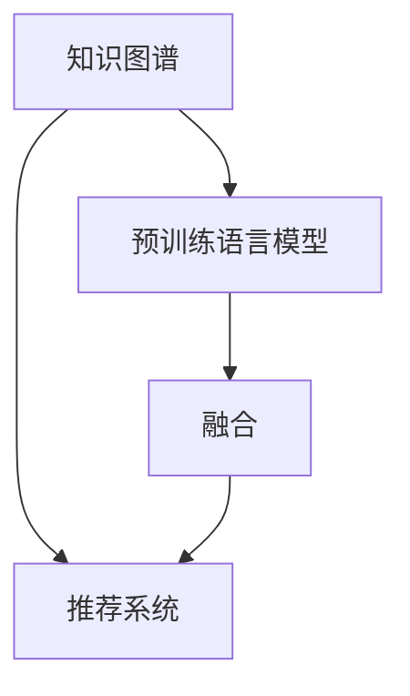

                 

# 大模型推荐中的知识图谱融合应用新方式与案例

## 1. 背景介绍

### 1.1 问题由来

在现代信息技术飞速发展的背景下，推荐系统已成为各行各业应用的核心环节。无论是电商、社交媒体、视频平台还是金融、医疗等专业领域，推荐系统都在不断提升用户体验和运营效率。近年来，深度学习技术在推荐系统中的应用取得了显著进展，尤其是大规模预训练语言模型的应用，在推荐场景中展现出了极高的潜力。

大模型推荐系统通常采用通用预训练模型（如BERT、GPT等），通过对其权重进行微调，以适应特定的推荐任务。然而，单纯依赖文本数据的推荐往往难以充分利用结构化的语义信息，导致推荐效果有限。知识图谱作为语义信息的结构化表示形式，在大模型推荐中扮演着重要角色。

知识图谱是一种以图的形式组织和表示实体及其之间关系的数据结构，是构建语义搜索、问答系统、推荐系统等应用的基础。知识图谱融合大模型推荐，即通过将知识图谱与预训练语言模型进行结合，利用图谱中的结构化语义信息，增强推荐系统的效果。目前，知识图谱在大模型推荐中的应用形式多种多样，包括直接基于知识图谱的推荐、融合知识图谱的推荐、基于知识图谱增强的推荐等。

本文将从核心概念、算法原理、实现步骤、案例分析等角度，详细探讨知识图谱融合大模型推荐的新方式与应用案例，以期为相关技术开发者和研究者提供参考。

### 1.2 问题核心关键点

知识图谱融合大模型推荐的核心在于如何有效地将知识图谱的语义信息融合到预训练模型中，以提升推荐的准确性和个性化程度。其关键点包括：

- 知识图谱的构建与表示：构建高质量的知识图谱，并将其有效表示为模型可处理的形式。
- 图谱-语言模型的融合方式：选择合适的融合方式，如联合训练、自监督学习等，将知识图谱信息与语言模型参数结合。
- 推荐策略的设计：设计合适的推荐算法，如基于图谱的路径推荐、基于语义的推荐等，充分利用图谱与语言模型中的信息。

## 2. 核心概念与联系

### 2.1 核心概念概述

- **知识图谱(Knowledge Graph, KG)**：一种以图的形式存储实体及其关系的语义网络。
- **预训练语言模型(Pre-trained Language Model, PLM)**：如BERT、GPT等，通过大规模无标签文本数据进行预训练，学习通用的语言表示。
- **推荐系统(Recommendation System)**：基于用户的历史行为、兴趣偏好等数据，推荐用户可能感兴趣的商品、内容等。
- **融合(Fusion)**：将知识图谱与预训练模型结合，通过微调等方法，将图谱中的结构化语义信息融合到语言模型中，提升推荐效果。
- **多模态学习(Multi-modal Learning)**：结合多种数据模态（如文本、图像、音频等）进行协同学习，提高模型的泛化能力。

这些核心概念通过以下Mermaid流程图进行联系和展示：



## 3. 核心算法原理 & 具体操作步骤

### 3.1 算法原理概述

知识图谱融合大模型推荐，本质上是将知识图谱中的结构化语义信息与语言模型的分布式表示结合，通过微调等方法，优化模型在推荐任务上的表现。具体而言，这一过程包括以下几个步骤：

1. **知识图谱构建**：收集并构建高质量的知识图谱，表示实体和它们之间的关系。
2. **图谱嵌入**：将知识图谱中的实体和关系映射为向量表示，便于与语言模型进行融合。
3. **微调优化**：将预训练语言模型和图谱嵌入结合，通过微调优化推荐模型。
4. **推荐生成**：在微调后的模型基础上，设计合适的推荐算法，生成推荐结果。

### 3.2 算法步骤详解

#### 3.2.1 知识图谱构建

构建知识图谱的第一步是收集和整理实体及其关系的数据。通常，这一过程包括以下几个阶段：

1. **数据收集**：从Web数据、百科全书、数据库等来源收集数据。
2. **实体识别**：使用命名实体识别(NER)等技术，从文本中识别出实体。
3. **关系抽取**：使用关系抽取算法，从文本中抽取出实体之间的关系。
4. **图谱整合**：将识别出的实体和关系整合为知识图谱。

#### 3.2.2 图谱嵌入

知识图谱中的实体和关系可以表示为图结构，包括节点和边。将知识图谱中的实体和关系嵌入向量空间，通常采用以下方法：

1. **TransE**：将实体和关系表示为向量，通过最小化损失函数，学习向量之间的关系。
2. **TransH**：在TransE的基础上，引入实体的类型信息，优化向量表示。
3. **KG2Vec**：将知识图谱转化为向量表示，通过优化向量间的相似度，学习向量之间的关系。

#### 3.2.3 微调优化

微调优化是知识图谱融合大模型推荐的核心步骤。通过微调，将图谱嵌入与预训练语言模型结合，具体步骤包括：

1. **选择微调数据**：准备推荐任务的标注数据集，用于微调模型的输出。
2. **融合图谱嵌入**：将图谱嵌入与预训练语言模型的参数结合，如通过拼接、加权平均等方式。
3. **微调训练**：使用微调数据，通过反向传播算法，更新模型参数。

#### 3.2.4 推荐生成

在微调后的模型基础上，设计合适的推荐算法，生成推荐结果。常见的推荐算法包括：

1. **基于图谱的路径推荐**：根据知识图谱中的路径，计算推荐结果。
2. **基于语义的推荐**：利用预训练语言模型，理解用户输入的自然语言描述，生成推荐结果。
3. **混合推荐**：结合图谱和语言模型的信息，进行多模态推荐。

### 3.3 算法优缺点

知识图谱融合大模型推荐的优点包括：

1. **提升推荐效果**：通过融合图谱的语义信息，提高推荐的准确性和个性化程度。
2. **可解释性强**：图谱中的结构化信息使得推荐过程更加透明和可解释。
3. **泛化能力强**：知识图谱中的关系有助于模型学习通用规则，提升泛化能力。

其缺点包括：

1. **构建复杂**：知识图谱的构建和维护需要大量时间和资源。
2. **动态性不足**：知识图谱更新速度较慢，难以实时反映领域变化。
3. **数据依赖性强**：需要高质量的数据和标注，构建和维护成本较高。

### 3.4 算法应用领域

知识图谱融合大模型推荐在多个领域有着广泛的应用，例如：

- **电商推荐**：结合用户行为数据和知识图谱，推荐商品和广告。
- **新闻推荐**：利用知识图谱中的实体和关系，推荐新闻和文章。
- **影视推荐**：通过电影和演员之间的关系，推荐影视作品和演员。
- **金融推荐**：结合用户和实体之间的关系，推荐金融产品和服务。
- **健康推荐**：利用知识图谱中的医学信息和关系，推荐健康信息和医疗服务。

## 4. 数学模型和公式 & 详细讲解 & 举例说明

### 4.1 数学模型构建

知识图谱融合大模型推荐的过程，可以通过数学模型来描述。假设知识图谱中有一个节点（实体）$e$，其关系$r$和向量表示$\vec{v_e}$，则知识图谱嵌入的数学模型可以表示为：

$$
\vec{v_e} = \text{Embedding}(r, \vec{v_r})
$$

其中，$\vec{v_r}$表示关系$r$的向量表示。

假设预训练语言模型为$M_{\theta}$，知识图谱嵌入向量为$\vec{v_e}$，推荐目标为$\hat{y}$，则推荐模型的数学模型可以表示为：

$$
\hat{y} = M_{\theta}(\vec{v_e})
$$

其中，$\hat{y}$表示模型的输出，$M_{\theta}$表示预训练语言模型。

### 4.2 公式推导过程

在知识图谱融合大模型推荐中，常用的损失函数包括交叉熵损失和均方误差损失。以交叉熵损失为例，假设推荐任务为二分类任务，则损失函数可以表示为：

$$
L = -\frac{1}{N}\sum_{i=1}^N \left[y_i\log \hat{y}_i + (1-y_i)\log (1-\hat{y}_i)\right]
$$

其中，$N$表示样本数，$y_i$表示样本$i$的真实标签，$\hat{y}_i$表示模型对样本$i$的预测结果。

### 4.3 案例分析与讲解

以电商推荐为例，假设知识图谱中包含用户、商品、品牌等实体，以及其购买、评价、推荐等关系。可以通过以下步骤进行融合和推荐：

1. **知识图谱构建**：收集用户、商品、品牌等实体及其关系的数据，构建知识图谱。
2. **图谱嵌入**：使用TransE等算法，将知识图谱中的实体和关系嵌入向量空间。
3. **微调优化**：将预训练的BERT模型与图谱嵌入结合，通过微调优化推荐模型。
4. **推荐生成**：设计基于图谱路径的推荐算法，生成推荐结果。

## 5. 项目实践：代码实例和详细解释说明

### 5.1 开发环境搭建

为了进行知识图谱融合大模型推荐的应用开发，需要搭建相应的开发环境。以下是使用Python进行PyTorch和SpaCy开发的流程：

1. 安装Anaconda：从官网下载并安装Anaconda，用于创建独立的Python环境。
2. 创建并激活虚拟环境：
```bash
conda create -n recommendation-env python=3.8 
conda activate recommendation-env
```

3. 安装PyTorch：根据CUDA版本，从官网获取对应的安装命令。例如：
```bash
conda install pytorch torchvision torchaudio cudatoolkit=11.1 -c pytorch -c conda-forge
```

4. 安装SpaCy：
```bash
pip install spacy
```

5. 安装GPy：
```bash
pip install GPy
```

完成上述步骤后，即可在`recommendation-env`环境中进行知识图谱融合大模型推荐的应用开发。

### 5.2 源代码详细实现

以下是一个简单的电商推荐系统示例代码，展示了如何利用知识图谱和BERT进行融合推荐：

```python
import torch
from transformers import BertForSequenceClassification, BertTokenizer
import pandas as pd
from GPy import GPy
import networkx as nx

# 加载数据
data = pd.read_csv('recommendation_data.csv')
user_ids = data['user_id'].unique()
item_ids = data['item_id'].unique()

# 构建知识图谱
kg = nx.Graph()
for i in range(len(data)):
    user = data['user_id'][i]
    item = data['item_id'][i]
    rating = data['rating'][i]
    kg.add_node(user, label='user')
    kg.add_node(item, label='item')
    kg.add_edge(user, item, label='bought', rating=rating)

# 图谱嵌入
embedding = GPy.GaussianProcessRegression(kg, alpha=0.1)
embedding.optimize(maxfun=1000)
user_embeddings = embedding.predict(user_ids, return_cov=True)
item_embeddings = embedding.predict(item_ids, return_cov=True)

# 加载BERT模型
model = BertForSequenceClassification.from_pretrained('bert-base-cased')
tokenizer = BertTokenizer.from_pretrained('bert-base-cased')

# 微调优化
model.train()
for epoch in range(10):
    for i in range(len(data)):
        user = data['user_id'][i]
        item = data['item_id'][i]
        rating = data['rating'][i]
        inputs = tokenizer.encode(data['item_description'][i], return_tensors='pt')
        targets = torch.tensor([rating], dtype=torch.float)
        outputs = model(inputs)
        loss = torch.nn.functional.binary_cross_entropy(outputs, targets)
        loss.backward()
        optimizer.step()

# 推荐生成
def recommend(user):
    user_embedding = user_embeddings[user]
    similarities = []
    for item in item_ids:
        item_embedding = item_embeddings[item]
        similarity = torch.dot(user_embedding, item_embedding)
        similarities.append(similarity)
    similarities = torch.stack(similarities)
    top_items = similarities.argsort(descending=True)[:10]
    recommendations = [item_ids[top_item] for top_item in top_items]
    return recommendations

# 示例推荐
recommendations = recommend(1)
print(recommendations)
```

### 5.3 代码解读与分析

在上述代码中，我们首先加载数据，构建知识图谱，并进行图谱嵌入。接着，加载预训练的BERT模型，进行微调优化，最后设计基于图谱路径的推荐算法。

- **数据加载**：使用Pandas加载电商推荐数据集，提取用户ID、商品ID和评分。
- **知识图谱构建**：使用NetworkX构建知识图谱，将用户、商品和评分作为节点，购买关系作为边。
- **图谱嵌入**：使用GPy进行图谱嵌入，学习用户和商品的向量表示。
- **BERT模型加载**：加载预训练的BERT模型和分词器。
- **微调优化**：在每轮训练中，输入商品描述，计算损失函数，更新模型参数。
- **推荐生成**：根据用户向量与商品向量的相似度，生成推荐商品列表。

## 6. 实际应用场景

### 6.1 电商推荐

电商推荐系统是知识图谱融合大模型推荐的重要应用场景之一。通过结合用户历史行为和商品信息，利用知识图谱中的结构化语义信息，电商推荐系统能够更好地理解用户需求和商品关系，生成更个性化的推荐结果。

在实际应用中，电商推荐系统可以通过以下步骤实现：

1. **数据收集**：收集用户浏览、点击、购买等行为数据，构建知识图谱。
2. **图谱嵌入**：使用TransE等算法，将图谱中的实体和关系嵌入向量空间。
3. **微调优化**：将BERT等预训练模型与图谱嵌入结合，通过微调优化推荐模型。
4. **推荐生成**：设计基于图谱路径的推荐算法，生成推荐商品列表。

### 6.2 新闻推荐

新闻推荐系统通过利用知识图谱中的实体和关系，推荐用户可能感兴趣的新闻和文章。新闻推荐系统的构建需要以下步骤：

1. **数据收集**：收集新闻、作者、标签等数据，构建知识图谱。
2. **图谱嵌入**：使用TransH等算法，将图谱中的实体和关系嵌入向量空间。
3. **微调优化**：将BERT等预训练模型与图谱嵌入结合，通过微调优化推荐模型。
4. **推荐生成**：设计基于图谱路径的推荐算法，生成推荐新闻列表。

### 6.3 影视推荐

影视推荐系统通过利用知识图谱中的实体和关系，推荐影视作品和演员。影视推荐系统的构建需要以下步骤：

1. **数据收集**：收集影视作品、演员、导演等数据，构建知识图谱。
2. **图谱嵌入**：使用TransE等算法，将图谱中的实体和关系嵌入向量空间。
3. **微调优化**：将BERT等预训练模型与图谱嵌入结合，通过微调优化推荐模型。
4. **推荐生成**：设计基于图谱路径的推荐算法，生成推荐影视列表。

## 7. 工具和资源推荐

### 7.1 学习资源推荐

为了帮助开发者系统掌握知识图谱融合大模型推荐技术的理论基础和实践技巧，以下推荐一些优质的学习资源：

1. 《推荐系统原理与实践》系列博文：由大模型技术专家撰写，深入浅出地介绍了推荐系统的工作原理和经典模型。
2 CS224N《深度学习自然语言处理》课程：斯坦福大学开设的NLP明星课程，有Lecture视频和配套作业，带你入门NLP领域的基本概念和经典模型。
3 《Recommender Systems: Advanced Practices and Algorithms》书籍：系统介绍推荐系统的原理和算法，包括知识图谱在大模型推荐中的应用。
4 《PyTorch推荐系统实践》书籍：介绍如何使用PyTorch进行推荐系统开发，包括知识图谱融合大模型推荐的应用。
5 HuggingFace官方文档：GPT等预训练语言模型的官方文档，提供了海量预训练模型和完整的微调样例代码，是上手实践的必备资料。

通过对这些资源的学习实践，相信你一定能够快速掌握知识图谱融合大模型推荐技术的精髓，并用于解决实际的推荐问题。

### 7.2 开发工具推荐

高效的开发离不开优秀的工具支持。以下是几款用于知识图谱融合大模型推荐开发的常用工具：

1. PyTorch：基于Python的开源深度学习框架，灵活动态的计算图，适合快速迭代研究。大部分预训练语言模型都有PyTorch版本的实现。
2 TensorFlow：由Google主导开发的开源深度学习框架，生产部署方便，适合大规模工程应用。同样有丰富的预训练语言模型资源。
3 GPy：用于构建和优化高斯过程模型的Python库，适合进行知识图谱嵌入。
4 SpaCy：用于自然语言处理任务的Python库，支持命名实体识别、关系抽取等。
5 NetworkX：用于构建和分析图数据的Python库，支持知识图谱的表示和分析。

合理利用这些工具，可以显著提升知识图谱融合大模型推荐任务的开发效率，加快创新迭代的步伐。

### 7.3 相关论文推荐

知识图谱融合大模型推荐的研究源于学界的持续研究。以下是几篇奠基性的相关论文，推荐阅读：

1. Knowledge Graph Neural Network for Recommender Systems: A Survey and Outlook（知识图谱神经网络推荐系统综述与展望）：综述了知识图谱在推荐系统中的应用，展望了未来研究方向。
2. TensorFlow for Recommendation Systems: An Overview（TensorFlow推荐系统综述）：介绍TensorFlow在推荐系统中的应用，包括知识图谱融合大模型推荐。
3 Path-based Ranking with a Knowledge Graph: Link Prediction and Recommender Systems（基于知识图谱的路径排序：链接预测和推荐系统）：研究了基于知识图谱的推荐算法，展示了其性能提升。
4 Recommendation systems with Knowledge Graphs and Deep Learning Models（知识图谱与深度学习模型融合的推荐系统）：研究了知识图谱与深度学习模型融合的推荐系统，展示了其优越性能。

这些论文代表了大模型推荐技术的发展脉络。通过学习这些前沿成果，可以帮助研究者把握学科前进方向，激发更多的创新灵感。

## 8. 总结：未来发展趋势与挑战

### 8.1 总结

本文对知识图谱融合大模型推荐技术进行了全面系统的介绍。首先阐述了知识图谱和大模型推荐的基本概念和核心技术，明确了融合技术在提升推荐效果、增强推荐可解释性方面的独特价值。其次，从原理到实践，详细讲解了知识图谱融合大模型推荐的过程，包括知识图谱构建、图谱嵌入、微调优化和推荐生成等关键步骤，给出了知识图谱融合大模型推荐的应用代码实例。同时，本文还广泛探讨了知识图谱融合大模型推荐在电商、新闻、影视等多个领域的应用前景，展示了融合技术的巨大潜力。

通过本文的系统梳理，可以看到，知识图谱融合大模型推荐技术在提升推荐系统的准确性和个性化程度方面，具有显著优势。未来，伴随知识图谱构建技术的进步和预训练语言模型的不断发展，这一技术必将在更多领域得到应用，为推荐系统带来变革性影响。

### 8.2 未来发展趋势

展望未来，知识图谱融合大模型推荐技术将呈现以下几个发展趋势：

1. **多模态融合**：结合文本、图像、音频等多种数据模态进行协同学习，提高模型的泛化能力。
2. **跨领域迁移**：将知识图谱和预训练语言模型应用于多个领域，提升推荐系统的通用性和可迁移性。
3. **实时推荐**：利用图谱嵌入的动态更新能力，实现实时推荐，满足用户的即时需求。
4. **自适应推荐**：利用图谱中的反馈信息，自适应地调整推荐策略，提升推荐的个性化程度。
5. **隐私保护**：采用差分隐私等技术，保护用户隐私，增强推荐系统的可信度。

以上趋势凸显了知识图谱融合大模型推荐技术的广阔前景。这些方向的探索发展，必将进一步提升推荐系统的性能和应用范围，为推荐系统带来更多的可能性。

### 8.3 面临的挑战

尽管知识图谱融合大模型推荐技术已经取得了显著进展，但在迈向更加智能化、普适化应用的过程中，仍面临着诸多挑战：

1. **数据获取难度**：高质量的知识图谱需要大量人工标注和处理，构建成本较高。
2. **模型复杂度**：融合知识图谱后，模型复杂度增加，训练和推理速度较慢。
3. **图谱更新速度**：知识图谱的更新速度较慢，难以实时反映领域变化。
4. **可解释性问题**：融合后的推荐模型难以解释，用户难以理解推荐结果的生成过程。
5. **系统稳定性**：推荐系统需要考虑用户行为的变化和不确定性，设计稳定的推荐算法。

这些挑战需要研究者不断探索和改进，以实现知识图谱融合大模型推荐技术的可持续发展。

### 8.4 研究展望

未来，知识图谱融合大模型推荐技术的研究方向包括：

1. **高效图谱嵌入**：研究更高效、更精确的图谱嵌入算法，减少计算资源消耗。
2. **多领域融合**：将知识图谱和预训练语言模型应用于更多领域，提升推荐系统的泛化能力。
3. **实时推荐**：结合图谱嵌入的动态更新能力，实现实时推荐，满足用户的即时需求。
4. **自适应推荐**：利用图谱中的反馈信息，自适应地调整推荐策略，提升推荐的个性化程度。
5. **隐私保护**：采用差分隐私等技术，保护用户隐私，增强推荐系统的可信度。

这些研究方向将进一步推动知识图谱融合大模型推荐技术的发展，为推荐系统带来更多的创新和应用。相信随着技术的不断进步，知识图谱融合大模型推荐必将在更多的场景中得到应用，为推荐系统带来变革性影响。

## 9. 附录：常见问题与解答

**Q1：知识图谱融合大模型推荐适用于所有推荐任务吗？**

A: 知识图谱融合大模型推荐在大多数推荐任务上都能取得不错的效果，特别是对于数据量较小的任务。但对于一些特定领域的任务，如医疗、法律等，仅仅依靠通用语料预训练的模型可能难以很好地适应。此时需要在特定领域语料上进一步预训练，再进行融合微调，才能获得理想效果。

**Q2：融合后的模型如何解释推荐结果？**

A: 融合后的模型通常使用一种基于向量相似度的推荐方法，难以直接解释推荐结果。可以使用可视化工具，如t-SNE、UMAP等，对用户和商品的向量表示进行可视化，帮助用户理解推荐过程。

**Q3：融合后的模型如何处理新用户？**

A: 新用户通常没有历史行为数据，无法直接使用融合后的模型进行推荐。可以采用冷启动策略，如基于图谱路径的推荐、基于用户兴趣的推荐等，结合预训练语言模型的语义理解能力，进行个性化推荐。

**Q4：融合后的模型如何应对领域变化？**

A: 融合后的模型可以通过图谱嵌入的动态更新能力，实时响应领域变化。同时，可以在模型中引入时间特征，增强模型对时间序列数据的处理能力。

**Q5：融合后的模型如何保护用户隐私？**

A: 采用差分隐私等技术，对用户行为数据进行匿名化处理，保护用户隐私。同时，可以设计合适的推荐策略，避免对用户行为的过度依赖。

---

作者：禅与计算机程序设计艺术 / Zen and the Art of Computer Programming

