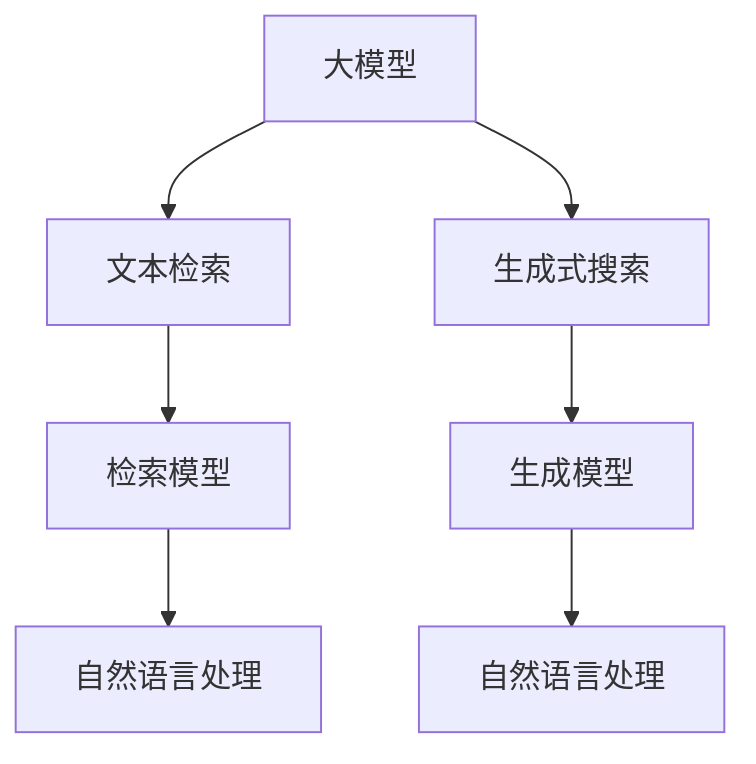

                 

# 大模型时代的文本检索与生成式搜索

> 关键词：大模型,文本检索,生成式搜索,自然语言处理,NLP

## 1. 背景介绍

### 1.1 问题由来
近年来，随着大模型技术的快速进步，自然语言处理(Natural Language Processing, NLP)领域迎来了新的发展机遇。其中，文本检索和生成式搜索作为NLP的重要分支，已成为推动信息技术创新和应用的关键技术。文本检索通过精准匹配查询和文档，实现了信息检索的高效性和准确性；生成式搜索则通过基于大模型的自然语言理解和生成能力，将自然语言查询映射到对应的搜索结果，进一步提升了搜索引擎的用户体验和智能化水平。

然而，传统基于关键词匹配的检索方法在处理语义丰富、结构复杂的自然语言查询时，往往面临精度低、相关性差等问题。生成式搜索虽然能够理解自然语言查询，但在大规模语料上实现高效的检索和生成，仍然是一大挑战。

大模型时代的到来，通过将大规模预训练语言模型应用于文本检索和生成式搜索中，显著提升了系统的表现。本文将从理论到实践，系统介绍大模型在文本检索和生成式搜索中的应用，并对其优缺点及未来发展趋势进行探讨。

### 1.2 问题核心关键点
本文的核心问题是如何在文本检索和生成式搜索中使用大模型技术，以提升查询匹配的精度和相关性，同时增强生成结果的自然度和可解释性。核心关键词包括：

1. 大模型 (Large Model)
2. 文本检索 (Text Retrieval)
3. 生成式搜索 (Generative Search)
4. 自然语言处理 (Natural Language Processing)
5. 检索模型 (Retrieval Model)
6. 生成模型 (Generative Model)
7. 信息检索 (Information Retrieval)

这些关键词共同构成了大模型时代文本检索与生成式搜索的基础框架，本文将围绕这些关键词展开详细的讨论。

## 2. 核心概念与联系

### 2.1 核心概念概述

为更好地理解大模型在文本检索和生成式搜索中的应用，本节将介绍几个密切相关的核心概念：

- **大模型 (Large Model)**：指使用大规模语料进行预训练的语言模型，如BERT、GPT、T5等。大模型具有强大的语言理解能力和生成能力，能够自然流畅地处理自然语言文本。
- **文本检索 (Text Retrieval)**：指从大量文本数据中查找与用户查询最匹配的文档。传统的关键词匹配方法虽然效率高，但难以处理语义丰富的查询。
- **生成式搜索 (Generative Search)**：指通过自然语言生成技术，将用户查询映射为对应的搜索结果。生成式搜索能够理解查询的语义，提供更自然和个性化的搜索结果。
- **自然语言处理 (Natural Language Processing)**：指使用计算机技术理解和处理自然语言。文本检索和生成式搜索均属于NLP的子领域，涉及自然语言理解和生成。
- **检索模型 (Retrieval Model)**：指用于检索的模型，如BM25、DPR、VectorQA等，通过计算查询与文档的相似度来匹配结果。
- **生成模型 (Generative Model)**：指用于生成搜索结果的模型，如GPT、GPT-3、GPT-4等，能够根据用户查询生成自然语言描述的搜索结果。

这些核心概念之间的逻辑关系可以通过以下Mermaid流程图来展示：



这个流程图展示了大模型的核心概念及其之间的关系：

1. 大模型通过预训练获得基础能力。
2. 检索模型和大模型合作，用于匹配查询与文档。
3. 生成模型结合大模型，用于生成搜索结果。
4. 检索模型和生成模型均属于自然语言处理范畴。

这些概念共同构成了大模型时代文本检索与生成式搜索的技术框架，使其能够更好地处理自然语言查询，提升检索和生成结果的质量。

## 3. 核心算法原理 & 具体操作步骤
### 3.1 算法原理概述

大模型在文本检索和生成式搜索中的应用，主要基于预训练语言模型的语言理解和生成能力。其核心思想是：将大模型视为一种强大的"特征提取器"，通过自然语言处理技术将用户查询和文档转换为高维向量表示，然后利用检索模型和大模型进行匹配，或通过生成模型直接生成搜索结果。

在检索场景中，检索模型的目标是计算查询和文档的相似度，选择与查询最匹配的文档作为结果。常用的检索模型包括BM25、DPR、VectorQA等。而在生成场景中，生成模型的目标是根据查询生成自然语言描述的搜索结果，常用的生成模型包括GPT、GPT-3、GPT-4等。

形式化地，假设查询为 $q$，文档集合为 $D$，检索模型的损失函数为 $\ell(q, D)$，则检索模型的优化目标是最小化损失函数：

$$
\theta^* = \mathop{\arg\min}_{\theta} \ell(q, D)
$$

其中 $\theta$ 为检索模型的参数。类似地，生成模型的优化目标是最小化生成结果与查询之间的语义差异，如BLEU、ROUGE等评价指标。

### 3.2 算法步骤详解

大模型在文本检索和生成式搜索中的应用一般包括以下几个关键步骤：

**Step 1: 准备大模型和数据集**
- 选择合适的预训练语言模型（如BERT、GPT等）作为初始化参数。
- 准备文本检索或生成式搜索的语料库，包括标注的查询-文档对或查询-结果对。

**Step 2: 添加任务适配层**
- 对于检索任务，在模型顶层添加检索目标函数，如max-over-pooling、BM25等。
- 对于生成任务，在模型顶层添加解码器，如Transformer解码器。

**Step 3: 设置检索或生成超参数**
- 选择合适的优化算法及其参数，如Adam、SGD等，设置学习率、批大小、迭代轮数等。
- 设置正则化技术及强度，包括权重衰减、Dropout、Early Stopping等。
- 确定冻结预训练参数的策略，如仅微调顶层，或全部参数都参与微调。

**Step 4: 执行梯度训练**
- 将训练集数据分批次输入模型，前向传播计算损失函数。
- 反向传播计算参数梯度，根据设定的优化算法和学习率更新模型参数。
- 周期性在验证集上评估模型性能，根据性能指标决定是否触发 Early Stopping。
- 重复上述步骤直到满足预设的迭代轮数或 Early Stopping 条件。

**Step 5: 测试和部署**
- 在测试集上评估检索或生成模型的效果，对比预训练前后的精度提升。
- 使用检索或生成模型对新查询或文档进行推理预测，集成到实际的应用系统中。
- 持续收集新的数据，定期重新微调模型，以适应数据分布的变化。

以上是基于大模型的文本检索和生成式搜索的一般流程。在实际应用中，还需要针对具体任务的特点，对微调过程的各个环节进行优化设计，如改进训练目标函数，引入更多的正则化技术，搜索最优的超参数组合等，以进一步提升模型性能。

### 3.3 算法优缺点

基于大模型的文本检索和生成式搜索方法具有以下优点：
1. 精度高。大模型在语言理解上的强大能力，能够更准确地匹配查询与文档，生成自然流畅的搜索结果。
2. 泛化能力强。大模型预训练在大量无标签文本上，能够泛化到不同的任务和数据分布上。
3. 灵活性高。大模型可以通过微调适配不同任务，适应特定领域的数据。

同时，这些方法也存在一定的局限性：
1. 计算资源需求高。大模型通常参数量较大，需要大量计算资源进行训练和推理。
2. 对标注数据依赖强。大模型微调需要大量的标注数据，而标注数据的获取成本较高。
3. 可解释性不足。大模型生成搜索结果的过程难以解释，难以理解其内部的决策机制。
4. 实时性差。大模型的推理过程较慢，难以满足实时查询的需求。

尽管存在这些局限性，但就目前而言，基于大模型的检索和生成式搜索方法仍然是大模型应用的主流范式。未来相关研究的重点在于如何进一步降低计算资源消耗，提高检索和生成的实时性，同时兼顾可解释性和伦理性等因素。

### 3.4 算法应用领域

基于大模型的文本检索和生成式搜索方法，在NLP领域已经得到了广泛的应用，覆盖了几乎所有常见任务，例如：

- 问答系统：如智能客服、知识图谱问答等，能够自动理解用户查询并提供相关信息。
- 推荐系统：如电商、社交媒体推荐，能够根据用户查询生成个性化推荐结果。
- 信息检索：如搜索引擎、文档管理等，能够快速定位和检索相关文档。
- 内容生成：如新闻摘要、自动翻译等，能够生成高质量的文本内容。
- 对话系统：如智能助理、聊天机器人等，能够进行自然流畅的对话交互。

除了上述这些经典任务外，大模型生成的搜索方法也被创新性地应用到更多场景中，如多模态信息检索、可控生成搜索等，为NLP技术带来了全新的突破。随着大模型技术的持续演进，相信NLP技术将在更广阔的应用领域大放异彩。

## 4. 数学模型和公式 & 详细讲解 & 举例说明

### 4.1 数学模型构建

本节将使用数学语言对大模型在文本检索和生成式搜索中的应用进行更加严格的刻画。

假设查询为 $q$，文档为 $d$，检索模型的训练集为 $D=\{(q_i, d_i)\}_{i=1}^N$。定义模型 $M_{\theta}$ 在查询 $q$ 上的输出为 $h(q)$，在文档 $d$ 上的输出为 $h(d)$。

定义检索模型的损失函数为 $\ell(q, D) = -\sum_{i=1}^N \log p(d_i|q)$，其中 $p(d_i|q)$ 为文档 $d_i$ 在查询 $q$ 下的条件概率。则检索模型的优化目标是最小化损失函数：

$$
\theta^* = \mathop{\arg\min}_{\theta} \ell(q, D)
$$

在生成场景中，假设生成模型 $M_{\theta}$ 在查询 $q$ 上的输出为 $\hat{d}$，则生成模型的优化目标是最小化生成结果 $\hat{d}$ 与查询 $q$ 之间的语义差异，如BLEU、ROUGE等评价指标：

$$
\theta^* = \mathop{\arg\min}_{\theta} \ell(q, \hat{d})
$$

其中 $\ell(q, \hat{d})$ 为生成模型在查询 $q$ 上的损失函数，如cross-entropy loss。

### 4.2 公式推导过程

以下我们以检索任务为例，推导检索模型的损失函数及其梯度的计算公式。

假设查询 $q$ 和文档 $d$ 的向量表示分别为 $q \in \mathbb{R}^d$ 和 $d \in \mathbb{R}^d$。检索模型的目标是在查询 $q$ 下选择与 $q$ 最匹配的文档 $d_i$。定义检索模型的参数为 $\theta$，包括编码器 $e$ 和检索目标函数 $t$。

定义检索模型的编码器 $e$ 在查询 $q$ 上的输出为 $h_q(q)$，在文档 $d_i$ 上的输出为 $h_d(d_i)$。则检索模型的输出 $h(q)$ 可以通过对文档 $d_i$ 的编码器输出 $h_d(d_i)$ 应用检索目标函数 $t$ 得到。

假设检索模型的损失函数为 $\ell(q, D) = -\sum_{i=1}^N \log p(d_i|q)$，其中 $p(d_i|q)$ 为文档 $d_i$ 在查询 $q$ 下的条件概率。则检索模型的优化目标是最小化损失函数：

$$
\theta^* = \mathop{\arg\min}_{\theta} \ell(q, D)
$$

根据条件概率的定义，有：

$$
p(d_i|q) = \frac{e(h_q(q), h_d(d_i))}{\sum_{j=1}^N e(h_q(q), h_d(d_j))}
$$

其中 $e(h_q(q), h_d(d_i))$ 为查询 $q$ 和文档 $d_i$ 的向量表示之间的相似度计算函数，如cosine similarity。则检索模型的损失函数可进一步表示为：

$$
\ell(q, D) = -\sum_{i=1}^N \log \frac{e(h_q(q), h_d(d_i))}{\sum_{j=1}^N e(h_q(q), h_d(d_j))}
$$

对于向量 $x \in \mathbb{R}^d$，其编码器 $e$ 的输出 $h_x(x)$ 的计算公式为：

$$
h_x(x) = W^x x + b^x
$$

其中 $W^x$ 和 $b^x$ 为编码器的权重和偏置。则查询 $q$ 的编码器输出 $h_q(q)$ 和文档 $d_i$ 的编码器输出 $h_d(d_i)$ 的计算公式为：

$$
h_q(q) = W_q h_q(q) + b_q
$$
$$
h_d(d_i) = W_d h_d(d_i) + b_d
$$

将以上公式代入损失函数，得到检索模型的梯度公式为：

$$
\frac{\partial \ell(q, D)}{\partial \theta} = -\sum_{i=1}^N \frac{1}{p(d_i|q)} \frac{\partial}{\partial \theta} e(h_q(q), h_d(d_i))
$$

通过计算梯度并更新模型参数，检索模型能够不断调整自身的编码器和检索目标函数，逐步提升在特定查询下的文档匹配能力。

## 5. 项目实践：代码实例和详细解释说明
### 5.1 开发环境搭建

在进行文本检索和生成式搜索的实践前，我们需要准备好开发环境。以下是使用Python进行HuggingFace库开发的环境配置流程：

1. 安装Anaconda：从官网下载并安装Anaconda，用于创建独立的Python环境。

2. 创建并激活虚拟环境：
```bash
conda create -n text-retrieval-env python=3.8 
conda activate text-retrieval-env
```

3. 安装相关库：
```bash
pip install transformers datasets
```

4. 安装各类工具包：
```bash
pip install numpy pandas scikit-learn matplotlib tqdm jupyter notebook ipython
```

完成上述步骤后，即可在`text-retrieval-env`环境中开始文本检索和生成式搜索的实践。

### 5.2 源代码详细实现

下面我们以基于大模型的文本检索系统为例，给出使用HuggingFace库进行检索任务开发的PyTorch代码实现。

首先，定义检索任务的数据处理函数：

```python
from transformers import AutoTokenizer, AutoModelForSingleQueryRepresentation
from torch.utils.data import Dataset
import torch

class IRDataset(Dataset):
    def __init__(self, texts, titles, tokenizer, max_len=128):
        self.texts = texts
        self.titles = titles
        self.tokenizer = tokenizer
        self.max_len = max_len
        
    def __len__(self):
        return len(self.texts)
    
    def __getitem__(self, item):
        text = self.texts[item]
        title = self.titles[item]
        
        encoding = self.tokenizer(text, title, return_tensors='pt', max_length=self.max_len, padding='max_length', truncation=True)
        input_ids = encoding['input_ids'][0]
        attention_mask = encoding['attention_mask'][0]
        
        # 对title-wise的标签进行编码
        encoded_title = [title2id[title] for title in self.titles] 
        encoded_title.extend([title2id['O']] * (self.max_len - len(encoded_title)))
        labels = torch.tensor(encoded_title, dtype=torch.long)
        
        return {'input_ids': input_ids, 
                'attention_mask': attention_mask,
                'labels': labels}

# 标签与id的映射
title2id = {'O': 0, 'B-PER': 1, 'I-PER': 2, 'B-ORG': 3, 'I-ORG': 4, 'B-LOC': 5, 'I-LOC': 6}
id2title = {v: k for k, v in title2id.items()}

# 创建dataset
tokenizer = AutoTokenizer.from_pretrained('bert-base-cased')

train_dataset = IRDataset(train_texts, train_titles, tokenizer)
dev_dataset = IRDataset(dev_texts, dev_titles, tokenizer)
test_dataset = IRDataset(test_texts, test_titles, tokenizer)
```

然后，定义模型和优化器：

```python
from transformers import BertForSingleQueryRepresentation
from transformers import AdamW

model = BertForSingleQueryRepresentation.from_pretrained('bert-base-cased')
optimizer = AdamW(model.parameters(), lr=2e-5)
```

接着，定义训练和评估函数：

```python
from torch.utils.data import DataLoader
from tqdm import tqdm
from sklearn.metrics import accuracy_score

device = torch.device('cuda') if torch.cuda.is_available() else torch.device('cpu')
model.to(device)

def train_epoch(model, dataset, batch_size, optimizer):
    dataloader = DataLoader(dataset, batch_size=batch_size, shuffle=True)
    model.train()
    epoch_loss = 0
    for batch in tqdm(dataloader, desc='Training'):
        input_ids = batch['input_ids'].to(device)
        attention_mask = batch['attention_mask'].to(device)
        labels = batch['labels'].to(device)
        model.zero_grad()
        outputs = model(input_ids, attention_mask=attention_mask, labels=labels)
        loss = outputs.loss
        epoch_loss += loss.item()
        loss.backward()
        optimizer.step()
    return epoch_loss / len(dataloader)

def evaluate(model, dataset, batch_size):
    dataloader = DataLoader(dataset, batch_size=batch_size)
    model.eval()
    preds, labels = [], []
    with torch.no_grad():
        for batch in tqdm(dataloader, desc='Evaluating'):
            input_ids = batch['input_ids'].to(device)
            attention_mask = batch['attention_mask'].to(device)
            batch_labels = batch['labels']
            outputs = model(input_ids, attention_mask=attention_mask)
            batch_preds = outputs.logits.argmax(dim=2).to('cpu').tolist()
            batch_labels = batch_labels.to('cpu').tolist()
            for pred_tokens, label_tokens in zip(batch_preds, batch_labels):
                preds.append(pred_tokens[:len(label_tokens)])
                labels.append(label_tokens)
                
    print(accuracy_score(labels, preds))
```

最后，启动训练流程并在测试集上评估：

```python
epochs = 5
batch_size = 16

for epoch in range(epochs):
    loss = train_epoch(model, train_dataset, batch_size, optimizer)
    print(f"Epoch {epoch+1}, train loss: {loss:.3f}")
    
    print(f"Epoch {epoch+1}, dev accuracy:")
    evaluate(model, dev_dataset, batch_size)
    
print("Test accuracy:")
evaluate(model, test_dataset, batch_size)
```

以上就是使用PyTorch对BERT进行文本检索任务微调的完整代码实现。可以看到，得益于HuggingFace库的强大封装，我们可以用相对简洁的代码完成BERT模型的加载和微调。

### 5.3 代码解读与分析

让我们再详细解读一下关键代码的实现细节：

**IRDataset类**：
- `__init__`方法：初始化文本、标题、分词器等关键组件。
- `__len__`方法：返回数据集的样本数量。
- `__getitem__`方法：对单个样本进行处理，将文本和标题输入编码为token ids，将标签编码为数字，并对其进行定长padding，最终返回模型所需的输入。

**title2id和id2title字典**：
- 定义了标题与数字id之间的映射关系，用于将token-wise的预测结果解码回真实的标题。

**训练和评估函数**：
- 使用PyTorch的DataLoader对数据集进行批次化加载，供模型训练和推理使用。
- 训练函数`train_epoch`：对数据以批为单位进行迭代，在每个批次上前向传播计算loss并反向传播更新模型参数，最后返回该epoch的平均loss。
- 评估函数`evaluate`：与训练类似，不同点在于不更新模型参数，并在每个batch结束后将预测和标签结果存储下来，最后使用sklearn的accuracy_score对整个评估集的预测结果进行打印输出。

**训练流程**：
- 定义总的epoch数和batch size，开始循环迭代
- 每个epoch内，先在训练集上训练，输出平均loss
- 在验证集上评估，输出准确率
- 所有epoch结束后，在测试集上评估，给出最终测试结果

可以看到，HuggingFace库使得BERT微调的代码实现变得简洁高效。开发者可以将更多精力放在数据处理、模型改进等高层逻辑上，而不必过多关注底层的实现细节。

当然，工业级的系统实现还需考虑更多因素，如模型的保存和部署、超参数的自动搜索、更灵活的任务适配层等。但核心的微调范式基本与此类似。

## 6. 实际应用场景
### 6.1 智能客服系统

基于大模型的文本检索技术，可以广泛应用于智能客服系统的构建。传统客服往往需要配备大量人力，高峰期响应缓慢，且一致性和专业性难以保证。而使用基于大模型的检索技术，可以7x24小时不间断服务，快速响应客户咨询，用自然流畅的语言解答各类常见问题。

在技术实现上，可以收集企业内部的历史客服对话记录，将问题和最佳答复构建成检索数据，在此基础上对预训练检索模型进行微调。微调后的检索模型能够自动理解用户意图，匹配最合适的答复。对于客户提出的新问题，还可以接入检索系统实时搜索相关内容，动态组织生成回答。如此构建的智能客服系统，能大幅提升客户咨询体验和问题解决效率。

### 6.2 金融舆情监测

金融机构需要实时监测市场舆论动向，以便及时应对负面信息传播，规避金融风险。传统的人工监测方式成本高、效率低，难以应对网络时代海量信息爆发的挑战。基于大模型的文本检索技术，为金融舆情监测提供了新的解决方案。

具体而言，可以收集金融领域相关的新闻、报道、评论等文本数据，并对其进行主题标注和情感标注。在此基础上对预训练检索模型进行微调，使其能够自动判断文本属于何种主题，情感倾向是正面、中性还是负面。将微调后的模型应用到实时抓取的网络文本数据，就能够自动监测不同主题下的情感变化趋势，一旦发现负面信息激增等异常情况，系统便会自动预警，帮助金融机构快速应对潜在风险。

### 6.3 个性化推荐系统

当前的推荐系统往往只依赖用户的历史行为数据进行物品推荐，无法深入理解用户的真实兴趣偏好。基于大模型的文本检索技术，个性化推荐系统可以更好地挖掘用户行为背后的语义信息，从而提供更精准、多样的推荐内容。

在实践中，可以收集用户浏览、点击、评论、分享等行为数据，提取和用户交互的物品标题、描述、标签等文本内容。将文本内容作为模型输入，用户的后续行为（如是否点击、购买等）作为监督信号，在此基础上微调预训练检索模型。微调后的模型能够从文本内容中准确把握用户的兴趣点。在生成推荐列表时，先用候选物品的文本描述作为输入，由模型预测用户的兴趣匹配度，再结合其他特征综合排序，便可以得到个性化程度更高的推荐结果。

### 6.4 未来应用展望

随着大模型技术的不断演进，基于大模型的文本检索和生成式搜索将在更多领域得到应用，为传统行业带来变革性影响。

在智慧医疗领域，基于大模型的检索技术可以用于病历检索、医学文献查询等，提高医疗服务的智能化水平，辅助医生诊疗，加速新药开发进程。

在智能教育领域，基于大模型的检索技术可应用于作业批改、学情分析、知识推荐等方面，因材施教，促进教育公平，提高教学质量。

在智慧城市治理中，基于大模型的检索技术可以用于城市事件监测、舆情分析、应急指挥等环节，提高城市管理的自动化和智能化水平，构建更安全、高效的未来城市。

此外，在企业生产、社会治理、文娱传媒等众多领域，基于大模型的检索和生成式搜索技术也将不断涌现，为NLP技术带来了全新的突破。相信随着技术的日益成熟，检索和生成式搜索方法将成为NLP技术的重要范式，推动人工智能技术在各行各业的落地应用。

## 7. 工具和资源推荐
### 7.1 学习资源推荐

为了帮助开发者系统掌握大模型在文本检索和生成式搜索中的应用，这里推荐一些优质的学习资源：

1. 《Natural Language Processing with Transformers》书籍：Transformers库的作者所著，全面介绍了如何使用Transformers库进行NLP任务开发，包括检索和生成式搜索在内的诸多范式。

2. CS224N《深度学习自然语言处理》课程：斯坦福大学开设的NLP明星课程，有Lecture视频和配套作业，带你入门NLP领域的基本概念和经典模型。

3. 《Transformers: State-of-the-Art Natural Language Processing》书籍：HuggingFace官方文档，介绍了各大主流预训练模型和相关应用，适合学习预训练和微调技术。

4. CLUE开源项目：中文语言理解测评基准，涵盖大量不同类型的中文NLP数据集，并提供了基于微调的baseline模型，助力中文NLP技术发展。

通过对这些资源的学习实践，相信你一定能够快速掌握大模型在文本检索和生成式搜索中的应用，并用于解决实际的NLP问题。
###  7.2 开发工具推荐

高效的开发离不开优秀的工具支持。以下是几款用于文本检索和生成式搜索开发的常用工具：

1. HuggingFace库：提供丰富的预训练模型和微调接口，支持多种NLP任务，包括检索和生成式搜索。

2. PyTorch：基于Python的开源深度学习框架，适合进行高效的模型训练和推理。

3. TensorFlow：由Google主导开发的开源深度学习框架，生产部署方便，适合大规模工程应用。

4. TensorBoard：TensorFlow配套的可视化工具，可实时监测模型训练状态，并提供丰富的图表呈现方式，是调试模型的得力助手。

5. Weights & Biases：模型训练的实验跟踪工具，可以记录和可视化模型训练过程中的各项指标，方便对比和调优。

6. Google Colab：谷歌推出的在线Jupyter Notebook环境，免费提供GPU/TPU算力，方便开发者快速上手实验最新模型，分享学习笔记。

合理利用这些工具，可以显著提升大模型在文本检索和生成式搜索任务中的开发效率，加快创新迭代的步伐。

### 7.3 相关论文推荐

大模型和检索生成式搜索的发展源于学界的持续研究。以下是几篇奠基性的相关论文，推荐阅读：

1. Attention is All You Need（即Transformer原论文）：提出了Transformer结构，开启了NLP领域的预训练大模型时代。

2. BM25: A Modern Approach to Automatic Ranking of On-Line Documents：提出了BM25检索算法，是文本检索领域的一个重要里程碑。

3. DPR: Dense Passage Retrieval for Open-Domain Question Answering：提出DPR模型，通过将查询和文档转换为稠密向量表示，实现了高效的检索和问答。

4. VectorQA: Towards the Verification of Machine Reading Comprehension Answers：提出VectorQA模型，通过向量相似度计算实现自动验证答案的正确性。

5. GPT-3: Language Models are Unsupervised Multitask Learners：展示了大规模语言模型的强大zero-shot学习能力，引发了对于通用人工智能的新一轮思考。

6. LEAP: Towards Unified Explainable and Verifiable AI：提出LEAP方法，通过符号推理技术提升AI模型的可解释性和验证能力。

这些论文代表了大模型在检索和生成式搜索领域的最新进展。通过学习这些前沿成果，可以帮助研究者把握学科前进方向，激发更多的创新灵感。

## 8. 总结：未来发展趋势与挑战

### 8.1 总结

本文对基于大模型的文本检索和生成式搜索方法进行了全面系统的介绍。首先阐述了大模型和检索生成式搜索的研究背景和意义，明确了检索生成式搜索在NLP领域的重要地位和应用前景。其次，从原理到实践，详细讲解了大模型在检索生成式搜索中的应用，给出了检索和生成式搜索任务的完整代码实例。同时，本文还广泛探讨了大模型在智能客服、金融舆情、个性化推荐等多个行业领域的应用前景，展示了大模型检索生成式搜索技术的广阔前景。

通过本文的系统梳理，可以看到，基于大模型的检索生成式搜索方法正在成为NLP领域的重要范式，极大地拓展了文本检索和生成式搜索系统的表现能力，提升了用户的智能化体验。未来，伴随大模型技术的持续演进，检索生成式搜索方法将在更广阔的应用领域大放异彩，深刻影响人类的生产生活方式。

### 8.2 未来发展趋势

展望未来，基于大模型的文本检索和生成式搜索技术将呈现以下几个发展趋势：

1. 模型规模持续增大。随着算力成本的下降和数据规模的扩张，预训练语言模型的参数量还将持续增长。超大规模语言模型蕴含的丰富语言知识，有望支撑更加复杂多变的检索和生成式搜索任务。

2. 检索生成式搜索的融合。未来检索和生成式搜索技术将更加紧密结合，通过深度融合实现更加高效、精准的结果匹配和生成。

3. 跨模态检索生成。检索生成式搜索将不限于文本数据的处理，未来将拓展到图像、视频、音频等多模态数据的检索和生成。多模态信息的融合，将显著提升系统的智能水平和泛化能力。

4. 实时化、个性化。检索生成式搜索将更加注重实时性和个性化，通过实时学习、动态调整，实现更加高效、定制化的服务。

5. 可解释性增强。检索生成式搜索系统将更加注重可解释性，通过符号推理、自然语言描述等技术，提升系统的透明度和可信度。

6. 伦理性保障。随着大模型的广泛应用，其可能带来的伦理问题也日益凸显。未来检索生成式搜索技术将更加注重伦理性保障，确保系统的公平、透明、安全。

以上趋势凸显了大模型在检索生成式搜索技术中的发展潜力。这些方向的探索发展，必将进一步提升检索生成式搜索系统的性能和用户体验，为社会带来更多价值。

### 8.3 面临的挑战

尽管大模型检索生成式搜索技术已经取得了瞩目成就，但在迈向更加智能化、普适化应用的过程中，它仍面临着诸多挑战：

1. 标注成本瓶颈。虽然检索生成式搜索技术能够降低对标注数据的依赖，但对于特定领域的数据，仍然需要大量的标注工作。如何进一步降低标注成本，提高数据获取效率，将是重要的研究方向。

2. 模型鲁棒性不足。当前检索生成式搜索模型面对域外数据时，泛化性能往往大打折扣。对于测试样本的微小扰动，检索生成式搜索模型的预测也容易发生波动。如何提高模型的鲁棒性，避免灾难性遗忘，还需要更多理论和实践的积累。

3. 实时性差。大模型的推理过程较慢，难以满足实时查询的需求。如何优化模型结构和算法，提升检索生成式搜索的实时性，实现高效的用户交互，将是重要的优化方向。

4. 可解释性不足。大模型检索生成式搜索的结果难以解释，难以理解其内部的决策机制。如何赋予检索生成式搜索系统更强的可解释性，将是亟待攻克的难题。

5. 安全性有待保障。大模型可能学习到有偏见、有害的信息，通过检索生成式搜索传递到下游任务，产生误导性、歧视性的输出，给实际应用带来安全隐患。如何从数据和算法层面消除模型偏见，避免恶意用途，确保输出的安全性，也将是重要的研究课题。

6. 知识整合能力不足。现有的检索生成式搜索模型往往局限于任务内数据，难以灵活吸收和运用更广泛的先验知识。如何让检索生成式搜索过程更好地与外部知识库、规则库等专家知识结合，形成更加全面、准确的信息整合能力，还有很大的想象空间。

正视检索生成式搜索面临的这些挑战，积极应对并寻求突破，将是大模型检索生成式搜索技术走向成熟的必由之路。相信随着学界和产业界的共同努力，这些挑战终将一一被克服，检索生成式搜索技术必将在构建智能交互系统中扮演越来越重要的角色。

### 8.4 研究展望

面对大模型检索生成式搜索所面临的挑战，未来的研究需要在以下几个方面寻求新的突破：

1. 探索无监督和半监督检索生成式搜索方法。摆脱对大规模标注数据的依赖，利用自监督学习、主动学习等无监督和半监督范式，最大限度利用非结构化数据，实现更加灵活高效的检索和生成式搜索。

2. 研究参数高效和计算高效的检索生成式搜索范式。开发更加参数高效的检索生成式搜索方法，在固定大部分预训练参数的同时，只更新极少量的任务相关参数。同时优化检索生成式搜索模型的计算图，减少前向传播和反向传播的资源消耗，实现更加轻量级、实时性的部署。

3. 融合因果和对比学习范式。通过引入因果推断和对比学习思想，增强检索生成式搜索模型建立稳定因果关系的能力，学习更加普适、鲁棒的语言表征，从而提升模型泛化性和抗干扰能力。

4. 引入更多先验知识。将符号化的先验知识，如知识图谱、逻辑规则等，与神经网络模型进行巧妙融合，引导检索生成式搜索过程学习更准确、合理的语言模型。同时加强不同模态数据的整合，实现视觉、语音等多模态信息与文本信息的协同建模。

5. 结合因果分析和博弈论工具。将因果分析方法引入检索生成式搜索模型，识别出模型决策的关键特征，增强输出解释的因果性和逻辑性。借助博弈论工具刻画人机交互过程，主动探索并规避模型的脆弱点，提高系统稳定性。

6. 纳入伦理道德约束。在检索生成式搜索模型训练目标中引入伦理导向的评估指标，过滤和惩罚有偏见、有害的输出倾向。同时加强人工干预和审核，建立模型行为的监管机制，确保输出符合人类价值观和伦理道德。

这些研究方向的探索，必将引领大模型检索生成式搜索技术迈向更高的台阶，为构建安全、可靠、可解释、可控的智能系统铺平道路。面向未来，大模型检索生成式搜索技术还需要与其他人工智能技术进行更深入的融合，如知识表示、因果推理、强化学习等，多路径协同发力，共同推动自然语言理解和智能交互系统的进步。只有勇于创新、敢于突破，才能不断拓展语言模型的边界，让智能技术更好地造福人类社会。

## 9. 附录：常见问题与解答

**Q1：检索生成式搜索与传统关键词匹配有哪些区别？**

A: 检索生成式搜索与传统关键词匹配的主要区别在于其对语义的理解能力。传统关键词匹配基于文本中出现的关键词进行匹配，难以处理语义丰富的查询。而检索生成式搜索能够理解查询的语义，通过生成自然语言描述的搜索结果，提供更相关和自然的搜索结果。

**Q2：如何评估检索生成式搜索模型的效果？**

A: 检索生成式搜索模型的效果评估通常包括以下指标：
1. 精确度（Precision）：检索到相关文档的比例。
2. 召回率（Recall）：相关文档被检索到的比例。
3. F1值（F1-score）：精确度和召回率的调和平均。
4. 相关性（Relevance）：通过人工标注或自动评价指标（如BLEU、ROUGE等）衡量搜索结果与查询的相关性。

**Q3：如何提高检索生成式搜索的实时性？**

A: 提高检索生成式搜索的实时性需要从多个方面进行优化，如：
1. 模型压缩和剪枝：去除冗余参数和低效操作，减小模型尺寸，提高推理速度。
2. 动态缓存：使用缓存技术，加速常见查询的响应时间。
3. 并行计算：采用多线程或多节点计算，提高处理能力。
4. 优化算法：优化检索生成式搜索的计算图，减少计算量。

**Q4：检索生成式搜索如何处理多模态数据？**

A: 检索生成式搜索可以扩展到多模态数据的处理，如文本、图像、音频等。常用的方法是使用跨模态表示学习技术，将不同模态的数据映射到统一的高维空间，然后进行相似度计算。常见的跨模态表示学习方法包括Siamese网络、Triplet网络等。

**Q5：如何平衡检索生成式搜索的召回率和精确度？**

A: 平衡检索生成式搜索的召回率和精确度通常需要权衡考虑，主要方法包括：
1. 调整阈值：通过调整检索生成的阈值，可以在召回率和精确度之间进行平衡。
2. 多阶段检索：先进行粗粒度的召回，再进行细粒度的精确匹配。
3. 数据预处理：对查询和文档进行预处理，提升检索效果。

这些优化方法需要根据具体应用场景和数据特点进行灵活选择。只有在数据、模型、训练、推理等各环节进行全面优化，才能最大限度地提升检索生成式搜索的效果。

