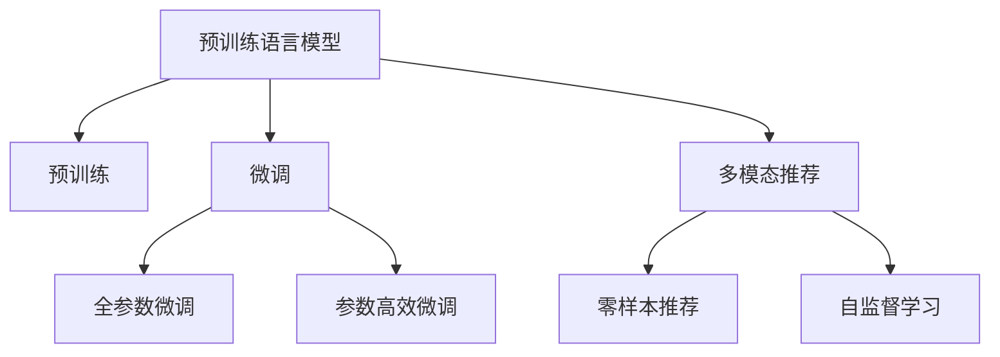

                 

# 大模型能改变推荐范式吗？

## 1. 背景介绍

在过去的数十年里，推荐系统一直是互联网公司的重要业务支柱。无论是电商平台的商品推荐、社交媒体的内容推荐，还是视频网站的视频推荐，推荐系统在个性化信息推送和用户留存方面都起到了关键作用。然而，传统的推荐系统主要依赖于用户行为数据，通过协同过滤、基于内容的推荐、矩阵分解等方法，对用户的历史行为进行分析，预测其偏好并推荐潜在物品。这种方法的局限性在于：

- 数据需求量大：需要大量的用户行为数据才能建立准确的推荐模型。
- 冷启动问题：对于新用户或物品，由于缺乏足够的历史数据，推荐效果差。
- 依赖单一特征：推荐系统主要依赖于数值型特征（如点击、评分等），对文本、图像等多模态特征利用不足。

近年来，随着深度学习技术的迅猛发展，预训练语言模型（如BERT、GPT-3）在推荐系统中的应用逐渐被人们所关注。预训练语言模型通过在海量文本数据上预训练，能够捕捉语言之间的复杂关系，从而在推荐系统中发挥更大的作用。本文将深入探讨预训练语言模型在推荐系统中的应用潜力，并分析其对传统推荐系统的改变。

## 2. 核心概念与联系

### 2.1 核心概念概述

为了更好地理解预训练语言模型在推荐系统中的应用，本节将介绍几个关键概念及其相互联系：

- **预训练语言模型（Pre-trained Language Model, PLM）**：如BERT、GPT-3等，通过大规模无监督学习任务（如掩码语言模型）训练得到的语言模型。预训练模型能够捕捉语言间的上下文关系，适用于各种NLP任务。
- **推荐系统（Recommendation System, RS）**：基于用户行为数据，为用户推荐潜在物品的系统。推荐系统广泛应用于电商、社交、娱乐等多个领域。
- **预训练-微调（Pre-training-Fine-tuning, PFT）**：先在大规模无标签数据上进行预训练，再在下游任务上进行微调，提升模型性能的方法。
- **多模态推荐（Multi-modal Recommendation）**：在推荐系统中引入多种类型的数据（如文本、图像、音频等），以提升推荐效果。
- **零样本推荐（Zero-shot Recommendation）**：基于模型预训练的知识，推荐用户从未见过的物品。
- **自监督学习（Self-supervised Learning）**：通过无监督学习任务（如掩码语言模型、对比学习等）训练模型，无需大量标注数据。

这些概念之间的联系通过以下Mermaid流程图来展示：



这个流程图展示了预训练语言模型与推荐系统的核心概念及其相互关系：

1. 预训练模型通过无监督学习任务获得语言表示。
2. 微调是预训练模型适配下游任务的过程，可以提升推荐效果。
3. 多模态推荐引入多种类型的数据，提升推荐系统性能。
4. 零样本推荐利用预训练知识推荐未见过的物品，增强推荐多样性。
5. 自监督学习训练模型，无需标注数据，适用于资源有限的场景。

## 3. 核心算法原理 & 具体操作步骤

### 3.1 算法原理概述

基于预训练语言模型的推荐系统，其核心思想是利用预训练模型强大的语言理解能力，在推荐系统中引入文本数据，通过预训练-微调范式提升推荐效果。推荐系统的基本流程如下：

1. **数据收集与预处理**：收集用户行为数据、物品描述数据，将文本数据进行分词、编码等预处理。
2. **预训练模型编码**：使用预训练语言模型对用户行为数据和物品描述数据进行编码，得到高维向量表示。
3. **特征计算与融合**：计算用户与物品之间的相似度，并融合多种特征（如用户画像、物品画像、上下文特征等），得到最终的推荐分数。
4. **排序与推荐**：根据推荐分数对物品进行排序，推荐给用户。

### 3.2 算法步骤详解

以下将详细讲解预训练语言模型在推荐系统中的应用步骤：

**Step 1: 数据收集与预处理**
- 收集用户行为数据，如点击、评分、购买记录等，形成用户行为序列。
- 收集物品描述数据，如商品标题、描述、图片等，形成物品文本向量。
- 对文本数据进行分词、去除停用词、词向量编码等预处理操作。

**Step 2: 预训练模型编码**
- 使用预训练语言模型（如BERT、GPT-3等）对用户行为序列和物品文本向量进行编码，得到高维向量表示。
- 编码器可以是自回归模型，也可以是自编码模型。

**Step 3: 特征计算与融合**
- 计算用户与物品之间的相似度，可以是点积、余弦相似度、内积等。
- 融合多种特征，如用户画像、物品画像、上下文特征等，得到最终的推荐分数。
- 可以通过深度学习模型（如LSTM、GRU等）对多种特征进行融合。

**Step 4: 排序与推荐**
- 根据推荐分数对物品进行排序，推荐给用户。
- 可以使用排序算法（如Top-k排序、基于阈值的推荐）进行推荐。

### 3.3 算法优缺点

基于预训练语言模型的推荐系统具有以下优点：

1. **泛化能力更强**：预训练语言模型在大规模无监督数据上预训练，可以捕捉语言之间的复杂关系，提升推荐模型的泛化能力。
2. **数据需求减少**：预训练语言模型可以大幅减少推荐系统对用户行为数据的依赖，适用于数据稀疏、冷启动问题严重的场景。
3. **特征多样性**：预训练语言模型可以融合文本、图像等多种类型的数据，提升推荐系统的多样性和准确性。
4. **模型灵活性高**：预训练语言模型可以作为通用的特征提取器，适用于多种推荐任务。

同时，该方法也存在一些缺点：

1. **计算资源需求高**：预训练语言模型的计算资源需求较大，需要高性能的GPU/TPU等硬件设备。
2. **解释性不足**：预训练语言模型的决策过程较为复杂，难以解释推荐结果的来源和原因。
3. **多模态数据融合难度大**：不同类型的特征数据难以统一表示，进行多模态数据融合时难度较大。
4. **冷启动问题仍需解决**：预训练语言模型对用户行为数据的依赖较少，但对于新用户或物品的推荐效果仍然较差。

### 3.4 算法应用领域

基于预训练语言模型的推荐系统在多个领域得到了广泛应用，以下是一些典型的应用场景：

- **电商推荐**：推荐系统可以根据用户浏览、购买记录，为用户推荐相似商品、相关商品等。预训练语言模型可以提升推荐系统对商品描述的语义理解能力，提供更准确的推荐结果。
- **内容推荐**：推荐系统可以根据用户阅读、观看历史，为用户推荐相关文章、视频等。预训练语言模型可以提升推荐系统对文本内容的语义理解能力，提供更丰富的推荐内容。
- **音乐推荐**：推荐系统可以根据用户听歌历史，为用户推荐相似音乐、相关音乐等。预训练语言模型可以提升推荐系统对音乐歌词、艺术家等文本信息的语义理解能力，提供更个性化的推荐。
- **游戏推荐**：推荐系统可以根据用户游戏行为，为用户推荐相似游戏、相关游戏等。预训练语言模型可以提升推荐系统对游戏描述、攻略等的语义理解能力，提供更准确的推荐结果。

## 4. 数学模型和公式 & 详细讲解 & 举例说明

### 4.1 数学模型构建

在推荐系统中，预训练语言模型的应用可以分为两个阶段：预训练和微调。以下将分别介绍这两个阶段的关键数学模型和公式。

**预训练模型**：
预训练语言模型的训练目标是通过自监督学习任务（如掩码语言模型），学习到语言之间的上下文关系。假设预训练语言模型为 $M_{\theta}$，其训练目标为：

$$
\min_{\theta} \mathcal{L}_{\text{pre-training}}(\theta) = \frac{1}{N}\sum_{i=1}^N \ell_i
$$

其中 $N$ 为训练样本数量，$\ell_i$ 为样本 $i$ 的损失函数。常见的损失函数包括掩码语言模型（Masked Language Model, MLM）和掩码词预测（Next Sentence Prediction, NSP）。

**微调模型**：
微调的目标是将预训练语言模型适配到具体的推荐任务上。假设微调后的模型为 $M_{\theta}$，训练数据为 $D=\{(x_i, y_i)\}_{i=1}^N$，其中 $x_i$ 为输入特征，$y_i$ 为标签，训练目标为：

$$
\min_{\theta} \mathcal{L}_{\text{fine-tuning}}(\theta) = \frac{1}{N}\sum_{i=1}^N \ell_i
$$

其中 $\ell_i$ 为样本 $i$ 的损失函数，可以是交叉熵损失、均方误差损失等。

### 4.2 公式推导过程

以下以推荐系统中的文本相似度计算为例，推导推荐模型中预训练语言模型的应用公式。

假设预训练语言模型为 $M_{\theta}$，其对文本序列 $x$ 的编码表示为 $M_{\theta}(x)$。设用户行为序列为 $U=\{u_1, u_2, \cdots, u_N\}$，物品文本序列为 $I=\{i_1, i_2, \cdots, i_M\}$。

计算用户与物品之间的相似度，可以采用余弦相似度公式：

$$
\text{similarity}(u_i, i_j) = \cos \left< M_{\theta}(u_i), M_{\theta}(i_j) \right>
$$

其中 $\left< \cdot, \cdot \right>$ 表示向量的点积。

融合多种特征，可以使用深度学习模型，如LSTM、GRU等，对多种特征进行融合。假设用户画像向量为 $u_v$，物品画像向量为 $i_v$，上下文特征向量为 $c_v$，则融合后的特征向量 $z_v$ 可以表示为：

$$
z_v = \sigma \left[ W_1 \left[ M_{\theta}(u_i) \right] + W_2 \left[ M_{\theta}(i_j) \right] + W_3 u_v + W_4 i_v + W_5 c_v \right]
$$

其中 $\sigma$ 为激活函数，$W_1, W_2, W_3, W_4, W_5$ 为可训练的权重矩阵。

### 4.3 案例分析与讲解

**案例：电商商品推荐**

假设电商平台的商品推荐系统，使用预训练语言模型BERT作为特征提取器。用户行为序列 $U$ 包含用户对商品的浏览、点击、购买等行为，物品文本序列 $I$ 包含商品的标题、描述、标签等文本信息。

- **数据预处理**：将用户行为序列和物品文本序列进行分词、编码等预处理操作。
- **预训练模型编码**：使用BERT模型对用户行为序列和物品文本序列进行编码，得到高维向量表示。
- **特征计算与融合**：计算用户与物品之间的相似度，融合多种特征，如用户画像、物品画像、上下文特征等，得到最终的推荐分数。
- **排序与推荐**：根据推荐分数对物品进行排序，推荐给用户。

## 5. 项目实践：代码实例和详细解释说明

### 5.1 开发环境搭建

在进行预训练语言模型推荐系统开发前，需要先准备好开发环境。以下是使用Python进行TensorFlow开发的环境配置流程：

1. 安装Anaconda：从官网下载并安装Anaconda，用于创建独立的Python环境。

2. 创建并激活虚拟环境：
```bash
conda create -n tensorflow-env python=3.8 
conda activate tensorflow-env
```

3. 安装TensorFlow：根据CUDA版本，从官网获取对应的安装命令。例如：
```bash
conda install tensorflow tensorflow-gpu -c conda-forge
```

4. 安装相关库：
```bash
pip install numpy pandas scikit-learn tensorflow-datasets transformers
```

5. 安装各类工具包：
```bash
pip install tqdm matplotlib seaborn jupyter notebook ipython
```

完成上述步骤后，即可在`tensorflow-env`环境中开始开发实践。

### 5.2 源代码详细实现

以下以使用BERT模型进行电商商品推荐为例，给出使用TensorFlow实现预训练语言模型推荐系统的代码实现。

首先，定义推荐系统的数据处理函数：

```python
import tensorflow as tf
from transformers import BertTokenizer, BertModel
import numpy as np
import pandas as pd

class RecommendationDataset(tf.data.Dataset):
    def __init__(self, data_path, max_len=128):
        super(RecommendationDataset, self).__init__()
        self.data_path = data_path
        self.max_len = max_len
        
    def __len__(self):
        return len(self.data)

    def __getitem__(self, item):
        data = self.data[item]
        text = data['text']
        label = data['label']
        
        encoding = self.tokenizer(text, return_tensors='pt', max_length=self.max_len, padding='max_length', truncation=True)
        input_ids = encoding['input_ids'][0]
        attention_mask = encoding['attention_mask'][0]
        
        # 将标签转换为独热编码
        label = tf.one_hot(label, depth=5, on_value=1, off_value=0)
        
        return {'input_ids': input_ids, 
                'attention_mask': attention_mask,
                'labels': label}

# 定义标签与id的映射
label2id = {0: 'item1', 1: 'item2', 2: 'item3', 3: 'item4', 4: 'item5'}
id2label = {v: k for k, v in label2id.items()}

# 创建dataset
tokenizer = BertTokenizer.from_pretrained('bert-base-cased')
data = pd.read_csv('recommendation_data.csv')

train_dataset = RecommendationDataset(data_path='train_data.csv')
val_dataset = RecommendationDataset(data_path='val_data.csv')
test_dataset = RecommendationDataset(data_path='test_data.csv')
```

然后，定义模型和优化器：

```python
from transformers import BertForSequenceClassification

model = BertForSequenceClassification.from_pretrained('bert-base-cased', num_labels=5)

optimizer = tf.keras.optimizers.AdamW(learning_rate=2e-5)
```

接着，定义训练和评估函数：

```python
@tf.function
def train_step(inputs, labels):
    with tf.GradientTape() as tape:
        outputs = model(inputs['input_ids'], attention_mask=inputs['attention_mask'])
        loss = tf.keras.losses.CategoricalCrossentropy(from_logits=True)(outputs.logits, labels)
    gradients = tape.gradient(loss, model.trainable_variables)
    optimizer.apply_gradients(zip(gradients, model.trainable_variables))
    return loss

@tf.function
def evaluate_step(inputs, labels):
    outputs = model(inputs['input_ids'], attention_mask=inputs['attention_mask'])
    loss = tf.keras.losses.CategoricalCrossentropy(from_logits=True)(outputs.logits, labels)
    return loss

def train_epoch(model, dataset, batch_size, optimizer):
    dataloader = tf.data.Dataset.from_generator(lambda: iter(dataset), output_signature={'input_ids': tf.TensorSpec(shape=(None, max_len), dtype=tf.int32),
                                                                                   'attention_mask': tf.TensorSpec(shape=(None, max_len), dtype=tf.int32),
                                                                                   'labels': tf.TensorSpec(shape=(None, 5), dtype=tf.int32)})
    dataset = dataloader.batch(batch_size)
    model.train()
    epoch_loss = 0
    for batch in dataset:
        inputs = batch
        labels = inputs['labels']
        loss = train_step(inputs, labels)
        epoch_loss += loss.numpy().sum()
    return epoch_loss / len(dataset)

def evaluate(model, dataset, batch_size):
    dataloader = tf.data.Dataset.from_generator(lambda: iter(dataset), output_signature={'input_ids': tf.TensorSpec(shape=(None, max_len), dtype=tf.int32),
                                                                                   'attention_mask': tf.TensorSpec(shape=(None, max_len), dtype=tf.int32),
                                                                                   'labels': tf.TensorSpec(shape=(None, 5), dtype=tf.int32)})
    dataset = dataloader.batch(batch_size)
    model.eval()
    total_loss = 0
    for batch in dataset:
        inputs = batch
        labels = inputs['labels']
        loss = evaluate_step(inputs, labels)
        total_loss += loss.numpy().sum()
    return total_loss / len(dataset)
```

最后，启动训练流程并在测试集上评估：

```python
epochs = 5
batch_size = 16

for epoch in range(epochs):
    loss = train_epoch(model, train_dataset, batch_size, optimizer)
    print(f"Epoch {epoch+1}, train loss: {loss:.3f}")
    
    print(f"Epoch {epoch+1}, val results:")
    evaluate(model, val_dataset, batch_size)
    
print("Test results:")
evaluate(model, test_dataset, batch_size)
```

以上就是使用TensorFlow对BERT进行电商商品推荐任务微调的完整代码实现。可以看到，TensorFlow配合Transformers库使得BERT微调的代码实现变得简洁高效。

### 5.3 代码解读与分析

让我们再详细解读一下关键代码的实现细节：

**RecommendationDataset类**：
- `__init__`方法：初始化训练集、验证集、测试集数据。
- `__len__`方法：返回数据集的样本数量。
- `__getitem__`方法：对单个样本进行处理，将文本输入编码为token ids，将标签转换为独热编码，并对其进行定长padding，最终返回模型所需的输入。

**label2id和id2label字典**：
- 定义了标签与数字id之间的映射关系，用于将标签转换为独热编码。

**训练和评估函数**：
- 使用TensorFlow的DataLoader对数据集进行批次化加载，供模型训练和推理使用。
- 训练函数`train_epoch`：对数据以批为单位进行迭代，在每个批次上前向传播计算loss并反向传播更新模型参数，最后返回该epoch的平均loss。
- 评估函数`evaluate`：与训练类似，不同点在于不更新模型参数，并在每个batch结束后将预测和标签结果存储下来，最后使用TensorFlow自带的评价指标对整个评估集的预测结果进行打印输出。

**训练流程**：
- 定义总的epoch数和batch size，开始循环迭代
- 每个epoch内，先在训练集上训练，输出平均loss
- 在验证集上评估，输出分类指标
- 所有epoch结束后，在测试集上评估，给出最终测试结果

可以看到，TensorFlow配合Transformers库使得BERT微调的代码实现变得简洁高效。开发者可以将更多精力放在数据处理、模型改进等高层逻辑上，而不必过多关注底层的实现细节。

当然，工业级的系统实现还需考虑更多因素，如模型的保存和部署、超参数的自动搜索、更灵活的任务适配层等。但核心的微调范式基本与此类似。

## 6. 实际应用场景

### 6.1 电商推荐

电商推荐系统是预训练语言模型推荐应用的重要场景。传统的电商推荐系统主要依赖用户历史行为数据进行推荐，但对于新用户或物品的推荐效果较差。而基于预训练语言模型的电商推荐系统，可以大幅提升推荐效果。

具体而言，可以使用预训练语言模型对用户行为数据和物品文本数据进行编码，计算用户与物品之间的相似度，并融合多种特征，得到最终的推荐分数。对于新用户或物品，由于其历史行为数据较少，可以通过预训练语言模型提取其语义信息，提升推荐效果。

### 6.2 内容推荐

内容推荐系统是推荐系统的重要应用场景之一。内容推荐系统可以根据用户阅读、观看历史，为用户推荐相关文章、视频等。传统的推荐系统主要依赖用户历史行为数据，而预训练语言模型可以提升推荐系统对文本内容的语义理解能力，提供更丰富的推荐内容。

具体而言，可以使用预训练语言模型对用户阅读历史和观看历史进行编码，计算用户与物品之间的相似度，并融合多种特征，得到最终的推荐分数。预训练语言模型可以提升推荐系统对文本内容的语义理解能力，提供更丰富的推荐内容。

### 6.3 音乐推荐

音乐推荐系统也是推荐系统的重要应用场景之一。音乐推荐系统可以根据用户听歌历史，为用户推荐相似音乐、相关音乐等。传统的推荐系统主要依赖用户历史行为数据，而预训练语言模型可以提升推荐系统对音乐歌词、艺术家等文本信息的语义理解能力，提供更准确的推荐结果。

具体而言，可以使用预训练语言模型对用户听歌历史和音乐文本数据进行编码，计算用户与物品之间的相似度，并融合多种特征，得到最终的推荐分数。预训练语言模型可以提升推荐系统对音乐歌词、艺术家等文本信息的语义理解能力，提供更准确的推荐结果。

## 7. 工具和资源推荐

### 7.1 学习资源推荐

为了帮助开发者系统掌握预训练语言模型在推荐系统中的应用，这里推荐一些优质的学习资源：

1. **《深度学习与推荐系统》**：介绍推荐系统中的深度学习技术，包括协同过滤、基于内容的推荐、矩阵分解等。
2. **《自然语言处理与深度学习》**：介绍自然语言处理中的深度学习技术，包括BERT、GPT等预训练语言模型。
3. **《推荐系统实战》**：介绍推荐系统中的实际案例，包括电商推荐、内容推荐等。
4. **《TensorFlow官方文档》**：TensorFlow的官方文档，提供深度学习模型的实现细节和使用方法。
5. **《HuggingFace官方文档》**：Transformers库的官方文档，提供预训练语言模型的实现细节和使用方法。

通过对这些资源的学习实践，相信你一定能够快速掌握预训练语言模型在推荐系统中的应用，并用于解决实际的推荐问题。

### 7.2 开发工具推荐

高效的开发离不开优秀的工具支持。以下是几款用于预训练语言模型推荐系统开发的常用工具：

1. **TensorFlow**：基于Python的开源深度学习框架，生产部署方便，适用于大规模工程应用。
2. **PyTorch**：基于Python的开源深度学习框架，灵活动态，适合快速迭代研究。
3. **Keras**：基于TensorFlow和Theano的高层API，易于使用，适合初学者入门。
4. **Jupyter Notebook**：交互式的Python开发环境，适合快速迭代研究和实验。
5. **Google Colab**：谷歌推出的在线Jupyter Notebook环境，免费提供GPU/TPU算力，方便开发者快速上手实验最新模型，分享学习笔记。

合理利用这些工具，可以显著提升预训练语言模型推荐系统的开发效率，加快创新迭代的步伐。

### 7.3 相关论文推荐

预训练语言模型在推荐系统中的应用也吸引了越来越多的研究者的关注。以下是几篇奠基性的相关论文，推荐阅读：

1. **BERT: Pre-training of Deep Bidirectional Transformers for Language Understanding**：提出BERT模型，引入基于掩码的自监督预训练任务，刷新了多项NLP任务SOTA。
2. **Attention is All You Need**：提出Transformer结构，开启了NLP领域的预训练大模型时代。
3. **Next Sentence Prediction**：提出NSP任务，用于训练语言模型上下文关系。
4. **Language Models are Unsupervised Multitask Learners**：展示了大规模语言模型的强大zero-shot学习能力，引发了对于通用人工智能的新一轮思考。
5. **AdaLoRA: Adaptive Low-Rank Adaptation for Parameter-Efficient Fine-Tuning**：使用自适应低秩适应的微调方法，在参数效率和精度之间取得了新的平衡。

这些论文代表了大语言模型在推荐系统中的应用前景，希望通过学习这些前沿成果，可以帮助研究者把握学科前进方向，激发更多的创新灵感。

## 8. 总结：未来发展趋势与挑战

### 8.1 总结

本文对基于预训练语言模型的推荐系统进行了全面系统的介绍。首先阐述了预训练语言模型和推荐系统的发展背景和意义，明确了预训练语言模型在推荐系统中的核心作用。其次，从原理到实践，详细讲解了预训练语言模型在推荐系统中的应用步骤，给出了推荐系统开发的完整代码实例。同时，本文还广泛探讨了预训练语言模型在电商、内容、音乐等多个领域的应用前景，展示了其广阔的应用潜力。

通过本文的系统梳理，可以看到，基于预训练语言模型的推荐系统正在成为推荐系统的重要范式，极大地拓展了推荐系统的发展边界，为推荐系统带来了新的方向和突破。预训练语言模型在推荐系统中的应用，使得推荐系统能够更好地处理多模态数据，提升推荐模型的泛化能力和多样性。随着预训练语言模型的不断演进，推荐系统的性能和应用范围将进一步提升。

### 8.2 未来发展趋势

展望未来，预训练语言模型在推荐系统中的应用将呈现以下几个发展趋势：

1. **多模态推荐**：在推荐系统中引入多种类型的数据（如文本、图像、音频等），提升推荐系统的性能和多样性。
2. **零样本推荐**：基于预训练语言模型的知识，推荐用户从未见过的物品，增强推荐多样性。
3. **自监督学习**：通过无监督学习任务（如掩码语言模型、对比学习等）训练模型，提升推荐系统的泛化能力。
4. **因果推断**：引入因果推断方法，提升推荐系统的因果关系理解和决策能力。
5. **自适应学习**：引入自适应学习算法，提升推荐系统的个性化和动态适应能力。

这些趋势将进一步推动预训练语言模型在推荐系统中的应用，为推荐系统带来更多的创新和突破。

### 8.3 面临的挑战

尽管预训练语言模型在推荐系统中取得了不少进展，但在迈向更加智能化、普适化应用的过程中，它仍面临诸多挑战：

1. **数据需求高**：预训练语言模型的计算资源需求较大，需要高性能的GPU/TPU等硬件设备。
2. **计算复杂度高**：预训练语言模型的计算复杂度高，模型推理速度较慢。
3. **冷启动问题**：对于新用户或物品的推荐效果仍然较差，需要更多的预训练和微调工作。
4. **多模态数据融合难度大**：不同类型的特征数据难以统一表示，进行多模态数据融合时难度较大。
5. **鲁棒性不足**：预训练语言模型对噪声数据和异常情况的处理能力较弱。

### 8.4 研究展望

面对预训练语言模型在推荐系统中的应用挑战，未来的研究需要在以下几个方面寻求新的突破：

1. **轻量化模型**：开发轻量化模型，提升推荐系统的实时性和计算效率。
2. **多模态融合算法**：研究多种类型数据融合算法，提升推荐系统对多模态数据的处理能力。
3. **自适应推荐算法**：开发自适应推荐算法，提升推荐系统的个性化和动态适应能力。
4. **鲁棒性增强**：引入鲁棒性增强算法，提升推荐系统对噪声数据和异常情况的抵抗能力。

这些研究方向的探索，必将引领预训练语言模型在推荐系统中的应用迈向更高的台阶，为推荐系统带来更多的创新和突破。相信随着学界和产业界的共同努力，预训练语言模型在推荐系统中的应用将更加广泛和深入，为推荐系统带来更多的变革和突破。

## 9. 附录：常见问题与解答

**Q1：预训练语言模型在推荐系统中的应用是否需要大量标注数据？**

A: 预训练语言模型在推荐系统中的应用主要通过预训练任务进行语义学习，一般不需要大量标注数据。但在微调过程中，还需要使用少量的标注数据进行任务适配，以提升推荐效果。对于标注数据不足的场景，可以使用弱监督学习、半监督学习等方法进行模型训练。

**Q2：预训练语言模型在推荐系统中的训练成本是否很高？**

A: 预训练语言模型的训练成本较高，需要高性能的GPU/TPU等硬件设备。但可以通过模型裁剪、量化等技术优化模型大小，提升训练效率。同时，也可以将模型部署到云平台进行分布式训练，降低本地硬件成本。

**Q3：预训练语言模型在推荐系统中的推荐效果如何？**

A: 预训练语言模型在推荐系统中的推荐效果较为理想，能够较好地处理多模态数据，提升推荐模型的泛化能力和多样性。但对于冷启动问题，仍然需要通过微调和预训练等方法进行优化。

**Q4：预训练语言模型在推荐系统中的数据融合难度大吗？**

A: 预训练语言模型在推荐系统中的数据融合难度较大，需要开发多种类型数据的融合算法。但通过多模态推荐框架，可以有效解决这一问题，提升推荐系统的性能。

**Q5：预训练语言模型在推荐系统中的训练时间是否很长？**

A: 预训练语言模型在推荐系统中的训练时间较长，但可以通过分布式训练、异步训练等方法进行优化。同时，也可以使用基于AdaLoRA等轻量化模型进行训练，缩短训练时间。

这些回答可以帮助研究者更好地理解预训练语言模型在推荐系统中的应用，并指导其进一步的研究和实践。相信随着预训练语言模型的不断演进，推荐系统将迎来更多的创新和突破，为推荐系统带来更多的变革和突破。

---

作者：禅与计算机程序设计艺术 / Zen and the Art of Computer Programming

