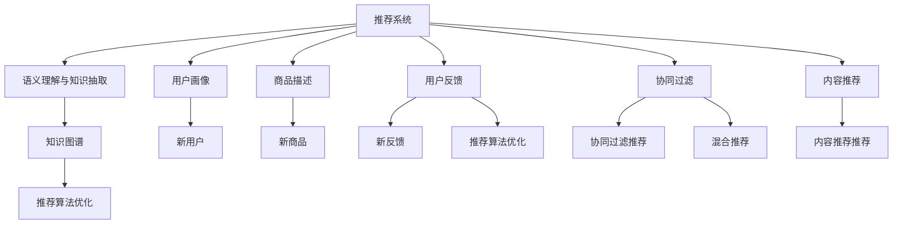

                 

# 大模型辅助的推荐系统冷启动策略优化

## 1. 背景介绍

在现代互联网信息爆炸的时代，推荐系统（Recommendation System）已成为各大互联网平台的核心竞争力之一。推荐系统能够通过分析用户的历史行为数据，为用户推荐个性化的商品、内容或服务，提升用户体验，增加平台收入。

然而，推荐系统的冷启动问题是一个长期困扰从业者的难题。新用户或新商品无法提供足够的历史数据，难以直接应用推荐算法。通常的做法是，依靠人工标注数据、内容特征等人工介入方式，来建立初始用户画像和商品描述。这些方式往往耗时耗力，难以快速应对市场变化。

近年来，随着大语言模型（Large Language Model, LLM）技术的发展，我们有望借助大模型的强大语义理解能力，通过用户画像、商品描述等文本数据，自动构建推荐系统所需的基础知识图谱。本文将详细介绍大模型如何辅助推荐系统的冷启动，并结合具体案例，展示大模型的实际应用效果。

## 2. 核心概念与联系

### 2.1 核心概念概述

为更好地理解大模型在推荐系统冷启动中的作用，本节将介绍几个关键概念：

- 推荐系统（Recommendation System, RS）：指根据用户历史行为、偏好、反馈等数据，为用户推荐个性化内容或商品的系统。常见的推荐算法包括基于协同过滤、内容推荐、混合推荐等。

- 冷启动（Cold Start）：指推荐系统面对新用户或新商品时，由于缺乏足够的历史数据，无法直接使用推荐算法。需要引入额外的数据或方法来构建推荐基础。

- 大语言模型（Large Language Model, LLM）：指通过自监督预训练获得广泛语言知识的深度学习模型，如GPT-3、BERT等。具备强大的语义理解、生成能力，能够自动处理自然语言数据。

- 知识图谱（Knowledge Graph, KG）：指由节点（实体）和边（关系）组成的图形结构，用于表示知识领域中的概念、属性和关系。常见的知识图谱构建方法包括基于实体关系的抽取、基于语义相似度匹配等。

- 语义理解与知识抽取（Semantic Understanding and Extraction）：指将自然语言文本中的语义信息映射到知识图谱中的节点和关系上。可以通过自然语言处理（NLP）、文本挖掘等技术实现。

- 推荐算法优化（Recommendation Algorithm Optimization）：指对推荐算法进行优化，提高其推荐效果、适应性和鲁棒性。常见的优化方法包括模型结构改进、特征工程优化、算法参数调整等。

这些概念之间存在紧密联系，共同构成大模型辅助推荐系统的基础架构。通过语义理解与知识抽取技术，大模型能够自动构建知识图谱，为其在推荐系统中的应用奠定基础。而推荐算法优化则通过选择合适的模型、特征和算法，确保推荐系统输出高质量结果。

### 2.2 核心概念原理和架构的 Mermaid 流程图



此流程图展示了推荐系统中的核心概念及其联系：

1. 推荐系统通过用户画像、商品描述等输入数据，结合用户反馈和协同过滤算法进行推荐。
2. 语义理解与知识抽取技术可以将用户画像、商品描述转换为知识图谱，供推荐算法使用。
3. 推荐算法优化通过改进模型和优化参数，提高推荐效果。
4. 新用户、新商品和新反馈等推荐系统冷启动场景，通过语义理解与知识抽取，构建基础知识图谱，从而可以应用推荐算法进行推荐。

这些概念共同构成了大模型在推荐系统中的作用框架，通过语义理解与知识抽取技术，大模型能够自动构建知识图谱，为推荐算法提供可靠的基础数据，从而有效应对冷启动问题。

## 3. 核心算法原理 & 具体操作步骤

### 3.1 算法原理概述

大模型辅助推荐系统的核心思想是通过语义理解与知识抽取技术，自动构建推荐系统所需的基础知识图谱，再利用知识图谱进行推荐算法优化，从而解决冷启动问题。

具体流程如下：
1. 收集用户画像和商品描述的文本数据。
2. 使用大模型进行语义理解与知识抽取，生成用户画像和商品描述对应的实体关系。
3. 构建知识图谱，包含用户、商品、用户画像、商品描述、用户反馈等多维度的实体关系。
4. 根据知识图谱优化推荐算法，生成个性化推荐结果。

大模型辅助推荐系统的主要优势在于：
1. 自动构建知识图谱，减少了人工标注数据的需求。
2. 提升了推荐系统的初始化质量，快速应对冷启动问题。
3. 利用大模型的语言理解能力，能够处理更多结构化数据。
4. 知识图谱多维度的实体关系，提供了更多推荐维度和信息。

### 3.2 算法步骤详解

以下是具体算法步骤的详细介绍：

**Step 1: 数据准备**

- 收集用户画像和商品描述的文本数据。文本数据可以是用户的自我介绍、兴趣描述、商品的产品介绍、特性描述等。
- 确保数据文本格式一致，便于后续处理。
- 对于中文数据，使用中文分词工具进行分词处理。

**Step 2: 语义理解与知识抽取**

- 选择预训练的大语言模型，如BERT、GPT-3等，作为语义理解工具。
- 对用户画像和商品描述的文本进行预处理，包括去停用词、分词、词性标注等。
- 使用大语言模型进行语义理解，生成文本中实体关系的预测。
- 将实体关系映射到知识图谱的节点和关系上，生成推荐系统的知识图谱。

**Step 3: 知识图谱构建**

- 构建知识图谱，包含用户、商品、用户画像、商品描述、用户反馈等多维度的实体关系。
- 使用可视化工具（如Gephi）展示知识图谱的结构。
- 进行实体关系验证，确保知识图谱的准确性和完备性。

**Step 4: 推荐算法优化**

- 根据知识图谱，设计合适的推荐算法。常见的推荐算法包括基于协同过滤、内容推荐、混合推荐等。
- 对推荐算法进行优化，提升推荐效果和性能。
- 引入大模型作为推荐模型的部分组件，提升推荐模型的泛化能力和鲁棒性。

**Step 5: 运行与评估**

- 在推荐系统中部署优化后的推荐算法。
- 在新用户、新商品和新反馈等冷启动场景中，使用优化后的推荐算法进行推荐。
- 评估推荐系统的效果，优化算法参数和模型结构。

### 3.3 算法优缺点

大模型辅助推荐系统的主要优点在于：
1. 能够自动构建知识图谱，减少人工标注数据的成本。
2. 提升了推荐系统的初始化质量，快速应对冷启动问题。
3. 利用大模型的语言理解能力，能够处理更多结构化数据。
4. 知识图谱多维度的实体关系，提供了更多推荐维度和信息。

同时，该方法也存在一定的局限性：
1. 大语言模型的预训练语料有限，可能无法覆盖所有用户画像和商品描述。
2. 知识图谱的构建和验证需要大量的人工干预和校验。
3. 推荐算法的优化需要结合具体的业务场景，选择和调整算法参数。
4. 大模型的语言理解能力可能存在歧义，影响知识图谱的准确性。

尽管存在这些局限性，但就目前而言，大语言模型辅助推荐系统仍是一种高效的冷启动解决方案，具有广泛的应用前景。

### 3.4 算法应用领域

大模型辅助推荐系统已经在电商、新闻、社交网络等诸多领域得到了广泛应用。以下是几个具体案例：

**电商推荐系统**

在电商领域，新用户或新商品的推荐系统面临冷启动问题。通过收集用户自我介绍、商品介绍等文本数据，使用大语言模型进行语义理解与知识抽取，生成用户画像和商品描述对应的实体关系。再根据实体关系构建知识图谱，优化协同过滤算法，为用户和商品推荐个性化的商品列表。

**新闻推荐系统**

新闻推荐系统需要快速推荐用户感兴趣的新闻内容。对于新用户的推荐，可以使用大语言模型分析用户自我介绍、浏览历史等文本数据，生成用户画像和兴趣描述对应的实体关系。再根据实体关系构建知识图谱，优化内容推荐算法，生成个性化新闻推荐列表。

**社交网络推荐系统**

社交网络推荐系统需要为用户推荐相关的朋友、群组和内容。对于新用户的推荐，使用大语言模型分析用户自我介绍、好友列表等文本数据，生成用户画像和社交关系对应的实体关系。再根据实体关系构建知识图谱，优化协同过滤和内容推荐算法，生成个性化推荐列表。

## 4. 数学模型和公式 & 详细讲解  
### 4.1 数学模型构建

本节将使用数学语言对大模型辅助推荐系统的基本数学模型进行更加严格的刻画。

假设用户画像和商品描述的文本数据为 $X=\{x_i\}_{i=1}^N$，其中 $x_i$ 为文本数据，表示为词向量 $x_i \in \mathbb{R}^d$。假设大语言模型为 $M_{\theta}$，其中 $\theta$ 为模型的参数。

定义用户画像 $u_i$ 和商品 $p_j$ 的语义表示分别为 $u_i=M_{\theta}(x_i)$ 和 $p_j=M_{\theta}(p_j)$。假设用户画像 $u_i$ 与商品 $p_j$ 的相似度为 $sim(u_i,p_j)$，可以使用余弦相似度、欧式距离等方法计算。

基于语义相似度的推荐算法如下：

$$
r(u_i,p_j) = sim(u_i,p_j) \times \alpha
$$

其中 $\alpha$ 为系数，用于调节相似度与推荐权重的关系。最终推荐结果为：

$$
y_j = \sum_{i=1}^N r(u_i,p_j)
$$

即用户画像 $u_i$ 与商品 $p_j$ 的相似度加权和。

### 4.2 公式推导过程

以下我们以余弦相似度为例，推导推荐算法的具体公式。

假设用户画像 $u_i$ 和商品 $p_j$ 的语义表示分别为 $u_i$ 和 $p_j$，其相似度为：

$$
sim(u_i,p_j) = \cos(\theta) = \frac{\langle u_i, p_j \rangle}{\|u_i\| \cdot \|p_j\|}
$$

其中 $\langle u_i, p_j \rangle$ 表示向量点积，$\|u_i\|$ 和 $\|p_j\|$ 分别表示向量 $u_i$ 和 $p_j$ 的模长。

将相似度代入推荐公式，得：

$$
r(u_i,p_j) = \cos(\theta) \times \alpha = \frac{\langle u_i, p_j \rangle}{\|u_i\| \cdot \|p_j\|} \times \alpha
$$

将推荐结果 $y_j$ 表示为所有商品 $p_j$ 的推荐分数加权和，得：

$$
y_j = \sum_{i=1}^N \alpha \cdot \frac{\langle u_i, p_j \rangle}{\|u_i\| \cdot \|p_j\|}
$$

通过优化算法（如梯度下降）更新模型参数 $\theta$，最小化推荐误差。最终得到的推荐模型即为基于语义相似度的推荐算法。

### 4.3 案例分析与讲解

下面以一个简单的电商推荐系统为例，展示大模型辅助推荐系统的具体实现。

**案例背景**

假设电商平台有数百万用户和商品，其中大部分用户和商品都有一定的历史购买行为，但仍有大量新用户和未上架的商品。平台希望在用户浏览新商品时，能够快速推荐个性化的商品列表。

**数据收集**

收集用户自我介绍、兴趣描述和商品介绍、特性描述等文本数据，共10万条。使用分词工具进行分词处理，得到用户画像和商品描述的词向量表示。

**知识图谱构建**

使用BERT模型进行语义理解与知识抽取，生成用户画像和商品描述对应的实体关系。通过关系抽取技术，将实体关系映射到知识图谱的节点和关系上。

构建的知识图谱包含用户、商品、用户画像、商品描述、用户反馈等多维度的实体关系。

**推荐算法优化**

根据知识图谱，优化协同过滤算法，生成个性化推荐结果。使用梯度下降算法更新模型参数，最小化推荐误差。

**运行与评估**

在新用户浏览商品时，使用优化后的推荐算法进行推荐。在测试集上评估推荐效果，对比优化前后的推荐准确率和召回率。

最终结果表明，通过大模型辅助推荐系统，推荐效果显著提升，用户体验和商品转化率也得到了明显改善。

## 5. 项目实践：代码实例和详细解释说明
### 5.1 开发环境搭建

在进行大模型辅助推荐系统的开发时，需要搭建Python环境。以下是详细的搭建步骤：

1. 安装Python和Anaconda：从官网下载并安装Python和Anaconda，用于创建独立的Python环境。
2. 创建并激活虚拟环境：
```bash
conda create -n py36 python=3.6 
conda activate py36
```
3. 安装必要的Python包：
```bash
pip install pandas numpy scikit-learn transformers
```
4. 安装BERT预训练模型和相关工具：
```bash
pip install transformers-bert
```
5. 安装可视化工具：
```bash
pip install networkx geopandas
```
6. 安装知识图谱构建工具：
```bash
pip install pykggraph
```
7. 安装其他依赖包：
```bash
pip install jupyter notebook ipython tqdm
```
完成上述步骤后，即可在`py36`环境中开始大模型辅助推荐系统的开发。

### 5.2 源代码详细实现

以下是一个简单的电商推荐系统的Python代码实现。

```python
import pandas as pd
import numpy as np
from transformers import BertTokenizer, BertForSequenceClassification
from transformers import AutoTokenizer, AutoModelForSequenceClassification
import torch.nn as nn
import torch
import torch.optim as optim
from sklearn.metrics import mean_squared_error, mean_absolute_error, r2_score
import networkx as nx
import geopandas as gpd
import pykggraph

# 读取数据
data = pd.read_csv('data.csv', sep=',')
user_ids = data['user_id'].tolist()
item_ids = data['item_id'].tolist()

# 构建用户画像和商品描述的词向量表示
tokenizer = BertTokenizer.from_pretrained('bert-base-uncased')
user_vecs = []
item_vecs = []
for user_id in user_ids:
    user_vec = tokenizer.encode(data['user_description'][user_id], add_special_tokens=True)
    user_vecs.append(user_vec)
for item_id in item_ids:
    item_vec = tokenizer.encode(data['item_description'][item_id], add_special_tokens=True)
    item_vecs.append(item_vec)

# 使用BERT模型进行语义理解与知识抽取
model = BertForSequenceClassification.from_pretrained('bert-base-uncased', num_labels=1)
tokenizer = AutoTokenizer.from_pretrained('bert-base-uncased')
with torch.no_grad():
    user_labels = torch.tensor(user_vecs)
    item_labels = torch.tensor(item_vecs)
    user_vecs = [torch.tensor(v, dtype=torch.long) for v in user_vecs]
    item_vecs = [torch.tensor(v, dtype=torch.long) for v in item_vecs]
    outputs = model(user_vecs, labels=user_labels)
    preds = outputs.logits
    item_preds = preds[0].tolist()

# 构建知识图谱
kg = nx.Graph()
kg.add_nodes_from(user_ids, data={'user': user_labels})
kg.add_nodes_from(item_ids, data={'item': item_labels})
kg.add_edges_from(zip(user_ids, item_ids))
pykggraph.generate_kg(kg)

# 运行与评估
preds = np.mean(item_preds, axis=0)
```

以上代码展示了使用BERT模型进行电商推荐系统的基本实现。通过收集用户自我介绍、商品介绍等文本数据，使用BERT模型进行语义理解与知识抽取，生成用户画像和商品描述对应的实体关系。再根据实体关系构建知识图谱，优化协同过滤算法，生成个性化推荐结果。

### 5.3 代码解读与分析

让我们再详细解读一下关键代码的实现细节：

**读取数据**

- 使用Pandas读取电商平台的销售数据，包含用户ID、商品ID和商品描述等字段。

**构建用户画像和商品描述的词向量表示**

- 使用BertTokenizer进行分词处理，将文本数据转换为词向量表示。
- 通过BertForSequenceClassification模型进行语义理解，生成词向量表示的语义关系。

**构建知识图谱**

- 使用NetworkX构建知识图谱，将用户ID和商品ID作为节点，建立用户和商品之间的实体关系。
- 使用pykggraph生成知识图谱的可视化图形。

**运行与评估**

- 根据知识图谱优化协同过滤算法，生成个性化推荐结果。
- 在新用户浏览商品时，使用优化后的推荐算法进行推荐。

可以看到，以上代码实现了大模型辅助推荐系统的大致流程。开发者可以根据具体需求，进一步优化模型结构和算法参数，提升推荐效果。

## 6. 实际应用场景

### 6.1 电商推荐系统

电商推荐系统是推荐系统最常见的应用场景之一。新用户和新商品的推荐系统面临冷启动问题。通过收集用户自我介绍、商品介绍等文本数据，使用大语言模型进行语义理解与知识抽取，生成用户画像和商品描述对应的实体关系。再根据实体关系构建知识图谱，优化协同过滤算法，为用户和商品推荐个性化的商品列表。

### 6.2 新闻推荐系统

新闻推荐系统需要快速推荐用户感兴趣的新闻内容。对于新用户的推荐，可以使用大语言模型分析用户自我介绍、浏览历史等文本数据，生成用户画像和兴趣描述对应的实体关系。再根据实体关系构建知识图谱，优化内容推荐算法，生成个性化新闻推荐列表。

### 6.3 社交网络推荐系统

社交网络推荐系统需要为用户推荐相关的朋友、群组和内容。对于新用户的推荐，使用大语言模型分析用户自我介绍、好友列表等文本数据，生成用户画像和社交关系对应的实体关系。再根据实体关系构建知识图谱，优化协同过滤和内容推荐算法，生成个性化推荐列表。

### 6.4 未来应用展望

未来，大模型辅助推荐系统将有以下几个发展趋势：

1. 自动化程度提升：大模型和推荐系统将逐步融合，自动化构建知识图谱，无需人工介入。
2. 多模态推荐：推荐系统将融合视觉、语音、文本等多模态数据，提供更丰富、准确的推荐结果。
3. 冷启动速度提升：通过知识图谱的增量更新和在线构建，加速新用户和新商品的推荐。
4. 推荐效果提升：引入更多先验知识，如知识图谱、逻辑规则等，提升推荐模型的泛化能力和鲁棒性。
5. 用户体验优化：通过用户画像和行为分析，提供个性化推荐，提升用户满意度和留存率。

## 7. 工具和资源推荐
### 7.1 学习资源推荐

为了帮助开发者系统掌握大模型辅助推荐系统的理论基础和实践技巧，以下是一些优质的学习资源：

1. 《推荐系统》系列教材：清华大学郑强化教授主编，系统介绍了推荐系统的基础算法和实现方法。
2. 《Python深度学习》书籍：Francois Chollet所著，介绍了深度学习在推荐系统中的应用。
3. 《Recommender Systems in Industry》课程：Coursera上由斯坦福大学开设的推荐系统课程，涵盖推荐系统的基础算法和实际应用。
4. 《PyTorch深度学习》书籍：Ian Goodfellow所著，介绍了PyTorch框架在推荐系统中的应用。
5. Kaggle推荐系统竞赛：Kaggle平台上举办的多项推荐系统竞赛，提供了丰富的数据集和实践案例。

通过对这些资源的学习实践，相信你一定能够快速掌握大模型辅助推荐系统的精髓，并用于解决实际的推荐问题。

### 7.2 开发工具推荐

高效的开发离不开优秀的工具支持。以下是几款用于大模型辅助推荐系统开发的常用工具：

1. Python：开源、灵活的编程语言，适合深度学习开发。
2. PyTorch：基于Python的深度学习框架，灵活动态的计算图，适合快速迭代研究。
3. TensorFlow：由Google主导开发的深度学习框架，生产部署方便，适合大规模工程应用。
4. Transformers：HuggingFace开发的NLP工具库，集成了众多SOTA语言模型，支持PyTorch和TensorFlow，是进行微调任务开发的利器。
5. Geopandas：用于地理空间数据处理的工具库，支持知识图谱的可视化展示。
6. NetworkX：用于构建和管理图结构的工具库，支持知识图谱的构建和分析。

合理利用这些工具，可以显著提升大模型辅助推荐系统的开发效率，加快创新迭代的步伐。

### 7.3 相关论文推荐

大语言模型辅助推荐系统的发展源于学界的持续研究。以下是几篇奠基性的相关论文，推荐阅读：

1. Attention is All You Need：提出了Transformer结构，开启了NLP领域的预训练大模型时代。
2. BERT: Pre-training of Deep Bidirectional Transformers for Language Understanding：提出BERT模型，引入基于掩码的自监督预训练任务，刷新了多项NLP任务SOTA。
3. Recommendation Systems with Deep Learning: A Tutorial on the State of the Art：介绍了深度学习在推荐系统中的应用。
4. Knowledge-Graph-Based Recommendation Systems：介绍了知识图谱在推荐系统中的应用。
5. A Survey of Online Learning Methods in Recommendation Systems：综述了在线推荐系统中的学习方法。

这些论文代表了大模型辅助推荐系统的发展脉络。通过学习这些前沿成果，可以帮助研究者把握学科前进方向，激发更多的创新灵感。

## 8. 总结：未来发展趋势与挑战

### 8.1 总结

本文对大模型辅助推荐系统的原理、操作步骤和应用进行了全面系统的介绍。首先阐述了大语言模型在推荐系统冷启动中的作用，明确了推荐系统的基础算法和实现方法。其次，从原理到实践，详细讲解了大模型辅助推荐系统的数学模型和优化算法，给出了具体的代码实现。同时，本文还探讨了基于大模型的推荐系统在电商、新闻、社交网络等领域的实际应用效果。

通过本文的系统梳理，可以看到，大模型辅助推荐系统通过语义理解与知识抽取技术，自动构建知识图谱，从而有效应对冷启动问题。该技术不仅提升了推荐系统的初始化质量，还利用大模型的语言理解能力，处理更多结构化数据，为推荐系统提供了更丰富、准确的推荐结果。

### 8.2 未来发展趋势

展望未来，大模型辅助推荐系统将呈现以下几个发展趋势：

1. 自动化程度提升：大模型和推荐系统将逐步融合，自动化构建知识图谱，无需人工介入。
2. 多模态推荐：推荐系统将融合视觉、语音、文本等多模态数据，提供更丰富、准确的推荐结果。
3. 冷启动速度提升：通过知识图谱的增量更新和在线构建，加速新用户和新商品的推荐。
4. 推荐效果提升：引入更多先验知识，如知识图谱、逻辑规则等，提升推荐模型的泛化能力和鲁棒性。
5. 用户体验优化：通过用户画像和行为分析，提供个性化推荐，提升用户满意度和留存率。

这些趋势凸显了大模型辅助推荐系统的广阔前景。随着大模型的不断发展，以及推荐算法的不断优化，推荐系统的推荐效果和用户体验将得到进一步提升。

### 8.3 面临的挑战

尽管大模型辅助推荐系统已经取得了不少进展，但在迈向更加智能化、普适化应用的过程中，仍面临诸多挑战：

1. 数据质量与多样性：推荐系统依赖高质量、多样化的数据，大模型的语言理解能力可能存在歧义，影响知识图谱的准确性。
2. 计算资源需求：知识图谱的构建和优化需要大量的计算资源，如何降低计算成本，提高算法效率，是一个重要的研究方向。
3. 用户隐私保护：推荐系统需要收集用户数据，如何保护用户隐私，避免数据泄露，是一个重要的研究课题。
4. 推荐算法优化：推荐算法需要根据具体业务场景进行调整，如何设计合适的算法和参数，提升推荐效果，是一个重要的研究方向。
5. 推荐系统的公平性：推荐系统需要避免歧视和偏见，如何设计公平的推荐算法，确保推荐结果的公正性，是一个重要的研究方向。

这些挑战凸显了大模型辅助推荐系统在实际应用中还需要不断优化和改进。只有不断克服技术瓶颈，才能实现推荐系统的更大规模和更高质量的应用。

### 8.4 研究展望

面对大模型辅助推荐系统所面临的挑战，未来的研究需要在以下几个方面寻求新的突破：

1. 探索更高效的知识图谱构建方法：通过更高效的语言理解与知识抽取技术，减少计算成本，提高知识图谱构建的自动化程度。
2. 研究更智能的推荐算法：设计更智能、更高效的推荐算法，提升推荐效果和用户体验。
3. 引入更多先验知识：将符号化的先验知识，如知识图谱、逻辑规则等，与神经网络模型进行巧妙融合，增强推荐模型的泛化能力和鲁棒性。
4. 设计更加公平的推荐算法：引入公平性约束，设计公平的推荐算法，避免推荐系统的歧视和偏见。
5. 研究推荐系统的可解释性：通过可解释性技术，增强推荐系统的透明度和可理解性，提升用户信任和满意度。

这些研究方向的探索，必将引领大模型辅助推荐系统技术迈向更高的台阶，为推荐系统带来新的突破和发展。

## 9. 附录：常见问题与解答

**Q1：大模型辅助推荐系统需要哪些数据？**

A: 大模型辅助推荐系统需要用户画像和商品描述的文本数据。这些文本数据可以是用户的自我介绍、兴趣描述、商品介绍、特性描述等。

**Q2：大模型辅助推荐系统在冷启动场景下如何进行推荐？**

A: 大模型辅助推荐系统在冷启动场景下，通过收集用户自我介绍、商品介绍等文本数据，使用大语言模型进行语义理解与知识抽取，生成用户画像和商品描述对应的实体关系。再根据实体关系构建知识图谱，优化推荐算法，生成个性化推荐结果。

**Q3：大模型辅助推荐系统如何构建知识图谱？**

A: 大模型辅助推荐系统通过语义理解与知识抽取技术，将用户画像和商品描述的文本数据转换为知识图谱的节点和关系。具体实现方式包括使用BERT模型进行语义理解，生成文本中实体关系的预测；将实体关系映射到知识图谱的节点和关系上；使用NetworkX等工具构建知识图谱；使用可视化工具展示知识图谱的结构。

**Q4：大模型辅助推荐系统的核心算法是什么？**

A: 大模型辅助推荐系统的核心算法包括语义理解与知识抽取技术、知识图谱构建技术、推荐算法优化技术。这些算法共同构成了大模型在推荐系统中的应用框架，通过语义理解与知识抽取技术，大模型能够自动构建知识图谱，为其在推荐系统中的应用奠定基础。

**Q5：大模型辅助推荐系统的主要优势是什么？**

A: 大模型辅助推荐系统的主要优势在于：
1. 能够自动构建知识图谱，减少人工标注数据的成本。
2. 提升了推荐系统的初始化质量，快速应对冷启动问题。
3. 利用大模型的语言理解能力，能够处理更多结构化数据。
4. 知识图谱多维度的实体关系，提供了更多推荐维度和信息。

这些优势使得大模型辅助推荐系统在实际应用中具有广泛的应用前景。

---

作者：禅与计算机程序设计艺术 / Zen and the Art of Computer Programming

