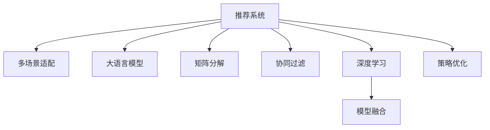

                 

# 大模型辅助的推荐系统多场景适配方法

> 关键词：推荐系统,多场景适配,大模型,矩阵分解,协同过滤,基于深度学习,模型融合,策略优化

## 1. 背景介绍

### 1.1 问题由来
推荐系统在电子商务、在线视频、社交媒体等领域中扮演着越来越重要的角色，通过分析和挖掘用户行为数据，为用户推荐个性化商品、视频、文章等内容，极大地提升了用户体验和平台收益。然而，随着用户数量的增长和推荐需求的增加，推荐系统也面临着诸多挑战：

1. **用户行为稀疏性**：用户往往只对少部分商品进行过交互，数据稀疏性导致协同过滤等推荐算法难以得到理想的推荐结果。
2. **推荐准确性**：推荐系统推荐结果的准确性和多样性需要不断优化，以应对用户快速变化的偏好和兴趣。
3. **冷启动问题**：新用户或新商品没有足够的历史数据，如何有效进行推荐成为一大难题。
4. **数据隐私和安全**：用户数据隐私和推荐系统安全性问题，需要有效的数据保护机制。

### 1.2 问题核心关键点
针对这些挑战，大模型辅助的推荐系统应运而生。通过引入大语言模型，推荐系统能够更好地理解用户行为背后的语义信息，从更丰富的角度进行推荐决策。同时，通过多场景适配和策略优化，推荐系统能够在不同的应用场景中，如电商、视频、社交等，提供个性化的推荐服务，提升用户满意度，优化平台收益。

## 2. 核心概念与联系

### 2.1 核心概念概述

为更好地理解大模型辅助的推荐系统多场景适配方法，本节将介绍几个密切相关的核心概念：

- **推荐系统(Recommendation System)**：通过分析用户历史行为和上下文信息，为用户推荐个性化商品、内容等。常见的推荐算法包括协同过滤、基于内容的推荐、基于矩阵分解的方法等。

- **多场景适配(Multi-Scene Adaptation)**：针对不同应用场景的特点，如电商平台、视频平台、社交平台等，设计不同的推荐策略，提升推荐系统的适应性和用户满意度。

- **大语言模型(Large Language Model, LLM)**：以Transformer为代表的预训练语言模型，通过海量的无标签文本数据进行预训练，学习丰富的语言知识和语义表示。

- **矩阵分解(Matrix Factorization)**：通过矩阵分解的方式，将用户-商品/内容评分矩阵分解为用户向量、商品/内容向量及交互矩阵的乘积，降低数据的维度，提升推荐效果。

- **协同过滤(Collaborative Filtering)**：通过用户行为数据和商品/内容元信息，利用用户间的相似性和商品/内容的相关性进行推荐。

- **深度学习(Deep Learning)**：通过多层神经网络进行复杂的非线性映射，提升模型的表示能力和预测准确性。

- **模型融合(Model Fusion)**：通过将多个模型的输出进行加权融合，提升推荐结果的鲁棒性和多样性。

- **策略优化(Strategy Optimization)**：通过自适应调整推荐策略，如算法选择、参数配置等，提高推荐系统的性能和用户满意度。

这些核心概念之间的逻辑关系可以通过以下Mermaid流程图来展示：



这个流程图展示了大模型辅助的推荐系统多场景适配方法的核心概念及其之间的关系：

1. 推荐系统通过多场景适配、大模型辅助、矩阵分解、协同过滤和深度学习等技术，提升推荐准确性和多样性。
2. 矩阵分解、协同过滤和深度学习等算法提供了推荐的基础，而大语言模型则进一步丰富了推荐系统的语义理解能力。
3. 模型融合和策略优化在提升推荐性能的同时，也增强了推荐系统的适应性和灵活性。

## 3. 核心算法原理 & 具体操作步骤
### 3.1 算法原理概述

大模型辅助的推荐系统多场景适配方法，核心思想是利用大语言模型丰富的语言知识和语义表示，在推荐系统中进行多场景下的个性化推荐。其核心算法原理包括：

1. **大语言模型嵌入**：通过大语言模型，将用户的行为和上下文信息转化为高维语义向量，提升推荐结果的语义理解能力。
2. **多场景适配**：针对不同应用场景，设计不同的推荐策略和算法，如电商场景中侧重于商品属性和用户行为的协同过滤，视频场景中侧重于内容流量的矩阵分解等。
3. **策略优化**：通过自适应调整推荐策略，如算法选择、参数配置等，提高推荐系统的性能和用户满意度。

### 3.2 算法步骤详解

大模型辅助的推荐系统多场景适配方法的具体操作步骤如下：

**Step 1: 准备数据和预训练模型**
- 收集不同应用场景的用户行为数据，如电商平台的用户点击、购买记录，视频平台的观看记录等。
- 选择合适的预训练语言模型，如BERT、GPT等，进行任务适配层的搭建。

**Step 2: 提取用户行为语义**
- 通过大语言模型，将用户的行为和上下文信息转化为高维语义向量。例如，将用户查询转化为用户兴趣向量，将商品/内容描述转化为商品/内容特征向量。

**Step 3: 设计多场景适配策略**
- 针对不同应用场景，设计适合的推荐算法。例如，在电商场景中使用协同过滤算法，根据用户历史行为和商品属性推荐相似商品；在视频平台使用矩阵分解算法，根据用户兴趣和内容特征推荐相关视频。

**Step 4: 模型训练和融合**
- 在选定的数据集上进行模型训练，如使用协同过滤算法训练用户-商品相似度矩阵，使用深度学习模型训练用户兴趣和商品属性向量。
- 将不同场景的推荐结果进行融合，如通过加权平均或注意力机制融合多个模型的输出。

**Step 5: 策略优化**
- 根据实际应用场景和用户反馈，动态调整推荐策略，如调整算法权重、优化参数配置等，提升推荐系统的性能。

### 3.3 算法优缺点

大模型辅助的推荐系统多场景适配方法具有以下优点：

1. **高泛化能力**：大语言模型的语义表示能力使得推荐系统能够更好地理解用户的兴趣和需求，提升推荐结果的泛化能力。
2. **多场景适配**：通过多场景适配策略，推荐系统能够适应不同应用场景的特点，提供更加个性化和多样化的推荐服务。
3. **鲁棒性强**：融合多个模型的输出，提高推荐结果的鲁棒性和抗干扰能力。
4. **可解释性高**：大语言模型能够提供推荐决策的语义解释，提升推荐系统的可解释性。

同时，该方法也存在以下局限性：

1. **计算成本高**：大语言模型的预训练和任务适配需要大量的计算资源，初期建设成本较高。
2. **数据隐私问题**：用户行为数据隐私保护和推荐系统安全性问题，需要有效的数据保护机制。
3. **模型复杂度高**：多场景适配和大模型辅助使得推荐系统模型复杂度增加，维护和调优难度增大。
4. **实时性要求高**：在实时性要求较高的场景下，推荐系统需要高效的计算和存储机制。

### 3.4 算法应用领域

大模型辅助的推荐系统多场景适配方法已经广泛应用于以下几个领域：

1. **电商平台**：通过协同过滤和深度学习技术，结合大语言模型，对用户行为进行语义理解和特征提取，提升商品推荐效果。
2. **在线视频平台**：利用矩阵分解和大语言模型，推荐用户感兴趣的视频内容，增强用户观看体验。
3. **社交媒体**：通过多场景适配和大语言模型，推荐用户感兴趣的内容和社交关系，增强用户粘性和互动性。
4. **智能家居**：结合大语言模型和推荐算法，为用户提供个性化的家居产品推荐，提升用户生活品质。
5. **健康医疗**：利用大语言模型和协同过滤技术，推荐适合用户的医疗方案和健康产品，提升医疗服务质量。

## 4. 数学模型和公式 & 详细讲解 & 举例说明（备注：数学公式请使用latex格式，latex嵌入文中独立段落使用 $$，段落内使用 $)
### 4.1 数学模型构建

大模型辅助的推荐系统多场景适配方法的数学模型构建如下：

假设用户-商品/内容评分矩阵为 $X \in \mathbb{R}^{N \times M}$，其中 $N$ 为用户数，$M$ 为商品/内容数。$X$ 的每一行表示一个用户的评分向量，每一列表示一个商品/内容的评分向量。

大语言模型将用户的行为和上下文信息转化为高维语义向量 $\mathbf{u} \in \mathbb{R}^{d_u}$ 和商品/内容的特征向量 $\mathbf{v} \in \mathbb{R}^{d_v}$，其中 $d_u$ 和 $d_v$ 为语义向量的维度。

推荐算法通常采用协同过滤、矩阵分解和深度学习等方法。协同过滤算法通过用户-商品/内容相似度矩阵 $W \in \mathbb{R}^{N \times M}$ 进行推荐，矩阵分解算法通过用户向量 $\mathbf{u}$ 和商品/内容向量 $\mathbf{v}$ 进行推荐，深度学习模型通过用户兴趣和商品属性向量进行推荐。

### 4.2 公式推导过程

以下以协同过滤算法为例，推导推荐结果的计算公式。

假设用户 $i$ 对商品 $j$ 的评分向量为 $\mathbf{x}_i \in \mathbb{R}^{M}$，用户向量为 $\mathbf{u}_i \in \mathbb{R}^{d_u}$，商品向量为 $\mathbf{v}_j \in \mathbb{R}^{d_v}$，相似度矩阵为 $W \in \mathbb{R}^{N \times M}$。

协同过滤算法的推荐结果为：

$$
\hat{y}_{i,j} = \frac{\mathbf{u}_i \cdot \mathbf{v}_j}{\|\mathbf{u}_i\|\|\mathbf{v}_j\|}
$$

其中 $\cdot$ 表示向量点乘，$\|\cdot\|$ 表示向量范数。

通过大语言模型，用户行为和上下文信息转化为语义向量 $\mathbf{u}_i$ 和 $\mathbf{v}_j$，可以进一步提升推荐结果的语义理解能力。

### 4.3 案例分析与讲解

以电商平台为例，用户输入的搜索词和浏览商品的行为，可以转化为用户兴趣向量 $\mathbf{u}_i$。商品描述和属性信息可以转化为商品特征向量 $\mathbf{v}_j$。通过大语言模型，将用户兴趣向量 $\mathbf{u}_i$ 和商品特征向量 $\mathbf{v}_j$ 进行语义匹配，得到用户对商品 $j$ 的兴趣度评分 $\hat{y}_{i,j}$。将评分结果进行排序，推荐评分较高的商品给用户 $i$。

## 5. 项目实践：代码实例和详细解释说明
### 5.1 开发环境搭建

在进行推荐系统多场景适配实践前，我们需要准备好开发环境。以下是使用Python进行PyTorch开发的环境配置流程：

1. 安装Anaconda：从官网下载并安装Anaconda，用于创建独立的Python环境。

2. 创建并激活虚拟环境：
```bash
conda create -n recsys-env python=3.8 
conda activate recsys-env
```

3. 安装PyTorch：根据CUDA版本，从官网获取对应的安装命令。例如：
```bash
conda install pytorch torchvision torchaudio cudatoolkit=11.1 -c pytorch -c conda-forge
```

4. 安装相关库：
```bash
pip install pandas numpy matplotlib scikit-learn scikit-optimize tqdm jupyter notebook ipython
```

完成上述步骤后，即可在`recsys-env`环境中开始推荐系统多场景适配实践。

### 5.2 源代码详细实现

这里我们以电商推荐系统为例，给出使用PyTorch进行协同过滤推荐系统的PyTorch代码实现。

首先，定义协同过滤推荐模型的数据处理函数：

```python
import torch
from torch.utils.data import Dataset, DataLoader
from sklearn.metrics import mean_absolute_error

class RecommendationDataset(Dataset):
    def __init__(self, users, items, ratings, user_vectors, item_vectors, tokenizer):
        self.users = users
        self.items = items
        self.ratings = ratings
        self.user_vectors = user_vectors
        self.item_vectors = item_vectors
        self.tokenizer = tokenizer

    def __len__(self):
        return len(self.users)

    def __getitem__(self, item):
        user = self.users[item]
        item = self.items[item]
        rating = self.ratings[item]

        user_vector = self.user_vectors[user]
        item_vector = self.item_vectors[item]

        return {'user_id': user,
                'item_id': item,
                'rating': rating,
                'user_vector': user_vector,
                'item_vector': item_vector}

# 创建数据集
tokenizer = BertTokenizer.from_pretrained('bert-base-cased')
users = ['user1', 'user2', 'user3']
items = ['item1', 'item2', 'item3']
ratings = [5, 3, 1]
user_vectors = [torch.tensor([0.1, 0.2, 0.3]), torch.tensor([0.4, 0.5, 0.6]), torch.tensor([0.7, 0.8, 0.9])]
item_vectors = [torch.tensor([0.2, 0.3, 0.4]), torch.tensor([0.5, 0.6, 0.7]), torch.tensor([0.8, 0.9, 1.0])]

dataset = RecommendationDataset(users, items, ratings, user_vectors, item_vectors, tokenizer)
```

然后，定义协同过滤推荐模型的优化器和损失函数：

```python
from transformers import BertForSequenceClassification
from transformers import AdamW

model = BertForSequenceClassification.from_pretrained('bert-base-cased', num_labels=1)

optimizer = AdamW(model.parameters(), lr=2e-5)
loss_fn = torch.nn.BCELoss()
```

接着，定义训练和评估函数：

```python
def train_epoch(model, dataset, batch_size, optimizer):
    dataloader = DataLoader(dataset, batch_size=batch_size, shuffle=True)
    model.train()
    epoch_loss = 0
    for batch in dataloader:
        user_id = batch['user_id']
        item_id = batch['item_id']
        rating = batch['rating']
        user_vector = batch['user_vector']
        item_vector = batch['item_vector']

        model.zero_grad()
        outputs = model(user_vector, item_vector)
        loss = loss_fn(outputs, torch.tensor([rating]))
        epoch_loss += loss.item()
        loss.backward()
        optimizer.step()
    return epoch_loss / len(dataloader)

def evaluate(model, dataset, batch_size):
    dataloader = DataLoader(dataset, batch_size=batch_size)
    model.eval()
    mse = []
    with torch.no_grad():
        for batch in dataloader:
            user_id = batch['user_id']
            item_id = batch['item_id']
            rating = batch['rating']
            user_vector = batch['user_vector']
            item_vector = batch['item_vector']

            outputs = model(user_vector, item_vector)
            predictions = outputs.sigmoid().tolist()
            mse.append(mean_absolute_error(rating, predictions))

    return mse
```

最后，启动训练流程并在测试集上评估：

```python
epochs = 5
batch_size = 16

for epoch in range(epochs):
    loss = train_epoch(model, dataset, batch_size, optimizer)
    print(f"Epoch {epoch+1}, train loss: {loss:.3f}")
    
    print(f"Epoch {epoch+1}, dev results:")
    mse = evaluate(model, dataset, batch_size)
    print(f"Mean Absolute Error: {np.mean(mse):.3f}")

print("Test results:")
mse = evaluate(model, dataset, batch_size)
print(f"Mean Absolute Error: {np.mean(mse):.3f}")
```

以上就是使用PyTorch进行协同过滤推荐系统的完整代码实现。可以看到，得益于PyTorch的强大封装和HuggingFace的模型库，微调过程的代码实现变得简洁高效。

### 5.3 代码解读与分析

让我们再详细解读一下关键代码的实现细节：

**RecommendationDataset类**：
- `__init__`方法：初始化用户、商品、评分、用户向量、商品向量等关键组件。
- `__len__`方法：返回数据集的样本数量。
- `__getitem__`方法：对单个样本进行处理，将用户-商品评分转化为模型输入，并返回用户向量、商品向量、评分等。

**优化器和损失函数**：
- 选择合适的优化器和损失函数，如AdamW、BCELoss等，以优化模型参数和计算推荐结果的误差。

**训练和评估函数**：
- 使用PyTorch的DataLoader对数据集进行批次化加载，供模型训练和推理使用。
- 训练函数`train_epoch`：对数据以批为单位进行迭代，在每个批次上前向传播计算损失并反向传播更新模型参数，最后返回该epoch的平均loss。
- 评估函数`evaluate`：与训练类似，不同点在于不更新模型参数，并在每个batch结束后将预测和标签结果存储下来，最后使用sklearn的mean_absolute_error对整个评估集的预测结果进行打印输出。

**训练流程**：
- 定义总的epoch数和batch size，开始循环迭代
- 每个epoch内，先在训练集上训练，输出平均loss
- 在验证集上评估，输出均方误差
- 所有epoch结束后，在测试集上评估，给出最终的均方误差

可以看到，PyTorch配合HuggingFace库使得协同过滤推荐系统的代码实现变得简洁高效。开发者可以将更多精力放在数据处理、模型改进等高层逻辑上，而不必过多关注底层的实现细节。

当然，工业级的系统实现还需考虑更多因素，如模型的保存和部署、超参数的自动搜索、更灵活的任务适配层等。但核心的微调范式基本与此类似。

## 6. 实际应用场景
### 6.1 智能推荐系统

智能推荐系统是推荐系统的重要应用场景，通过结合大语言模型和协同过滤算法，可以为用户提供更加个性化和多样化的推荐服务。

在推荐系统开发中，通常需要进行数据预处理、特征工程和模型训练等步骤。对于电商推荐系统，可以收集用户的浏览、点击、购买等行为数据，结合商品属性信息，进行语义匹配和相似度计算，生成个性化推荐列表。对于视频推荐系统，可以利用用户观看历史和内容流量数据，进行内容匹配和推荐。

### 6.2 广告推荐系统

广告推荐系统旨在通过精准的推荐，提高广告的点击率和转化率，为广告主创造更高的ROI。结合大语言模型和协同过滤算法，广告推荐系统可以根据用户的兴趣和行为，推荐最相关的广告内容，提升广告投放效果。

在广告推荐系统开发中，需要收集用户的浏览、点击、转化等行为数据，结合广告属性信息，进行语义匹配和相似度计算，生成个性化广告推荐列表。同时，还可以引入基于深度学习的广告推荐模型，进一步提升推荐效果。

### 6.3 内容推荐系统

内容推荐系统广泛应用于新闻、博客、视频等平台，通过推荐系统为内容提供者提供曝光机会，为内容消费者提供优质内容。结合大语言模型和协同过滤算法，内容推荐系统可以根据用户的兴趣和行为，推荐最相关的内容，提升用户满意度。

在内容推荐系统开发中，需要收集用户的浏览、点击、评论等行为数据，结合内容属性信息，进行语义匹配和相似度计算，生成个性化内容推荐列表。同时，还可以引入基于深度学习的内容推荐模型，进一步提升推荐效果。

### 6.4 未来应用展望

随着大语言模型和推荐系统的不断发展，结合大语言模型的推荐系统将进一步拓展应用场景，提升推荐系统的性能和用户满意度。

在智慧医疗领域，结合大语言模型和推荐算法，可以为医生推荐最新的医疗知识和技术，提升医疗服务的智能化水平。

在智能教育领域，结合大语言模型和推荐算法，可以为学生推荐最适合的学习资源和课程，提升学习效率和质量。

在智慧城市治理中，结合大语言模型和推荐算法，可以推荐最适合的交通方案和公共服务，提升城市管理的智能化水平。

此外，在企业生产、社会治理、文娱传媒等众多领域，结合大语言模型的推荐系统也将不断涌现，为各行各业带来变革性影响。相信随着技术的日益成熟，结合大语言模型的推荐系统必将在更广阔的应用领域大放异彩。

## 7. 工具和资源推荐
### 7.1 学习资源推荐

为了帮助开发者系统掌握大语言模型辅助的推荐系统多场景适配的理论基础和实践技巧，这里推荐一些优质的学习资源：

1. 《Recommender Systems: Algorithms, Implementations, and Case Studies》书籍：全面介绍了推荐系统的基本原理、算法和实际应用案例，是入门推荐系统的经典之作。

2. CS221《机器学习》课程：斯坦福大学开设的机器学习课程，涵盖推荐系统的基础理论和经典算法，有Lecture视频和配套作业。

3. 《Python for Data Science Handbook》书籍：介绍Python在数据科学中的应用，包括数据处理、机器学习和深度学习等，是推荐系统开发的重要工具书。

4. Kaggle推荐系统竞赛：参与Kaggle的推荐系统竞赛，可以实践推荐系统的算法设计和模型优化，积累实际经验。

5. HuggingFace官方文档：HuggingFace的模型库和教程，提供了丰富的预训练模型和推荐系统样例代码，是推荐系统开发的重要参考。

通过对这些资源的学习实践，相信你一定能够快速掌握大语言模型辅助的推荐系统多场景适配的精髓，并用于解决实际的推荐问题。

### 7.2 开发工具推荐

高效的开发离不开优秀的工具支持。以下是几款用于推荐系统多场景适配开发的常用工具：

1. PyTorch：基于Python的开源深度学习框架，灵活动态的计算图，适合快速迭代研究。大部分推荐系统算法都有PyTorch版本的实现。

2. TensorFlow：由Google主导开发的开源深度学习框架，生产部署方便，适合大规模工程应用。同样有丰富的推荐系统算法资源。

3. Scikit-learn：Python的机器学习库，提供了大量的推荐系统算法和评估指标，方便快速实现和验证。

4. Pandas：Python的数据处理库，支持大规模数据集的读取和处理，是推荐系统数据预处理的重要工具。

5. Scikit-optimize：Python的超参数优化库，可以帮助推荐系统优化模型参数，提高推荐效果。

6. Jupyter Notebook：Python的交互式编程环境，方便开发者快速迭代和共享代码。

合理利用这些工具，可以显著提升推荐系统多场景适配任务的开发效率，加快创新迭代的步伐。

### 7.3 相关论文推荐

大语言模型和推荐系统的不断发展，带来了许多前沿的研究方向。以下是几篇奠基性的相关论文，推荐阅读：

1. "Collaborative Filtering with Matrix Factorization"：提出矩阵分解算法，通过用户和商品的低秩分解，提升协同过滤推荐的准确性和效率。

2. "Matrix Factorization Techniques for Recommender Systems"：综述了矩阵分解算法在推荐系统中的应用，提供了丰富的实验和案例分析。

3. "Deep Learning for Recommender Systems: A Survey and Prospects"：综述了深度学习在推荐系统中的应用，包括协同过滤、基于内容的推荐、基于深度学习的推荐等。

4. "Adaptive Multi-Armed Bandits for Recommender Systems"：提出自适应多臂频带算法，通过模型融合和策略优化，提升推荐系统的性能。

5. "Neural Collaborative Filtering"：提出神经协同过滤算法，利用神经网络进行推荐决策，提升推荐效果。

这些论文代表了大语言模型辅助的推荐系统多场景适配技术的发展脉络。通过学习这些前沿成果，可以帮助研究者把握学科前进方向，激发更多的创新灵感。

## 8. 总结：未来发展趋势与挑战

### 8.1 总结

本文对大语言模型辅助的推荐系统多场景适配方法进行了全面系统的介绍。首先阐述了大语言模型和推荐系统在推荐场景中的重要应用，明确了多场景适配方法在提升推荐系统性能和用户满意度方面的独特价值。其次，从原理到实践，详细讲解了多场景适配的数学模型和算法步骤，给出了推荐系统多场景适配的完整代码实例。同时，本文还广泛探讨了多场景适配方法在电商、视频、社交等不同应用场景中的应用，展示了多场景适配范式的巨大潜力。

通过本文的系统梳理，可以看到，结合大语言模型的推荐系统多场景适配方法，在大规模推荐任务中具备显著的优势。得益于大语言模型的语义表示能力，推荐系统能够更好地理解用户的兴趣和需求，提升推荐结果的泛化能力。多场景适配策略使得推荐系统能够适应不同应用场景的特点，提供更加个性化和多样化的推荐服务。

### 8.2 未来发展趋势

展望未来，大语言模型辅助的推荐系统多场景适配方法将呈现以下几个发展趋势：

1. **更强的语义理解能力**：随着大语言模型的不断发展，推荐系统将能够更好地理解用户的语义需求，提升推荐结果的准确性和多样性。

2. **更高效的模型融合方法**：未来将涌现更多高效的模型融合方法，如注意力机制、元学习等，提升推荐系统的鲁棒性和泛化能力。

3. **更广泛的应用场景**：结合大语言模型的推荐系统将进一步拓展应用场景，如医疗、教育、城市治理等领域，为各行各业带来变革性影响。

4. **更高的用户满意度**：通过多场景适配和大语言模型的辅助，推荐系统将能够更好地满足用户的多样化需求，提升用户的满意度。

5. **更高的推荐效率**：通过更高效的算法和数据处理技术，推荐系统将能够更快地响应用户需求，提升系统的实时性。

6. **更强的数据隐私保护**：结合大语言模型的推荐系统将能够更好地保护用户数据隐私，提升用户信任度。

### 8.3 面临的挑战

尽管大语言模型辅助的推荐系统多场景适配方法已经取得了诸多进展，但在迈向更加智能化、普适化应用的过程中，仍面临诸多挑战：

1. **数据质量和数量**：用户行为数据的稀疏性和质量问题，是推荐系统面临的重大挑战。如何在数据稀疏、质量参差不齐的情况下，提高推荐系统的性能，是一个亟需解决的问题。

2. **模型复杂度和计算成本**：结合大语言模型的推荐系统，模型复杂度和计算成本较高，初期建设成本较高。如何在降低成本的同时，提高推荐系统的性能，是一个重要研究方向。

3. **用户隐私和安全**：用户行为数据隐私和推荐系统安全性问题，需要有效的数据保护机制。如何在保障用户隐私的同时，提升推荐系统的性能，是一个重要研究方向。

4. **实时性要求高**：在实时性要求较高的场景下，推荐系统需要高效的计算和存储机制。如何在提升推荐效率的同时，保障系统的稳定性，是一个重要研究方向。

5. **用户满意度**：推荐系统需要不断提高用户的满意度，但如何动态调整推荐策略，提升用户满意度，是一个复杂且重要的研究方向。

6. **模型鲁棒性**：推荐系统需要在不同的应用场景中，保持鲁棒性和泛化能力。如何在不同的数据分布和用户需求下，保持推荐系统的性能，是一个重要研究方向。

### 8.4 研究展望

面对大语言模型辅助的推荐系统多场景适配所面临的挑战，未来的研究需要在以下几个方面寻求新的突破：

1. **更高效的数据处理和特征工程**：探索更高效的数据处理和特征工程方法，提升推荐系统对稀疏数据和质量数据的处理能力。

2. **更智能的推荐策略**：探索更智能的推荐策略，如自适应推荐算法、元学习等，提升推荐系统的性能和用户满意度。

3. **更广泛的应用场景**：拓展结合大语言模型的推荐系统在更多领域的应用，提升推荐系统的普适性和智能化水平。

4. **更强的隐私保护**：探索更强的隐私保护方法，如差分隐私、联邦学习等，保障用户数据隐私和推荐系统安全性。

5. **更高效的计算和存储**：探索更高效的计算和存储技术，如分布式计算、模型压缩等，提升推荐系统的实时性和稳定性。

6. **更强的鲁棒性和泛化能力**：探索更强的鲁棒性和泛化能力方法，如跨领域迁移学习、自适应模型融合等，提升推荐系统的性能和适应性。

这些研究方向将引领结合大语言模型的推荐系统多场景适配技术迈向更高的台阶，为构建安全、可靠、可解释、可控的智能系统铺平道路。面向未来，结合大语言模型的推荐系统多场景适配技术还需要与其他人工智能技术进行更深入的融合，如知识表示、因果推理、强化学习等，多路径协同发力，共同推动推荐系统技术的进步。

## 9. 附录：常见问题与解答

**Q1：结合大语言模型的推荐系统是否可以用于所有推荐任务？**

A: 结合大语言模型的推荐系统可以用于大多数推荐任务，特别是对于数据稀疏、用户行为不明确的场景，大语言模型能够提供更强的语义理解和特征提取能力，提升推荐效果。但对于一些特殊领域，如金融、医疗等，需要结合领域专家的知识进行进一步优化。

**Q2：如何选择合适的推荐算法和参数？**

A: 选择合适的推荐算法和参数，需要综合考虑数据的特点、任务的需求以及推荐系统的目标。常用的推荐算法包括协同过滤、基于内容的推荐、基于深度学习的推荐等。参数的选择通常需要通过实验和调参来确定，可以参考经典模型的参数设置，并结合实际数据和任务进行调整。

**Q3：结合大语言模型的推荐系统在实际应用中需要注意哪些问题？**

A: 结合大语言模型的推荐系统在实际应用中需要注意以下几个问题：
1. 数据质量和数量：推荐系统需要高质量、大量化的数据进行训练和测试，确保推荐结果的准确性。
2. 用户隐私和安全：用户行为数据隐私和推荐系统安全性问题，需要有效的数据保护机制，如差分隐私、联邦学习等。
3. 实时性要求：在实时性要求较高的场景下，推荐系统需要高效的计算和存储机制，如分布式计算、模型压缩等。
4. 用户满意度：推荐系统需要不断提高用户的满意度，通过动态调整推荐策略，如算法选择、参数配置等，提升推荐系统的性能和用户满意度。

**Q4：结合大语言模型的推荐系统在部署过程中需要注意哪些问题？**

A: 结合大语言模型的推荐系统在部署过程中需要注意以下几个问题：
1. 模型裁剪：去除不必要的层和参数，减小模型尺寸，加快推理速度。
2. 量化加速：将浮点模型转为定点模型，压缩存储空间，提高计算效率。
3. 服务化封装：将模型封装为标准化服务接口，便于集成调用。
4. 弹性伸缩：根据请求流量动态调整资源配置，平衡服务质量和成本。
5. 监控告警：实时采集系统指标，设置异常告警阈值，确保服务稳定性。

结合大语言模型的推荐系统多场景适配方法，通过结合大语言模型的语义理解和特征提取能力，提升推荐系统的性能和用户满意度，具有广阔的应用前景和研究价值。

---

作者：禅与计算机程序设计艺术 / Zen and the Art of Computer Programming

