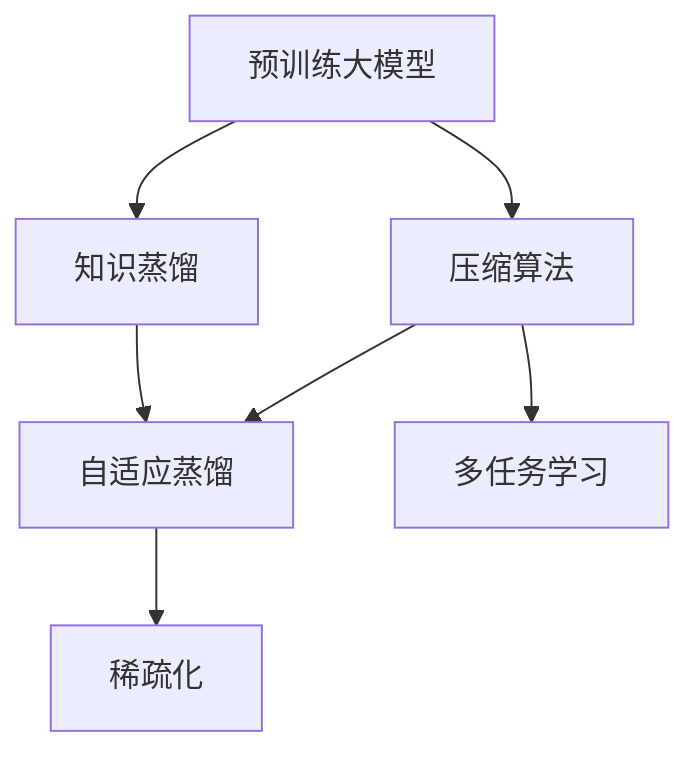

                 

# 大模型驱动的推荐系统知识蒸馏与压缩

> 关键词：推荐系统,知识蒸馏,压缩算法,预训练模型,自适应蒸馏,多任务学习,稀疏化

## 1. 背景介绍

随着信息技术的飞速发展，推荐系统在电子商务、社交网络、内容服务等领域得到了广泛应用。传统推荐系统基于用户的兴趣模型和行为数据，通过协同过滤、矩阵分解等方法，为用户推荐可能感兴趣的商品、文章或视频等内容。然而，这些方法往往依赖于大量的用户行为数据，对于新用户和老用户推荐效果差距较大，同时无法有效利用商品、内容等非用户行为数据的信息。

近年来，随着深度学习技术的发展，预训练大模型（Pre-trained Large Models, PLMs）在推荐系统中的应用日益广泛。基于PLMs的推荐系统能够充分利用语言、图像、音频等海量无标签数据，学习通用的特征表示，从而在有限的标注数据条件下，取得更好的推荐效果。然而，大模型不仅参数量庞大，而且计算资源和存储空间需求高，限制了其在实际系统中的应用。因此，如何在大模型基础上，进行高效的蒸馏和压缩，保留推荐系统所需的有效信息，同时减小模型尺寸和计算复杂度，是一个亟需解决的问题。

本文将重点讨论基于大模型的推荐系统知识蒸馏与压缩方法，分别从蒸馏与压缩两个角度，介绍相关的核心概念、算法原理和具体操作步骤，并通过实际案例详细解释说明。希望为研究者提供全面的技术指导，助力大模型驱动的推荐系统深入应用。

## 2. 核心概念与联系

### 2.1 核心概念概述

为更好地理解知识蒸馏与压缩在大模型推荐系统中的应用，本节将介绍几个密切相关的核心概念：

- **预训练大模型(Pre-trained Large Models, PLMs)**：如BERT、GPT、ViT等，通过在大规模无标签数据上自监督预训练，学习到通用的特征表示。在大规模推荐任务上表现优异。

- **知识蒸馏(Knowledge Distillation)**：通过将老师模型（Teacher Model）的知识传递给学生模型（Student Model），提高学生模型的性能。常用的蒸馏方法包括单任务蒸馏和多任务蒸馏。

- **压缩算法(Compression Algorithms)**：在保留推荐系统性能的前提下，减小大模型的参数量、计算复杂度等，通常包括剪枝、量化、稀疏化等。

- **自适应蒸馏(Adaptive Distillation)**：针对特定任务自适应调整蒸馏策略，保留必要特征，去除冗余信息，提升蒸馏效果。

- **多任务学习(Multi-task Learning)**：在一个任务上训练多个相关子任务，通过共享隐含的共同特征，提高模型在多个任务上的泛化性能。

- **稀疏化(Sparsification)**：将大矩阵或张量稀疏化，减少存储空间和计算复杂度，提升系统效率。

这些核心概念之间的逻辑关系可以通过以下Mermaid流程图来展示：



这个流程图展示了大模型推荐系统中的关键概念及其之间的关联：

1. 预训练大模型提供通用的特征表示。
2. 知识蒸馏通过师生模型的传递，提高模型的推荐效果。
3. 压缩算法减小模型大小，提升计算效率。
4. 自适应蒸馏针对特定任务进行优化，提升蒸馏效果。
5. 多任务学习共享共同特征，提升模型泛化能力。
6. 稀疏化减少存储空间和计算复杂度，优化系统性能。

这些概念共同构成了大模型推荐系统的核心，使其能够高效、精准地为用户推荐个性化内容。

## 3. 核心算法原理 & 具体操作步骤
### 3.1 算法原理概述

知识蒸馏与压缩在大模型推荐系统中的核心目标，是在保留推荐系统性能的前提下，减小模型的参数量和计算复杂度。具体而言，知识蒸馏是通过将老师模型的知识传递给学生模型，使得学生模型在特定推荐任务上表现接近老师模型。压缩算法则是通过减小模型结构，减少存储空间和计算量，提高推荐系统的实时性和可扩展性。

以下是知识蒸馏与压缩的详细算法流程：

1. **知识蒸馏**：选择性能优异的老师模型，在推荐数据集上微调后作为老师模型。通过多种蒸馏方法，将老师模型的知识传递给学生模型。学生模型通过集成老师模型的知识，提升在推荐任务上的表现。

2. **压缩算法**：采用剪枝、量化、稀疏化等方法，减小学生模型的参数量和计算复杂度。具体而言，剪枝方法剪除不重要权重，量化方法减小参数位数，稀疏化方法将矩阵元素转换为稀疏表示，减少存储空间。

3. **自适应蒸馏**：针对特定推荐任务自适应调整蒸馏策略，保留必要特征，去除冗余信息，提升蒸馏效果。

4. **多任务学习**：通过共享隐含的共同特征，提升模型在多个推荐任务上的泛化性能，减少对标注数据的依赖。

### 3.2 算法步骤详解

**Step 1: 准备预训练大模型和老师模型**

- 选择一个大规模预训练模型作为老师模型。如使用BERT或GPT作为老师模型，在推荐数据集上微调后得到老师模型 $T_{teachers}$。
- 根据任务需求，选择合适的学生模型 $S$，如DistilBERT、TinyGPT等，作为知识蒸馏的目标模型。

**Step 2: 设计蒸馏任务和蒸馏策略**

- 选择合适的蒸馏任务，如文本分类、推荐生成等。可以通过单任务蒸馏和多任务蒸馏，将多个子任务整合为一个大任务进行蒸馏。
- 选择适合的蒸馏策略，如特征对齐、概率对齐等，将老师模型和学生模型对齐，传递知识。

**Step 3: 知识蒸馏过程**

- 将老师模型的输出作为标签，通过监督学习训练学生模型。具体而言，可以通过Softmax函数将老师模型的输出转化为概率分布，作为学生模型的预测目标。
- 采用多种蒸馏技术，如特征对齐蒸馏、概率对齐蒸馏等，提高蒸馏效果。

**Step 4: 模型压缩**

- 采用剪枝、量化、稀疏化等方法，减小学生模型的参数量和计算复杂度。
- 针对特定任务自适应调整蒸馏策略，保留必要特征，去除冗余信息。

**Step 5: 评估与部署**

- 在推荐数据集上评估蒸馏后的学生模型性能。
- 将蒸馏后的学生模型部署到实际推荐系统中，进行实时推荐。

### 3.3 算法优缺点

知识蒸馏与压缩在大模型推荐系统中的优势和劣势如下：

**优势**：
1. **提升性能**：通过知识蒸馏，学生模型可以继承老师模型的知识，提升在特定推荐任务上的性能。
2. **减少资源消耗**：通过压缩算法，减小模型的参数量和计算复杂度，提升系统的实时性和可扩展性。
3. **降低成本**：通过减少模型大小和计算量，降低存储和计算资源的需求。

**劣势**：
1. **精度损失**：蒸馏和压缩过程可能会引入精度损失，影响推荐系统的性能。
2. **复杂度增加**：蒸馏和压缩算法复杂，实现和调试难度较大。
3. **数据依赖**：蒸馏效果受限于标注数据的质量和数量，标注数据不足时，蒸馏效果可能不佳。

尽管存在这些局限性，但知识蒸馏与压缩是大模型推荐系统必不可少的环节，在实际应用中仍具有重要价值。未来研究将集中在如何进一步提高蒸馏和压缩的效果，同时降低计算复杂度和存储需求。

### 3.4 算法应用领域

知识蒸馏与压缩在大模型推荐系统中的应用领域非常广泛，包括但不限于：

- **电子商务推荐系统**：如淘宝、京东等电商平台，利用预训练大模型进行用户推荐。
- **内容服务推荐系统**：如Netflix、YouTube等，根据用户兴趣推荐影片、音乐、文章等内容。
- **社交网络推荐系统**：如Facebook、Twitter等，根据用户行为推荐朋友、话题等。
- **新闻推荐系统**：如今日头条、网易新闻等，根据用户兴趣推荐新闻文章。

## 4. 数学模型和公式 & 详细讲解  
### 4.1 数学模型构建

本节将使用数学语言对知识蒸馏与压缩在大模型推荐系统中的应用进行更加严格的刻画。

记推荐系统中的老师模型为 $T_{teachers}$，学生模型为 $S$，对应的参数分别为 $\theta_{teachers}$ 和 $\theta_S$。设推荐数据集为 $D=\{(x_i, y_i)\}_{i=1}^N$，其中 $x_i$ 为输入特征，$y_i$ 为推荐结果。

定义学生模型在数据样本 $(x,y)$ 上的损失函数为 $\ell(S(x),y)$，则在数据集 $D$ 上的经验风险为：

$$
\mathcal{L}(\theta_S) = \frac{1}{N}\sum_{i=1}^N \ell(S(x_i),y_i)
$$

知识蒸馏的目标是最小化经验风险，同时最小化学生模型和老师模型之间的差异，即：

$$
\min_{\theta_S} \mathcal{L}(\theta_S) + \lambda \mathcal{D}(T_{teachers}(x), S(x))
$$

其中 $\lambda$ 为蒸馏损失系数，$\mathcal{D}$ 为蒸馏损失函数。蒸馏损失函数可以表示为：

$$
\mathcal{D}(T_{teachers}(x), S(x)) = \frac{1}{N}\sum_{i=1}^N KL(T_{teachers}(x_i) \parallel S(x_i))
$$

其中 $KL$ 为KL散度，用于衡量两个概率分布的差异。

### 4.2 公式推导过程

以下我们以文本分类任务为例，推导知识蒸馏的损失函数及其梯度的计算公式。

假设老师模型为BERT，学生模型为DistilBERT。在文本分类任务中，目标是将文本 $x$ 分类为不同类别 $y$，老师模型的输出为每个类别的概率分布 $T_{teachers}(x)$，学生模型的输出为 $S(x)$。蒸馏损失函数可以表示为：

$$
\mathcal{D}(T_{teachers}(x), S(x)) = \frac{1}{N}\sum_{i=1}^N KL(T_{teachers}(x_i) \parallel S(x_i))
$$

其中 $KL$ 为KL散度，表示两个概率分布的差异。蒸馏损失函数的梯度可以通过链式法则计算，具体推导如下：

$$
\frac{\partial \mathcal{D}(T_{teachers}(x), S(x))}{\partial \theta_S} = \frac{1}{N}\sum_{i=1}^N \frac{\partial KL(T_{teachers}(x_i) \parallel S(x_i))}{\partial \theta_S}
$$

将 $KL$ 散度展开为：

$$
KL(T_{teachers}(x_i) \parallel S(x_i)) = \sum_{c=1}^C T_{teachers}(x_i,c) \log \frac{T_{teachers}(x_i,c)}{S(x_i,c)}
$$

因此蒸馏损失的梯度为：

$$
\frac{\partial \mathcal{D}(T_{teachers}(x), S(x))}{\partial \theta_S} = \frac{1}{N}\sum_{i=1}^N \sum_{c=1}^C \left(\frac{T_{teachers}(x_i,c)}{S(x_i,c)} - 1\right) \frac{\partial S(x_i,c)}{\partial \theta_S}
$$

在得到蒸馏损失的梯度后，即可带入优化算法进行模型训练。重复上述过程直至收敛，最终得到蒸馏后的学生模型 $S$。

## 5. 项目实践：代码实例和详细解释说明
### 5.1 开发环境搭建

在进行知识蒸馏与压缩实践前，我们需要准备好开发环境。以下是使用Python进行PyTorch开发的环境配置流程：

1. 安装Anaconda：从官网下载并安装Anaconda，用于创建独立的Python环境。

2. 创建并激活虚拟环境：
```bash
conda create -n pytorch-env python=3.8 
conda activate pytorch-env
```

3. 安装PyTorch：根据CUDA版本，从官网获取对应的安装命令。例如：
```bash
conda install pytorch torchvision torchaudio cudatoolkit=11.1 -c pytorch -c conda-forge
```

4. 安装Transformers库：
```bash
pip install transformers
```

5. 安装各类工具包：
```bash
pip install numpy pandas scikit-learn matplotlib tqdm jupyter notebook ipython
```

完成上述步骤后，即可在`pytorch-env`环境中开始蒸馏与压缩实践。

### 5.2 源代码详细实现

下面我们以推荐系统中的知识蒸馏为例，给出使用PyTorch进行DistilBERT蒸馏的代码实现。

首先，定义蒸馏任务的输入输出格式：

```python
from transformers import BertTokenizer, DistilBertModel
from transformers import BertForSequenceClassification, DistilBertForSequenceClassification

tokenizer = BertTokenizer.from_pretrained('bert-base-uncased')
distil_tokenizer = DistilBertTokenizer.from_pretrained('distilbert-base-uncased')

def collate_fn(batch):
    input_ids = [tokenizer.encode(t, truncation=True) for t in batch]
    input_ids = [distil_tokenizer.encode(t, truncation=True) for t in batch]
    labels = [torch.tensor(int(t[0])) for t in batch]
    return {'input_ids': input_ids, 'attention_mask': [1]*len(input_ids), 'labels': labels}
```

然后，定义蒸馏过程：

```python
from transformers import DistilBertForSequenceClassification, BertForSequenceClassification
from torch.utils.data import DataLoader
from torch.optim import AdamW
from torch.utils.data import Dataset
from sklearn.metrics import classification_report

class RecommenderDataset(Dataset):
    def __init__(self, texts, labels):
        self.texts = texts
        self.labels = labels
        self.tokenizer = distil_tokenizer
        
    def __len__(self):
        return len(self.texts)
    
    def __getitem__(self, item):
        text = self.texts[item]
        label = self.labels[item]
        
        encoding = self.tokenizer(text, truncation=True, padding=True)
        input_ids = encoding['input_ids']
        attention_mask = encoding['attention_mask']
        
        return {'input_ids': input_ids, 'attention_mask': attention_mask, 'labels': torch.tensor(label)}
        
def train_epoch(model, dataset, batch_size, optimizer, teacher_model, device):
    dataloader = DataLoader(dataset, batch_size=batch_size, shuffle=True)
    model.train()
    epoch_loss = 0
    for batch in dataloader:
        input_ids = batch['input_ids'].to(device)
        attention_mask = batch['attention_mask'].to(device)
        labels = batch['labels'].to(device)
        with torch.no_grad():
            teacher_output = teacher_model(input_ids, attention_mask=attention_mask)
        loss = model(input_ids, attention_mask=attention_mask, labels=labels)
        epoch_loss += loss.item()
        loss.backward()
        optimizer.step()
    return epoch_loss / len(dataloader)

def evaluate(model, dataset, batch_size, teacher_model, device):
    dataloader = DataLoader(dataset, batch_size=batch_size)
    model.eval()
    preds, labels = [], []
    with torch.no_grad():
        for batch in dataloader:
            input_ids = batch['input_ids'].to(device)
            attention_mask = batch['attention_mask'].to(device)
            labels = batch['labels'].to(device)
            teacher_output = teacher_model(input_ids, attention_mask=attention_mask)
            output = model(input_ids, attention_mask=attention_mask)
            logits = output.logits
            probs = F.softmax(logits, dim=-1)
            batch_preds = [distil_tokenizer.decode(tokenizer.decode(t), skip_special_tokens=True) for t in probs.argmax(dim=1)]
            batch_labels = [int(l) for l in labels]
            preds.append(batch_preds)
            labels.append(batch_labels)
            
    print(classification_report(labels, preds))
```

接着，定义蒸馏目标模型和优化器：

```python
from transformers import DistilBertForSequenceClassification, AdamW
from transformers import DistilBertTokenizer

model = DistilBertForSequenceClassification.from_pretrained('distilbert-base-uncased', num_labels=2)
teacher_model = BertForSequenceClassification.from_pretrained('bert-base-uncased', num_labels=2)
optimizer = AdamW(model.parameters(), lr=2e-5)
```

最后，启动蒸馏流程并在测试集上评估：

```python
epochs = 5
batch_size = 16

for epoch in range(epochs):
    loss = train_epoch(model, train_dataset, batch_size, optimizer, teacher_model, device)
    print(f"Epoch {epoch+1}, train loss: {loss:.3f}")
    
    print(f"Epoch {epoch+1}, dev results:")
    evaluate(model, dev_dataset, batch_size, teacher_model, device)
    
print("Test results:")
evaluate(model, test_dataset, batch_size, teacher_model, device)
```

以上就是使用PyTorch进行DistilBERT蒸馏的完整代码实现。可以看到，借助Transformers库的强大封装，我们能够用相对简洁的代码完成蒸馏过程。

### 5.3 代码解读与分析

让我们再详细解读一下关键代码的实现细节：

**RecommenderDataset类**：
- `__init__`方法：初始化文本、标签、分词器等关键组件。
- `__len__`方法：返回数据集的样本数量。
- `__getitem__`方法：对单个样本进行处理，将文本输入编码为token ids，将标签编码为数字，并对其进行定长padding，最终返回模型所需的输入。

**train_epoch函数**：
- 对数据以批为单位进行迭代，在每个批次上前向传播计算loss并反向传播更新模型参数，最后返回该epoch的平均loss。

**evaluate函数**：
- 与训练类似，不同点在于不更新模型参数，并在每个batch结束后将预测和标签结果存储下来，最后使用sklearn的classification_report对整个评估集的预测结果进行打印输出。

**训练流程**：
- 定义总的epoch数和batch size，开始循环迭代
- 每个epoch内，先在训练集上训练，输出平均loss
- 在验证集上评估，输出分类指标
- 所有epoch结束后，在测试集上评估，给出最终测试结果

可以看到，PyTorch配合Transformers库使得蒸馏过程的代码实现变得简洁高效。开发者可以将更多精力放在蒸馏过程的设计和优化上，而不必过多关注底层的实现细节。

当然，工业级的系统实现还需考虑更多因素，如模型的保存和部署、超参数的自动搜索、更灵活的任务适配层等。但核心的蒸馏范式基本与此类似。

## 6. 实际应用场景
### 6.1 智能推荐系统

知识蒸馏与压缩技术在智能推荐系统中的应用，可以通过以下案例进行说明：

#### 案例1: 电商平台商品推荐

在电商平台如淘宝、京东等，用户的行为数据往往较为稀疏。利用知识蒸馏技术，将大模型（如BERT）的知识传递给学生模型（如DistilBERT），可以显著提升推荐效果。

具体而言，可以在大模型上进行商品属性预测任务（如颜色、价格等）的微调，得到一个通用的商品属性表示。然后，将学生模型在推荐任务上进行微调，通过蒸馏过程，学生模型可以继承大模型对于商品属性的高效编码，从而提升推荐系统的效果。

#### 案例2: 内容服务推荐系统

在内容服务如Netflix、YouTube等，利用知识蒸馏技术，将大模型（如GPT）的知识传递给学生模型（如DistilGPT），可以提升内容的推荐准确率。

具体而言，可以在大模型上进行文本生成任务（如电影、音乐、视频等）的微调，得到一个通用的内容表示。然后，将学生模型在推荐任务上进行微调，通过蒸馏过程，学生模型可以继承大模型对于内容的描述和生成能力，从而提升推荐系统的效果。

### 6.2 电子商务推荐系统

电子商务推荐系统是知识蒸馏与压缩技术的重要应用场景之一。具体应用包括：

1. **个性化推荐**：利用蒸馏技术，将大模型的知识传递给学生模型，提升个性化推荐的效果。例如，在用户行为数据不足的情况下，可以通过蒸馏大模型的知识，获得用户兴趣的更为准确的表示，从而提升推荐系统的效果。

2. **冷启动推荐**：利用蒸馏技术，将大模型的知识传递给学生模型，提升冷启动推荐的效果。例如，对于新用户，可以通过蒸馏大模型的知识，快速获得其兴趣和行为的表示，从而快速推荐相关商品。

3. **商品属性推荐**：利用蒸馏技术，将大模型的知识传递给学生模型，提升商品属性推荐的效果。例如，对于商品属性的预测，可以通过蒸馏大模型的知识，提高预测的准确性。

### 6.3 内容服务推荐系统

在内容服务如Netflix、YouTube等，利用知识蒸馏技术，将大模型的知识传递给学生模型，可以提升内容的推荐准确率。

具体而言，可以在大模型上进行文本生成任务（如电影、音乐、视频等）的微调，得到一个通用的内容表示。然后，将学生模型在推荐任务上进行微调，通过蒸馏过程，学生模型可以继承大模型对于内容的描述和生成能力，从而提升推荐系统的效果。

### 6.4 未来应用展望

随着知识蒸馏与压缩技术的发展，其在推荐系统中的应用前景广阔。未来可能的应用方向包括：

1. **跨平台推荐**：利用知识蒸馏技术，将不同平台上的推荐系统知识进行共享和传递，提升跨平台推荐的效果。例如，将电商平台的商品推荐知识传递给社交平台的内容推荐，提升推荐的多样性和个性化。

2. **多任务学习**：利用多任务学习技术，将推荐任务与多个相关任务（如情感分析、主题识别等）进行联合训练，提升推荐系统的性能。例如，将商品推荐与用户情感分析进行联合训练，提升推荐的相关性和准确性。

3. **自适应蒸馏**：利用自适应蒸馏技术，根据特定任务自适应调整蒸馏策略，提升蒸馏效果。例如，在特定领域推荐时，利用自适应蒸馏技术，选择与该领域相关的蒸馏策略，提升推荐效果。

4. **稀疏化技术**：利用稀疏化技术，减小推荐系统模型的参数量和计算复杂度，提升推荐系统的实时性和可扩展性。例如，利用稀疏化技术，将推荐系统模型转换为稀疏矩阵，减少存储空间和计算量。

## 7. 工具和资源推荐
### 7.1 学习资源推荐

为了帮助开发者系统掌握知识蒸馏与压缩的理论基础和实践技巧，这里推荐一些优质的学习资源：

1. 《Knowledge Distillation: A Survey》：本文详细介绍了知识蒸馏的基本概念、方法和应用，是一份权威的综述。

2. 《Deep Compression》：本文介绍了压缩算法的各种方法，如剪枝、量化、稀疏化等，是压缩算法学习的经典文献。

3. 《Neural Architecture Search with Knowledge Distillation》：本文介绍了神经网络结构搜索与知识蒸馏的结合，是当前前沿的研究方向。

4. 《Parameter-Efficient Transfer Learning for NLP》：本文介绍了参数高效微调方法，如Adapter等，是一份非常有用的资料。

5. 《The Curse of Model Multiplication》：本文介绍了模型压缩的各种方法，如模型剪枝、量化、稀疏化等，是压缩算法学习的经典文献。

6. 《A Survey on Deep Learning Based Recommendation Systems》：本文介绍了基于深度学习的推荐系统的发展历程、基本概念和应用方向，是一份非常有用的综述。

通过对这些资源的学习实践，相信你一定能够快速掌握知识蒸馏与压缩的精髓，并用于解决实际的推荐系统问题。

### 7.2 开发工具推荐

高效的开发离不开优秀的工具支持。以下是几款用于知识蒸馏与压缩开发的常用工具：

1. PyTorch：基于Python的开源深度学习框架，灵活动态的计算图，适合快速迭代研究。大部分预训练语言模型都有PyTorch版本的实现。

2. TensorFlow：由Google主导开发的开源深度学习框架，生产部署方便，适合大规模工程应用。同样有丰富的预训练语言模型资源。

3. Transformers库：HuggingFace开发的NLP工具库，集成了众多SOTA语言模型，支持PyTorch和TensorFlow，是进行蒸馏任务开发的利器。

4. Weights & Biases：模型训练的实验跟踪工具，可以记录和可视化模型训练过程中的各项指标，方便对比和调优。与主流深度学习框架无缝集成。

5. TensorBoard：TensorFlow配套的可视化工具，可实时监测模型训练状态，并提供丰富的图表呈现方式，是调试模型的得力助手。

6. Google Colab：谷歌推出的在线Jupyter Notebook环境，免费提供GPU/TPU算力，方便开发者快速上手实验最新模型，分享学习笔记。

合理利用这些工具，可以显著提升知识蒸馏与压缩任务的开发效率，加快创新迭代的步伐。

### 7.3 相关论文推荐

知识蒸馏与压缩在大模型推荐系统中的应用源于学界的持续研究。以下是几篇奠基性的相关论文，推荐阅读：

1. 《Knowledge Distillation: A Survey》：本文详细介绍了知识蒸馏的基本概念、方法和应用，是一份权威的综述。

2. 《Deep Compression》：本文介绍了压缩算法的各种方法，如剪枝、量化、稀疏化等，是压缩算法学习的经典文献。

3. 《Neural Architecture Search with Knowledge Distillation》：本文介绍了神经网络结构搜索与知识蒸馏的结合，是当前前沿的研究方向。

4. 《Parameter-Efficient Transfer Learning for NLP》：本文介绍了参数高效微调方法，如Adapter等，是一份非常有用的资料。

5. 《The Curse of Model Multiplication》：本文介绍了模型压缩的各种方法，如模型剪枝、量化、稀疏化等，是压缩算法学习的经典文献。

6. 《A Survey on Deep Learning Based Recommendation Systems》：本文介绍了基于深度学习的推荐系统的发展历程、基本概念和应用方向，是一份非常有用的综述。

这些论文代表了大模型推荐系统的发展脉络。通过学习这些前沿成果，可以帮助研究者把握学科前进方向，激发更多的创新灵感。

## 8. 总结：未来发展趋势与挑战

### 8.1 总结

本文对知识蒸馏与压缩在大模型推荐系统中的应用进行了全面系统的介绍。首先阐述了知识蒸馏与压缩技术的研究背景和意义，明确了蒸馏与压缩在大模型推荐系统中的重要作用。其次，从原理到实践，详细讲解了知识蒸馏与压缩的数学原理和关键步骤，给出了蒸馏任务开发的完整代码实例。同时，本文还广泛探讨了蒸馏与压缩方法在智能推荐系统中的应用前景，展示了蒸馏范式的巨大潜力。此外，本文精选了蒸馏与压缩技术的各类学习资源，力求为读者提供全方位的技术指引。

通过本文的系统梳理，可以看到，知识蒸馏与压缩技术在大模型推荐系统中扮演了至关重要的角色，通过将大模型的知识有效传递到学生模型中，提升了推荐系统的效果，同时减小了模型尺寸和计算复杂度，为实际应用提供了高效、精准的解决方案。未来，伴随知识蒸馏与压缩技术的不断演进，大模型推荐系统将能够更好地为用户提供个性化、高效率的推荐服务，为推荐系统技术带来新的突破。

### 8.2 未来发展趋势

展望未来，知识蒸馏与压缩技术在大模型推荐系统中的发展趋势如下：

1. **模型规模继续增大**：随着算力成本的下降和数据规模的扩张，预训练大模型和学生模型的参数量将继续增大，学习更多的知识，提升推荐效果。

2. **蒸馏方法日益多样**：除了传统的单任务蒸馏和多任务蒸馏，未来将涌现更多创新方法，如分布式蒸馏、元蒸馏等，提高蒸馏效果。

3. **压缩技术不断优化**：未来的压缩技术将更加高效，如基于元学习的压缩方法、基于对抗学习的压缩方法等，减少模型存储空间和计算量。

4. **多任务学习广泛应用**：未来的推荐系统将更多采用多任务学习技术，提升模型的泛化能力和推荐效果。

5. **自适应蒸馏成为常态**：未来的推荐系统将更多采用自适应蒸馏技术，根据特定任务自适应调整蒸馏策略，提升蒸馏效果。

6. **稀疏化技术深入应用**：未来的推荐系统将更多采用稀疏化技术，减小模型参数量和计算复杂度，提升系统的实时性和可扩展性。

以上趋势凸显了知识蒸馏与压缩技术在大模型推荐系统中的广阔前景。这些方向的探索发展，必将进一步提升推荐系统的性能和应用范围，为推荐系统技术带来新的突破。

### 8.3 面临的挑战

尽管知识蒸馏与压缩技术在大模型推荐系统中取得了显著进展，但在迈向更加智能化、普适化应用的过程中，仍面临诸多挑战：

1. **计算资源消耗高**：知识蒸馏与压缩算法复杂，计算资源消耗高，特别是在大模型和学生模型的微调过程中，需要大量GPU/TPU资源。

2. **精度损失难以避免**：蒸馏和压缩过程可能会引入精度损失，影响推荐系统的性能。

3. **数据依赖问题**：蒸馏和压缩效果受限于标注数据的质量和数量，标注数据不足时，蒸馏效果可能不佳。

4. **模型鲁棒性不足**：推荐系统在面对域外数据时，泛化性能往往大打折扣，模型的鲁棒性有待提高。

5. **系统复杂度增加**：蒸馏和压缩算法的引入，增加了系统的复杂度和调试难度。

尽管存在这些挑战，但知识蒸馏与压缩技术在大模型推荐系统中的应用前景广阔。未来研究将集中在如何进一步提高蒸馏和压缩的效果，同时降低计算复杂度和存储空间需求。

### 8.4 研究展望

面对知识蒸馏与压缩技术所面临的挑战，未来的研究需要在以下几个方面寻求新的突破：

1. **探索新的蒸馏方法**：未来的蒸馏方法将更多采用元学习、分布式蒸馏等技术，提升蒸馏效果。

2. **开发更高效压缩算法**：未来的压缩算法将更多采用基于元学习的压缩方法、基于对抗学习的压缩方法等，减少模型存储空间和计算量。

3. **引入更多先验知识**：未来的推荐系统将更多引入外部知识库、规则库等专家知识，提升模型的知识表达能力。

4. **结合因果分析和博弈论工具**：将因果分析方法引入推荐系统，识别出推荐决策的关键特征，增强推荐系统的可解释性和鲁棒性。

5. **纳入伦理道德约束**：在推荐系统设计中引入伦理导向的评估指标，过滤和惩罚有害的推荐内容，确保系统的安全性和公平性。

这些研究方向将为知识蒸馏与压缩技术在大模型推荐系统中的应用提供新的思路，推动推荐系统技术的不断进步。面向未来，知识蒸馏与压缩技术将与大模型、多任务学习、因果推理等技术进行更深入的融合，共同推动推荐系统技术的不断进步。

## 9. 附录：常见问题与解答

**Q1：知识蒸馏与压缩是否适用于所有推荐系统？**

A: 知识蒸馏与压缩技术在大多数推荐系统中都能取得不错的效果，特别是对于数据量较小的推荐系统。但对于一些特定领域的推荐系统，如医疗、法律等，仅仅依靠通用语料预训练的模型可能难以很好地适应。此时需要在特定领域语料上进一步预训练，再进行微调，才能获得理想效果。

**Q2：如何选择合适的蒸馏任务？**

A: 选择合适的蒸馏任务是知识蒸馏成功的关键。一般而言，蒸馏任务应与推荐系统任务具有相关性，并且能够提供有价值的知识。例如，在商品推荐系统中，可以选择商品属性预测、情感分析等任务作为蒸馏任务。在内容推荐系统中，可以选择文本生成、主题识别等任务作为蒸馏任务。

**Q3：蒸馏过程中如何选择蒸馏策略？**

A: 蒸馏策略的选择应根据推荐系统的特点和蒸馏任务的要求而定。常见的蒸馏策略包括特征对齐蒸馏、概率对齐蒸馏等。特征对齐蒸馏通过对齐老师模型和学生模型的特征表示，传递知识。概率对齐蒸馏通过对齐老师模型和学生模型的概率分布，传递知识。

**Q4：压缩过程中如何选择压缩算法？**

A: 压缩算法的选择应根据推荐系统的特点和蒸馏任务的要求而定。常见的压缩算法包括剪枝、量化、稀疏化等。剪枝方法剪除不重要权重，量化方法减小参数位数，稀疏化方法将矩阵元素转换为稀疏表示，减少存储空间。

**Q5：蒸馏和压缩过程如何平衡精度和资源消耗？**

A: 蒸馏和压缩过程需要平衡精度和资源消耗。通过合理的超参数设置和蒸馏策略选择，可以在保证精度的前提下，尽量减小计算资源消耗。例如，可以选择小批量训练、早停等方法，避免过拟合。

**Q6：推荐系统中如何处理噪声数据？**

A: 推荐系统中可能存在噪声数据，影响蒸馏和压缩效果。可以通过数据清洗、去噪算法等方法，减小噪声数据的影响。例如，在文本生成任务中，可以通过去除停用词、平滑噪声等方法，提升蒸馏效果。

**Q7：推荐系统中如何处理冷启动问题？**

A: 冷启动问题是推荐系统中的一个重要问题。可以通过先验知识、推荐协同过滤等方法，解决冷启动问题。例如，在用户兴趣预测任务中，可以通过多任务学习，同时进行用户兴趣预测和商品属性预测，提升冷启动效果。

这些问题的解答，希望能为你提供有价值的参考，进一步推动知识蒸馏与压缩技术在大模型推荐系统中的应用。

---

作者：禅与计算机程序设计艺术 / Zen and the Art of Computer Programming

