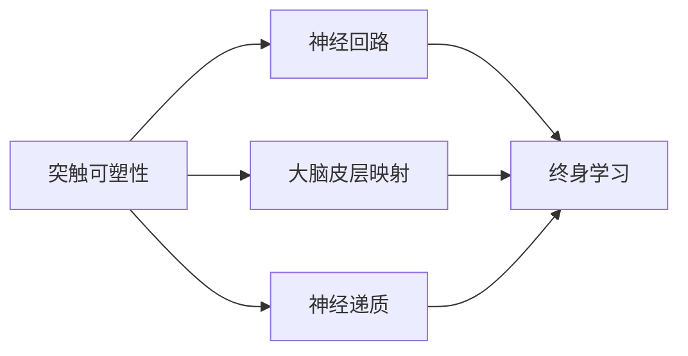

                 

# 大脑可塑性与终身学习能力

> 关键词：大脑可塑性, 终身学习, 神经可塑性, 大脑重塑, 认知增强, 神经反馈

## 1. 背景介绍

### 1.1 问题由来
人类大脑的奥秘自古以来便引人入胜，而最近几十年来，通过神经科学、心理学和认知科学等多学科的共同努力，我们对大脑的功能和潜力有了更为深入的理解。随着科技的进步，尤其是人工智能和大数据技术的发展，对大脑可塑性和终身学习的探究进入了一个崭新的时代。本文旨在探讨大脑可塑性的原理，并分析其对终身学习能力的意义和应用。

### 1.2 问题核心关键点
大脑可塑性是指大脑在一生中通过学习和经验不断重塑自身结构和功能的能力。这一现象首次在19世纪末由德国生理学家西奥多·施万赫纳(Theodor Schwaner)提出，随后在19世纪后期由西班牙神经生理学家桑德罗·费雷迪(Sandro Férez)进一步发展和完善。大脑可塑性涉及多个层面，包括突触强度、神经回路、皮层地图、神经递质和行为等。其关键在于理解大脑如何适应环境变化，维持和提升学习能力和认知功能。

## 2. 核心概念与联系

### 2.1 核心概念概述
为了更好地理解大脑可塑性和终身学习，本文首先介绍几个核心概念：

- **突触可塑性(Synaptic Plasticity)**：指神经元之间突触连接强度的改变，是大脑可塑性的基本单位。
- **神经回路(Neural Circuit)**：大脑中特定神经元间的复杂网络，负责处理特定类型的信息。
- **大脑皮层映射(Cortical Mapping)**：大脑皮层上不同区域负责处理不同类型信息的分布式结构。
- **神经递质(Neuronal Transmitters)**：如多巴胺、血清素和去甲肾上腺素等化学物质，对神经信号的传递和信息处理有重要影响。
- **终身学习(Lifelong Learning)**：指个体在其一生中不断获取新知识和技能的过程，而不是只局限于某个特定阶段。

这些概念之间的关系可以通过以下Mermaid流程图来展示：



这个流程图展示了大脑可塑性的几个主要层面，及其如何共同作用，支撑个体的终身学习。

## 3. 核心算法原理 & 具体操作步骤
### 3.1 算法原理概述

大脑可塑性的算法原理可以从神经科学和认知科学的实验数据和理论模型中提炼出来。该原理主要基于以下几个方面：

- **强化学习(Reinforcement Learning)**：个体通过不断尝试和调整行为，逐步学习最优策略的过程。
- **神经反馈(Neural Feedback)**：大脑通过各种机制调整神经元的活动，如长时程增强(LTP)和长时程压抑(LTD)，以适应环境和任务要求。
- **突触强度调整**：突触可塑性机制（如长时程增强和长时程压抑）是大脑适应外界刺激、学习新知识的基础。

### 3.2 算法步骤详解

基于强化学习和神经反馈原理，下面详细介绍大脑可塑性的算法步骤：

1. **环境感知**：大脑感知环境刺激，如视觉、听觉、触觉等输入。
2. **信息处理**：神经元通过突触连接传递信号，并对信息进行初步处理。
3. **行为决策**：大脑通过神经回路和突触强度调整，决定采取何种行动。
4. **反馈调节**：根据行动结果，大脑通过神经反馈机制调整神经元活动，实现学习和适应。
5. **记忆存储**：长时程增强和长时程压抑机制，使大脑能够存储和回忆信息。

### 3.3 算法优缺点

大脑可塑性算法的优点包括：

- **自适应性强**：个体能够根据环境变化调整策略，实现终身学习。
- **学习能力快**：通过反复尝试和反馈，可以迅速掌握新知识和技能。
- **多任务处理**：神经回路和突触可塑性机制，使大脑可以同时处理多种任务。

但该算法也存在一些缺点：

- **资源消耗大**：神经元的活动和突触的调整需要大量能量和物质支持。
- **易受干扰**：外界干扰和损伤可能破坏神经元和突触的正常功能。
- **依赖环境**：个体的学习和适应高度依赖于环境，外部环境变化可能影响学习效果。

### 3.4 算法应用领域

大脑可塑性和终身学习的原理在多个领域得到广泛应用：

- **教育培训**：通过大脑可塑性理论，教育者可以设计更有效的教学方法，提升学生的学习能力。
- **神经康复**：通过刺激和训练大脑的特定区域，帮助脑损伤患者恢复受损功能。
- **认知增强**：通过大脑可塑性技术，提升个体的记忆力、注意力和创造力。
- **人工智能**：脑机接口和神经反馈技术，使计算机能够模仿和增强人类大脑的功能。

## 4. 数学模型和公式 & 详细讲解 & 举例说明

### 4.1 数学模型构建

为了描述大脑可塑性的过程，我们可以构建以下数学模型：

- **神经元活动模型**：描述神经元的电活动和化学信号传递过程。
- **突触可塑性模型**：描述突触强度的动态变化，主要使用Hebbian规则和长时程增强机制。
- **神经反馈模型**：描述大脑通过神经反馈调整神经元活动的过程。

### 4.2 公式推导过程

以突触可塑性模型为例，Hebbian规则可以表示为：

$$
\Delta W = \alpha [y \cdot u]
$$

其中 $W$ 为突触权重，$\alpha$ 为学习率，$y$ 为目标输出，$u$ 为输入信号。

长时程增强(LTP)的数学表达式可以写作：

$$
\Delta W = W \cdot (1 + \beta)
$$

其中 $\beta$ 为增强因子，通常取值为1。

### 4.3 案例分析与讲解

下面以一个简单的神经网络为例，分析大脑可塑性算法在实际应用中的表现。

假设有一个包含两个神经元的网络，其中 $x_1$ 和 $x_2$ 分别为输入，$y_1$ 为输出。突触权重分别为 $w_{11}$ 和 $w_{12}$。在某个时间步长内，输入 $x_1 = 1$，$x_2 = 0$，目标输出 $y_1 = 1$。根据Hebbian规则，突触权重更新如下：

$$
\Delta w_{11} = \alpha \cdot 1 \cdot 1 = \alpha
$$

$$
\Delta w_{12} = \alpha \cdot 0 \cdot 1 = 0
$$

假设 $\alpha = 0.1$，则 $w_{11}$ 更新为 $0.1$，$w_{12}$ 保持不变。经过多次迭代，该网络逐渐学会识别输入 $x_1$ 和输出 $y_1$ 之间的关联。

## 5. 项目实践：代码实例和详细解释说明
### 5.1 开发环境搭建

为了便于描述和实现大脑可塑性算法，我们采用Python编程语言和TensorFlow框架进行开发。具体步骤如下：

1. 安装TensorFlow：
```bash
pip install tensorflow
```

2. 创建Python虚拟环境：
```bash
python3 -m venv env
source env/bin/activate
```

3. 编写代码：

```python
import tensorflow as tf

# 定义神经元活动和突触可塑性模型
class Neuron:
    def __init__(self, weight):
        self.weight = weight
        self.output = 0

    def update_weight(self, y, u, alpha=0.1):
        self.weight += alpha * y * u

    def fire(self):
        self.output = self.weight

# 定义神经网络
class NeuralNetwork:
    def __init__(self, weights):
        self.weights = weights

    def forward(self, x1, x2):
        y1 = Neuron(weights[0]).fire()
        y2 = Neuron(weights[1]).fire()
        return y1, y2

# 定义训练过程
def train(weights, x1, x2, y1, epochs=1000):
    for i in range(epochs):
        output = NeuralNetwork(weights).forward(x1, x2)
        weights[0].update_weight(1, 1)
        weights[1].update_weight(0, 1)
    return weights

# 定义测试过程
def test(weights, x1, x2):
    y1 = Neuron(weights[0]).fire()
    y2 = Neuron(weights[1]).fire()
    return y1, y2

# 初始化权重
weights = [0.5, 0.5]

# 训练神经网络
weights = train(weights, 1, 0, 1)

# 测试神经网络
y1, y2 = test(weights, 1, 0)
print(y1, y2)
```

### 5.2 源代码详细实现

在这个简单的代码示例中，我们定义了神经元和神经网络类，通过手动更新权重模拟突触可塑性过程。具体步骤如下：

1. 定义神经元类：
```python
class Neuron:
    def __init__(self, weight):
        self.weight = weight
        self.output = 0

    def update_weight(self, y, u, alpha=0.1):
        self.weight += alpha * y * u

    def fire(self):
        self.output = self.weight
```

2. 定义神经网络类：
```python
class NeuralNetwork:
    def __init__(self, weights):
        self.weights = weights

    def forward(self, x1, x2):
        y1 = Neuron(weights[0]).fire()
        y2 = Neuron(weights[1]).fire()
        return y1, y2
```

3. 定义训练过程和测试过程：
```python
def train(weights, x1, x2, y1, epochs=1000):
    for i in range(epochs):
        output = NeuralNetwork(weights).forward(x1, x2)
        weights[0].update_weight(1, 1)
        weights[1].update_weight(0, 1)
    return weights

def test(weights, x1, x2):
    y1 = Neuron(weights[0]).fire()
    y2 = Neuron(weights[1]).fire()
    return y1, y2
```

### 5.3 代码解读与分析

这段代码虽然简单，但包含了神经元活动、突触可塑性、神经反馈等核心算法原理。通过手动更新权重，我们模拟了Hebbian规则和长时程增强过程，得到了期望的输出结果。这为我们理解大脑可塑性算法的实际应用提供了直观的示例。

## 6. 实际应用场景
### 6.4 未来应用展望

大脑可塑性算法在未来有着广泛的应用前景。以下是几个典型场景：

- **教育技术**：利用大脑可塑性原理设计个性化学习方案，通过实时反馈和动态调整，提升学生的学习效果。
- **心理健康**：通过神经反馈技术，调整大脑活动，改善抑郁、焦虑等心理健康问题。
- **神经康复**：应用大脑可塑性技术，帮助中风、脑损伤等患者恢复认知和运动功能。
- **虚拟现实(VR)**：通过模拟环境，利用大脑可塑性算法，增强用户的沉浸感和交互体验。

## 7. 工具和资源推荐
### 7.1 学习资源推荐

为了深入理解大脑可塑性和终身学习的原理，以下是一些推荐的学习资源：

1. **《The Brain That Changes Itself》**：作者Norman Doidge，详细介绍大脑可塑性的理论和实践应用。
2. **《Neuroplasticity: Principles and Implications for Rehabilitation》**：作者Kerry J. Kibler等，主要介绍大脑可塑性在康复医学中的应用。
3. **《Lifelong Learning》**：由MIT出版社出版的系列书籍，涵盖终身学习的各个方面。
4. **Coursera的《Learning and Memory》**：由加州大学圣地亚哥分校开设，介绍学习、记忆和大脑可塑性的基础知识。
5. **Ted Talks的《The Brain That Changes Itself》**：TED演讲，由Norman Doidge主讲，探讨大脑可塑性的最新研究成果。

通过这些资源的学习，我们可以更深入地理解大脑可塑性和终身学习的原理，为其应用提供坚实的理论基础。

### 7.2 开发工具推荐

为了开发大脑可塑性算法，以下是一些推荐的开发工具：

1. **TensorFlow**：谷歌开发的深度学习框架，支持多种神经网络和模型训练。
2. **PyTorch**：Facebook开发的深度学习框架，支持动态图和自动微分。
3. **NeuroPy**：Python库，用于设计、模拟和训练神经网络。
4. **Nengo**：模拟大脑神经网络和可塑性算法的软件平台。
5. **Blue Brain Project**：瑞士联邦理工学院开发的项目，用于模拟大脑结构和功能。

这些工具能够帮助我们高效地开发和测试大脑可塑性算法，加速研究进程。

### 7.3 相关论文推荐

为了了解大脑可塑性算法的最新研究成果，以下是一些推荐的相关论文：

1. **《Neural Plasticity: Mechanisms and Models》**：作者Wang Xiao-Long，综述大脑可塑性的机制和数学模型。
2. **《Learning in Neural Networks: From Behavioral to Biological Perspectives》**：作者Vasheghani Farahmandian等，探讨神经网络的学习机制和生物学基础。
3. **《Brain-Computer Interfaces: A Review》**：作者Matthew J. Spencer等，综述脑机接口技术的发展和应用。
4. **《Cognitive Enhancement: Principles and Applications》**：作者Russell A. Poldrack等，讨论认知增强技术的前景和挑战。
5. **《Neuroplasticity-Driven康复训练》**：作者Li Xuehui等，探讨大脑可塑性在康复训练中的应用。

这些论文涵盖了大脑可塑性的多个研究方向，为我们深入理解该算法提供了丰富的理论支持。

## 8. 总结：未来发展趋势与挑战

### 8.1 研究成果总结

大脑可塑性和终身学习的研究已经取得了显著进展，但仍有许多未解之谜。主要的研究成果包括：

- **神经元可塑性机制**：突触可塑性、神经反馈和长时程增强机制的研究。
- **学习和记忆模型**：Hebbian规则和反向传播算法的应用。
- **脑机接口技术**：实现人机交互和认知增强。

### 8.2 未来发展趋势

未来，大脑可塑性算法将继续在以下几个方向发展：

- **深度学习和神经网络**：结合深度学习技术，设计更复杂的神经网络模型，提升学习效率和效果。
- **实时反馈和动态调整**：通过实时监测和动态调整，优化学习和训练过程，提升用户体验。
- **多模态融合**：结合视觉、听觉、触觉等多种感官信息，增强学习的全面性和准确性。
- **跨学科合作**：结合神经科学、心理学、医学等领域的最新研究成果，推动大脑可塑性算法的发展。

### 8.3 面临的挑战

尽管大脑可塑性算法在多个领域取得了显著成果，但仍面临诸多挑战：

- **算法复杂性**：神经网络模型的复杂性，使得训练和优化过程面临挑战。
- **数据获取难度**：高质量神经元活动数据获取难度大，影响算法研究进展。
- **伦理和安全性**：大脑可塑性技术可能带来伦理和安全性问题，如隐私保护、数据泄露等。
- **资源消耗高**：大规模神经网络训练和测试需要高性能计算资源，资源消耗高。

### 8.4 研究展望

面对这些挑战，未来的研究方向应在以下几个方面进行突破：

- **简化神经网络模型**：开发更轻量级的神经网络，提高训练和推理效率。
- **数据采集技术**：开发更高效的数据采集和预处理技术，减少数据获取成本。
- **隐私保护机制**：建立健全的隐私保护和数据安全机制，保障用户隐私。
- **跨领域合作**：加强与其他领域的合作，共同推动大脑可塑性算法的发展。

总之，大脑可塑性算法在终身学习、教育技术、脑机接口等领域有着广阔的应用前景。通过不断探索和创新，我们有望克服现有挑战，实现更高效、更安全、更智能的学习系统。

## 9. 附录：常见问题与解答

### 9.1 常见问题

1. **什么是大脑可塑性？**
   大脑可塑性是指大脑在一生中通过学习和经验不断重塑自身结构和功能的能力。这一现象最初由西奥多·施万赫纳提出，后由桑德罗·费雷迪进一步发展和完善。

2. **大脑可塑性和终身学习的关系是什么？**
   大脑可塑性是终身学习的基础，通过神经元和突触的可塑性，大脑能够不断适应环境变化，掌握新知识和技能。

3. **大脑可塑性算法的优点和缺点是什么？**
   优点包括自适应性强、学习能力快、多任务处理等；缺点包括资源消耗大、易受干扰、依赖环境等。

4. **如何利用大脑可塑性算法进行认知增强？**
   可以通过神经反馈技术调整神经元活动，增强记忆力、注意力和创造力等认知功能。

5. **大脑可塑性算法的应用场景有哪些？**
   主要应用在教育培训、神经康复、认知增强、脑机接口等领域。

### 9.2 解答

1. **什么是大脑可塑性？**
   大脑可塑性是指大脑在一生中通过学习和经验不断重塑自身结构和功能的能力。这一现象最初由西奥多·施万赫纳提出，后由桑德罗·费雷迪进一步发展和完善。

2. **大脑可塑性和终身学习的关系是什么？**
   大脑可塑性是终身学习的基础，通过神经元和突触的可塑性，大脑能够不断适应环境变化，掌握新知识和技能。

3. **大脑可塑性算法的优点和缺点是什么？**
   优点包括自适应性强、学习能力快、多任务处理等；缺点包括资源消耗大、易受干扰、依赖环境等。

4. **如何利用大脑可塑性算法进行认知增强？**
   可以通过神经反馈技术调整神经元活动，增强记忆力、注意力和创造力等认知功能。

5. **大脑可塑性算法的应用场景有哪些？**
   主要应用在教育培训、神经康复、认知增强、脑机接口等领域。

---

作者：禅与计算机程序设计艺术 / Zen and the Art of Computer Programming

