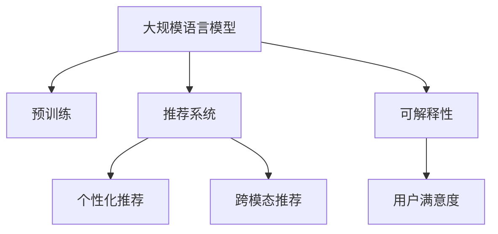

                 

# 大规模语言模型在产品推荐中的应用

## 1. 背景介绍

### 1.1 问题由来
随着电商平台的兴起和用户消费习惯的改变，个性化推荐系统成为了提高用户体验和交易转化率的重要手段。然而，传统基于协同过滤等方法的推荐系统，存在数据稀疏性、扩展性不足等问题，难以应对大规模商品和用户数据。因此，基于深度学习的大规模语言模型在推荐系统中的应用，成为了当前研究的热点方向。

近年来，随着预训练语言模型的快速发展，如BERT、GPT等，推荐系统也逐步开始引入这些模型，利用其强大的语义理解和生成能力，构建新的推荐范式。特别是在个性化推荐任务上，大规模语言模型因其能够挖掘用户兴趣和商品语义特征，从而实现跨领域、多模态的推荐，具有显著的优势。

### 1.2 问题核心关键点
基于大规模语言模型的推荐系统，利用模型在预训练过程中学习到的语义知识，对用户和商品进行向量表示，进而实现相似度计算和推荐排序。核心关键点包括：

- 用户兴趣建模：通过自然语言处理技术，将用户行为数据转化为语义向量，利用语言模型学习用户的兴趣偏好。
- 商品特征提取：对商品描述、标签等信息进行文本处理，提取出与用户兴趣相关的语义特征。
- 相似度计算：通过对比用户和商品的语义向量，计算它们的相似度，找出最符合用户兴趣的商品。
- 推荐排序：将相似度得分作为排序依据，生成个性化的商品推荐列表。

基于这些关键点，大规模语言模型在推荐系统中的应用，已广泛应用于电商平台、新闻阅读、音乐娱乐等多个领域。

### 1.3 问题研究意义
研究大规模语言模型在推荐系统中的应用，对于提升推荐系统的个性化、可扩展性和泛化能力，具有重要意义：

1. 提高推荐精度：大规模语言模型能够捕捉更为丰富的语义信息，增强用户兴趣和商品语义特征的表达能力，从而提高推荐的准确性和相关性。
2. 拓展推荐范围：语言模型可以处理多种数据类型，包括文本、图像、音频等，提供跨模态的推荐服务，丰富推荐内容。
3. 增强推荐灵活性：语言模型能够根据用户输入的文字描述，动态生成推荐内容，提升用户体验和满意度。
4. 降低推荐成本：大规模预训练模型可以大幅减少推荐系统训练和调优所需的时间与成本，加速产品迭代。
5. 促进推荐创新：基于语言模型的推荐系统具有更强的可解释性和可操作性，易于构建和优化，为推荐技术的发展提供新的思路和方向。

## 2. 核心概念与联系

### 2.1 核心概念概述

为更好地理解基于大规模语言模型的推荐系统，本节将介绍几个核心概念：

- 大规模语言模型(Large Language Model, LLM)：以BERT、GPT等模型为代表的，在大型语料库上预训练的语言模型，具有强大的语义理解和生成能力。
- 预训练(Pre-training)：指在大规模无标签文本语料上进行自监督学习任务，学习通用的语言表示，为推荐系统提供基础特征。
- 推荐系统(Recommendation System)：通过用户历史行为数据，利用机器学习算法生成个性化的商品推荐列表，提高用户体验和销售额的系统。
- 个性化推荐(Personalized Recommendation)：根据用户个性化需求，提供针对性的商品推荐，提升用户满意度和购买转化率。
- 跨模态推荐(Cross-modal Recommendation)：结合文本、图像、音频等多种数据类型，提升推荐系统的泛化能力和用户覆盖率。
- 可解释性(Interpretability)：推荐系统生成的推荐结果，应具有可解释性，便于用户理解和信任。
- 用户满意度(User Satisfaction)：推荐系统应提升用户的使用体验，增加用户粘性和忠诚度。

这些核心概念之间的逻辑关系可以通过以下Mermaid流程图来展示：



这个流程图展示了基于大规模语言模型的推荐系统的主要组成：

1. 大规模语言模型通过预训练获得语言知识。
2. 推荐系统利用语言模型的语义向量表示，计算用户和商品的相似度。
3. 个性化推荐系统针对单个用户生成个性化推荐列表。
4. 跨模态推荐系统整合多种数据类型，提升推荐效果。
5. 可解释性确保推荐结果易于理解，提升用户信任感。
6. 用户满意度反映用户对推荐结果的满意程度，驱动推荐系统的优化。

这些概念共同构成了推荐系统的框架，使得语言模型在大规模数据上的语义学习能力得以充分发挥，从而提升推荐系统的效果。

## 3. 核心算法原理 & 具体操作步骤
### 3.1 算法原理概述

基于大规模语言模型的推荐系统，其核心算法基于监督学习和非监督学习的混合范式。首先，通过预训练获得语言的通用表示；然后，在推荐系统框架内，利用监督学习的任务进行微调，使模型能够更准确地预测用户的兴趣和行为。

具体而言，对于用户 $u$ 和商品 $i$，首先通过语言模型获得用户兴趣向量 $\mathbf{u}=\mathbf{u}(\text{input}_u)$ 和商品特征向量 $\mathbf{i}=\mathbf{i}(\text{input}_i)$。然后，计算二者的相似度 $\text{sim}(u,i) = \mathbf{u} \cdot \mathbf{i}$，根据相似度排序，生成个性化推荐列表。

### 3.2 算法步骤详解

基于大规模语言模型的推荐系统主要包括以下几个关键步骤：

**Step 1: 准备数据集**
- 收集用户历史行为数据，如浏览记录、点击记录、购买记录等。
- 收集商品相关数据，如商品描述、标签、图片等。
- 对数据进行预处理，包括文本清洗、分词、标准化等。

**Step 2: 预训练语言模型**
- 选择合适的预训练语言模型，如BERT、GPT等，并进行微调。
- 利用大规模无标签文本语料对语言模型进行预训练，学习通用的语言表示。

**Step 3: 推荐系统架构设计**
- 设计推荐系统的整体架构，包括用户兴趣建模、商品特征提取、相似度计算和推荐排序等组件。
- 选择合适的相似度计算方法，如余弦相似度、点积相似度等。

**Step 4: 微调推荐模型**
- 在推荐系统架构内，利用用户行为数据对语言模型进行微调，学习用户兴趣和商品特征。
- 使用交叉熵损失等方法，优化模型的预测精度。
- 应用正则化技术，如L2正则、Dropout等，避免过拟合。

**Step 5: 评估和部署**
- 在验证集上评估微调后的推荐模型，对比与基线模型的性能提升。
- 部署模型到生产环境，实时生成个性化推荐列表。
- 定期更新模型参数，保持推荐系统的性能和时效性。

以上是基于大规模语言模型的推荐系统的基本流程。在实际应用中，还需要根据具体任务和数据特点，进一步优化和调整。

### 3.3 算法优缺点

基于大规模语言模型的推荐系统具有以下优点：
1. 强大的语义理解能力：通过大规模语言模型的预训练，推荐系统能够捕捉更丰富的语义信息，提升推荐效果。
2. 跨模态处理能力：语言模型可以处理多种数据类型，丰富推荐系统的数据来源。
3. 可解释性强：利用自然语言处理技术，推荐系统生成的推荐结果易于理解，便于用户信任。
4. 泛化能力强：语言模型的泛化能力较强，可以适应不同领域和不同数据分布的推荐任务。

同时，该方法也存在一些局限性：
1. 数据要求高：推荐系统依赖大规模标注数据，对数据质量和数量有较高要求。
2. 计算资源消耗大：大规模语言模型的参数量较大，对计算资源的需求较高。
3. 对抗性脆弱：基于语言模型的推荐系统对输入的攻击和噪声敏感，可能会受到恶意操作的影响。
4. 公平性问题：预训练模型可能会学习到数据中的偏见，导致推荐结果的不公平性。

尽管存在这些局限性，但基于大规模语言模型的推荐系统仍然是一种非常有潜力的技术，为推荐系统的发展带来了新的突破。

### 3.4 算法应用领域

基于大规模语言模型的推荐系统，在电商、新闻、音乐等多个领域中得到了广泛的应用。以下是几个典型的应用场景：

**电商平台推荐**
- 收集用户浏览、点击、购买记录，提取用户兴趣和商品描述信息。
- 使用语言模型对用户和商品进行向量表示，计算相似度。
- 生成个性化推荐列表，提高用户转化率。

**新闻推荐**
- 收集用户阅读历史、收藏文章记录，提取用户兴趣和文章标题、摘要信息。
- 使用语言模型对用户和文章进行向量表示，计算相似度。
- 生成个性化新闻推荐，提升用户阅读体验。

**音乐推荐**
- 收集用户收听历史、评分记录，提取用户兴趣和歌曲描述信息。
- 使用语言模型对用户和歌曲进行向量表示，计算相似度。
- 生成个性化音乐推荐，丰富用户音乐体验。

此外，基于大规模语言模型的推荐系统还在视频推荐、旅游推荐、广告推荐等多个领域中发挥作用，为不同行业的数字化转型提供了新的解决方案。

## 4. 数学模型和公式 & 详细讲解 & 举例说明

### 4.1 数学模型构建

在推荐系统中，语言模型用于将用户和商品转化为向量表示，计算它们之间的相似度。数学模型如下：

设用户 $u$ 的历史行为数据为 $D_u$，商品 $i$ 的特征向量为 $\mathbf{i}$，则用户兴趣向量 $\mathbf{u}$ 和商品特征向量 $\mathbf{i}$ 的计算方式如下：

$$
\mathbf{u} = \text{BERT}(D_u)
$$

$$
\mathbf{i} = \text{BERT}(\text{input}_i)
$$

其中，$\text{BERT}$ 表示使用预训练的BERT模型进行编码。

用户 $u$ 和商品 $i$ 之间的相似度 $sim(u,i)$ 计算如下：

$$
sim(u,i) = \mathbf{u} \cdot \mathbf{i}
$$

### 4.2 公式推导过程

在计算相似度时，我们通常使用余弦相似度或点积相似度，因为它们能够保留向量的方向信息。下面以点积相似度为例，进行公式推导。

点积相似度的计算公式为：

$$
sim(u,i) = \frac{\mathbf{u} \cdot \mathbf{i}}{\|\mathbf{u}\|\|\mathbf{i}\|}
$$

其中，$\|\mathbf{u}\|$ 和 $\|\mathbf{i}\|$ 分别表示用户兴趣向量和商品特征向量的范数。

根据点积的定义，$\mathbf{u} \cdot \mathbf{i}$ 表示向量 $\mathbf{u}$ 和 $\mathbf{i}$ 的点积，即：

$$
\mathbf{u} \cdot \mathbf{i} = \sum_{j=1}^{n} u_j i_j
$$

其中 $n$ 表示向量的维度。

因此，点积相似度的公式可以进一步化简为：

$$
sim(u,i) = \frac{\sum_{j=1}^{n} u_j i_j}{\sqrt{\sum_{j=1}^{n} u_j^2} \sqrt{\sum_{j=1}^{n} i_j^2}}
$$

这个公式展示了用户兴趣向量 $\mathbf{u}$ 和商品特征向量 $\mathbf{i}$ 之间的相似度计算方式，可以用于生成推荐列表。

### 4.3 案例分析与讲解

以电商平台推荐为例，假设用户 $u$ 对商品 $i_1$、$i_2$、$i_3$ 进行过浏览和购买，对应的商品特征向量为 $\mathbf{i}_1$、$\mathbf{i}_2$、$\mathbf{i}_3$。则用户兴趣向量 $\mathbf{u}$ 的计算如下：

$$
\mathbf{u} = \text{BERT}(D_u) = \text{BERT}(\{\text{item1}, \text{item2}, \text{item3}\})
$$

假设商品 $i$ 的特征向量为 $\mathbf{i}$，则用户 $u$ 和商品 $i$ 之间的相似度 $sim(u,i)$ 计算如下：

$$
sim(u,i) = \frac{\mathbf{u} \cdot \mathbf{i}}{\|\mathbf{u}\|\|\mathbf{i}\|}
$$

如果 $sim(u,i) > \text{threshold}$，则将商品 $i$ 加入推荐列表，其中 $\text{threshold}$ 为预设的相似度阈值。

## 5. 项目实践：代码实例和详细解释说明

### 5.1 开发环境搭建

在进行推荐系统实践前，我们需要准备好开发环境。以下是使用Python进行PyTorch开发的环境配置流程：

1. 安装Anaconda：从官网下载并安装Anaconda，用于创建独立的Python环境。

2. 创建并激活虚拟环境：
```bash
conda create -n pytorch-env python=3.8 
conda activate pytorch-env
```

3. 安装PyTorch：根据CUDA版本，从官网获取对应的安装命令。例如：
```bash
conda install pytorch torchvision torchaudio cudatoolkit=11.1 -c pytorch -c conda-forge
```

4. 安装HuggingFace Transformers库：
```bash
pip install transformers
```

5. 安装各类工具包：
```bash
pip install numpy pandas scikit-learn matplotlib tqdm jupyter notebook ipython
```

完成上述步骤后，即可在`pytorch-env`环境中开始推荐系统实践。

### 5.2 源代码详细实现

我们以电商平台推荐为例，给出使用Transformers库对BERT模型进行推荐系统开发的PyTorch代码实现。

首先，定义推荐任务的数据处理函数：

```python
from transformers import BertTokenizer
from torch.utils.data import Dataset
import torch

class RecommendationDataset(Dataset):
    def __init__(self, user_ids, item_ids, item_features, tokenizer, max_len=128):
        self.user_ids = user_ids
        self.item_ids = item_ids
        self.item_features = item_features
        self.tokenizer = tokenizer
        self.max_len = max_len
        
    def __len__(self):
        return len(self.user_ids)
    
    def __getitem__(self, item):
        user_id = self.user_ids[item]
        item_id = self.item_ids[item]
        item_feature = self.item_features[item]
        
        encoding = self.tokenizer(item_feature, return_tensors='pt', max_length=self.max_len, padding='max_length', truncation=True)
        input_ids = encoding['input_ids'][0]
        attention_mask = encoding['attention_mask'][0]
        
        user_input = f"User ID: {user_id} Item ID: {item_id}"
        user_encoding = self.tokenizer(user_input, return_tensors='pt', max_length=self.max_len, padding='max_length', truncation=True)
        user_input_ids = user_encoding['input_ids'][0]
        user_attention_mask = user_encoding['attention_mask'][0]
        
        return {
            'user_input_ids': user_input_ids,
            'user_attention_mask': user_attention_mask,
            'item_input_ids': input_ids,
            'item_attention_mask': attention_mask
        }

# 构建推荐数据集
tokenizer = BertTokenizer.from_pretrained('bert-base-cased')

train_dataset = RecommendationDataset(train_user_ids, train_item_ids, train_item_features, tokenizer)
dev_dataset = RecommendationDataset(dev_user_ids, dev_item_ids, dev_item_features, tokenizer)
test_dataset = RecommendationDataset(test_user_ids, test_item_ids, test_item_features, tokenizer)
```

然后，定义模型和优化器：

```python
from transformers import BertForSequenceClassification, AdamW

model = BertForSequenceClassification.from_pretrained('bert-base-cased', num_labels=2)

optimizer = AdamW(model.parameters(), lr=2e-5)
```

接着，定义训练和评估函数：

```python
from torch.utils.data import DataLoader
from tqdm import tqdm
from sklearn.metrics import precision_recall_fscore_support

device = torch.device('cuda') if torch.cuda.is_available() else torch.device('cpu')
model.to(device)

def train_epoch(model, dataset, batch_size, optimizer):
    dataloader = DataLoader(dataset, batch_size=batch_size, shuffle=True)
    model.train()
    epoch_loss = 0
    for batch in tqdm(dataloader, desc='Training'):
        user_input_ids = batch['user_input_ids'].to(device)
        user_attention_mask = batch['user_attention_mask'].to(device)
        item_input_ids = batch['item_input_ids'].to(device)
        item_attention_mask = batch['item_attention_mask'].to(device)
        labels = torch.tensor([1] * batch_size)  # 假设用户对商品感兴趣，标签为1
        model.zero_grad()
        outputs = model(user_input_ids, user_attention_mask=user_attention_mask, item_input_ids=item_input_ids, item_attention_mask=item_attention_mask)
        loss = outputs.loss
        epoch_loss += loss.item()
        loss.backward()
        optimizer.step()
    return epoch_loss / len(dataloader)

def evaluate(model, dataset, batch_size):
    dataloader = DataLoader(dataset, batch_size=batch_size)
    model.eval()
    preds, labels = [], []
    with torch.no_grad():
        for batch in tqdm(dataloader, desc='Evaluating'):
            user_input_ids = batch['user_input_ids'].to(device)
            user_attention_mask = batch['user_attention_mask'].to(device)
            item_input_ids = batch['item_input_ids'].to(device)
            item_attention_mask = batch['item_attention_mask'].to(device)
            batch_labels = batch['labels'].to(device)
            outputs = model(user_input_ids, user_attention_mask=user_attention_mask, item_input_ids=item_input_ids, item_attention_mask=item_attention_mask)
            batch_preds = outputs.logits.argmax(dim=1).to('cpu').tolist()
            batch_labels = batch_labels.to('cpu').tolist()
            for pred, label in zip(batch_preds, batch_labels):
                preds.append(pred)
                labels.append(label)
                
    precision, recall, f1, _ = precision_recall_fscore_support(labels, preds, average='binary')
    print(f"Precision: {precision:.3f}, Recall: {recall:.3f}, F1 Score: {f1:.3f}")
```

最后，启动训练流程并在测试集上评估：

```python
epochs = 5
batch_size = 16

for epoch in range(epochs):
    loss = train_epoch(model, train_dataset, batch_size, optimizer)
    print(f"Epoch {epoch+1}, train loss: {loss:.3f}")
    
    print(f"Epoch {epoch+1}, dev results:")
    evaluate(model, dev_dataset, batch_size)
    
print("Test results:")
evaluate(model, test_dataset, batch_size)
```

以上就是使用PyTorch对BERT进行推荐系统开发的完整代码实现。可以看到，得益于Transformers库的强大封装，我们可以用相对简洁的代码完成BERT模型的加载和推荐系统训练。

### 5.3 代码解读与分析

让我们再详细解读一下关键代码的实现细节：

**RecommendationDataset类**：
- `__init__`方法：初始化用户ID、商品ID、商品特征等关键组件。
- `__len__`方法：返回数据集的样本数量。
- `__getitem__`方法：对单个样本进行处理，将商品描述和用户行为描述编码为token ids，并对其进行定长padding，最终返回模型所需的输入。

**模型训练和评估函数**：
- 使用PyTorch的DataLoader对数据集进行批次化加载，供模型训练和推理使用。
- 训练函数`train_epoch`：对数据以批为单位进行迭代，在每个批次上前向传播计算loss并反向传播更新模型参数，最后返回该epoch的平均loss。
- 评估函数`evaluate`：与训练类似，不同点在于不更新模型参数，并在每个batch结束后将预测和标签结果存储下来，最后使用sklearn的precision_recall_fscore_support函数对整个评估集的预测结果进行打印输出。

**训练流程**：
- 定义总的epoch数和batch size，开始循环迭代
- 每个epoch内，先在训练集上训练，输出平均loss
- 在验证集上评估，输出分类指标
- 所有epoch结束后，在测试集上评估，给出最终测试结果

可以看到，PyTorch配合Transformers库使得BERT推荐系统的代码实现变得简洁高效。开发者可以将更多精力放在数据处理、模型改进等高层逻辑上，而不必过多关注底层的实现细节。

当然，工业级的系统实现还需考虑更多因素，如模型的保存和部署、超参数的自动搜索、更灵活的任务适配层等。但核心的推荐范式基本与此类似。

## 6. 实际应用场景

### 6.1 电商平台推荐

基于大规模语言模型的推荐系统，广泛应用于电商平台，用于个性化推荐商品。传统电商推荐系统依赖协同过滤等方法，存在数据稀疏性、扩展性不足等问题，难以应对大规模商品和用户数据。而基于大规模语言模型的推荐系统，能够利用模型在预训练过程中学习到的语义知识，对用户和商品进行向量表示，从而提高推荐精度和个性化程度。

例如，某电商平台收集用户浏览、点击、购买记录，提取用户兴趣和商品描述信息。使用语言模型对用户和商品进行向量表示，计算相似度。生成个性化推荐列表，提高用户转化率。

### 6.2 新闻推荐

新闻推荐系统基于用户的阅读历史和行为数据，推荐用户感兴趣的新闻。通过大规模语言模型，可以对用户和文章进行向量表示，计算相似度，生成个性化新闻推荐。

例如，某新闻平台收集用户阅读历史、收藏文章记录，提取用户兴趣和文章标题、摘要信息。使用语言模型对用户和文章进行向量表示，计算相似度。生成个性化新闻推荐，提升用户阅读体验。

### 6.3 音乐推荐

音乐推荐系统通过用户收听历史和评分数据，推荐用户喜欢的音乐。使用语言模型对用户和歌曲进行向量表示，计算相似度，生成个性化音乐推荐。

例如，某音乐平台收集用户收听历史、评分记录，提取用户兴趣和歌曲描述信息。使用语言模型对用户和歌曲进行向量表示，计算相似度。生成个性化音乐推荐，丰富用户音乐体验。

### 6.4 未来应用展望

随着大规模语言模型和推荐系统的不断发展，未来的推荐系统将呈现以下几个趋势：

1. 个性化推荐将更加精准：大规模语言模型能够捕捉更为丰富的语义信息，增强用户兴趣和商品语义特征的表达能力，从而提高推荐的准确性和相关性。
2. 推荐系统将更加跨模态：语言模型可以处理多种数据类型，如文本、图像、音频等，丰富推荐系统的数据来源。
3. 推荐系统将更具可解释性：利用自然语言处理技术，推荐系统生成的推荐结果易于理解，便于用户信任。
4. 推荐系统将更具公平性：通过引入对抗性训练等技术，减少推荐结果的偏见和不公平性。
5. 推荐系统将更具安全性：通过引入加密技术，保护用户隐私和数据安全。

以上趋势凸显了基于大规模语言模型的推荐系统的广阔前景。这些方向的探索发展，必将进一步提升推荐系统的性能和应用范围，为不同行业的数字化转型提供新的解决方案。

## 7. 工具和资源推荐

### 7.1 学习资源推荐

为了帮助开发者系统掌握基于大规模语言模型的推荐系统的理论基础和实践技巧，这里推荐一些优质的学习资源：

1. 《推荐系统理论与算法》：推荐系统领域的经典书籍，详细介绍了推荐算法的基本原理和应用。
2. 《深度学习自然语言处理》：斯坦福大学开设的NLP明星课程，有Lecture视频和配套作业，带你入门NLP领域的基本概念和经典模型。
3. 《Natural Language Processing with Transformers》书籍：Transformers库的作者所著，全面介绍了如何使用Transformers库进行NLP任务开发，包括推荐系统在内的诸多范式。
4. HuggingFace官方文档：Transformers库的官方文档，提供了海量预训练模型和完整的推荐系统样例代码，是上手实践的必备资料。
5. Kaggle推荐系统竞赛：参加Kaggle的推荐系统竞赛，实战练习，提升推荐系统开发能力。

通过对这些资源的学习实践，相信你一定能够快速掌握基于大规模语言模型的推荐系统的精髓，并用于解决实际的推荐问题。

### 7.2 开发工具推荐

高效的开发离不开优秀的工具支持。以下是几款用于推荐系统开发的常用工具：

1. PyTorch：基于Python的开源深度学习框架，灵活动态的计算图，适合快速迭代研究。推荐系统的主流实现语言。
2. TensorFlow：由Google主导开发的开源深度学习框架，生产部署方便，适合大规模工程应用。推荐系统的主流实现语言。
3. Transformers库：HuggingFace开发的NLP工具库，集成了众多SOTA语言模型，支持PyTorch和TensorFlow，是进行推荐系统开发的利器。
4. Weights & Biases：模型训练的实验跟踪工具，可以记录和可视化模型训练过程中的各项指标，方便对比和调优。与主流深度学习框架无缝集成。
5. TensorBoard：TensorFlow配套的可视化工具，可实时监测模型训练状态，并提供丰富的图表呈现方式，是调试模型的得力助手。
6. Apache Spark：大数据处理框架，能够高效处理大规模推荐数据。

合理利用这些工具，可以显著提升推荐系统的开发效率，加快创新迭代的步伐。

### 7.3 相关论文推荐

推荐系统的研究和应用不断发展，相关论文也层出不穷。以下是几篇奠基性的相关论文，推荐阅读：

1. "Recommender Systems: A Survey"：推荐系统领域的经典综述论文，总结了推荐算法的基本原理和应用。
2. "Adaptive sparse collaborative filtering"：提出了基于稀疏矩阵分解的推荐算法，优化了协同过滤模型的扩展性。
3. "Deep Collaborative Filtering via Tensor Factorization"：提出使用Tensor分解的推荐算法，提高了推荐模型的泛化能力。
4. "Cascaded Adaboost for Recommendation"：提出级联Adaboost的推荐算法，提升了推荐模型的准确性和效率。
5. "Multi-view collaborative filtering for recommendation"：提出多视角协同过滤的推荐算法，利用多种数据源提高推荐效果。

这些论文代表了大规模语言模型和推荐系统的研究进展，值得深入阅读和研究。

## 8. 总结：未来发展趋势与挑战

### 8.1 总结

本文对基于大规模语言模型的推荐系统进行了全面系统的介绍。首先阐述了推荐系统的研究背景和意义，明确了推荐系统在大数据和人工智能时代的地位和价值。其次，从原理到实践，详细讲解了基于大规模语言模型的推荐系统的核心算法和关键步骤，给出了推荐系统开发的完整代码实例。同时，本文还广泛探讨了推荐系统在电商平台、新闻、音乐等多个领域的应用前景，展示了推荐系统的发展方向。

通过本文的系统梳理，可以看到，基于大规模语言模型的推荐系统为推荐系统的发展带来了新的突破。推荐系统能够更好地捕捉用户的个性化需求，利用语义信息进行跨领域推荐，从而提升用户的满意度。未来，推荐系统将继续发展，提供更加丰富、个性化、可解释的推荐服务，推动数字经济的繁荣。

### 8.2 未来发展趋势

展望未来，基于大规模语言模型的推荐系统将呈现以下几个发展趋势：

1. 个性化推荐将更加精准：大规模语言模型能够捕捉更为丰富的语义信息，增强用户兴趣和商品语义特征的表达能力，从而提高推荐的准确性和相关性。
2. 推荐系统将更加跨模态：语言模型可以处理多种数据类型，如文本、图像、音频等，丰富推荐系统的数据来源。
3. 推荐系统将更具可解释性：利用自然语言处理技术，推荐系统生成的推荐结果易于理解，便于用户信任。
4. 推荐系统将更具公平性：通过引入对抗性训练等技术，减少推荐结果的偏见和不公平性。
5. 推荐系统将更具安全性：通过引入加密技术，保护用户隐私和数据安全。

以上趋势凸显了基于大规模语言模型的推荐系统的广阔前景。这些方向的探索发展，必将进一步提升推荐系统的性能和应用范围，为不同行业的数字化转型提供新的解决方案。

### 8.3 面临的挑战

尽管基于大规模语言模型的推荐系统已经取得了瞩目成就，但在迈向更加智能化、普适化应用的过程中，它仍面临诸多挑战：

1. 数据质量要求高：推荐系统依赖大规模标注数据，对数据质量和数量有较高要求。如何获取高质量、大规模的推荐数据，是一个重要问题。
2. 计算资源消耗大：大规模语言模型的参数量较大，对计算资源的需求较高。如何优化模型结构，减少计算资源消耗，是一个技术难题。
3. 对抗性脆弱：基于语言模型的推荐系统对输入的攻击和噪声敏感，可能会受到恶意操作的影响。如何提升模型的鲁棒性，是一个需要解决的问题。
4. 公平性问题：预训练模型可能会学习到数据中的偏见，导致推荐结果的不公平性。如何避免推荐结果的偏见，是一个值得关注的问题。
5. 安全性问题：推荐系统生成的推荐结果，可能包含有害内容，对用户产生负面影响。如何保障推荐内容的安全性，是一个需要考虑的问题。

尽管存在这些挑战，但基于大规模语言模型的推荐系统仍然是一种非常有潜力的技术，为推荐系统的发展带来了新的突破。未来，需要进一步优化推荐算法、优化模型结构、提升模型鲁棒性、保障数据安全等方面，方能构建更加安全、可靠、高效、公平的推荐系统。

### 8.4 研究展望

未来，基于大规模语言模型的推荐系统还需要在以下几个方面寻求新的突破：

1. 探索无监督和半监督推荐方法。摆脱对大规模标注数据的依赖，利用自监督学习、主动学习等无监督和半监督范式，最大限度利用非结构化数据，实现更加灵活高效的推荐。
2. 研究参数高效和计算高效的推荐范式。开发更加参数高效的推荐方法，在固定大部分预训练参数的情况下，只更新极少量的任务相关参数。同时优化推荐模型的计算图，减少前向传播和反向传播的资源消耗，实现更加轻量级、实时性的部署。
3. 引入因果和对比学习范式。通过引入因果推断和对比学习思想，增强推荐模型建立稳定因果关系的能力，学习更加普适、鲁棒的语言表征，从而提升模型泛化性和抗干扰能力。
4. 融合多模态数据。推荐系统能够处理多种数据类型，如文本、图像、音频等，通过多模态信息的融合，提升推荐效果。
5. 增强推荐系统的可解释性。推荐系统生成的推荐结果，应具有可解释性，便于用户理解和信任。可以通过自然语言处理技术，生成推荐理由，增强推荐系统的可解释性。

这些研究方向的探索，必将引领基于大规模语言模型的推荐系统技术迈向更高的台阶，为构建安全、可靠、高效、公平的智能推荐系统提供新的解决方案。

## 9. 附录：常见问题与解答

**Q1：大规模语言模型在推荐系统中的应用，是否需要额外的标注数据？**

A: 大规模语言模型在推荐系统中的应用，通常需要少量的标注数据用于微调。这些标注数据可以是用户的浏览历史、评分记录、收藏行为等。标注数据的质量和数量对推荐模型的效果有很大影响，需要仔细收集和处理。

**Q2：大规模语言模型在推荐系统中，是否需要经常更新？**

A: 大规模语言模型在推荐系统中，一般需要定期更新。随着用户的兴趣和行为数据不断变化，模型需要持续学习新数据，才能保持推荐效果的稳定性和准确性。通常每几个月或每季度进行一次模型更新。

**Q3：大规模语言模型在推荐系统中，如何进行超参数调优？**

A: 大规模语言模型在推荐系统中，通常需要进行超参数调优，以获得最优的推荐效果。超参数包括学习率、批大小、迭代轮数、正则化系数等。一般采用网格搜索或贝叶斯优化等方法进行调优。此外，还可以利用自动化调参工具，如Hyperopt、Ray Tune等，加速超参数调优过程。

**Q4：大规模语言模型在推荐系统中，如何处理多模态数据？**

A: 大规模语言模型在推荐系统中，可以处理多模态数据，如文本、图像、音频等。处理多模态数据的常用方法包括特征提取、特征融合、多任务学习等。例如，可以提取商品图片的关键特征，并将其与商品描述信息融合，作为用户兴趣的输入。

**Q5：大规模语言模型在推荐系统中，如何进行模型压缩？**

A: 大规模语言模型在推荐系统中，由于参数量较大，对计算资源的需求较高。为了减少计算资源的消耗，可以进行模型压缩。常用的方法包括剪枝、量化、知识蒸馏等。例如，可以使用剪枝技术去除冗余的参数，保留重要部分；或使用量化技术将浮点模型转为定点模型，减少计算和存储的开销。

---

作者：禅与计算机程序设计艺术 / Zen and the Art of Computer Programming

