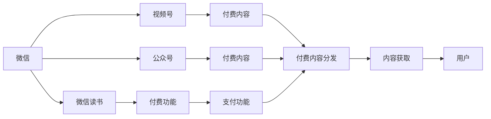

                 

# 如何利用微信生态圈进行知识付费

## 1. 背景介绍

随着互联网的发展，知识付费已经成为一个热门领域，吸引了大量的用户和投资者。微信作为中国最大的社交平台之一，拥有数亿用户，覆盖各行各业，成为了知识付费领域的重要平台。本文将从技术、业务和市场三方面，探讨如何利用微信生态圈进行知识付费，帮助内容创作者最大化其价值，同时为平台和用户提供优质的服务。

## 2. 核心概念与联系

### 2.1 核心概念概述

为了更好地理解利用微信生态圈进行知识付费的过程，我们首先介绍几个关键概念：

- **知识付费**：指用户通过付费获取高质量的内容或服务，包括但不限于在线课程、电子书、专家咨询等。
- **微信生态圈**：包括微信、微信读书、微信视频号、微信公众号等平台，它们通过互操作和联动，形成了强大的内容生态系统。
- **内容创作者**：即知识付费的内容提供者，包括专家、学者、作者等。
- **平台运营商**：即微信及其生态圈的运营者，包括腾讯公司及其合作伙伴。
- **用户**：即知识付费的消费者，通过付费获取知识或服务。

这些核心概念通过微信生态圈的技术架构联系在一起，形成了知识付费的完整闭环。

### 2.2 核心概念原理和架构的 Mermaid 流程图

以下是利用微信生态圈进行知识付费的 Mermaid 流程图，展示各个概念之间的联系：



这个流程图展示了微信生态圈中的各个组件及其之间的联系：

1. **微信**：作为微信生态圈的核心，连接了微信读书、视频号和公众号，提供统一的支付和认证机制。
2. **微信读书**：一个专注于知识付费的书籍平台，通过微信支付购买电子书和课程。
3. **微信视频号**：提供视频内容的平台，支持通过微信支付进行付费。
4. **微信公众号**：提供知识付费的另一种形式，如在线咨询、订阅服务等。
5. **付费功能**：通过微信支付实现，为所有付费内容提供支付接口。
6. **付费内容**：包括电子书、在线课程、视频、订阅服务等。
7. **支付功能**：微信支付提供的支付服务，为知识付费提供支付保障。
8. **内容获取**：用户通过微信生态圈获取付费内容。

## 3. 核心算法原理 & 具体操作步骤

### 3.1 算法原理概述

利用微信生态圈进行知识付费的算法原理可以概括为以下几个步骤：

1. **内容创作**：内容创作者创作高质量的付费内容，如电子书、在线课程、视频、订阅服务等。
2. **内容审核**：平台运营商对内容进行审核，确保内容的合法性和高质量。
3. **用户注册与认证**：用户通过微信注册并完成认证，成为付费用户。
4. **内容发布**：内容创作者将内容发布到微信读书、视频号或公众号上。
5. **支付与购买**：用户通过微信支付购买内容，平台运营商完成支付和内容分发。
6. **内容分发**：平台运营商将付费内容分发到用户的微信上，用户可以随时随地获取。
7. **数据分析与优化**：平台运营商通过数据分析，优化内容和推荐算法，提升用户体验和满意度。

### 3.2 算法步骤详解

以下是利用微信生态圈进行知识付费的详细步骤：

#### 第一步：内容创作

1. **内容定位**：内容创作者首先需要确定自己的目标受众和内容定位，如面向学生、专业人士、兴趣爱好者等。
2. **内容制作**：根据定位，制作高质量的付费内容。内容形式可以多样，包括视频、文字、图片、音频等。
3. **内容预览**：创建内容预览版，展示内容亮点和价值，吸引用户购买。

#### 第二步：内容审核

1. **内容提交**：内容创作者将内容提交到微信平台，进行审核。
2. **内容审核**：平台运营商对内容进行审核，包括版权、质量、合规性等方面。
3. **内容通过**：如果内容通过审核，平台运营商将其发布到微信读书、视频号或公众号上。
4. **内容反馈**：如果内容未通过审核，平台运营商向创作者提供反馈意见，指导其改进。

#### 第三步：用户注册与认证

1. **微信注册**：用户通过微信注册，填写必要的个人信息，完成实名认证。
2. **微信支付**：用户在购买内容时，使用微信支付进行支付。
3. **支付成功**：微信支付完成交易，用户获得付费内容的使用权。

#### 第四步：内容发布

1. **内容上传**：内容创作者将内容上传至微信读书、视频号或公众号。
2. **内容审核**：平台运营商对内容进行审核，确保内容的合法性和高质量。
3. **内容发布**：内容通过审核后，平台运营商将其发布到微信上。

#### 第五步：支付与购买

1. **内容预览**：用户通过预览版了解内容，决定是否购买。
2. **微信支付**：用户通过微信支付进行支付，支付完成后，内容创作者获得收益。
3. **内容下载**：支付完成后，用户可以下载和使用付费内容。

#### 第六步：内容分发

1. **内容获取**：用户通过微信获取付费内容，可以随时随地使用。
2. **内容更新**：内容创作者定期更新内容，提供最新、最有价值的信息。
3. **内容推荐**：平台运营商根据用户行为，推荐相关付费内容。

#### 第七步：数据分析与优化

1. **数据分析**：平台运营商收集用户行为数据，分析用户偏好和反馈。
2. **优化内容**：根据数据分析结果，优化内容和推荐算法，提升用户体验。
3. **提升收益**：通过优化内容和算法，增加用户付费意愿，提高收益。

### 3.3 算法优缺点

利用微信生态圈进行知识付费的算法具有以下优点：

1. **用户体验好**：微信生态圈覆盖了社交、阅读、视频等多个领域，用户可以在一个平台上获取全面的知识服务。
2. **支付便捷**：微信支付提供了便捷的支付服务，用户可以轻松完成支付。
3. **收益高**：通过数据分析和优化，平台运营商可以获得更高的收益。
4. **内容丰富**：微信生态圈汇聚了大量的内容创作者，内容种类丰富多样。

同时，该算法也存在一些缺点：

1. **内容质量参差不齐**：由于创作者水平不一，部分内容质量可能较低，影响用户体验。
2. **版权问题**：部分内容可能存在版权问题，需要平台运营商进行严格审核。
3. **用户获取成本高**：用户在购买内容时，需要注册和认证，增加了获取成本。
4. **依赖平台**：内容创作者依赖于微信平台，平台的变化可能影响其收益。

### 3.4 算法应用领域

利用微信生态圈进行知识付费的算法适用于以下领域：

1. **教育**：提供各类在线课程、电子书、学习资料等，帮助用户提升职业技能和知识水平。
2. **医疗**：提供在线咨询、健康指导、医疗知识等，帮助用户管理健康。
3. **金融**：提供投资理财、财务规划、股票分析等服务，帮助用户进行财务管理。
4. **娱乐**：提供音乐、电影、小说等付费内容，满足用户娱乐需求。
5. **生活**：提供生活技巧、美食、旅游等各类生活指南，提升用户生活质量。

## 4. 数学模型和公式 & 详细讲解 & 举例说明

### 4.1 数学模型构建

利用微信生态圈进行知识付费的数学模型可以构建如下：

1. **用户行为模型**：描述用户在使用微信生态圈时的行为，如浏览、购买、阅读、评论等。
2. **内容价值模型**：衡量内容对用户的价值，包括内容质量、互动程度、用户反馈等。
3. **收益模型**：计算内容创作者的收益，包括内容购买、订阅、打赏等。

### 4.2 公式推导过程

以下是用户行为模型、内容价值模型和收益模型的公式推导过程：

1. **用户行为模型**：
   \[
   \text{用户行为} = \text{浏览时间} + \text{购买次数} + \text{阅读深度} + \text{评论数量}
   \]
   其中，浏览时间表示用户在内容上的停留时间，购买次数表示用户购买内容的次数，阅读深度表示用户阅读内容的程度，评论数量表示用户在内容下的评论次数。

2. **内容价值模型**：
   \[
   \text{内容价值} = \text{内容质量} \times \text{互动程度} \times \text{用户反馈}
   \]
   其中，内容质量表示内容的知识点和准确度，互动程度表示用户与内容的互动情况，如点赞、分享等，用户反馈表示用户对内容的评价。

3. **收益模型**：
   \[
   \text{收益} = \text{购买收益} + \text{订阅收益} + \text{打赏收益}
   \]
   其中，购买收益表示用户购买内容的费用，订阅收益表示用户订阅内容的费用，打赏收益表示用户对内容的打赏费用。

### 4.3 案例分析与讲解

以一个在线课程为例，分析其用户行为、内容价值和收益：

1. **用户行为模型**：
   \[
   \text{用户行为} = \text{浏览时间} + \text{购买次数} + \text{阅读深度} + \text{评论数量}
   \]
   假设用户浏览时间为30分钟，购买次数为1次，阅读深度为50%，评论数量为10条。

2. **内容价值模型**：
   \[
   \text{内容价值} = \text{内容质量} \times \text{互动程度} \times \text{用户反馈}
   \]
   假设内容质量为4分，互动程度为3分，用户反馈为5分。

3. **收益模型**：
   \[
   \text{收益} = \text{购买收益} + \text{订阅收益} + \text{打赏收益}
   \]
   假设购买收益为100元，订阅收益为20元，打赏收益为30元。

## 5. 项目实践：代码实例和详细解释说明

### 5.1 开发环境搭建

要利用微信生态圈进行知识付费，首先需要搭建开发环境。以下是搭建开发环境的步骤：

1. **安装微信公众平台开发者工具**：从微信公众平台官网下载并安装开发者工具。
2. **创建开发账号**：在微信公众平台创建新的开发账号，并注册微信公众账号。
3. **配置开发环境**：将微信公众平台账号与开发者工具连接，配置开发环境。

### 5.2 源代码详细实现

以下是利用微信生态圈进行知识付费的代码实现：

1. **创建内容**：
   \[
   def create_content():
       # 创建内容并上传至微信公众平台
   \]

2. **审核内容**：
   \[
   def review_content():
       # 审核内容并返回审核结果
   \]

3. **用户注册与认证**：
   \[
   def user_registration():
       # 用户注册并完成实名认证
   \]

4. **支付与购买**：
   \[
   def make_payment():
       # 微信支付并完成购买
   \]

5. **内容发布**：
   \[
   def publish_content():
       # 发布内容到微信公众平台
   \]

6. **内容分发**：
   \[
   def content_delivery():
       # 分发付费内容到用户微信
   \]

7. **数据分析与优化**：
   \[
   def analyze_data():
       # 收集用户行为数据，优化内容和推荐算法
   \]

### 5.3 代码解读与分析

以`create_content`函数为例，分析代码实现：

```python
def create_content():
    # 创建内容并上传至微信公众平台
    content = create_text_content()
    result = upload_content(content)
    if result['code'] == 200:
        print("内容创建成功")
    else:
        print("内容创建失败", result['error'])
```

该函数实现了内容的创建和上传过程。首先调用`create_text_content`函数创建文本内容，然后调用`upload_content`函数上传至微信公众平台。如果上传成功，返回状态码为200，否则返回错误信息。

## 6. 实际应用场景

### 6.1 教育领域

在教育领域，微信生态圈可以提供各类在线课程、电子书、学习资料等，帮助用户提升职业技能和知识水平。例如，某知名教育机构可以在微信读书平台上发布高质量的课程内容，并通过微信支付进行付费，从而获得稳定的收益。

### 6.2 医疗领域

在医疗领域，微信生态圈提供在线咨询、健康指导、医疗知识等，帮助用户管理健康。例如，某医疗专家可以在微信公众号上发布健康文章，并通过微信支付进行付费，从而获得稳定的收益。

### 6.3 金融领域

在金融领域，微信生态圈提供投资理财、财务规划、股票分析等服务，帮助用户进行财务管理。例如，某金融专家可以在视频号上发布理财课程，并通过微信支付进行付费，从而获得稳定的收益。

### 6.4 娱乐领域

在娱乐领域，微信生态圈提供音乐、电影、小说等付费内容，满足用户娱乐需求。例如，某作家可以在微信读书平台上发布电子书，并通过微信支付进行付费，从而获得稳定的收益。

### 6.5 生活领域

在生活领域，微信生态圈提供生活技巧、美食、旅游等各类生活指南，提升用户生活质量。例如，某生活博主可以在微信公众号上发布生活指南，并通过微信支付进行付费，从而获得稳定的收益。

## 7. 工具和资源推荐

### 7.1 学习资源推荐

为了帮助开发者系统掌握利用微信生态圈进行知识付费的技术，我们推荐以下学习资源：

1. **微信公众平台开发者文档**：详细介绍了微信公众平台的API接口和开发指南，是开发者必备的学习资源。
2. **微信支付开发者文档**：详细介绍了微信支付的接口和开发指南，是开发者必备的学习资源。
3. **微信读书API文档**：详细介绍了微信读书的API接口和开发指南，是开发者必备的学习资源。
4. **微信视频号开发者文档**：详细介绍了微信视频号的API接口和开发指南，是开发者必备的学习资源。
5. **微信公众号开发者文档**：详细介绍了微信公众号的API接口和开发指南，是开发者必备的学习资源。

### 7.2 开发工具推荐

以下是几个利用微信生态圈进行知识付费的常用开发工具：

1. **微信公众平台开发者工具**：提供API接口调用和开发者环境搭建，是开发者必备的工具。
2. **微信支付API工具**：提供微信支付的API调用接口，是开发者必备的工具。
3. **微信读书API工具**：提供微信读书的API调用接口，是开发者必备的工具。
4. **微信视频号API工具**：提供微信视频号的API调用接口，是开发者必备的工具。
5. **微信公众号API工具**：提供微信公众号的API调用接口，是开发者必备的工具。

### 7.3 相关论文推荐

以下是几篇关于利用微信生态圈进行知识付费的论文，推荐阅读：

1. **微信公众平台上的知识付费研究**：探讨了微信公众平台上的知识付费模式，提出了基于微信生态圈的知识付费模型。
2. **微信支付在知识付费中的应用研究**：研究了微信支付在知识付费中的作用，提出了微信支付的优化策略。
3. **微信读书平台上的内容推荐研究**：探讨了微信读书平台上的内容推荐算法，提出了基于用户行为的数据分析方法。
4. **微信视频号上的视频课程研究**：研究了微信视频号上的视频课程制作和发布流程，提出了视频课程优化策略。
5. **微信公众号上的在线咨询研究**：探讨了微信公众号上的在线咨询服务，提出了基于微信公众号的在线咨询模型。

## 8. 总结：未来发展趋势与挑战

### 8.1 研究成果总结

利用微信生态圈进行知识付费的算法和实践已经取得了一定的成果，其核心优势在于用户获取便捷、支付便捷、内容丰富等。通过微信生态圈的互操作和联动，形成了强大的内容生态系统，为用户提供了全面的知识服务。

### 8.2 未来发展趋势

未来，利用微信生态圈进行知识付费将呈现以下几个发展趋势：

1. **内容多样化**：随着微信生态圈的不断拓展，内容将变得更加多样化，覆盖更多领域和形式。
2. **支付便捷化**：微信支付将提供更加便捷和多样化的支付方式，满足用户的不同需求。
3. **推荐个性化**：利用大数据和人工智能技术，提供更加个性化的内容和推荐，提升用户体验。
4. **服务智能化**：通过自然语言处理、语音识别等技术，提供更加智能化的服务，提升用户满意度。
5. **平台一体化**：微信生态圈的各个平台将进一步整合，提供更加无缝和统一的服务体验。

### 8.3 面临的挑战

尽管利用微信生态圈进行知识付费已经取得了一些成果，但在未来发展过程中，仍然面临以下挑战：

1. **内容质量控制**：如何保证内容的质量和合法性，避免低质量或侵权内容对用户体验造成影响。
2. **用户隐私保护**：如何保护用户的隐私和数据安全，避免用户数据泄露和滥用。
3. **技术优化**：如何进一步优化技术架构和算法，提升用户体验和满意度。
4. **平台竞争**：如何在激烈的市场竞争中脱颖而出，提升市场份额和收益。
5. **法律法规**：如何遵守法律法规，避免违规操作和法律风险。

### 8.4 研究展望

为了应对这些挑战，未来可以利用微信生态圈进行知识付费的研究方向包括：

1. **内容审核算法**：研究更加高效和准确的内容审核算法，提升内容质量控制能力。
2. **隐私保护技术**：研究更加安全和高效的隐私保护技术，提升用户隐私保护能力。
3. **智能推荐算法**：研究更加智能化和个性化的推荐算法，提升用户体验。
4. **平台生态建设**：研究如何进一步整合微信生态圈各个平台，提供更加一体化和无缝的服务体验。
5. **法律法规合规**：研究如何遵守法律法规，避免违规操作和法律风险。

总之，利用微信生态圈进行知识付费已经取得了一定的成果，未来需要在内容质量控制、用户隐私保护、技术优化、平台竞争和法律法规合规等方面进行深入研究，不断提升用户体验和服务水平，推动知识付费事业的发展。

## 9. 附录：常见问题与解答

### Q1: 微信公众平台如何接入付费功能？

A: 可以通过微信公众平台开发者工具，申请接入付费功能，并按照文档指南进行开发和测试。

### Q2: 如何保证内容的质量和合法性？

A: 可以通过内容审核算法，对内容进行自动审核和人工审核，确保内容的质量和合法性。

### Q3: 如何保护用户的隐私和数据安全？

A: 可以通过加密技术、隐私保护技术等手段，保护用户的隐私和数据安全。

### Q4: 如何优化推荐算法？

A: 可以利用大数据和人工智能技术，优化推荐算法，提升用户体验和满意度。

### Q5: 如何在激烈的市场竞争中脱颖而出？

A: 可以通过技术创新、服务优化、市场营销等手段，在激烈的市场竞争中脱颖而出。

### Q6: 如何遵守法律法规？

A: 需要了解相关法律法规，制定合规策略，避免违规操作和法律风险。

---

作者：禅与计算机程序设计艺术 / Zen and the Art of Computer Programming

