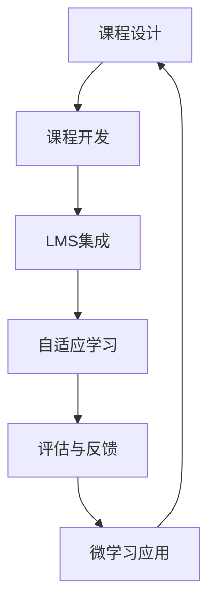

                 

## 1. 背景介绍

在数字时代，在线课程已经成为了知识传播和终身学习的重要形式。利用技术能力，创建高质量、可持续发展的在线课程，成为了每个教育者和技术爱好者的共同追求。本文将从核心概念、核心算法、实践操作、应用场景等多个角度，全面探讨如何利用技术能力创建在线课程，以期为教育工作者和IT技术爱好者提供实用指南。

## 2. 核心概念与联系

### 2.1 核心概念概述

为了更好地理解在线课程的创建过程，我们先要了解几个关键概念：

- **在线课程**：一种通过互联网平台提供的，具有结构化、可复现的教学形式。
- **学习管理系统(LMS)**：用于管理和发布在线课程的软件平台，如Canvas、Moodle等。
- **自适应学习系统(Adaptive Learning System)**：能够根据学生学习情况实时调整教学内容和难度的系统。
- **大规模开放在线课程(MOOC)**：面向全球、免费开放的在线课程，如Coursera、edX等。
- **微学习(Microlearning)**：将大课程内容拆分成小块，便于快速学习和吸收。

这些概念之间存在紧密的联系。在线课程的创建、管理和评估，都依赖于LMS和自适应学习系统的技术支持。MOOC和微学习则进一步拓展了在线课程的形式和内容，使其更加适应个性化和移动化的学习需求。

### 2.2 核心概念原理和架构的 Mermaid 流程图

以下是一个简单的Mermaid流程图，展示了在线课程创建的基本流程和涉及的关键组件：



这个流程图展示了在线课程从设计到评估的完整流程，以及各环节涉及的关键技术和组件。

## 3. 核心算法原理 & 具体操作步骤

### 3.1 算法原理概述

在线课程的创建过程涉及多个核心算法和技术，主要包括：

- **自适应学习算法**：根据学生的学习进度和表现，动态调整课程内容和难度，以提高学习效果。
- **个性化推荐算法**：根据学生的兴趣和知识水平，推荐最适合的课程内容和学习路径。
- **学习分析算法**：通过分析学生的学习行为数据，评估学习效果，提供个性化的学习建议。

这些算法和技术相互配合，共同构成了在线课程的核心竞争力。

### 3.2 算法步骤详解

创建一个在线课程，一般包括以下步骤：

1. **课程设计**：确定课程目标、内容、结构和评估标准。
2. **课程开发**：利用LMS和相关技术，将课程内容转化为可交互、可评估的在线形式。
3. **LMS集成**：将课程内容上传到LMS平台，并配置相关的学习活动和评估工具。
4. **自适应学习应用**：在LMS中添加自适应学习功能，根据学生表现调整课程内容。
5. **评估与反馈**：设计评估机制和反馈系统，及时了解学生学习情况，优化课程内容。
6. **微学习应用**：将课程内容拆分成小块，便于学生快速学习和复习。

### 3.3 算法优缺点

在线课程的创建过程涉及的技术多，因此也有其优缺点：

**优点**：

- **灵活性高**：可以根据学生需求和反馈，灵活调整课程内容和结构。
- **覆盖面广**：能够覆盖广泛的学科和知识领域，满足不同学习者的需求。
- **易于传播**：通过互联网平台，在线课程可以覆盖全球，不受地域限制。

**缺点**：

- **技术门槛高**：需要具备一定的技术能力和资源，才能创建高质量的在线课程。
- **互动性不足**：相比传统的课堂教学，在线课程的互动性有限，可能影响学习效果。
- **学习依赖性强**：学生需要较强的自主学习能力和自我管理能力。

### 3.4 算法应用领域

在线课程的创建技术，已经广泛应用于教育领域的各个环节，包括：

- **K-12教育**：为中小学生提供在线课程和辅导。
- **高等教育**：提供通识教育、专业技能培训等在线课程。
- **职业培训**：提供技能提升和职业发展相关的在线课程。
- **终身学习**：支持成年人进行自我提升和学习新技能。

## 4. 数学模型和公式 & 详细讲解 & 举例说明

### 4.1 数学模型构建

在线课程的创建涉及多个数学模型，包括但不限于：

- **线性回归模型**：用于预测学生的学习进度和效果。
- **决策树模型**：用于推荐课程内容和学习路径。
- **聚类算法**：用于分析学生群体，提供个性化的学习建议。

### 4.2 公式推导过程

以线性回归模型为例，其基本公式为：

$$ y = \theta_0 + \theta_1 x_1 + \theta_2 x_2 + \cdots + \theta_n x_n $$

其中，$y$表示预测值，$\theta$表示模型参数，$x_i$表示输入变量。

### 4.3 案例分析与讲解

假设我们有一个在线编程课程，使用线性回归模型预测学生的编程能力提升情况。课程中，学生需要完成多个编程练习和项目，我们记录了每个学生的练习时间和成绩，并使用线性回归模型进行预测和分析。

## 5. 项目实践：代码实例和详细解释说明

### 5.1 开发环境搭建

为了创建一个在线课程，我们需要准备以下几个开发环境：

1. **编程环境**：安装Python、R、JavaScript等编程语言的环境。
2. **LMS平台**：选择一个适合的LMS平台，如Canvas、Moodle等。
3. **开发工具**：选择适合的开发工具，如PyCharm、Visual Studio等。

### 5.2 源代码详细实现

以下是一个简单的Python代码示例，用于线性回归模型的实现：

```python
import numpy as np

# 假设我们有以下数据
x = np.array([[1, 2], [2, 3], [3, 4], [4, 5]])
y = np.array([2, 4, 6, 8])

# 使用最小二乘法求解线性回归模型参数
theta = np.linalg.inv(x.T @ x) @ x.T @ y

# 预测新数据
x_new = np.array([[5, 6]])
y_pred = theta[0] + theta[1] * x_new[0]

print(y_pred)
```

### 5.3 代码解读与分析

以上代码实现了一个简单的线性回归模型，用于预测学生的编程能力提升情况。模型参数$\theta$通过最小二乘法求解，可以用于预测新数据$x_{new}$的编程能力提升情况。

## 6. 实际应用场景

### 6.1 在线编程课程

在线编程课程可以针对不同水平的学生提供个性化学习路径。通过记录学生的练习情况和项目提交情况，使用线性回归模型预测学生的学习进度，并根据预测结果推荐适合的编程练习和项目。

### 6.2 在线语言学习

在线语言学习课程可以通过智能推荐系统，根据学生的学习情况和语言水平，推荐最适合的课程内容和练习。利用自适应学习算法，动态调整课程难度和内容，以提高学习效果。

### 6.3 在线职业技能培训

在线职业技能培训课程可以针对不同职业领域，提供定制化的课程内容。通过分析学生的学习行为数据，使用聚类算法对学生进行分组，提供个性化的学习建议和课程推荐。

### 6.4 未来应用展望

未来的在线课程将更加智能和个性化。随着机器学习和人工智能技术的不断发展，在线课程将能够更好地适应学生的学习需求和个性化特点，提供更加高效和有针对性的学习体验。

## 7. 工具和资源推荐

### 7.1 学习资源推荐

为了帮助开发者系统掌握在线课程的创建技术，这里推荐一些优质的学习资源：

1. **Coursera官方文档**：Coursera的开发者文档，提供了详细的API和开发指南。
2. **Moodle官方文档**：Moodle的开发者文档，提供了LMS平台的开发接口和API。
3. **Kaggle竞赛项目**：Kaggle上的在线课程竞赛项目，提供了丰富的数据集和算法实现。

### 7.2 开发工具推荐

在线课程的创建离不开各种工具的支持。以下是几款常用的开发工具：

1. **PyCharm**：适用于Python开发的IDE，支持数据分析和机器学习开发。
2. **Jupyter Notebook**：支持Python和R等编程语言的数据分析和模型开发。
3. **GitHub**：版本控制和代码托管平台，方便团队协作和版本管理。

### 7.3 相关论文推荐

在线课程的创建技术涉及多个学科领域，以下几篇经典论文值得推荐：

1. "Online Learning" by C. Bishop
2. "Adaptive Learning" by D. Birnbaum
3. "Machine Learning A-Z" by Kirill Eremenko

## 8. 总结：未来发展趋势与挑战

### 8.1 研究成果总结

本文从核心概念、核心算法、操作步骤等多个角度，全面介绍了如何利用技术能力创建在线课程。通过在线课程，教育工作者和IT技术爱好者可以更高效地传播知识和技能，满足不同学习者的需求。

### 8.2 未来发展趋势

未来的在线课程将更加智能化和个性化，随着机器学习和人工智能技术的不断进步，在线课程将能够更好地适应学生的学习需求和个性化特点，提供更加高效和有针对性的学习体验。

### 8.3 面临的挑战

尽管在线课程技术已经取得了很大进展，但仍然面临诸多挑战：

1. **技术门槛高**：需要具备一定的技术能力和资源，才能创建高质量的在线课程。
2. **互动性不足**：相比传统的课堂教学，在线课程的互动性有限，可能影响学习效果。
3. **学习依赖性强**：学生需要较强的自主学习能力和自我管理能力。

### 8.4 研究展望

未来的研究需要从以下几个方面寻求新的突破：

1. **自适应学习算法**：提高自适应学习算法的精准性和灵活性，以更好地适应学生的学习需求。
2. **个性化推荐算法**：提高个性化推荐算法的效率和准确性，以提供更加个性化的课程内容。
3. **学习分析技术**：通过更全面的学习分析技术，评估学习效果，提供更有效的学习建议。

## 9. 附录：常见问题与解答

**Q1: 如何提高在线课程的互动性？**

A: 在线课程的互动性可以通过以下方式提高：

1. **增加实时讨论和问答**：通过实时讨论和问答功能，增加师生互动。
2. **利用多媒体资源**：通过视频、音频等形式丰富课程内容，增加学生的参与感。
3. **设计互动式学习活动**：设计互动式的学习活动，如编程练习、在线实验等，提高学生参与度。

**Q2: 如何评估在线课程的效果？**

A: 在线课程的效果可以通过以下方式进行评估：

1. **测验和考试**：通过测验和考试，评估学生的学习成果。
2. **学习分析数据**：通过学习分析数据，了解学生的学习行为和进展，提供个性化的学习建议。
3. **反馈机制**：设计反馈机制，收集学生的意见和建议，不断改进课程内容和教学方法。

**Q3: 如何确保在线课程的安全性？**

A: 在线课程的安全性可以通过以下方式保障：

1. **身份验证**：通过身份验证，确保只有授权用户才能访问课程内容。
2. **数据加密**：对课程内容和学生数据进行加密，防止数据泄露和篡改。
3. **访问控制**：通过访问控制技术，限制非法访问和不当操作。

**Q4: 如何应对在线课程的技术挑战？**

A: 应对在线课程的技术挑战，可以从以下几个方面入手：

1. **技术培训**：对课程制作者进行技术培训，提高其技术水平和开发能力。
2. **团队协作**：组建专业的课程开发团队，分工协作，共同完成课程开发任务。
3. **持续优化**：定期更新课程内容和技术架构，不断改进在线课程的质量和用户体验。

总之，在线课程的创建和应用将随着技术的不断进步而不断演进。未来，在线课程将更加智能化、个性化和互动化，为教育工作者和IT技术爱好者提供更多的可能性。

作者：禅与计算机程序设计艺术 / Zen and the Art of Computer Programming

