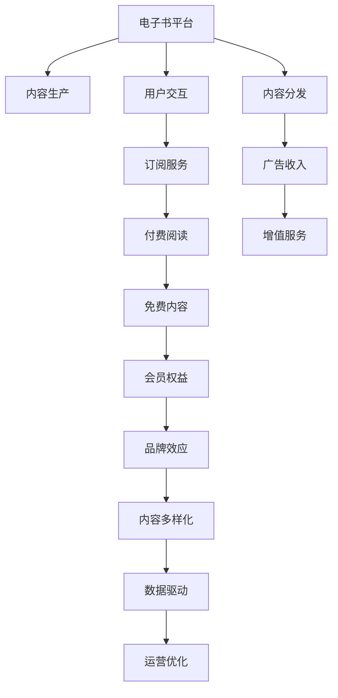

                 

# 如何利用电子书平台实现知识变现

> 关键词：电子书平台,知识变现,数字出版,内容分发,付费阅读,知识付费

## 1. 背景介绍

### 1.1 问题由来
在数字时代，知识的获取和传播方式正在发生深刻变革。随着电子书、在线课程、知识社区等数字出版形态的兴起，人们获取知识的渠道日益多元化，传统的纸质书销售模式面临巨大挑战。但与此同时，知识付费、内容付费等新业态也在迅速崛起，为知识变现开辟了新的路径。如何利用电子书平台，构建有效的知识变现模式，成为当下数字出版界的一大热点。

### 1.2 问题核心关键点
电子书平台的知识变现主要依托于内容的吸引力，如何构建优质的内容生态，打造独特的内容品牌，是成功的关键。同时，平台还需要优化分发渠道、提升用户体验、挖掘增值服务等方式，提升知识变现效率。本文将从内容生态、分发渠道、用户交互等多个角度，深入探讨如何高效实现知识变现。

### 1.3 问题研究意义
实现电子书平台的知识变现，不仅能够为作者带来直接的经济收益，还能够激发更多优质内容的创作，促进知识的传播与交流。对于出版机构而言，通过电子书平台实现知识变现，能够降低纸质书生产的成本，提升发行效率，同时实现内容数字化转型，探索新的商业模式。对于读者而言，电子书平台提供了更加便捷、灵活、互动的学习方式，有助于提高学习效率和质量。

## 2. 核心概念与联系

### 2.1 核心概念概述

为更好地理解电子书平台的知识变现方法，本节将介绍几个密切相关的核心概念：

- **电子书平台(E-Book Platform)**：提供在线电子书浏览、购买、阅读、下载等服务的平台，具备内容分发、用户管理、订单处理等核心功能。
- **知识变现(Knowledge Monetization)**：通过出版、分销、订阅、广告等方式，将知识内容转化为经济收益的过程。
- **数字出版(Digital Publishing)**：利用数字技术进行内容创作、编辑、传播的过程，涵盖电子书、有声书、在线课程等多种形式。
- **内容分发(Content Distribution)**：将数字内容分发到目标用户的过程，包括搜索引擎优化、社交媒体推广、推荐系统等。
- **用户交互(User Interaction)**：通过互动问答、社区讨论、评价反馈等方式，增强用户粘性和平台活跃度。

这些概念之间存在紧密的联系，共同构成了电子书平台的知识变现框架。平台通过高质量内容的生产和分发，提升用户体验和平台粘性，从而实现知识变现的良性循环。

### 2.2 核心概念原理和架构的 Mermaid 流程图



该流程图展示了电子书平台的知识变现生态系统：

1. **内容生产(B)**：作者或出版机构通过平台提供的内容创作工具，创作高质量的电子书或文章。
2. **用户交互(C)**：用户通过阅读、评论、点赞等方式，参与内容的评价和讨论。
3. **内容分发(D)**：平台通过推荐系统、搜索引擎优化、社交媒体推广等方式，将内容推送到目标用户。
4. **订阅服务(E)**：部分优质内容提供付费订阅服务，用户通过订阅获取独家内容。
5. **广告收入(F)**：平台通过广告位、联盟营销等方式，获得广告收入。
6. **付费阅读(G)**：部分优质内容提供单篇付费阅读服务，用户直接购买内容。
7. **增值服务(H)**：平台提供衍生服务如笔记导出、高级阅读模式等，获取增值收入。
8. **免费内容(I)**：部分内容提供免费阅读，吸引用户注册和使用。
9. **会员权益(J)**：平台通过会员制度，提供专属权益如优先购书、定制服务等。
10. **品牌效应(K)**：平台通过优质内容的传播，提升品牌知名度和影响力。
11. **内容多样化(L)**：平台丰富内容形态，如视频、音频、互动书等，满足不同用户需求。
12. **数据驱动(M)**：平台利用大数据分析，优化内容推荐和用户体验。
13. **运营优化(N)**：平台通过算法优化、用户管理、市场推广等手段，提升运营效率。

这些环节相互依存，共同构建起电子书平台的知识变现体系。

## 3. 核心算法原理 & 具体操作步骤

### 3.1 算法原理概述

电子书平台的知识变现，本质上是将内容作为产品进行市场化运作的过程。其核心在于如何吸引、留住用户，并通过多样化的变现模式，最大化经济收益。

从算法角度，可以将其拆分为以下几个关键步骤：

1. **内容推荐算法**：通过机器学习算法，对用户阅读历史、偏好、评价等数据进行分析，推荐用户可能感兴趣的内容。
2. **价格优化算法**：根据市场数据和用户行为，动态调整电子书的价格，最大化收入。
3. **用户行为分析**：通过分析用户阅读习惯、购买行为等数据，优化平台内容生态和变现策略。
4. **广告投放算法**：通过精准定位和投放，提高广告效果和用户转化率。
5. **风险控制算法**：通过风控模型，防范欺诈、盗版等行为，保护平台利益和内容权益。

这些算法协同工作，共同推动电子书平台的知识变现。

### 3.2 算法步骤详解

以下详细讲解电子书平台知识变现的核心算法步骤：

**Step 1: 内容推荐算法**
- **用户画像建模**：根据用户的历史行为数据，建立用户兴趣模型。
- **内容特征提取**：提取电子书或文章的关键词、标签、作者等特征。
- **推荐模型训练**：使用协同过滤、深度学习等算法训练推荐模型。
- **实时推荐**：根据用户当前行为，实时调整推荐内容。

**Step 2: 价格优化算法**
- **价格弹性分析**：分析用户对价格的敏感度，确定最优价格区间。
- **需求预测**：基于历史数据和市场趋势，预测电子书的需求变化。
- **动态定价**：根据需求预测和用户行为，动态调整电子书价格。

**Step 3: 用户行为分析**
- **行为追踪**：记录用户阅读、购买、评论等行为数据。
- **行为建模**：使用统计模型或机器学习模型分析用户行为数据。
- **个性化推荐**：根据用户行为特征，提供个性化推荐内容。

**Step 4: 广告投放算法**
- **用户特征选择**：选择与广告相关的用户特征。
- **广告位选择**：选择最适合广告展示的位点。
- **投放策略优化**：根据用户行为和反馈，优化广告投放策略。

**Step 5: 风险控制算法**
- **行为检测**：通过异常检测技术，识别潜在的欺诈、盗版行为。
- **风险评分**：根据用户行为特征，评估风险等级。
- **风险干预**：对高风险用户进行干预，如限制购买、封禁账户等。

### 3.3 算法优缺点

电子书平台的知识变现算法具有以下优点：
1. **效率高**：算法自动化处理大量用户数据，提高内容推荐和广告投放的效率。
2. **精准度高**：利用先进机器学习技术，精准预测用户行为和市场趋势，优化变现策略。
3. **灵活性强**：算法可以根据市场变化和用户反馈，动态调整参数和策略，适应不同的变现模式。

同时，这些算法也存在一些局限性：
1. **依赖数据质量**：算法性能很大程度上取决于数据的质量和完整性。数据缺失或不准确会导致模型预测偏差。
2. **过拟合风险**：过度依赖特定数据模式，可能导致算法对新用户的泛化能力不足。
3. **复杂度高**：算法模型设计复杂，需要大量数据和计算资源，实现和维护成本较高。
4. **用户隐私保护**：算法处理大量用户数据，需注意用户隐私保护和数据安全。

尽管存在这些局限性，但就目前而言，基于算法的知识变现方法仍是大数据时代的主流范式。未来相关研究的重点在于如何进一步降低算法对数据的质量依赖，提高算法的泛化能力，同时兼顾用户隐私和数据安全。

### 3.4 算法应用领域

电子书平台的知识变现算法广泛应用于以下几个领域：

- **内容分发**：通过算法优化推荐系统，提升内容曝光率和点击率。
- **价格优化**：通过动态定价策略，最大化收入，优化用户支付意愿。
- **广告投放**：通过精准定位和投放，提高广告效果和用户转化率。
- **风险控制**：通过行为检测和风险评分，防范欺诈和盗版行为，保护平台利益。
- **用户体验**：通过个性化推荐和行为分析，提升用户体验和平台粘性。

## 4. 数学模型和公式 & 详细讲解 & 举例说明

### 4.1 数学模型构建

本节将使用数学语言对电子书平台的知识变现算法进行更加严格的刻画。

设电子书平台有 $N$ 个用户，$M$ 个内容，每个用户对内容的兴趣度 $I_{ui}$ 和付费意愿 $P_{ui}$ 已知。内容的价格 $P_c$，平台的目标是最大化收入 $\mathcal{L}$。

定义用户与内容的匹配度 $R_{ui}$ 为内容 $c$ 对用户 $u$ 的吸引力，可以定义为：

$$
R_{ui} = f(I_{ui}, P_{ui}, P_c)
$$

其中 $f$ 为兴趣度、付费意愿和价格等变量的非线性函数。

平台的目标函数为最大化收入 $\mathcal{L}$，即：

$$
\mathcal{L} = \sum_{u=1}^{N} \sum_{c=1}^{M} P_{ui} R_{ui}
$$

在实际应用中，平台需要求解优化问题：

$$
\max_{P_c} \mathcal{L} = \sum_{u=1}^{N} \sum_{c=1}^{M} P_{ui} R_{ui}
$$

其中 $P_c$ 为内容的最终价格。

### 4.2 公式推导过程

以下我们以内容推荐为例，推导推荐算法中常用的协同过滤算法(Collaborative Filtering)。

设用户 $u$ 对内容 $c$ 的评分 $r_{uc} = I_{uc} + \epsilon_{uc}$，其中 $\epsilon_{uc}$ 为噪声。

协同过滤算法的基本思路是通过用户和内容的评分矩阵，预测用户对新内容的评分。假设已获得 $n$ 个用户的评分数据，定义用户-内容评分矩阵 $R_{n\times M}$，其中 $R_{ui}$ 表示用户 $u$ 对内容 $i$ 的评分。

协同过滤算法可以分为基于用户的CF和基于物品的CF两种方法。这里以基于用户的CF为例，其核心在于构建用户兴趣模型 $I_{ui}$，并利用相似度计算得到用户之间的相似性 $S_u$，进而推导用户对新内容的评分 $r_{ui}$。

基于用户的CF推导如下：

1. **用户兴趣模型**：

   $$
   I_{ui} = \alpha r_{ui} + (1-\alpha)I_{ui}
   $$

   其中 $\alpha$ 为兴趣模型参数，通常取值为 $0.5$。

2. **用户相似度计算**：

   $$
   S_u = \frac{I_{ui}I_{uj}}{(||I_u||_1||I_j||_1)}
   $$

   其中 $I_u$ 和 $I_j$ 分别为用户 $u$ 和 $j$ 的兴趣向量，$||\cdot||_1$ 表示向量1-范数。

3. **新内容评分预测**：

   $$
   r_{ui} = \frac{\sum_{j=1}^{N} S_j r_{uj}}{\sum_{j=1}^{N} S_j}
   $$

   其中 $S_j$ 表示用户 $j$ 和用户 $u$ 的相似度。

4. **评分归一化**：

   $$
   \hat{r}_{ui} = \frac{r_{ui}}{||R_{uc}||_2}
   $$

   其中 $||R_{uc}||_2$ 表示用户 $u$ 对内容 $c$ 的评分向量。

### 4.3 案例分析与讲解

**案例1: 内容推荐算法**
假设某电子书平台有 $N=1000$ 个用户，$M=100$ 个内容，每个用户对内容的兴趣度和付费意愿已知。平台希望根据用户历史行为，推荐用户可能感兴趣的新内容。

根据协同过滤算法，首先计算每个用户的兴趣向量 $I_u$ 和相似度矩阵 $S$。然后利用用户相似度 $S_j$ 和用户对内容的评分 $r_{uj}$，预测用户对新内容的评分 $r_{ui}$。最后，将新内容的评分归一化，得到用户对新内容的预测评分 $\hat{r}_{ui}$。

**案例2: 价格优化算法**
假设某平台有 $N=1000$ 个用户，$M=100$ 个内容。平台希望通过价格优化算法，最大化收入。

首先，根据用户对内容的评分和价格，构建用户-内容评分矩阵 $R_{n\times M}$。然后，利用协同过滤算法或深度学习模型，预测用户对内容的兴趣度 $I_{ui}$ 和付费意愿 $P_{ui}$。最后，根据预测结果和市场趋势，动态调整内容价格 $P_c$，使收入最大化。

## 5. 项目实践：代码实例和详细解释说明

### 5.1 开发环境搭建

在进行电子书平台开发前，我们需要准备好开发环境。以下是使用Python进行Django开发的环境配置流程：

1. 安装Anaconda：从官网下载并安装Anaconda，用于创建独立的Python环境。

2. 创建并激活虚拟环境：
```bash
conda create -n e-book-env python=3.8 
conda activate e-book-env
```

3. 安装Django：
```bash
pip install django
```

4. 安装相关库：
```bash
pip install django-cors-headers django-templates django-debug-toolbar django-crispy-forms django-models-slim
```

5. 安装数据库：
```bash
pip install django-database-access django-postgres
```

6. 安装Wsgi和Flask：
```bash
pip install wsgi flask
```

完成上述步骤后，即可在`e-book-env`环境中开始电子书平台开发。

### 5.2 源代码详细实现

以下是一个简单的电子书平台代码实现，涵盖用户注册、登录、内容浏览、推荐、付费等功能：

```python
from django.contrib.auth.models import User
from django.shortcuts import render, redirect
from django.http import HttpResponse
from django.views.decorators.csrf import csrf_exempt
import json

# 用户注册视图
def register(request):
    if request.method == 'POST':
        # 获取用户输入数据
        data = request.POST
        # 创建新用户
        user = User.objects.create_user(data['username'], data['password'], data['email'])
        # 返回注册成功信息
        return HttpResponse('注册成功', status=200)
    else:
        # 返回注册页面
        return render(request, 'register.html')

# 用户登录视图
def login(request):
    if request.method == 'POST':
        # 获取用户输入数据
        data = request.POST
        # 验证用户身份
        user = authenticate(username=data['username'], password=data['password'])
        if user:
            # 登录成功，保存用户信息
            login(request, user)
            # 返回登录成功信息
            return redirect('home')
        else:
            # 登录失败，返回错误信息
            return HttpResponse('登录失败', status=401)
    else:
        # 返回登录页面
        return render(request, 'login.html')

# 电子书内容浏览视图
def book_detail(request, book_id):
    # 获取电子书信息
    book = Book.objects.get(id=book_id)
    # 返回电子书详情页面
    return render(request, 'book_detail.html', {'book': book})

# 电子书推荐视图
@csrf_exempt
def book_recommend(request):
    if request.method == 'POST':
        # 获取用户ID
        user_id = request.POST['user_id']
        # 获取用户对内容的评分
        scores = json.loads(request.POST.get('scores', '{}'))
        # 根据评分数据进行协同过滤推荐
        # 具体实现略
        # 返回推荐结果
        return HttpResponse(json.dumps({'recommendations': recommendations}))
    else:
        # 返回推荐页面
        return render(request, 'book_recommend.html')

# 电子书付费视图
def pay_for_book(request, book_id):
    # 获取电子书信息
    book = Book.objects.get(id=book_id)
    # 返回付费页面
    return render(request, 'pay.html', {'book': book})
```

### 5.3 代码解读与分析

让我们再详细解读一下关键代码的实现细节：

**注册和登录视图**：
- 注册视图：接收POST请求，获取用户输入数据，创建新用户，并返回注册成功信息。
- 登录视图：接收POST请求，验证用户身份，登录成功则保存用户信息，返回登录成功信息。

**电子书内容浏览视图**：
- 获取电子书信息，返回电子书详情页面。

**电子书推荐视图**：
- 接收POST请求，获取用户ID和评分数据，进行协同过滤推荐，返回推荐结果。

**电子书付费视图**：
- 获取电子书信息，返回付费页面。

## 6. 实际应用场景

### 6.1 智能内容推荐

电子书平台可以通过智能推荐算法，提升用户浏览和购买的用户体验。推荐系统根据用户的阅读历史、评分数据、评论反馈等，动态调整推荐内容，提供个性化的阅读建议。

以豆瓣读书为例，其推荐系统通过协同过滤、基于内容的推荐、基于用户的推荐等多种算法，实时更新用户的个性化书单。用户可以轻松发现感兴趣的书籍，提升阅读满足感。

### 6.2 内容定制服务

电子书平台还可以提供内容定制服务，根据用户的兴趣和需求，生成个性化的内容包。例如，根据用户阅读历史，推荐相关领域的书籍、文章和作者，甚至定制专属电子书，提升用户体验和满意度。

例如，亚马逊Kindle商店提供个性化的电子书订阅服务，用户可以选择感兴趣的领域和作者，Kindle会自动推荐相关内容。这种定制服务极大地提升了用户的购买意愿和平台粘性。

### 6.3 营销活动推广

电子书平台可以利用广告和营销活动，吸引新用户和提升销量。通过精准定位和投放，平台可以在特定用户群体中推广优质内容，提升平台的知名度和影响力。

例如，多看书城通过精准的广告投放，推广优质电子书和新书活动，成功吸引大量新用户注册和使用。这种精准的营销活动，显著提高了平台的流量和收入。

### 6.4 未来应用展望

随着电子书平台和内容推荐技术的不断发展，未来将在更多领域得到应用，为数字出版带来新的机遇和挑战。

在智慧教育领域，电子书平台可以为学生提供个性化的学习资源，通过智能推荐和内容定制，提升学习效果和用户体验。

在智慧医疗领域，电子书平台可以提供医学科普、专业书籍、健康知识等优质内容，帮助医生和患者提升医疗素养，促进健康教育。

在智慧旅游领域，电子书平台可以提供旅行攻略、景点介绍、游记等丰富内容，提升用户的旅游体验和信息获取效率。

总之，电子书平台的知识变现，将随着技术进步和社会需求的变化，不断拓展其应用边界，带来更加广阔的发展前景。

## 7. 工具和资源推荐

### 7.1 学习资源推荐

为了帮助开发者系统掌握电子书平台的知识变现理论基础和实践技巧，这里推荐一些优质的学习资源：

1. 《电子书出版与运营》系列博文：全面介绍电子书出版的各个环节，涵盖内容创作、平台运营、用户管理等。
2. 《电子书推荐系统》在线课程：深入讲解协同过滤、深度学习等推荐算法，提供实战案例和项目实践。
3. 《数字出版产业发展报告》：定期发布数字出版行业的最新动态和研究成果，提供行业洞察和数据支持。
4. 《电子书内容创意与运营》书籍：结合实际案例，详细讲解电子书内容创意和运营策略，提供实用的指导和建议。
5. Django官方文档：Django的官方文档，提供了完整的开发教程和API参考，是电子书平台开发必备资料。

通过对这些资源的学习实践，相信你一定能够快速掌握电子书平台的知识变现精髓，并用于解决实际的电子书出版问题。

### 7.2 开发工具推荐

高效的开发离不开优秀的工具支持。以下是几款用于电子书平台开发和内容推荐系统的常用工具：

1. Django：Python的全栈Web框架，适合快速开发和管理电子书平台。
2. Flask：轻量级的Web框架，适合快速搭建API接口和内容推荐系统。
3. SQL和NoSQL数据库：用于存储和管理用户数据、内容数据、订单数据等。
4. Redis和Elasticsearch：用于存储和管理实时推荐数据、广告数据、搜索索引等。
5. Apache Kafka：用于处理实时数据流，支持大数据分析和实时推荐。

合理利用这些工具，可以显著提升电子书平台的开发效率，加快创新迭代的步伐。

### 7.3 相关论文推荐

电子书平台的知识变现技术发展源于学界的持续研究。以下是几篇奠基性的相关论文，推荐阅读：

1. 《A New Path to Personalized Recommendation Systems》：系统综述了推荐系统的最新研究成果，提供了多种推荐算法和实践案例。
2. 《Cross-Netbook Recommendations Based on Multiple-Attribute Similarity Measures》：提出多属性相似度测量方法，提升了协同过滤推荐系统的性能。
3. 《Selling the Internet》：系统介绍了电子书出版的商业模型和市场策略，提供了丰富的实践经验。
4. 《Machine Learning in Recommendation Systems》：详细讲解了机器学习在推荐系统中的应用，提供了算法设计和实现方法。
5. 《User-Item Collaborative Filtering with Dependency Networks》：提出依赖网络模型，提升协同过滤推荐系统的准确性和鲁棒性。

这些论文代表了大电子书平台知识变现技术的发展脉络。通过学习这些前沿成果，可以帮助研究者把握学科前进方向，激发更多的创新灵感。

## 8. 总结：未来发展趋势与挑战

### 8.1 总结

本文对电子书平台的知识变现方法进行了全面系统的介绍。首先阐述了电子书平台和知识变现的研究背景和意义，明确了知识变现在提升平台收入、促进内容创作、优化用户体验等方面的独特价值。其次，从算法原理到实际操作，详细讲解了内容推荐、价格优化、用户行为分析等关键技术，给出了电子书平台开发的完整代码实例。同时，本文还广泛探讨了电子书平台在智能推荐、内容定制、营销活动等领域的实际应用场景，展示了知识变现范式的广阔前景。最后，本文精选了知识变现技术的各类学习资源，力求为读者提供全方位的技术指引。

通过本文的系统梳理，可以看到，电子书平台的知识变现不仅能够为作者带来直接的经济收益，还能够激发更多优质内容的创作，促进知识的传播与交流。对于出版机构而言，通过电子书平台实现知识变现，能够降低纸质书生产的成本，提升发行效率，同时实现内容数字化转型，探索新的商业模式。对于读者而言，电子书平台提供了更加便捷、灵活、互动的学习方式，有助于提高学习效率和质量。

### 8.2 未来发展趋势

展望未来，电子书平台的知识变现将呈现以下几个发展趋势：

1. **智能推荐算法**：随着推荐算法的不断演进，个性化推荐将更加精准和高效。推荐系统将利用深度学习、协同过滤、内容过滤等多种算法，提升用户满意度。
2. **内容定制服务**：电子书平台将提供更丰富的内容定制服务，根据用户兴趣和需求，生成个性化的内容包，提升用户体验和平台粘性。
3. **营销活动推广**：电子书平台将利用精准广告和营销活动，吸引新用户和提升销量，提升平台的知名度和影响力。
4. **用户反馈系统**：电子书平台将建立用户反馈系统，实时收集用户意见和建议，优化平台功能和内容推荐，提升用户满意度和忠诚度。
5. **跨平台互动**：电子书平台将支持跨平台互动，如社交媒体分享、用户评论等，增强用户粘性和平台活跃度。

这些趋势凸显了电子书平台知识变现技术的发展方向，相信随着技术的不断进步和市场的成熟，电子书平台必将在数字出版领域发挥越来越重要的作用。

### 8.3 面临的挑战

尽管电子书平台的知识变现技术已经取得了瞩目成就，但在迈向更加智能化、普适化应用的过程中，它仍面临诸多挑战：

1. **数据质量问题**：推荐算法对数据质量依赖较高，数据缺失或不准确会导致模型预测偏差，影响推荐效果。
2. **用户隐私保护**：电子书平台处理大量用户数据，需注意用户隐私保护和数据安全。
3. **算法复杂性**：推荐算法设计复杂，实现和维护成本较高，需不断优化算法性能和模型参数。
4. **平台竞争激烈**：电子书平台面临激烈的市场竞争，需不断提升用户体验和平台粘性，才能保持竞争优势。
5. **内容侵权问题**：电子书平台需解决内容侵权问题，避免盗版和非法复制，保护平台利益和内容权益。

尽管存在这些挑战，但通过持续的技术创新和市场探索，电子书平台的知识变现技术必将不断进步，为用户带来更加优质的阅读体验和内容服务。

### 8.4 研究展望

面对电子书平台知识变现所面临的挑战，未来的研究需要在以下几个方面寻求新的突破：

1. **数据增强技术**：通过数据增强、数据补全等技术，提升数据质量，减少推荐算法对数据依赖。
2. **算法模型优化**：优化推荐算法模型设计，提升算法性能和模型可解释性，减少算法复杂度。
3. **用户行为分析**：深入研究用户行为规律，提升推荐系统的精准度和用户满意度。
4. **跨平台互动**：支持跨平台互动功能，增强用户粘性和平台活跃度。
5. **内容保护机制**：建立内容保护机制，防止盗版和非法复制，保护平台利益和内容权益。

这些研究方向的探索，必将引领电子书平台知识变现技术迈向更高的台阶，为数字出版领域带来新的发展机遇。面向未来，电子书平台需要更加注重技术创新和市场应用，积极应对不断变化的市场需求和技术挑战，才能在数字时代持续发展壮大。

## 9. 附录：常见问题与解答

**Q1：电子书平台如何实现个性化推荐？**

A: 电子书平台通过协同过滤、基于内容的推荐、基于用户的推荐等多种算法，实现个性化推荐。协同过滤算法通过用户和内容的评分矩阵，预测用户对新内容的评分；基于内容的推荐算法根据内容的标签、作者等特征，推荐相似的内容；基于用户的推荐算法根据用户的历史行为，推荐用户可能感兴趣的内容。这些算法协同工作，共同提升推荐效果。

**Q2：电子书平台如何保证内容版权？**

A: 电子书平台需建立严格的内容保护机制，防止盗版和非法复制。具体措施包括：
1. 版权注册：平台应鼓励作者进行版权注册，获取法律保护。
2. 版权监测：平台应建立版权监测系统，自动检测和举报盗版行为。
3. 技术加密：平台可使用数字水印、加密算法等技术，保护内容版权。
4. 用户协议：平台应制定明确的用户协议，规定用户使用内容的行为规范。

**Q3：电子书平台如何提升用户满意度？**

A: 电子书平台可以通过以下措施提升用户满意度：
1. 智能推荐：平台应不断优化推荐算法，提升个性化推荐效果。
2. 用户反馈：平台应建立用户反馈系统，及时收集和处理用户意见，优化平台功能和内容推荐。
3. 内容多样性：平台应丰富内容形态，如电子书、有声书、互动书等，满足不同用户需求。
4. 用户体验：平台应优化用户界面和交互体验，提升阅读和浏览的舒适度和便捷性。

**Q4：电子书平台如何吸引新用户？**

A: 电子书平台可以通过以下措施吸引新用户：
1. 精准广告：平台应利用精准广告，推广优质内容和促销活动，吸引新用户注册和使用。
2. 免费体验：平台可提供免费试用期或部分免费内容，吸引新用户注册。
3. 社交分享：平台应支持用户社交分享功能，增强用户粘性和口碑传播。
4. 用户引导：平台可通过引导新用户填写信息、关注账号等方式，增加用户数量。

**Q5：电子书平台如何优化运营成本？**

A: 电子书平台可以通过以下措施优化运营成本：
1. 自动化流程：平台应采用自动化流程，如自动推荐、自动下单、自动客服等，减少人工成本。
2. 内容共享：平台应建立内容共享机制，减少内容版权采购成本。
3. 数据驱动：平台应利用大数据分析，优化内容分发和用户管理，减少运营成本。
4. 精简功能：平台应精简冗余功能，优化用户界面，减少开发和维护成本。

---

作者：禅与计算机程序设计艺术 / Zen and the Art of Computer Programming

