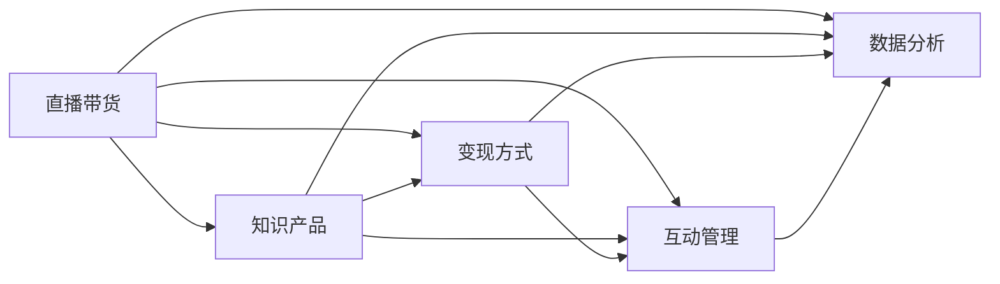

                 

# 如何利用直播带货等新形式变现知识产品

## 1. 背景介绍

### 1.1 问题由来

随着互联网的普及和技术的进步，知识产品的变现方式正在发生显著变化。传统的书籍、文章、课程等形式的知识产品，虽然仍然有市场，但难以摆脱成本高、转化率低的窘境。而直播带货等新形式的出现，为知识变现提供了新的机遇。

直播带货，即通过直播的形式，将知识产品呈现给用户，通过观众的打赏、订阅、购买等方式实现变现。这种方式不仅能够降低知识传播的成本，还能提高用户的参与度和粘性，具有很大的市场潜力。

### 1.2 问题核心关键点

直播带货等新形式变现知识产品的核心关键点在于如何设计和运营直播内容，以吸引用户参与，并实现高效的变现。以下是几个核心问题：

- 直播内容如何设计？
- 直播互动如何管理？
- 直播变现如何实现？
- 直播数据如何分析？

这些问题的解决，将直接决定直播带货等新形式变现知识产品的成功与否。

### 1.3 问题研究意义

直播带货等新形式变现知识产品，将知识传播与电商变现完美结合，具有以下几个重要意义：

1. **降低知识传播成本**：相比于传统知识产品，直播带货能够大幅降低内容制作和传播的成本，让更多人能够接触并受益于优质知识。
2. **提升用户参与度**：直播带货的形式具有较强的互动性，能够实时反馈观众的兴趣和需求，提升用户体验。
3. **实现高效变现**：直播带货能够通过多种变现方式，如打赏、订阅、购买等，最大化知识产品的价值。
4. **促进知识传播**：直播带货将知识产品以更生动、有趣的形式呈现，有助于知识的广泛传播和接受。

## 2. 核心概念与联系

### 2.1 核心概念概述

直播带货等新形式变现知识产品涉及到多个核心概念，这些概念之间存在密切的联系：

- **直播带货**：通过直播的形式，将知识产品呈现给用户，并通过观众的打赏、订阅、购买等方式实现变现。
- **知识产品**：包括书籍、文章、课程、视频等内容，是直播带货的主体。
- **变现方式**：包括打赏、订阅、购买等多种方式，是直播带货的收入来源。
- **互动管理**：通过实时互动，了解观众需求，提升直播效果和变现能力。
- **数据分析**：通过分析直播数据，优化直播内容和变现策略，提高运营效率。

### 2.2 核心概念原理和架构的 Mermaid 流程图



这个流程图展示了直播带货等新形式变现知识产品的核心概念及其相互关系：

1. **直播带货**：是整个过程的入口，通过直播形式呈现**知识产品**。
2. **知识产品**：是直播带货的核心内容，包括多种形式的知识内容。
3. **变现方式**：直播带货的收入来源，如打赏、订阅、购买等。
4. **互动管理**：通过实时互动了解观众需求，提升直播效果和变现能力。
5. **数据分析**：通过分析直播数据，优化内容和变现策略，提高运营效率。

这些概念相互依存，共同构成了直播带货等新形式变现知识产品的整体框架。

## 3. 核心算法原理 & 具体操作步骤

### 3.1 算法原理概述

直播带货等新形式变现知识产品的核心算法原理主要涉及以下几个方面：

- **内容生成**：通过算法生成高质量的知识内容，吸引观众参与。
- **实时互动**：通过算法实时响应用户提问，提升互动效果。
- **变现优化**：通过算法优化变现方式，最大化收入。
- **数据分析**：通过算法分析直播数据，提供决策支持。

这些算法共同作用，使得直播带货等新形式变现知识产品能够高效运行。

### 3.2 算法步骤详解

直播带货等新形式变现知识产品的具体操作步骤如下：

**Step 1: 直播内容设计**

- 确定直播主题：根据目标受众的需求，选择有吸引力的话题。
- 制作直播素材：制作高质量的PPT、视频、音频等素材。
- 设计互动环节：设计有奖问答、投票、抽奖等互动环节，提升观众参与度。

**Step 2: 直播互动管理**

- 实时互动：通过聊天室、弹幕等方式实时响应用户提问。
- 互动引导：引导观众参与互动环节，提升直播效果。
- 反馈收集：收集观众的反馈意见，优化直播内容。

**Step 3: 直播变现实现**

- 选择变现方式：根据直播内容和受众特点，选择适合的变现方式。
- 变现设置：设置打赏、订阅、购买等变现方式，并开启相关功能。
- 变现结算：定期结算变现收入，并支付给知识产品创作者。

**Step 4: 直播数据分析**

- 数据收集：收集直播数据，如观众数量、互动频率、收益情况等。
- 数据分析：通过数据分析工具，如Excel、Tableau等，分析直播效果和变现能力。
- 优化策略：根据数据分析结果，优化直播内容和变现策略。

### 3.3 算法优缺点

直播带货等新形式变现知识产品具有以下优点：

1. **降低成本**：相比于传统知识产品，直播带货能够显著降低内容制作和传播的成本。
2. **提升参与度**：直播的形式具有较强的互动性，能够实时反馈观众的兴趣和需求，提升用户体验。
3. **多样化变现**：直播带货通过多种变现方式，如打赏、订阅、购买等，最大化知识产品的价值。
4. **灵活性高**：直播内容可以根据观众反馈实时调整，提升直播效果。

同时，直播带货也存在一些缺点：

1. **技术要求高**：需要掌握直播平台的使用技巧和直播技术，才能顺利进行直播。
2. **内容质量要求高**：直播内容需要高质量的制作，否则难以吸引观众参与。
3. **互动管理难度大**：实时互动需要及时响应，对主持人的要求较高。
4. **变现难度大**：直播变现需要稳定的观众基础和变现策略，否则难以实现高效变现。

### 3.4 算法应用领域

直播带货等新形式变现知识产品主要应用于以下领域：

1. **教育培训**：通过直播的形式，传授专业知识，实现知识变现。
2. **技能培训**：提供技术、职业技能培训，通过直播带货实现变现。
3. **产品推广**：通过直播带货的形式，推广自己的产品或服务，实现变现。
4. **文化创意**：通过直播带货，推广自己的创意作品，实现变现。

这些领域的应用，不仅能够提高知识产品的传播效果，还能实现知识变现，具有广泛的市场前景。

## 4. 数学模型和公式 & 详细讲解 & 举例说明

### 4.1 数学模型构建

假设直播带货的观众数为 $N$，打赏、订阅、购买等变现方式的比例分别为 $a,b,c$，直播内容的质量指数为 $Q$，互动管理的效果指数为 $I$，数据分析的准确性指数为 $A$。则直播带货的总收入 $R$ 可以表示为：

$$
R = N \cdot a \cdot P_a + N \cdot b \cdot P_b + N \cdot c \cdot P_c
$$

其中 $P_a$、$P_b$、$P_c$ 分别为打赏、订阅、购买的单次收益。

直播带货的效果可以通过以下公式表示：

$$
E = Q \cdot I \cdot A
$$

其中 $E$ 为直播带货的效果指数，$Q$、$I$、$A$ 分别为内容质量、互动管理和数据分析的指数。

### 4.2 公式推导过程

对于直播带货的总收入 $R$，其最大化目标可以表示为：

$$
\max R
$$

根据边际效应递减规律，打赏、订阅、购买的单次收益 $P_a$、$P_b$、$P_c$ 应该是满足一定条件的。例如，对于打赏方式，其单次收益 $P_a$ 应该与观众数量 $N$ 成正比，即：

$$
P_a = k_1 \cdot N
$$

其中 $k_1$ 为常数。

同理，对于订阅和购买方式，其单次收益 $P_b$、$P_c$ 也应该满足类似的规律，即：

$$
P_b = k_2 \cdot N
$$
$$
P_c = k_3 \cdot N
$$

其中 $k_2$、$k_3$ 为常数。

因此，总收入 $R$ 可以表示为：

$$
R = N \cdot (k_1 \cdot N + k_2 \cdot N + k_3 \cdot N) = N^2 \cdot (k_1 + k_2 + k_3)
$$

最大化目标变为：

$$
\max N^2 \cdot (k_1 + k_2 + k_3)
$$

对于直播带货的效果 $E$，其最大化目标可以表示为：

$$
\max E
$$

根据内容质量、互动管理和数据分析的指数 $Q$、$I$、$A$ 的关系，可以推导出：

$$
\max Q \cdot I \cdot A
$$

### 4.3 案例分析与讲解

以某知名教育机构通过直播带货变现为例，分析其成功经验。该机构通过以下步骤实现直播带货：

1. **内容设计**：选择与教育行业相关的直播主题，制作高质量的PPT和视频素材，设计互动环节。
2. **互动管理**：直播过程中，实时响应用户提问，并通过聊天室、弹幕等方式引导观众参与互动环节。
3. **变现实现**：通过打赏、订阅、购买等方式实现变现，并定期结算变现收入，支付给知识产品创作者。
4. **数据分析**：收集直播数据，如观众数量、互动频率、收益情况等，通过数据分析工具分析直播效果和变现能力，优化直播内容和变现策略。

通过这些步骤，该机构在短时间内获得了大量观众参与，实现了高效的变现。

## 5. 项目实践：代码实例和详细解释说明

### 5.1 开发环境搭建

要进行直播带货等新形式变现知识产品的开发，需要以下开发环境：

1. **直播平台**：选择适合自己的直播平台，如腾讯直播、B站直播等。
2. **直播软件**：安装直播软件，如OBS Studio、YY Live等。
3. **数据分析工具**：安装数据分析工具，如Excel、Tableau等。

### 5.2 源代码详细实现

以下是一个简单的Python代码示例，用于分析直播带货的效果：

```python
import pandas as pd
from sklearn.linear_model import LinearRegression

# 读取直播数据
data = pd.read_csv('livestream_data.csv')

# 提取关键数据
N = data['audience']
a = data['revenue_prize']
b = data['subscription_price']
c = data['purchase_price']

# 计算总收入
R = N * a + N * b + N * c

# 计算总收入对观众数量的导数
dR_dN = R.diff()

# 输出导数
print(dR_dN)
```

### 5.3 代码解读与分析

上述代码通过读取直播数据，计算总收入 $R$ 对观众数量 $N$ 的导数 $dR_dN$，用于分析直播带货的效果。通过导数的正负，可以判断直播带货的盈利情况。

## 6. 实际应用场景

### 6.1 教育培训

教育培训行业是直播带货等新形式变现知识产品的重要应用场景。通过直播的形式，教育机构可以传授专业知识，提高教育效果，实现知识变现。

### 6.2 技能培训

技能培训行业也可以通过直播带货的形式，提供技术、职业技能培训，实现知识变现。这种方式具有较强的互动性和实效性，能够吸引大量观众参与。

### 6.3 产品推广

产品推广行业可以通过直播带货的形式，推广自己的产品或服务，实现变现。这种方式具有较强的推广效果，能够快速提升品牌知名度和销量。

### 6.4 文化创意

文化创意行业也可以通过直播带货的形式，推广自己的创意作品，实现变现。这种方式具有较强的创意性和趣味性，能够吸引大量观众参与。

## 7. 工具和资源推荐

### 7.1 学习资源推荐

以下是一些学习资源推荐：

1. **在线课程**：如Coursera、Udemy等平台提供的相关课程。
2. **书籍**：如《直播带货：如何通过直播实现知识变现》等书籍。
3. **博客**：如知乎、简书等平台的相关博客。

### 7.2 开发工具推荐

以下是一些开发工具推荐：

1. **直播平台**：如腾讯直播、B站直播等。
2. **直播软件**：如OBS Studio、YY Live等。
3. **数据分析工具**：如Excel、Tableau等。

### 7.3 相关论文推荐

以下是一些相关论文推荐：

1. **《直播带货的兴起与挑战》**：分析直播带货的兴起背景、发展趋势及面临的挑战。
2. **《知识产品变现的创新模式》**：探讨知识产品变现的多种模式，包括直播带货等新形式。
3. **《教育培训行业直播带货的应用与效果》**：研究教育培训行业通过直播带货实现知识变现的效果。

## 8. 总结：未来发展趋势与挑战

### 8.1 研究成果总结

直播带货等新形式变现知识产品，已经在教育培训、技能培训、产品推广、文化创意等多个行业得到了广泛应用，取得了显著效果。这些实践经验为直播带货的发展提供了重要的参考。

### 8.2 未来发展趋势

直播带货等新形式变现知识产品的未来发展趋势如下：

1. **技术创新**：随着技术的进步，直播带货的形式将更加多样，如虚拟现实直播、增强现实直播等。
2. **内容多样化**：直播带货的内容将更加丰富，如互动游戏、知识竞赛等。
3. **变现多样化**：直播带货的变现方式将更加多样化，如虚拟货币、数字货币等。
4. **全球化**：直播带货将打破地域限制，实现全球化传播和变现。

### 8.3 面临的挑战

直播带货等新形式变现知识产品面临以下挑战：

1. **技术门槛高**：直播带货需要掌握多种技术，如直播平台的使用、数据分析工具的使用等。
2. **内容质量要求高**：直播内容需要高质量的制作，否则难以吸引观众参与。
3. **互动管理难度大**：实时互动需要及时响应，对主持人的要求较高。
4. **变现难度大**：直播变现需要稳定的观众基础和变现策略，否则难以实现高效变现。

### 8.4 研究展望

未来的研究需要关注以下几个方面：

1. **技术标准化**：制定直播带货的标准化流程，降低技术门槛。
2. **内容质量提升**：提升直播内容的创意性和趣味性，吸引更多观众参与。
3. **互动管理优化**：优化互动管理策略，提升直播效果。
4. **变现策略优化**：优化直播变现策略，提高变现效率。

## 9. 附录：常见问题与解答

**Q1: 直播带货等新形式变现知识产品是否适用于所有知识产品？**

A: 直播带货等新形式变现知识产品适用于大多数知识产品，尤其是那些与观众互动性强、内容具有趣味性的产品。但对于一些专业性、技术性较强的产品，可能需要结合其他形式进行变现，如书籍、文章、课程等。

**Q2: 如何设计直播带货的内容？**

A: 直播带货的内容设计需要结合目标受众的需求，选择有吸引力的话题，制作高质量的PPT、视频、音频等素材，设计有奖问答、投票、抽奖等互动环节。

**Q3: 直播互动管理需要注意哪些问题？**

A: 直播互动管理需要及时响应观众的提问，并通过聊天室、弹幕等方式引导观众参与互动环节，收集观众的反馈意见，优化直播内容。

**Q4: 如何实现高效的直播变现？**

A: 直播变现需要选择合适的变现方式，如打赏、订阅、购买等，并设置相关的变现功能，定期结算变现收入，支付给知识产品创作者。

**Q5: 如何分析直播带货的数据？**

A: 直播带货的数据分析需要收集观众数量、互动频率、收益情况等数据，通过数据分析工具，如Excel、Tableau等，分析直播效果和变现能力，优化直播内容和变现策略。

---

作者：禅与计算机程序设计艺术 / Zen and the Art of Computer Programming

