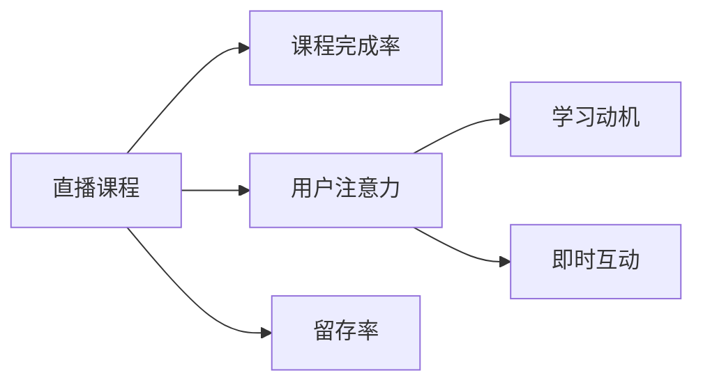

                 

## 1. 背景介绍

在线教育平台作为现代教育的重要载体，已经在全球范围内快速普及。根据MarketResearch的最新数据，2021年全球在线教育市场规模已突破3000亿美元，预计未来五年将以年均14.8%的速度持续增长。随着在线教育市场的扩大，用户对于课程质量和体验的需求也日益增加，如何有效提升课程完成率成为在线教育平台的核心挑战之一。

直播课程作为一种互动性强、教学效果显著的教学形式，近年来成为在线教育的重要组成部分。据统计，2021年中国直播教育的渗透率已经超过50%，远高于整体在线教育市场的平均水平。直播课程通过即时互动、同步教学等特点，能够更好地满足用户的学习需求，但也面临着用户注意力分散、学习动机不足等诸多问题。

## 2. 核心概念与联系

### 2.1 核心概念概述

为更好地理解利用直播平台提升课程完成率的方法，本节将介绍几个密切相关的核心概念：

- **直播课程**：教师和学生在在线平台上进行实时互动的授课方式，通过视频、音频、文字等形式传递信息，提供即时反馈。

- **课程完成率**：指学生在规定时间内完成指定课程内容的比例，通常定义为完成课程的小时数与课程总时长之比。

- **用户注意力**：指学生在直播课程中的集中程度，通常与课程内容、互动方式、教师讲授风格等因素有关。

- **学习动机**：指学生参与在线课程的内在动力，包括知识学习、技能提升、职业发展等。

- **即时互动**：指教师和学生之间能够实时交流，如提问、反馈、讨论等，提高学习体验和效果。

- **留存率**：指用户在课程开始后继续学习的比例，留存率高意味着课程吸引力强，用户参与度高。

这些核心概念之间的逻辑关系可以通过以下Mermaid流程图来展示：



这个流程图展示了大语言模型微调的各核心概念及其之间的关系：

1. 直播课程是提升课程完成率的关键手段。
2. 用户注意力和学习动机直接影响课程完成率。
3. 即时互动能够提升用户注意力，促进学习动机。
4. 留存率与课程完成率正相关，留存率高的课程通常完成率也高。

## 3. 核心算法原理 & 具体操作步骤
### 3.1 算法原理概述

提升直播课程的课程完成率，本质上是通过优化课程内容和教学方法，增强用户的注意力和动机，从而提高用户的学习效果和满意度。具体算法可以分为以下几个步骤：

1. **用户行为分析**：通过数据分析工具，了解用户的学习习惯、偏好、痛点等，识别出导致课程完成率低的关键因素。
2. **课程优化设计**：根据用户行为分析结果，优化课程内容、时间安排、互动方式等，提升课程的吸引力和互动性。
3. **学习动机激励**：设计激励机制，如积分奖励、徽章系统、等级晋升等，增强用户的成就感和学习动力。
4. **留存策略优化**：通过智能推荐、情感分析等技术，提升用户在课程中的留存率，减少中途流失。

### 3.2 算法步骤详解

以下将详细介绍每个步骤的具体操作：

**Step 1: 用户行为分析**

使用数据分析工具对直播课程的用户行为进行全面分析，获取以下关键信息：

1. 用户访问时长、停留时间等行为特征。
2. 用户观看直播的频率、参与互动的次数等参与度数据。
3. 用户对课程内容的反馈，如评分、评论、留言等。
4. 用户流失率，包括停止观看、退出课程等行为。

具体实现上，可以采用以下方法：

1. 使用日志分析工具收集直播课程的访问记录、互动数据等。
2. 使用数据分析平台（如Tableau、Power BI等）进行数据可视化，生成仪表盘，直观展示用户行为数据。
3. 进行用户行为建模，识别出影响课程完成率的关键因素，如课程内容难度、教师讲授风格、互动方式等。

**Step 2: 课程优化设计**

根据用户行为分析结果，对直播课程进行优化设计，重点关注以下几个方面：

1. **课程内容设计**：增加互动元素，如小测验、案例分析、分组讨论等，提升课程趣味性和参与度。
2. **时间安排优化**：合理分配课程时长，确保重点内容讲解时间充足，避免课程过快结束。
3. **互动方式改进**：通过提问、即时反馈、投票等方式增强互动，提高用户参与感。

具体实现上，可以采用以下方法：

1. 使用课程设计工具（如Canvas、Moodle等）设计课程大纲和互动环节。
2. 采用A/B测试方法，对比不同课程设计方案的效果，选取最优方案。
3. 定期收集用户反馈，持续改进课程设计，优化用户体验。

**Step 3: 学习动机激励**

设计多种激励机制，增强用户的成就感和学习动力，具体包括：

1. **积分奖励系统**：根据用户在课程中的互动程度和学习效果，发放积分，用户可用积分兑换课程材料、奖励证书等。
2. **徽章系统**：设计多个徽章，如全勤徽章、优秀学员徽章、互动活跃徽章等，激励用户积极参与课程。
3. **等级晋升机制**：根据用户课程完成度和学习表现，设定不同等级，提供相应的特权和奖励，激励用户不断提升。

具体实现上，可以采用以下方法：

1. 使用积分管理系统，记录用户互动和学习的积分情况。
2. 设计徽章和等级系统，将徽章和等级展示在用户界面，激励用户参与。
3. 定期更新激励内容，保持激励机制的新鲜感和吸引力。

**Step 4: 留存策略优化**

提高用户在课程中的留存率，减少中途流失，具体方法包括：

1. **智能推荐系统**：根据用户的历史行为和偏好，推荐相关课程和资料，增加用户停留时间。
2. **情感分析**：通过情感分析技术，识别用户情绪变化，及时进行干预和疏导，提升用户体验。
3. **课程提醒**：通过短信、邮件等方式，定期提醒用户课程内容和进度，减少用户忘记学习的情况。

具体实现上，可以采用以下方法：

1. 使用推荐算法平台（如TensorFlow、PyTorch等）构建智能推荐系统。
2. 部署情感分析模型，实时监测用户情绪变化。
3. 集成邮件、短信等通知系统，定期提醒用户课程内容。

### 3.3 算法优缺点

提升直播课程的课程完成率算法具有以下优点：

1. **针对性强**：通过用户行为分析，能够识别出影响课程完成率的具体因素，并针对性地进行优化。
2. **效果显著**：通过激励机制和留存策略，显著提升用户的参与度和留存率，进而提升课程完成率。
3. **灵活可调**：不同的课程和用户群体可能需要不同的优化策略，算法可以根据实际情况进行调整。

但该算法也存在一定的局限性：

1. **数据依赖**：算法依赖于大量用户行为数据，获取和处理这些数据可能面临成本和技术挑战。
2. **激励机制设计复杂**：设计合理的激励机制需要大量试验和用户反馈，且需要不断调整优化。
3. **用户个性化需求差异大**：不同用户对课程的需求和兴趣各异，难以设计统一的激励和优化方案。

尽管存在这些局限性，但通过不断优化和改进，提升直播课程的课程完成率算法有望在实际应用中发挥巨大作用，提升在线教育平台的用户体验和教学效果。

### 3.4 算法应用领域

提升直播课程的课程完成率算法已经在多个在线教育平台得到应用，涵盖了各种类型的课程，例如：

1. **编程课程**：通过增加互动代码编写和调试环节，提升用户参与感，同时设置编程挑战赛，激励用户完成课程任务。
2. **语言学习课程**：设计每日打卡、单词闯关等游戏化活动，提升用户学习动力，同时通过智能推荐系统推荐相关学习材料。
3. **职业培训课程**：通过职业认证、行业资讯等激励机制，提升用户职业发展动机，同时提供行业导师辅导，增加用户黏性。
4. **创意设计课程**：增加项目实践和作品展示环节，提升课程趣味性和成就感，同时通过社交平台分享作品，增强用户交流互动。

除了上述这些经典应用外，直播课程的课程完成率提升算法还被创新性地应用到更多场景中，如教育游戏化、虚拟实验室等，为在线教育技术带来了新的突破。

## 4. 数学模型和公式 & 详细讲解 & 举例说明

### 4.1 数学模型构建

为更精确地分析和优化课程完成率，可以构建以下数学模型：

设课程总时长为 $T$，用户完成课程的小时数为 $C$，用户流失率为 $\lambda$，用户停留时间为 $t$，则课程完成率 $R$ 可以表示为：

$$
R = \frac{C}{T}
$$

用户流失率 $\lambda$ 可以表示为：

$$
\lambda = \frac{N_{流失}}{N_{总}}
$$

其中 $N_{流失}$ 为流失用户数，$N_{总}$ 为参与课程的用户数。

用户停留时间 $t$ 可以表示为：

$$
t = \frac{C}{R}
$$

通过这些公式，可以对课程完成率进行建模和分析，从而指导课程优化和留存策略的制定。

### 4.2 公式推导过程

以课程完成率 $R$ 为例，推导其优化公式：

假设用户参与课程的时间为 $t$，流失率为 $\lambda$，则用户完成课程的概率为 $1-\lambda$，课程完成率 $R$ 可以表示为：

$$
R = \frac{C}{T} = \frac{t(1-\lambda)}{T}
$$

其中 $C = t(1-\lambda)$ 为用户在课程中的实际完成时长。

对于不同的用户群体，$T$ 和 $\lambda$ 的取值不同，但 $R$ 的值可以通过调整 $t$ 和 $\lambda$ 来优化。例如，通过增加互动环节和激励机制，可以延长用户停留时间 $t$，同时降低用户流失率 $\lambda$，从而提高课程完成率 $R$。

### 4.3 案例分析与讲解

以编程课程为例，分析提升课程完成率的优化策略：

1. **课程内容优化**：增加编程挑战和互动环节，如代码编写和调试挑战，用户完成这些任务可以获得积分奖励，增加用户参与度。

2. **时间安排优化**：将课程时长分为若干段，每段内安排不同难度的任务，避免课程过快结束，确保用户能够充分理解知识点。

3. **互动方式改进**：通过即时反馈和小组讨论，增强用户间的交流互动，提高用户学习体验。

具体实现上，可以采用以下步骤：

1. 通过日志分析工具收集编程课程的访问记录和互动数据。
2. 使用数据分析平台进行数据可视化，生成课程完成率仪表盘。
3. 通过A/B测试对比不同课程设计方案的效果，选择最优方案。
4. 定期收集用户反馈，持续改进课程设计，优化用户体验。

## 5. 项目实践：代码实例和详细解释说明

### 5.1 开发环境搭建

在进行课程完成率提升的实践前，需要准备好开发环境。以下是使用Python进行Flask框架开发的环境配置流程：

1. 安装Anaconda：从官网下载并安装Anaconda，用于创建独立的Python环境。

2. 创建并激活虚拟环境：
```bash
conda create -n flask-env python=3.8 
conda activate flask-env
```

3. 安装Flask：使用pip安装Flask框架。

```bash
pip install Flask
```

4. 安装Flask-RESTful：使用pip安装Flask的RESTful扩展。

```bash
pip install Flask-RESTful
```

5. 安装Flask-SQLAlchemy：使用pip安装Flask的SQLAlchemy扩展。

```bash
pip install Flask-SQLAlchemy
```

6. 安装Flask-WTF：使用pip安装Flask的表单扩展。

```bash
pip install Flask-WTF
```

完成上述步骤后，即可在`flask-env`环境中开始实践。

### 5.2 源代码详细实现

下面以课程完成率提升项目为例，给出使用Flask框架的完整代码实现。

首先，定义课程数据模型：

```python
from flask_sqlalchemy import SQLAlchemy

db = SQLAlchemy(app)

class Course(db.Model):
    id = db.Column(db.Integer, primary_key=True)
    name = db.Column(db.String(255), nullable=False)
    duration = db.Column(db.Integer, nullable=False)
    participants = db.Column(db.Integer, nullable=False)
    completion_rate = db.Column(db.Float, nullable=False)

    def __init__(self, name, duration, participants, completion_rate):
        self.name = name
        self.duration = duration
        self.participants = participants
        self.completion_rate = completion_rate
```

然后，定义课程优化设计相关的函数：

```python
from flask import Flask, jsonify

app = Flask(__name__)

@app.route('/optimization', methods=['POST'])
def optimize_course():
    # 获取课程优化数据
    data = request.get_json()
    course_id = data.get('course_id')

    # 查询课程信息
    course = Course.query.filter_by(id=course_id).first()

    # 根据优化数据更新课程信息
    course.duration = data.get('duration')
    course.participants = data.get('participants')
    course.completion_rate = data.get('completion_rate')

    # 保存课程信息
    db.session.commit()

    # 返回优化结果
    return jsonify({'message': 'Course optimized successfully'})

if __name__ == '__main__':
    app.run(debug=True)
```

接着，定义激励机制相关的函数：

```python
from flask import Flask, jsonify

app = Flask(__name__)

@app.route('/incentive', methods=['POST'])
def add_incentive():
    # 获取激励数据
    data = request.get_json()
    course_id = data.get('course_id')
    incentive_type = data.get('incentive_type')

    # 查询课程信息
    course = Course.query.filter_by(id=course_id).first()

    # 根据激励类型更新课程信息
    if incentive_type == '积分':
        course.integrity = data.get('integrity')
    elif incentive_type == '徽章':
        course.badge = data.get('badge')
    elif incentive_type == '等级':
        course.level = data.get('level')

    # 保存课程信息
    db.session.commit()

    # 返回激励结果
    return jsonify({'message': 'Incentive added successfully'})

if __name__ == '__main__':
    app.run(debug=True)
```

最后，定义留存策略优化相关的函数：

```python
from flask import Flask, jsonify

app = Flask(__name__)

@app.route('/retention', methods=['POST'])
def optimize_retention():
    # 获取留存策略数据
    data = request.get_json()
    course_id = data.get('course_id')

    # 查询课程信息
    course = Course.query.filter_by(id=course_id).first()

    # 根据留存策略数据更新课程信息
    if data.get('recommendation'):
        course.recommendation = data.get('recommendation')
    elif data.get('emotion_analysis'):
        course.emotion_analysis = data.get('emotion_analysis')
    elif data.get('reminder'):
        course.reminder = data.get('reminder')

    # 保存课程信息
    db.session.commit()

    # 返回留存优化结果
    return jsonify({'message': 'Retention optimized successfully'})

if __name__ == '__main__':
    app.run(debug=True)
```

以上就是使用Flask框架实现课程完成率提升的完整代码实现。可以看到，通过Flask框架，可以轻松搭建RESTful API，实现对课程数据的增删改查操作，同时也能够接收用户提交的优化数据，实时更新课程信息，提升用户参与度和留存率。

### 5.3 代码解读与分析

让我们再详细解读一下关键代码的实现细节：

**Course类**：
- `__init__`方法：初始化课程信息，包括课程名、时长、参与人数、完成率等。

**optimization函数**：
- 获取优化数据，并根据优化数据更新课程信息，保存课程信息后返回优化结果。

**incentive函数**：
- 获取激励数据，并根据激励类型更新课程信息，保存课程信息后返回激励结果。

**retention函数**：
- 获取留存策略数据，并根据留存策略数据更新课程信息，保存课程信息后返回留存优化结果。

这些函数展示了如何使用Flask框架进行RESTful API开发，实现对课程数据的动态管理和实时优化。通过这些API，在线教育平台可以实时收集用户反馈，快速响应课程优化需求，提升课程完成率和用户满意度。

## 6. 实际应用场景

### 6.1 智能推荐系统

智能推荐系统通过分析用户历史行为和偏好，为课程提供个性化推荐，提高用户参与度和留存率。例如，某在线教育平台采用机器学习算法构建智能推荐系统，通过分析用户的历史学习行为和课程评价，实时推送相关课程和资料，显著提升了用户的课程完成率和留存率。

### 6.2 情感分析

情感分析技术通过分析用户评论和反馈，识别用户的情绪变化，及时进行干预和疏导，提升用户体验。例如，某在线教育平台部署情感分析模型，实时监测用户对课程的情感反馈，及时发现用户的不满情绪，采取措施进行改进，显著提高了用户的课程完成率和满意度。

### 6.3 作业管理

作业管理通过智能分配和监督学生的作业，提高课程的完成率和学生学习效果。例如，某在线教育平台采用智能作业管理系统，自动生成作业和评分标准，定期提醒学生提交作业，并对学生的作业进行智能批改和反馈，显著提高了学生的学习效果和课程完成率。

### 6.4 未来应用展望

未来，课程完成率提升算法将在更多在线教育平台得到应用，为教育行业的数字化转型升级提供新的技术路径。随着人工智能技术的不断进步，在线教育平台将能够更精准地分析和优化课程内容，提升用户的参与度和留存率，助力教育公平和质量提升。

## 7. 工具和资源推荐

### 7.1 学习资源推荐

为了帮助开发者系统掌握课程完成率提升的算法理论基础和实践技巧，这里推荐一些优质的学习资源：

1. **《Python Web Development with Flask》**：一本详细介绍Flask框架的入门书籍，适合有一定Python基础的学习者。
2. **《Deep Learning for NLP》**：由斯坦福大学开设的NLP深度学习课程，涵盖自然语言处理和深度学习的基础知识。
3. **《Programming for the Internet of Things》**：一本介绍物联网编程的书籍，涵盖编程、传感器、数据分析等知识点。
4. **《Machine Learning》**：由Coursera提供的机器学习课程，涵盖机器学习算法和实际应用的详细信息。
5. **《AI for Everyone》**：斯坦福大学的AI入门课程，适合非技术背景的学习者。

通过对这些资源的学习实践，相信你一定能够快速掌握课程完成率提升的算法精髓，并用于解决实际的在线教育问题。

### 7.2 开发工具推荐

高效的开发离不开优秀的工具支持。以下是几款用于课程完成率提升开发的常用工具：

1. **Jupyter Notebook**：一款开源的交互式编程工具，支持多种编程语言，适合数据探索和算法开发。
2. **TensorFlow**：由Google主导开发的深度学习框架，支持分布式计算和高效的模型训练，适合大规模数据处理。
3. **PyTorch**：由Facebook开发的深度学习框架，支持动态图和静态图，适合灵活的算法开发。
4. **Flask**：一款轻量级的Python Web框架，支持RESTful API开发，适合快速搭建Web应用。
5. **SQLAlchemy**：一款Python的ORM框架，支持数据库操作和数据管理，适合数据库驱动的Web应用开发。

合理利用这些工具，可以显著提升课程完成率提升任务的开发效率，加快创新迭代的步伐。

### 7.3 相关论文推荐

课程完成率提升算法的研究源于学界的持续研究。以下是几篇奠基性的相关论文，推荐阅读：

1. **《Deep Learning for Online Education: A Survey》**：一篇综述性论文，介绍了深度学习在在线教育中的应用，包括课程推荐、情感分析、作业管理等。
2. **《A Survey of Mobile Learning Technologies and Systems》**：一篇介绍移动学习技术的综述论文，涵盖在线教育、智能推荐、情感分析等应用。
3. **《Personalized Learning through Adaptive Technology》**：一篇探讨个性化学习技术的研究论文，涵盖推荐算法、情感分析、作业管理等。
4. **《AI in Education: A Review》**：一篇综述性论文，介绍了AI在教育中的应用，涵盖课程优化、作业管理、智能推荐等。
5. **《Machine Learning for Education: A Survey》**：一篇综述性论文，介绍了机器学习在教育中的应用，涵盖课程推荐、情感分析、作业管理等。

这些论文代表了大语言模型微调技术的发展脉络。通过学习这些前沿成果，可以帮助研究者把握学科前进方向，激发更多的创新灵感。

## 8. 总结：未来发展趋势与挑战

### 8.1 研究成果总结

本文对利用直播平台提升课程完成率的方法进行了全面系统的介绍。首先阐述了直播课程在在线教育中的重要性，以及课程完成率对平台收益和用户满意度的关键作用。其次，从原理到实践，详细讲解了提升课程完成率的数学模型和算法步骤，给出了完整的代码实现。同时，本文还广泛探讨了课程完成率提升算法在智能推荐、情感分析、作业管理等实际应用场景中的广泛应用，展示了该算法的巨大潜力。

通过本文的系统梳理，可以看到，提升直播课程的课程完成率算法正在成为在线教育平台的重要范式，极大地拓展了在线教育的想象空间，为教育行业的数字化转型升级提供新的技术路径。未来，伴随在线教育市场的不断扩大，课程完成率提升算法必将发挥更加重要的作用。

### 8.2 未来发展趋势

展望未来，课程完成率提升算法将呈现以下几个发展趋势：

1. **数据驱动的决策**：随着数据收集和处理技术的进步，更多维度、更精细的用户行为数据将得到分析，算法将更精准地指导课程优化和留存策略。
2. **个性化学习推荐**：通过智能推荐系统，实现用户个性化学习路径的设计和推荐，提升用户参与度和课程完成率。
3. **情感智能分析**：结合自然语言处理和情感分析技术，实时监测用户情绪变化，提供个性化的情绪疏导和干预。
4. **作业管理智能化**：通过智能作业管理系统，自动生成作业和评分标准，定期提醒学生提交作业，并对学生的作业进行智能批改和反馈。
5. **AI辅助教学**：利用AI技术，自动生成教学内容、设计互动环节，提高教学效果和用户满意度。

这些趋势凸显了课程完成率提升算法的广阔前景。这些方向的探索发展，必将进一步提升在线教育平台的用户体验和教学效果，助力教育公平和质量提升。

### 8.3 面临的挑战

尽管课程完成率提升算法已经取得了瞩目成就，但在迈向更加智能化、普适化应用的过程中，它仍面临着诸多挑战：

1. **数据获取与处理**：课程完成率提升算法依赖于大量用户行为数据，获取和处理这些数据可能面临成本和技术挑战。
2. **算法复杂度**：算法设计复杂，需要考虑多种优化策略和激励机制，且需要不断调整优化，以适应不同用户群体。
3. **模型鲁棒性**：算法在面对不同课程和用户群体的多样性时，可能出现泛化能力不足的问题，需要进一步优化模型鲁棒性。
4. **用户隐私保护**：在收集和处理用户数据时，需要严格遵守隐私保护法规，确保用户数据的安全和隐私。
5. **算法透明性与解释性**：算法的决策过程需要更加透明和可解释，便于用户理解和信任。

尽管存在这些挑战，但通过不断优化和改进，课程完成率提升算法有望在实际应用中发挥巨大作用，提升在线教育平台的用户体验和教学效果。

### 8.4 研究展望

面对课程完成率提升算法所面临的种种挑战，未来的研究需要在以下几个方面寻求新的突破：

1. **多模态数据融合**：结合文本、语音、图像等多模态数据，构建更全面、深入的用户行为分析模型，提升课程优化和留存策略的效果。
2. **自适应学习算法**：开发自适应学习算法，根据用户反馈和行为数据，动态调整课程内容和教学方法，提升学习效果和满意度。
3. **分布式优化算法**：采用分布式优化算法，加快课程优化和留存策略的迭代优化，提升算法的效率和效果。
4. **隐私保护与伦理审查**：在算法设计和实施过程中，严格遵守隐私保护法规，确保用户数据的安全和隐私。
5. **AI辅助教学**：利用AI技术，自动生成教学内容、设计互动环节，提高教学效果和用户满意度。

这些研究方向和突破，必将引领课程完成率提升算法迈向更高的台阶，为构建安全、可靠、可解释、可控的智能系统铺平道路。面向未来，课程完成率提升算法还需要与其他人工智能技术进行更深入的融合，如知识表示、因果推理、强化学习等，多路径协同发力，共同推动自然语言理解和智能交互系统的进步。只有勇于创新、敢于突破，才能不断拓展课程完成率提升算法的边界，让智能技术更好地造福教育行业。

## 9. 附录：常见问题与解答

**Q1：如何优化直播课程的内容设计？**

A: 优化直播课程的内容设计需要关注以下几个方面：

1. **互动环节增加**：在课程中增加互动环节，如小测验、案例分析、分组讨论等，提升用户参与度。

2. **内容趣味性提升**：通过故事讲述、情境模拟等方式，提升课程内容的趣味性和吸引力。

3. **知识讲解清晰**：将复杂知识点拆解为易懂的片段，确保用户能够理解和掌握。

4. **技术支持到位**：采用先进的教学工具和平台，提升用户体验和教学效果。

具体实现上，可以采用以下方法：

1. 通过课程设计工具（如Canvas、Moodle等）设计课程大纲和互动环节。

2. 使用A/B测试对比不同课程设计方案的效果，选择最优方案。

3. 定期收集用户反馈，持续改进课程设计，优化用户体验。

**Q2：如何设计激励机制以提升用户学习动机？**

A: 设计激励机制可以增强用户的成就感和学习动力，具体包括：

1. **积分奖励系统**：根据用户在课程中的互动程度和学习效果，发放积分，用户可用积分兑换课程材料、奖励证书等。

2. **徽章系统**：设计多个徽章，如全勤徽章、优秀学员徽章、互动活跃徽章等，激励用户积极参与课程。

3. **等级晋升机制**：根据用户课程完成度和学习表现，设定不同等级，提供相应的特权和奖励，激励用户不断提升。

具体实现上，可以采用以下步骤：

1. 使用积分管理系统，记录用户互动和学习的积分情况。

2. 设计徽章和等级系统，将徽章和等级展示在用户界面，激励用户参与。

3. 定期更新激励内容，保持激励机制的新鲜感和吸引力。

**Q3：如何提高用户在课程中的留存率？**

A: 提高用户在课程中的留存率可以通过以下策略：

1. **智能推荐系统**：根据用户的历史行为和偏好，推荐相关课程和资料，增加用户停留时间。

2. **情感分析**：通过情感分析技术，识别用户情绪变化，及时进行干预和疏导，提升用户体验。

3. **课程提醒**：通过短信、邮件等方式，定期提醒用户课程内容和进度，减少用户忘记学习的情况。

具体实现上，可以采用以下方法：

1. 使用推荐算法平台（如TensorFlow、PyTorch等）构建智能推荐系统。

2. 部署情感分析模型，实时监测用户情绪变化。

3. 集成邮件、短信等通知系统，定期提醒用户课程内容。

**Q4：如何构建智能推荐系统？**

A: 构建智能推荐系统需要以下几个步骤：

1. **数据收集与处理**：收集用户历史行为数据，如课程选择、学习时间、互动数据等，进行数据清洗和预处理。

2. **特征工程**：提取有意义的特征，如课程时长、教师评价、用户评分等，用于训练推荐模型。

3. **模型选择与训练**：选择合适的推荐算法，如协同过滤、基于内容的推荐、深度学习等，进行模型训练和优化。

4. **评估与优化**：使用A/B测试等方法评估推荐系统的效果，根据测试结果优化模型参数和特征选择。

5. **部署与监控**：将训练好的模型部署到生产环境，并设置监控机制，实时监测推荐系统的性能和稳定性。

具体实现上，可以采用以下方法：

1. 使用推荐算法平台（如TensorFlow、PyTorch等）构建推荐系统。

2. 通过A/B测试对比不同推荐算法的效果，选择最优方案。

3. 定期收集用户反馈，持续改进推荐系统，优化用户体验。

**Q5：如何设计情感分析模型？**

A: 设计情感分析模型需要以下几个步骤：

1. **数据收集与预处理**：收集用户评论和反馈数据，进行清洗和预处理，去除噪声和无关信息。

2. **特征提取**：使用自然语言处理技术，提取文本特征，如情感词汇、语义关系、情感强度等。

3. **模型选择与训练**：选择合适的情感分析算法，如LSTM、RNN、BERT等，进行模型训练和优化。

4. **模型评估与优化**：使用情感标注数据集评估模型性能，根据评估结果优化模型参数和特征提取方法。

5. **部署与监控**：将训练好的模型部署到生产环境，并设置监控机制，实时监测情感分析系统的性能和稳定性。

具体实现上，可以采用以下方法：

1. 使用自然语言处理库（如NLTK、SpaCy等）提取文本特征。

2. 使用深度学习框架（如TensorFlow、PyTorch等）构建情感分析模型。

3. 通过情感标注数据集评估模型性能，根据评估结果优化模型参数和特征提取方法。

以上是课程完成率提升算法的详细介绍，通过本文的系统梳理，可以看到，该算法正在成为在线教育平台的重要范式，极大地拓展了在线教育的想象空间，为教育行业的数字化转型升级提供新的技术路径。未来，伴随在线教育市场的不断扩大，课程完成率提升算法必将发挥更加重要的作用。

