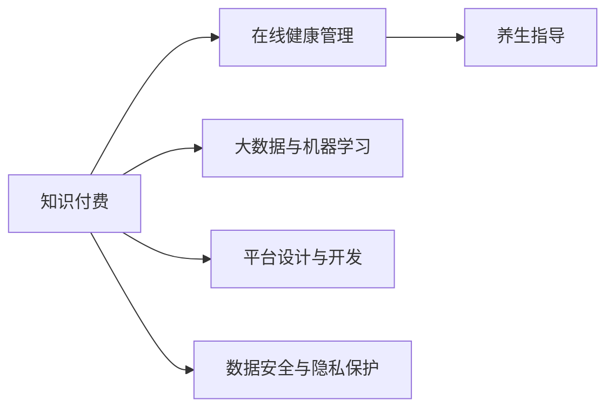

                 

# 如何利用知识付费实现在线健康管理与养生指导？

在数字经济蓬勃发展的今天，健康管理与养生指导逐渐成为人们关注的热点。然而，传统线下的健康管理方式存在诸多局限，如成本高、覆盖面小、无法随时获得专业指导等。知识付费的兴起为在线健康管理与养生指导提供了新的可能性。本文将详细介绍如何利用知识付费技术实现在线健康管理与养生指导，帮助读者构建自己的健康管理平台。

## 1. 背景介绍

### 1.1 问题由来

随着社会的发展和人民生活水平的提高，健康管理逐渐成为人们关注的重点。传统健康管理方式主要依赖线下的医疗服务机构，但由于资源有限，难以覆盖到每个人。同时，由于健康管理服务的专业性强，线下的健康管理费用高昂，无法满足大众的健康需求。

知识付费的兴起为解决这一问题提供了新的思路。通过在线平台提供健康管理与养生指导，用户可以以较低的费用获取专业服务，并且可以随时进行健康管理和养生指导，极大地提高了健康管理的便利性和覆盖面。

### 1.2 问题核心关键点

知识付费实现在线健康管理与养生指导的关键点包括：
- 数据采集与处理：收集用户健康数据，并进行预处理和特征提取。
- 模型构建与训练：构建健康管理与养生指导模型，并进行训练与优化。
- 平台设计与开发：搭建在线平台，实现用户管理、内容推荐、支付等功能。
- 数据安全与隐私保护：保障用户数据的安全与隐私，防止数据泄露与滥用。

以下将详细介绍这些核心关键点，帮助读者系统地构建在线健康管理与养生指导平台。

## 2. 核心概念与联系

### 2.1 核心概念概述

要实现在线健康管理与养生指导，需要以下核心概念：

- **知识付费**：一种在线商业模式，用户为获取知识和信息而支付费用。通过付费获取专业服务，提升信息获取的质量和效率。
- **在线健康管理**：通过互联网平台，用户可以进行健康数据收集、健康评估、健康干预等。
- **养生指导**：结合中医、食疗、运动等知识，提供个性化的养生方案，帮助用户维持健康。
- **大数据与机器学习**：通过分析大量的健康数据，构建模型进行健康管理与养生指导。
- **平台设计与开发**：搭建在线平台，实现健康管理与养生指导服务。
- **数据安全与隐私保护**：保障用户数据的安全与隐私，防止数据泄露与滥用。

这些核心概念之间有紧密的联系。例如，大数据与机器学习为在线健康管理与养生指导提供技术支持，而平台设计与开发是实现这一过程的基础。数据安全与隐私保护则是保障用户数据安全的前提。

### 2.2 核心概念原理和架构的 Mermaid 流程图



该图展示了知识付费在线健康管理与养生指导的各个环节。

## 3. 核心算法原理 & 具体操作步骤

### 3.1 算法原理概述

在线健康管理与养生指导主要依赖于以下算法原理：

1. **大数据分析**：收集和分析大量的健康数据，如用户的生理指标、运动数据、饮食习惯等，进行健康评估和风险预警。
2. **机器学习模型**：使用机器学习模型对健康数据进行分析，构建个性化健康管理与养生指导方案。
3. **自然语言处理**：通过自然语言处理技术，将用户的健康问题转化为机器可以理解的模型输入，提供个性化的养生指导。

### 3.2 算法步骤详解

1. **数据采集与处理**：
   - 收集用户健康数据，如身高、体重、血压、血糖等生理指标，运动数据，饮食习惯等。
   - 使用数据清洗和特征提取技术，对数据进行处理，去除噪声和异常值，提取关键特征。

2. **模型构建与训练**：
   - 选择合适的机器学习模型，如决策树、随机森林、神经网络等。
   - 使用历史健康数据对模型进行训练，优化模型参数。

3. **平台设计与开发**：
   - 搭建在线平台，实现用户管理、内容推荐、支付等功能。
   - 使用前端技术，如React、Vue等，实现平台界面设计。
   - 使用后端技术，如Django、Flask等，实现平台功能逻辑。

4. **数据安全与隐私保护**：
   - 使用加密技术，如AES、RSA等，保护用户数据的安全。
   - 制定数据隐私保护政策，保障用户隐私权。

### 3.3 算法优缺点

在线健康管理与养生指导的优势包括：
- 用户可以随时进行健康管理和养生指导，提升健康管理的便利性。
- 覆盖面广，能够覆盖更多的人群，提升健康管理的普及率。
- 成本较低，用户可以以较低的费用获取专业服务。

劣势包括：
- 数据隐私保护难度较大，用户数据可能被滥用。
- 数据质量问题，数据采集和处理过程中可能存在噪声和误差。
- 模型依赖大量数据，在数据量较少的情况下，效果可能不佳。

### 3.4 算法应用领域

在线健康管理与养生指导可以应用于以下几个领域：

1. **慢性病管理**：通过分析用户的生理指标，提供个性化的慢性病管理方案。
2. **运动健身指导**：结合用户的运动数据，提供个性化的运动健身方案。
3. **饮食健康指导**：分析用户的饮食习惯，提供个性化的饮食健康建议。
4. **心理健康指导**：通过自然语言处理技术，理解用户的心理健康问题，提供个性化的心理疏导方案。

## 4. 数学模型和公式 & 详细讲解 & 举例说明

### 4.1 数学模型构建

在线健康管理与养生指导的数学模型可以描述为：

$$
\text{健康管理} = f(\text{生理指标}, \text{运动数据}, \text{饮食习惯}, \text{心理健康})
$$

其中 $f$ 表示健康管理模型的映射关系。

### 4.2 公式推导过程

以慢性病管理为例，可以使用随机森林模型进行健康评估：

$$
\text{健康风险} = \text{RandomForest}(\text{生理指标}, \text{运动数据}, \text{饮食习惯})
$$

其中，随机森林模型通过对历史健康数据进行训练，学习健康风险与生理指标、运动数据和饮食习惯之间的关系。

### 4.3 案例分析与讲解

以某用户的健康数据为例，使用随机森林模型进行健康风险评估：

1. 收集该用户的生理指标、运动数据和饮食习惯数据。
2. 使用数据清洗和特征提取技术，对数据进行处理。
3. 将处理后的数据输入随机森林模型，得到健康风险评估结果。
4. 根据评估结果，提供个性化的慢性病管理方案。

## 5. 项目实践：代码实例和详细解释说明

### 5.1 开发环境搭建

以下是在线健康管理与养生指导平台的开发环境搭建步骤：

1. **安装Python**：
   ```
   sudo apt-get update
   sudo apt-get install python3
   ```

2. **安装Django**：
   ```
   pip install django
   ```

3. **安装React**：
   ```
   npm install -g create-react-app
   ```

4. **搭建Django后端**：
   ```
   django-admin startproject healthmanagement
   ```

5. **搭建React前端**：
   ```
   create-react-app frontend
   ```

### 5.2 源代码详细实现

以下是在线健康管理与养生指导平台的关键代码实现：

1. **Django后端代码**：
   ```python
   from django.shortcuts import render
   from django.http import JsonResponse
   from sklearn.ensemble import RandomForestClassifier

   # 加载模型
   model = RandomForestClassifier()

   # 训练模型
   model.fit(X_train, y_train)

   def home(request):
       return render(request, 'home.html')

   def health_risk(request):
       physiological_data = request.POST.get('physiological_data')
       exercise_data = request.POST.get('exercise_data')
       dietary_data = request.POST.get('dietary_data')
       # 将数据处理并输入模型
       data = preprocess_data(physiological_data, exercise_data, dietary_data)
       result = model.predict(data)
       return JsonResponse({'result': result})
   ```

2. **React前端代码**：
   ```javascript
   import React, { useState } from 'react';
   import axios from 'axios';

   const HealthManagement = () => {
       const [physiological_data, setPhysiologicalData] = useState('');
       const [exercise_data, setExerciseData] = useState('');
       const [dietary_data, setDietaryData] = useState('');

       const handleHealthRisk = async () => {
           const result = await axios.post('/health_risk', {
               physiological_data,
               exercise_data,
               dietary_data
           });
           console.log(result.data);
       }

       return (
           <div>
               <input type="text" value={physiological_data} onChange={e => setPhysiologicalData(e.target.value)} />
               <input type="text" value={exercise_data} onChange={e => setExerciseData(e.target.value)} />
               <input type="text" value={dietary_data} onChange={e => setDietaryData(e.target.value)} />
               <button onClick={handleHealthRisk}>计算健康风险</button>
           </div>
       );
   }

   export default HealthManagement;
   ```

### 5.3 代码解读与分析

1. **Django后端代码解释**：
   - `home`函数返回主页模板。
   - `health_risk`函数处理健康风险评估请求，将用户输入的生理指标、运动数据和饮食习惯数据处理后输入模型，并返回评估结果。

2. **React前端代码解释**：
   - `HealthManagement`组件实现用户输入生理指标、运动数据和饮食习惯数据，并点击按钮触发健康风险评估。

3. **代码运行结果**：
   - 用户输入数据后，后端接收请求并处理数据，返回健康风险评估结果。
   - 前端显示评估结果，用户得到个性化的健康管理与养生指导方案。

## 6. 实际应用场景

在线健康管理与养生指导平台可以应用于以下实际场景：

1. **医院健康管理系统**：将平台与医院健康管理系统对接，实现慢性病患者的个性化健康管理。
2. **社区健康管理中心**：在社区健康管理中心搭建平台，为居民提供健康管理与养生指导。
3. **企业员工健康管理**：企业可以将平台作为员工健康管理工具，提升员工健康水平。
4. **家庭健康管理**：家庭可以将平台作为健康管理工具，帮助家庭成员进行健康管理与养生指导。

## 7. 工具和资源推荐

### 7.1 学习资源推荐

1. **《健康数据科学与统计》**：一本关于健康数据科学和统计分析的书籍，适合健康管理与养生指导平台的开发者学习。
2. **《机器学习实战》**：介绍机器学习模型的实现与应用，适合健康管理与养生指导平台的开发者学习。
3. **Coursera上的《健康数据分析与建模》课程**：由斯坦福大学开设，涵盖健康数据分析与建模的基本方法。

### 7.2 开发工具推荐

1. **Django**：适合搭建后端平台，具有良好的扩展性和安全性。
2. **React**：适合搭建前端界面，具有良好的用户体验和开发效率。
3. **PostgreSQL**：适合作为健康管理平台的数据库，具有良好的扩展性和安全性。

### 7.3 相关论文推荐

1. **《健康数据挖掘与分析》**：介绍健康数据挖掘与分析的方法和应用，适合健康管理与养生指导平台的开发者学习。
2. **《机器学习在健康管理中的应用》**：介绍机器学习在健康管理中的应用，适合健康管理与养生指导平台的开发者学习。
3. **《健康信息系统的设计与实现》**：介绍健康信息系统的设计与实现方法，适合健康管理与养生指导平台的开发者学习。

## 8. 总结：未来发展趋势与挑战

### 8.1 研究成果总结

在线健康管理与养生指导平台利用知识付费技术，提升了健康管理的便利性和普及率，具有重要的应用价值。通过大数据分析和机器学习模型，为每个用户提供个性化的健康管理与养生指导方案，帮助用户保持健康。

### 8.2 未来发展趋势

未来，在线健康管理与养生指导平台将呈现以下几个发展趋势：

1. **智能化水平提升**：随着深度学习技术的不断发展，在线健康管理与养生指导平台将逐步引入智能推荐、智能诊断等技术，提升平台的用户体验和效果。
2. **多模态数据融合**：未来平台将引入多模态数据，如生理指标、运动数据、饮食数据、心理数据等，构建更全面的健康管理与养生指导方案。
3. **个性化程度提升**：通过机器学习模型，平台将提供更个性化的健康管理与养生指导方案，提升用户的满意度和依从性。
4. **用户参与度提升**：通过平台交互设计，提升用户的参与度，鼓励用户主动进行健康管理和养生指导。

### 8.3 面临的挑战

在线健康管理与养生指导平台在发展过程中面临以下挑战：

1. **数据隐私问题**：平台需要收集大量的健康数据，如何保障用户数据隐私是一个重要的挑战。
2. **数据质量问题**：健康数据的采集和处理过程中可能存在噪声和误差，如何保证数据质量是一个重要的挑战。
3. **技术更新问题**：深度学习等技术快速发展，平台需要不断更新和升级，以保持技术先进性。
4. **用户体验问题**：平台需要提供良好的用户体验，才能吸引用户持续使用。

### 8.4 研究展望

未来的研究将围绕以下几个方向展开：

1. **隐私保护技术**：研究更先进的数据隐私保护技术，如差分隐私、同态加密等，保障用户数据隐私。
2. **多模态数据融合技术**：研究多模态数据融合方法，构建更全面的健康管理与养生指导方案。
3. **智能推荐技术**：研究智能推荐算法，提升健康管理与养生指导方案的个性化程度。
4. **用户体验优化**：研究平台交互设计，提升用户体验，鼓励用户持续使用。

## 9. 附录：常见问题与解答

**Q1：在线健康管理与养生指导平台如何保障用户数据隐私？**

A: 平台可以使用差分隐私技术、同态加密技术等手段，保护用户数据隐私。同时，制定严格的数据隐私保护政策，确保用户数据的安全与隐私。

**Q2：如何提升健康管理与养生指导平台的用户体验？**

A: 平台可以通过优化界面设计、引入智能推荐、增加用户互动等方式，提升用户体验。同时，及时响应用户反馈，不断改进平台功能。

**Q3：在线健康管理与养生指导平台面临的主要挑战是什么？**

A: 平台面临的主要挑战包括数据隐私问题、数据质量问题、技术更新问题和用户体验问题。这些问题需要通过技术手段、政策手段和用户体验设计等方式解决。

作者：禅与计算机程序设计艺术 / Zen and the Art of Computer Programming

