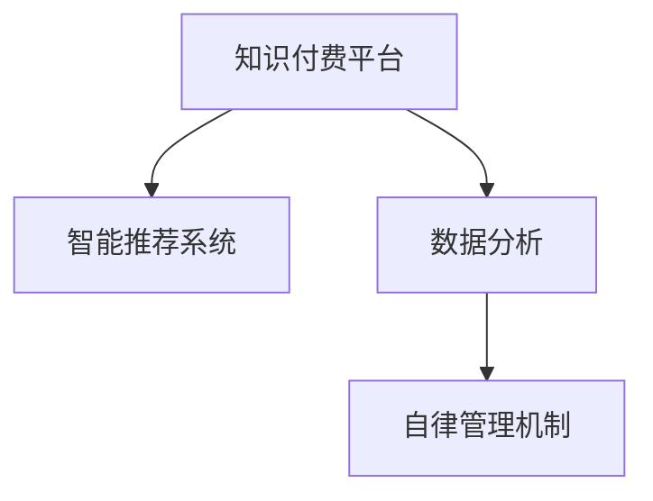
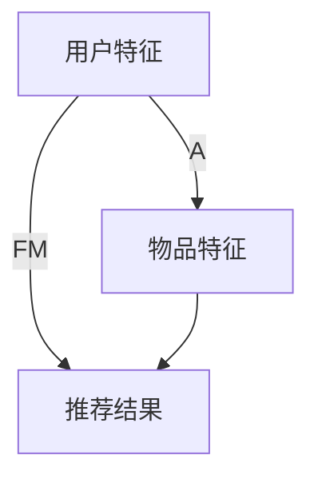

                 

# 如何利用知识付费实现在线学习计划与自律管理？

> 关键词：知识付费,在线学习,自律管理,学习计划,智能推荐,数据分析

## 1. 背景介绍

### 1.1 问题由来
在数字化时代的今天，知识付费正逐渐成为人们获取新知识、提升专业技能的重要途径。无论是大学生、职场人士，还是终身学习者，都希望能够在繁重的工作和学习之余，高效地吸收新知识，提升自我。然而，随着学习资源的多样化，如何高效、有针对性地选择学习内容，成为了许多人面临的难题。

此外，如何养成自律的学习习惯，合理安排学习计划，也成为了困扰学习者的重要问题。自我管理能力的不足，常常导致学习计划难以执行，影响学习效果。针对这些问题，本文将探讨如何利用知识付费平台，结合智能推荐和数据分析技术，实现个性化学习计划的制定与执行，帮助用户提升学习效率和自律管理能力。

### 1.2 问题核心关键点
本文将围绕以下几个核心问题进行探讨：

1. **知识付费平台的选择与使用**：如何在众多知识付费平台中，选择适合自己的平台，并有效利用其丰富的学习资源。
2. **智能推荐算法的设计与实现**：如何设计一个高效、准确的智能推荐系统，为用户推荐个性化的学习内容。
3. **数据分析与学习效果评估**：如何利用数据分析技术，评估学习计划的效果，调整优化学习策略。
4. **自律管理机制的构建**：如何设计有效的自律管理机制，帮助用户坚持学习计划，养成良好的学习习惯。

通过系统地解决以上问题，本文将提供一套全面、高效的知识付费与自律管理解决方案，帮助用户实现高效学习与自我管理。

## 2. 核心概念与联系

### 2.1 核心概念概述

为更好地理解如何利用知识付费实现在线学习与自律管理，本节将介绍几个密切相关的核心概念：

- **知识付费平台**：以在线课程、电子书、音频、视频等多种形式提供专业知识的平台。常见的有Coursera、Udacity、网易云课堂等。
- **智能推荐系统**：通过数据分析、机器学习等技术，为用户推荐个性化学习内容，提升学习效率的系统。
- **数据分析**：利用统计学、数据挖掘等技术，对学习数据进行分析，发现学习规律和趋势，优化学习策略。
- **自律管理机制**：结合心理学、行为科学等原理，设计能够激励、约束用户坚持学习计划的系统。

这些概念之间的逻辑关系可以通过以下Mermaid流程图来展示：



这个流程图展示了几类核心概念及其之间的关系：

1. 用户通过知识付费平台获取学习资源，并利用智能推荐系统进行个性化推荐。
2. 数据分析系统对学习行为数据进行分析，评估学习效果，调整推荐策略。
3. 自律管理机制帮助用户养成良好学习习惯，坚持学习计划。

这些概念共同构成了知识付费与自律管理的核心框架，使得用户能够高效、有针对性地进行学习，同时保持良好的学习习惯。

## 3. 核心算法原理 & 具体操作步骤
### 3.1 算法原理概述

知识付费平台结合智能推荐和自律管理，利用知识付费的“被动”特性和智能推荐与自律管理的“主动”特性，共同提升学习效果和自律性。其核心思想是：通过智能推荐系统，为用户精准推送个性化学习内容，减少其信息过载；同时，利用自律管理机制，激励用户坚持学习计划，养成良好的学习习惯。

### 3.2 算法步骤详解

#### 3.2.1 用户画像构建

**Step 1:** 用户注册与信息收集
用户在知识付费平台注册后，填写基本信息，如年龄、职业、兴趣等。同时，平台可以通过用户的学习历史、评价数据等，进一步收集和分析用户画像信息。

**Step 2:** 特征提取与维度设计
基于用户画像信息，设计合适的特征维度，如学习偏好、知识领域、时间偏好等。特征维度设计应涵盖用户的多样化需求，同时避免维度之间的冗余和信息泄露。

#### 3.2.2 智能推荐算法

**Step 3:** 推荐模型选择与训练
根据用户画像信息，选择合适的推荐模型，如协同过滤、基于内容的推荐、深度学习推荐等。对于深度学习推荐模型，需使用历史学习行为数据进行训练。

**Step 4:** 特征嵌入与相似度计算
将用户画像中的特征进行向量嵌入，计算用户与学习内容的相似度。常用的嵌入方法包括TF-IDF、Word2Vec、Glove等。

**Step 5:** 排名与排序
基于相似度计算结果，对学习内容进行排名和排序，生成推荐列表。排名方法可根据任务需求选择，如基于点击率的排序、基于准确率的排序等。

#### 3.2.3 自律管理机制

**Step 6:** 学习计划制定
根据用户的学习偏好和时间偏好，智能推荐系统设计个性化的学习计划，建议用户每日或每周学习时长、学习内容等。

**Step 7:** 学习进度跟踪与反馈
平台通过学习进度跟踪，记录用户的学习行为数据，如学习时间、学习内容、学习效果等。结合反馈机制，动态调整学习计划，提高学习效率。

**Step 8:** 激励机制设计
设计多种激励机制，如打卡奖励、积分系统、学习成就展示等，鼓励用户坚持学习计划，提升自律性。

### 3.3 算法优缺点

#### 3.3.1 智能推荐算法的优缺点

**优点**：
1. **个性化**：能够根据用户的学习偏好和历史行为，为用户推荐个性化的学习内容，减少信息过载。
2. **高效性**：通过算法自动推荐，节省用户查找学习资源的时间和精力。

**缺点**：
1. **推荐质量**：算法推荐质量依赖于数据质量，可能存在冷启动问题，初期推荐效果不佳。
2. **多样性**：过分依赖算法推荐，可能导致用户获取的知识过于单一，缺乏多样性。

#### 3.3.2 自律管理机制的优缺点

**优点**：
1. **可执行性**：通过明确的学习计划和激励机制，帮助用户养成良好学习习惯，坚持学习。
2. **可调整性**：用户可根据自身学习情况，动态调整学习计划，适应不同的学习阶段。

**缺点**：
1. **执行难度**：自律管理需要用户主动参与，执行难度较大，特别是对于自律性较弱的用户。
2. **过度依赖**：过度依赖自律管理，可能导致用户忽视内在动机的培养，形成短期行为。

### 3.4 算法应用领域

智能推荐和自律管理算法不仅适用于知识付费平台，还广泛应用于多个领域，如电商推荐、社交网络、内容创作等。在知识付费平台上，结合智能推荐和自律管理，能够显著提升用户的学习效果和平台的用户黏性。

## 4. 数学模型和公式 & 详细讲解 & 举例说明
### 4.1 数学模型构建

在知识付费平台中，用户的学习行为可以看作是一个多维时间序列数据。设用户的学习行为序列为 $x_t = [x_{t-1}, x_{t-2}, \ldots, x_1, x_0]$，其中 $x_t$ 表示用户在时间 $t$ 的学习行为，如观看视频时长、阅读文章数量等。

推荐模型的目标是通过用户行为数据，预测用户对学习内容的偏好 $y_t$。常用的推荐模型包括协同过滤、基于内容的推荐和深度学习推荐等。

### 4.2 公式推导过程

#### 4.2.1 协同过滤推荐

协同过滤推荐基于用户行为相似性，将相似用户推荐的学习内容推荐给目标用户。设用户 $u$ 和内容 $i$ 之间的相似度为 $s_{ui}$，推荐模型的目标是最大化用户与内容的相似度总和。

推荐公式为：
$$
\hat{y}_t = \sum_{u \in \mathcal{U}} s_{ui}x_u + \sum_{i \in \mathcal{I}} s_{iu}x_i
$$

其中 $\mathcal{U}$ 为所有用户的集合，$\mathcal{I}$ 为所有内容的集合。

#### 4.2.2 基于内容的推荐

基于内容的推荐通过分析学习内容的特征，找到与用户兴趣最相关的内容。设内容 $i$ 的特征向量为 $\vec{c}_i$，用户 $u$ 对内容 $i$ 的评分 $r_{ui}$ 表示为：
$$
r_{ui} = \vec{c}_i^\top\vec{h}_u
$$
其中 $\vec{h}_u$ 为用户 $u$ 的兴趣向量。

推荐模型的目标是最大化内容与用户兴趣的匹配度，即最大化 $r_{ui}$ 的值。

#### 4.2.3 深度学习推荐

深度学习推荐使用神经网络模型，学习用户与内容的特征映射，预测用户对内容的偏好。常用的模型包括基于FM（Factorization Machines）的推荐模型和基于Attention的推荐模型。

以基于FM的推荐模型为例，其结构如图1所示：



图1：基于FM的推荐模型结构图

#### 4.2.4 学习进度跟踪与反馈

学习进度跟踪与反馈模型通过时间序列数据分析，预测用户的学习进度和效果，及时调整学习计划。设用户的学习进度序列为 $p_t = [p_{t-1}, p_{t-2}, \ldots, p_1, p_0]$，学习效果序列为 $e_t = [e_{t-1}, e_{t-2}, \ldots, e_1, e_0]$。

推荐模型的目标是通过时间序列数据，预测用户的学习进度 $p_{t+1}$ 和学习效果 $e_{t+1}$。常用的模型包括ARIMA（AutoRegressive Integrated Moving Average）和LSTM（Long Short-Term Memory）等。

### 4.3 案例分析与讲解

以Coursera平台为例，分析其智能推荐与自律管理系统的设计思路和实现方法。

**Step 1:** 用户画像构建
Coursera平台收集用户基本信息，包括年龄、职业、教育背景等。同时，平台通过用户的课程学习历史、课程评分、课程完成度等行为数据，构建用户画像。

**Step 2:** 智能推荐算法
Coursera平台采用基于内容的推荐算法，根据用户的学习行为数据，为用户推荐与其兴趣最相关的课程。平台使用TF-IDF算法计算课程特征向量，并使用用户兴趣向量进行相似度计算。

**Step 3:** 自律管理机制
Coursera平台提供个性化学习计划，建议用户每日学习时长和课程内容。平台通过学习进度跟踪，记录用户的学习行为数据，并结合学习进度反馈，动态调整学习计划。

**Step 4:** 激励机制设计
Coursera平台设计多种激励机制，如课程认证证书、学习成就展示等，激励用户坚持学习计划。平台还通过社区互动，增强用户的学习动力。

## 5. 项目实践：代码实例和详细解释说明
### 5.1 开发环境搭建

在进行项目实践前，我们需要准备好开发环境。以下是使用Python进行Keras开发的环境配置流程：

1. 安装Anaconda：从官网下载并安装Anaconda，用于创建独立的Python环境。

2. 创建并激活虚拟环境：
```bash
conda create -n pytorch-env python=3.8 
conda activate pytorch-env
```

3. 安装TensorFlow和Keras：
```bash
pip install tensorflow
pip install keras
```

4. 安装各类工具包：
```bash
pip install numpy pandas scikit-learn matplotlib tqdm jupyter notebook ipython
```

完成上述步骤后，即可在`pytorch-env`环境中开始项目实践。

### 5.2 源代码详细实现

下面我们以Coursera平台为例，给出使用Keras进行智能推荐和自律管理的代码实现。

首先，定义推荐模型的特征提取函数：

```python
from tensorflow.keras.layers import Input, Embedding, Dense
from tensorflow.keras.models import Model

def build_recommender_model(user_feats, item_feats):
    user_input = Input(shape=(user_feats,), name='user')
    item_input = Input(shape=(item_feats,), name='item')
    user_embed = Embedding(user_feats, 128, name='user_embedding')(user_input)
    item_embed = Embedding(item_feats, 128, name='item_embedding')(item_input)
    user_item_inter = Dot(axes=1)([user_embed, item_embed])
    user_item_inter = Flatten()(user_item_inter)
    x = Dense(128, activation='relu')(user_item_inter)
    recommender = Dense(1, activation='sigmoid')(x)
    return Model(inputs=[user_input, item_input], outputs=recommender)
```

然后，定义自律管理模型的学习进度跟踪与反馈函数：

```python
from tensorflow.keras.layers import LSTM, Dense
from tensorflow.keras.models import Sequential

def build_learning_plan_model():
    model = Sequential()
    model.add(LSTM(64, return_sequences=True, input_shape=(max_seq_len, 1)))
    model.add(LSTM(64))
    model.add(Dense(1, activation='sigmoid'))
    model.compile(loss='binary_crossentropy', optimizer='adam', metrics=['accuracy'])
    return model
```

最后，启动推荐系统与自律管理系统的训练流程：

```python
user_feats = 10
item_feats = 20
max_seq_len = 100

recommender_model = build_recommender_model(user_feats, item_feats)
recommender_model.compile(loss='binary_crossentropy', optimizer='adam', metrics=['accuracy'])

learning_plan_model = build_learning_plan_model()

# 训练推荐模型
train_data = ...
train_labels = ...
recommender_model.fit([train_data['user'], train_data['item']], train_labels, epochs=10, batch_size=32)

# 训练自律管理模型
train_data = ...
train_labels = ...
learning_plan_model.fit(train_data, train_labels, epochs=10, batch_size=32)
```

以上就是使用Keras进行Coursera平台智能推荐和自律管理的完整代码实现。可以看到，Keras提供了高度抽象的API，使得模型搭建和训练变得简单快捷。

### 5.3 代码解读与分析

让我们再详细解读一下关键代码的实现细节：

**特征提取函数**：
- `build_recommender_model`函数：定义基于内容的推荐模型。使用嵌入层（Embedding）将用户特征和物品特征转换为向量，通过点积计算相似度，使用全连接层进行预测。
- `user_input`和`item_input`：定义用户和物品的输入层。
- `user_embed`和`item_embed`：定义用户和物品的嵌入层。
- `user_item_inter`：计算用户和物品的向量嵌入点积，得到相似度。
- `Flatten`层：将点积结果展平，输入全连接层。
- `Dense`层：定义全连接层，使用ReLU激活函数。
- `recommender`：定义推荐结果输出层，使用Sigmoid激活函数，输出用户对物品的评分概率。

**自律管理模型**：
- `build_learning_plan_model`函数：定义自律管理模型。使用LSTM层进行序列数据处理，全连接层进行输出。
- `Sequential`模型：创建序列模型。
- `LSTM`层：定义LSTM层，进行序列数据的处理。
- `Dense`层：定义全连接层，使用Sigmoid激活函数。

**训练流程**：
- 首先定义特征数量和序列长度。
- 通过`build_recommender_model`函数构建推荐模型，并编译。
- 通过`fit`方法训练推荐模型，使用训练数据和标签。
- 通过`build_learning_plan_model`函数构建自律管理模型，并编译。
- 通过`fit`方法训练自律管理模型，使用训练数据和标签。

可以看到，Keras的高级API使得模型的搭建和训练变得非常直观和高效。开发者只需关注模型的结构设计和参数调整，而不需要深入底层计算图的实现细节。

## 6. 实际应用场景

### 6.1 智能推荐

智能推荐系统已经在电商、新闻推荐、音乐推荐等多个领域得到了广泛应用。知识付费平台结合智能推荐，能够为用户提供个性化学习内容，提升学习效率。

例如，Coursera平台通过智能推荐，为用户推荐与其兴趣和历史行为最相关的课程，帮助用户发现新知识，避免信息过载。平台还提供了搜索功能，允许用户根据关键字快速查找课程，进一步提升学习体验。

### 6.2 自律管理

自律管理机制能够帮助用户养成良好的学习习惯，坚持学习计划。知识付费平台结合自律管理，能够激励用户完成学习目标，提升学习效果。

例如，Coursera平台通过学习进度跟踪和反馈，记录用户的课程学习情况，并根据学习进度调整学习计划。平台还设计了打卡奖励、课程认证等激励机制，激励用户完成课程学习，提升学习成就感。

### 6.3 未来应用展望

未来，随着智能推荐和自律管理技术的不断进步，知识付费平台将能够提供更加高效、个性化的学习体验。

1. **跨平台协同学习**：通过多平台数据整合，实现跨平台的协同学习。用户可以在不同的知识付费平台上进行学习，平台之间进行数据共享，提升学习效果。
2. **自适应学习计划**：结合用户的学习进度和效果，实时调整学习计划，提升学习效率。
3. **智能化反馈系统**：结合数据分析技术，提供更加精准的学习进度和效果反馈，帮助用户优化学习策略。
4. **多元化学习内容**：结合多模态数据（如视频、音频、文档等），提供多元化的学习内容，提升学习体验。
5. **智能辅导系统**：结合AI技术，提供智能辅导和答疑服务，帮助用户解决学习中的问题。

## 7. 工具和资源推荐
### 7.1 学习资源推荐

为了帮助开发者系统掌握智能推荐和自律管理的技术基础和实践技巧，这里推荐一些优质的学习资源：

1. **《深度学习》（周志华）**：深度学习领域的经典教材，系统介绍了深度学习的基本概念和算法。
2. **Coursera课程《机器学习》（Andrew Ng）**：斯坦福大学开设的机器学习课程，涵盖机器学习的基本理论和技术。
3. **Kaggle数据集**：Kaggle提供了丰富的数据集，用于训练和测试智能推荐系统。
4. **Transformers库官方文档**：Transformer库的官方文档，提供了详细的API介绍和样例代码。
5. **《推荐系统实践》（王斌）**：推荐系统领域的实用书籍，介绍了推荐系统从理论到实践的全过程。

通过对这些资源的学习实践，相信你一定能够快速掌握智能推荐和自律管理的基本框架，并用于解决实际问题。

### 7.2 开发工具推荐

高效的开发离不开优秀的工具支持。以下是几款用于智能推荐和自律管理开发的常用工具：

1. **Keras**：基于TensorFlow的高层API，提供了简单易用的模型搭建和训练接口，适合快速迭代研究。
2. **TensorFlow**：Google主导的深度学习框架，灵活高效的计算图设计，适合大规模工程应用。
3. **Kaggle Kernels**：Kaggle提供的在线Jupyter Notebook环境，免费提供GPU资源，方便开发者快速实验和学习。
4. **Scikit-learn**：Python的机器学习库，提供了丰富的算法和工具，适合数据预处理和模型评估。
5. **Jupyter Notebook**：免费的开源编辑器，支持多种编程语言和数据格式，方便协作开发和分享。

合理利用这些工具，可以显著提升智能推荐和自律管理任务的开发效率，加快创新迭代的步伐。

### 7.3 相关论文推荐

智能推荐和自律管理技术的发展源于学界的持续研究。以下是几篇奠基性的相关论文，推荐阅读：

1. **《协同过滤推荐算法》**（S. R. KDD）：经典的协同过滤推荐算法，介绍了基于用户行为相似性的推荐方法。
2. **《基于内容的推荐系统》**（J. ACM）：介绍了基于内容的推荐方法，通过分析物品特征，推荐与用户兴趣相关的物品。
3. **《深度学习推荐系统》**（M. ICLR）：介绍了基于深度学习的推荐系统，通过神经网络学习用户与物品的特征映射。
4. **《自适应学习计划的设计与实现》**（T. ICML）：介绍了自适应学习计划的设计方法，通过动态调整学习计划，提升学习效率。

这些论文代表了大语言模型微调技术的发展脉络。通过学习这些前沿成果，可以帮助研究者把握学科前进方向，激发更多的创新灵感。

## 8. 总结：未来发展趋势与挑战
### 8.1 总结

本文对利用知识付费实现在线学习计划与自律管理进行了全面系统的介绍。首先阐述了智能推荐和自律管理的研究背景和意义，明确了两者在提高学习效率和自律性方面的独特价值。其次，从原理到实践，详细讲解了智能推荐和自律管理的数学原理和关键步骤，给出了智能推荐和自律管理的完整代码实现。同时，本文还广泛探讨了智能推荐和自律管理在多个行业领域的应用前景，展示了其在知识付费平台上的巨大潜力。最后，本文精选了智能推荐和自律管理的各类学习资源，力求为读者提供全方位的技术指引。

通过本文的系统梳理，可以看到，智能推荐和自律管理技术已经取得了瞩目成就，在知识付费平台上得到了广泛应用。未来，伴随推荐算法和自律管理技术的不断进步，知识付费平台将能够提供更加高效、个性化的学习体验，为学习者创造更多价值。

### 8.2 未来发展趋势

展望未来，智能推荐和自律管理技术将呈现以下几个发展趋势：

1. **个性化推荐**：结合深度学习和大数据分析，实现更加个性化的推荐，提升用户的学习体验。
2. **多模态推荐**：结合文本、图像、视频等多种模态数据，提供更加全面、丰富的学习内容。
3. **自适应学习计划**：结合个性化推荐和自律管理，设计自适应的学习计划，提升学习效果。
4. **智能化反馈系统**：通过智能算法和数据分析，提供更加精准的学习进度和效果反馈，帮助用户优化学习策略。
5. **跨平台协同学习**：通过数据共享和模型融合，实现跨平台的协同学习，提升学习效果。
6. **情感智能推荐**：结合情感分析技术，推荐符合用户情感状态的学习内容，提升学习动力。

以上趋势凸显了智能推荐和自律管理技术的广阔前景。这些方向的探索发展，必将进一步提升知识付费平台的用户体验和智能化水平，为学习者创造更多价值。

### 8.3 面临的挑战

尽管智能推荐和自律管理技术已经取得了显著进展，但在迈向更加智能化、普适化应用的过程中，仍面临诸多挑战：

1. **数据质量与获取**：推荐算法的质量依赖于数据质量，如何获取高质量、多样化的数据，是一个重要的挑战。
2. **冷启动问题**：对于新用户或新物品，推荐系统往往无法提供有效的推荐，需要进行冷启动处理。
3. **算法公平性**：推荐算法可能存在偏见，如何设计公平、透明的算法，避免歧视性推荐，是一个重要的问题。
4. **用户隐私保护**：推荐系统和自律管理系统中包含了大量用户隐私数据，如何保护用户隐私，是一个亟待解决的难题。
5. **系统鲁棒性**：推荐系统和自律管理系统在面对数据异常和用户行为变化时，需要具备良好的鲁棒性，避免出现系统崩溃或推荐失效的情况。

正视这些挑战，积极应对并寻求突破，将是大语言模型微调技术走向成熟的必由之路。相信随着学界和产业界的共同努力，这些挑战终将一一被克服，智能推荐和自律管理技术必将在构建人机协同的智能时代中扮演越来越重要的角色。

### 8.4 研究展望

面对智能推荐和自律管理所面临的挑战，未来的研究需要在以下几个方面寻求新的突破：

1. **跨模态推荐**：结合多模态数据，提供更加丰富、全面的学习内容。
2. **多任务学习**：将推荐算法与其他学习任务相结合，提升推荐系统的效果。
3. **推荐系统协同过滤**：结合协同过滤和深度学习算法，提升推荐系统的质量和稳定性。
4. **公平性算法**：设计公平、透明的推荐算法，避免歧视性推荐，提高推荐系统的公平性。
5. **隐私保护技术**：结合隐私保护技术，如差分隐私、联邦学习等，保护用户隐私。
6. **鲁棒性增强**：研究推荐系统在面对异常数据和用户行为变化时的鲁棒性，确保系统的稳定性和可靠性。

这些研究方向将进一步推动智能推荐和自律管理技术的进步，为构建更加智能化、高效化的知识付费平台提供新的思路和技术手段。面向未来，智能推荐和自律管理技术需要与其他人工智能技术进行更深入的融合，共同推动NLP技术和人工智能的进步。只有勇于创新、敢于突破，才能不断拓展知识付费平台的技术边界，为学习者创造更多价值。

## 9. 附录：常见问题与解答

**Q1：智能推荐和自律管理是否可以结合其他人工智能技术进行优化？**

A: 是的，智能推荐和自律管理可以结合其他人工智能技术进行优化。例如，结合自然语言处理技术，进行文本情感分析，推荐符合用户情感状态的学习内容。结合图像处理技术，推荐符合用户视觉偏好的学习内容。结合语音识别技术，提供智能语音助手，帮助用户规划学习计划，提升学习效率。

**Q2：如何设计有效的激励机制，鼓励用户坚持学习计划？**

A: 设计有效的激励机制需要考虑用户的心理需求和行为特点。常用的激励机制包括：
1. **打卡奖励**：用户每天完成学习任务后，给予一定的积分或奖励。
2. **课程认证**：完成课程学习后，颁发课程认证证书，提升用户的成就感。
3. **学习成就展示**：在平台首页展示用户的学习进度和成就，激励用户完成学习计划。
4. **社区互动**：设计社区论坛、学习小组等，鼓励用户互相交流学习经验，增强学习动力。

**Q3：智能推荐和自律管理在数据隐私保护方面需要注意什么？**

A: 智能推荐和自律管理系统在数据隐私保护方面需要注意以下几点：
1. **数据匿名化**：对用户数据进行匿名化处理，避免数据泄露。
2. **数据加密**：对敏感数据进行加密处理，确保数据传输和存储的安全性。
3. **用户控制**：提供数据导出和删除功能，允许用户自主管理自己的数据。
4. **合规性**：确保数据处理过程符合相关法律法规，如GDPR、CCPA等。

这些措施可以有效保护用户隐私，增强用户对平台的信任感，提升用户黏性。

**Q4：智能推荐和自律管理是否可以应用于企业培训和员工学习？**

A: 是的，智能推荐和自律管理不仅可以应用于知识付费平台，还可以应用于企业培训和员工学习。通过智能推荐，企业可以针对员工的需求和学习进度，推荐合适的培训内容，提升员工的学习效果。通过自律管理，企业可以跟踪员工的学习进度和完成度，激励员工完成学习任务，提升整体培训效果。

**Q5：智能推荐和自律管理是否可以应用于个性化教育？**

A: 是的，智能推荐和自律管理可以应用于个性化教育。通过智能推荐，教育机构可以根据学生的学习行为和兴趣，推荐个性化的学习内容和课程，提升学生的学习效果。通过自律管理，教育机构可以跟踪学生的学习进度和完成度，激励学生完成学习任务，提升整体教学效果。

这些技术在个性化教育领域的应用，将为每个学生提供量身定制的学习计划，提升其学习效率和效果。

