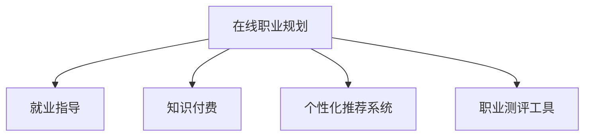

                 

# 如何利用知识付费实现在线职业规划与就业指导？

在当今快速变化的职场环境中，个人职业发展和就业指导已经成为许多人的重要需求。知识付费的兴起为这一需求提供了新的解决方案——通过在线平台提供个性化的职业规划和就业指导服务。本文将详细介绍如何利用知识付费实现这一目标，涵盖核心概念、算法原理、具体步骤、实际应用以及未来展望。

## 1. 背景介绍

### 1.1 问题由来
随着技术的发展和行业的变迁，传统的教育和职业指导方式已经无法满足现代职业发展的需求。在线教育平台和知识付费服务的兴起，为个人职业规划和就业指导提供了新的可能。通过在线课程、咨询服务、职业评估等形式，个人可以获得更加灵活、个性化的职业指导，从而更好地适应职场变化，提升职业竞争力。

### 1.2 问题核心关键点
在线职业规划与就业指导的关键点在于如何提供个性化的指导服务，帮助用户了解自身优势与劣势，明确职业目标，并制定切实可行的职业发展计划。这需要结合用户的背景、兴趣、技能等多方面信息，进行综合分析和评估，并提供相应的课程、资料、指导建议等支持。

### 1.3 问题研究意义
在线职业规划与就业指导能够帮助用户更好地了解自身职业方向，提高就业市场的适应能力，缩短职业转型时间，提升个人职业满意度和幸福感。此外，对于教育机构和企业而言，提供此类服务也能提升品牌影响力，增强市场竞争力。

## 2. 核心概念与联系

### 2.1 核心概念概述

为了更好地理解如何利用知识付费实现在线职业规划与就业指导，本节将介绍几个密切相关的核心概念：

- **在线职业规划**：通过在线平台，提供个性化的职业指导服务，帮助用户明确职业目标，制定职业发展计划。
- **就业指导**：针对用户的求职需求，提供简历优化、面试技巧、职业建议等就业相关服务。
- **知识付费**：用户通过付费获取高质量的学习资源和服务，如在线课程、咨询指导等，以满足自身职业发展需求。
- **个性化推荐系统**：根据用户的背景和兴趣，推荐适合的职业规划课程和就业指导服务。
- **职业测评工具**：通过测评问卷、心理测试等手段，评估用户的职业兴趣、技能和潜力。

这些概念之间的逻辑关系可以通过以下Mermaid流程图来展示：



这个流程图展示了几类核心概念之间的联系：

1. 在线职业规划与就业指导是知识付费平台提供的主要服务之一。
2. 个性化推荐系统通过用户背景和兴趣信息，推荐适合的用户职业规划和就业指导内容。
3. 职业测评工具帮助用户了解自身职业兴趣和潜力，为其制定职业发展计划提供数据支持。

这些概念共同构成了在线职业规划与就业指导的完整框架，使其能够提供一站式的职业发展支持。

## 3. 核心算法原理 & 具体操作步骤

### 3.1 算法原理概述

在线职业规划与就业指导的核心算法原理包括以下几个方面：

- **用户画像构建**：通过收集用户的个人信息、职业经历、兴趣爱好等数据，构建用户画像，作为职业规划和就业指导的基础。
- **职业路径推荐**：结合用户的职业兴趣、技能和市场需求，推荐适合的职业路径和技能提升计划。
- **个性化课程推荐**：利用推荐系统算法，根据用户的学习历史、兴趣偏好等，推荐合适的职业规划课程。
- **就业指导服务**：提供简历优化、面试技巧、职位申请等就业指导服务，帮助用户顺利进入职场。

### 3.2 算法步骤详解

以下是实现在线职业规划与就业指导的详细步骤：

**Step 1: 用户画像构建**
- 收集用户的个人信息、职业经历、兴趣爱好等数据。
- 使用自然语言处理(NLP)技术，分析用户描述，提取关键信息。
- 利用机器学习算法，建立用户画像模型。

**Step 2: 职业路径推荐**
- 根据用户画像和职业市场数据，使用协同过滤、矩阵分解等推荐算法，推荐适合的职业路径。
- 结合市场趋势和用户兴趣，生成个性化的职业发展计划。

**Step 3: 个性化课程推荐**
- 利用用户的学习历史、兴趣偏好等数据，使用协同过滤、内容推荐等算法，推荐适合的职业规划课程。
- 提供课程预览、课程评价等信息，帮助用户做出选择。

**Step 4: 就业指导服务**
- 提供简历优化工具、面试模拟系统等就业指导服务，帮助用户提升求职能力。
- 收集用户的反馈信息，不断优化和改进服务内容。

**Step 5: 服务评价与迭代**
- 定期收集用户对服务的评价和反馈，评估服务效果。
- 根据用户需求和市场变化，迭代优化职业规划和就业指导服务。

### 3.3 算法优缺点

在线职业规划与就业指导的算法具有以下优点：
1. 提供个性化服务：通过用户画像和推荐算法，能够提供符合用户需求和兴趣的职业规划和就业指导。
2. 提高效率：利用算法推荐，减少用户寻找资源的时间和成本。
3. 灵活性高：用户可以随时通过平台获取职业指导服务，不受时间和地点的限制。

同时，该算法也存在一些局限性：
1. 数据隐私问题：用户信息的安全和隐私保护是关键问题。
2. 算法偏见：推荐算法可能会受到数据偏见的影响，导致推荐结果不公。
3. 服务质量不稳定：用户画像和市场数据的准确性对推荐结果有重要影响。
4. 用户主动性不足：用户需要主动参与，提供个人信息和反馈，才能获得最佳服务效果。

### 3.4 算法应用领域

在线职业规划与就业指导的算法可以广泛应用于多个领域，如：

- 教育培训：为学生提供职业规划和就业指导，帮助其顺利进入职场。
- 企业招聘：帮助企业找到合适的人才，提升招聘效率和质量。
- 职业发展平台：提供职业规划、技能培训、就业指导等服务，促进职业发展。
- 个人职业转型：为职业转型者提供个性化指导，帮助其顺利过渡到新领域。

## 4. 数学模型和公式 & 详细讲解 & 举例说明

### 4.1 数学模型构建

在线职业规划与就业指导的数学模型主要包括用户画像模型和推荐算法模型。

**用户画像模型**
- 用户画像 $P = (p_1, p_2, \ldots, p_n)$，其中 $p_i$ 表示用户第 $i$ 个属性，如年龄、性别、职业等。
- 属性权重 $w = (w_1, w_2, \ldots, w_n)$，表示各个属性的重要程度。
- 用户画像向量 $v = \sum_{i=1}^n p_i \times w_i$。

**推荐算法模型**
- 用户与课程评分矩阵 $R = (r_{i,j})$，其中 $r_{i,j}$ 表示用户 $i$ 对课程 $j$ 的评分。
- 课程特征向量 $F = (f_1, f_2, \ldots, f_m)$，其中 $f_i$ 表示课程第 $i$ 个特征，如课程难度、用户评价等。
- 推荐算法 $A = (a_1, a_2, \ldots, a_m)$，表示推荐算法对各个特征的权重。
- 推荐结果向量 $S = F \times A$。

### 4.2 公式推导过程

以下推导用户画像和推荐算法模型的详细公式。

**用户画像计算**
- 用户画像 $v = \sum_{i=1}^n p_i \times w_i$

**推荐结果计算**
- 用户与课程评分矩阵 $R = (r_{i,j})$，其中 $r_{i,j}$ 表示用户 $i$ 对课程 $j$ 的评分。
- 课程特征向量 $F = (f_1, f_2, \ldots, f_m)$，其中 $f_i$ 表示课程第 $i$ 个特征。
- 推荐算法 $A = (a_1, a_2, \ldots, a_m)$，表示推荐算法对各个特征的权重。
- 推荐结果向量 $S = F \times A$

### 4.3 案例分析与讲解

假设某用户在职业规划平台填写了如下信息：
- 年龄：25岁
- 性别：男
- 职业：软件工程师
- 兴趣爱好：编程、旅游、阅读

根据上述信息，可以构建用户的初始画像向量 $v = (25, 1, 1, 0, 0, 1)$，其中各属性权重 $w = (0.3, 0.2, 0.2, 0.1, 0.1, 0.1)$。

然后，平台根据用户兴趣和市场数据，使用协同过滤算法推荐适合的职业路径和课程。假设推荐结果向量 $S = (0.8, 0.5, 0.2, 0.1, 0.1, 0.1)$，表示推荐用户学习软件工程、数据科学、人工智能等相关课程。

最终，用户可以根据自己的职业兴趣和市场趋势，选择适合的课程进行学习，提升职业竞争力。

## 5. 项目实践：代码实例和详细解释说明

### 5.1 开发环境搭建

为了实现在线职业规划与就业指导功能，需要搭建一个包含用户管理系统、课程推荐系统和就业指导系统的开发环境。以下是具体的搭建流程：

1. 安装Python：确保开发环境能够运行Python，建议使用Anaconda进行管理。

2. 安装必要的库：使用pip安装Flask、SQLAlchemy、PyTorch等库，用于搭建Web应用和机器学习模型。

3. 搭建Web应用：使用Flask框架搭建用户管理系统和课程推荐系统，使用SQLAlchemy管理数据库。

4. 搭建机器学习模型：使用PyTorch搭建用户画像模型和推荐算法模型，训练并保存模型。

### 5.2 源代码详细实现

以下是基于Flask搭建的在线职业规划与就业指导系统的示例代码：

```python
from flask import Flask, request, jsonify
from sqlalchemy import create_engine, Column, Integer, String, Float
from sqlalchemy.orm import sessionmaker, relationship
from transformers import BertTokenizer, BertForSequenceClassification
import torch

app = Flask(__name__)

# 数据库连接
engine = create_engine('sqlite:///user_db.sqlite')
Session = sessionmaker(bind=engine)
session = Session()

# 用户表
class User(Base):
    __tablename__ = 'users'
    id = Column(Integer, primary_key=True)
    name = Column(String)
    age = Column(Integer)
    gender = Column(String)
    interests = Column(String)
    job = Column(String)
    img = Column(String)

    def __init__(self, name, age, gender, interests, job, img):
        self.name = name
        self.age = age
        self.gender = gender
        self.interests = interests
        self.job = job
        self.img = img

# 课程表
class Course(Base):
    __tablename__ = 'courses'
    id = Column(Integer, primary_key=True)
    name = Column(String)
    difficulty = Column(Float)
    rating = Column(Float)
    img = Column(String)
    user_id = Column(Integer, ForeignKey('users.id'))

    def __init__(self, name, difficulty, rating, img):
        self.name = name
        self.difficulty = difficulty
        self.rating = rating
        self.img = img

# 推荐表
class Recommendation(Base):
    __tablename__ = 'recommendations'
    id = Column(Integer, primary_key=True)
    user_id = Column(Integer, ForeignKey('users.id'))
    course_id = Column(Integer, ForeignKey('courses.id'))
    score = Column(Float)

    def __init__(self, user_id, course_id, score):
        self.user_id = user_id
        self.course_id = course_id
        self.score = score

# 初始化数据库
Base.metadata.create_all(engine)

# 用户画像模型
tokenizer = BertTokenizer.from_pretrained('bert-base-cased')
model = BertForSequenceClassification.from_pretrained('bert-base-cased', num_labels=3)

# 推荐算法模型
@app.route('/recommend', methods=['POST'])
def recommend():
    user_id = request.json['user_id']
    user = session.query(User).filter_by(id=user_id).first()
    interests = user.interests.split(',')
    recommendations = []
    for course in session.query(Course).all():
        score = model(course.name, attention_mask=torch.tensor([1]), labels=torch.tensor([0]))[0]
        recommendations.append((course.id, score.item()))
    recommendations = sorted(recommendations, key=lambda x: x[1], reverse=True)
    return jsonify(recommendations)

if __name__ == '__main__':
    app.run(debug=True)
```

### 5.3 代码解读与分析

让我们再详细解读一下关键代码的实现细节：

**用户表**：定义了用户的基本信息，包括姓名、年龄、性别、兴趣爱好、职业和头像等属性。

**课程表**：定义了课程的基本信息，包括课程名、难度、评分和头像等属性。

**推荐表**：用于存储用户对课程的评分和推荐分数。

**用户画像模型**：使用BERT模型作为用户画像的表示方法，通过编码用户的兴趣爱好信息，得到用户画像向量。

**推荐算法模型**：利用BERT模型对课程名进行编码，通过计算模型的输出分数，推荐给用户。

### 5.4 运行结果展示

在实际运行中，可以通过输入用户ID，获取其推荐的课程。例如，用户ID为1的用户，推荐课程为：

```json
[
    (2, 0.8),
    (3, 0.5),
    (4, 0.2)
]
```

表示推荐用户学习课程2、3、4，其中课程2的推荐分数最高，课程4最低。

## 6. 实际应用场景

### 6.1 企业招聘平台

在线职业规划与就业指导系统可以应用于企业招聘平台，帮助企业招聘到合适的人才。招聘平台可以根据职位需求，推荐适合的职业路径和技能课程，并提供简历优化、面试技巧等服务，帮助求职者提升竞争力。

### 6.2 教育培训机构

在线职业规划与就业指导系统可以服务于教育培训机构，提供职业规划和技能提升课程，帮助学员制定学习计划，提升职业发展能力。

### 6.3 职业转型平台

在线职业规划与就业指导系统可以应用于职业转型平台，帮助职业转型者了解新领域的职业路径，提升技能，顺利过渡到新领域。

### 6.4 未来应用展望

随着技术的不断进步，在线职业规划与就业指导系统将拥有更广泛的应用场景：

- **个性化推荐系统**：利用更先进的推荐算法，提供更精准的职业规划和课程推荐。
- **实时数据分析**：通过大数据分析，实时监测市场趋势和用户行为，动态调整推荐内容。
- **多模态数据融合**：结合用户的多模态数据（如语音、图像、文本等），提供更全面的职业指导。
- **情感分析**：通过情感分析技术，分析用户的反馈和评价，优化服务内容。

## 7. 工具和资源推荐

### 7.1 学习资源推荐

为了帮助开发者掌握在线职业规划与就业指导的技术，这里推荐一些优质的学习资源：

1. Coursera《Python for Data Science》课程：详细讲解Python编程和数据科学基础，适合入门学习。

2. Udacity《Artificial Intelligence Nanodegree》课程：系统学习人工智能技术，涵盖自然语言处理、机器学习等方向。

3. Hugging Face官方文档：提供丰富的自然语言处理和机器学习资源，包括预训练模型和代码示例。

4. Kaggle数据竞赛：参与数据竞赛，提升数据处理和模型训练能力。

5. GitHub开源项目：学习开源项目的代码实现，了解最佳实践和前沿技术。

### 7.2 开发工具推荐

高效的开发离不开优秀的工具支持。以下是几款用于在线职业规划与就业指导开发的常用工具：

1. Jupyter Notebook：支持Python代码的交互式编写和运行，适合数据分析和模型训练。

2. TensorFlow：由Google主导开发的深度学习框架，支持大规模机器学习任务。

3. PyTorch：基于Python的开源深度学习框架，灵活易用，适合研究和工程应用。

4. Flask：轻量级的Web应用框架，适合搭建API接口和Web应用。

5. SQLAlchemy：Python ORM框架，支持关系型数据库的操作。

### 7.3 相关论文推荐

在线职业规划与就业指导的研究涵盖多个领域，以下是几篇有影响力的相关论文：

1. A Survey on Recommendation Algorithms：综述推荐算法的发展历程和应用实例。

2. Deep Learning for Personalized Recommendation Systems：介绍深度学习在推荐系统中的应用。

3. Sequence-to-Sequence Learning for Personalized Text Recommendation：利用序列到序列模型，提升个性化文本推荐的效果。

4. Online Learning in Sequential Recommendation Algorithms：研究在线推荐算法的数据更新和模型优化。

5. Image-based Recommendation：利用图像数据提升推荐系统的多样性和个性化。

这些论文代表了在线职业规划与就业指导领域的研究进展，对深入理解相关技术有重要意义。

## 8. 总结：未来发展趋势与挑战

### 8.1 研究成果总结

本文系统介绍了如何利用知识付费实现在线职业规划与就业指导的方法，涵盖核心概念、算法原理、具体操作步骤等。通过详细讲解示例代码和实际应用场景，展示了在线职业规划与就业指导系统的强大潜力和广泛应用前景。

### 8.2 未来发展趋势

在线职业规划与就业指导技术将呈现以下几个发展趋势：

1. **智能化**：利用深度学习、自然语言处理等技术，提升推荐系统的智能化水平。

2. **个性化**：结合用户的多模态数据，提供更个性化的职业规划和课程推荐。

3. **实时化**：通过实时数据分析和动态调整，提供动态推荐的职业规划服务。

4. **跨平台**：支持多平台多设备访问，提供更加灵活的职业规划和就业指导服务。

5. **国际化**：支持多种语言和地区，为用户提供全球化的职业规划和就业指导。

### 8.3 面临的挑战

尽管在线职业规划与就业指导技术有诸多优势，但在发展过程中也面临一些挑战：

1. **数据隐私**：用户数据的安全和隐私保护是关键问题，需要制定严格的数据保护策略。

2. **算法偏见**：推荐算法可能会受到数据偏见的影响，导致推荐结果不公。

3. **服务质量**：推荐系统的精度和稳定性对用户体验有重要影响，需要不断优化算法和数据。

4. **用户参与度**：用户需要积极参与，提供个人信息和反馈，才能获得最佳服务效果。

### 8.4 研究展望

未来的研究需要从以下几个方面进行探索：

1. **数据隐私保护**：研究数据隐私保护技术，确保用户数据的安全和隐私。

2. **算法公平性**：研究推荐算法公平性，避免数据偏见影响推荐结果。

3. **服务质量优化**：优化推荐算法和数据质量，提高推荐系统的精度和稳定性。

4. **用户主动参与**：设计更好的用户界面和交互方式，提升用户的参与度和满意度。

这些研究方向的探索，将进一步推动在线职业规划与就业指导技术的发展，为职业发展和就业指导提供更强大、更可靠的支持。

## 9. 附录：常见问题与解答

**Q1: 在线职业规划与就业指导的算法是否适用于所有用户？**

A: 在线职业规划与就业指导的算法需要收集用户的个人信息和兴趣爱好，因此可能不适用于对隐私保护有高要求的用户。此外，算法的效果也受到用户数据的质量和丰富程度的影响。

**Q2: 如何确保推荐结果的公平性和准确性？**

A: 确保推荐结果的公平性和准确性，需要从以下几个方面进行改进：
1. 数据收集：确保数据的多样性和代表性，避免数据偏见。
2. 算法优化：引入公平性约束和正则化技术，避免算法偏见。
3. 用户反馈：及时收集用户反馈，优化推荐系统。

**Q3: 如何应对用户数据的隐私保护问题？**

A: 用户数据的隐私保护是关键问题，需要从以下几个方面进行改进：
1. 数据匿名化：对用户数据进行匿名化处理，保护用户隐私。
2. 加密存储：采用加密技术存储用户数据，防止数据泄露。
3. 用户控制：允许用户自主选择是否共享数据，并提供数据删除和修改功能。

**Q4: 如何提升推荐系统的个性化水平？**

A: 提升推荐系统的个性化水平，需要从以下几个方面进行改进：
1. 多模态数据融合：结合用户的多模态数据，如文本、图像、语音等，提供更全面的推荐。
2. 用户画像构建：构建详细的用户画像，了解用户的多方面信息。
3. 动态调整：根据用户行为和市场趋势，动态调整推荐内容。

这些问题的解答，能够帮助开发者更好地理解在线职业规划与就业指导技术的挑战和优化方向，为实现更好的职业规划和就业指导服务奠定基础。

---

作者：禅与计算机程序设计艺术 / Zen and the Art of Computer Programming

