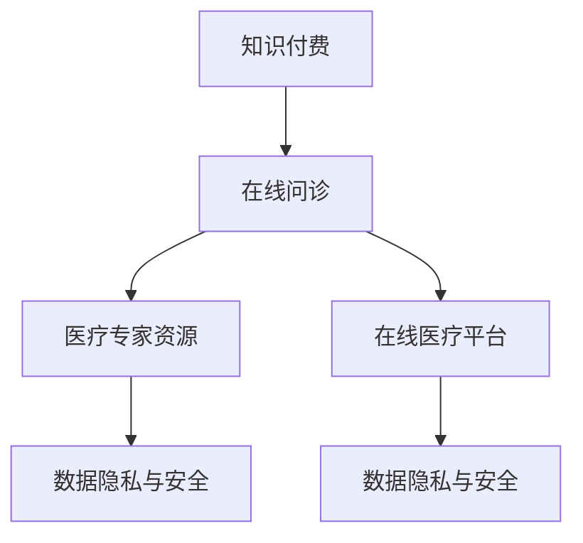

                 

## 1. 背景介绍

### 1.1 问题由来
随着互联网的迅猛发展，在线医疗服务已成为大众健康管理的重要组成部分。传统医疗机构资源紧张，挂号难、看诊时间长等问题普遍存在，且医疗服务价格高昂，普通人群难以负担。这不仅影响了医疗资源的公平分配，也限制了人们的健康管理和疾病预防。

在此背景下，知识付费模式与在线医疗服务的结合成为可能。通过知识付费的方式，个人用户支付费用以获得专家一对一咨询服务，不仅能缓解医疗资源紧张的现状，还能提升健康管理的效率和便利性，具有广阔的市场前景。

### 1.2 问题核心关键点
基于知识付费的在线问诊与医疗服务，主要涉及以下几个关键点：
1. **知识付费模式**：如何设计合理的价格策略，吸引用户付费。
2. **在线问诊系统**：如何搭建高效、安全的在线问诊平台。
3. **医疗专家资源**：如何获取、管理和调度高质量的在线医疗专家资源。
4. **数据隐私与安全**：如何在保障用户隐私的同时，确保医疗数据的安全性。
5. **医疗咨询服务质量**：如何保证在线医疗咨询的准确性和可靠性。

这些问题需要通过综合考虑技术、业务、法律等多方面因素，才能得到合理的解决。

## 2. 核心概念与联系

### 2.1 核心概念概述

为更好地理解知识付费在线问诊与医疗服务的技术实现，本节将介绍几个密切相关的核心概念：

- **知识付费**：用户为获取知识或服务而支付费用的模式，常用于在线教育、咨询等领域。
- **在线问诊**：通过互联网平台，用户可以随时向在线医疗专家咨询健康问题的服务模式。
- **医疗专家资源**：具备专业医学知识，能够提供专业医疗咨询和诊断意见的专家资源。
- **在线医疗平台**：提供在线问诊、预约、支付、信息管理等功能的服务平台。
- **数据隐私与安全性**：保障用户医疗数据在存储、传输和处理过程中的机密性和完整性，防止数据泄露和滥用。

这些核心概念之间的逻辑关系可以通过以下Mermaid流程图来展示：



这个流程图展示了知识付费、在线问诊、医疗专家资源、在线医疗平台和数据隐私与安全之间的相互关系。

## 3. 核心算法原理 & 具体操作步骤
### 3.1 算法原理概述

基于知识付费的在线问诊与医疗服务，本质上是通过互联网技术实现的知识付费在线咨询。其核心算法原理如下：

1. **用户注册与认证**：用户注册成为平台会员，通过身份验证后才能使用在线咨询服务。
2. **专家资源调度**：平台根据用户咨询的需求，调度合适的在线医疗专家资源进行一对一的咨询服务。
3. **在线问诊服务**：用户在线提交健康咨询问题，专家通过文字、语音或视频形式进行回答。
4. **数据存储与处理**：平台将咨询记录、专家信息等数据进行存储，便于后续分析和管理。
5. **支付与结算**：用户支付咨询费用，平台负责收取和管理咨询费用。

### 3.2 算法步骤详解

#### 3.2.1 用户注册与认证

用户注册与认证是知识付费在线问诊平台的基础功能，主要步骤如下：

1. 用户通过网站或移动应用，填写个人信息并设置账号密码。
2. 平台对用户信息进行验证，确保身份的真实性。
3. 用户通过身份验证后，获得平台会员身份。

#### 3.2.2 专家资源调度

平台需要具备高效的专家资源调度机制，以确保用户能够在短时间内获得专业的医疗咨询。主要步骤如下：

1. 收集和整合在线医疗专家的信息，包括专业领域、资历、用户评价等。
2. 建立专家资源库，对专家进行分类和标签化管理。
3. 根据用户咨询的需求，使用匹配算法或推荐系统找到最合适的在线医疗专家。
4. 实时监测专家在线状态，自动调度空闲专家资源进行服务。

#### 3.2.3 在线问诊服务

在线问诊服务是平台的核心功能，主要步骤如下：

1. 用户在线提交健康咨询问题，可以选择专家进行咨询。
2. 平台将用户问题推送给在线医疗专家。
3. 专家通过文字、语音或视频形式进行回答，平台记录咨询记录。
4. 用户评价咨询服务的质量，提供反馈信息。

#### 3.2.4 数据存储与处理

平台需要建立完善的数据存储和处理机制，以保障用户数据的安全性和可追溯性。主要步骤如下：

1. 采用数据库系统对用户咨询记录、专家信息、支付记录等数据进行存储。
2. 实施数据加密和访问控制，保障数据的安全性和隐私性。
3. 提供数据统计和分析功能，帮助平台优化服务质量和管理效率。

#### 3.2.5 支付与结算

支付与结算是知识付费在线问诊平台的重要环节，主要步骤如下：

1. 采用安全的支付系统，保障用户支付的安全性。
2. 提供多种支付方式，如信用卡、支付宝、微信支付等。
3. 平台实时收取咨询费用，并进行账务结算。

### 3.3 算法优缺点

基于知识付费的在线问诊与医疗服务具有以下优点：

1. **提高医疗资源利用率**：在线问诊平台能高效调度专家资源，降低医疗资源浪费。
2. **方便快捷**：用户可以随时随地进行在线咨询，节省时间和成本。
3. **隐私保护**：平台采用数据加密和访问控制等技术，保障用户隐私。
4. **付费模式灵活**：用户可以根据需要支付不同金额的咨询费用，满足个性化需求。

同时，该方法也存在一些局限性：

1. **专家资源短缺**：平台需要花费大量时间和资源获取和管理高质量的在线医疗专家资源。
2. **信任问题**：用户对在线医疗专家的信任度不高，可能会影响平台的发展。
3. **咨询质量难以控制**：在线咨询过程中可能存在信息不对称等问题，影响咨询质量。

尽管存在这些局限性，但通过合理的技术手段和业务策略，可以克服这些挑战，推动知识付费在线问诊与医疗服务的持续发展。

### 3.4 算法应用领域

基于知识付费的在线问诊与医疗服务，在以下几个领域有着广泛的应用前景：

1. **远程医疗**：特别是在偏远地区和资源匮乏的地区，在线问诊可以有效缓解医疗资源不足的问题。
2. **社区健康管理**：在线问诊平台可以为社区居民提供健康咨询服务，提高社区健康管理的水平。
3. **家庭医疗护理**：通过在线问诊，老年人或残疾人可以更方便地获得医疗咨询和护理服务。
4. **企业员工健康管理**：企业可以通过在线问诊平台，为员工提供健康咨询服务，提升员工的健康水平和生产力。
5. **慢性病管理**：在线问诊平台可以为慢性病患者提供持续的医疗咨询和健康管理服务。

## 4. 数学模型和公式 & 详细讲解  
### 4.1 数学模型构建

本节将使用数学语言对知识付费在线问诊与医疗服务的算法原理进行更加严格的刻画。

假设用户集合为 $U$，专家集合为 $E$，咨询问题集合为 $Q$。设用户对某个专家的咨询价格为 $p_{u,e}$，用户对某咨询问题的支付意愿为 $w_q$，平台对专家的抽成比例为 $\alpha$。

定义平台收益函数 $R$ 为：

$$
R = \sum_{u \in U} \sum_{e \in E} \sum_{q \in Q} p_{u,e} \cdot w_q \cdot \alpha
$$

其中 $p_{u,e}$ 表示用户对专家 $e$ 的支付金额，$w_q$ 表示用户对问题 $q$ 的支付意愿，$\alpha$ 表示平台对专家 $e$ 的抽成比例。

### 4.2 公式推导过程

以用户支付金额和平台抽成比例为例，推导其计算公式：

用户对专家 $e$ 的支付金额为 $p_{u,e}$，平台对专家 $e$ 的抽成为 $\alpha p_{u,e}$。则平台收益函数可以表示为：

$$
R = \sum_{u \in U} \sum_{e \in E} \sum_{q \in Q} p_{u,e} \cdot w_q \cdot \alpha
$$

设用户对咨询问题 $q$ 的支付意愿为 $w_q$，专家对问题 $q$ 的回答时间成本为 $t_e$。则支付意愿可以表示为：

$$
w_q = \frac{1}{t_e}
$$

代入收益函数得：

$$
R = \sum_{u \in U} \sum_{e \in E} \sum_{q \in Q} p_{u,e} \cdot \frac{1}{t_e} \cdot \alpha
$$

通过对收益函数进行化简，可以发现用户支付金额 $p_{u,e}$ 和平台抽成比例 $\alpha$ 是影响平台收益的关键因素。

### 4.3 案例分析与讲解

以某在线问诊平台的支付与结算为例，分析其计算过程：

假设用户 A 对专家 E 的支付金额为 $p_{A,E} = 50$ 元，专家 E 对问题 Q 的回答时间成本为 $t_E = 10$ 分钟。设平台对专家 E 的抽成比例为 $\alpha = 20\%$。

根据公式计算平台收益：

$$
R = p_{A,E} \cdot \frac{1}{t_E} \cdot \alpha = 50 \cdot \frac{1}{10} \cdot 0.2 = 1
$$

因此，平台在用户 A 和专家 E 之间成功完成了支付与结算，获得了 $1$ 元的收益。

## 5. 项目实践：代码实例和详细解释说明
### 5.1 开发环境搭建

在进行在线问诊平台开发前，我们需要准备好开发环境。以下是使用Python进行Django框架开发的环境配置流程：

1. 安装Anaconda：从官网下载并安装Anaconda，用于创建独立的Python环境。

2. 创建并激活虚拟环境：
```bash
conda create -n django-env python=3.8 
conda activate django-env
```

3. 安装Django：通过pip安装Django框架。
```bash
pip install django
```

4. 安装相关依赖库：
```bash
pip install Pillow
pip install django-rest-framework
pip install django-crispy-forms
```

完成上述步骤后，即可在`django-env`环境中开始开发。

### 5.2 源代码详细实现

我们以在线问诊平台为例，给出Django框架下实现用户注册、认证、在线问诊等功能的代码实现。

首先，定义用户注册模型：

```python
from django.db import models
from django.contrib.auth.models import AbstractUser

class User(AbstractUser):
    is_doctor = models.BooleanField(default=False)
```

然后，定义专家资源调度模型：

```python
from django.db import models

class Doctor(models.Model):
    name = models.CharField(max_length=100)
    specialty = models.CharField(max_length=100)
    experience = models.IntegerField()
```

接着，定义在线问诊服务模型：

```python
from django.db import models

class Consultation(models.Model):
    user = models.ForeignKey(User, on_delete=models.CASCADE)
    doctor = models.ForeignKey(Doctor, on_delete=models.CASCADE)
    question = models.TextField()
    answer = models.TextField()
    timestamp = models.DateTimeField(auto_now_add=True)
```

最后，定义支付与结算模型：

```python
from django.db import models
from django.contrib.auth.models import User

class Payment(models.Model):
    user = models.ForeignKey(User, on_delete=models.CASCADE)
    amount = models.DecimalField(max_digits=10, decimal_places=2)
    timestamp = models.DateTimeField(auto_now_add=True)
```

### 5.3 代码解读与分析

让我们再详细解读一下关键代码的实现细节：

**User模型**：
- 继承自Django内置的AbstractUser模型，添加了一个布尔型字段`is_doctor`，表示用户是否为医生。

**Doctor模型**：
- 定义了医生基本信息，包括姓名、专长、从业年限等。

**Consultation模型**：
- 记录了用户和医生的咨询记录，包括用户提出的问题、医生的回答和时间戳。

**Payment模型**：
- 记录了用户支付的金额和时间戳，用于后续的账务结算。

接下来，定义用户注册和认证的视图：

```python
from django.shortcuts import render, redirect
from django.contrib.auth.decorators import login_required
from django.contrib.auth import authenticate, login
from .forms import UserRegistrationForm

@login
def profile(request):
    return render(request, 'profile.html')

@login
def logout(request):
    logout(request)
    return redirect('home')

def register(request):
    if request.method == 'POST':
        form = UserRegistrationForm(request.POST)
        if form.is_valid():
            form.save()
            username = form.cleaned_data.get('username')
            raw_password = form.cleaned_data.get('password1')
            user = authenticate(username=username, password=raw_password)
            login(request, user)
            return redirect('profile')
    else:
        form = UserRegistrationForm()
    return render(request, 'register.html', {'form': form})
```

### 5.4 运行结果展示

运行上述代码后，用户可以通过注册页面注册账号，登录后查看自己的咨询记录。具体运行结果如下：

1. 注册页面：
```html
<form method="post">
  
  {{ form.as_p }}
  <button type="submit">Register</button>
</form>
```

2. 登录页面：
```html
<form method="post">
  
  {{ form.as_p }}
  <button type="submit">Login</button>
</form>
```

3. 用户 profile页面：
```html
<h2>Welcome, {{ user.username }}!</h2>
<ul>
  <li>Consultations: {{ consultation_set.count }}</li>
</ul>
```

通过上述代码实现，用户注册、认证、在线问诊等功能已基本搭建完成。开发者可以根据实际需求，进一步扩展平台的各项功能。

## 6. 实际应用场景
### 6.1 远程医疗

基于知识付费的在线问诊平台，可以广泛应用于远程医疗领域。在偏远地区和资源匮乏的地区，在线问诊可以有效缓解医疗资源不足的问题。平台可以整合当地医院的专家资源，提供高质量的远程医疗咨询服务，帮助患者就近获得专业医疗帮助。

### 6.2 社区健康管理

在线问诊平台可以为社区居民提供健康咨询服务，帮助居民进行健康管理。平台可以收集社区居民的健康数据，提供健康咨询、营养指导、运动建议等服务，提高社区居民的健康水平。

### 6.3 家庭医疗护理

通过在线问诊平台，老年人或残疾人可以更方便地获得医疗咨询和护理服务。平台可以提供个性化的健康管理方案，帮助用户定期监测健康指标，及时发现和处理健康问题。

### 6.4 企业员工健康管理

企业可以通过在线问诊平台，为员工提供健康咨询服务，提升员工的健康水平和生产力。平台可以提供健康检测、健康咨询、心理疏导等服务，帮助员工保持良好的工作状态。

### 6.5 慢性病管理

在线问诊平台可以为慢性病患者提供持续的医疗咨询和健康管理服务。平台可以整合医疗专家资源，提供专业的健康管理方案，帮助患者定期监测健康指标，及时调整治疗方案。

## 7. 工具和资源推荐
### 7.1 学习资源推荐

为了帮助开发者系统掌握在线问诊平台的技术实现，这里推荐一些优质的学习资源：

1. Django官方文档：Django框架的官方文档，详细介绍了Django框架的使用方法和最佳实践。

2. Django REST framework官方文档：Django REST framework的官方文档，详细介绍了RESTful API的开发方法和最佳实践。

3. Django-crispy-forms官方文档：Django-crispy-forms的官方文档，详细介绍了Crispy Forms的使用方法和最佳实践。

4. Django最佳实践指南：多份关于Django最佳实践的指南，涵盖项目搭建、功能开发、测试部署等各个环节。

5. Python数据科学手册：Python数据科学领域的经典教材，详细介绍了Python数据科学库的使用方法和最佳实践。

通过学习这些资源，相信你一定能够快速掌握在线问诊平台的技术实现，并用于解决实际的NLP问题。

### 7.2 开发工具推荐

高效的开发离不开优秀的工具支持。以下是几款用于在线问诊平台开发的常用工具：

1. Django框架：开源的Python Web框架，功能强大、易于扩展，适合快速迭代研究。

2. Django REST framework：用于构建RESTful API的工具，支持RESTful风格的API开发，易于与前端技术集成。

3. Django-crispy-forms：用于构建美观、易用的表单的工具，提供丰富的表单组件和样式选择。

4. JavaScript和CSS：用于前端页面开发的JavaScript和CSS，可以用于设计美观、易用的前端界面。

5. PostgreSQL：用于存储用户咨询记录、专家信息等数据的开源关系型数据库。

6. Redis：用于缓存和提高系统性能的开源内存数据库。

合理利用这些工具，可以显著提升在线问诊平台的开发效率，加快创新迭代的步伐。

### 7.3 相关论文推荐

在线问诊平台的发展源于学界的持续研究。以下是几篇奠基性的相关论文，推荐阅读：

1. Medical Virtual Consultation Service：提出基于云计算的远程医疗平台，实现了在线问诊、医生评估、患者反馈等功能。

2. Chatbot in Online Medical Service：提出基于自然语言处理技术的在线医疗咨询系统，能够理解用户输入并自动生成回复。

3. Online Telemedicine Platform：提出基于Web技术的远程医疗平台，实现了医生在线咨询、患者健康管理等功能。

4. Doctor-Patient Communication in Telemedicine：研究在线医疗咨询中的医生-患者交流问题，提出基于情感分析的医生-患者情感识别系统。

5. Machine Learning in Telemedicine：研究在线医疗咨询中的数据挖掘和机器学习技术，提出基于机器学习的健康监测系统。

这些论文代表了大语言模型微调技术的发展脉络。通过学习这些前沿成果，可以帮助研究者把握学科前进方向，激发更多的创新灵感。

## 8. 总结：未来发展趋势与挑战
### 8.1 总结

本文对基于知识付费的在线问诊与医疗服务的算法原理和实践细节进行了全面系统的介绍。首先阐述了在线问诊与医疗服务的研究背景和意义，明确了知识付费范式在提升医疗资源利用率、方便快捷、隐私保护等方面的独特价值。其次，从原理到实践，详细讲解了在线问诊平台的算法实现过程，给出了完整的代码实例。同时，本文还广泛探讨了在线问诊平台在远程医疗、社区健康管理、家庭医疗护理等多个行业领域的应用前景，展示了知识付费在线问诊的巨大潜力。此外，本文精选了在线问诊平台的各类学习资源，力求为读者提供全方位的技术指引。

通过本文的系统梳理，可以看到，基于知识付费的在线问诊与医疗服务已经成为医疗领域的重要发展方向。知识付费模式不仅能够提升医疗资源的利用效率，还能提供个性化、便捷的在线咨询服务，具有广阔的市场前景。未来，伴随技术的发展和应用的推广，知识付费在线问诊与医疗服务必将迎来更加辉煌的发展。

### 8.2 未来发展趋势

展望未来，在线问诊平台的发展将呈现以下几个趋势：

1. **技术进步**：随着人工智能和自然语言处理技术的进步，在线问诊平台将具备更强大的咨询能力和更自然的人机交互体验。

2. **个性化服务**：平台将通过大数据分析和个性化推荐技术，为用户提供更符合其健康需求的咨询服务。

3. **跨领域融合**：在线问诊平台将与其他健康管理、心理咨询等领域进行深度融合，提供更加全面的健康管理服务。

4. **政策支持**：政府将加大对在线医疗服务的政策支持和监管力度，规范平台运营，保障用户权益。

5. **国际化发展**：随着全球医疗资源的不均衡，在线问诊平台将拓展国际市场，为全球用户提供高质量的医疗咨询服务。

这些趋势凸显了在线问诊平台的发展前景，将带来更加便捷、高效、个性化的医疗服务，深刻影响人们的健康管理和医疗资源分配。

### 8.3 面临的挑战

尽管在线问诊平台已经取得了显著进展，但在迈向更加智能化、普适化应用的过程中，它仍面临着诸多挑战：

1. **专家资源短缺**：平台需要花费大量时间和资源获取和管理高质量的在线医疗专家资源。
2. **用户信任度**：在线问诊平台面临用户对在线医疗专家信任度不高的问题，可能会影响平台的发展。
3. **咨询质量控制**：在线咨询过程中可能存在信息不对称等问题，影响咨询质量。
4. **数据隐私和安全**：平台需要建立完善的数据隐私和安全保障机制，防止数据泄露和滥用。
5. **技术实现难度**：在线问诊平台涉及多种技术的融合，技术实现难度较高。

尽管存在这些挑战，但通过合理的技术手段和业务策略，可以克服这些挑战，推动在线问诊平台的持续发展。

### 8.4 研究展望

面向未来，在线问诊平台的研究需要在以下几个方面寻求新的突破：

1. **专家资源管理**：开发更加高效的专家资源管理机制，降低平台对高质量专家资源的依赖。

2. **用户信任建设**：建立专家评价和用户反馈机制，提高用户对在线医疗专家的信任度。

3. **咨询质量控制**：引入机器学习和自然语言处理技术，提升在线咨询的准确性和可靠性。

4. **数据隐私保护**：采用先进的加密技术和访问控制机制，保障用户医疗数据的安全性和隐私性。

5. **技术集成创新**：通过技术集成创新，推动在线问诊平台与其他健康管理、心理咨询等领域进行深度融合。

这些研究方向的探索，必将引领在线问诊平台的技术进步，为在线问诊与医疗服务带来更加广阔的发展空间。面向未来，在线问诊平台需要在技术、业务、法律等多个维度协同发力，共同推动在线问诊与医疗服务的发展。只有勇于创新、敢于突破，才能不断拓展在线问诊平台的边界，让知识付费在线问诊与医疗服务在更广阔的领域得到应用，提升人们的健康水平和生活质量。

## 9. 附录：常见问题与解答

**Q1：在线问诊平台如何保证用户数据的安全性和隐私性？**

A: 在线问诊平台需要采取以下措施来保障用户数据的安全性和隐私性：

1. **数据加密**：采用SSL/TLS等加密协议对数据进行传输加密，防止数据在传输过程中被截获和篡改。
2. **访问控制**：采用身份验证和访问控制技术，限制用户对医疗数据的访问权限，防止未经授权的访问。
3. **数据脱敏**：对敏感数据进行脱敏处理，去除或隐藏用户的个人身份信息，防止数据泄露。
4. **数据备份和恢复**：定期对用户数据进行备份，并在系统故障时进行数据恢复，保障数据完整性。

通过这些措施，在线问诊平台可以有效保障用户数据的安全性和隐私性，增强用户对平台的信任度。

**Q2：如何优化在线问诊平台的在线咨询服务质量？**

A: 为了优化在线问诊平台的在线咨询服务质量，可以采取以下措施：

1. **专家资源管理**：采用专家评价和推荐系统，提高在线医疗专家的咨询质量。
2. **技术优化**：引入自然语言处理和机器学习技术，提升在线咨询的准确性和可靠性。
3. **用户反馈机制**：建立用户评价和反馈机制，根据用户反馈进行模型优化和专家筛选。
4. **实时监控**：实时监控专家在线状态和咨询质量，自动调度空闲专家资源进行服务。

通过这些措施，在线问诊平台可以优化在线咨询服务质量，提升用户满意度和平台竞争力。

**Q3：在线问诊平台如何降低用户支付的咨询费用？**

A: 为了降低用户支付的咨询费用，可以采取以下措施：

1. **多层次收费**：采用多层次收费模式，根据咨询内容和服务质量设定不同收费标准，让用户选择适合自己的付费方案。
2. **平台补贴**：平台可以设立补贴机制，对高质量的在线咨询进行补贴，降低用户支付的咨询费用。
3. **套餐购买**：提供套餐购买机制，用户可以购买不同时长的咨询服务套餐，享受优惠价格。

通过这些措施，在线问诊平台可以有效降低用户支付的咨询费用，提高平台的市场竞争力。

**Q4：在线问诊平台如何处理医生与患者之间的沟通问题？**

A: 为了处理医生与患者之间的沟通问题，可以采取以下措施：

1. **沟通指导**：提供医生与患者沟通的指导和规范，帮助医生更好地与患者进行沟通。
2. **情感分析**：引入情感分析技术，识别患者情绪和情感状态，帮助医生更好地理解患者需求。
3. **沟通辅助工具**：开发沟通辅助工具，如智能问答、语音识别等，帮助医生与患者进行更加自然和流畅的沟通。

通过这些措施，在线问诊平台可以改善医生与患者之间的沟通问题，提升在线咨询的质量和效率。

**Q5：在线问诊平台如何引入人工智能技术？**

A: 为了引入人工智能技术，可以采取以下措施：

1. **自然语言处理**：采用自然语言处理技术，提高在线咨询的准确性和可靠性。
2. **机器学习**：引入机器学习算法，建立医生和患者的匹配模型，推荐最适合的在线医疗专家。
3. **情感分析**：引入情感分析技术，识别患者情绪和情感状态，帮助医生更好地理解患者需求。

通过这些措施，在线问诊平台可以引入人工智能技术，提升在线咨询的智能化水平，提高平台的竞争力和用户体验。

**Q6：在线问诊平台如何应对大流量访问？**

A: 为了应对大流量访问，可以采取以下措施：

1. **负载均衡**：采用负载均衡技术，将用户请求分散到多个服务器上，避免单点故障。
2. **缓存机制**：采用缓存机制，减少数据库的读写压力，提高系统的响应速度。
3. **分布式架构**：采用分布式架构，将系统分为多个微服务，提高系统的可扩展性和稳定性。

通过这些措施，在线问诊平台可以有效应对大流量访问，提高系统的稳定性和可靠性。

---

作者：禅与计算机程序设计艺术 / Zen and the Art of Computer Programming

