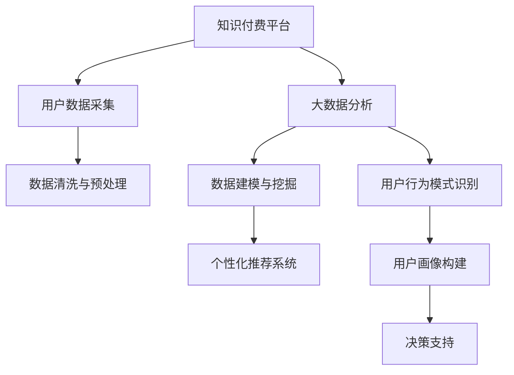

                 

## 1. 背景介绍

随着知识付费和数字化转型在各行各业中的深入应用，大数据分析已经成为企业和机构获取竞争优势的重要手段。通过利用先进的数据分析技术，组织可以更好地理解客户需求、优化业务流程、提升决策水平。然而，数据驱动决策的同时，也面临着数据获取、数据质量、分析效率等诸多挑战。在这样的背景下，知识付费与大数据分析的结合，为解决这些问题提供了新的思路。

本文将从知识付费的本质出发，探讨如何通过知识付费平台的大数据分析，实现更加高效、智能、精准的决策支持，助力企业在数据驱动的环境中取得卓越成绩。

## 2. 核心概念与联系

### 2.1 核心概念概述

在大数据分析领域，知识付费是一个不容忽视的重要概念。知识付费是指消费者为获取有价值的知识和信息而支付费用的行为，涵盖线上课程、内容订阅、咨询顾问等多种形式。而大数据分析则是指从大量结构化和非结构化数据中，提取有价值的信息和知识，并转化为决策依据的过程。两者结合，形成了一个数据驱动、用户付费的双向互动生态。

通过知识付费平台的大数据分析，企业能够更好地理解消费者行为、优化产品设计、提升服务质量，进而实现业务增长和市场竞争力的提升。

### 2.2 核心概念联系

#### 2.2.1 数据驱动的决策制定

知识付费平台通过汇集用户行为数据，如学习轨迹、订阅记录、付费行为等，形成详实的数据集合。通过对这些数据的深入分析，可以揭示用户的真实需求和偏好，从而制定更加精准的营销策略和产品改进方案。

#### 2.2.2 用户行为模式识别

知识付费平台的数据分析工具可以识别出用户的常见行为模式，如兴趣领域、学习频率、付费习惯等。这些信息对于理解用户需求、优化服务体验具有重要意义。

#### 2.2.3 个性化推荐系统

通过大数据分析，知识付费平台可以构建个性化推荐系统，根据用户的过往行为和偏好，推荐符合其兴趣的内容，提升用户满意度和平台粘性。

### 2.3 Mermaid流程图

下面的Mermaid流程图展示了知识付费平台中大数据分析的关键流程和概念联系：



## 3. 核心算法原理 & 具体操作步骤

### 3.1 算法原理概述

知识付费平台中的大数据分析，核心算法包括但不限于聚类分析、分类分析、关联规则挖掘、时序预测等。这些算法通过分析用户行为数据，揭示用户需求和行为模式，实现个性化推荐和精准营销。

### 3.2 算法步骤详解

#### 3.2.1 数据预处理

数据预处理是数据分析的重要环节，包括数据清洗、归一化、特征提取等步骤。以用户订阅数据为例，需要对订阅时间、金额、课程类别等信息进行清洗和标准化处理，确保数据的质量和一致性。

#### 3.2.2 特征工程

特征工程是构建数据模型的关键步骤，包括特征选择、特征变换、特征组合等。以用户行为数据为例，可以选择订阅频率、课程学习时长、付费周期等特征，构建综合评价指标。

#### 3.2.3 数据建模与挖掘

数据建模与挖掘是分析的核心阶段，包括聚类分析、分类分析、关联规则挖掘等。以用户订阅数据为例，可以使用K-means聚类算法，将用户分为不同兴趣群体，为个性化推荐提供依据。

#### 3.2.4 模型评估与优化

模型评估与优化是确保分析准确性和可靠性的重要环节，包括模型验证、参数调优、模型选择等。以用户订阅数据为例，可以采用交叉验证、A/B测试等方法，评估推荐系统的效果，并进行参数优化。

### 3.3 算法优缺点

#### 3.3.1 优点

- **数据驱动决策**：通过大数据分析，企业可以更加精准地理解用户需求，制定更加有效的营销策略和产品改进方案。
- **个性化推荐**：构建个性化推荐系统，提升用户满意度和平台粘性，增加用户留存率。
- **用户行为模式识别**：识别用户常见行为模式，优化服务体验，提升用户体验。

#### 3.3.2 缺点

- **数据隐私与安全**：用户数据的收集和使用可能涉及隐私问题，需确保数据安全与合规性。
- **数据质量与完整性**：数据采集过程中可能存在噪音和缺失，影响分析结果的准确性。
- **计算资源消耗**：大数据分析需要大量计算资源，可能对平台性能产生影响。

### 3.4 算法应用领域

知识付费平台的大数据分析，广泛应用于以下几个领域：

- **用户画像与细分**：通过分析用户行为数据，构建用户画像，实现用户细分，制定个性化营销策略。
- **内容推荐与运营**：根据用户行为数据，构建个性化推荐系统，优化内容运营策略，提升平台活跃度。
- **课程设计与改进**：分析课程学习数据，优化课程设计，提升课程质量，满足用户需求。
- **用户行为预测与预警**：通过分析用户行为数据，预测用户流失风险，提前预警，采取预防措施。

## 4. 数学模型和公式 & 详细讲解 & 举例说明

### 4.1 数学模型构建

知识付费平台中的大数据分析，常用数学模型包括但不限于：

- **K-means聚类**：用于用户兴趣分群，公式为：
  $$
  K-means = \arg\min_{K,\mu} \sum_{i=1}^{N} ||x_i-\mu_k||^2
  $$
- **逻辑回归**：用于用户分类分析，公式为：
  $$
  \hat{y} = \frac{1}{1+e^{-z}} = \frac{1}{1+e^{-w^T\phi(x)+b}}
  $$
- **关联规则挖掘**：用于挖掘用户行为关联，公式为：
  $$
  \text{Support}(A \rightarrow B) = \frac{n(A \cup B)}{n}
  $$

### 4.2 公式推导过程

以K-means聚类为例，其推导过程如下：

1. 将数据点分配到最近的簇中心：
   $$
   z_k = \arg\min_{z \in \{0,1\}} ||x_i - \mu_k||^2
   $$
2. 更新簇中心：
   $$
   \mu_k = \frac{\sum_{z_k=1} x_i}{\sum_{z_k=1} 1}
   $$
3. 重复步骤1和2，直到收敛。

### 4.3 案例分析与讲解

以某知识付费平台的用户订阅数据分析为例：

1. **数据预处理**：收集用户订阅数据，清洗缺失值，标准化数据格式。
2. **特征工程**：选择订阅时间、金额、课程类别等特征，构建综合评价指标。
3. **数据建模**：使用K-means算法，将用户分为不同兴趣群体。
4. **模型评估**：采用交叉验证，评估推荐系统效果，进行参数优化。

## 5. 项目实践：代码实例和详细解释说明

### 5.1 开发环境搭建

为实现知识付费平台的大数据分析，需要搭建如下开发环境：

1. **编程语言**：Python
2. **数据分析库**：Pandas、NumPy、Scikit-learn
3. **可视化工具**：Matplotlib、Seaborn
4. **大数据平台**：Hadoop、Spark
5. **云服务**：AWS、Azure、Google Cloud

### 5.2 源代码详细实现

以下是一个简单的K-means聚类代码实现示例：

```python
from sklearn.cluster import KMeans
import pandas as pd
import numpy as np

# 读取数据
data = pd.read_csv('user_subscriptions.csv')

# 数据预处理
data = data.dropna()

# 特征工程
features = ['subscription_time', 'subscription_amount', 'course_category']

# 数据标准化
data[features] = (data[features] - data[features].mean()) / data[features].std()

# K-means聚类
kmeans = KMeans(n_clusters=5, random_state=0)
kmeans.fit(data[features])

# 获取聚类结果
labels = kmeans.predict(data[features])

# 打印聚类结果
print(labels)
```

### 5.3 代码解读与分析

- **数据读取**：使用Pandas库读取用户订阅数据。
- **数据预处理**：使用dropna函数去除缺失值，使用标准化函数将数据归一化。
- **特征选择**：选择订阅时间、金额、课程类别等特征。
- **K-means聚类**：使用Scikit-learn库的KMeans算法进行聚类，设置簇数为5。
- **聚类结果**：输出聚类结果，用于后续的个性化推荐和营销策略制定。

### 5.4 运行结果展示

运行上述代码后，会输出用户聚类结果，可用于后续的个性化推荐和营销策略制定。

## 6. 实际应用场景

### 6.1 知识付费平台的用户画像

知识付费平台通过大数据分析，可以构建用户画像，实现用户细分，制定个性化营销策略。具体应用场景包括：

- **用户兴趣分析**：分析用户订阅课程、学习时长等行为数据，识别用户兴趣领域。
- **用户行为预测**：预测用户流失风险，提前预警，采取预防措施。
- **个性化推荐**：根据用户画像，推荐符合其兴趣的内容，提升用户满意度和平台粘性。

### 6.2 课程设计与改进

知识付费平台通过大数据分析，可以优化课程设计，提升课程质量，满足用户需求。具体应用场景包括：

- **课程内容分析**：分析课程学习数据，优化课程内容，提升课程质量。
- **用户反馈分析**：分析用户评论、评分等反馈数据，改进课程设计。
- **用户行为预测**：预测课程受欢迎程度，优化课程上线时间，提升课程效果。

### 6.3 内容推荐与运营

知识付费平台通过大数据分析，可以构建个性化推荐系统，优化内容运营策略，提升平台活跃度。具体应用场景包括：

- **内容推荐算法**：构建个性化推荐算法，推荐符合用户兴趣的内容。
- **内容运营策略**：根据推荐系统效果，优化内容运营策略，提升平台活跃度。
- **广告投放优化**：通过数据分析，优化广告投放策略，提升广告效果。

## 7. 工具和资源推荐

### 7.1 学习资源推荐

1. **《大数据分析与统计学习》**：详细讲解了大数据分析的基础知识和常用算法。
2. **《Python数据科学手册》**：讲解了Python在大数据分析中的应用。
3. **《数据科学导论》**：介绍了数据科学的基础概念和常用工具。

### 7.2 开发工具推荐

1. **Pandas**：用于数据处理和分析。
2. **NumPy**：用于数值计算和科学计算。
3. **Scikit-learn**：用于机器学习和数据挖掘。
4. **TensorFlow**：用于深度学习和大数据分析。

### 7.3 相关论文推荐

1. **《大数据分析与应用》**：综述了大数据分析的现状和未来趋势。
2. **《知识付费平台的个性化推荐系统》**：介绍了一种基于用户行为数据的个性化推荐算法。
3. **《知识付费平台的决策支持系统》**：探讨了知识付费平台的数据驱动决策方法。

## 8. 总结：未来发展趋势与挑战

### 8.1 未来发展趋势

1. **智能化程度提升**：随着AI技术的不断发展，大数据分析将更加智能化，能够更好地理解和预测用户行为。
2. **实时性要求提高**：数据实时分析需求增加，需要构建实时数据分析系统，支持业务实时决策。
3. **多模态数据分析**：未来的数据分析将不仅仅局限于结构化数据，还包括多模态数据（如文本、图像、音频等）的综合分析。
4. **数据隐私与安全**：随着数据收集和分析的深入，数据隐私和安全问题将更加凸显，需确保数据安全和合规性。

### 8.2 面临的挑战

1. **数据隐私与安全**：用户数据的收集和使用可能涉及隐私问题，需确保数据安全与合规性。
2. **数据质量与完整性**：数据采集过程中可能存在噪音和缺失，影响分析结果的准确性。
3. **计算资源消耗**：大数据分析需要大量计算资源，可能对平台性能产生影响。
4. **模型可解释性**：复杂的数据分析模型往往缺乏可解释性，需要进一步提升模型的可解释性。

### 8.3 研究展望

未来的大数据分析将需要从以下几个方面进行研究：

1. **智能化决策支持**：探索更加智能化的决策支持方法，提高决策准确性和效率。
2. **实时数据分析**：研究实时数据分析系统，支持业务实时决策。
3. **多模态数据融合**：探索多模态数据融合技术，实现更加全面、准确的数据分析。
4. **数据隐私保护**：研究数据隐私保护技术，确保用户数据的安全性和合规性。
5. **模型可解释性**：研究提高模型可解释性的方法，提升模型的透明度和可信度。

## 9. 附录：常见问题与解答

**Q1: 什么是知识付费？**

A: 知识付费是指消费者为获取有价值的知识和信息而支付费用的行为，涵盖线上课程、内容订阅、咨询顾问等多种形式。

**Q2: 大数据分析包括哪些常见技术？**

A: 大数据分析包括数据预处理、数据挖掘、机器学习、深度学习等多种技术。

**Q3: 知识付费平台如何构建用户画像？**

A: 知识付费平台通过分析用户行为数据，构建用户画像，实现用户细分，制定个性化营销策略。

**Q4: 知识付费平台如何进行个性化推荐？**

A: 知识付费平台根据用户行为数据，构建个性化推荐系统，推荐符合其兴趣的内容，提升用户满意度和平台粘性。

**Q5: 知识付费平台的数据分析面临哪些挑战？**

A: 知识付费平台的数据分析面临数据隐私与安全、数据质量与完整性、计算资源消耗、模型可解释性等挑战。

---

作者：禅与计算机程序设计艺术 / Zen and the Art of Computer Programming

