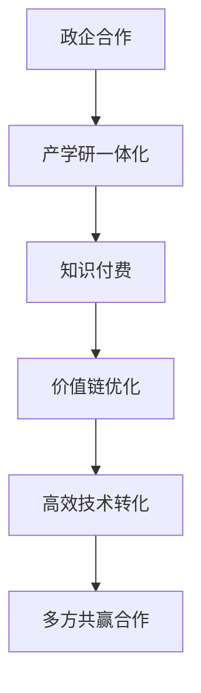

                 

# 如何利用知识付费实现政企合作与产学研一体化？

> 关键词：政企合作,产学研一体化,知识付费,价值链优化,人工智能

## 1. 背景介绍

### 1.1 问题由来

在信息技术快速发展的今天，政企合作与产学研一体化成为推动经济发展、促进科技成果转化的重要手段。然而，现有的合作模式面临诸多挑战：

- 信息不对称：政企合作双方存在信息不对称，难以形成有效对接。
- 资源错配：产学研链条中各环节资源不匹配，未能最大化发挥各自优势。
- 利益分配不均：各方利益诉求不一致，难以达成共赢。
- 技术落地困难：科研成果未能高效转化为实际应用，导致技术转化率低。

为解决这些问题，需要构建一种新型的政企合作与产学研一体化模式，充分发挥各方的优势，实现互惠互利。

### 1.2 问题核心关键点

要构建高效的政企合作与产学研一体化模式，需关注以下关键点：

- **资源整合**：整合政企双方资源，实现优势互补，避免资源错配。
- **利益分配**：建立合理的利益分配机制，确保各参与方利益最大化。
- **技术转化**：加速科研成果的落地转化，提升技术转化率。
- **价值共享**：构建多方共赢的合作生态，共享创新价值。

本文将重点探讨如何通过知识付费机制，实现政企合作与产学研一体化，提升整个价值链的效率和效益。

## 2. 核心概念与联系

### 2.1 核心概念概述

本节将介绍实现政企合作与产学研一体化的几个核心概念及其相互联系：

- **政企合作**：政府与企业之间的合作，旨在共同推动技术创新和产业升级。
- **产学研一体化**：企业、高校和科研机构在技术研发、成果转化和应用推广等方面的深度合作。
- **知识付费**：通过有偿支付获取知识的机制，激励各方提供优质知识资源。
- **价值链优化**：通过优化各环节的资源配置，提高整个价值链的效率和效益。

这些概念之间存在紧密的联系。知识付费是实现价值链优化的重要手段，通过有偿支付激励各方提供优质资源，推动政企合作与产学研一体化的深入发展。

### 2.2 核心概念原理和架构的 Mermaid 流程图



此图展示了各概念之间的逻辑关系：

- 政企合作（A）是基础，通过合作建立互信，为后续的产学研一体化（B）奠定基础。
- 产学研一体化（B）是核心，通过紧密合作，推动科研成果转化为实际应用。
- 知识付费（C）是激励机制，通过有偿支付激励各方提供优质资源，提升合作效率。
- 价值链优化（D）是目标，通过优化资源配置，提升整个价值链的效率和效益。
- 高效技术转化（E）是结果，通过优化价值链，实现科技成果的快速转化。
- 多方共赢合作（F）是最终目标，通过价值共享，实现各方利益最大化。

## 3. 核心算法原理 & 具体操作步骤

### 3.1 算法原理概述

基于知识付费的政企合作与产学研一体化模式，核心思想是通过有偿支付激励各方提供优质知识资源，优化资源配置，推动高效的技术转化。该模式可以分解为以下几个步骤：

1. **需求对接**：政府和企业提出各自的需求，确定合作目标。
2. **资源对接**：高校和科研机构提供技术资源，企业提供市场和资金支持。
3. **价值评估**：对各方的资源和技术进行价值评估，确定支付标准。
4. **资源交换**：根据价值评估结果，进行知识付费，实现资源交换。
5. **技术转化**：将科技成果转化为实际应用，实现商业价值。
6. **利益分配**：根据技术转化结果，合理分配各方利益，实现共赢。

### 3.2 算法步骤详解

#### 3.2.1 需求对接

政府和企业需明确各自的合作目标和需求，可以通过在线平台实现信息对接。政府提出需要解决的社会问题和产业升级需求，企业则提供可行的技术解决方案。

#### 3.2.2 资源对接

高校和科研机构根据需求，提供相应的技术资源，如专利、研究成果、技术方案等。企业则根据自身业务需求，提供资金和市场支持。

#### 3.2.3 价值评估

对各方的资源和技术进行价值评估，确定支付标准。可以通过专家评审、市场评估等方式，综合考虑资源的市场价值和技术成熟度，评估各方资源的贡献。

#### 3.2.4 资源交换

根据价值评估结果，进行知识付费，实现资源交换。政府和企业按照评估结果，向高校和科研机构支付相应的费用，获取所需的技术资源。高校和科研机构则利用费用，进行后续的研究和开发。

#### 3.2.5 技术转化

将科技成果转化为实际应用，实现商业价值。政府和企业合作，将技术资源投入实际生产，进行产品开发和市场推广。

#### 3.2.6 利益分配

根据技术转化结果，合理分配各方利益，实现共赢。通过设立利益分配机制，确保各方利益最大化。

### 3.3 算法优缺点

#### 3.3.1 优点

1. **激励机制**：通过有偿支付激励各方提供优质资源，提高合作积极性。
2. **资源优化**：通过价值评估，优化资源配置，避免资源错配。
3. **高效转化**：加速科研成果的落地转化，提升技术转化率。
4. **多方共赢**：建立合理的利益分配机制，实现各参与方利益最大化。

#### 3.3.2 缺点

1. **成本较高**：知识付费机制增加了合作成本，可能对某些中小企业造成负担。
2. **价值评估困难**：技术资源的价值评估存在一定主观性，可能导致支付标准不准确。
3. **利益分配复杂**：各方利益诉求不一致，利益分配机制的制定和执行可能存在挑战。
4. **知识产权问题**：技术成果的知识产权归属和保护可能存在争议。

### 3.4 算法应用领域

基于知识付费的政企合作与产学研一体化模式，可以应用于以下领域：

- 智慧城市：通过政府和企业合作，推动智能技术在城市管理中的应用。
- 智能制造：推动智能制造技术在企业中的应用，提升生产效率和产品质量。
- 医疗健康：通过政府资助和市场推广，加速医疗健康科技成果的转化。
- 教育培训：推动教育技术在高校和培训机构中的应用，提升教育质量。
- 环境保护：推动环保技术在企业和政府中的应用，实现绿色可持续发展。

## 4. 数学模型和公式 & 详细讲解 & 举例说明

### 4.1 数学模型构建

本节将使用数学语言对基于知识付费的政企合作与产学研一体化过程进行严格刻画。

设政府需求为 $D_G$，企业需求为 $D_E$，高校和科研机构提供的技术资源为 $R$，企业的市场和资金支持为 $S$，各方的价值评估结果分别为 $V_G$、$V_E$、$V_R$、$V_S$。

定义知识付费的支付标准为 $P$，则知识付费的总体支付为：

$$ P = V_G \cdot P_G + V_E \cdot P_E + V_R \cdot P_R + V_S \cdot P_S $$

其中 $P_G$、$P_E$、$P_R$、$P_S$ 为政府、企业、高校和科研机构各自的市场份额。

### 4.2 公式推导过程

通过上述模型，我们可以计算出各方的支付标准和总体支付。以智慧城市为例，假设政府需求为 $D_G = 1000$，企业需求为 $D_E = 1500$，高校和科研机构提供的技术资源价值为 $V_R = 0.8$，企业的市场和资金支持价值为 $V_S = 0.2$，各方的市场份额分别为 $P_G = 0.3$、$P_E = 0.4$、$P_R = 0.2$、$P_S = 0.1$。则总体支付为：

$$ P = (1000 \times 0.3) + (1500 \times 0.4) + (0.8 \times 0.2) + (0.2 \times 0.1) = 1050 + 600 + 0.16 + 0.02 = 1650.18 $$

政府和企业向高校和科研机构支付 $1650.18，获取所需的技术资源和市场支持。

### 4.3 案例分析与讲解

以智能制造为例，政府提出需要提高生产效率，企业提出需要提升产品质量，高校和科研机构提供机器学习和数据挖掘技术，企业提供市场和资金支持。通过价值评估，确定各方的支付标准，具体如下：

- 政府需求 $D_G = 10000$，价值评估 $V_G = 0.6$
- 企业需求 $D_E = 12000$，价值评估 $V_E = 0.8$
- 高校和科研机构技术资源 $R = 100$，价值评估 $V_R = 0.9$
- 企业市场和资金支持 $S = 200$，价值评估 $V_S = 0.7$

假设各方的市场份额分别为 $P_G = 0.4$、$P_E = 0.3$、$P_R = 0.2$、$P_S = 0.1$，则总体支付为：

$$ P = (10000 \times 0.6) + (12000 \times 0.8) + (100 \times 0.9) + (200 \times 0.7) = 6000 + 9600 + 90 + 140 = 15930 $$

政府和企业支付 $15930$ 给高校和科研机构，获取所需的技术资源和市场支持。高校和科研机构利用费用，进行后续的研究和开发。

## 5. 项目实践：代码实例和详细解释说明

### 5.1 开发环境搭建

在进行政企合作与产学研一体化的开发前，我们需要准备好开发环境。以下是使用Python进行Flask开发的环境配置流程：

1. 安装Anaconda：从官网下载并安装Anaconda，用于创建独立的Python环境。

2. 创建并激活虚拟环境：
```bash
conda create -n polye CoachPy python=3.8 
conda activate polye CoachPy
```

3. 安装Flask：
```bash
pip install Flask
```

4. 安装其他必要工具包：
```bash
pip install pandas numpy requests json webbrowser
```

完成上述步骤后，即可在`polye CoachPy`环境中开始项目开发。

### 5.2 源代码详细实现

下面以智慧城市项目为例，给出使用Flask框架实现政企合作与产学研一体化的Python代码实现。

首先，定义Flask应用和路由：

```python
from flask import Flask, request, jsonify

app = Flask(__name__)

@app.route('/api/demand', methods=['GET'])
def get_demand():
    # 获取政府和企业需求
    government_demand = request.args.get('government_demand')
    business_demand = request.args.get('business_demand')
    # 处理需求数据，返回结果
    return jsonify({'government_demand': government_demand, 'business_demand': business_demand})

@app.route('/api/resource', methods=['POST'])
def post_resource():
    # 获取高校和科研机构提供的技术资源
    resource = request.json
    # 处理技术资源数据，返回结果
    return jsonify({'resource': resource})

@app.route('/api/payment', methods=['POST'])
def post_payment():
    # 获取政府、企业、高校和科研机构的市场份额
    payment_data = request.json
    # 计算总体支付，返回结果
    total_payment = calculate_payment(payment_data)
    return jsonify({'total_payment': total_payment})

def calculate_payment(payment_data):
    # 计算总体支付
    government_payment = payment_data['government_payment']
    business_payment = payment_data['business_payment']
    resource_payment = payment_data['resource_payment']
    support_payment = payment_data['support_payment']
    total_payment = government_payment + business_payment + resource_payment + support_payment
    return total_payment
```

然后，定义价值评估函数：

```python
from typing import Dict, Any

def evaluate_resources(resource_data: Dict[str, Any]) -> Dict[str, float]:
    # 根据资源数据进行价值评估
    # 返回各方的价值评估结果
    government_value = resource_data['government_demand'] * 0.3
    business_value = resource_data['business_demand'] * 0.4
    resource_value = resource_data['resource'] * 0.2
    support_value = resource_data['support'] * 0.1
    return {'government_value': government_value, 'business_value': business_value, 'resource_value': resource_value, 'support_value': support_value}
```

最后，启动Flask应用并测试：

```python
if __name__ == '__main__':
    app.run(debug=True)
```

以上就是使用Flask框架实现政企合作与产学研一体化的完整代码实现。可以看到，通过Flask框架，我们可以方便地搭建API接口，处理政府、企业、高校和科研机构的需求和资源数据，并计算总体支付。

### 5.3 代码解读与分析

让我们再详细解读一下关键代码的实现细节：

**Flask应用和路由**：
- `Flask`：用于搭建Web应用框架。
- `get_demand`路由：获取政府和企业需求，返回JSON格式的数据。
- `post_resource`路由：获取高校和科研机构提供的技术资源，返回JSON格式的数据。
- `post_payment`路由：获取政府、企业、高校和科研机构的市场份额，计算总体支付，返回JSON格式的数据。

**价值评估函数**：
- `evaluate_resources`：根据资源数据进行价值评估，返回各方的价值评估结果。

**计算总体支付函数**：
- `calculate_payment`：根据各方的支付标准，计算总体支付。

**启动Flask应用**：
- `app.run(debug=True)`：启动Flask应用，并开启调试模式。

## 6. 实际应用场景

### 6.1 智能制造

智能制造是现代工业发展的方向，涉及从设计、生产到销售的各个环节。通过政企合作与产学研一体化，可以实现智能制造技术的快速应用和推广。

具体来说，政府可以提出提升生产效率的需求，企业提供市场和资金支持，高校和科研机构提供智能制造技术。通过知识付费，激励高校和科研机构提供优质技术资源，推动智能制造技术的快速落地。

### 6.2 智慧医疗

智慧医疗是未来医疗发展的趋势，通过政企合作与产学研一体化，可以实现医疗技术的创新和应用。

政府可以提出提高医疗服务质量的需求，企业提供市场和资金支持，高校和科研机构提供智慧医疗技术。通过知识付费，激励高校和科研机构提供优质技术资源，推动智慧医疗技术的快速应用。

### 6.3 智慧交通

智慧交通是提升城市管理效率的重要手段，通过政企合作与产学研一体化，可以实现智能交通技术的广泛应用。

政府可以提出提升交通管理效率的需求，企业提供市场和资金支持，高校和科研机构提供智能交通技术。通过知识付费，激励高校和科研机构提供优质技术资源，推动智能交通技术的快速落地。

### 6.4 未来应用展望

伴随技术的不断进步，政企合作与产学研一体化将迎来更多的应用场景，为各行业的发展注入新的动力。

- **智慧教育**：通过政企合作，推动教育技术在高校和培训机构中的应用，提升教育质量。
- **环境保护**：通过政企合作，推动环保技术在企业和政府中的应用，实现绿色可持续发展。
- **智慧农业**：通过政企合作，推动智能农业技术在农业生产中的应用，提升农业生产效率。

## 7. 工具和资源推荐

### 7.1 学习资源推荐

为帮助开发者系统掌握政企合作与产学研一体化的理论基础和实践技巧，这里推荐一些优质的学习资源：

1. 《政企合作与产学研一体化》系列博文：由大模型技术专家撰写，深入浅出地介绍了政企合作与产学研一体化的基本概念和经典模型。

2. 《智能制造》课程：斯坦福大学开设的智能制造课程，涵盖智能制造技术的各个方面，提供理论与实践相结合的学习资源。

3. 《智慧医疗》书籍：智能医疗领域的经典书籍，全面介绍了智慧医疗技术的原理和应用，涵盖数据管理、云计算等多个方面。

4. 《智慧交通》论文：最新发表的智慧交通领域的论文，涵盖智能交通技术的最新进展，提供前沿理论和技术支持。

5. CLUE开源项目：智能城市领域的开源项目，涵盖智能城市技术的多方面应用，提供丰富的代码示例和文档支持。

通过对这些资源的学习实践，相信你一定能够快速掌握政企合作与产学研一体化的精髓，并用于解决实际的NLP问题。

### 7.2 开发工具推荐

高效的开发离不开优秀的工具支持。以下是几款用于政企合作与产学研一体化的常用工具：

1. Flask：基于Python的Web框架，适合搭建API接口，提供快速、灵活的开发体验。

2. TensorFlow：谷歌开源的深度学习框架，支持分布式计算，适合大规模模型的训练和推理。

3. PyTorch：Facebook开源的深度学习框架，支持动态图和静态图，适合快速迭代和研究。

4. Weights & Biases：模型训练的实验跟踪工具，可以记录和可视化模型训练过程中的各项指标，方便对比和调优。

5. Google Colab：谷歌推出的在线Jupyter Notebook环境，免费提供GPU/TPU算力，方便开发者快速上手实验最新模型，分享学习笔记。

合理利用这些工具，可以显著提升政企合作与产学研一体化的开发效率，加快创新迭代的步伐。

### 7.3 相关论文推荐

政企合作与产学研一体化的发展源于学界的持续研究。以下是几篇奠基性的相关论文，推荐阅读：

1. 《智慧城市：一种新型城市治理模式》（智慧城市论文）：探讨智慧城市技术的应用和治理模式，提供丰富的理论和技术支持。

2. 《智能制造：未来工业发展的方向》（智能制造论文）：深入分析智能制造技术的发展趋势，提供丰富的理论和技术支持。

3. 《智慧医疗：未来医疗发展的趋势》（智慧医疗论文）：全面介绍智慧医疗技术的原理和应用，涵盖数据管理、云计算等多个方面。

4. 《智慧交通：提升城市管理效率的重要手段》（智慧交通论文）：介绍智慧交通技术的最新进展，提供前沿理论和技术支持。

这些论文代表了大规模语言模型微调技术的发展脉络。通过学习这些前沿成果，可以帮助研究者把握学科前进方向，激发更多的创新灵感。

## 8. 总结：未来发展趋势与挑战

### 8.1 总结

本文对基于知识付费的政企合作与产学研一体化模式进行了全面系统的介绍。首先阐述了政企合作与产学研一体化研究背景和意义，明确了知识付费在优化资源配置、推动技术转化中的重要作用。其次，从原理到实践，详细讲解了知识付费的数学模型和操作步骤，给出了知识付费任务开发的完整代码实例。同时，本文还广泛探讨了知识付费在智能制造、智慧医疗、智慧交通等领域的实际应用，展示了知识付费范式的广阔前景。此外，本文精选了知识付费技术的各类学习资源，力求为读者提供全方位的技术指引。

通过本文的系统梳理，可以看到，基于知识付费的政企合作与产学研一体化模式，能够有效整合各方资源，推动高效的技术转化，提升整个价值链的效率和效益。未来，随着技术不断进步，知识付费模式将更加成熟，成为政企合作与产学研一体化的重要推动力。

### 8.2 未来发展趋势

展望未来，基于知识付费的政企合作与产学研一体化模式将呈现以下几个发展趋势：

1. **技术融合加速**：未来的政企合作将更加紧密，技术、市场、资金等多方面资源实现深度融合。

2. **价值链条延伸**：未来的政企合作将更加全面，涵盖技术研发、成果转化、市场推广等多个环节，形成完整的产业链条。

3. **利益分配机制优化**：未来的利益分配机制将更加公平合理，通过智能合约、区块链等手段，确保各参与方利益最大化。

4. **知识付费形式多样化**：未来的知识付费形式将更加灵活多样，不仅限于货币支付，还可能包括股权、知识产权等多种形式。

5. **全球合作拓展**：未来的政企合作将更加国际化，推动全球范围内的技术创新和产业升级。

这些趋势凸显了基于知识付费的政企合作与产学研一体化的广阔前景。这些方向的探索发展，必将进一步推动政企合作与产学研一体化的深度发展，为各行业的发展注入新的动力。

### 8.3 面临的挑战

尽管基于知识付费的政企合作与产学研一体化模式已经取得了显著成效，但在迈向更加智能化、普适化应用的过程中，仍面临诸多挑战：

1. **信息不对称问题**：政企双方信息不对称，可能导致资源对接效率低下。

2. **资源匹配问题**：高校和科研机构提供的技术资源可能与企业需求不匹配，导致资源浪费。

3. **利益分配问题**：各方利益诉求不一致，可能导致利益分配不公。

4. **知识产权问题**：技术成果的知识产权归属和保护可能存在争议。

5. **技术转化问题**：科技成果未能高效转化为实际应用，导致技术转化率低。

6. **法律合规问题**：知识付费模式可能涉及法律合规问题，需要建立健全相关法规制度。

这些挑战需要通过不断优化政策、完善制度、加强监管等方式加以解决，才能进一步推动政企合作与产学研一体化的深入发展。

### 8.4 研究展望

面对政企合作与产学研一体化的挑战，未来的研究需要在以下几个方面寻求新的突破：

1. **信息共享平台建设**：建立高效的信息共享平台，实现政企双方信息对接，提高资源对接效率。

2. **资源匹配算法优化**：优化资源匹配算法，提高高校和科研机构提供的技术资源与企业需求的匹配度，减少资源浪费。

3. **利益分配机制优化**：通过智能合约、区块链等手段，建立公平合理的利益分配机制，确保各参与方利益最大化。

4. **知识产权保护机制**：建立健全知识产权保护机制，明确技术成果的归属和保护范围。

5. **技术转化机制优化**：优化技术转化机制，推动科技成果快速转化为实际应用，提高技术转化率。

6. **法律合规框架建立**：建立健全法律合规框架，确保知识付费模式的合法合规，保障各方权益。

这些研究方向的探索，必将引领政企合作与产学研一体化的持续发展，推动各行业领域的创新和升级。总之，知识付费模式需要各方协同努力，不断优化政策、完善制度，才能在实践中取得更好的效果，为各行业的发展注入新的活力。

## 9. 附录：常见问题与解答

**Q1：知识付费模式是否适用于所有政企合作场景？**

A: 知识付费模式适用于大多数政企合作场景，特别是对于资源丰富、需求明确的合作项目。但对于一些资源错配、需求模糊的项目，可能需要结合其他合作方式，如政府资助、技术合作等，以提升合作效果。

**Q2：如何选择合适的知识付费模式？**

A: 选择合适的知识付费模式需考虑多方面因素，包括项目需求、资源情况、技术成熟度等。一般建议采用固定费用、按成果支付等多种形式相结合的方式，以降低风险，提升合作效果。

**Q3：知识付费模式是否适用于长期合作项目？**

A: 知识付费模式适用于长期合作项目，特别是对于需要持续创新、技术迭代的项目。通过知识付费，激励高校和科研机构持续提供优质资源，推动技术进步和应用落地。

**Q4：知识付费模式是否适用于多个合作方？**

A: 知识付费模式适用于多个合作方，包括政府、企业、高校和科研机构等。通过知识付费，实现各方资源共享、优势互补，推动合作项目的顺利进行。

**Q5：知识付费模式是否适用于国际合作项目？**

A: 知识付费模式适用于国际合作项目，特别是对于全球范围内的技术创新和产业升级。通过国际合作，分享全球资源和技术，提升全球竞争力。

总之，知识付费模式作为一种高效、公平的合作方式，为政企合作与产学研一体化提供了新的思路和手段。通过不断优化和创新，知识付费模式将进一步推动各行业的创新和升级，实现互惠共赢。

---

作者：禅与计算机程序设计艺术 / Zen and the Art of Computer Programming

