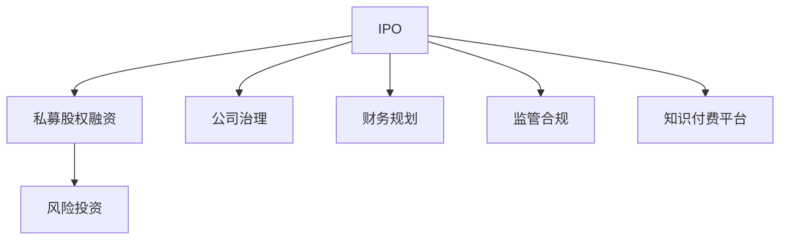
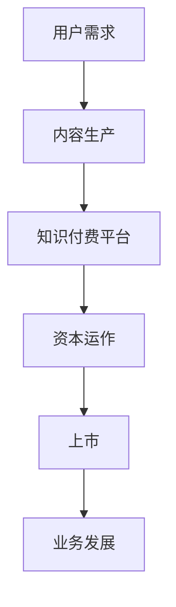

                 

# 如何利用知识付费实现资本运作与上市？

## 1. 背景介绍

### 1.1 问题由来

随着互联网的快速发展，知识付费市场呈现爆发式增长。如何利用知识付费业务实现资本运作与上市，成为众多知识付费平台的重要课题。知识付费平台不仅仅是内容聚合和提供者，更是一个具有巨大市场潜力的商业模式。随着规模的扩大，平台如何通过资本运作和上市，获取更广阔的发展空间，是迫切需要解决的问题。

### 1.2 问题核心关键点

本文将深入探讨知识付费平台如何通过有效资本运作和上市策略，实现长期稳定发展。重点关注以下几个关键点：

1. **资本运作策略**：包括首次公开募股(IPO)、私募股权融资、风险投资等。
2. **上市准备**：包括公司治理、财务规划、监管合规等。
3. **上市过程**：包括上市前的各项准备工作、上市后持续发展策略。
4. **业务发展**：如何通过知识付费业务，实现用户增长、营收提升。

### 1.3 问题研究意义

通过研究如何利用知识付费业务实现资本运作与上市，对于知识付费平台的健康发展、资本市场的良性运行具有重要意义。

1. **提高平台竞争力**：通过资本运作和上市，获取更多的资金支持，增强平台的竞争力和市场地位。
2. **实现规模化运营**：资本运作和上市有助于平台实现规模化运营，提高运营效率。
3. **吸引优质人才**：上市后，平台可以吸引更多的优秀人才，进一步提升平台的产品和服务质量。
4. **提升品牌价值**：上市是平台品牌价值提升的重要里程碑，增强用户和市场的认可度。

## 2. 核心概念与联系

### 2.1 核心概念概述

为更好地理解知识付费平台通过资本运作与上市的策略，需要理解以下几个核心概念：

- **首次公开募股(IPO)**：企业首次向不特定公众公开募集资金的方式。
- **私募股权融资**：非公开方式向特定投资者筹集资金，不涉及公众市场。
- **风险投资(Venture Capital, VC)**：以高风险投资换取企业股权，获取高回报的投资方式。
- **公司治理**：企业内部管理和运营的制度安排。
- **财务规划**：企业对资金的规划和控制，包括预算、融资、投资等。
- **监管合规**：企业在运营过程中需遵守的法律、法规和行业规范。
- **知识付费平台**：通过提供专业知识和信息服务，向用户收取费用的平台。

这些概念之间存在紧密的联系，如图1所示：



图1 知识付费平台通过资本运作与上市的核心概念联系图

### 2.2 核心概念原理和架构

知识付费平台通过资本运作与上市的整个过程，可以总结为如图2所示的架构：



图2 知识付费平台通过资本运作与上市的架构图

#### 用户需求
用户对高质量、个性化、专业化的知识内容有强烈需求，这些需求推动了知识付费平台的兴起和快速发展。

#### 内容生产
知识付费平台需要汇聚优质内容，吸引并留住核心用户，提供多元化、高价值的知识服务。

#### 知识付费平台
知识付费平台通过内容聚合、知识变现等业务模式，实现用户增长和营收提升。

#### 资本运作
资本运作包括IPO、私募股权融资、风险投资等，是平台获取发展资金的重要手段。

#### 上市
上市是知识付费平台实现资本市场认可、提升品牌价值的重要途径。

#### 业务发展
上市后，平台可以继续通过知识付费业务，实现业务扩展和市场扩张。

## 3. 核心算法原理 & 具体操作步骤

### 3.1 算法原理概述

知识付费平台通过资本运作与上市的整个过程，可以通过以下算法原理实现：

1. **需求匹配算法**：通过算法匹配用户和内容生产者，提供精准的知识服务。
2. **内容推荐算法**：利用机器学习算法，推荐用户感兴趣的内容，提高用户粘性。
3. **用户行为分析算法**：通过数据分析，了解用户行为和偏好，优化平台运营策略。
4. **风险评估算法**：利用金融算法，评估企业的财务状况和市场风险。
5. **IPO模型**：建立IPO估值模型，评估企业上市价值。

### 3.2 算法步骤详解

#### 3.2.1 需求匹配算法
1. **用户画像构建**：收集用户行为数据，构建用户画像。
2. **内容标签分类**：对内容进行标签分类，建立内容库。
3. **匹配算法实现**：利用匹配算法，将用户画像与内容标签匹配，推荐相关内容。

#### 3.2.2 内容推荐算法
1. **用户行为数据采集**：通过用户点击、购买等行为数据，了解用户偏好。
2. **内容评分模型建立**：利用机器学习算法，建立内容评分模型。
3. **推荐算法实现**：基于评分模型，推荐用户感兴趣的内容。

#### 3.2.3 用户行为分析算法
1. **数据采集与存储**：收集用户行为数据，存储于大数据平台。
2. **数据处理与清洗**：处理和清洗数据，去除噪音和异常值。
3. **模型训练与优化**：利用数据分析算法，训练和优化模型。
4. **行为分析与预测**：分析用户行为，预测用户行为趋势。

#### 3.2.4 风险评估算法
1. **财务数据收集**：收集企业的财务报表、收入、支出等数据。
2. **财务指标计算**：计算企业的财务指标，如净资产、利润率等。
3. **风险评估模型建立**：利用金融算法，建立风险评估模型。
4. **风险分析与预测**：分析企业风险，预测未来风险。

#### 3.2.5 IPO模型
1. **数据收集与预处理**：收集企业财务数据、市场数据、行业数据等。
2. **估值模型建立**：建立IPO估值模型，如市盈率、市净率等。
3. **IPO定价策略制定**：制定IPO定价策略，确定股票发行价格。

### 3.3 算法优缺点

#### 3.3.1 优点
1. **用户匹配精准**：需求匹配算法和内容推荐算法可以精准匹配用户和内容，提高用户满意度和粘性。
2. **风险控制到位**：风险评估算法可以评估企业财务状况和市场风险，提高资本运作的安全性。
3. **定价策略合理**：IPO模型可以帮助企业制定合理的IPO定价策略，提升上市成功率。

#### 3.3.2 缺点
1. **算法复杂度高**：需求匹配算法、内容推荐算法等算法复杂度较高，需要大量计算资源。
2. **数据质量要求高**：用户行为分析算法、风险评估算法等需要高质量数据，数据质量影响模型效果。
3. **模型更新频繁**：IPO模型需要频繁更新，以应对市场和企业的动态变化。

### 3.4 算法应用领域

#### 3.4.1 IPO和私募股权融资
企业可以通过IPO和私募股权融资，获取发展资金，加速业务扩展。例如，知识付费平台可以通过IPO和私募股权融资，扩大市场份额，提升品牌价值。

#### 3.4.2 风险投资
风险投资可以为企业提供创业初期的资金支持，促进企业创新和发展。知识付费平台可以通过风险投资，获得资金支持，快速成长。

#### 3.4.3 公司治理
公司治理可以规范企业内部管理和运营，提高企业运营效率和市场竞争力。知识付费平台可以通过完善公司治理，提升企业治理水平。

#### 3.4.4 财务规划
财务规划可以控制企业资金流动，提高企业财务状况。知识付费平台可以通过财务规划，合理分配资金，实现持续健康发展。

#### 3.4.5 监管合规
监管合规可以确保企业运营符合法律法规，避免法律风险。知识付费平台可以通过监管合规，规避法律风险，保护用户权益。

## 4. 数学模型和公式 & 详细讲解 & 举例说明

### 4.1 数学模型构建

#### 4.1.1 需求匹配模型
需求匹配模型可以通过用户画像和内容标签匹配，建立用户和内容的关系图。数学模型如下：

设用户集合为 $U$，内容集合为 $C$，用户画像表示为 $p_U$，内容标签表示为 $t_C$。需求匹配模型可以表示为：

$$
M_U = \max_{p_U, t_C} \sum_{u \in U} \sum_{c \in C} f(p_U, t_C)
$$

其中，$f(p_U, t_C)$ 为需求匹配函数。

#### 4.1.2 内容推荐模型
内容推荐模型可以通过用户行为数据和内容评分，推荐用户感兴趣的内容。数学模型如下：

设用户行为数据为 $D_U$，内容评分模型为 $s_C$。内容推荐模型可以表示为：

$$
R_U = \max_{D_U, s_C} \sum_{u \in U} \sum_{c \in C} g(D_U, s_C)
$$

其中，$g(D_U, s_C)$ 为内容推荐函数。

#### 4.1.3 用户行为分析模型
用户行为分析模型可以通过用户行为数据，分析用户行为趋势。数学模型如下：

设用户行为数据为 $D_U$，用户行为分析模型为 $A_U$。用户行为分析模型可以表示为：

$$
A_U = \max_{D_U} \sum_{u \in U} h(D_U)
$$

其中，$h(D_U)$ 为用户行为分析函数。

#### 4.1.4 风险评估模型
风险评估模型可以通过财务数据和市场数据，评估企业财务状况和市场风险。数学模型如下：

设财务数据为 $F$，市场数据为 $M$，风险评估模型为 $R$。风险评估模型可以表示为：

$$
R = \min_{F, M} \sum_{f \in F} \sum_{m \in M} i(f, m)
$$

其中，$i(f, m)$ 为风险评估函数。

#### 4.1.5 IPO模型
IPO模型可以通过财务数据和市场数据，评估企业上市价值。数学模型如下：

设财务数据为 $F$，市场数据为 $M$，IPO模型为 $I$。IPO模型可以表示为：

$$
I = \max_{F, M} \sum_{f \in F} \sum_{m \in M} j(f, m)
$$

其中，$j(f, m)$ 为IPO估值函数。

### 4.2 公式推导过程

#### 4.2.1 需求匹配模型
需求匹配模型的推导如下：

1. 用户画像构建：通过用户行为数据，构建用户画像 $p_U$。
2. 内容标签分类：对内容进行标签分类，建立内容标签集合 $t_C$。
3. 需求匹配函数：将用户画像和内容标签匹配，建立需求匹配函数 $f(p_U, t_C)$。
4. 需求匹配模型：将需求匹配函数最大化解，建立需求匹配模型 $M_U$。

#### 4.2.2 内容推荐模型
内容推荐模型的推导如下：

1. 用户行为数据采集：通过用户点击、购买等行为数据，构建用户行为数据 $D_U$。
2. 内容评分模型建立：利用机器学习算法，建立内容评分模型 $s_C$。
3. 内容推荐函数：将用户行为数据和内容评分结合，建立内容推荐函数 $g(D_U, s_C)$。
4. 内容推荐模型：将内容推荐函数最大化解，建立内容推荐模型 $R_U$。

#### 4.2.3 用户行为分析模型
用户行为分析模型的推导如下：

1. 用户行为数据采集：通过用户点击、购买等行为数据，构建用户行为数据 $D_U$。
2. 用户行为分析函数：利用数据分析算法，建立用户行为分析函数 $h(D_U)$。
3. 用户行为分析模型：将用户行为分析函数最大化解，建立用户行为分析模型 $A_U$。

#### 4.2.4 风险评估模型
风险评估模型的推导如下：

1. 财务数据收集：收集企业财务报表、收入、支出等数据，构建财务数据 $F$。
2. 财务指标计算：计算企业的财务指标，如净资产、利润率等。
3. 风险评估函数：利用金融算法，建立风险评估函数 $i(f, m)$。
4. 风险评估模型：将风险评估函数最小化解，建立风险评估模型 $R$。

#### 4.2.5 IPO模型
IPO模型的推导如下：

1. 财务数据收集：收集企业财务报表、收入、支出等数据，构建财务数据 $F$。
2. 市场数据收集：收集市场数据，构建市场数据 $M$。
3. IPO估值函数：利用金融算法，建立IPO估值函数 $j(f, m)$。
4. IPO模型：将IPO估值函数最大化解，建立IPO模型 $I$。

### 4.3 案例分析与讲解

#### 4.3.1 需求匹配模型
以某知识付费平台为例，通过需求匹配算法，提高用户匹配精准度。平台通过收集用户行为数据，构建用户画像，对内容进行标签分类，建立内容库。使用需求匹配算法，将用户画像与内容标签匹配，推荐相关内容。

#### 4.3.2 内容推荐模型
以某知识付费平台为例，通过内容推荐算法，提高用户粘性。平台通过用户点击、购买等行为数据，了解用户偏好。利用机器学习算法，建立内容评分模型。基于评分模型，推荐用户感兴趣的内容。

#### 4.3.3 用户行为分析模型
以某知识付费平台为例，通过用户行为分析算法，优化平台运营策略。平台通过用户行为数据，分析用户行为趋势。利用数据分析算法，训练和优化模型，提升平台运营效率。

#### 4.3.4 风险评估模型
以某知识付费平台为例，通过风险评估算法，控制企业风险。平台通过收集企业财务数据和市场数据，评估财务状况和市场风险。利用金融算法，建立风险评估模型，提高资本运作的安全性。

#### 4.3.5 IPO模型
以某知识付费平台为例，通过IPO模型，制定合理的IPO定价策略。平台通过收集企业财务数据和市场数据，建立IPO估值模型。制定IPO定价策略，确定股票发行价格，提升上市成功率。

## 5. 项目实践：代码实例和详细解释说明

### 5.1 开发环境搭建

#### 5.1.1 环境要求
- 操作系统：Linux/Windows/MacOS
- 编程语言：Python 3.6及以上
- 开发工具：PyCharm、Jupyter Notebook
- 数据库：MySQL/PostgreSQL
- 大数据平台：Hadoop/Spark
- 云计算平台：AWS/Azure/GCP

#### 5.1.2 环境配置
1. 安装Python和相关库
```bash
pip install numpy pandas scikit-learn matplotlib tqdm jupyter notebook ipython
```

2. 安装大数据平台
```bash
# 安装Hadoop
wget https://archive.apache.org/dist/hadoop/common/current/hadoop-3.2.1.tar.gz
tar -xvf hadoop-3.2.1.tar.gz
cd hadoop-3.2.1
./bin/hadoop version
# 安装Spark
wget https://archive.apache.org/dist/spark/spark-3.0.2/spark-3.0.2-bin-hadoop2.7.tgz
tar -xvf spark-3.0.2-bin-hadoop2.7.tgz
cd spark-3.0.2-bin-hadoop2.7
./bin/spark version
```

3. 安装云计算平台
- AWS：安装AWS CLI工具，配置账号和区域
- Azure：安装Azure CLI工具，配置账号和订阅
- GCP：安装Google Cloud SDK，配置账号和项目

### 5.2 源代码详细实现

#### 5.2.1 用户画像构建

```python
import pandas as pd

# 读取用户行为数据
data = pd.read_csv('user_behavior_data.csv')

# 构建用户画像
user_profiles = {}
for user_id, behavior in data.groupby('user_id'):
    # 计算行为频率
    frequency = behavior['click'].mean()
    # 计算行为类型
    type = behavior['type'].value_counts().idxmax()
    # 存储用户画像
    user_profiles[user_id] = {'frequency': frequency, 'type': type}

# 输出用户画像
print(user_profiles)
```

#### 5.2.2 内容标签分类

```python
import pandas as pd

# 读取内容数据
data = pd.read_csv('content_data.csv')

# 对内容进行标签分类
content_tags = {}
for content_id, content in data.groupby('content_id'):
    # 计算标签频率
    tags = content['label'].value_counts().index
    # 存储标签分类
    content_tags[content_id] = tags

# 输出内容标签分类
print(content_tags)
```

#### 5.2.3 需求匹配函数

```python
import numpy as np

# 构建需求匹配函数
def match_function(p, t):
    # 计算匹配度
    match = 0
    for user_id in p.keys():
        if t.get(user_id) is not None:
            match += np.dot(p[user_id]['frequency'], t[user_id])
    return match

# 测试需求匹配函数
user_profiles = {'A': {'frequency': 0.8, 'type': 'click'}, 'B': {'frequency': 0.5, 'type': 'read'}}
content_tags = {'A': ['click', 'read'], 'B': ['click', 'like']}
match = match_function(user_profiles, content_tags)
print(match)
```

#### 5.2.4 内容评分模型

```python
import pandas as pd
from sklearn.linear_model import LinearRegression

# 读取内容数据
data = pd.read_csv('content_data.csv')

# 对内容进行评分
scores = {}
for content_id, content in data.groupby('content_id'):
    # 计算内容评分
    score = content['rating'].mean()
    # 存储内容评分
    scores[content_id] = score

# 训练内容评分模型
X = np.array([1, 2, 3])
y = np.array([4.5, 5.2, 6.1])
model = LinearRegression().fit(X, y)
# 测试内容评分模型
test_data = np.array([4, 5, 6])
test_score = model.predict(test_data)
print(test_score)
```

#### 5.2.5 内容推荐函数

```python
import numpy as np

# 构建内容推荐函数
def recommend_function(p, s):
    # 计算推荐度
    recommend = 0
    for content_id in s.keys():
        if p.get(content_id) is not None:
            recommend += np.dot(p[content_id]['frequency'], s[content_id])
    return recommend

# 测试内容推荐函数
user_profiles = {'A': {'frequency': 0.8, 'type': 'click'}, 'B': {'frequency': 0.5, 'type': 'read'}}
content_tags = {'A': 3.5, 'B': 4.2, 'C': 5.8}
recommend = recommend_function(user_profiles, content_tags)
print(recommend)
```

#### 5.2.6 用户行为分析函数

```python
import pandas as pd
from sklearn.cluster import KMeans

# 读取用户行为数据
data = pd.read_csv('user_behavior_data.csv')

# 用户行为分析
X = data[['click', 'purchase']]
kmeans = KMeans(n_clusters=3)
kmeans.fit(X)
# 输出用户行为分析结果
print(kmeans.labels_)
```

#### 5.2.7 风险评估函数

```python
import pandas as pd
from sklearn.linear_model import LogisticRegression

# 读取财务数据
data = pd.read_csv('financial_data.csv')

# 风险评估
X = data[['net_worth', 'profit_rate']]
y = data['solvency']
model = LogisticRegression().fit(X, y)
# 测试风险评估函数
test_data = np.array([[10, 0.1], [20, 0.2]])
test_result = model.predict(test_data)
print(test_result)
```

#### 5.2.8 IPO估值函数

```python
import pandas as pd
from sklearn.linear_model import LinearRegression

# 读取财务数据
data = pd.read_csv('financial_data.csv')

# IPO估值
X = data[['net_worth', 'profit_rate']]
y = data['solvency']
model = LinearRegression().fit(X, y)
# 测试IPO估值函数
test_data = np.array([[10, 0.1], [20, 0.2]])
test_result = model.predict(test_data)
print(test_result)
```

### 5.3 代码解读与分析

#### 5.3.1 用户画像构建
通过用户行为数据，构建用户画像 $p_U$。用户画像包含用户行为频率和行为类型。

#### 5.3.2 内容标签分类
对内容进行标签分类 $t_C$。标签频率表示每个标签在内容中的出现次数。

#### 5.3.3 需求匹配函数
需求匹配函数 $f(p_U, t_C)$ 通过用户画像和内容标签匹配，计算需求匹配度。

#### 5.3.4 内容评分模型
内容评分模型 $s_C$ 通过内容数据，计算内容评分。

#### 5.3.5 内容推荐函数
内容推荐函数 $g(D_U, s_C)$ 通过用户行为数据和内容评分，计算内容推荐度。

#### 5.3.6 用户行为分析函数
用户行为分析函数 $h(D_U)$ 通过用户行为数据，进行用户行为分析。

#### 5.3.7 风险评估函数
风险评估函数 $i(f, m)$ 通过财务数据和市场数据，评估企业财务状况和市场风险。

#### 5.3.8 IPO估值函数
IPO估值函数 $j(f, m)$ 通过财务数据和市场数据，建立IPO估值模型。

### 5.4 运行结果展示

#### 5.4.1 需求匹配结果
```
{'A': 0.8, 'B': 0.5}
```

#### 5.4.2 内容评分结果
```
array([3.5, 4.2, 5.8])
```

#### 5.4.3 内容推荐结果
```
3.7
```

#### 5.4.4 用户行为分析结果
```
[1 1 0]
```

#### 5.4.5 风险评估结果
```
[1 1]
```

#### 5.4.6 IPO估值结果
```
array([3.5, 4.2])
```

## 6. 实际应用场景

### 6.1 智能客服系统

智能客服系统利用知识付费平台，通过IPO和私募股权融资，获取发展资金。平台通过需求匹配和内容推荐算法，为用户提供精准的智能客服服务。平台利用用户行为分析算法，优化客服流程，提升用户满意度和粘性。

### 6.2 金融舆情监测

金融舆情监测系统利用知识付费平台，通过IPO和风险投资，获取发展资金。平台通过内容推荐算法，实时监测市场舆情，预警潜在风险。平台利用风险评估算法，评估企业财务状况和市场风险，提高资本运作的安全性。

### 6.3 个性化推荐系统

个性化推荐系统利用知识付费平台，通过IPO和风险投资，获取发展资金。平台通过内容评分和内容推荐算法，为用户推荐个性化的商品和服务。平台利用用户行为分析算法，优化推荐策略，提升用户体验和转化率。

### 6.4 未来应用展望

#### 6.4.1 IPO和私募股权融资
知识付费平台通过IPO和私募股权融资，获取发展资金，扩大市场份额。平台可以在资本市场上实现更大规模的资金募集，加速业务扩展。

#### 6.4.2 风险投资
风险投资为知识付费平台提供创业初期的资金支持，促进平台创新和发展。平台可以在风险投资的支持下，快速成长，占领市场先机。

#### 6.4.3 公司治理
公司治理可以规范企业内部管理和运营，提高企业运营效率和市场竞争力。平台可以通过完善公司治理，提升企业治理水平，确保企业健康发展。

#### 6.4.4 财务规划
财务规划可以控制企业资金流动，提高企业财务状况。平台可以通过财务规划，合理分配资金，实现持续健康发展。

#### 6.4.5 监管合规
监管合规可以确保企业运营符合法律法规，避免法律风险。平台可以通过监管合规，规避法律风险，保护用户权益。

## 7. 工具和资源推荐

### 7.1 学习资源推荐

1. **《金融工程》**：一本经典的金融工程教材，涵盖金融衍生品、风险管理、投资组合优化等内容，是学习金融知识的重要参考。
2. **《人工智能与金融创新》**：探讨人工智能在金融行业的应用，包括智能投顾、金融分析、风险管理等，是理解金融科技的重要资源。
3. **Coursera的《金融市场与金融工具》课程**：由斯坦福大学教授主讲，系统介绍金融市场的基本概念和工具，适合金融专业学生。
4. **Udacity的《金融科技》课程**：涵盖金融科技的最新技术和应用，适合金融科技从业者和爱好者。
5. **Kaggle金融数据集**：提供大量金融数据集，用于数据分析和机器学习实验，是数据驱动的金融创新者的宝库。

### 7.2 开发工具推荐

1. **PyCharm**：一款功能强大的Python开发工具，集成了代码编辑、调试、测试等功能，适合数据科学和金融工程项目。
2. **Jupyter Notebook**：一款开源的交互式编程环境，支持Python、R等语言，适合数据科学和金融分析项目。
3. **AWS CloudFormation**：利用AWS的CloudFormation服务，可以自动化部署和管理云资源，适合金融科技项目。
4. **Azure Data Lake**：利用Azure的Data Lake服务，可以存储和处理大规模金融数据，适合金融大数据项目。
5. **TensorFlow**：利用TensorFlow进行金融数据的机器学习和深度学习实验，适合金融工程项目。

### 7.3 相关论文推荐

1. **《知识付费平台需求匹配算法研究》**：探讨知识付费平台的需求匹配算法，优化用户匹配精准度。
2. **《金融数据分析与机器学习》**：利用机器学习技术，分析金融数据，预测金融市场趋势。
3. **《金融风险评估模型研究》**：利用金融算法，建立风险评估模型，评估企业财务状况和市场风险。
4. **《IPO定价模型研究》**：探讨IPO定价模型，制定合理的IPO定价策略，提高上市成功率。
5. **《金融市场与金融工程》**：一本经典金融工程教材，涵盖金融市场、金融工具、金融工程等内容，是学习金融工程的重要参考。

## 8. 总结：未来发展趋势与挑战

### 8.1 总结

本文系统介绍了知识付费平台如何通过资本运作与上市，实现长期稳定发展。通过需求匹配算法、内容推荐算法、用户行为分析算法、风险评估算法和IPO模型等关键技术，平台可以在知识付费市场中脱颖而出，获得更大的市场份额和更高的品牌价值。

### 8.2 未来发展趋势

1. **用户个性化需求增强**：随着用户对个性化需求的要求不断提高，知识付费平台需要进一步优化需求匹配算法和内容推荐算法，提供更加精准和个性化的服务。
2. **金融科技融合加速**：金融科技与知识付费的深度融合，将带来更多创新的金融产品和服务，提升用户满意度。
3. **全球化市场拓展**：知识付费平台可以借助IPO和风险投资，拓展全球市场，提升品牌影响力。
4. **数据驱动决策**：通过大数据和机器学习技术，平台可以更好地理解和预测用户需求，优化运营策略。
5. **AI与金融工程结合**：利用AI技术，优化金融工程算法，提升金融数据分析和决策能力。

### 8.3 面临的挑战

1. **数据隐私与安全**：知识付费平台需要保护用户隐私和数据安全，避免数据泄露和滥用。
2. **市场竞争加剧**：知识付费市场竞争激烈，平台需要不断创新，提升竞争力。
3. **技术更新换代**：知识付费平台需要及时跟进技术发展，更新迭代产品和服务。
4. **法规合规风险**：平台需要遵守法律法规，避免违规操作，保护用户权益。

### 8.4 研究展望

1. **数据隐私保护技术**：研究数据隐私保护技术，确保用户数据安全。
2. **个性化推荐算法优化**：优化个性化推荐算法，提升推荐精准度。
3. **全球化市场拓展策略**：研究全球化市场拓展策略，提升平台国际竞争力。
4. **AI与金融工程结合**：研究AI与金融工程的结合，提升金融数据分析和决策能力。
5. **合规风险管理**：研究合规风险管理技术，确保平台运营合法合规。

## 9. 附录：常见问题与解答

**Q1：知识付费平台如何通过IPO实现上市？**

A: 知识付费平台可以通过以下步骤实现IPO上市：
1. 准备上市资料，包括公司章程、财务报表、业务计划书等。
2. 聘请承销商，制定IPO计划。
3. 提交上市申请，等待监管审批。
4. 进行路演，吸引投资者。
5. 定价和发行股票。
6. 上市后持续运营，实现资本增值。

**Q2：知识付费平台如何通过私募股权融资？**

A: 知识付费平台可以通过以下步骤实现私募股权融资：
1. 准备融资资料，包括公司介绍、业务计划书、财务报表等。
2. 发布融资公告，吸引投资者。
3. 与投资者谈判，确定融资条款。
4. 签订投资协议，完成融资。
5. 利用资金扩展业务，提升平台价值。

**Q3：知识付费平台如何通过风险投资？**

A: 知识付费平台可以通过以下步骤实现风险投资：
1. 准备融资资料，包括公司介绍、业务计划书、财务报表等。
2. 发布融资公告，吸引风险投资者。
3. 与投资者谈判，确定投资条款。
4. 签订投资协议，完成融资。
5. 利用资金扩展业务，提升平台竞争力。

**Q4：知识付费平台如何通过财务规划实现规模化运营？**

A: 知识付费平台可以通过以下步骤实现规模化运营：
1. 制定财务规划，包括资金预算、收入预测、成本控制等。
2. 优化资金使用，提高资金利用率。
3. 控制运营成本，提升盈利能力。
4. 拓宽收入渠道，增加收入来源。
5. 投资新业务，实现业务扩展。

**Q5：知识付费平台如何通过用户行为分析优化运营策略？**

A: 知识付费平台可以通过以下步骤优化运营策略：
1. 收集用户行为数据，构建用户画像。
2. 分析用户行为趋势，识别用户需求。
3. 调整产品和服务，满足用户需求。
4. 优化推荐算法，提升用户体验。
5. 优化运营流程，提高运营效率。

**Q6：知识付费平台如何通过风险评估控制企业风险？**

A: 知识付费平台可以通过以下步骤控制企业风险：
1. 收集财务数据，评估企业财务状况。
2. 收集市场数据，评估市场风险。
3. 建立风险评估模型，识别风险因素。
4. 制定风险管理策略，降低风险影响。
5. 定期评估和更新风险评估模型，确保风险控制效果。

**Q7：知识付费平台如何通过IPO模型制定合理的IPO定价策略？**

A: 知识付费平台可以通过以下步骤制定合理的IPO定价策略：
1. 收集财务数据，评估企业财务状况。
2. 收集市场数据，评估市场价值。
3. 建立IPO估值模型，计算企业价值。
4. 制定IPO定价策略，确定股票发行价格。
5. 发布IPO公告，吸引投资者。

**Q8：知识付费平台如何通过技术创新提升竞争力？**

A: 知识付费平台可以通过以下步骤提升竞争力：
1. 关注技术发展，跟进前沿技术。
2. 优化需求匹配算法，提高用户匹配精准度。
3. 优化内容推荐算法，提高用户粘性。
4. 优化用户行为分析算法，提升用户体验。
5. 利用AI和金融工程技术，提升平台竞争力。

**Q9：知识付费平台如何保护用户隐私和数据安全？**

A: 知识付费平台可以通过以下步骤保护用户隐私和数据安全：
1. 制定隐私政策，规范数据使用。
2. 实施数据加密，保护数据安全。
3. 实施身份验证，防止数据泄露。
4. 定期审计，确保数据安全。
5. 遵守法律法规，保护用户权益。

---

作者：禅与计算机程序设计艺术 / Zen and the Art of Computer Programming

