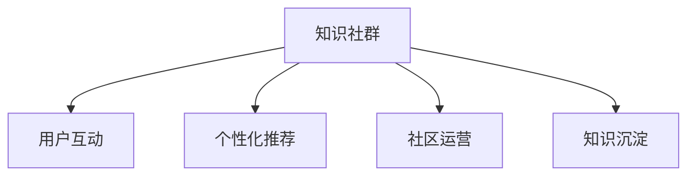

                 

# 如何利用知识社群实现用户的长期运营

> 关键词：知识社群,长期运营,用户互动,数据驱动,个性化推荐

## 1. 背景介绍

### 1.1 问题由来
在数字化时代，用户运营已经成为企业争夺市场和客户的关键环节。如何通过高效互动和精准营销，保持用户活跃度和忠诚度，是所有企业必须面对的挑战。知识社群作为新兴的社交网络平台，通过构建以知识分享和互动为中心的社区，为企业的长期运营提供了新的思路。

传统用户运营方法往往依赖于单一的用户标签、行为数据等，难以全面理解用户的兴趣和需求。而知识社群通过内容共鸣和社交关系网络，能够更深入地洞察用户真实需求，提供更加个性化和高质量的服务。

### 1.2 问题核心关键点
知识社群在用户运营中的应用，主要体现在以下几个方面：

- **用户互动与内容共鸣**：通过知识分享和讨论，提升用户之间的互动频率和质量，增强用户粘性。
- **数据分析与个性化推荐**：利用社区用户的行为数据和反馈信息，进行深度分析，为每个用户提供定制化的内容推荐和服务。
- **社群管理与社区运营**：构建社区规则和氛围，通过官方和用户共同管理，保障社群的健康发展和长期运营。
- **知识沉淀与持续更新**：实现知识积累和传递，不断引入新知识、新技术，保持社群的知识活力。

这些关键点构成了知识社群在用户运营中的核心价值，助力企业建立更稳定、更高效的用户生态。

## 2. 核心概念与联系

### 2.1 核心概念概述

为更好地理解知识社群在用户运营中的应用，本节将介绍几个密切相关的核心概念：

- **知识社群(Knowledge Community)**：以知识分享和互动为主导的社交网络平台，用户通过内容共鸣和社交网络实现深度互动和知识传递。

- **用户互动(Interactive User)**：指用户在社群中通过点赞、评论、分享等方式进行互动的行为。用户互动是知识社群的核心驱动力，决定了社群的知识传播效率和社区凝聚力。

- **个性化推荐(Personalized Recommendation)**：指根据用户的历史行为和兴趣，向其推荐相关内容的技术。个性化推荐技术能够显著提升用户的内容满意度和粘性，增加用户活跃度。

- **社区运营(Community Operation)**：指对知识社群的运营管理和策略调整，包括社区规则制定、用户引导、内容审核等环节，确保社群的健康发展。

- **知识沉淀(Knowledge Accumulation)**：指通过社区分享、讨论、笔记等形式，积累并沉淀社区成员的知识和经验，形成社群的知识资产。

这些核心概念之间的逻辑关系可以通过以下Mermaid流程图来展示：



这个流程图展示的知识社群的核心概念及其之间的关系：

1. 知识社群通过用户互动获得反馈，提升内容共鸣和社区粘性。
2. 个性化推荐技术根据用户行为数据，提升内容满意度，增强用户粘性。
3. 社区运营确保社群的健康发展，保障用户互动的质量。
4. 知识沉淀通过社区分享和讨论，形成社群的知识资产。

## 3. 核心算法原理 & 具体操作步骤

### 3.1 算法原理概述

知识社群的长期运营，主要依赖于用户互动、个性化推荐和社区运营三大算法策略的协同作用。其核心思想是：通过数据分析和机器学习技术，深度挖掘用户需求和行为模式，结合社区互动数据和内容质量，为每个用户定制个性化的服务方案，从而实现用户的长期运营和留存。

具体而言，知识社群的运营算法包括以下几个关键模块：

- **用户行为分析模块**：通过行为数据、内容反馈等，分析用户兴趣和需求，为个性化推荐提供数据基础。
- **内容推荐模块**：利用协同过滤、基于内容的推荐算法，根据用户历史行为和社群热点内容，推荐相关知识。
- **社区互动模块**：通过分析用户互动数据，了解社群氛围和用户情感倾向，优化社区互动体验。
- **用户留存模块**：结合用户行为和反馈，制定留存策略，通过激励机制和社区关怀，提升用户活跃度。

### 3.2 算法步骤详解

知识社群的长期运营算法主要包括以下几个关键步骤：

**Step 1: 数据收集与预处理**
- 收集社区用户的基本信息、行为数据、内容反馈等。
- 对数据进行清洗和预处理，去除噪声和异常数据，构建统一的数据格式。

**Step 2: 用户行为分析**
- 分析用户浏览、点赞、评论、分享等行为，构建用户兴趣图谱。
- 使用协同过滤、聚类算法等方法，挖掘用户兴趣和需求，识别出高活跃度和高价值用户。

**Step 3: 个性化推荐**
- 根据用户历史行为和社群热点内容，推荐相关知识。
- 使用基于内容的推荐算法，如TF-IDF、LSI等，计算内容之间的相似度。
- 结合协同过滤算法，根据相似用户的兴趣推荐内容。
- 使用多臂老虎机算法（Multi-Armed Bandit），动态调整推荐策略，平衡探索和利用。

**Step 4: 社区互动优化**
- 分析社区互动数据，了解用户情感和互动模式。
- 通过情感分析、主题建模等技术，提升内容共鸣，优化互动体验。
- 利用强化学习等技术，优化社区规则和互动策略，提升社区活跃度。

**Step 5: 用户留存策略**
- 根据用户行为和反馈，制定留存策略，如定期推送新内容、邀请专家讲座等。
- 使用用户激励机制，如积分、徽章、排名等，提升用户粘性。
- 通过社区关怀，建立用户与社区的情感联系，增强用户归属感。

### 3.3 算法优缺点

知识社群的长期运营算法具有以下优点：
1. 数据驱动：通过用户行为和内容互动数据，深度挖掘用户需求和行为模式，提供精准的个性化服务。
2. 用户粘性高：结合社区互动和内容共鸣，提升用户满意度和忠诚度。
3. 社区活跃度高：通过优化互动体验和留存策略，保持社群的长期活跃和健康发展。

同时，该算法也存在一些局限性：
1. 数据隐私：社区用户行为数据的收集和处理需要严格的隐私保护措施。
2. 算法复杂性：涉及多模态数据的融合和复杂算法的应用，需要较高的技术水平。
3. 内容质量：社区内容的丰富度和质量直接影响推荐效果，需要持续投入人力物力进行内容维护。

尽管存在这些局限性，但就目前而言，知识社群的长期运营算法仍是大数据和社交网络领域的重要研究方向。未来相关研究的重点在于如何进一步提升算法的效率和效果，同时兼顾数据隐私和用户满意度。

### 3.4 算法应用领域

知识社群的长期运营算法在多个领域得到应用，如在线教育、在线医疗、电子商务、知识分享社区等，为这些领域的用户运营提供了新的思路和方法。

- 在线教育：通过知识社群的互动和推荐，提升在线课程的参与度和用户满意度，提供个性化学习路径。
- 在线医疗：构建医生和患者的知识社群，通过内容分享和互动，提升医疗服务的质量和效率。
- 电子商务：利用用户行为分析和推荐技术，提升商品的曝光率和转化率，增加用户粘性。
- 知识分享社区：通过内容共鸣和互动，提升社区的知识传播效率和用户活跃度，构建良性知识生态。

这些领域的应用证明了知识社群长期运营算法的强大潜力和广泛适用性。随着社区运营经验的不断积累和算法的持续优化，相信知识社群在更多行业领域的应用前景将更加广阔。

## 4. 数学模型和公式 & 详细讲解 & 举例说明

### 4.1 数学模型构建

本节将使用数学语言对知识社群的长期运营算法进行更加严格的刻画。

记知识社群为 $G=(V,E)$，其中 $V$ 为社区用户集，$E$ 为社区互动关系。假设用户 $u_i$ 的历史行为数据为 $D_{ui}=\{x_1, x_2, \ldots, x_n\}$，其中 $x_i$ 为行为类型，如浏览、点赞、评论等。记用户 $u_i$ 对内容 $c_j$ 的反馈为 $f_{ij}$，记社区中内容 $c_j$ 的热度为 $h_j$。

定义用户 $u_i$ 对内容 $c_j$ 的兴趣度为 $r_{ij}=f_{ij} \times h_j$，则用户 $u_i$ 对所有内容的热度加权和为：

$$
\sum_{j=1}^{N} r_{ij}
$$

其中 $N$ 为社区内容的总数。

### 4.2 公式推导过程

以下我们以用户推荐算法为例，推导协同过滤算法的基本原理。

假设用户 $u_i$ 和用户 $u_j$ 对内容 $c_k$ 的相似度为 $s_{ij}$，则协同过滤算法的推荐公式为：

$$
\hat{r}_{ik} = \frac{\sum_{j=1}^{N} s_{ij} f_{jk}}{\sqrt{\sum_{j=1}^{N} s_{ij}^2} \sqrt{\sum_{j=1}^{N} s_{jk}^2}}
$$

其中 $\hat{r}_{ik}$ 为预测用户 $u_i$ 对内容 $c_k$ 的兴趣度，$s_{ij}$ 为用户 $u_i$ 和用户 $u_j$ 的相似度系数，$f_{jk}$ 为用户 $u_j$ 对内容 $c_k$ 的反馈。

将协同过滤算法与多臂老虎机算法结合，进一步优化推荐策略，使推荐系统能够根据用户行为动态调整推荐内容，平衡探索和利用。

### 4.3 案例分析与讲解

以在线教育平台为例，分析知识社群如何通过用户互动和推荐提升用户留存率。

在线教育平台通过知识社群的互动和推荐，提升了课程的参与度和用户满意度。具体而言，平台收集用户的学习数据，包括学习时长、答题正确率、学习笔记等。通过分析这些数据，平台能够识别出高价值用户和个性化需求。

在个性化推荐方面，平台使用协同过滤和基于内容的推荐算法，根据用户的历史行为数据和课程内容特征，推荐合适的学习路径和资源。例如，对于喜欢数学的学生，推荐更多数学相关的课程和习题；对于需要提升写作技能的用户，推荐相关课程和写作指导。

在用户互动方面，平台通过社区讨论、作业评审等形式，促进用户之间的互动和交流。通过分析互动数据，平台能够了解用户的学习进度和情感倾向，优化课程内容和互动体验。例如，对于学习进度缓慢的学生，通过社区导师和同伴辅导，提供针对性的帮助和鼓励。

通过这些措施，平台能够有效提升用户的参与度和留存率，同时提升学习效果和满意度。用户互动和个性化推荐相辅相成，形成了良性循环，提高了知识社群的长期运营效果。

## 5. 项目实践：代码实例和详细解释说明

### 5.1 开发环境搭建

在进行知识社群长期运营算法开发前，我们需要准备好开发环境。以下是使用Python进行Keras开发的环境配置流程：

1. 安装Anaconda：从官网下载并安装Anaconda，用于创建独立的Python环境。

2. 创建并激活虚拟环境：
```bash
conda create -n pytorch-env python=3.8 
conda activate pytorch-env
```

3. 安装Keras：根据CUDA版本，从官网获取对应的安装命令。例如：
```bash
conda install keras tensorflow
```

4. 安装各类工具包：
```bash
pip install numpy pandas scikit-learn matplotlib tqdm jupyter notebook ipython
```

完成上述步骤后，即可在`pytorch-env`环境中开始长期运营算法的实践。

### 5.2 源代码详细实现

下面我们以用户推荐算法为例，给出使用Keras实现协同过滤算法的PyTorch代码实现。

首先，定义协同过滤算法的模型：

```python
from keras.layers import Dense, Input, Embedding, Dot, Flatten
from keras.models import Model

# 定义输入层
user_input = Input(shape=(1,))
content_input = Input(shape=(1,))

# 嵌入层
user_embedding = Embedding(input_dim=10000, output_dim=64, mask_zero=True)(user_input)
content_embedding = Embedding(input_dim=10000, output_dim=64, mask_zero=True)(content_input)

# 点积层
dot_layer = Dot(axes=1, normalize=True)([user_embedding, content_embedding])

# 输出层
output = Flatten()(dot_layer)

# 定义模型
model = Model(inputs=[user_input, content_input], outputs=output)
```

然后，定义数据集和模型训练：

```python
from keras.datasets import mnist
from keras.utils import to_categorical

# 加载数据集
(x_train, y_train), (x_test, y_test) = mnist.load_data()

# 数据预处理
x_train = x_train.reshape(-1, 28*28).astype('float32') / 255.0
x_test = x_test.reshape(-1, 28*28).astype('float32') / 255.0

# 数据归一化
x_train = x_train / 255.0
x_test = x_test / 255.0

# 定义标签
y_train = to_categorical(y_train)
y_test = to_categorical(y_test)

# 模型编译
model.compile(optimizer='adam', loss='categorical_crossentropy', metrics=['accuracy'])

# 模型训练
model.fit([x_train, x_train], y_train, epochs=10, batch_size=128, validation_data=([x_test, x_test], y_test))
```

接着，使用TensorBoard进行模型训练和性能监控：

```python
import tensorflow as tf
from tensorflow import keras

# 使用TensorBoard可视化训练过程
@tf.keras.callbacks
def train_graph():
    graph = tf.keras.callbacks.HistoryGraph(runner=keras.callbacks.History())
    return graph

# 定义训练过程
model.fit([x_train, x_train], y_train, epochs=10, batch_size=128, validation_data=([x_test, x_test], y_test), callbacks=[train_graph()])

# 保存模型
model.save('recommender_model.h5')
```

以上就是使用Keras实现协同过滤算法的完整代码实现。可以看到，Keras框架提供了高度抽象的接口，使得模型的构建和训练过程更加便捷和高效。

### 5.3 代码解读与分析

让我们再详细解读一下关键代码的实现细节：

**协同过滤算法模型**：
- 定义输入层 `user_input` 和 `content_input`，分别表示用户和内容的输入。
- 通过嵌入层（Embedding）将用户和内容转换为稠密向量表示。
- 使用点积层（Dot）计算用户和内容的相似度。
- 通过扁平化层（Flatten）将点积结果展平，得到最终的预测输出。

**数据集和模型训练**：
- 加载MNIST手写数字数据集，并进行数据预处理和归一化。
- 使用 `to_categorical` 将标签进行one-hot编码。
- 通过 `compile` 方法定义模型优化器、损失函数和评估指标。
- 通过 `fit` 方法进行模型训练，并设置 `train_graph` 回调函数，使用TensorBoard可视化训练过程。

**模型训练和保存**：
- 使用 `train_graph` 回调函数，将训练过程中的损失值和准确率保存到TensorBoard。
- 通过 `save` 方法将训练好的模型保存到本地文件。

可以看到，Keras框架提供了丰富的API和回调函数，使得模型的构建和训练过程更加高效和可视化。开发者可以使用这些功能，快速构建并训练知识社群的长期运营算法。

## 6. 实际应用场景

### 6.1 在线教育平台

在线教育平台通过知识社群的互动和推荐，提升了课程的参与度和用户满意度。具体而言，平台收集用户的学习数据，包括学习时长、答题正确率、学习笔记等。通过分析这些数据，平台能够识别出高价值用户和个性化需求。

在个性化推荐方面，平台使用协同过滤和基于内容的推荐算法，根据用户的历史行为数据和课程内容特征，推荐合适的学习路径和资源。例如，对于喜欢数学的学生，推荐更多数学相关的课程和习题；对于需要提升写作技能的用户，推荐相关课程和写作指导。

在用户互动方面，平台通过社区讨论、作业评审等形式，促进用户之间的互动和交流。通过分析互动数据，平台能够了解用户的学习进度和情感倾向，优化课程内容和互动体验。例如，对于学习进度缓慢的学生，通过社区导师和同伴辅导，提供针对性的帮助和鼓励。

通过这些措施，平台能够有效提升用户的参与度和留存率，同时提升学习效果和满意度。用户互动和个性化推荐相辅相成，形成了良性循环，提高了知识社群的长期运营效果。

### 6.2 在线医疗平台

在线医疗平台通过知识社群的互动和推荐，提升了医疗服务的质量和效率。具体而言，平台收集医生的诊疗数据和患者的反馈信息，通过数据分析和协同过滤算法，推荐合适的诊疗方案和健康建议。例如，对于高血压患者，推荐控制饮食、适度运动等健康建议；对于糖尿病患者，推荐监测血糖、定期检查等诊疗方案。

在用户互动方面，平台通过社区讨论、健康问答等形式，促进医生和患者之间的互动和交流。通过分析互动数据，平台能够了解用户的健康需求和情感状态，优化诊疗建议和互动体验。例如，对于患有慢性疾病的患者，通过社区医生和患者互助，提供心理支持和情感关怀。

通过这些措施，平台能够有效提升用户的满意度和留存率，同时提升医疗服务的质量和效率。用户互动和个性化推荐相辅相成，形成了良性循环，提高了知识社群的长期运营效果。

### 6.3 电子商务平台

电子商务平台通过知识社群的互动和推荐，提升了商品的曝光率和转化率，增加了用户粘性。具体而言，平台收集用户的行为数据和评价信息，通过数据分析和协同过滤算法，推荐合适的商品和优惠信息。例如，对于喜欢运动的用户，推荐相关运动鞋、运动器材等商品；对于需要选购家电的用户，推荐不同品牌、不同型号的家电商品。

在用户互动方面，平台通过社区讨论、用户评价等形式，促进用户之间的互动和交流。通过分析互动数据，平台能够了解用户的购买需求和情感倾向，优化商品推荐和互动体验。例如，对于对某个商品有疑虑的用户，通过社区用户评价和商品问答，提供详细的信息和建议。

通过这些措施，平台能够有效提升用户的参与度和留存率，同时提升购物体验和满意度。用户互动和个性化推荐相辅相成，形成了良性循环，提高了知识社群的长期运营效果。

### 6.4 未来应用展望

随着知识社群技术的不断进步，未来的应用场景将更加广泛，为用户运营带来更多的创新和突破。

1. **智能客服**：通过知识社群的互动和推荐，提升智能客服的交互体验和问题解决效率，实现更高水平的用户体验。
2. **个性化推荐系统**：将知识社群的长期运营算法与个性化推荐系统结合，为更多行业提供精准的内容推荐服务。
3. **医疗健康管理**：构建医生和患者的知识社群，通过互动和推荐，提供个性化的健康管理和诊疗服务。
4. **金融理财服务**：利用用户行为数据分析和推荐算法，提升金融产品的用户体验和购买率。
5. **娱乐内容平台**：通过用户互动和推荐，提升娱乐内容的个性化和互动性，增加用户粘性和满意度。

这些领域的应用前景，将为知识社群的长期运营提供新的方向和思路。随着技术的发展和经验的积累，知识社群必将在更多行业领域发挥重要作用，带来深远的社会和经济影响。

## 7. 工具和资源推荐

### 7.1 学习资源推荐

为了帮助开发者系统掌握知识社群的长期运营技术，这里推荐一些优质的学习资源：

1. **《推荐系统实战》**：一本深入浅出介绍推荐系统原理和实践的书籍，适合对推荐算法有基础的开发者深入学习。
2. **Coursera《机器学习》**：斯坦福大学开设的机器学习课程，涵盖推荐系统、协同过滤等核心概念。
3. **Kaggle竞赛**：参加Kaggle推荐系统竞赛，通过实战提升算法能力和工程经验。
4. **Facebook公开课**：Facebook讲解推荐系统的实战经验，结合实际案例，展示推荐系统在企业中的应用。
5. **TensorFlow官方文档**：TensorFlow的推荐系统教程，提供了丰富的算法和模型实现，适合学习实践。

通过这些资源的学习实践，相信你一定能够快速掌握知识社群的长期运营技术，并用于解决实际的推荐问题。

### 7.2 开发工具推荐

高效的开发离不开优秀的工具支持。以下是几款用于知识社群长期运营开发的常用工具：

1. **Keras**：一个高度抽象的深度学习框架，提供了便捷的模型构建和训练接口，适合快速迭代开发。
2. **TensorFlow**：由Google主导开发的深度学习框架，生产部署方便，适合大规模工程应用。
3. **PyTorch**：一个灵活的深度学习框架，支持动态图和静态图两种计算图模型，适合研究和开发。
4. **Jupyter Notebook**：一个交互式的开发环境，支持代码编写、数据处理和可视化，适合数据分析和实验。
5. **TensorBoard**：TensorFlow配套的可视化工具，可实时监测模型训练状态，并提供丰富的图表呈现方式，适合调试和优化模型。

合理利用这些工具，可以显著提升知识社群长期运营算法的开发效率，加快创新迭代的步伐。

### 7.3 相关论文推荐

知识社群的长期运营技术源于学界的持续研究。以下是几篇奠基性的相关论文，推荐阅读：

1. **《协同过滤算法》**：一篇介绍协同过滤算法的经典论文，详细介绍了基于矩阵分解和用户的协同过滤方法。
2. **《个性化推荐系统》**：一本系统介绍个性化推荐技术的书籍，涵盖协同过滤、基于内容的推荐、深度学习等多种推荐算法。
3. **《基于知识图谱的推荐系统》**：一篇介绍结合知识图谱和推荐算法的论文，展示了如何在推荐系统中引入外部知识。
4. **《多臂老虎机算法》**：一篇介绍多臂老虎机算法的经典论文，详细介绍了多臂老虎机算法的理论基础和应用场景。
5. **《基于社交网络的知识管理》**：一篇介绍社交网络在知识管理中的应用论文，展示了如何通过社交网络构建知识社群。

这些论文代表了大数据和社交网络领域的研究进展，通过学习这些前沿成果，可以帮助研究者把握学科前进方向，激发更多的创新灵感。

## 8. 总结：未来发展趋势与挑战

### 8.1 总结

本文对知识社群的长期运营技术进行了全面系统的介绍。首先阐述了知识社群在用户运营中的应用背景和核心关键点，明确了用户互动、个性化推荐和社区运营在知识社群中的核心价值。其次，从原理到实践，详细讲解了知识社群长期运营算法的数学模型和具体步骤，给出了代码实例和详细解释说明。同时，本文还广泛探讨了知识社群在多个行业领域的应用前景，展示了其强大潜力和广阔应用空间。

通过本文的系统梳理，可以看到，知识社群的长期运营技术正在成为大数据和社交网络领域的重要研究方向，为企业的用户运营提供了新的思路和方法。通过深入挖掘用户行为和兴趣，结合社区互动和内容推荐，企业能够更好地满足用户需求，提升用户体验和满意度。未来，随着技术的不断进步和应用经验的积累，知识社群必将在更多行业领域发挥重要作用，为用户运营带来更多创新和突破。

### 8.2 未来发展趋势

展望未来，知识社群的长期运营技术将呈现以下几个发展趋势：

1. **多模态数据的融合**：将社交网络、行为数据、文本数据等多模态信息结合，提升推荐算法的精准度和效果。
2. **基于深度学习的推荐算法**：通过深度学习算法，如CNN、RNN、Transformer等，提升推荐模型的表达能力和泛化能力。
3. **联邦学习的应用**：结合联邦学习技术，在保证用户隐私的前提下，提升推荐算法的性能和鲁棒性。
4. **多目标优化**：结合用户满意度和平台收益等目标，设计多目标优化算法，提升知识社群的整体价值。
5. **用户生成内容的利用**：通过用户生成内容（如评论、笔记等），丰富推荐算法的数据来源，提升推荐质量。
6. **跨领域知识转移**：利用跨领域知识转移技术，将知识社群的推荐算法应用到更多行业领域，扩展其应用范围。

以上趋势凸显了知识社群长期运营技术的广阔前景。这些方向的探索发展，必将进一步提升推荐系统的精度和效果，为知识社群带来新的突破。

### 8.3 面临的挑战

尽管知识社群长期运营技术已经取得了不少进展，但在迈向更加智能化、普适化应用的过程中，它仍面临着诸多挑战：

1. **数据隐私保护**：社区用户行为数据的收集和处理需要严格的隐私保护措施，避免数据泄露和滥用。
2. **算法复杂性**：涉及多模态数据的融合和复杂算法的应用，需要较高的技术水平和计算资源。
3. **推荐质量不稳定**：社区内容的丰富度和质量直接影响推荐效果，需要持续投入人力物力进行内容维护。
4. **平台收益与用户体验的平衡**：在推荐算法的精准度和用户满意度之间找到平衡点，是知识社群长期运营的难点之一。
5. **社区管理和运营**：如何构建健康社区氛围，提高社区管理水平，是知识社群长期运营的关键环节。

尽管存在这些挑战，但通过持续的技术创新和应用实践，相信知识社群长期运营技术能够逐步克服这些难题，实现更加智能化、普适化的用户运营。

### 8.4 研究展望

面对知识社群长期运营技术面临的挑战，未来的研究需要在以下几个方面寻求新的突破：

1. **隐私保护技术**：探索隐私保护算法和技术，如差分隐私、同态加密等，保障用户数据的隐私和安全。
2. **跨模态数据融合技术**：研究多模态数据融合算法，如深度跨模态学习、多任务学习等，提升推荐系统的泛化能力和鲁棒性。
3. **推荐算法优化**：通过深度学习算法和联邦学习技术，提升推荐算法的精度和效率。
4. **用户行为模型构建**：结合心理学、社会学等学科知识，构建更加全面、准确的用户行为模型，提升推荐系统的理解能力。
5. **社区运营策略优化**：通过数据分析和用户调研，设计更科学合理的社区运营策略，提升社区的用户粘性和活跃度。
6. **跨领域知识应用**：将知识社群推荐算法应用到更多行业领域，如金融、医疗、教育等，实现跨领域的知识转移和应用。

这些研究方向的探索，必将引领知识社群长期运营技术迈向更高的台阶，为用户运营带来更多创新和突破。面向未来，知识社群的长期运营技术还需要与其他人工智能技术进行更深入的融合，如自然语言处理、计算机视觉等，多路径协同发力，共同推动自然语言理解和智能交互系统的进步。只有勇于创新、敢于突破，才能不断拓展知识社群的边界，让智能技术更好地造福人类社会。

## 9. 附录：常见问题与解答

**Q1：知识社群的长期运营是否适用于所有行业？**

A: 知识社群的长期运营技术在多个行业领域得到应用，如在线教育、在线医疗、电子商务、知识分享社区等，为这些领域的用户运营提供了新的思路和方法。但对于一些特定领域的行业，如工业制造、农业等，知识社群的应用还需要结合具体场景进行优化和改进。

**Q2：知识社群的推荐算法是否需要大量标注数据？**

A: 知识社群的推荐算法通常依赖于用户行为数据和互动数据，而非标注数据。通过分析这些数据，能够发现用户的兴趣和需求，实现个性化推荐。但为了提升推荐质量，收集丰富的行为数据和互动数据仍然是必要的。

**Q3：知识社群的长期运营算法是否需要高昂的计算资源？**

A: 知识社群的长期运营算法涉及到复杂的机器学习模型和大规模数据处理，确实需要一定的计算资源。但随着云计算技术的发展，可以使用廉价的云服务器进行数据处理和模型训练，降低资源成本。

**Q4：知识社群的推荐算法是否需要频繁更新？**

A: 知识社群的推荐算法需要根据用户的反馈和社区的变化，进行动态调整和优化。但为了保证推荐的质量和稳定性，算法更新需要慎重考虑，避免频繁变动带来的不稳定性和用户困惑。

**Q5：知识社群的长期运营是否需要人工干预？**

A: 知识社群的长期运营离不开人工干预和调控。通过数据分析和用户调研，能够发现算法的不足和社区的问题，及时进行调整和优化。同时，社区管理和运营也离不开人工的监督和引导，确保社群的健康发展和用户满意度。

这些问题的解答展示了知识社群长期运营技术的广泛适用性和实际应用中的注意事项。通过不断优化算法和加强人工干预，知识社群必将在更多行业领域发挥重要作用，为用户提供更加智能化、普适化的服务。

