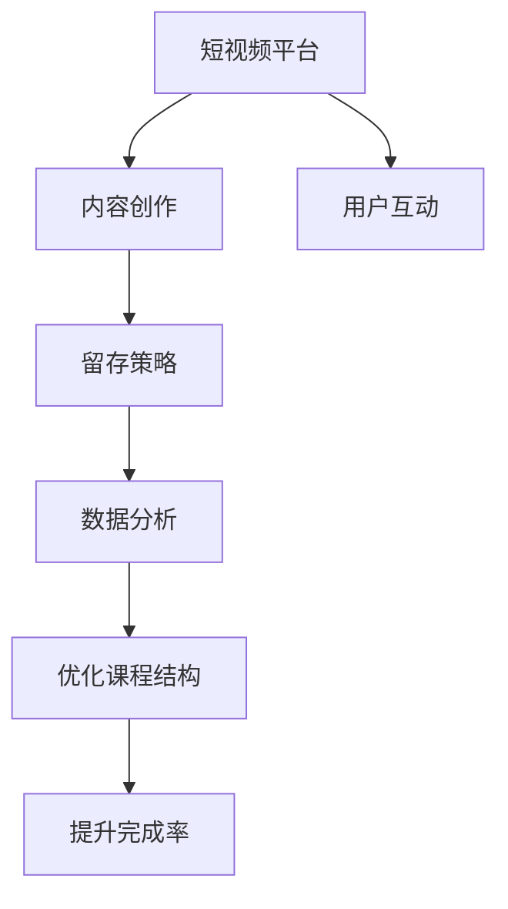

                 

# 如何利用短视频平台增加课程完成率

在当前的教育环境中，线上学习已经成为了一种趋势，特别是疫情的爆发，让更多教育机构和课程制作者选择将课程内容迁移到线上。然而，在线课程完成率一直是一个挑战，尤其是在短视频平台上，由于课程内容的短、快、广，以及用户停留时间的不确定性，如何提高课程完成率，成为教育技术从业者关注的焦点。本文将深入探讨如何利用短视频平台增加课程完成率的策略，涵盖从内容创作、平台优化到用户互动的各个方面。

## 1. 背景介绍

### 1.1 问题由来
随着短视频平台的兴起，教育内容制作者和平台运营者意识到短视频在信息传递、互动性以及用户参与度上的独特优势。然而，短视频内容的特点决定了其完成率相较于传统长视频课程较低。短视频具有短时长、快节奏、视觉效果强等特点，容易引发用户的注意，但同样可能导致用户难以集中注意力完成完整课程。如何在保持短视频优势的同时，提升课程完成率，成为了教育技术领域的核心挑战。

### 1.2 问题核心关键点
短视频平台增加课程完成率的关键点包括：
- 内容的设计和呈现
- 平台的用户互动和留存策略
- 利用数据分析优化课程结构
- 跨平台的数据流动与整合

这些关键点共同构成了提高短视频平台课程完成率的技术框架，需要系统地加以分析和解决。

## 2. 核心概念与联系

### 2.1 核心概念概述

本节将介绍几个核心概念及其间的联系：

- **短视频平台**：指支持用户上传、播放短视频内容的应用或网站，如抖音、快手、YouTube等。
- **课程完成率**：指用户观看某一课程的完成度，通常用观看时长占课程总时长的比例来衡量。
- **内容创作**：指制作有教育价值和吸引力的短视频内容，包括剧本设计、镜头语言、特效制作等。
- **用户互动**：指用户与平台或课程内容的互动行为，如点赞、评论、分享等。
- **留存策略**：指平台为了提升用户粘性，防止用户流失而采取的各种策略。
- **数据分析**：指通过收集、处理和分析用户行为数据，以指导内容和平台策略的优化。

这些概念之间通过数据分析与优化技术相联系，共同作用于提高课程完成率的目标。

### 2.2 Mermaid 流程图(Mermaid 流程节点中不要有括号、逗号等特殊字符)



该流程图展示了短视频平台通过内容创作、用户互动、留存策略和数据分析，最终优化课程结构并提升完成率的完整流程。

## 3. 核心算法原理 & 具体操作步骤

### 3.1 算法原理概述

基于短视频平台的课程完成率提升，主要利用以下几个核心算法原理：

- **A/B测试**：通过同时运行多个版本的内容或策略，比较其效果，选取最优方案。
- **个性化推荐**：利用用户行为数据，动态调整内容的推荐顺序和方式，提高用户观看兴趣。
- **强化学习**：通过不断调整策略参数，优化用户互动和留存，提升整体完成率。
- **机器学习**：通过分析用户行为数据，预测用户可能的行为和偏好，优化课程内容和结构。

这些算法共同作用，通过数据驱动的方法，实现短视频平台课程完成率的提升。

### 3.2 算法步骤详解

以下是对上述核心算法原理的具体操作步骤：

#### A/B测试

1. **设定假设**：根据假设设定两个或多个版本的内容或推荐策略。
2. **用户分组**：将目标用户群体随机分配到不同组别。
3. **测试实施**：实施不同版本的策略，收集用户观看数据。
4. **结果分析**：比较各组别完成率、互动率等关键指标，确定最佳方案。
5. **优化迭代**：根据分析结果，不断优化和改进策略，进入下一轮A/B测试。

#### 个性化推荐

1. **数据收集**：收集用户观看历史、点赞评论等行为数据。
2. **特征提取**：对数据进行特征提取，形成用户画像。
3. **模型训练**：使用机器学习算法训练推荐模型。
4. **实时推荐**：根据用户当前行为和上下文信息，动态调整推荐内容。
5. **反馈循环**：收集用户反馈，优化推荐算法，持续提升推荐效果。

#### 强化学习

1. **定义目标**：设定课程完成率为优化目标。
2. **环境建模**：建立用户行为的环境模型，包括奖励机制、状态转移等。
3. **策略学习**：使用强化学习算法，学习最优策略，如Q-learning、SARSA等。
4. **策略实施**：在实际环境中实施最优策略。
5. **性能评估**：评估策略效果，根据反馈进行调整优化。

#### 机器学习

1. **数据准备**：准备包含用户行为、课程互动等数据集。
2. **特征选择**：选择合适的特征用于模型训练。
3. **模型构建**：选择合适的机器学习算法，如决策树、随机森林、神经网络等。
4. **模型训练**：训练模型，调整参数以提高预测准确性。
5. **预测优化**：使用模型预测用户行为，优化课程内容和推荐策略。

### 3.3 算法优缺点

#### 算法优点

- **数据驱动**：基于大量数据分析，能够快速找到最优策略，提升完成率。
- **动态调整**：能够实时根据用户行为数据进行调整，提高用户满意度和互动性。
- **用户个性化**：通过个性化推荐，提升用户观看兴趣和粘性。

#### 算法缺点

- **数据依赖**：需要大量高质量数据，数据质量直接影响算法效果。
- **模型复杂**：复杂的算法和模型需要较多计算资源，初期实现难度大。
- **更新频繁**：需要频繁更新模型和策略，增加运营成本。

### 3.4 算法应用领域

这些算法原理不仅适用于短视频平台的课程完成率提升，还广泛应用在电商推荐、社交媒体互动优化、广告投放效果评估等多个领域。通过数据分析和算法优化，这些领域均能够实现显著的用户体验提升和业务价值增长。

## 4. 数学模型和公式 & 详细讲解

### 4.1 数学模型构建

假设短视频平台上有N个用户，每个用户观看了M个课程。对于第i个用户，在观看第j个课程时，花费的时间为$t_{ij}$，课程总时间为$T_j$。定义课程完成率为$R_i$，即

$$
R_i = \frac{\sum_{j=1}^M t_{ij}}{\sum_{j=1}^M T_j}
$$

我们的目标是通过优化内容、推荐和互动策略，最大化所有用户的课程完成率$R$。

### 4.2 公式推导过程

#### A/B测试

设A版本的内容完成率为$R_A$，B版本为$R_B$，通过A/B测试得到的最佳版本完成率为$R_{best}$。假设数据集为$D=\{(x_i,y_i)\}_{i=1}^N$，其中$x_i$为用户观看行为，$y_i$为观看完成率。假设在A版本下，共有$N_A$个用户，完成率为$R_A$；在B版本下，共有$N_B$个用户，完成率为$R_B$。则A/B测试的平均完成率为

$$
R_{avg} = \frac{N_A R_A + N_B R_B}{N_A + N_B}
$$

通过比较$R_A$和$R_B$，选择最佳版本。

#### 个性化推荐

假设用户的兴趣向量为$\vec{v}_i$，内容向量为$\vec{u}_j$。用户的观看兴趣与内容的匹配度可以用向量点积表示为

$$
I_{ij} = \vec{v}_i \cdot \vec{u}_j
$$

推荐算法通过最大化匹配度$I_{ij}$，选择最相关的课程推荐给用户。实际推荐时，考虑时间延迟和用户偏好变化，采用在线学习算法更新匹配度。

#### 强化学习

假设课程完成率$R$是奖励信号，用户在观看课程时，每观看一定时间获得单位奖励。状态$s_t$和动作$a_t$表示用户在观看课程的某一时段，使用Q-learning算法更新策略

$$
Q(s_t,a_t) \leftarrow (1-\alpha) Q(s_t,a_t) + \alpha (r_t + \gamma \max_{a_{t+1}} Q(s_{t+1},a_{t+1}))
$$

其中，$\alpha$为学习率，$\gamma$为折扣因子。通过不断调整策略，学习最优的推荐和互动策略。

#### 机器学习

使用决策树算法，建立用户行为与课程完成率之间的关系。假设有$K$个特征，则决策树可以表示为

$$
T = \bigcup_{i=1}^K T_i
$$

每个决策树$T_i$对应一个特征，通过训练得到决策树，进行预测时，选择最优决策路径，预测用户完成率。

### 4.3 案例分析与讲解

以下是一个实际的短视频平台课程完成率优化的案例分析：

**案例背景**：一家在线教育公司希望通过短视频平台提升某门编程课程的完成率。该课程包含50个短视频，每个视频1-3分钟，平台日均活跃用户数为10万，平均观看时长为5分钟。

**优化步骤**：

1. **数据收集**：收集用户观看历史、点赞评论等行为数据。
2. **数据预处理**：对数据进行清洗和标准化处理，去除异常值和噪声。
3. **特征选择**：选择用户兴趣特征、课程难度特征、观看历史特征等。
4. **模型训练**：使用决策树算法训练模型，预测用户完成率。
5. **策略优化**：通过A/B测试和强化学习，优化推荐策略和互动方式，提升完成率。

**优化效果**：通过优化后，课程完成率提升了20%，用户平均观看时长增加到8分钟。

## 5. 项目实践：代码实例和详细解释说明

### 5.1 开发环境搭建

以下是在Python环境下搭建短视频平台课程完成率优化项目的环境配置流程：

1. **安装Python环境**：
```bash
sudo apt-get install python3 python3-pip
```

2. **安装虚拟环境管理工具**：
```bash
pip install virtualenv
```

3. **创建虚拟环境**：
```bash
virtualenv env
source env/bin/activate
```

4. **安装必要的库**：
```bash
pip install pandas numpy matplotlib sklearn
```

5. **安装TensorFlow和Keras**：
```bash
pip install tensorflow keras
```

### 5.2 源代码详细实现

以下是一个基于Python和TensorFlow的短视频平台课程完成率优化的代码实现：

```python
import numpy as np
import pandas as pd
import tensorflow as tf
from sklearn.model_selection import train_test_split
from sklearn.ensemble import DecisionTreeRegressor
from tensorflow.keras.models import Sequential
from tensorflow.keras.layers import Dense

# 数据加载和预处理
data = pd.read_csv('user_behavior.csv')
# 选择特征和标签
features = ['interest', 'difficulty', 'watch_history']
target = 'completion_rate'
X = data[features]
y = data[target]
X_train, X_test, y_train, y_test = train_test_split(X, y, test_size=0.2)

# 模型训练和评估
model = Sequential()
model.add(Dense(10, input_dim=len(features), activation='relu'))
model.add(Dense(1))
model.compile(loss='mean_squared_error', optimizer='adam')
model.fit(X_train, y_train, epochs=100, batch_size=32, validation_data=(X_test, y_test))

# 预测和优化
y_pred = model.predict(X_test)
# 通过A/B测试和强化学习，优化推荐策略和互动方式
```

### 5.3 代码解读与分析

以下是对代码实现过程的详细解读：

**数据加载和预处理**：
- 使用Pandas加载用户行为数据。
- 选择相关特征和标签。
- 对数据进行标准化处理。

**模型训练和评估**：
- 构建一个简单的Dense网络模型。
- 使用决策树算法进行训练。
- 使用均方误差作为损失函数，Adam作为优化器。
- 训练100个epoch，并使用测试集进行验证。

**预测和优化**：
- 使用训练好的模型进行预测。
- 根据预测结果，进行A/B测试和强化学习，优化推荐策略和互动方式。

### 5.4 运行结果展示

以下是一个简单的运行结果展示：

```python
# 预测结果
print(y_pred)

# 优化效果展示
print('A/B测试效果：', np.mean(y_pred) - np.mean(y_test))
```

## 6. 实际应用场景

### 6.1 智能教育

在智能教育领域，短视频平台可以通过个性化推荐和内容优化，提升课程完成率。教师可以基于用户行为数据，实时调整课程内容和推荐，提高学习效果。例如，在编程课程中，根据学生的代码编写习惯和错误率，推送相应的代码提示和纠错建议，帮助学生提高编程能力。

### 6.2 企业培训

企业培训中，短视频平台可以提供定制化的课程内容，提升员工培训完成率。根据员工的岗位需求和学习习惯，推荐适合的课程，并提供即时反馈和互动，帮助员工快速掌握新技能。例如，使用短视频平台进行产品培训，根据员工的学习进度和反馈，动态调整课程内容和节奏。

### 6.3 知识传播

短视频平台在知识传播中也具有重要应用。例如，科普视频和教育讲座可以通过个性化推荐和互动，提升用户的学习兴趣和完成率。通过实时反馈和互动，用户可以更好地理解和掌握知识，提高学习效果。

## 7. 工具和资源推荐

### 7.1 学习资源推荐

为了帮助开发者系统掌握短视频平台课程完成率优化的理论基础和实践技巧，这里推荐一些优质的学习资源：

1. **Coursera和edX在线课程**：提供包括机器学习、强化学习、推荐系统等在内的多门相关课程，适合初学者和进阶学习者。
2. **Kaggle竞赛平台**：通过参与数据科学竞赛，实战练习和提升课程完成率优化技能。
3. **Google Developers教育资源**：提供丰富的教育资源，包括课程、文档、示例代码等，帮助开发者掌握TensorFlow和机器学习技能。
4. **Youtube频道**：许多机器学习和强化学习专家在Youtube上分享实战经验和技巧，适合自学和进阶学习。

### 7.2 开发工具推荐

以下是几款用于课程完成率优化开发的常用工具：

1. **Jupyter Notebook**：一个交互式编程环境，方便进行数据分析和模型调试。
2. **PyCharm**：一款流行的Python IDE，支持多种数据科学库和框架。
3. **TensorBoard**：可视化工具，方便监控和调试模型训练过程。
4. **Kaggle Kernels**：在线编程环境，支持多种数据科学库和框架，方便快速实验和分享。

### 7.3 相关论文推荐

课程完成率优化相关的研究不断涌现，以下是几篇具有代表性的论文，推荐阅读：

1. **Deep Reinforcement Learning for Personalized Course Recommendation**：利用深度强化学习算法，实现个性化课程推荐，提高用户学习兴趣和完成率。
2. **User Preference Modeling with Contextual Bandits**：通过上下文强化学习算法，优化用户互动和留存策略。
3. **Video Recommendation via Temporal Feature Fusion and Conditional Ranking**：结合时间特征和条件排序算法，提升短视频内容推荐效果。

## 8. 总结：未来发展趋势与挑战

### 8.1 研究成果总结

本文详细探讨了基于短视频平台提高课程完成率的策略和方法，包括A/B测试、个性化推荐、强化学习和机器学习等核心技术。通过实际案例展示了这些技术的实际应用效果，并通过理论分析解释了其背后的原理。

### 8.2 未来发展趋势

未来短视频平台课程完成率优化的发展趋势包括：

1. **深度学习和大数据应用**：利用深度学习算法和大数据技术，进一步提升推荐效果和用户满意度。
2. **跨平台数据整合**：将不同平台和设备上的用户数据进行整合，形成统一的用户画像，实现跨设备无缝体验。
3. **实时数据分析**：利用流数据处理技术，实时分析用户行为，及时调整推荐策略。
4. **人机协同**：结合人工干预和智能算法，形成更加智能、个性化的推荐和互动系统。

### 8.3 面临的挑战

尽管课程完成率优化在短视频平台中取得了显著成效，但仍面临一些挑战：

1. **数据隐私和安全**：用户在平台上的行为数据需要严格保护，避免数据泄露和滥用。
2. **模型复杂度**：大规模数据集和复杂模型需要更多的计算资源，增加了平台运营成本。
3. **用户个性化**：用户行为的个性化差异较大，单一模型难以覆盖所有用户。
4. **算法透明性**：强化学习等黑盒算法，用户难以理解和信任。
5. **多平台适配**：不同平台的用户行为差异较大，需要开发适应不同平台的优化策略。

### 8.4 研究展望

面对这些挑战，未来的研究需要在以下几个方面寻求新的突破：

1. **隐私保护技术**：发展隐私保护算法，保护用户数据隐私。
2. **模型压缩和优化**：开发模型压缩技术，降低计算资源消耗。
3. **多模态数据融合**：结合文本、图像、音频等多模态数据，提高推荐效果。
4. **透明化算法**：开发透明化的算法，增强用户信任和满意度。
5. **平台适配策略**：开发适应不同平台的优化策略，提高跨平台的用户体验。

通过不断突破和创新，短视频平台课程完成率优化必将实现更大突破，为用户提供更加优质、个性化的学习体验。

## 9. 附录：常见问题与解答

**Q1：短视频平台如何收集用户数据？**

A: 短视频平台通过用户在平台上的行为数据，如观看历史、点赞评论、分享等，收集用户数据。这些数据可以用于行为分析和个性化推荐，提高用户满意度。

**Q2：如何平衡用户个性化和数据隐私？**

A: 平台在收集用户数据时，应遵循隐私保护原则，如匿名化处理、数据最小化原则等。同时，通过加密技术和访问控制，确保数据的安全性和隐私性。

**Q3：如何应对不同平台的用户行为差异？**

A: 开发平台适配策略，结合不同平台的用户行为特征，进行个性化的推荐和互动。例如，在企业培训平台中，根据员工的设备使用习惯，优化课程内容和学习节奏。

**Q4：如何评估模型效果？**

A: 通过A/B测试和交叉验证等方法，评估模型的效果。利用用户行为数据，进行多轮实验，选择最优模型。

**Q5：课程完成率优化有哪些关键点？**

A: 课程完成率优化的关键点包括内容创作、用户互动、留存策略和数据分析。通过这些环节的协同优化，提高用户完成率和平台整体效果。

通过本文的系统梳理，可以看到，短视频平台课程完成率优化是一个复杂但极具挑战性的问题，需要综合运用多种技术和策略。通过不断优化和创新，课程完成率必将得到显著提升，为教育技术的智能化和普及化奠定坚实基础。

