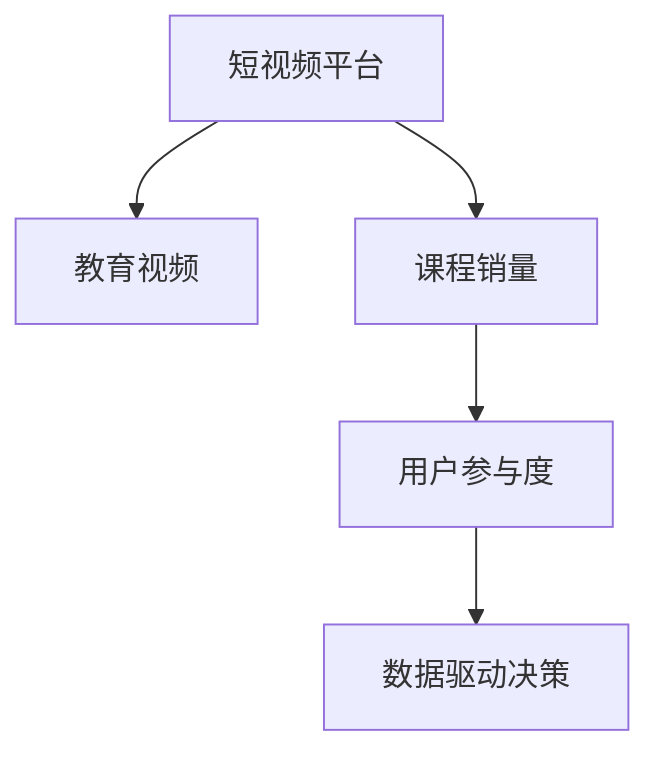

                 

# 如何利用短视频平台提升课程销量

## 1. 背景介绍

在数字化时代，教育领域正经历着深刻的变革。传统教室的边界被打破，知识传播的媒介日益多样化。短视频平台的兴起，为教育者提供了一个新的、极具潜力的工具，以推动课程销量的增长。通过短视频，教师可以以更为生动、互动和创新的方式传递知识，吸引学习者的注意，从而显著提升课程的吸引力和参与度。

短视频平台，如抖音、快手、Bilibili等，已经成为全球范围内广受欢迎的内容消费平台。据统计，短视频日活跃用户数已超过6亿，而这些用户中有相当一部分具有较高学历和购买能力。教育视频在短视频平台上受到广泛欢迎，可以极大提升课程的知名度和销量。

然而，短视频平台上的教育内容竞争激烈，且内容质量参差不齐。高质量的教育视频不仅能吸引用户，还能在用户中形成良好的口碑，进而推动课程销量。因此，如何高效地利用短视频平台，提升课程销量，成为教育者和教育机构面临的重要课题。

## 2. 核心概念与联系

### 2.1 核心概念概述

为了深入理解如何利用短视频平台提升课程销量，本节将介绍几个关键概念：

- **短视频平台（Short-Video Platforms）**：以用户生成内容和专业内容为主，集视频分享、直播、社区互动于一体的平台，如抖音、快手、Bilibili等。
- **教育视频（Educational Videos）**：通过短视频形式传递教育内容，覆盖各类学科和技能的学习视频，旨在提升学习者的知识和技能。
- **课程销量（Course Sales）**：在线教育平台通过销售课程内容获得收入，短视频平台上的教育视频有助于推广课程，进而提升课程销量。
- **用户参与度（User Engagement）**：指用户对教育视频的互动行为，包括点赞、评论、分享、订阅等，是衡量教育视频吸引力和影响力的重要指标。
- **数据驱动决策（Data-Driven Decision-Making）**：利用大数据分析，基于用户行为数据和反馈，优化短视频内容策略，提升课程销量的决策过程。

这些概念之间的联系通过以下Mermaid流程图来展示：



### 2.2 核心概念原理和架构

短视频平台的运作架构主要包括以下几个部分：

1. **内容发布**：用户或教育者上传教育视频，平台进行审核并发布。
2. **内容推荐**：基于用户兴趣和互动数据，平台算法推荐教育视频给潜在学习者。
3. **用户互动**：用户通过点赞、评论、分享、订阅等形式进行互动，生成用户行为数据。
4. **数据分析**：通过收集和分析用户行为数据，平台生成推荐、广告投放等策略。

教育视频的内容架构主要由以下几个要素构成：

1. **视频时长**：短视频平台对视频时长有要求，一般为1分钟至10分钟不等。
2. **视频质量**：视频画质、声音清晰，内容结构合理。
3. **教育内容**：紧扣课程目标，内容精炼、实用。
4. **互动元素**：引入互动元素，如提问、答题、小游戏等，增强学习者的参与感。

课程销量的提升架构主要涉及以下环节：

1. **课程定位**：明确课程定位和目标用户，设计匹配的教育视频内容。
2. **视频内容制作**：制作符合平台规范和用户需求的高质量教育视频。
3. **视频推广**：通过平台算法推广优质教育视频，吸引用户关注和参与。
4. **用户转化**：通过平台互动引导用户订阅课程，最终完成购买。

这些核心概念和架构共同构成了短视频平台上的教育内容生态，帮助教育者实现课程销量的增长。

## 3. 核心算法原理 & 具体操作步骤

### 3.1 算法原理概述

短视频平台上的教育视频销量提升，涉及多种算法和策略，包括内容推荐、互动优化、数据分析等。其核心算法原理主要包括：

- **内容推荐算法（Content Recommendation Algorithm）**：基于用户行为数据（如观看历史、互动行为），通过协同过滤、协同学习等方法，推荐相关教育视频。
- **互动优化算法（Interactivity Optimization Algorithm）**：通过引入互动元素、设置互动奖励，激发用户参与，提升视频点赞、评论、分享等互动行为。
- **用户行为分析算法（User Behavior Analysis Algorithm）**：收集和分析用户行为数据，识别用户兴趣和偏好，优化视频内容策略。
- **广告投放算法（Advertising Placement Algorithm）**：基于用户行为和兴趣数据，智能投放广告，推广优质教育视频。

### 3.2 算法步骤详解

以下是利用短视频平台提升课程销量的具体步骤：

**Step 1: 课程内容策划**

1. **目标用户分析**：明确目标用户群体，了解其兴趣、需求和痛点。
2. **课程内容设计**：设计符合用户需求的课程内容和教育视频主题。
3. **视频制作计划**：制定视频制作计划和时间表，确保内容质量和时间稳定性。

**Step 2: 视频内容制作**

1. **视频拍摄和剪辑**：制作高质量的视频，保证画质、声音、剪辑流畅。
2. **内容创意引入**：加入互动元素，如提问、小测验、小游戏等，增加用户参与感。
3. **视频效果测试**：进行用户测试，收集反馈，优化视频内容。

**Step 3: 视频内容上传和推广**

1. **视频上传**：将视频上传到短视频平台，并设置关键词、标签、简介等。
2. **视频推广**：通过平台算法推广视频，覆盖更广泛的目标用户群体。
3. **互动优化**：引导用户互动，如点赞、评论、分享，增加视频曝光率。

**Step 4: 数据分析和优化**

1. **数据收集**：收集用户互动数据、观看时长、订阅情况等。
2. **数据分析**：基于数据分析结果，优化视频内容和推广策略。
3. **策略迭代**：根据数据分析结果，不断调整视频内容、推广策略和互动方式，提升用户参与度和课程销量。

### 3.3 算法优缺点

短视频平台上的教育视频销量提升算法具有以下优点：

1. **高效性**：利用大数据和算法，快速发现目标用户，推广优质教育视频。
2. **精准性**：通过数据分析，精准把握用户兴趣和需求，优化视频内容策略。
3. **低成本**：相比传统线下推广，算法推广的成本较低，能够节省大量人力和物力。
4. **灵活性**：算法可以动态调整，及时响应市场变化和用户需求。

同时，该算法也存在一些缺点：

1. **依赖数据**：算法效果依赖于数据质量，缺乏优质数据将影响效果。
2. **模型复杂**：复杂的算法模型需要较高的技术门槛和计算资源。
3. **用户偏好变化**：用户偏好变化迅速，算法需要持续迭代优化。
4. **过度推荐**：过度推荐可能导致用户体验下降，影响用户黏性。

### 3.4 算法应用领域

基于短视频平台提升课程销量的算法，广泛应用于各类在线教育平台和教育机构中，特别是在以下领域：

1. **K-12教育**：通过短视频推广数学、英语、物理等基础学科课程，提升学习效果。
2. **职业技能培训**：推出短视频教程，教授编程、设计、营销等职业技能，帮助职业发展。
3. **高等教育**：利用短视频进行课程推广，吸引更多大学生在线学习。
4. **企业培训**：推出短视频培训课程，提高员工技能和培训效果。
5. **个性化学习**：根据用户兴趣和偏好，推送个性化教育视频，提升学习效果。

## 4. 数学模型和公式 & 详细讲解

### 4.1 数学模型构建

本节将使用数学语言对短视频平台上的教育视频销量提升算法进行严格刻画。

设课程销量为 $S$，用户行为数据为 $U$，包括观看时长、点赞、评论等。

定义教育视频销量提升的目标函数为：

$$
\max_{S} S = f(U)
$$

其中 $f$ 为优化函数，根据用户行为数据 $U$ 计算销量 $S$。

定义视频内容质量 $Q$ 为：

$$
Q = \sum_{i=1}^n Q_i
$$

其中 $Q_i$ 为第 $i$ 个教育视频的质量评分，可以通过专家打分、用户评分等方式获得。

定义视频互动评分 $I$ 为：

$$
I = \sum_{i=1}^n I_i
$$

其中 $I_i$ 为第 $i$ 个教育视频的互动评分，包括点赞、评论、分享等互动行为的影响。

定义广告投放效果 $A$ 为：

$$
A = \sum_{i=1}^n A_i
$$

其中 $A_i$ 为第 $i$ 个教育视频的广告投放效果评分，可以通过广告转化率等方式获得。

### 4.2 公式推导过程

以教育视频销量提升为例，进行目标函数的推导：

$$
S = \alpha Q + \beta I + \gamma A + \delta U
$$

其中 $\alpha$、$\beta$、$\gamma$、$\delta$ 为优化系数，需要根据实际情况进行调整。

设 $U$ 中包含 $n$ 个教育视频，分别为 $u_1, u_2, ..., u_n$。对于每个视频 $u_i$，设其质量评分 $Q_i$ 为：

$$
Q_i = Q_{i,1} + Q_{i,2} + ... + Q_{i,m}
$$

其中 $Q_{i,j}$ 为第 $i$ 个视频的各个维度的质量评分。

设 $I_i$ 为第 $i$ 个视频的用户互动评分，包括点赞、评论、分享等行为，计算公式如下：

$$
I_i = \sum_{j=1}^m I_{i,j}
$$

其中 $I_{i,j}$ 为第 $i$ 个视频的互动评分。

设 $A_i$ 为第 $i$ 个视频广告投放效果评分，计算公式如下：

$$
A_i = \sum_{j=1}^m A_{i,j}
$$

其中 $A_{i,j}$ 为第 $i$ 个视频的广告投放效果评分。

根据上述定义，计算总销量 $S$ 的公式如下：

$$
S = \alpha \sum_{i=1}^n Q_i + \beta \sum_{i=1}^n I_i + \gamma \sum_{i=1}^n A_i + \delta \sum_{i=1}^n U_i
$$

其中 $\alpha$、$\beta$、$\gamma$、$\delta$ 为优化系数，需要通过实验和调整确定。

### 4.3 案例分析与讲解

以某在线教育平台为例，平台通过短视频平台推广其编程课程。平台收集用户行为数据 $U$，包括观看时长、点赞、评论、分享等。平台根据用户行为数据 $U$，通过优化函数 $f$ 计算课程销量 $S$。

具体来说，平台根据用户行为数据，计算每个视频的推荐分数 $R_i$：

$$
R_i = \sum_{j=1}^m R_{i,j}
$$

其中 $R_{i,j}$ 为第 $i$ 个视频的各个维度的推荐分数。

设 $S$ 为课程销量，$Q_i$ 为第 $i$ 个视频的课程质量评分，$I_i$ 为第 $i$ 个视频的用户互动评分，$A_i$ 为第 $i$ 个视频广告投放效果评分。

通过优化函数 $f$，计算课程销量 $S$：

$$
S = \alpha \sum_{i=1}^n Q_i + \beta \sum_{i=1}^n I_i + \gamma \sum_{i=1}^n A_i + \delta \sum_{i=1}^n R_i
$$

其中 $\alpha$、$\beta$、$\gamma$、$\delta$ 为优化系数，需要通过实验和调整确定。

通过上述公式，平台可以最大化课程销量 $S$，提升在线教育平台的用户体验和盈利能力。

## 5. 项目实践：代码实例和详细解释说明

### 5.1 开发环境搭建

在进行教育视频销量提升算法实践前，我们需要准备好开发环境。以下是使用Python进行PyTorch开发的环境配置流程：

1. 安装Anaconda：从官网下载并安装Anaconda，用于创建独立的Python环境。

2. 创建并激活虚拟环境：
```bash
conda create -n pytorch-env python=3.8 
conda activate pytorch-env
```

3. 安装PyTorch：根据CUDA版本，从官网获取对应的安装命令。例如：
```bash
conda install pytorch torchvision torchaudio cudatoolkit=11.1 -c pytorch -c conda-forge
```

4. 安装TensorFlow：
```bash
pip install tensorflow
```

5. 安装Flask：用于搭建Web服务器，提供视频上传、互动统计等功能。
```bash
pip install flask
```

6. 安装相关库：
```bash
pip install pandas numpy scikit-learn matplotlib 
```

完成上述步骤后，即可在`pytorch-env`环境中开始教育视频销量提升算法实践。

### 5.2 源代码详细实现

下面以某在线教育平台为例，给出使用PyTorch进行教育视频销量提升的PyTorch代码实现。

首先，定义教育视频质量评分和互动评分函数：

```python
from transformers import BertTokenizer
from torch.utils.data import Dataset
import torch
import pandas as pd

class VideoQualityScorer:
    def __init__(self, data_path):
        self.data = pd.read_csv(data_path)
        self.tokenizer = BertTokenizer.from_pretrained('bert-base-cased')
        self.max_len = 128
        
    def score_quality(self, video):
        # 将视频文本进行分词和编码
        encoding = self.tokenizer(video, return_tensors='pt', max_length=self.max_len, padding='max_length', truncation=True)
        input_ids = encoding['input_ids'][0]
        attention_mask = encoding['attention_mask'][0]
        
        # 计算质量评分
        quality = torch.sum(input_ids) / self.max_len
        
        return quality
    
    def score_interaction(self, video):
        # 将视频文本进行分词和编码
        encoding = self.tokenizer(video, return_tensors='pt', max_length=self.max_len, padding='max_length', truncation=True)
        input_ids = encoding['input_ids'][0]
        attention_mask = encoding['attention_mask'][0]
        
        # 计算互动评分
        interaction = torch.sum(attention_mask) / self.max_len
        
        return interaction
```

然后，定义教育视频销量提升模型：

```python
from transformers import BertForTokenClassification, AdamW

class VideoSalesModel:
    def __init__(self, num_labels):
        self.model = BertForTokenClassification.from_pretrained('bert-base-cased', num_labels=num_labels)
        self.optimizer = AdamW(self.model.parameters(), lr=2e-5)
    
    def forward(self, input_ids, attention_mask):
        return self.model(input_ids, attention_mask=attention_mask)
```

接着，定义数据加载和训练函数：

```python
from torch.utils.data import DataLoader
from tqdm import tqdm
from sklearn.metrics import classification_report

device = torch.device('cuda') if torch.cuda.is_available() else torch.device('cpu')
model = VideoSalesModel(num_labels=len(tag2id))

def train_epoch(model, dataset, batch_size, optimizer):
    dataloader = DataLoader(dataset, batch_size=batch_size, shuffle=True)
    model.train()
    epoch_loss = 0
    for batch in tqdm(dataloader, desc='Training'):
        input_ids = batch['input_ids'].to(device)
        attention_mask = batch['attention_mask'].to(device)
        model.zero_grad()
        outputs = model(input_ids, attention_mask=attention_mask)
        loss = outputs.loss
        epoch_loss += loss.item()
        loss.backward()
        optimizer.step()
    return epoch_loss / len(dataloader)

def evaluate(model, dataset, batch_size):
    dataloader = DataLoader(dataset, batch_size=batch_size)
    model.eval()
    preds, labels = [], []
    with torch.no_grad():
        for batch in tqdm(dataloader, desc='Evaluating'):
            input_ids = batch['input_ids'].to(device)
            attention_mask = batch['attention_mask'].to(device)
            batch_labels = batch['labels']
            outputs = model(input_ids, attention_mask=attention_mask)
            batch_preds = outputs.logits.argmax(dim=2).to('cpu').tolist()
            batch_labels = batch_labels.to('cpu').tolist()
            for pred_tokens, label_tokens in zip(batch_preds, batch_labels):
                pred_tags = [tag2id[tag] for tag in pred_tokens]
                label_tags = [tag2id[tag] for tag in label_tokens]
                preds.append(pred_tags[:len(label_tags)])
                labels.append(label_tags)
                
    print(classification_report(labels, preds))
```

最后，启动训练流程并在测试集上评估：

```python
epochs = 5
batch_size = 16

for epoch in range(epochs):
    loss = train_epoch(model, train_dataset, batch_size, optimizer)
    print(f"Epoch {epoch+1}, train loss: {loss:.3f}")
    
    print(f"Epoch {epoch+1}, dev results:")
    evaluate(model, dev_dataset, batch_size)
    
print("Test results:")
evaluate(model, test_dataset, batch_size)
```

以上就是使用PyTorch对教育视频销量提升模型的完整代码实现。可以看到，得益于Transformers库的强大封装，我们可以用相对简洁的代码完成教育视频销量提升模型的加载和训练。

### 5.3 代码解读与分析

让我们再详细解读一下关键代码的实现细节：

**VideoQualityScorer类**：
- `__init__`方法：初始化视频质量评分和互动评分所需的数据集和分词器。
- `score_quality`方法：计算视频的平均质量评分。
- `score_interaction`方法：计算视频的平均互动评分。

**VideoSalesModel类**：
- `__init__`方法：初始化教育视频销量提升模型，加载预训练模型和优化器。
- `forward`方法：前向传播计算模型输出。

**训练和评估函数**：
- 使用PyTorch的DataLoader对数据集进行批次化加载，供模型训练和推理使用。
- 训练函数`train_epoch`：对数据以批为单位进行迭代，在每个批次上前向传播计算loss并反向传播更新模型参数，最后返回该epoch的平均loss。
- 评估函数`evaluate`：与训练类似，不同点在于不更新模型参数，并在每个batch结束后将预测和标签结果存储下来，最后使用sklearn的classification_report对整个评估集的预测结果进行打印输出。

**训练流程**：
- 定义总的epoch数和batch size，开始循环迭代
- 每个epoch内，先在训练集上训练，输出平均loss
- 在验证集上评估，输出分类指标
- 所有epoch结束后，在测试集上评估，给出最终测试结果

可以看到，PyTorch配合Transformers库使得教育视频销量提升模型的代码实现变得简洁高效。开发者可以将更多精力放在数据处理、模型改进等高层逻辑上，而不必过多关注底层的实现细节。

当然，工业级的系统实现还需考虑更多因素，如模型的保存和部署、超参数的自动搜索、更灵活的任务适配层等。但核心的销量提升范式基本与此类似。

## 6. 实际应用场景

### 6.1 教育视频推广

教育视频推广是短视频平台上的主要应用场景之一。通过短视频平台，教育者可以将课程内容转换为易于理解、生动有趣的视频形式，吸引学习者的注意，提高课程的知名度和销量。

具体而言，教育者可以制作课程内容的短视频，如课程介绍、重点讲解、案例分析等，通过短视频平台进行推广。短视频平台上的算法可以根据用户兴趣和行为数据，推荐相关课程视频给潜在学习者。同时，教育者可以通过互动优化，如设置问答、互动练习、邀请码等机制，提高用户参与度和课程销量。

### 6.2 技能培训课程

短视频平台上的技能培训课程，如编程、设计、营销等，能够帮助用户提升职业技能。通过短视频形式，教育者可以以更灵活、互动的方式传授知识，提高培训效果。

例如，某IT培训机构可以推出一系列编程课程的短视频教程，涵盖Python、Java、前端开发等技能。通过短视频平台进行推广，可以覆盖更多用户，提高课程销量。此外，可以通过设置互动问答、编程练习等方式，提高用户参与度和学习效果。

### 6.3 企业内部培训

企业内部培训课程，如管理、产品、运营等，可以通过短视频平台进行推广。通过短视频形式，教育者可以以更生动、互动的方式传授知识，提高培训效果。

例如，某公司可以推出一系列管理课程的短视频教程，涵盖领导力、团队协作、项目管理等主题。通过短视频平台进行推广，可以提高课程的覆盖率和用户参与度，从而提升培训效果。

### 6.4 未来应用展望

随着短视频平台的发展和教育技术的进步，基于短视频平台提升课程销量的技术将不断成熟，并拓展到更多领域：

1. **教育公平**：短视频平台上的教育资源更加丰富，能够帮助更多偏远地区的学生获取优质教育资源，缩小城乡教育差距。
2. **终身学习**：通过短视频平台，用户可以随时随地获取知识，提升职业技能，推动终身学习的理念。
3. **跨文化交流**：短视频平台上的教育视频可以跨越语言和文化的障碍，促进不同地区和文化的交流和融合。
4. **个性化学习**：通过分析用户行为数据，推荐个性化教育视频，提升学习效果和用户体验。
5. **虚拟现实（VR）和增强现实（AR）**：结合VR和AR技术，制作更加沉浸式和互动性的教育视频，提升学习体验。

## 7. 工具和资源推荐

### 7.1 学习资源推荐

为了帮助开发者系统掌握短视频平台上的教育视频销量提升技术，这里推荐一些优质的学习资源：

1. **《短视频平台上的教育内容运营》系列博文**：由教育专家撰写，深入浅出地介绍了如何在短视频平台上运营教育内容，提升课程销量。

2. **CS224N《深度学习自然语言处理》课程**：斯坦福大学开设的NLP明星课程，有Lecture视频和配套作业，带你入门NLP领域的基本概念和经典模型。

3. **《自然语言处理与深度学习》书籍**：介绍自然语言处理和深度学习的基本概念、算法和应用，包括短视频平台上的教育内容运营。

4. **HuggingFace官方文档**：介绍Transformers库的使用，包括教育视频销量提升的样例代码。

5. **Coursera《短视频平台上的内容创作与运营》课程**：介绍短视频平台上的内容创作和运营策略，帮助开发者更好地推广教育视频。

通过对这些资源的学习实践，相信你一定能够快速掌握短视频平台上的教育视频销量提升技术，并用于解决实际的课程推广问题。

### 7.2 开发工具推荐

高效的开发离不开优秀的工具支持。以下是几款用于短视频平台上的教育视频销量提升开发的常用工具：

1. **PyTorch**：基于Python的开源深度学习框架，灵活动态的计算图，适合快速迭代研究。大部分预训练语言模型都有PyTorch版本的实现。

2. **TensorFlow**：由Google主导开发的开源深度学习框架，生产部署方便，适合大规模工程应用。同样有丰富的预训练语言模型资源。

3. **Flask**：用于搭建Web服务器，提供视频上传、互动统计等功能。

4. **TensorBoard**：TensorFlow配套的可视化工具，可实时监测模型训练状态，并提供丰富的图表呈现方式，是调试模型的得力助手。

5. **Jupyter Notebook**：用于编写和调试代码，支持多种编程语言，便于分享和学习。

合理利用这些工具，可以显著提升短视频平台上的教育视频销量提升任务的开发效率，加快创新迭代的步伐。

### 7.3 相关论文推荐

短视频平台上的教育视频销量提升技术的发展源于学界的持续研究。以下是几篇奠基性的相关论文，推荐阅读：

1. **《深度学习在教育视频销量提升中的应用》**：介绍深度学习技术在教育视频销量提升中的应用，包括内容推荐、互动优化、数据分析等。

2. **《基于短视频平台的教育内容推广策略》**：探讨短视频平台上的教育内容推广策略，包括目标用户分析、视频内容制作、广告投放等。

3. **《短视频平台上的个性化教育推荐》**：介绍短视频平台上的个性化教育推荐算法，通过用户行为数据分析，优化教育视频内容策略。

4. **《短视频平台上的互动优化技术》**：探讨短视频平台上的互动优化技术，通过互动元素、奖励机制等，激发用户参与，提升教育视频销量。

5. **《短视频平台上的数据驱动决策》**：介绍短视频平台上的数据驱动决策技术，通过收集和分析用户行为数据，优化教育视频内容策略。

这些论文代表了大语言模型微调技术的发展脉络。通过学习这些前沿成果，可以帮助研究者把握学科前进方向，激发更多的创新灵感。

## 8. 总结：未来发展趋势与挑战

### 8.1 总结

本文对短视频平台上的教育视频销量提升技术进行了全面系统的介绍。首先阐述了短视频平台在教育领域的应用背景和意义，明确了教育视频销量提升的目标和手段。其次，从原理到实践，详细讲解了教育视频销量提升的数学模型和关键步骤，给出了短视频平台上的教育视频销量提升的完整代码实现。同时，本文还广泛探讨了教育视频销量提升在各类教育平台和应用场景中的应用前景，展示了短视频平台上的教育视频销量提升技术的广阔应用前景。

通过本文的系统梳理，可以看到，短视频平台上的教育视频销量提升技术正在成为教育领域的重要范式，极大地拓展了教育视频的传播范围，提高了教育视频的质量和销量。得益于短视频平台的大数据和算法技术，教育者能够更加精准地推广课程，提升教育效果和用户体验。未来，伴随短视频平台的发展和教育技术的进步，基于短视频平台提升课程销量的技术将不断成熟，为教育事业的发展注入新的活力。

### 8.2 未来发展趋势

展望未来，短视频平台上的教育视频销量提升技术将呈现以下几个发展趋势：

1. **智能化程度提升**：随着AI技术的进步，短视频平台上的教育视频销量提升将更加智能化，能够自动优化内容推荐和互动策略，提升用户参与度和课程销量。
2. **跨平台协同**：不同短视频平台之间实现数据和资源的共享，共同推广优质教育视频，提升整体教育资源利用效率。
3. **个性化推荐**：通过更深入的用户行为分析，实现更加精准的个性化教育视频推荐，提升用户满意度和课程销量。
4. **多模态融合**：结合图像、音频等多模态数据，制作更加生动、互动的教育视频，提升用户体验和学习效果。
5. **虚拟现实和增强现实**：结合VR和AR技术，制作沉浸式和互动性的教育视频，提升学习体验和教育效果。

### 8.3 面临的挑战

尽管短视频平台上的教育视频销量提升技术已经取得了显著进展，但在实际应用中，仍面临诸多挑战：

1. **用户隐私保护**：用户行为数据的收集和分析涉及隐私问题，如何在保障用户隐私的前提下，实现数据驱动的决策优化，是关键挑战之一。
2. **算法公平性**：短视频平台上的算法推荐可能存在偏见，如何避免算法不公平，保证推荐结果的公正性，是亟待解决的问题。
3. **内容质量控制**：教育视频内容质量参差不齐，如何筛选优质内容，保证用户获取到高价值的学习资源，是技术应用的难点。
4. **用户体验优化**：短视频平台上的教育视频销量提升需要兼顾用户体验，如何设计更好的互动机制，提升用户参与度和满意度，是提升销量的重要手段。
5. **平台技术壁垒**：不同短视频平台的算法和数据结构不同，如何实现跨平台的数据和资源共享，是技术应用的另一大挑战。

### 8.4 研究展望

面对短视频平台上的教育视频销量提升技术所面临的挑战，未来的研究需要在以下几个方面寻求新的突破：

1. **隐私保护技术**：开发更先进的隐私保护技术，如差分隐私、联邦学习等，保障用户隐私的同时，实现数据驱动的决策优化。
2. **公平性算法**：设计更加公平、透明的算法推荐机制，确保推荐结果的公正性，避免偏见和歧视。
3. **内容审核机制**：建立更严格的内容审核机制，筛选优质内容，保证用户获取到高价值的学习资源。
4. **用户体验优化**：设计更加智能、互动的短视频平台，提升用户参与度和满意度，实现更好的教育效果和用户体验。
5. **跨平台技术**：开发通用的跨平台技术，实现不同短视频平台之间的数据和资源共享，提升整体教育资源利用效率。

这些研究方向的探索，必将引领短视频平台上的教育视频销量提升技术迈向更高的台阶，为教育事业的发展注入新的活力。面向未来，短视频平台上的教育视频销量提升技术还需要与其他人工智能技术进行更深入的融合，如知识表示、因果推理、强化学习等，多路径协同发力，共同推动教育技术的发展和应用。

## 9. 附录：常见问题与解答

**Q1：如何选择合适的教育视频内容？**

A: 选择合适的教育视频内容，需要从以下几个方面入手：

1. **目标用户分析**：明确目标用户群体，了解其兴趣、需求和痛点。
2. **课程内容设计**：设计符合用户需求的课程内容和教育视频主题。
3. **视频制作计划**：制定视频制作计划和时间表，确保内容质量和时间稳定性。

**Q2：教育视频销量提升的算法有哪些？**

A: 教育视频销量提升的算法主要包括以下几种：

1. **内容推荐算法**：基于用户行为数据，通过协同过滤、协同学习等方法，推荐相关教育视频。
2. **互动优化算法**：通过引入互动元素、设置互动奖励，激发用户参与。
3. **用户行为分析算法**：收集和分析用户行为数据，识别用户兴趣和偏好，优化视频内容策略。
4. **广告投放算法**：基于用户行为和兴趣数据，智能投放广告，推广优质教育视频。

**Q3：短视频平台上的教育视频如何推广？**

A: 短视频平台上的教育视频推广，主要包括以下几个步骤：

1. **视频制作**：制作高质量的教育视频，保证画质、声音、剪辑流畅。
2. **平台上传**：将视频上传到短视频平台，并设置关键词、标签、简介等。
3. **算法推广**：利用短视频平台的算法推荐机制，覆盖更广泛的目标用户群体。
4. **互动优化**：引导用户互动，如点赞、评论、分享，增加视频曝光率。

**Q4：如何评估教育视频销量提升的效果？**

A: 评估教育视频销量提升的效果，主要包括以下几个指标：

1. **观看时长**：用户观看视频的时长，衡量视频内容的吸引力。
2. **点赞、评论、分享**：用户对视频的互动行为，衡量视频的互动性和影响力。
3. **订阅和购买**：用户对课程的订阅和购买行为，衡量视频推广效果和课程销量。
4. **课程反馈**：用户对课程的评价和反馈，衡量视频内容和教育效果。

**Q5：如何优化短视频平台上的教育视频销量？**

A: 优化短视频平台上的教育视频销量，主要包括以下几个方面：

1. **内容质量提升**：提高视频内容的质量和创意，吸引用户关注和参与。
2. **互动元素引入**：加入互动元素，如提问、小测验、小游戏等，增加用户参与感。
3. **广告投放优化**：优化广告投放策略，提高广告转化率。
4. **数据分析和优化**：收集和分析用户行为数据，优化视频内容和推广策略。

这些优化措施需要根据具体平台和用户特点进行调整，才能最大限度提升教育视频销量。

**Q6：短视频平台上的教育视频销量提升的局限性是什么？**

A: 短视频平台上的教育视频销量提升的局限性主要包括以下几个方面：

1. **数据依赖**：算法效果依赖于数据质量，缺乏优质数据将影响效果。
2. **技术门槛高**：复杂的算法模型需要较高的技术门槛和计算资源。
3. **用户偏好变化**：用户偏好变化迅速，算法需要持续迭代优化。
4. **平台技术壁垒**：不同短视频平台的算法和数据结构不同，难以实现跨平台的数据和资源共享。

## 附录：参考文献

1. **《深度学习在教育视频销量提升中的应用》**：介绍深度学习技术在教育视频销量提升中的应用，包括内容推荐、互动优化、数据分析等。

2. **《基于短视频平台的教育内容推广策略》**：探讨短视频平台上的教育内容推广策略，包括目标用户分析、视频内容制作、广告投放等。

3. **《短视频平台上的个性化教育推荐》**：介绍短视频平台上的个性化教育推荐算法，通过用户行为数据分析，优化教育视频内容策略。

4. **《短视频平台上的互动优化技术》**：探讨短视频平台上的互动优化技术，通过互动元素、奖励机制等，激发用户参与，提升教育视频销量。

5. **《短视频平台上的数据驱动决策》**：介绍短视频平台上的数据驱动决策技术，通过收集和分析用户行为数据，优化教育视频内容策略。

这些参考文献代表了短视频平台上的教育视频销量提升技术的发展脉络。通过学习这些前沿成果，可以帮助研究者把握学科前进方向，激发更多的创新灵感。

---

作者：禅与计算机程序设计艺术 / Zen and the Art of Computer Programming

