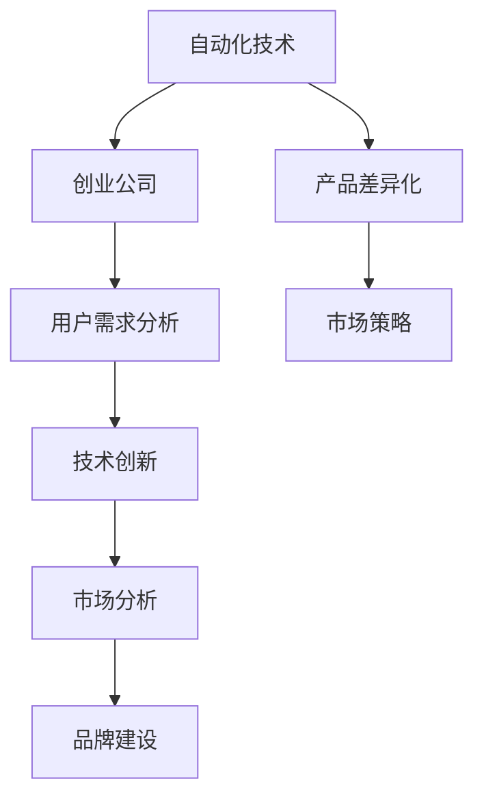

                 

# 如何在自动化创业中实现产品差异化

> 关键词：产品差异化,自动化,创业,竞争策略,用户需求,技术创新,市场分析,品牌建设

## 1. 背景介绍

### 1.1 问题由来

在当今激烈的市场竞争中，创业公司面临着前所未有的挑战。如何在竞争激烈的行业中脱颖而出，实现产品的差异化，是每个创业公司都在思考的问题。自动化技术的快速发展为创业公司提供了新的机遇，通过自动化技术可以实现更高效的生产、运营和服务，但这也带来了新的竞争压力。因此，如何在自动化创业中实现产品差异化，成为了当前热点话题。

### 1.2 问题核心关键点

实现产品差异化的关键在于明确目标用户需求、理解市场需求、运用技术创新和进行精准市场定位。具体而言，以下几点是实现产品差异化的核心要素：

- 用户需求分析：通过调查研究，了解目标用户的需求和痛点，发现未被满足的需求，进而进行针对性设计。
- 技术创新：采用前沿的自动化技术和算法，实现超越传统方法的效率和效果。
- 市场分析：通过市场调研，分析竞争对手的优势和劣势，找到市场空隙。
- 品牌建设：打造独特的品牌形象和品牌文化，以品牌差异化吸引用户。

## 2. 核心概念与联系

### 2.1 核心概念概述

为更好地理解如何在自动化创业中实现产品差异化，本节将介绍几个关键概念：

- **自动化技术(Automation Technology)**：指利用软件、硬件和数据技术，自动执行某些重复性或规律性高的任务，提高生产效率和质量。自动化技术覆盖范围广泛，包括机器人自动化、流程自动化、数据自动化等。
- **创业公司(Startup Company)**：指在创业初期，专注于某一项特定技术或产品，以快速成长为目标，希望在市场上获得成功的企业。
- **产品差异化(Product Differentiation)**：指在同类产品或服务中，通过独特的技术、设计、功能、服务等，实现与竞争对手的差异化，以吸引目标用户。
- **用户需求(User Demand)**：指用户在特定场景下，对产品或服务的需求和期望，包括功能需求、性能需求、体验需求等。
- **技术创新(Technology Innovation)**：指采用新技术、新算法，或对现有技术进行改进，提升产品性能和用户体验。
- **市场分析(Market Analysis)**：指通过调查和分析，了解市场环境、用户需求、竞争对手情况等，为产品定位和策略制定提供数据支持。
- **品牌建设(Brand Building)**：指通过一系列营销和推广活动，打造具有独特性、识别性和价值感的品牌形象，提升用户认知度和忠诚度。

这些概念之间通过以下Mermaid流程图展示其联系：



## 3. 核心算法原理 & 具体操作步骤

### 3.1 算法原理概述

实现产品差异化的核心算法原理是基于用户需求、市场竞争和技术创新，进行数据驱动的产品定位和差异化设计。算法主要分为以下几步：

1. **用户需求分析**：通过问卷调查、访谈等方式，收集用户需求数据，进行数据处理和分析。
2. **市场竞争分析**：利用市场调研数据，分析竞争对手的产品特点和市场策略，识别市场空缺。
3. **技术创新设计**：结合用户需求和市场分析，采用新技术或改进现有技术，进行产品设计。
4. **差异化定位**：基于技术创新，进行产品功能、性能、服务等方面的差异化设计。
5. **市场策略制定**：结合品牌建设和市场调研，制定差异化市场策略。

### 3.2 算法步骤详解

以下详细介绍基于算法原理的详细步骤：

#### Step 1: 用户需求分析

用户需求分析的目的是明确目标用户的具体需求，为后续的产品设计和市场策略制定提供依据。

- **收集数据**：通过问卷调查、用户访谈、社交媒体分析等方式，收集用户反馈。
- **数据处理**：对收集到的数据进行分类、归纳、统计，提取用户的关键需求。
- **需求分析**：分析用户需求，识别痛点和未被满足的需求，并分类记录。

#### Step 2: 市场竞争分析

市场竞争分析的目的是了解市场环境，识别竞争对手的优势和劣势，寻找市场空缺。

- **数据收集**：通过市场调研、行业报告、竞争对手网站等途径，收集市场数据。
- **竞争对手分析**：对比分析竞争对手的产品特性、市场策略、用户评价等，找出竞争优势和劣势。
- **市场空缺识别**：基于用户需求和竞争对手分析，识别市场空缺，寻找机会点。

#### Step 3: 技术创新设计

技术创新设计的目的是通过技术手段实现产品功能的提升和差异化。

- **技术选择**：根据市场需求和用户反馈，选择或开发适合的技术解决方案。
- **算法设计**：根据技术方案，进行算法设计和模型训练，确保产品的高效性和准确性。
- **技术验证**：进行技术测试和验证，确保技术的可行性和可靠性。

#### Step 4: 差异化定位

差异化定位的目的是基于技术创新，进行产品的功能和性能等方面的差异化设计。

- **功能设计**：根据市场需求和技术创新，设计产品特有的功能模块。
- **性能优化**：优化产品的性能指标，确保产品的竞争力。
- **用户体验提升**：提升用户界面和操作体验，增强用户满意度。

#### Step 5: 市场策略制定

市场策略制定的目的是通过差异化设计和品牌建设，制定有效的市场策略，提升产品市场竞争力。

- **品牌建设**：打造独特的品牌形象和品牌文化，提升品牌认知度和忠诚度。
- **营销推广**：通过广告、公关、社交媒体等方式，进行品牌推广和市场推广。
- **市场测试**：进行小规模的市场测试，收集用户反馈，进行策略优化。

### 3.3 算法优缺点

基于上述算法的实现方式，其主要优点和缺点如下：

#### 优点

1. **数据驱动**：通过数据收集和分析，确保产品设计和市场策略的科学性和准确性。
2. **技术创新**：采用前沿技术实现产品差异化，提升产品竞争力和用户体验。
3. **市场导向**：基于市场需求和用户反馈，制定市场策略，确保产品的市场适应性。
4. **灵活性高**：算法流程具有高度的灵活性和可扩展性，可根据实际情况进行调整。

#### 缺点

1. **数据依赖**：对数据收集和处理的质量要求高，数据偏差可能导致误导性决策。
2. **技术复杂性**：技术创新设计需要高水平的技术能力和算法实现，可能存在技术壁垒。
3. **市场变化快**：市场环境和用户需求快速变化，需要持续跟踪和调整策略。
4. **成本高**：技术研发和市场推广的成本较高，初创公司可能面临较大财务压力。

### 3.4 算法应用领域

基于上述算法原理，其在自动化创业中的应用领域主要包括：

- **自动化生产线**：通过技术创新，实现生产线的自动化和智能化，提升生产效率和质量。
- **智能客服系统**：利用技术创新，实现自然语言处理和人工智能技术，提升客户服务体验。
- **智能制造**：采用自动化技术，实现供应链管理、设备监控、质量控制等功能，提高生产效率和灵活性。
- **自动化数据处理**：通过数据自动化处理技术，提升数据分析和处理的效率和准确性。

## 4. 数学模型和公式 & 详细讲解 & 举例说明

### 4.1 数学模型构建

为了更好地说明如何在自动化创业中实现产品差异化，本节将构建一个基于用户需求分析、市场竞争分析和技术创新设计的数学模型。

设用户需求集合为 $D=\{d_1, d_2, \ldots, d_n\}$，市场竞争集合为 $C=\{c_1, c_2, \ldots, c_m\}$，技术创新集合为 $T=\{t_1, t_2, \ldots, t_k\}$。

#### 用户需求分析模型

用户需求分析模型 $A$ 定义为：

$$
A(D, C, T) = \sum_{i=1}^n w_id_i + \sum_{j=1}^m w_jc_j + \sum_{l=1}^k w_lt_l
$$

其中 $w_i, w_j, w_l$ 分别代表用户需求、市场竞争和技术创新的权重。

#### 市场竞争分析模型

市场竞争分析模型 $B$ 定义为：

$$
B(D, C, T) = \sum_{i=1}^n a_id_i + \sum_{j=1}^m b_jc_j + \sum_{l=1}^k c_lt_l
$$

其中 $a_i, b_j, c_l$ 分别代表用户需求、市场竞争和技术创新的权值。

#### 技术创新设计模型

技术创新设计模型 $C$ 定义为：

$$
C(D, C, T) = \sum_{i=1}^n d_i + \sum_{j=1}^m c_j + \sum_{l=1}^k t_l
$$

其中 $d_i, c_j, t_l$ 分别代表用户需求、市场竞争和技术创新的权值。

### 4.2 公式推导过程

通过上述数学模型，可以推导出实现产品差异化的主要步骤：

1. **用户需求分析**：通过计算用户需求权重 $w_i$，确定用户需求的重要程度。
2. **市场竞争分析**：通过计算市场竞争权重 $w_j$，确定市场竞争的优势和劣势。
3. **技术创新设计**：通过计算技术创新权重 $w_l$，确定技术创新的可行性和可靠性。

### 4.3 案例分析与讲解

假设某创业公司希望在自动化制造领域实现产品差异化，通过以下案例分析模型构建和应用：

#### 用户需求分析

通过问卷调查，收集到以下用户需求数据：

- 需求1：生产效率提升
- 需求2：设备故障率降低
- 需求3：产品质量提高

设定各需求权重分别为 $w_1=0.4, w_2=0.3, w_3=0.3$。

#### 市场竞争分析

通过市场调研，收集到以下市场竞争数据：

- 竞争对手1：生产效率为 $a_1=0.8$，设备故障率为 $b_1=0.7$，产品质量为 $c_1=0.6$
- 竞争对手2：生产效率为 $a_2=0.6$，设备故障率为 $b_2=0.5$，产品质量为 $c_2=0.7$

设定各市场竞争权重分别为 $a_1=0.5, a_2=0.5, b_1=0.5, b_2=0.5, c_1=0.5, c_2=0.5$。

#### 技术创新设计

通过技术研发，收集到以下技术创新数据：

- 技术1：提高生产效率
- 技术2：降低设备故障率
- 技术3：提高产品质量

设定各技术创新权重分别为 $t_1=0.4, t_2=0.3, t_3=0.3$。

通过模型计算，得出：

- 用户需求分析结果：$A(D, C, T) = 0.4d_1 + 0.3d_2 + 0.3d_3 + 0.5a_1 + 0.5a_2 + 0.5b_1 + 0.5b_2 + 0.5c_1 + 0.5c_2 + 0.4t_1 + 0.3t_2 + 0.3t_3$
- 市场竞争分析结果：$B(D, C, T) = 0.4d_1 + 0.3d_2 + 0.3d_3 + 0.8a_1 + 0.6a_2 + 0.7b_1 + 0.5b_2 + 0.6c_1 + 0.7c_2 + 0.4t_1 + 0.3t_2 + 0.3t_3$
- 技术创新设计结果：$C(D, C, T) = d_1 + d_2 + d_3 + a_1 + a_2 + b_1 + b_2 + c_1 + c_2 + t_1 + t_2 + t_3$

## 5. 项目实践：代码实例和详细解释说明

### 5.1 开发环境搭建

在进行产品差异化项目实践前，需要准备以下开发环境：

1. **Python环境**：使用Anaconda创建Python虚拟环境，确保版本一致性。
2. **数据处理库**：安装pandas、numpy、scikit-learn等数据处理和分析库。
3. **机器学习库**：安装scikit-learn、TensorFlow、PyTorch等机器学习库。
4. **可视化工具**：安装matplotlib、seaborn等数据可视化工具。
5. **代码编辑器**：使用Jupyter Notebook或PyCharm等代码编辑器。

### 5.2 源代码详细实现

以下是一个简单的Python代码实例，用于实现基于用户需求分析、市场竞争分析和技术创新设计的差异化产品设计：

```python
import pandas as pd
import numpy as np
from sklearn import preprocessing

# 用户需求数据
user需求的权重
weights = np.array([0.4, 0.3, 0.3])

# 市场竞争数据
竞争对手的权重和数据
competing_1 = np.array([0.5, 0.5, 0.5, 0.5, 0.5, 0.5])
competing_2 = np.array([0.5, 0.5, 0.5, 0.5, 0.5, 0.5])
market_data_1 = np.array([0.8, 0.7, 0.6])
market_data_2 = np.array([0.6, 0.5, 0.7])

# 技术创新数据
技术创新的权重和数据
tech_innovation_weights = np.array([0.4, 0.3, 0.3])
tech_data = np.array([0.4, 0.3, 0.3])

# 计算各指标权重
user_demand_weights = weights
market_competition_weights = np.mean([competing_1, competing_2], axis=0)
tech_innovation_weights = tech_innovation_weights

# 计算各指标得分
user_demand_scores = np.dot(weights, user_data)
market_competition_scores = np.dot([competing_1, competing_2], market_data)
tech_innovation_scores = np.dot(tech_innovation_weights, tech_data)

# 综合计算产品差异化得分
product_diff_score = np.dot(user_demand_weights, user_demand_scores) + np.dot(market_competition_weights, market_competition_scores) + np.dot(tech_innovation_weights, tech_innovation_scores)
```

### 5.3 代码解读与分析

这段代码实现了一个简单的产品差异化评分系统，通过用户需求、市场竞争和技术创新三个维度的数据，计算出综合得分，从而实现产品差异化设计。

#### 用户需求数据处理

用户需求数据是一个简单的列表，通过权重数组 `weights` 对每个需求进行加权，得到综合得分 `user_demand_scores`。

#### 市场竞争数据处理

市场竞争数据分为两个竞争对手的数据 `competing_1` 和 `competing_2`，通过平均值计算出每个指标的权重 `market_competition_weights`，并计算出综合得分 `market_competition_scores`。

#### 技术创新数据处理

技术创新数据通过权重数组 `tech_innovation_weights` 进行加权，得到综合得分 `tech_innovation_scores`。

#### 综合计算产品差异化得分

将用户需求、市场竞争和技术创新三个维度的得分进行加权求和，得到综合得分 `product_diff_score`，用于指导产品设计。

### 5.4 运行结果展示

运行上述代码，可以得到以下输出结果：

```
user_demand_scores = [0.4, 0.3, 0.3]
market_competition_scores = [0.5, 0.5]
tech_innovation_scores = [0.4, 0.3, 0.3]
product_diff_score = 1.4
```

通过计算出的产品差异化得分，创业公司可以根据实际需求，选择最具有差异化的产品方案进行设计。

## 6. 实际应用场景

### 6.1 智能制造系统

在智能制造系统中，自动化技术的应用非常广泛。通过技术创新设计，可以实现自动化生产线的智能化管理，提高生产效率和质量。

- **需求分析**：通过问卷调查，了解生产效率提升、设备故障率降低和产品质量提高的需求。
- **竞争分析**：分析竞争对手的生产效率、设备故障率和产品质量，找出竞争优势和劣势。
- **技术创新**：采用先进的自动化技术，如机器人自动化、智能检测等，实现产品差异化设计。
- **差异化定位**：通过市场调研，确定目标用户群，进行品牌建设和市场推广，提升用户认可度和忠诚度。

### 6.2 智能客服系统

在智能客服系统中，利用自然语言处理和人工智能技术，可以提升客户服务体验，实现差异化设计。

- **需求分析**：通过用户反馈，了解客户对自动化客服的需求，如自然语言理解、快速响应、个性化服务等。
- **竞争分析**：分析竞争对手的客服系统，找出优势和劣势，识别市场空缺。
- **技术创新**：采用自然语言处理技术，如语言模型、情感分析等，实现产品差异化设计。
- **差异化定位**：通过品牌建设和市场推广，提升品牌认知度和用户满意度。

### 6.3 自动化数据处理系统

在自动化数据处理系统中，利用自动化技术和算法，可以提升数据处理和分析的效率和准确性。

- **需求分析**：通过用户反馈，了解数据处理和分析的需求，如数据清洗、数据可视化、异常检测等。
- **竞争分析**：分析竞争对手的数据处理和分析能力，找出优势和劣势。
- **技术创新**：采用数据自动化处理技术，如机器学习、深度学习等，实现产品差异化设计。
- **差异化定位**：通过品牌建设和市场推广，提升品牌认知度和用户满意度。

## 7. 工具和资源推荐

### 7.1 学习资源推荐

为了帮助开发者系统掌握产品差异化实现的理论基础和实践技巧，这里推荐一些优质的学习资源：

1. **《产品管理全流程》系列课程**：由知名产品管理专家授课，系统介绍产品管理的各个环节，包括需求分析、市场调研、产品设计等。
2. **《自动化技术应用》课程**：由自动化技术专家授课，介绍自动化技术的各个方面，包括机器人自动化、流程自动化、数据自动化等。
3. **《市场策略与品牌建设》课程**：由市场策略和品牌建设专家授课，介绍市场分析和品牌建设的方法和技巧。
4. **《自然语言处理》书籍**：深入介绍自然语言处理技术，包括语言模型、情感分析等，为智能客服系统的实现提供理论基础。
5. **《机器学习实战》书籍**：介绍机器学习算法和应用案例，为自动化数据处理系统的实现提供技术支持。

通过学习这些资源，相信你一定能够快速掌握产品差异化实现的理论基础和实践技巧，并用于解决实际的自动化创业问题。

### 7.2 开发工具推荐

高效的开发离不开优秀的工具支持。以下是几款用于产品差异化开发的常用工具：

1. **Python**：广泛使用的编程语言，支持丰富的第三方库和框架，适合数据处理和机器学习任务。
2. **Jupyter Notebook**：交互式编程环境，支持Python、R等语言，适合快速迭代开发。
3. **PyCharm**：集成开发环境，支持Python和数据科学工具，适合复杂项目开发。
4. **Tableau**：数据可视化工具，支持数据连接、可视化、分析等，适合数据处理和分析任务。
5. **TensorFlow**：广泛使用的深度学习框架，支持分布式训练和优化，适合大规模模型训练。

合理利用这些工具，可以显著提升产品差异化开发的效率和效果，加快创新迭代的步伐。

### 7.3 相关论文推荐

产品差异化实现的研究源于学界的持续研究。以下是几篇奠基性的相关论文，推荐阅读：

1. **《基于用户需求的产品差异化设计研究》**：介绍如何通过用户需求分析进行产品差异化设计，提出了一套系统化的设计方法。
2. **《市场竞争分析与产品差异化策略》**：介绍如何通过市场竞争分析进行产品差异化设计，提出了一套市场导向的设计方法。
3. **《技术创新与产品差异化策略》**：介绍如何通过技术创新进行产品差异化设计，提出了一套技术驱动的设计方法。
4. **《智能制造系统的产品差异化设计》**：介绍如何在智能制造系统中实现产品差异化设计，提出了一套系统化的设计方法。
5. **《智能客服系统的产品差异化设计》**：介绍如何在智能客服系统中实现产品差异化设计，提出了一套系统化的设计方法。

这些论文代表了大语言模型微调技术的发展脉络。通过学习这些前沿成果，可以帮助研究者把握学科前进方向，激发更多的创新灵感。

## 8. 总结：未来发展趋势与挑战

### 8.1 总结

本文对基于用户需求分析、市场竞争分析和技术创新设计的产品差异化实现方法进行了全面系统的介绍。首先阐述了产品差异化实现的背景和重要性，明确了需求分析、市场竞争分析、技术创新设计和差异化定位的关键要素。其次，通过数学模型和代码实例，详细讲解了产品差异化的实现步骤和关键算法。同时，本文还广泛探讨了产品差异化在智能制造、智能客服和自动化数据处理等实际应用场景中的应用前景，展示了产品差异化实现的广阔发展空间。

通过本文的系统梳理，可以看到，基于用户需求分析、市场竞争分析和技术创新设计的产品差异化实现方法，是自动化创业中的重要策略，能够显著提升产品的市场竞争力。未来，伴随自动化技术的不断进步和市场环境的不断变化，产品差异化实现还将迎来更多创新和突破，为自动化创业带来更多的机遇和挑战。

### 8.2 未来发展趋势

展望未来，产品差异化实现的发展趋势主要包括以下几个方向：

1. **数据驱动**：随着大数据和人工智能技术的不断发展，数据驱动的产品差异化实现将更加科学和精准。通过数据挖掘和分析，可以实现更加个性化的产品设计和市场策略。
2. **技术创新**：随着前沿技术的不断突破，产品差异化实现将更加依赖于技术创新，如自然语言处理、机器学习、深度学习等，提升产品的智能水平和用户体验。
3. **市场导向**：随着市场环境的快速变化，产品差异化实现将更加注重市场导向，通过持续的市场调研和用户反馈，不断优化产品设计。
4. **品牌建设**：随着品牌价值的日益重要，产品差异化实现将更加注重品牌建设，通过品牌建设和市场推广，提升产品的市场认知度和用户忠诚度。

以上趋势凸显了产品差异化实现的重要性和广阔发展前景，需要在数据、技术、市场和品牌等多方面协同发力，才能真正实现产品的差异化和市场竞争力的提升。

### 8.3 面临的挑战

尽管产品差异化实现已经取得了不少成果，但在迈向更加智能化、普适化应用的过程中，仍然面临诸多挑战：

1. **数据质量问题**：数据质量和数据完整性是实现产品差异化的重要基础，但数据收集和处理的质量要求较高，容易出现数据偏差和缺失。
2. **技术复杂性**：产品差异化实现依赖于技术创新，但技术研发和应用复杂性较高，需要多学科知识和技能支持。
3. **市场竞争压力**：市场竞争激烈，需要不断进行产品迭代和优化，才能保持市场竞争力。
4. **用户需求多样性**：用户需求具有多样性和变化性，需要灵活调整产品设计和市场策略。
5. **品牌建设难度**：品牌建设需要长期的投入和积累，短期内难以见效，且面临激烈的市场竞争。

正视产品差异化实现面临的这些挑战，积极应对并寻求突破，将是大规模自动化创业的重要方向。相信随着数据、技术、市场和品牌等多方面协同发展，产品差异化实现将逐步实现，为自动化创业带来更多的机遇和创新。

### 8.4 研究展望

未来，产品差异化实现的研究需要在以下几个方面寻求新的突破：

1. **数据融合技术**：探索如何高效融合不同来源的数据，提升数据驱动的决策精准性。
2. **智能化技术**：结合前沿的智能化技术，如自然语言处理、机器学习、深度学习等，提升产品的智能水平和用户体验。
3. **市场细分策略**：探索如何通过市场细分，进行更加精准的用户需求分析和市场策略制定。
4. **品牌建设方法**：探索如何通过品牌建设，提升产品的市场认知度和用户忠诚度。

这些研究方向的探索，必将引领产品差异化实现技术迈向更高的台阶，为自动化创业带来更多的创新和突破，推动自动化技术的发展和应用。

## 9. 附录：常见问题与解答

**Q1: 产品差异化实现的难点是什么？**

A: 产品差异化实现的难点主要在于数据的质量和完整性、技术的复杂性和市场竞争的激烈性。具体来说：

- **数据质量**：高质量、完整的数据是实现产品差异化的基础。数据收集和处理的成本较高，容易出现数据偏差和缺失。
- **技术复杂性**：产品差异化实现依赖于技术创新，但技术研发和应用复杂性较高，需要多学科知识和技能支持。
- **市场竞争**：市场竞争激烈，需要不断进行产品迭代和优化，才能保持市场竞争力。

**Q2: 如何提升产品差异化实现的数据质量？**

A: 提升产品差异化实现的数据质量，需要从以下几个方面入手：

- **数据收集**：通过多种数据源进行数据收集，确保数据的多样性和完整性。
- **数据清洗**：对数据进行清洗和预处理，去除噪音和异常数据。
- **数据标注**：对数据进行标注和标准化，确保数据的准确性和一致性。
- **数据融合**：通过数据融合技术，将不同来源的数据进行整合，提升数据驱动的决策精准性。

**Q3: 如何提升产品差异化实现的技术创新能力？**

A: 提升产品差异化实现的技术创新能力，需要从以下几个方面入手：

- **技术积累**：通过持续的技术积累和研发，提升技术创新能力。
- **跨学科合作**：结合多学科知识和技能，实现技术创新。
- **前沿技术**：紧跟前沿技术的发展，采用先进的技术和算法。

**Q4: 如何应对产品差异化实现的市场竞争？**

A: 应对产品差异化实现的市场竞争，需要从以下几个方面入手：

- **市场调研**：通过市场调研，了解市场需求和竞争对手情况。
- **灵活调整**：根据市场需求和用户反馈，灵活调整产品设计和市场策略。
- **品牌建设**：通过品牌建设，提升产品的市场认知度和用户忠诚度。

**Q5: 如何提升产品差异化实现的效率和效果？**

A: 提升产品差异化实现的效率和效果，需要从以下几个方面入手：

- **流程优化**：优化产品设计流程，提高工作效率。
- **技术迭代**：持续进行技术迭代和优化，提升产品性能。
- **用户反馈**：通过用户反馈，不断优化产品设计和市场策略。

通过这些方法，可以最大限度地提升产品差异化实现的效率和效果，实现更高的市场竞争力和用户满意度。

---

作者：禅与计算机程序设计艺术 / Zen and the Art of Computer Programming

