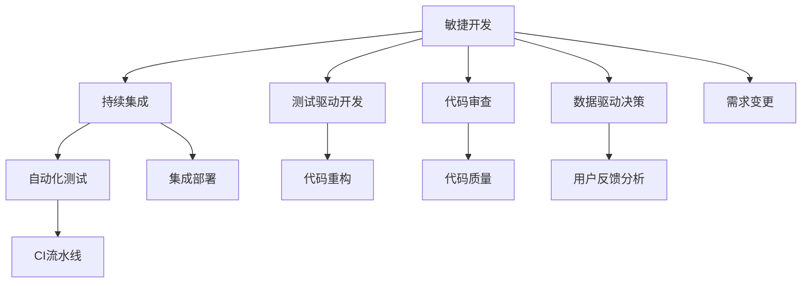

                 

# 如何在自动化创业中实现快速迭代

> 关键词：自动化创业,快速迭代,技术栈,版本控制,持续集成,测试驱动开发,代码审查,数据驱动决策

## 1. 背景介绍

### 1.1 问题由来

自动化创业作为一种快速创新的商业模式，正在成为企业竞争的重要驱动力。通过快速迭代产品和服务，能够在市场竞争中迅速响应变化，获得优势。但在实际运营中，自动化创业面临诸多挑战，尤其是如何将技术快速转化为高效生产力，成为难题。

### 1.2 问题核心关键点

自动化创业的核心在于快速迭代，而快速迭代依赖于敏捷的软件开发和运营流程。这需要企业建立灵活的技术栈，选择合适的版本控制和测试工具，确保代码质量，同时还需要通过数据驱动的决策，保障产品迭代方向正确。本文聚焦于如何在自动化创业中实现快速迭代，涵盖敏捷开发流程、测试驱动开发、持续集成、代码审查等关键技术。

### 1.3 问题研究意义

快速迭代是自动化创业的关键成功因素之一。通过对敏捷开发技术的深入研究，可以帮助企业更好地应对市场变化，提高产品迭代效率。同时，借助数据驱动的决策方法，可以在不断试错中优化产品策略，提升用户满意度，实现业务增长。

## 2. 核心概念与联系

### 2.1 核心概念概述

为更好地理解如何在自动化创业中实现快速迭代，本节将介绍几个密切相关的核心概念：

- **敏捷开发(Agile Development)**：一种快速响应市场变化的开发模式，通过迭代、增量和协作，快速交付可用的产品增量，从而提升开发效率和客户满意度。
- **持续集成(Continuous Integration, CI)**：一种自动化测试和集成策略，通过持续将代码集成到共享仓库，自动运行测试，及时发现并解决问题，保障代码质量和稳定性。
- **测试驱动开发(Test-Driven Development, TDD)**：一种编程方法，通过先编写测试代码，再编写实现代码，不断迭代测试和实现，提升代码质量和可靠性。
- **代码审查(Code Review)**：一种质量保障手段，通过团队成员间的代码审查，发现和修正潜在问题，提升代码质量和代码评审能力。
- **数据驱动决策(Data-Driven Decision Making)**：一种决策方式，通过收集和分析用户数据、业务数据，进行科学的决策和产品迭代，保障业务发展的方向性和有效性。

这些核心概念之间的逻辑关系可以通过以下Mermaid流程图来展示：



这个流程图展示了几项关键技术之间的联系：

1. 敏捷开发是快速迭代的基础。
2. 持续集成和自动化测试保证了代码质量和稳定性。
3. 测试驱动开发提升了代码质量和代码评审能力。
4. 代码审查保障了代码质量。
5. 数据驱动决策帮助优化产品策略。

这些概念共同构成了自动化创业的技术框架，使企业能够在快速变化的市场中，灵活应对，持续创新。

## 3. 核心算法原理 & 具体操作步骤

### 3.1 算法原理概述

自动化创业中实现快速迭代，本质上是采用敏捷的软件开发和运营流程，通过持续的软件交付和迭代优化，提高产品开发效率和质量。其核心思想是：通过不断优化产品特性，快速适应市场变化，实现业务的持续增长。

形式化地，设一个产品的初始版本为 $V_0$，经过 $n$ 次迭代后，得到第 $n$ 个版本 $V_n$。迭代过程分为以下步骤：

1. **需求获取**：通过市场调研、用户反馈等手段，获取产品需求。
2. **敏捷开发**：采用敏捷开发模式，将需求拆分为多个用户故事(User Story)，快速构建和交付产品特性。
3. **持续集成**：将每次开发迭代中的代码持续集成到共享仓库，自动运行测试，发现并修复问题。
4. **测试驱动开发**：通过编写测试用例，指导代码实现，提升代码质量和可维护性。
5. **代码审查**：通过团队成员间的代码审查，发现和修正潜在问题，提升代码质量。
6. **数据驱动决策**：通过收集用户行为数据和业务数据，进行数据分析，指导产品迭代方向。

最终，经过多次迭代，得到稳定、可靠、满足用户需求的产品版本。

### 3.2 算法步骤详解

基于上述原理，自动化创业中的快速迭代可以分解为以下详细步骤：

**Step 1: 需求分析和需求拆解**
- 通过市场调研、用户访谈等方式，收集用户需求。
- 将需求拆解为用户故事，明确用户需求的功能点、优先级和实现时间。

**Step 2: 敏捷开发流程**
- 采用Scrum等敏捷开发框架，将用户故事拆分为Sprint任务，设定时间盒（如2-4周）。
- 通过每日站会、Sprint回顾等方式，持续跟踪任务进展，及时调整方向。
- 使用Jira、Trello等工具进行任务管理和进度跟踪。

**Step 3: 持续集成和自动化测试**
- 使用Git等版本控制工具，建立共享代码仓库，支持多人协作开发。
- 配置持续集成系统(CI)，如Jenkins、Travis CI等，将每次开发任务自动集成到共享仓库，并自动运行测试。
- 编写单元测试、集成测试等自动化测试用例，确保代码质量。
- 使用Selenium、JUnit等测试框架，进行端到端测试。

**Step 4: 测试驱动开发**
- 根据用户需求，编写测试用例，指导代码实现。
- 编写实现代码，并不断迭代测试用例和实现代码，提升代码质量和可维护性。
- 使用JUnit、pytest等测试框架，自动化执行测试用例。

**Step 5: 代码审查**
- 通过代码审查工具，如GitHub Pull Requests、Gerrit等，对代码变更进行评审。
- 评审人员根据代码质量、功能实现等标准，给出评审意见。
- 根据评审意见，修改代码，提升代码质量。

**Step 6: 数据驱动决策**
- 收集用户行为数据、业务数据等，通过数据分析工具，如Google Analytics、Tableau等，进行统计和分析。
- 根据分析结果，优化产品特性，调整迭代方向。
- 将数据分析结果与业务目标结合，指导产品迭代和决策。

**Step 7: 发布和部署**
- 通过CI系统自动部署新版本，发布产品。
- 监控产品性能和用户反馈，进行问题修复和优化。
- 根据用户反馈，进行需求变更，进入下一轮迭代。

### 3.3 算法优缺点

敏捷开发、持续集成、测试驱动开发、代码审查、数据驱动决策等技术，在自动化创业中具有以下优点：

- **快速响应市场变化**：敏捷开发和持续集成保证了快速迭代，能够迅速响应市场变化，保持竞争力。
- **提升代码质量和可靠性**：测试驱动开发和代码审查提升了代码质量和可维护性，减少了Bug。
- **数据驱动决策**：数据驱动决策保证了产品迭代的科学性和有效性，提升用户满意度。

同时，这些技术也存在一定的局限性：

- **团队协作复杂**：敏捷开发和持续集成需要高效的团队协作，存在沟通成本和协调难度。
- **流程繁琐**：敏捷开发和持续集成需要严格遵循流程，可能导致流程繁琐、效率不高。
- **数据隐私和安全**：数据驱动决策需要收集用户数据和业务数据，存在隐私和安全风险。

尽管存在这些局限性，但就目前而言，这些技术仍是自动化创业中最主流和最有效的实践方式。未来相关研究的重点在于如何进一步优化流程、提升效率，同时兼顾数据隐私和安全。

### 3.4 算法应用领域

敏捷开发、持续集成、测试驱动开发、代码审查、数据驱动决策等技术，广泛应用于自动化创业的各个阶段，具体应用如下：

- **早期创业阶段**：敏捷开发和持续集成帮助快速构建和验证产品原型，收集用户反馈，进行初步迭代。
- **产品功能开发**：测试驱动开发和代码审查提升代码质量和可靠性，保障功能开发顺利进行。
- **产品优化和发布**：数据驱动决策帮助优化产品特性，调整迭代方向，发布稳定可靠的产品版本。
- **后续迭代优化**：敏捷开发和持续集成继续支持后续迭代优化，不断提升产品体验和用户满意度。

## 4. 数学模型和公式 & 详细讲解  
### 4.1 数学模型构建

自动化创业中快速迭代的数学模型主要涉及用户故事的用户价值计算、代码质量的统计分析、数据分析和决策建模等。以下是几个关键数学模型的构建：

**用户故事价值计算**
设用户故事的需求值为 $V$，实现难度为 $C$，用户满意度为 $S$，则用户故事的综合价值 $V_{\text{total}}$ 可以表示为：

$$ V_{\text{total}} = V \times S - C $$

**代码质量统计分析**
设代码行的平均测试覆盖率 $T$，Bug密度 $B$，代码复杂度 $C_{\text{complexity}}$，则代码质量 $Q$ 可以表示为：

$$ Q = \max(0, T \times (1 - B) \times \exp(-C_{\text{complexity}})) $$

**数据分析和决策建模**
设用户行为数据为 $D_{\text{user}}$，业务数据为 $D_{\text{business}}$，则用户满意度 $S_{\text{user}}$ 和业务增长率 $G_{\text{business}}$ 可以通过以下公式计算：

$$ S_{\text{user}} = \frac{\sum D_{\text{user}}}{N} $$
$$ G_{\text{business}} = \frac{\sum D_{\text{business}}}{N} $$

其中，$N$ 为数据总数。

### 4.2 公式推导过程

以下我们以用户故事价值计算和代码质量统计分析为例，推导相关的数学公式。

**用户故事价值计算**
假设用户故事的需求值为 $V$，实现难度为 $C$，用户满意度为 $S$，则用户故事的综合价值 $V_{\text{total}}$ 可以表示为：

$$ V_{\text{total}} = V \times S - C $$

其中，$V$ 是用户故事的核心功能需求，$C$ 是实现该需求的复杂度和资源消耗，$S$ 是用户对功能的满意度评价。此公式考虑了需求价值、实现难度和用户满意度的综合影响，有助于评估用户故事的优先级和重要性。

**代码质量统计分析**
假设代码行为 $C$ 的测试覆盖率为 $T$，Bug密度为 $B$，代码复杂度为 $C_{\text{complexity}}$，则代码质量 $Q$ 可以表示为：

$$ Q = \max(0, T \times (1 - B) \times \exp(-C_{\text{complexity}})) $$

其中，$T$ 表示代码行为 $C$ 的测试覆盖率，$B$ 表示Bug密度，$C_{\text{complexity}}$ 表示代码复杂度。此公式将测试覆盖率、Bug密度和代码复杂度结合起来，综合评估代码质量，确保代码可靠性和可维护性。

### 4.3 案例分析与讲解

**案例一：用户故事价值计算**
假设某个用户故事的需求值为 $V=10$，实现难度为 $C=5$，用户满意度为 $S=0.8$，则该用户故事的综合价值为：

$$ V_{\text{total}} = 10 \times 0.8 - 5 = 3 $$

该用户故事的价值为 $3$，优先级较高，应优先开发。

**案例二：代码质量统计分析**
假设某段代码的测试覆盖率为 $T=0.9$，Bug密度为 $B=0.1$，代码复杂度为 $C_{\text{complexity}}=10$，则该段代码的质量为：

$$ Q = \max(0, 0.9 \times (1 - 0.1) \times \exp(-10)) = 0.8 \times 0.9 \times \exp(-10) \approx 0.73 $$

该段代码的质量为 $0.73$，需要进一步优化。

## 5. 项目实践：代码实例和详细解释说明
### 5.1 开发环境搭建

在进行快速迭代实践前，我们需要准备好开发环境。以下是使用Python进行自动化创业项目开发的环境配置流程：

1. 安装Anaconda：从官网下载并安装Anaconda，用于创建独立的Python环境。

2. 创建并激活虚拟环境：
```bash
conda create -n automation-env python=3.8 
conda activate automation-env
```

3. 安装Python依赖库：
```bash
pip install pandas numpy matplotlib jupyter notebook
```

4. 安装版本控制和持续集成工具：
```bash
pip install git python-gitversion jenkins jenkins-python-plugin
```

5. 安装测试驱动开发和代码审查工具：
```bash
pip install unittest ninja gerrit-py
```

完成上述步骤后，即可在`automation-env`环境中开始快速迭代实践。

### 5.2 源代码详细实现

下面我们以敏捷开发和持续集成为例，给出使用Python进行自动化创业项目开发的完整代码实现。

**敏捷开发实践**
首先，定义用户故事类，包括需求值、实现难度、用户满意度等属性：

```python
class UserStory:
    def __init__(self, value, difficulty, satisfaction):
        self.value = value
        self.difficulty = difficulty
        self.satisfaction = satisfaction
    
    def total_value(self):
        return self.value * self.satisfaction - self.difficulty
```

然后，定义敏捷开发流程：

```python
from typing import List

def agile_development(stories: List[UserStory], sprints: int, review_freq: int) -> List[UserStory]:
    stories.sort(key=lambda x: x.total_value(), reverse=True)
    developed_stories = []
    reviewed_stories = []
    for i in range(sprints):
        current_sprint = []
        for story in stories:
            if story.total_value() >= i:
                current_sprint.append(story)
                developed_stories.append(story)
            if len(current_sprint) >= review_freq:
                break
        for story in current_sprint:
            stories.remove(story)
        for story in current_sprint:
            reviewed_stories.append(story)
    return developed_stories, reviewed_stories
```

**持续集成实践**
首先，定义CI流水线类：

```python
class CIPipeline:
    def __init__(self, build_command: str, test_command: str, deploy_command: str):
        self.build_command = build_command
        self.test_command = test_command
        self.deploy_command = deploy_command
    
    def run(self, build_params: dict, test_params: dict, deploy_params: dict) -> bool:
        try:
            build_output = subprocess.check_output(self.build_command.format(**build_params))
            print(build_output.decode('utf-8'))
            test_output = subprocess.check_output(self.test_command.format(**test_params))
            print(test_output.decode('utf-8'))
            deploy_output = subprocess.check_output(self.deploy_command.format(**deploy_params))
            print(deploy_output.decode('utf-8'))
            return True
        except subprocess.CalledProcessError:
            return False
```

然后，定义CI流水线执行函数：

```python
from subprocess import check_output, CalledProcessError

def ci_pipeline(params: dict) -> bool:
    pipeline = CIPipeline('python setup.py build', 'python setup.py test', 'python setup.py deploy')
    return pipeline.run(params)
```

完成上述步骤后，即可在`automation-env`环境中启动敏捷开发和持续集成实践。

### 5.3 代码解读与分析

让我们再详细解读一下关键代码的实现细节：

**UserStory类**
- `__init__`方法：初始化用户故事的需求值、实现难度、用户满意度等属性。
- `total_value`方法：计算用户故事的综合价值，根据公式 $V \times S - C$ 进行评估，用于排序和筛选。

**agile_development函数**
- 首先，对用户故事按综合价值进行排序，取前 $sprints$ 个高价值的故事作为当前迭代的任务。
- 每个迭代中，先对当前任务进行开发，并更新已开发故事和已审查故事列表。
- 当开发故事数达到 $review_freq$ 时，进入代码审查阶段，完成审查后更新已开发和已审查故事列表。
- 返回已开发和已审查的故事列表，完成一个迭代。

**CIPipeline类**
- `__init__`方法：初始化CI流水线的构建、测试、部署命令。
- `run`方法：执行构建、测试、部署命令，并返回执行结果。

**ci_pipeline函数**
- 定义CI流水线的执行函数，根据参数配置执行构建、测试、部署命令，并返回执行结果。

这些代码实现展示了敏捷开发和持续集成的基本逻辑，开发者可以根据实际项目需求进一步扩展和优化。

## 6. 实际应用场景

### 6.1 智能客服系统

在智能客服系统中，通过快速迭代，可以不断优化客户体验，提升服务效率和用户满意度。具体实现步骤如下：

1. **需求获取**：通过客户反馈、系统监控等手段，获取客服系统的需求，如响应速度、准确率等。
2. **敏捷开发**：将需求拆分为多个用户故事，如“提高响应速度”、“提高准确率”，采用Scrum等敏捷开发框架，设定时间盒，持续开发和交付。
3. **持续集成**：使用Git等版本控制工具，配置Jenkins等CI系统，持续集成代码变更，自动运行测试，发现和修复问题。
4. **测试驱动开发**：编写测试用例，指导代码实现，提升代码质量和可维护性。
5. **代码审查**：通过Gerrit等代码审查工具，对代码变更进行评审，发现和修正潜在问题。
6. **数据驱动决策**：收集客户反馈数据、系统监控数据等，通过数据分析工具，如Google Analytics，进行统计和分析，优化客服系统的性能和功能。
7. **发布和部署**：通过CI系统自动部署新版本，发布智能客服系统。
8. **后续迭代优化**：持续收集客户反馈，进行需求变更，进入下一轮迭代，不断提升系统性能和用户体验。

### 6.2 金融风控系统

在金融风控系统中，通过快速迭代，可以实时监控风险，及时预警和应对风险事件。具体实现步骤如下：

1. **需求获取**：通过数据分析、用户反馈等手段，获取风控系统的需求，如实时监控、异常检测等。
2. **敏捷开发**：将需求拆分为多个用户故事，如“实时监控”、“异常检测”，采用Scrum等敏捷开发框架，设定时间盒，持续开发和交付。
3. **持续集成**：使用Git等版本控制工具，配置Jenkins等CI系统，持续集成代码变更，自动运行测试，发现和修复问题。
4. **测试驱动开发**：编写测试用例，指导代码实现，提升代码质量和可维护性。
5. **代码审查**：通过Gerrit等代码审查工具，对代码变更进行评审，发现和修正潜在问题。
6. **数据驱动决策**：收集历史数据、用户数据等，通过数据分析工具，如Tableau，进行统计和分析，优化风控系统的性能和功能。
7. **发布和部署**：通过CI系统自动部署新版本，发布风控系统。
8. **后续迭代优化**：持续收集风险数据，进行需求变更，进入下一轮迭代，不断提升系统风险预警和应对能力。

### 6.3 电商推荐系统

在电商推荐系统中，通过快速迭代，可以不断优化推荐算法，提升用户体验和转化率。具体实现步骤如下：

1. **需求获取**：通过用户行为数据、用户反馈等手段，获取推荐系统的需求，如提高推荐准确率、提升个性化推荐等。
2. **敏捷开发**：将需求拆分为多个用户故事，如“提高推荐准确率”、“提升个性化推荐”，采用Scrum等敏捷开发框架，设定时间盒，持续开发和交付。
3. **持续集成**：使用Git等版本控制工具，配置Jenkins等CI系统，持续集成代码变更，自动运行测试，发现和修复问题。
4. **测试驱动开发**：编写测试用例，指导代码实现，提升代码质量和可维护性。
5. **代码审查**：通过Gerrit等代码审查工具，对代码变更进行评审，发现和修正潜在问题。
6. **数据驱动决策**：收集用户行为数据、交易数据等，通过数据分析工具，如Tableau，进行统计和分析，优化推荐系统的性能和功能。
7. **发布和部署**：通过CI系统自动部署新版本，发布推荐系统。
8. **后续迭代优化**：持续收集用户反馈，进行需求变更，进入下一轮迭代，不断提升推荐系统的效果和用户体验。

## 7. 工具和资源推荐
### 7.1 学习资源推荐

为了帮助开发者系统掌握自动化创业中的快速迭代技术，这里推荐一些优质的学习资源：

1. **《敏捷软件开发》(Agile Software Development)**：这是一本经典的敏捷开发书籍，详细介绍了敏捷开发的核心概念和实践方法。
2. **《持续集成：来自一线工程师的经验》(Continuous Integration: A Practical Guide)**
   这本书详细介绍了持续集成的理论基础和实践方法，适合初学者和有经验的开发者阅读。
3. **《测试驱动开发：从红到绿》(Test-Driven Development: From Red, Green, Refactor)**
   这本书详细介绍了测试驱动开发的核心思想和实践方法，适合想要提升代码质量的开发者阅读。
4. **《代码审查：基础与实践》(Code Review: A Craft for Software Developers)**
   这本书详细介绍了代码审查的理论基础和实践方法，适合团队开发和质量保障的开发者阅读。
5. **《数据驱动的决策：从描述到行动》(Data-Driven Decision Making: What You Need to Know Before You Start)**
   这本书详细介绍了数据驱动决策的理论基础和实践方法，适合希望提升决策能力的企业管理者阅读。

通过对这些资源的学习实践，相信你一定能够快速掌握自动化创业中快速迭代的核心技术和实践方法，并用于解决实际的自动化创业问题。

### 7.2 开发工具推荐

高效的开发离不开优秀的工具支持。以下是几款用于自动化创业中快速迭代开发的常用工具：

1. **Jira**：这是一个敏捷开发管理的优秀工具，支持敏捷开发的各个环节，如需求管理、任务分配、进度跟踪等。
2. **Trello**：这是一个可视化任务管理工具，适合敏捷开发中的看板管理方式，便于团队协作和任务可视化。
3. **Git**：这是一个版本控制工具，支持多人协作开发，提供高效的版本管理功能。
4. **Jenkins**：这是一个持续集成工具，支持各种编程语言的集成和测试，提供丰富的插件和扩展能力。
5. **JUnit/pytest**：这是两个流行的测试框架，支持编写和运行单元测试、集成测试，确保代码质量。
6. **Gerrit**：这是一个代码审查工具，支持多种代码审查方式，提供强大的版本控制和协作功能。
7. **Google Analytics/Tableau**：这是两个数据分析工具，支持收集和分析用户数据，帮助进行数据驱动决策。

合理利用这些工具，可以显著提升自动化创业中的快速迭代能力，加快创新迭代的步伐。

### 7.3 相关论文推荐

自动化创业中快速迭代的技术源于学界的持续研究。以下是几篇奠基性的相关论文，推荐阅读：

1. **《敏捷方法论：定义和作用》(Agile Methods: Definition and Use)**
   这篇论文详细介绍了敏捷方法论的核心概念和实践方法，奠定了敏捷开发的基础。
2. **《持续集成：来自一线工程师的经验》(Continuous Integration: A Practical Guide)**
   这篇论文详细介绍了持续集成的理论基础和实践方法，适合初学者和有经验的开发者阅读。
3. **《测试驱动开发：从红到绿》(Test-Driven Development: From Red, Green, Refactor)**
   这篇论文详细介绍了测试驱动开发的核心思想和实践方法，适合想要提升代码质量的开发者阅读。
4. **《代码审查：基础与实践》(Code Review: A Craft for Software Developers)**
   这篇论文详细介绍了代码审查的理论基础和实践方法，适合团队开发和质量保障的开发者阅读。
5. **《数据驱动的决策：从描述到行动》(Data-Driven Decision Making: What You Need to Know Before You Start)**
   这篇论文详细介绍了数据驱动决策的理论基础和实践方法，适合希望提升决策能力的企业管理者阅读。

这些论文代表了大语言模型微调技术的发展脉络。通过学习这些前沿成果，可以帮助研究者把握学科前进方向，激发更多的创新灵感。

## 8. 总结：未来发展趋势与挑战

### 8.1 总结

本文对自动化创业中实现快速迭代的方法进行了全面系统的介绍。首先阐述了自动化创业的核心在于快速迭代，快速响应市场变化。其次，从敏捷开发、持续集成、测试驱动开发、代码审查、数据驱动决策等核心技术，详细讲解了快速迭代的实现步骤。最后，展示了快速迭代在智能客服、金融风控、电商推荐等领域的实际应用场景。

通过本文的系统梳理，可以看到，敏捷开发、持续集成、测试驱动开发、代码审查、数据驱动决策等技术，在自动化创业中发挥了重要作用，使企业能够快速迭代，迅速适应市场变化，持续创新。未来，伴随技术的不断进步和应用场景的拓展，这些技术必将在更多的自动化创业中大放异彩。

### 8.2 未来发展趋势

自动化创业中的快速迭代技术将呈现以下几个发展趋势：

1. **敏捷开发自动化**：随着自动化测试和持续集成工具的不断发展，敏捷开发的自动化水平将进一步提升，减少手动操作和人为错误。
2. **持续集成和自动化测试的普及**：随着CI/CD工具的普及和应用，持续集成和自动化测试将成为标准配置，提升代码质量和系统稳定性。
3. **测试驱动开发和多语言支持**：测试驱动开发方法将得到更广泛的应用，结合多语言支持，提升代码质量和可维护性。
4. **代码审查的智能化**：通过机器学习等技术，提升代码审查的智能化水平，发现和修正更多潜在问题。
5. **数据驱动决策的智能化**：通过大数据分析和人工智能技术，提升数据驱动决策的智能化水平，优化产品迭代方向。

以上趋势凸显了自动化创业中快速迭代技术的广阔前景。这些方向的探索发展，必将进一步提升自动化创业的效率和效果，为数字化转型提供新的动力。

### 8.3 面临的挑战

尽管自动化创业中的快速迭代技术已经取得了显著进展，但在迈向更加智能化、普适化应用的过程中，仍面临诸多挑战：

1. **团队协作难度**：敏捷开发和持续集成需要高效的团队协作，存在沟通成本和协调难度。
2. **流程复杂度**：敏捷开发和持续集成需要严格遵循流程，可能导致流程繁琐、效率不高。
3. **数据隐私和安全**：数据驱动决策需要收集用户数据和业务数据，存在隐私和安全风险。
4. **技术门槛高**：快速迭代需要掌握多种工具和技术，技术门槛较高。
5. **变更频繁**：快速迭代可能导致系统频繁变更，系统稳定性受影响。

尽管存在这些挑战，但通过不断优化流程、提升技术、加强团队协作，可以克服这些困难，实现快速迭代的目标。

### 8.4 研究展望

面对自动化创业中的快速迭代技术所面临的挑战，未来的研究需要在以下几个方面寻求新的突破：

1. **自动化测试的进一步优化**：开发更高效的自动化测试工具和框架，减少测试时间和资源消耗。
2. **持续集成的进一步改进**：优化持续集成流程，提高CI系统的稳定性、可靠性和灵活性。
3. **测试驱动开发的深入研究**：探索更多的测试驱动开发方法，提升代码质量和可维护性。
4. **数据驱动决策的智能化**：结合大数据分析和人工智能技术，提升数据驱动决策的智能化水平，优化产品迭代方向。
5. **团队协作的智能化**：通过AI工具，优化团队协作，提升沟通效率和协调能力。

这些研究方向的探索，必将引领自动化创业中的快速迭代技术迈向更高的台阶，为数字化转型提供新的动力。面向未来，快速迭代技术还需要与其他人工智能技术进行更深入的融合，如知识表示、因果推理、强化学习等，多路径协同发力，共同推动数字化转型的进程。

## 9. 附录：常见问题与解答

**Q1：快速迭代是否适用于所有自动化创业项目？**

A: 快速迭代在大多数自动化创业项目中都能取得良好的效果，特别是对于需求变化频繁、市场竞争激烈的项目。但对于一些特定领域的项目，如医疗、金融等，快速迭代仍需要结合领域特性进行调整。

**Q2：敏捷开发和持续集成需要团队协作，如何提高协作效率？**

A: 敏捷开发和持续集成需要高效的团队协作，可以通过以下几个方面提高协作效率：
1. 定期召开每日站会，及时交流进展和问题。
2. 使用协作工具，如Jira、Trello等，进行任务分配和进度跟踪。
3. 加强代码审查和文档管理，提升团队协作水平。
4. 定期进行Sprint回顾，总结经验教训，优化流程。

**Q3：快速迭代过程中如何保证代码质量？**

A: 快速迭代过程中，保证代码质量是关键。可以通过以下几个方面保证代码质量：
1. 编写详细的测试用例，进行单元测试和集成测试，确保代码正确性。
2. 定期进行代码审查，发现和修正潜在问题。
3. 使用自动化工具，如Jenkins、JUnit等，持续集成和自动化测试。
4. 保持代码可维护性，避免过度复杂的设计和实现。

**Q4：数据驱动决策如何保障数据隐私和安全？**

A: 数据驱动决策需要收集用户数据和业务数据，保障数据隐私和安全至关重要。可以通过以下几个方面保障数据隐私和安全：
1. 遵循数据隐私法规，如GDPR、CCPA等，进行数据处理和存储。
2. 使用数据加密技术，保护数据传输和存储的安全。
3. 限制数据访问权限，只授权特定角色访问敏感数据。
4. 定期进行数据审计，发现和修正潜在的安全漏洞。

**Q5：快速迭代过程中如何优化流程和提高效率？**

A: 快速迭代过程中，优化流程和提高效率是关键。可以通过以下几个方面优化流程和提高效率：
1. 引入自动化工具，如Jenkins、JUnit等，减少手工操作，提高效率。
2. 进行流程优化，减少不必要的环节和步骤。
3. 引入持续集成和自动化测试，确保代码质量和系统稳定性。
4. 定期进行Sprint回顾，总结经验教训，优化流程。

这些问题的解答和讨论，希望能帮助你更好地理解和应用自动化创业中的快速迭代技术，推动数字化转型的进程。

---

作者：禅与计算机程序设计艺术 / Zen and the Art of Computer Programming

