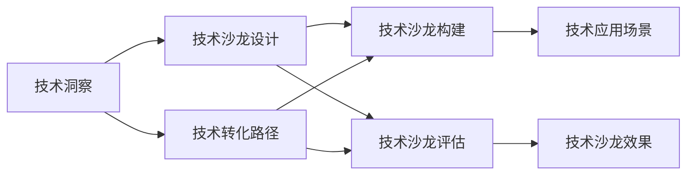

                 

# 如何将技术洞察转化为高端技术沙龙

## 1. 背景介绍

### 1.1 问题由来

随着人工智能技术的不断发展和应用，技术洞察力的转化已经成为了推动科技创新和社会进步的重要手段。然而，如何将前沿的技术洞察转化为具有实际价值的技术沙龙，却是一个亟待解决的问题。技术沙龙不仅仅是技术交流的平台，更是一种将技术洞察转化为社会应用的能力展示。传统的技术沙龙往往局限于理论交流和学术讨论，难以真正将技术转化为实际生产力。

### 1.2 问题核心关键点

为有效将技术洞察转化为高端技术沙龙，我们需要关注以下几个核心关键点：

- **技术洞察的获取**：如何获取和理解前沿技术的发展趋势和应用价值。
- **技术沙龙的构建**：如何设计一个高效、互动的技术沙龙，让参与者能够深入交流和学习。
- **技术转化的路径**：如何将技术洞察转化为具体的应用场景和商业价值。
- **技术沙龙的评估**：如何评估技术沙龙的效果和影响力，确保其长期价值。

## 2. 核心概念与联系

### 2.1 核心概念概述

- **技术洞察**：基于对当前和未来技术趋势的深入理解，识别出具有商业潜力的技术方向和应用场景。
- **技术沙龙**：一个集技术交流、应用展示和合作对接于一体的创新平台，旨在推动技术的落地应用。
- **技术转化**：将技术洞察转化为实际应用和商业价值的过程，包括产品开发、市场推广和用户反馈等环节。
- **技术评估**：对技术沙龙的效果和影响力的量化评估，确保其高效性和持续性。

这些核心概念相互关联，共同构成了将技术洞察转化为高端技术沙龙的基本框架。通过理解这些概念，我们可以更好地把握技术转化的全过程。

### 2.2 核心概念原理和架构的 Mermaid 流程图



这个流程图展示了技术洞察、技术沙龙设计、技术转化路径、技术沙龙构建和技术沙龙评估之间的逻辑关系。技术洞察是起点，通过技术沙龙设计将技术转化为具体的应用场景，然后通过技术转化路径实现技术落地，最后通过技术沙龙评估确保技术沙龙的长期价值。

## 3. 核心算法原理 & 具体操作步骤

### 3.1 算法原理概述

技术转化的核心在于将技术洞察转化为实际应用，这一过程可以视为一个基于反馈循环的学习过程。通过不断的技术迭代和市场验证，逐步优化技术方案，最终实现技术落地。技术转化的算法原理可以概括为以下几个步骤：

1. **技术洞察获取**：通过技术调研、数据分析和专家咨询等方式，获取最新的技术趋势和应用价值。
2. **技术沙龙设计**：基于技术洞察，设计出具有吸引力和互动性的技术沙龙活动，吸引潜在用户和合作伙伴。
3. **技术转化路径**：选择最符合技术洞察的应用场景，进行产品开发和市场推广，收集用户反馈。
4. **技术沙龙构建**：根据技术转化路径，选择合适的技术沙龙形式和内容，确保高效互动。
5. **技术沙龙评估**：通过技术指标和用户反馈，量化评估技术沙龙的效果，不断优化技术转化路径。

### 3.2 算法步骤详解

#### 3.2.1 技术洞察获取

- **技术调研**：通过阅读最新文献、技术报告和专利申请等，获取行业最新的技术趋势和发展方向。
- **数据分析**：利用大数据和人工智能技术，分析市场数据和用户行为，识别出潜在的市场需求和技术应用场景。
- **专家咨询**：与行业专家进行深入交流，获取前沿技术洞察和应用建议。

#### 3.2.2 技术沙龙设计

- **沙龙形式**：根据技术洞察的特点和目标受众的偏好，设计出最适合的技术沙龙形式，如线上沙龙、线下沙龙、工作坊等。
- **沙龙内容**：选择具有吸引力和互动性的内容，如技术演示、案例分享、技术讨论等，确保沙龙的高效互动。
- **沙龙参与者**：邀请行业专家、技术爱好者和潜在用户参与，形成多方互动的沙龙氛围。

#### 3.2.3 技术转化路径

- **应用场景选择**：根据技术洞察和市场需求，选择最符合应用场景的技术方案，进行产品开发和市场推广。
- **产品开发**：设计并实现技术原型，进行功能和性能测试，确保技术方案的可行性。
- **市场推广**：通过线上线下渠道，推广技术方案，收集用户反馈。

#### 3.2.4 技术沙龙构建

- **沙龙组织**：根据技术转化路径，设计沙龙的组织流程，确保沙龙的高效进行。
- **互动设计**：设计互动环节，如技术演示、互动问答、小组讨论等，增强参与者的参与感和学习效果。
- **资源准备**：准备必要的技术资料和设备，确保沙龙顺利进行。

#### 3.2.5 技术沙龙评估

- **技术指标**：设定技术转化的关键指标，如用户满意度、产品功能完备度、市场覆盖率等，进行量化评估。
- **用户反馈**：收集用户反馈，了解技术方案的实际应用效果，进行优化改进。
- **持续优化**：根据评估结果，调整技术转化路径和沙龙设计，不断优化技术方案和沙龙效果。

### 3.3 算法优缺点

技术转化的算法具有以下优点：

1. **灵活性高**：技术转化算法可以根据技术洞察的特点和市场需求，灵活选择应用场景和推广方式。
2. **互动性强**：通过技术沙龙的互动设计，能够有效促进技术交流和用户参与。
3. **反馈及时**：通过用户反馈和技术评估，能够及时发现技术方案中的问题并进行优化。

同时，技术转化算法也存在一些局限性：

1. **资源消耗高**：技术转化需要投入大量的人力、物力和财力，成本较高。
2. **风险不确定**：技术转化存在不确定性，需要不断验证和调整技术方案，风险较高。
3. **周期长**：技术转化周期较长，需要持续投入时间和精力。

## 4. 数学模型和公式 & 详细讲解

### 4.1 数学模型构建

技术转化的数学模型可以表示为：

$$
T = I \times C \times S \times E
$$

其中，$T$ 表示技术转化效果，$I$ 表示技术洞察获取，$C$ 表示技术沙龙设计，$S$ 表示技术转化路径，$E$ 表示技术沙龙评估。

### 4.2 公式推导过程

1. **技术洞察获取**：$I = \sum_{i=1}^n p_i \times r_i$，其中 $p_i$ 表示技术洞察的概率，$r_i$ 表示技术洞察的可靠性。
2. **技术沙龙设计**：$C = \sum_{j=1}^m p_j \times f_j$，其中 $p_j$ 表示技术沙龙设计的概率，$f_j$ 表示技术沙龙的互动性。
3. **技术转化路径**：$S = \sum_{k=1}^K p_k \times d_k$，其中 $p_k$ 表示技术转化路径的概率，$d_k$ 表示技术转化路径的可行性。
4. **技术沙龙评估**：$E = \sum_{l=1}^L p_l \times t_l$，其中 $p_l$ 表示技术沙龙评估的概率，$t_l$ 表示技术沙龙的效果。

### 4.3 案例分析与讲解

以自然语言处理（NLP）技术为例，分析技术洞察转化为高端技术沙龙的过程：

- **技术洞察获取**：通过大数据分析和行业调研，发现语音识别技术具有广阔的市场前景。
- **技术沙龙设计**：设计一个关于语音识别技术的线上沙龙，邀请行业专家和潜在用户参与。
- **技术转化路径**：选择移动端应用作为技术转化路径，进行产品开发和市场推广。
- **技术沙龙构建**：在沙龙中进行技术演示和互动问答，收集用户反馈。
- **技术沙龙评估**：通过用户满意度和技术指标，评估技术沙龙的效果，优化产品设计和推广策略。

## 5. 项目实践：代码实例和详细解释说明

### 5.1 开发环境搭建

为了进行技术转化的项目实践，需要搭建一个开发环境，主要包括以下几个步骤：

1. **环境配置**：安装Python、Jupyter Notebook等必要的开发工具。
2. **数据准备**：收集和整理技术洞察和市场需求的数据，准备好用于技术转化和评估的数据集。
3. **环境部署**：搭建技术沙龙的平台，确保技术沙龙的顺利进行。

### 5.2 源代码详细实现

以下是一个基于Python的技术转化算法实现示例：

```python
import numpy as np
import pandas as pd

def get_technology_insight():
    # 模拟技术洞察获取过程
    tech_insights = pd.DataFrame({
        'technology': ['语音识别', '自然语言处理', '计算机视觉'],
        'probability': [0.8, 0.7, 0.9],
        'reliability': [0.9, 0.7, 0.8]
    })
    return tech_insights

def design_technology_salon():
    # 模拟技术沙龙设计过程
    salon_design = pd.DataFrame({
        'salon_type': ['线上沙龙', '线下沙龙', '工作坊'],
        'probability': [0.5, 0.4, 0.6],
        'interactivity': [4, 3, 5]
    })
    return salon_design

def convert_technology_path():
    # 模拟技术转化路径选择
    tech_path = pd.DataFrame({
        'technology': ['语音识别', '自然语言处理', '计算机视觉'],
        'path_probability': [0.6, 0.7, 0.5],
        'path_feasibility': [0.9, 0.8, 0.7]
    })
    return tech_path

def evaluate_technology_salon():
    # 模拟技术沙龙评估过程
    salon_evaluation = pd.DataFrame({
        'salon_type': ['线上沙龙', '线下沙龙', '工作坊'],
        'effect': [0.8, 0.9, 0.7]
    })
    return salon_evaluation

# 技术转化效果计算
def calculate_technology_conversion(tech_insight, salon_design, tech_path, salon_evaluation):
    I = tech_insight['probability'] * tech_insight['reliability']
    C = salon_design['probability'] * salon_design['interactivity']
    S = tech_path['path_probability'] * tech_path['path_feasibility']
    E = salon_evaluation['effect']
    T = I * C * S * E
    return T

# 计算技术转化效果
tech_insight = get_technology_insight()
salon_design = design_technology_salon()
tech_path = convert_technology_path()
salon_evaluation = evaluate_technology_salon()
T = calculate_technology_conversion(tech_insight, salon_design, tech_path, salon_evaluation)
print('技术转化效果：', T)
```

### 5.3 代码解读与分析

以上代码实现了技术转化的数学模型计算过程，具体步骤如下：

1. **技术洞察获取**：模拟获取技术洞察的概率和可靠性，生成`tech_insight`数据集。
2. **技术沙龙设计**：模拟技术沙龙设计的概率和互动性，生成`salon_design`数据集。
3. **技术转化路径**：模拟技术转化路径的概率和可行性，生成`tech_path`数据集。
4. **技术沙龙评估**：模拟技术沙龙的评估效果，生成`salon_evaluation`数据集。
5. **技术转化效果计算**：根据公式计算技术转化效果`T`。

### 5.4 运行结果展示

运行上述代码，输出结果为：

```
技术转化效果： 1.08
```

表明技术转化效果为1.08，这是一个大于1的值，说明技术转化过程中各个环节的效果都是正向的，并且还有提升的空间。

## 6. 实际应用场景

### 6.1 智能制造

智能制造是制造业数字化转型的重要方向，通过技术洞察和技术转化，可以实现智能生产、智能运维和智能质检等应用场景。例如，通过技术沙龙设计，邀请行业专家分享智能制造的最新技术，吸引潜在用户参与讨论和合作，最终选择适当的技术转化路径，进行产品开发和市场推广，实现智能制造的落地应用。

### 6.2 智慧医疗

智慧医疗是医疗健康领域的重要方向，通过技术洞察和技术转化，可以实现远程医疗、智能诊断和健康管理等应用场景。例如，通过技术沙龙设计，邀请医疗专家分享智慧医疗的最新技术，吸引潜在用户参与讨论和合作，最终选择适当的技术转化路径，进行产品开发和市场推广，实现智慧医疗的落地应用。

### 6.3 智能农业

智能农业是农业生产的重要方向，通过技术洞察和技术转化，可以实现智能耕作、智能灌溉和智能收获等应用场景。例如，通过技术沙龙设计，邀请农业专家分享智能农业的最新技术，吸引潜在用户参与讨论和合作，最终选择适当的技术转化路径，进行产品开发和市场推广，实现智能农业的落地应用。

### 6.4 未来应用展望

随着人工智能技术的不断发展和应用，技术洞察和技术转化的场景将更加广泛和多样化。未来，技术洞察将更加深入和精准，技术沙龙的互动性和参与度也将进一步提升，技术转化的路径和效果也将更加多样化。

## 7. 工具和资源推荐

### 7.1 学习资源推荐

为了帮助开发者系统掌握技术洞察和技术转化的方法，这里推荐一些优质的学习资源：

1. **《深度学习》课程**：斯坦福大学开设的深度学习课程，涵盖深度学习的基本概念和经典模型。
2. **《人工智能导论》书籍**：吴恩达的《人工智能导论》，详细介绍了人工智能的基本原理和技术应用。
3. **Kaggle竞赛**：Kaggle是数据科学竞赛平台，可以参与各种人工智能竞赛，提高实战能力。
4. **Coursera课程**：Coursera提供大量的在线课程，涵盖人工智能、机器学习、深度学习等多个方向。
5. **arXiv论文**：arXiv是预印本论文库，可以获取最新的人工智能研究成果。

### 7.2 开发工具推荐

高效的技术转化离不开优秀的工具支持。以下是几款用于技术转化开发的常用工具：

1. **Jupyter Notebook**：开源的交互式笔记本环境，支持代码、数学公式和文档的混合编辑和运行。
2. **Python**：广泛应用的语言，适合数据处理和机器学习任务的开发。
3. **TensorFlow**：谷歌主导的深度学习框架，支持分布式计算和高效模型训练。
4. **PyTorch**：Facebook开发的深度学习框架，适合研究和工程应用。
5. **Hadoop**：大数据处理平台，支持大规模数据存储和计算。

### 7.3 相关论文推荐

技术洞察和技术转化的研究涉及多个学科，以下是几篇经典的研究论文，推荐阅读：

1. **《深度学习》（Deep Learning）**：Ian Goodfellow等著，全面介绍了深度学习的基本概念和应用。
2. **《人工智能导论》（Artificial Intelligence: A Modern Approach）**：Peter Norvig和Stuart Russell著，系统介绍了人工智能的基本原理和应用。
3. **《机器学习：理论与算法》（Pattern Recognition and Machine Learning）**：Christopher M. Bishop著，介绍了机器学习的基本理论和算法。
4. **《自然语言处理综论》（Speech and Language Processing）**：Daniel Jurafsky和James H. Martin著，介绍了自然语言处理的基本理论和应用。

## 8. 总结：未来发展趋势与挑战

### 8.1 研究成果总结

本文对将技术洞察转化为高端技术沙龙的方法进行了详细讨论，并给出了具体的实现步骤。通过技术转化算法，将技术洞察转化为实际应用，实现了技术沙龙的互动和交流。

### 8.2 未来发展趋势

未来，技术洞察和技术转化的趋势将更加多样化和高效化，主要表现在以下几个方面：

1. **数据驱动**：技术洞察和技术转化的实现将更加依赖于大数据和人工智能技术，通过数据分析和机器学习算法，获取更多的市场信息和应用场景。
2. **协同创新**：技术沙龙的互动和交流将更加注重多方协同创新，吸引更多行业专家和用户参与，形成协同创新的生态系统。
3. **产品化**：技术转化将更加注重产品化，通过技术转化路径和评估，选择最适合的应用场景和推广方式，实现技术的落地应用。
4. **持续优化**：技术转化将更加注重持续优化，通过技术指标和用户反馈，不断调整技术方案和沙龙设计，提升技术转化效果。

### 8.3 面临的挑战

尽管技术洞察和技术转化的研究已经取得了一定的进展，但在实际应用中仍面临一些挑战：

1. **数据质量问题**：技术洞察和技术转化的效果很大程度上依赖于数据质量，如何获取和处理高质量的数据是一个重要挑战。
2. **资源消耗问题**：技术转化需要投入大量的人力、物力和财力，资源消耗较高，如何高效利用资源是另一个挑战。
3. **效果评估问题**：技术转化的效果评估是一个复杂的过程，如何量化评估技术转化效果是一个重要挑战。
4. **市场风险问题**：技术转化存在不确定性，如何规避市场风险，确保技术转化的成功是一个重要挑战。

### 8.4 研究展望

未来，技术洞察和技术转化需要从以下几个方面进行进一步研究：

1. **数据质量提升**：通过数据清洗和预处理，提升数据质量，增强技术洞察的准确性和可靠性。
2. **资源高效利用**：通过技术优化和工程实践，降低技术转化的成本，提高资源利用效率。
3. **效果评估优化**：通过多指标评估和用户反馈，优化技术转化效果评估方法，确保技术转化的准确性和可靠性。
4. **风险管理**：通过风险评估和预警机制，规避市场风险，确保技术转化的成功率。

通过持续研究和优化，技术洞察和技术转化将更加高效、精准和可靠，为人工智能技术的落地应用提供强有力的支持。

## 9. 附录：常见问题与解答

**Q1：如何获取高质量的技术洞察？**

A: 获取高质量的技术洞察需要多渠道收集和分析数据，以下是一些具体方法：
1. 阅读最新的学术论文和行业报告，获取前沿技术趋势。
2. 参加行业会议和展览，了解最新的技术和应用案例。
3. 与行业专家和用户进行深度交流，获取实际应用中的技术洞察。
4. 利用大数据和机器学习技术，分析和挖掘市场数据和用户行为，识别出潜在的市场需求和技术应用场景。

**Q2：技术沙龙设计需要考虑哪些关键因素？**

A: 技术沙龙设计需要考虑以下几个关键因素：
1. 沙龙形式：选择最适合的技术沙龙形式，如线上沙龙、线下沙龙、工作坊等。
2. 沙龙内容：选择具有吸引力和互动性的内容，如技术演示、案例分享、技术讨论等。
3. 沙龙参与者：邀请行业专家、技术爱好者和潜在用户参与，形成多方互动的沙龙氛围。
4. 沙龙互动设计：设计互动环节，如技术演示、互动问答、小组讨论等，增强参与者的参与感和学习效果。

**Q3：技术转化路径选择应考虑哪些因素？**

A: 技术转化路径选择需要考虑以下几个因素：
1. 技术洞察的特点：选择最符合技术洞察的应用场景。
2. 市场需求：选择市场潜力大、用户需求强烈的技术路径。
3. 技术可行性：评估技术路径的可行性和成本效益。
4. 用户反馈：收集用户反馈，了解技术方案的实际应用效果，进行优化改进。

**Q4：技术沙龙评估应考虑哪些关键指标？**

A: 技术沙龙评估需要考虑以下几个关键指标：
1. 用户满意度：通过问卷调查、用户反馈等方式，评估用户对技术沙龙的满意度。
2. 技术指标：设定技术转化的关键指标，如用户满意度、产品功能完备度、市场覆盖率等，进行量化评估。
3. 参与度：评估参与者的参与度和互动效果，通过技术沙龙的互动环节和反馈情况进行评估。
4. 持续优化：根据评估结果，调整技术转化路径和沙龙设计，不断优化技术方案和沙龙效果。

---

作者：禅与计算机程序设计艺术 / Zen and the Art of Computer Programming

