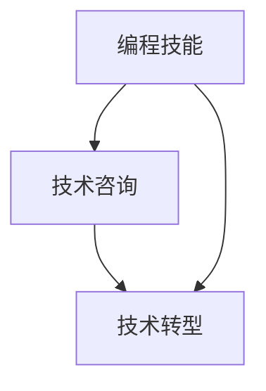

                 

# 如何将编程技能转化为咨询业务

## 1. 背景介绍

在当今技术快速发展的时代，越来越多的技术人员转向技术咨询角色，利用其深厚的编程技能和行业知识，为客户提供解决方案。如何将编程技能有效地转化为咨询业务，是许多技术人员面临的挑战。本文将探讨如何将编程技能转化为咨询业务，涵盖核心概念、算法原理、项目实践和实际应用场景等方面，希望能为技术人员提供一些参考和指导。

## 2. 核心概念与联系

### 2.1 核心概念概述

为了更好地理解如何将编程技能转化为咨询业务，我们首先需要了解几个关键概念：

- **编程技能**：指计算机编程的基础知识和实践经验，包括算法设计、代码实现、系统架构、调试优化等。
- **技术咨询**：指利用技术专业知识，为客户提供咨询、解决方案和实施支持，帮助客户解决问题或提升业务效率。
- **技术转型**：指技术人员从传统的软件开发角色转变为技术咨询角色，利用编程技能和行业知识，为客户提供更深层次的价值。

这些概念之间存在紧密联系。编程技能是技术咨询的基础，技术咨询则是编程技能的高级应用，技术转型则是连接编程技能和咨询业务的桥梁。

### 2.2 核心概念原理和架构的 Mermaid 流程图



这个流程图展示了编程技能、技术咨询和技术转型三者之间的联系和转换关系。

## 3. 核心算法原理 & 具体操作步骤

### 3.1 算法原理概述

技术咨询的核心在于解决客户问题，提高客户业务效率。将编程技能转化为咨询业务，本质上是将编程技能应用到具体的业务场景中，解决客户的实际问题。这通常涉及算法设计、系统架构、数据处理、性能优化等多个方面。

### 3.2 算法步骤详解

将编程技能转化为咨询业务的算法步骤如下：

1. **需求分析**：与客户进行深入交流，理解其业务需求和问题，明确咨询目标。
2. **问题建模**：将客户问题抽象成算法或系统模型，定义清晰的输入和输出。
3. **解决方案设计**：根据问题模型，设计合适的算法或系统架构，选择最适合的技术栈和工具。
4. **实现与测试**：根据设计方案，编写代码并实现算法或系统，进行单元测试和集成测试。
5. **性能优化**：对实现结果进行性能优化，确保算法或系统的响应速度和稳定性。
6. **部署与应用**：将算法或系统部署到生产环境中，提供持续的技术支持和优化建议。

### 3.3 算法优缺点

将编程技能转化为咨询业务的优点包括：

- **解决问题能力强**：具备编程技能的技术人员可以独立设计和实现解决方案，解决客户的问题。
- **技术深度高**：能够深入理解技术细节，提供高效、可扩展的解决方案。
- **灵活性高**：可以根据客户需求进行定制化设计和开发。

缺点包括：

- **沟通难度大**：技术术语和概念可能与客户理解不一致，需要进行有效的沟通和解释。
- **时间成本高**：从需求分析到实现部署，整个过程可能需要较长时间。
- **技术更新快**：技术栈和工具不断变化，需要持续学习和适应。

### 3.4 算法应用领域

将编程技能转化为咨询业务可以应用于多个领域，包括但不限于：

- **企业信息化建设**：帮助企业设计和管理信息系统，提升业务效率。
- **大数据分析**：利用编程技能进行数据处理和分析，提供数据驱动的决策支持。
- **人工智能应用**：开发和部署人工智能模型，提升智能化的业务应用。
- **云计算服务**：设计和管理云计算解决方案，实现云平台的高效运行。
- **网络安全**：提供网络安全咨询和解决方案，保障数据安全。

## 4. 数学模型和公式 & 详细讲解

### 4.1 数学模型构建

技术咨询的核心在于解决问题，其数学模型可以表示为：

$$
\text{解决方案} = f(\text{需求}, \text{技术}, \text{数据}, \text{环境})
$$

其中，需求、技术、数据和环境是模型的输入，解决方案是模型的输出。

### 4.2 公式推导过程

为了更具体地理解技术咨询的数学模型，我们以一个简单的例子进行推导。假设客户需要实现一个在线销售系统，需求为实时订单处理和库存管理。技术咨询的解决方案可以表示为：

$$
\text{解决方案} = \text{在线销售系统} = \text{订单处理算法} + \text{库存管理系统}
$$

其中，订单处理算法可以表示为：

$$
\text{订单处理算法} = \text{订单插入算法} \times \text{库存检查算法}
$$

库存管理系统可以表示为：

$$
\text{库存管理系统} = \text{库存更新算法} \times \text{库存预警算法}
$$

### 4.3 案例分析与讲解

以企业信息化建设为例，一个典型的技术咨询案例可以如下描述：

1. **需求分析**：企业需要建设一个ERP（企业资源计划）系统，提高生产效率和财务报表准确性。
2. **问题建模**：将ERP系统抽象为订单管理、采购管理、库存管理和财务报表管理等多个模块。
3. **解决方案设计**：采用微服务架构，使用Spring Boot和MySQL实现订单管理模块，使用Elasticsearch和Kafka实现采购和库存管理模块，使用Django实现财务报表模块。
4. **实现与测试**：开发订单管理、采购管理、库存管理和财务报表管理模块，进行单元测试和集成测试。
5. **性能优化**：对订单处理、库存检查、库存更新和财务报表计算等关键功能进行性能优化，确保系统响应速度和稳定性。
6. **部署与应用**：将ERP系统部署到企业内网，提供持续的技术支持和优化建议。

## 5. 项目实践：代码实例和详细解释说明

### 5.1 开发环境搭建

1. **安装开发环境**：安装Java JDK、Python、Git、IDE（如IntelliJ IDEA或Eclipse）等工具。
2. **搭建本地开发环境**：使用Maven或Gradle配置项目依赖，编写项目目录结构。
3. **搭建远程开发环境**：配置SSH连接和Git远程仓库，进行版本控制和协作开发。

### 5.2 源代码详细实现

以下是一个简单的在线销售系统实现的代码示例：

```java
public class OrderHandler {
    public void processOrder(Order order) {
        // 验证订单有效性
        if (!isValid(order)) {
            throw new InvalidOrderException("Invalid order");
        }
        // 更新库存
        Inventory.update(order.getProductId(), order.getQuantity());
        // 保存订单
        OrderRepository.save(order);
        // 发送通知
        NotificationService.sendNotification(order.getCustomerId(), "Order processed");
    }
}

public class Inventory {
    public static void update(String productId, int quantity) {
        // 更新数据库或缓存中的库存
        // ...
    }
}

public class OrderRepository {
    public void save(Order order) {
        // 保存订单到数据库
        // ...
    }
}

public class NotificationService {
    public void sendNotification(String customerId, String message) {
        // 发送通知到客户邮箱或手机
        // ...
    }
}
```

### 5.3 代码解读与分析

- **OrderHandler**：处理订单的核心类，负责订单的有效性验证、库存更新、订单保存和通知发送。
- **Inventory**：管理库存的类，提供更新库存的方法。
- **OrderRepository**：管理订单的数据库操作。
- **NotificationService**：发送通知的服务类。

### 5.4 运行结果展示

- **订单处理**：验证订单有效性，更新库存，保存订单，发送通知。
- **系统日志**：记录订单处理过程中的关键事件，如订单插入、库存检查、订单保存和通知发送。

## 6. 实际应用场景

### 6.1 企业信息化建设

企业信息化建设是技术咨询的一个重要领域，涉及ERP、CRM（客户关系管理）、HR（人力资源管理）等多个方面。技术人员可以通过分析企业需求，设计和管理信息系统，提升企业的业务效率和运营管理水平。

### 6.2 大数据分析

大数据分析是技术咨询的另一个重要领域，涉及数据清洗、数据处理、数据分析和数据可视化等多个环节。技术人员可以通过大数据技术，帮助客户实现数据的深度挖掘和价值提取，提供数据驱动的决策支持。

### 6.3 人工智能应用

人工智能应用是技术咨询的最新趋势，涉及机器学习、自然语言处理、计算机视觉等多个领域。技术人员可以通过开发和部署人工智能模型，提升智能化的业务应用，如智能客服、智能推荐、智能安防等。

## 7. 工具和资源推荐

### 7.1 学习资源推荐

1. **《深入理解计算机科学和软件工程》**：深入讲解计算机科学和软件工程的基础知识和设计原则，涵盖算法、数据结构、系统架构等多个方面。
2. **《软件工程：实践与原则》**：详细探讨软件工程的实践和原则，包括需求分析、设计模式、测试策略等多个环节。
3. **《技术咨询：案例分析与解决方案设计》**：提供丰富的技术咨询案例和解决方案设计方法，帮助技术人员提升咨询能力。

### 7.2 开发工具推荐

1. **IntelliJ IDEA**：功能强大的IDE，支持Java、Python等语言的开发和调试。
2. **Eclipse**：开源的IDE，支持Java、Scala等多个语言的开发和插件管理。
3. **Git**：版本控制系统，支持分布式版本控制和协作开发。
4. **Docker**：容器化技术，支持跨平台部署和管理。
5. **Kubernetes**：容器编排工具，支持大规模分布式应用的管理和调度。

### 7.3 相关论文推荐

1. **《软件开发生命周期：理论、实践与挑战》**：探讨软件开发生命周期的理论基础、实践方法和面临的挑战，提供技术咨询的指导思想。
2. **《面向业务的软件架构设计》**：讲解如何设计和实现面向业务的软件架构，提升系统的可维护性和可扩展性。
3. **《基于数据驱动的业务决策模型》**：探讨数据驱动的业务决策模型和实践方法，提供大数据分析的解决方案。

## 8. 总结：未来发展趋势与挑战

### 8.1 研究成果总结

本文介绍了如何将编程技能转化为技术咨询业务，涵盖核心概念、算法原理、项目实践和实际应用场景等方面。希望技术人员能够利用这些知识和技能，提升自身在技术咨询领域的竞争力，为客户提供高质量的解决方案。

### 8.2 未来发展趋势

未来，技术咨询领域将呈现以下趋势：

1. **云计算和大数据**：随着云计算和大数据技术的普及，越来越多的企业将转向云端，需求也将更加多样化。
2. **人工智能和机器学习**：人工智能和机器学习技术的不断进步，将为技术咨询提供更多的应用场景和解决方案。
3. **多领域融合**：技术咨询将不再局限于单个领域，而是跨领域融合，提供综合性的解决方案。

### 8.3 面临的挑战

技术咨询领域面临以下挑战：

1. **需求多样性**：不同企业的业务需求和问题各不相同，需要提供定制化的解决方案。
2. **技术更新快**：技术栈和工具的快速变化，要求技术人员持续学习和适应。
3. **项目周期长**：从需求分析到实现部署，整个过程可能需要较长时间。
4. **沟通难度大**：技术术语和概念可能与客户理解不一致，需要进行有效的沟通和解释。

### 8.4 研究展望

未来，技术咨询领域的研究方向包括：

1. **自动化与智能化**：利用AI和大数据技术，提高技术咨询的自动化和智能化水平。
2. **跨领域融合**：探索不同领域的交叉应用，提供综合性的解决方案。
3. **可扩展性与可维护性**：提高系统的可扩展性和可维护性，提升技术咨询的灵活性和适应性。

## 9. 附录：常见问题与解答

**Q1: 如何将编程技能转化为咨询业务？**

A: 将编程技能转化为咨询业务，需要理解客户需求，进行问题建模，设计解决方案，实现与测试，性能优化，部署与应用。

**Q2: 技术咨询中常见的技术栈有哪些？**

A: 常见的技术栈包括Java、Python、Spring Boot、MySQL、Elasticsearch、Kafka、Django、Scala、Kubernetes等。

**Q3: 如何进行需求分析？**

A: 需求分析通常包括以下步骤：与客户进行深入交流，理解其业务需求和问题，明确咨询目标。

**Q4: 如何设计解决方案？**

A: 设计解决方案需要考虑多个方面，包括系统架构、技术栈、数据处理、性能优化等。

**Q5: 如何应对技术咨询的挑战？**

A: 应对技术咨询的挑战需要具备跨领域知识、持续学习能力、高效沟通技巧和项目管理能力。

---

作者：禅与计算机程序设计艺术 / Zen and the Art of Computer Programming

