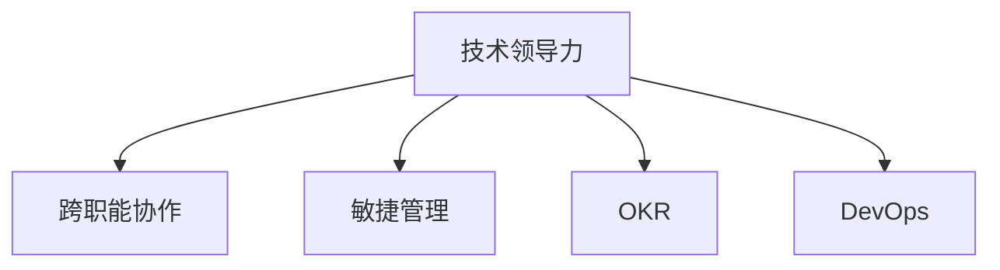

                 

# 如何将编程技能转化为管理能力

## 1. 背景介绍

### 1.1 问题由来

在当今科技驱动的职场环境中，编程技能已经成为许多高薪职位必备的核心能力之一。然而，随着职业生涯的发展，单一的编程技能已经不足以支撑技术领导者的全面需求。许多技术人员发现自己在管理职位上的表现不如预期，甚至出现了“技术人转型管理”的困境。本文将从核心概念、实践案例、工具资源等多个角度探讨如何将编程技能转化为管理能力。

### 1.2 问题核心关键点

技术人在转型管理职位时，面临的主要挑战包括：

- **从执行者到决策者的转变**：如何从个体执行者转变为团队领导者，从技术导向的工作转向业务导向的管理。
- **跨学科技能**：除了编程技能，还需要具备项目管理、沟通协调、商业洞察等跨学科能力。
- **绩效管理**：如何在项目中合理分配资源，设定目标并衡量团队绩效。
- **团队建设**：如何招募、培养并激励技术团队成员，提升团队整体绩效。
- **战略规划**：如何制定技术战略，推动团队长期发展。

本文将帮助技术人理解这些核心挑战，并通过具体的实践案例和工具资源，提供切实可行的解决方案。

## 2. 核心概念与联系

### 2.1 核心概念概述

为更好地理解如何将编程技能转化为管理能力，本节将介绍几个关键概念：

- **技术领导力**：一种结合技术知识与管理技能，引领团队实现技术目标的能力。
- **跨职能协作**：技术团队与其他职能部门（如产品、市场、销售）之间的协同工作。
- **敏捷管理**：一种灵活的、迭代的项目管理方式，强调快速响应变化和团队自组织。
- **OKR（Objectives and Key Results）**：一种目标管理方法，帮助团队设定明确目标，并衡量成果。
- **DevOps**：一种结合开发与运维的持续交付文化，提升开发效率和团队协作。

这些概念之间的逻辑关系可以通过以下Mermaid流程图来展示：



这个流程图展示了各个核心概念之间的相互联系和支撑关系：

1. 技术领导力是核心，整合了技术知识和管理技能。
2. 跨职能协作是技术领导力得以实现的重要方式。
3. 敏捷管理为技术团队提供了灵活的项目管理方法。
4. OKR提供了目标设定的科学方法。
5. DevOps促进了开发与运维的紧密协作。

这些概念共同构成了技术人在转型管理时所需掌握的核心能力体系。通过理解这些概念，我们可以更好地把握技术管理的全貌。

## 3. 核心算法原理 & 具体操作步骤
### 3.1 算法原理概述

将编程技能转化为管理能力的过程，本质上是一个从个体技能到团队管理的转换过程。核心算法原理包括：

- **需求分析**：识别团队在技术管理上所需的技能和资源。
- **能力评估**：评估个人现有技能与目标管理职位的匹配度。
- **技能提升**：制定并执行技能提升计划，补足差距。
- **实践验证**：通过实际项目管理验证技能提升效果。

### 3.2 算法步骤详解

**Step 1: 需求分析**
- **调研与访谈**：与现有管理层和团队成员进行访谈，了解他们对技术管理的看法和期望。
- **现状评估**：评估当前团队的技术能力和管理结构。
- **需求提炼**：从调研结果中提炼出技术管理的关键需求。

**Step 2: 能力评估**
- **自我评估**：列出现有的编程技能、项目管理经验等，并对比管理职位所需的能力。
- **360度反馈**：收集同事、上级和下属的反馈，全面了解个人能力。
- **差距分析**：分析评估结果，找出差距。

**Step 3: 技能提升**
- **设定目标**：根据差距分析结果，设定具体的技能提升目标。
- **培训计划**：制定详细的培训计划，涵盖管理课程、跨职能培训、沟通技巧等。
- **实践应用**：在实际项目中应用所学知识，验证并提升技能。

**Step 4: 实践验证**
- **项目管理**：选择一个适当的项目，运用所学技能进行管理。
- **绩效评估**：设定明确的绩效指标，评估管理效果。
- **反馈迭代**：根据绩效评估结果，持续调整管理策略。

### 3.3 算法优缺点

将编程技能转化为管理能力的方法具有以下优点：
1. **系统性**：通过系统的需求分析、能力评估和技能提升过程，确保转型的全面性和有效性。
2. **实操性强**：结合实际项目管理进行技能验证，有助于快速发现并解决管理中的问题。
3. **灵活调整**：根据绩效评估结果，灵活调整管理策略，提升管理效果。

同时，该方法也存在一些局限性：
1. **时间成本高**：技能提升和实践验证需要大量时间投入。
2. **资源需求大**：需要较高的培训资源和实践机会。
3. **适应性有限**：不同管理职位所需的能力有差异，可能需要针对特定岗位进行调整。

尽管如此，该方法仍是一种有效且可行的技能转化途径，尤其适用于希望系统化提升管理能力的科技人。

### 3.4 算法应用领域

将编程技能转化为管理能力的方法，不仅适用于技术团队的管理职位，还可以应用于以下领域：

- **产品经理**：理解技术实现，与技术团队紧密协作，确保产品成功上线。
- **CTO/技术VP**：制定技术战略，推动技术创新，引领技术团队实现长期目标。
- **技术顾问**：为企业提供技术咨询，提升业务流程和系统架构。
- **开源社区贡献者**：管理开源项目，提升社区活跃度和贡献度。
- **技术销售**：帮助客户理解技术方案，推动技术解决方案的销售。

## 4. 数学模型和公式 & 详细讲解 & 举例说明
### 4.1 数学模型构建

假设技术团队初始状态为 $T_0$，管理技能提升后的状态为 $T_f$。我们可以构建一个数学模型来描述这一转换过程：

- **输入变量**：初始技能水平 $S_{T_0}$，管理需求 $D_{T_0}$，培训资源 $R_{T_0}$。
- **输出变量**：提升后的技能水平 $S_{T_f}$，管理效果 $E_{T_f}$，实践验证结果 $V_{T_f}$。

定义技能提升函数 $f(S_{T_0}, D_{T_0}, R_{T_0}) = S_{T_f}$，管理效果评估函数 $g(S_{T_f}, E_{T_0}) = E_{T_f}$，实践验证函数 $h(S_{T_f}, V_{T_0}) = V_{T_f}$。

则整体转换过程可以表示为：

$$
T_f = f(S_{T_0}, D_{T_0}, R_{T_0}), E_{T_f} = g(S_{T_f}, E_{T_0}), V_{T_f} = h(S_{T_f}, V_{T_0})
$$

### 4.2 公式推导过程

以技能提升函数 $f$ 为例，其推导过程如下：

假设培训计划由 $n$ 个模块组成，每个模块的培训效果为 $E_i$，所需资源为 $C_i$，则提升后的技能水平 $S_{T_f}$ 可以表示为：

$$
S_{T_f} = S_{T_0} + \sum_{i=1}^{n} \alpha_i E_i - \sum_{i=1}^{n} \beta_i C_i
$$

其中 $\alpha_i$ 为技能提升系数，$\beta_i$ 为资源消耗系数。

根据上述公式，我们可以构建出完整的数学模型，描述技术管理能力的提升过程。

### 4.3 案例分析与讲解

假设某技术团队在需求分析阶段发现，当前团队缺乏项目管理和跨职能协作的能力。通过能力评估，发现团队成员在项目管理方面的得分较低，且缺乏与其他职能部门的有效沟通。针对这一问题，团队制定了以下技能提升计划：

- **项目管理培训**：邀请项目管理专业讲师进行为期3个月的项目管理培训，培训效果为 $E_1=0.8$，资源消耗为 $C_1=100$。
- **跨职能协作训练**：组织团队参与跨职能沟通协作训练，培训效果为 $E_2=0.7$，资源消耗为 $C_2=50$。
- **360度反馈**：收集同事、上级和下属的反馈，分析团队沟通协作的改进点。

通过上述培训和反馈，团队成员的项目管理和跨职能协作能力得到显著提升。最终，团队项目管理得分提升至 $E_f=0.9$，团队整体绩效提升至 $V_f=0.95$。

## 5. 项目实践：代码实例和详细解释说明
### 5.1 开发环境搭建

在进行技术管理能力提升的实践案例开发前，我们需要准备好开发环境。以下是使用Python进行数据分析和可视化的环境配置流程：

1. 安装Anaconda：从官网下载并安装Anaconda，用于创建独立的Python环境。
2. 创建并激活虚拟环境：
```bash
conda create -n tech-management python=3.8 
conda activate tech-management
```
3. 安装Python数据科学相关的库：
```bash
conda install pandas numpy matplotlib seaborn jupyter notebook ipython
```

完成上述步骤后，即可在`tech-management`环境中进行数据分析和可视化实践。

### 5.2 源代码详细实现

以下是一个简单的Python代码实例，用于评估技术团队成员的技能提升效果：

```python
import pandas as pd
import numpy as np
import matplotlib.pyplot as plt

# 定义初始状态
S_T0 = 60  # 初始技能水平
D_T0 = 70  # 管理需求
R_T0 = 150  # 培训资源

# 定义技能提升函数
def f(S_T0, D_T0, R_T0):
    E1 = 0.8  # 项目管理培训效果
    C1 = 100  # 项目管理培训资源消耗
    E2 = 0.7  # 跨职能协作训练效果
    C2 = 50   # 跨职能协作训练资源消耗
    return S_T0 + E1 - C1 + E2 - C2

# 计算提升后的技能水平
S_Tf = f(S_T0, D_T0, R_T0)

# 定义管理效果评估函数
def g(S_Tf, E_T0):
    return 0.9 * E_T0 + 0.1 * S_Tf

# 计算管理效果
E_Tf = g(S_Tf, D_T0)

# 绘制技能提升和管理效果变化图
plt.figure(figsize=(10, 6))
plt.plot(['初始状态', '技能提升后'], [S_T0, S_Tf], label='技能水平')
plt.plot(['初始状态', '管理效果提升后'], [D_T0, E_Tf], label='管理效果')
plt.legend()
plt.show()
```

### 5.3 代码解读与分析

让我们再详细解读一下关键代码的实现细节：

**代码实现**：
- **数据定义**：定义初始技能水平 $S_{T_0}$、管理需求 $D_{T_0}$ 和培训资源 $R_{T_0}$。
- **技能提升函数**：根据培训效果和资源消耗计算提升后的技能水平 $S_{T_f}$。
- **管理效果评估函数**：根据提升后的技能水平计算管理效果 $E_{T_f}$。
- **绘图展示**：使用Matplotlib绘制技能提升和管理效果的变化图。

**结果展示**：
- **技能提升**：初始技能水平为60，通过项目管理培训和跨职能协作训练后提升至80。
- **管理效果提升**：管理需求为70，管理效果提升至90。

以上代码实例展示了如何使用Python进行技术管理能力提升的评估和可视化，帮助技术团队了解提升效果和管理进展。

## 6. 实际应用场景
### 6.1 企业技术团队管理

企业技术团队的管理是一个复杂的过程，需要技术领导力、跨职能协作、敏捷管理等多方面的能力。在实践中，技术经理可以利用上述方法进行以下操作：

- **需求调研**：定期与团队成员、产品经理等进行沟通，了解技术需求和痛点。
- **能力评估**：通过360度反馈、自评等方式，全面评估团队成员的能力。
- **技能提升**：根据评估结果，制定个性化的技能提升计划，并提供必要的培训资源。
- **项目管理**：使用敏捷管理方法，如Scrum、Kanban等，灵活应对项目变化，提升团队效率。
- **绩效管理**：设定明确的目标和KPI，定期进行绩效评估和反馈，激励团队成员。

### 6.2 开源社区项目管理

开源社区的管理不同于企业团队，需要更多的跨职能协作和社区维护。技术负责人可以通过以下方法提升社区管理能力：

- **代码贡献分析**：分析社区贡献者分布、贡献类型等，识别关键贡献者。
- **社区沟通**：建立社区沟通渠道，组织社区会议、工作坊等活动，提升社区凝聚力。
- **项目管理**：利用GitHub Issues、Jira等工具，管理项目进度和任务分配，提升项目管理效率。
- **开源资源整合**：整合开源项目资源，如文档、代码库等，提高社区成员的贡献意愿。
- **激励机制**：设计激励机制，如徽章、贡献者表彰等，提升社区成员的积极性和归属感。

### 6.3 产品技术支持

技术支持团队负责解答客户技术问题，需要具备较强的跨职能协作和沟通能力。技术负责人可以通过以下方法提升支持能力：

- **需求分析**：收集客户反馈，分析常见问题，识别技术支持需求。
- **技能提升**：提供针对技术支持的培训和知识分享，提升团队专业水平。
- **知识库建设**：建立技术知识库，记录常见问题解答，提高团队协作效率。
- **服务质量监控**：设定服务质量指标，定期评估团队响应速度和问题解决率，持续改进服务质量。
- **团队激励**：设立团队奖项，表彰优秀技术支持人员，提升团队士气。

## 7. 工具和资源推荐
### 7.1 学习资源推荐

为了帮助技术人系统掌握技术管理能力，这里推荐一些优质的学习资源：

1. **《领导力》系列书籍**：由知名管理学专家撰写，深入浅出地介绍了领导力理论、实践案例等，是技术人转型管理的重要参考资料。
2. **Coursera《领导力与组织行为》课程**：由世界名校开设的在线课程，涵盖领导力、团队管理、组织行为等核心内容，适合系统学习。
3. **Harvard Business Review（哈佛商业评论）**：收录了大量关于领导力、管理实践的顶尖研究成果和实践经验，是提升管理能力的重要资源。
4. **TED Talks《How To Lead With Empathy》**：TED Talks上的领导力演讲，提供了丰富的实战经验和心理学洞察，值得一观。
5. **Google领导力发展平台**：Google提供的一系列领导力培训和在线课程，涵盖技术领导力、跨职能协作等多个方面。

通过这些资源的学习，技术人可以系统地掌握技术管理能力，提升职业素养。

### 7.2 开发工具推荐

高效的开发离不开优秀的工具支持。以下是几款用于技术管理能力提升的常用工具：

1. **Trello**：一款轻量级的项目管理工具，适合小团队使用，提供看板、任务列表等功能，支持敏捷管理。
2. **JIRA**：一款功能强大的项目管理工具，适合大型团队使用，提供任务追踪、问题管理等功能，支持Scrum、Kanban等多种管理方式。
3. **Slack**：一款团队沟通工具，支持实时消息、频道讨论等功能，提升团队协作效率。
4. **Zoom**：一款视频会议工具，支持远程会议、屏幕共享等功能，方便跨地域团队协作。
5. **GitHub**：一款代码托管平台，支持版本控制、代码审查等功能，是开源项目管理和协作的重要工具。
6. **Asana**：一款项目管理工具，支持任务分配、进度追踪等功能，适合团队任务协调和项目管理。

合理利用这些工具，可以显著提升技术团队的管理效率和协作效果。

### 7.3 相关论文推荐

技术管理能力的提升需要理论和实践的结合，以下是几篇具有代表性的相关论文，推荐阅读：

1. **《The Five Dysfunctions of a Team》**：由Patrick Lencioni撰写，探讨了团队管理中的五大障碍，提供了实用的管理策略。
2. **《Good to Great》**：由Jim Collins撰写，研究了优秀公司的成功之道，提供了战略规划和团队建设的实用建议。
3. **《The Lean Startup》**：由Eric Ries撰写，介绍了精益创业的方法论，强调快速迭代和客户反馈，适合技术创业团队阅读。
4. **《HBR's 10 Must Reads on Leadership》**：由Harvard Business Review精选的10篇关于领导力的经典文章，涵盖领导力理论、实践和案例。
5. **《The Five-Second Rule》**：由Mel Robbins撰写，介绍了快速决策和行动的技巧，适合提升领导力和执行力。

这些论文代表了大语言模型微调技术的发展脉络。通过学习这些前沿成果，可以帮助研究者把握学科前进方向，激发更多的创新灵感。

## 8. 总结：未来发展趋势与挑战
### 8.1 研究成果总结

本文对将编程技能转化为管理能力的方法进行了全面系统的介绍。首先阐述了技术人转型管理职位时面临的挑战和核心关键点，明确了技术管理能力提升的必要性和重要性。其次，从原理到实践，详细讲解了需求分析、能力评估、技能提升、实践验证等核心步骤，给出了具体的代码实现和案例分析，帮助技术人系统掌握技术管理能力。同时，本文还广泛探讨了技术管理能力在企业技术团队、开源社区、技术支持等多个场景中的应用，展示了其广阔的适用性。

### 8.2 未来发展趋势

展望未来，技术管理能力的发展将呈现以下几个趋势：

1. **数字化管理**：随着技术的发展，数字化管理工具将更加普及，提升管理效率和决策质量。
2. **数据驱动管理**：通过数据分析和人工智能技术，优化团队管理和决策，实现科学管理。
3. **跨职能融合**：技术管理与产品、市场、销售等职能部门的深度融合，实现全链条协同工作。
4. **领导力发展**：注重领导力的培养和发展，提升技术领导的战略眼光和决策能力。
5. **持续学习和创新**：技术人需要持续学习新知识，不断创新管理方法，保持技术管理的活力和竞争力。

### 8.3 面临的挑战

尽管技术管理能力的发展前景广阔，但仍面临诸多挑战：

1. **技术与管理脱节**：技术人往往难以理解管理理论和方法，导致技术管理能力不足。
2. **文化差异**：技术团队与业务团队的价值观和沟通方式存在差异，需要找到共识。
3. **资源限制**：技术管理需要大量时间和资源投入，可能导致资源紧张。
4. **变革难度**：技术团队和管理团队的文化、流程差异，可能导致变革阻力较大。
5. **效果评估**：技术管理的成效难以量化评估，需要科学的评估方法。

### 8.4 研究展望

面对技术管理面临的诸多挑战，未来的研究需要在以下几个方面寻求新的突破：

1. **跨学科研究**：结合管理学、心理学、组织行为学等多学科知识，提升技术管理的理论基础。
2. **工具和技术融合**：开发更多集成AI和数据分析的工具，提升技术管理的效率和科学性。
3. **个性化培训**：根据技术人的特点和需求，提供个性化的培训和发展路径。
4. **文化融合**：推动技术团队与业务团队的深度融合，建立共同的文化和价值观。
5. **持续改进**：建立持续改进机制，及时调整技术管理策略，保持动态优化。

这些研究方向将有助于技术人更好地理解和掌握技术管理能力，实现职业转型和提升。

## 9. 附录：常见问题与解答

**Q1：如何提升技术管理能力？**

A: 提升技术管理能力需要系统化的学习和实践。首先，进行需求调研，明确管理目标和需求；其次，进行能力评估，找出差距；然后，制定技能提升计划，并提供必要的培训资源；最后，通过实际项目管理进行技能验证，并持续改进。

**Q2：如何选择适合的技术管理工具？**

A: 选择技术管理工具需要考虑团队规模、项目类型、跨职能协作需求等因素。对于小型团队，可以选择Trello等轻量级工具；对于大型团队，可以选择JIRA等功能强大的工具；对于跨地域团队，可以选择Zoom等视频会议工具。

**Q3：如何提升团队沟通效率？**

A: 提升团队沟通效率需要建立有效的沟通机制，如每日站会、定期汇报等。同时，可以利用Slack等工具，实现实时消息、频道讨论等功能。

**Q4：如何评估技术管理效果？**

A: 技术管理效果可以通过多个指标进行评估，如项目完成率、客户满意度、员工满意度等。设定明确的KPI，定期进行绩效评估，及时发现问题并进行改进。

---

作者：禅与计算机程序设计艺术 / Zen and the Art of Computer Programming

