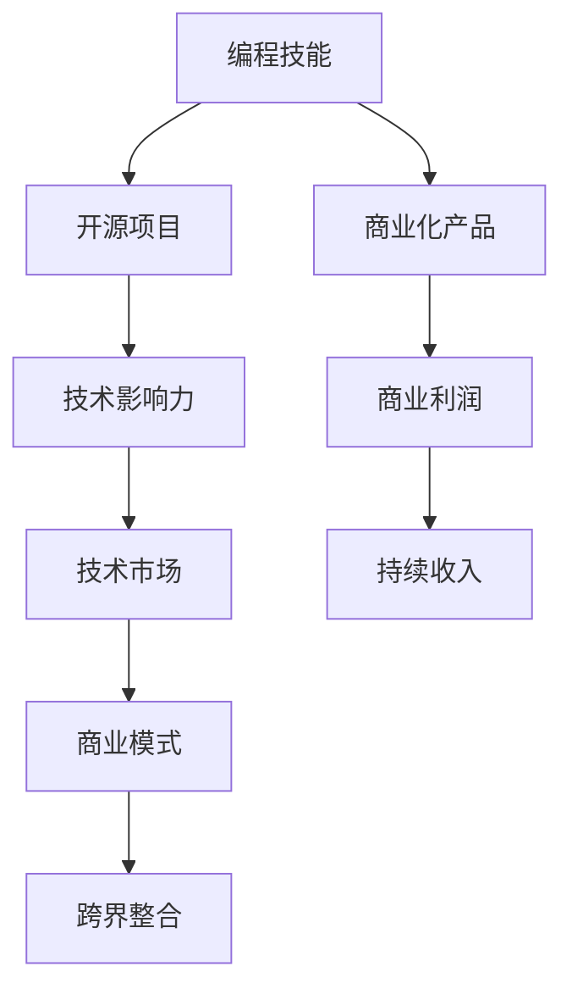

                 

## 1. 背景介绍

随着技术的发展和社会的进步，互联网+技术已经成为各行各业的基础设施，尤其是软件开发，正在从IT部门的边缘逐步走向核心，不仅改变了企业的工作模式，还提供了巨大的商业机会。这为技术人提供了将编程技能转化为被动收入的多种可能。

## 2. 核心概念与联系

### 2.1 核心概念概述

本文将从以下几个核心概念入手，理解如何将编程技能转化为被动收入：

1. **编程技能**：包括但不限于编程语言、框架、架构设计、算法等。
2. **被动收入**：基于前期工作或资产投入产生的持续收入，例如技术咨询、软件产品销售、版权收入等。
3. **开源与商业化**：开源项目可以积累技术影响力，商业化产品则可以实现利润最大化。
4. **数据与算法**：利用数据进行算法优化，构建有价值的数据模型。
5. **自动化与智能化**：通过编程实现自动化流程，提升生产效率，或利用AI进行智能化决策。
6. **商业分析与模式创新**：结合商业知识，创新商业模式，实现跨界整合。

### 2.2 核心概念原理和架构的 Mermaid 流程图



## 3. 核心算法原理 & 具体操作步骤

### 3.1 算法原理概述

将编程技能转化为被动收入的基本原理是，通过前期的技术积累和商业运作，创造具有商业价值的技术产品或服务，并通过持续运营获得持续的收入。这涉及到技术产品开发、市场推广、运营管理等多个方面。

### 3.2 算法步骤详解

1. **技术积累与开发**
   - 识别自己的技术专长和市场需求。
   - 选择合适的技术栈和开发工具。
   - 明确技术产品的目标用户和价值。
   - 进行产品设计和原型开发。

2. **市场推广与运营**
   - 建立品牌和市场渠道。
   - 进行产品营销和用户教育。
   - 收集用户反馈和市场数据。
   - 进行产品迭代和优化。

3. **持续收入**
   - 建立订阅模式或增值服务。
   - 通过广告、赞助等方式实现间接收入。
   - 考虑跨界整合，拓展新的业务领域。

### 3.3 算法优缺点

**优点**：
- 前期投入和风险较小。
- 技术作为核心竞争力，降低了市场竞争门槛。
- 有助于建立专业信誉和品牌影响力。

**缺点**：
- 投入周期较长，回报较慢。
- 需要较强的市场敏锐度和运营能力。
- 风险点较多，如市场需求变化、技术迭代等。

### 3.4 算法应用领域

被动收入的实现可以在多个领域进行应用，例如：
- 开源项目：提供开源技术，积累技术社区影响力。
- 商业化产品：将技术转化为产品，实现商业价值。
- 技术咨询：利用技术专业性，为客户提供定制化解决方案。
- 数据与算法：提供数据驱动的算法优化服务。
- 自动化与智能化：实现企业流程自动化，提升效率。
- 商业分析与模式创新：通过技术分析，创新商业模式，提供定制化服务。

## 4. 数学模型和公式 & 详细讲解 & 举例说明

### 4.1 数学模型构建

本文主要讨论了将编程技能转化为被动收入的数学模型，其中最重要的部分是需求-供给模型：

- 设市场需求为 \( D \)，供给为 \( S \)。
- 设技术产品的价格为 \( P \)，数量(销量)为 \( Q \)。
- 需求函数为 \( D(Q) = a - bP \)，供给函数为 \( S(Q) = c + dP \)。

其中 \( a, b, c, d \) 为常数。

### 4.2 公式推导过程

1. 根据需求函数和供给函数，求解市场均衡价格和数量。
   - 市场需求等于供给时，市场均衡。
   - \( D(Q) = S(Q) \) 即 \( a - bP = c + dP \)。

2. 解得均衡价格 \( P = \frac{a - c}{b + d} \)，均衡数量 \( Q = \frac{a - c}{b + d} \)。

3. 市场均衡时，需求曲线和供给曲线相交于 \( (Q, P) \)。

### 4.3 案例分析与讲解

**案例1：开源社区的运作**
- 提供开源代码，吸引开发者社区。
- 建立技术标准和认证体系。
- 通过广告、赞助、培训等方式实现收入。

**案例2：商业化产品的市场推广**
- 确定目标用户，进行市场调研。
- 制定推广计划，进行市场教育。
- 通过市场反馈进行产品迭代和优化。
- 实现订阅模式或增值服务。

## 5. 项目实践：代码实例和详细解释说明

### 5.1 开发环境搭建

1. **开发工具**：
   - IDE：如 VS Code、IntelliJ IDEA。
   - 版本控制系统：如 Git。
   - 数据库系统：如 MySQL、MongoDB。
   - 云服务：如 AWS、Azure、Google Cloud。

2. **开发环境配置**：
   - 安装 Python、Java、Node.js 等常用语言。
   - 配置开发环境，如设置 PATH、环境变量。
   - 搭建开发工具，如 VS Code 扩展、插件。

3. **项目管理**：
   - 使用敏捷管理工具：如 JIRA、Trello。
   - 使用代码仓库管理：如 GitHub。

### 5.2 源代码详细实现

**源代码示例：简单的 Python Flask Web 应用**

```python
from flask import Flask, jsonify

app = Flask(__name__)

@app.route('/')
def hello_world():
    return jsonify({"message": "Hello, World!"})

if __name__ == '__main__':
    app.run(host='0.0.0.0', port=8080)
```

### 5.3 代码解读与分析

**Flask Web 应用分析**：
- Flask 是一个轻量级的 Python Web 应用框架，支持动态网页、API 开发等。
- 该示例创建了一个简单的 Flask Web 应用，提供了一个 `/hello` 的路由，返回一个 JSON 格式的字符串。
- 使用 `if __name__ == '__main__':` 判断运行环境，确保应用在开发时能够启动。
- 运行 `app.run()` 启动 Web 应用，监听本地的 8080 端口。

### 5.4 运行结果展示

在命令行中执行 `python app.py`，打开浏览器，访问 `http://localhost:8080`，应该能够看到 `{ "message": "Hello, World!" }` 的 JSON 输出。

## 6. 实际应用场景

### 6.1 开源社区的商业化运作

开源项目可以通过建立商业化模型，实现被动收入。例如，GitHub 上的许多开源项目，通过商业化许可证或订阅模式，实现稳定收入。例如，Red Hat 通过其 OpenShift 平台提供云服务和开源社区支持，实现商业收入。

### 6.2 商业化产品的市场推广

商业化产品可以通过多种渠道实现市场推广和运营，从而获得持续收入。例如，AWS 的云服务，通过广告、订阅、支持等多种方式实现持续收入。

### 6.3 技术咨询和解决方案

技术咨询可以通过提供定制化的技术方案，实现被动收入。例如，Deloitte 提供商业咨询和技术解决方案，帮助企业实现数字化转型，实现稳定收入。

### 6.4 数据与算法服务

数据与算法服务可以通过提供数据驱动的解决方案，实现被动收入。例如，Google Cloud 提供数据分析和机器学习服务，通过算法优化和数据驱动决策，实现收入。

## 7. 工具和资源推荐

### 7.1 学习资源推荐

1. **在线课程**：
   - Coursera：涵盖多个领域的课程，如计算机科学、数据科学。
   - Udemy：提供多门编程和商业化课程，如 Python 开发、商业分析。

2. **开源社区**：
   - GitHub：提供大量开源项目和技术资源。
   - Stack Overflow：开发者问答社区，提供技术交流和问题解答。

3. **技术博客和社区**：
   - Medium：提供技术文章和社区讨论。
   - Hacker News：技术新闻和开发者社区。

### 7.2 开发工具推荐

1. **开发工具**：
   - IDE：如 VS Code、IntelliJ IDEA。
   - 版本控制系统：如 Git。
   - 数据库系统：如 MySQL、MongoDB。
   - 云服务：如 AWS、Azure、Google Cloud。

2. **协作工具**：
   - 项目管理：如 JIRA、Trello。
   - 代码仓库管理：如 GitHub。

### 7.3 相关论文推荐

1. **技术开发**：
   - "Effective Object-Oriented Programming" by Robert C. Martin。
   - "Clean Code: A Handbook of Agile Software Craftsmanship" by Robert C. Martin。

2. **商业化**：
   - "The Lean Startup" by Eric Ries。
   - "Zero to One: Notes on Startups, or How to Build the Future" by Peter Thiel。

## 8. 总结：未来发展趋势与挑战

### 8.1 研究成果总结

本文从技术开发、市场推广和持续收入三个方面，探讨了将编程技能转化为被动收入的多种可能。未来，技术人可以通过开源项目、商业化产品、技术咨询、数据与算法服务等多种方式，实现被动收入，提升生活质量。

### 8.2 未来发展趋势

1. **开源与商业化融合**：开源项目将更多地与商业化结合，形成双赢局面。
2. **自动化与智能化**：自动化和智能化技术将更多地应用于商业领域，提升效率。
3. **数据驱动决策**：数据驱动决策将成为主流，提供更精准的解决方案。
4. **跨界整合**：技术将更多地与其他行业整合，实现跨界创新。

### 8.3 面临的挑战

1. **技术迭代的挑战**：技术更新快，需要持续学习和跟进。
2. **市场需求的变化**：市场趋势多变，需要敏锐的市场洞察力。
3. **运营管理的复杂性**：运营管理涉及多个环节，需要系统化的管理。
4. **商业模式的创新**：需要不断创新商业模式，适应市场变化。

### 8.4 研究展望

未来，技术人需要关注以下几个方面：
1. **跨界整合**：技术人可以通过跨界整合，拓展新的业务领域，实现新的增长点。
2. **自动化与智能化**：自动化和智能化技术将更多地应用于商业领域，提升效率。
3. **数据驱动决策**：数据驱动决策将成为主流，提供更精准的解决方案。
4. **开源社区的商业化**：开源项目将更多地与商业化结合，形成双赢局面。

总之，通过技术积累和市场运作，编程技能可以转化为多种形式的被动收入，为技术人带来丰富的职业选择和发展机会。技术人需要不断学习和创新，才能在未来的技术变革中保持竞争力。

## 9. 附录：常见问题与解答

**Q1：编程技能如何转化为被动收入？**

A: 编程技能可以通过开源项目、商业化产品、技术咨询、数据与算法服务等方式，转化为被动收入。

**Q2：开发环境如何搭建？**

A: 开发环境需要选择合适的 IDE、版本控制系统、数据库系统等工具，并进行配置和管理。

**Q3：如何实现市场推广和运营？**

A: 建立品牌和市场渠道，进行产品营销和用户教育，收集用户反馈和市场数据，进行产品迭代和优化。

**Q4：如何实现持续收入？**

A: 通过订阅模式或增值服务，通过广告、赞助等方式实现间接收入，考虑跨界整合，拓展新的业务领域。

**Q5：如何应对技术迭代的挑战？**

A: 持续学习和跟进最新的技术趋势，参与社区交流和开源项目，保持技术领先性。

---

作者：禅与计算机程序设计艺术 / Zen and the Art of Computer Programming

