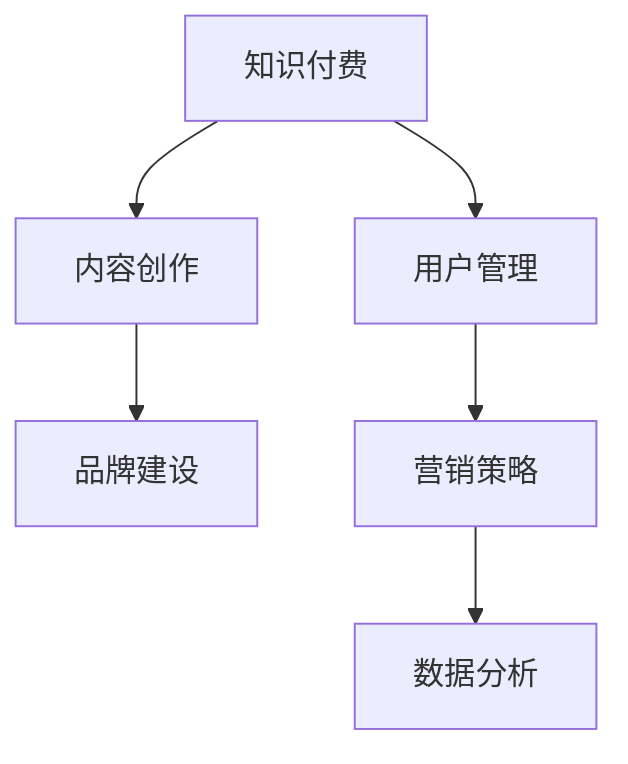

                 

# 如何打造个人知识付费品牌

> 关键词：知识付费,内容创作,品牌建设,用户管理,营销策略,数据分析

## 1. 背景介绍

### 1.1 问题由来
随着互联网的普及和信息爆炸，传统的“一刀切”教育方式已经不能满足用户个性化的学习需求。知识付费作为一种新兴的教育方式，通过提供系统化、定制化的学习内容，满足了用户对专业知识的渴望，并获得了广泛的市场认可。

与此同时，个人知识付费品牌也逐渐成为知识付费领域的重要力量，与机构品牌相比，个人品牌具有更高的亲和力和更灵活的内容形式，能够更好地吸引和留存用户。个人品牌建设已经成为互联网时代企业及个体实现知识变现的重要路径。

### 1.2 问题核心关键点
个人知识付费品牌的成功构建，需要在内容质量、用户管理、营销策略、数据分析等多个方面进行精细化运营。本文将详细介绍构建个人知识付费品牌的核心策略，并从理论与实践的角度进行深入剖析。

## 2. 核心概念与联系

### 2.1 核心概念概述

为更好地理解个人知识付费品牌构建的方法，本节将介绍几个密切相关的核心概念：

- **知识付费**：指用户通过支付一定费用，获取特定知识或技能的服务形式。随着人们对高质量教育资源的渴求不断增长，知识付费市场正在快速发展。
- **内容创作**：指个人或机构创作满足用户学习需求的知识内容的整个过程，包括选题、策划、撰写、编辑、设计等环节。高质量的内容创作是知识付费成功的基石。
- **品牌建设**：指通过品牌宣传、用户体验、服务质量等多方面努力，提升品牌知名度和美誉度，从而在市场竞争中脱颖而出。
- **用户管理**：指通过精准定位、个性化推荐、用户反馈等多渠道，提升用户体验，增强用户粘性，实现用户留存和转化。
- **营销策略**：指通过多元化营销手段，提升个人品牌和课程的曝光率，吸引潜在用户，实现快速变现。
- **数据分析**：指通过数据采集、分析和应用，实现个性化推荐、市场预测、运营优化等，为品牌运营提供决策支持。

这些核心概念之间的逻辑关系可以通过以下Mermaid流程图来展示：



这个流程图展示了个知识付费品牌构建的核心概念及其之间的关系：

1. 知识付费为品牌提供价值支撑。
2. 内容创作是品牌的基石，影响着品牌的长久发展。
3. 品牌建设决定品牌影响力，直接关乎用户转化率和收益。
4. 用户管理提升用户体验，增加用户粘性和重复购买率。
5. 营销策略提升品牌曝光率，吸引更多潜在用户。
6. 数据分析指导运营决策，提升运营效率和用户满意度。

## 3. 核心算法原理 & 具体操作步骤
### 3.1 算法原理概述

个人知识付费品牌的构建，本质上是一个多维度的综合优化过程。其核心思想是：通过高质量内容创作、精准用户定位、有效营销推广、持续数据分析等多方面努力，最大化品牌价值和用户满意度，从而实现知识变现。

形式化地，假设品牌目标是最大化品牌价值 $V$，则最优品牌策略 $S^*$ 应满足：

$$
S^* = \mathop{\arg\max}_{S} V(S)
$$

其中 $S$ 为品牌策略，包括内容质量、用户管理、营销策略等多个维度。

### 3.2 算法步骤详解

个人知识付费品牌的构建一般包括以下几个关键步骤：

**Step 1: 内容策划与创作**

1. **选题调研**：通过市场调研、数据分析等方式，确定用户需求旺盛的领域和话题，如编程、设计、心理学等。
2. **内容策划**：根据选题，设计内容框架和结构，如文章结构、视频脚本等。
3. **内容创作**：结合自身专业知识，进行高质量内容的撰写或制作，如文章撰写、视频录制、PPT设计等。
4. **内容优化**：通过审稿、编辑、校对等方式，提升内容质量，确保内容专业性和可读性。

**Step 2: 品牌宣传与推广**

1. **品牌定位**：根据内容特性和目标用户，确定品牌定位，如“编程专家”、“设计大咖”、“心理导师”等。
2. **品牌塑造**：设计独特的品牌标志、口号、口号等，并通过官网、社交媒体等渠道进行传播。
3. **内容分发**：通过微信公众号、知乎、B站、视频号等渠道发布内容，提升品牌曝光率。
4. **用户互动**：通过评论区、问答平台等方式，与用户互动，提升品牌亲和力和用户粘性。

**Step 3: 用户管理与留存**

1. **精准定位**：通过数据分析，确定目标用户群体的特征和需求，如年龄、职业、学习目标等。
2. **个性化推荐**：根据用户历史行为和兴趣，进行个性化内容推荐，提升用户满意度。
3. **用户反馈**：收集用户反馈，改进内容和服务，增强用户粘性。
4. **会员体系**：设计会员体系，通过增值服务、专属课程等方式，提升用户转化率和生命周期价值。

**Step 4: 数据分析与优化**

1. **数据采集**：通过统计分析工具，采集用户行为数据，如浏览时间、购买记录、评价反馈等。
2. **数据建模**：通过数据建模和机器学习，分析用户行为规律，预测市场趋势。
3. **运营优化**：根据数据分析结果，优化内容策略、营销策略等，提升运营效率。
4. **风险预警**：通过异常检测和风险评估，及时发现和应对潜在问题，保障品牌稳定运营。

### 3.3 算法优缺点

个人知识付费品牌构建的优势包括：
1. 灵活性强。个人品牌比机构品牌更加灵活，能快速响应市场变化。
2. 用户粘性高。通过个性化服务和互动，提升用户粘性，增加用户转化率。
3. 收益更加可控。品牌所有者能直接控制内容和变现策略，实现精准盈利。
4. 个性化内容多样。个人品牌能够提供更加丰富、个性化的内容形式，满足用户多样化需求。

劣势方面，个人知识付费品牌也存在以下问题：
1. 资源有限。个人品牌在内容创作、品牌推广、用户管理等方面资源有限。
2. 抗风险能力差。个人品牌相对脆弱，一旦失去核心人物，品牌可能会受到严重影响。
3. 市场竞争力有限。在激烈的市场竞争中，个人品牌可能难以与大型机构品牌抗衡。
4. 品牌传播难度大。缺乏大机构品牌的影响力和传播渠道，品牌曝光率较低。

尽管存在这些局限性，但个人知识付费品牌仍是一种极具潜力的商业模式，只要运营得当，能够在特定领域中实现快速变现和品牌价值提升。

### 3.4 算法应用领域

个人知识付费品牌的应用领域广泛，几乎涵盖所有知识类服务行业。以下是几个典型的应用场景：

- **编程教育**：如CSDN博客、知乎专栏、GitHub等，通过提供编程技巧、项目实战等专业内容，吸引编程爱好者和职业开发者。
- **设计培训**：如Behance、设计类平台、站酷等，通过设计作品展示和教程分享，吸引设计师和设计爱好者。
- **心理辅导**：如心灵猫、谈心空间等，通过心理咨询、情感分析等内容，帮助用户解决问题，提升心理健康。
- **教育培训**：如腾讯课堂、网易云课堂、网易公开课等，通过视频课程、电子书等形式，提供系统化学习内容，帮助用户提升职业技能。
- **生活提升**：如得到、罗辑思维等，通过文化、生活、健康等内容，帮助用户提升生活品质和认知水平。

此外，个人知识付费品牌也广泛应用于企业培训、在线咨询、远程教学等多个领域，为知识传播和变现提供了新的途径。

## 4. 数学模型和公式 & 详细讲解  
### 4.1 数学模型构建

本节将使用数学语言对个人知识付费品牌的构建过程进行更加严格的刻画。

记品牌价值为 $V$，包含内容价值 $C$、品牌影响力 $B$、用户满意度 $U$ 等组成部分，其数学模型如下：

$$
V = C + B + U
$$

其中 $C = C_1 + C_2 + \cdots + C_n$，$B = B_1 + B_2 + \cdots + B_m$，$U = U_1 + U_2 + \cdots + U_p$。

各组成部分的关系可通过下式表示：

$$
C = f_1(C_1, C_2, \cdots, C_n) \\
B = f_2(B_1, B_2, \cdots, B_m) \\
U = f_3(U_1, U_2, \cdots, U_p)
$$

$f_1$、$f_2$、$f_3$ 为相关函数，如内容创作、品牌建设、用户管理等。

### 4.2 公式推导过程

以内容创作部分为例，进行详细公式推导。

设内容创作过程分为 $k$ 个步骤，每个步骤的评分分别为 $c_i$，则内容创作的总评分 $C$ 为：

$$
C = \sum_{i=1}^{k} c_i
$$

其中 $c_i$ 为第 $i$ 个步骤的评分，可通过专家评估、用户评价等方式获取。

在进行内容创作时，需考虑以下因素：

1. **选题与调研**：假设选题与调研的评分分别为 $c_{i_1}, c_{i_2}$，则总评分 $C_{i_1} = c_{i_1} + c_{i_2}$。
2. **内容策划**：假设内容策划的评分为 $c_{i_3}$，则总评分 $C_{i_3} = c_{i_3}$。
3. **内容创作**：假设内容创作的评分为 $c_{i_4}$，则总评分 $C_{i_4} = c_{i_4}$。
4. **内容优化**：假设内容优化的评分为 $c_{i_5}$，则总评分 $C_{i_5} = c_{i_5}$。

将这些评分相加，可得内容创作总评分 $C$：

$$
C = C_{i_1} + C_{i_3} + C_{i_4} + C_{i_5}
$$

通过上述模型和公式，可计算出品牌价值的各组成部分，指导品牌运营。

## 5. 项目实践：代码实例和详细解释说明
### 5.1 开发环境搭建

在进行品牌建设实践前，我们需要准备好开发环境。以下是使用Python进行Django开发的环境配置流程：

1. 安装Anaconda：从官网下载并安装Anaconda，用于创建独立的Python环境。

2. 创建并激活虚拟环境：
```bash
conda create -n django-env python=3.8 
conda activate django-env
```

3. 安装Django：根据CUDA版本，从官网获取对应的安装命令。例如：
```bash
pip install django
```

4. 安装必要的依赖包：
```bash
pip install psycopg2-binary django-crispy-forms django-ckeditor django-graphene
```

5. 安装各类工具包：
```bash
pip install numpy pandas scikit-learn matplotlib tqdm jupyter notebook ipython
```

完成上述步骤后，即可在`django-env`环境中开始品牌建设实践。

### 5.2 源代码详细实现

下面我们以一个简单的博客平台为例，给出使用Django进行品牌建设的基本代码实现。

首先，定义Django项目并创建博客应用：

```bash
django-admin startproject blogsite
cd blogsite
python manage.py startapp blog
```

然后，定义博客应用的模型和视图：

```python
# models.py
from django.db import models
from django.contrib.auth.models import User

class Post(models.Model):
    title = models.CharField(max_length=200)
    content = models.TextField()
    author = models.ForeignKey(User, on_delete=models.CASCADE)
    created_at = models.DateTimeField(auto_now_add=True)
    updated_at = models.DateTimeField(auto_now=True)
    
    def __str__(self):
        return self.title

# views.py
from django.shortcuts import render
from django.http import HttpResponse
from .models import Post

def home(request):
    posts = Post.objects.all().order_by('-created_at')
    return render(request, 'blog/home.html', {'posts': posts})
```

接着，定义博客应用的前端页面和样式：

```html
<!-- home.html -->
<html>
    <head>
        <title>My Blog</title>
        <link rel="stylesheet" href="">
    </head>
    <body>
        <h1>Welcome to My Blog</h1>
        <ul>
            
                <li><a href="">{{ post.title }}</a></li>
            
        </ul>
    </body>
</html>
```

最后，启动Django开发服务器，并测试博客应用：

```bash
python manage.py runserver
```

打开浏览器，访问`http://127.0.0.1:8000/`，即可看到简单的博客页面。

### 5.3 代码解读与分析

让我们再详细解读一下关键代码的实现细节：

**models.py**：
- 定义了一个简单的Post模型，包含标题、内容、作者和创建时间等字段。
- 使用Django的内置User模型关联用户，确保每个博文都有明确的作者。

**views.py**：
- 定义了home视图，通过Post模型查询最新的博文，并渲染到页面中。
- 使用模板语法渲染页面，将查询结果传递给前端。

**home.html**：
- 定义了一个简单的HTML页面，通过模板语法渲染博文标题链接。

可以看到，Django提供了灵活的页面和模型管理系统，能够快速搭建和管理博客平台。开发者可以在此基础上，进一步添加登录、注册、评论、分类等功能，满足品牌运营的更多需求。

## 6. 实际应用场景
### 6.1 电商平台的知识付费
电商平台如京东、天猫等，通过与知名博主、专家合作，提供商品评测、使用技巧等内容，吸引用户关注和购买。这些内容不仅能提升用户购买体验，还能增加品牌的信任度和美誉度，形成良性循环。

**应用场景**：
- 京东商场：京东与刘强东、张勇等知名电商大佬合作，提供电商运营技巧、市场趋势分析等深度内容，吸引电商从业者和爱好者关注。
- 天猫精灵：天猫与知名天猫卖家合作，提供天猫店铺运营、市场推广等实用内容，提升店铺影响力。

**技术实现**：
- 电商数据分析：通过电商平台的数据分析工具，获取用户行为数据，确定用户兴趣和需求。
- 内容创作与分发：邀请知名博主、专家创作内容，并通过电商平台推广，吸引更多用户关注。
- 个性化推荐：根据用户浏览记录和购买行为，进行个性化推荐，提升用户体验和品牌粘性。

**效果评估**：
- 品牌曝光率：通过网站流量、访问量等数据，评估品牌曝光率。
- 用户转化率：通过用户购买行为、付费转化率等数据，评估用户转化效果。
- 用户满意度：通过用户评论、满意度调查等数据，评估用户满意度。

### 6.2 教育培训的在线课程
教育培训机构如Coursera、Udemy等，通过提供专业课程、案例分析等内容，吸引学生和从业者学习。这些内容不仅能提升用户的知识水平，还能增加机构的品牌影响力，形成品牌认知。

**应用场景**：
- Coursera：Coursera与斯坦福大学、麻省理工学院等知名高校合作，提供专业课程，如机器学习、计算机科学等，吸引学生注册和付费。
- Udemy：Udemy与编程专家、产品经理等合作，提供实战课程，如Python、项目管理等，吸引学生学习。

**技术实现**：
- 课程数据分析：通过在线学习平台的数据分析工具，获取用户行为数据，确定用户兴趣和需求。
- 内容创作与分发：邀请知名讲师、专家创作内容，并通过平台推广，吸引更多用户注册和学习。
- 个性化推荐：根据用户学习记录和评价反馈，进行个性化推荐，提升用户体验和课程满意度。

**效果评估**：
- 用户注册率：通过平台注册用户数量，评估课程吸引力。
- 课程完成率：通过课程完成率等数据，评估课程学习效果。
- 用户满意度：通过用户评价、满意度调查等数据，评估用户满意度。

### 6.3 设计行业的知识分享
设计行业如Behance、站酷等，通过提供设计作品展示、设计教程等内容，吸引设计师和设计爱好者。这些内容不仅能提升设计师的创作水平，还能增加平台的品牌影响力，形成品牌认知。

**应用场景**：
- Behance：Behance与知名设计师、设计公司合作，提供设计作品展示和教程分享，吸引设计师和设计爱好者。
- 站酷：站酷与知名设计师、设计工作室合作，提供设计案例分析、设计工具教程等内容，吸引设计师关注。

**技术实现**：
- 设计数据分析：通过平台的数据分析工具，获取用户行为数据，确定用户兴趣和需求。
- 内容创作与分发：邀请知名设计师、工作室创作内容，并通过平台推广，吸引更多用户关注。
- 个性化推荐：根据用户浏览记录和评价反馈，进行个性化推荐，提升用户体验和平台粘性。

**效果评估**：
- 用户注册率：通过平台注册用户数量，评估平台吸引力。
- 内容互动率：通过用户评论、点赞等数据，评估内容互动效果。
- 用户满意度：通过用户评价、满意度调查等数据，评估用户满意度。

## 7. 工具和资源推荐
### 7.1 学习资源推荐

为了帮助开发者系统掌握个人知识付费品牌的构建方法，这里推荐一些优质的学习资源：

1. **《内容营销的艺术》**：这本书详细介绍了内容创作、品牌建设、用户管理等多个方面的具体策略，适合各个阶段的内容创作者阅读。
2. **《知识付费的运营之道》**：这本书通过实战案例，剖析了知识付费平台的运营策略，提供了丰富的实践经验。
3. **《个人品牌打造手册》**：这本书通过深入浅出的方式，介绍了个人品牌的定位、建设、运营等关键环节，适合各个阶段的内容创作者阅读。
4. **Coursera《数字营销》课程**：由知名营销专家主讲，涵盖内容营销、社交媒体、数据分析等多个方面，适合学习者全面了解知识付费品牌的运营。
5. **Udemy《内容营销实战》课程**：由实战专家主讲，通过具体案例和实战操作，指导内容创作者掌握品牌建设、用户管理、数据分析等多个方面的技能。

通过对这些资源的学习实践，相信你一定能够快速掌握个人知识付费品牌的构建方法，并用于解决实际的品牌运营问题。

### 7.2 开发工具推荐

高效的开发离不开优秀的工具支持。以下是几款用于个人知识付费品牌开发的常用工具：

1. **Django**：基于Python的开源Web框架，灵活、安全，适合快速搭建和管理网站平台。
2. **WordPress**：全球最流行的博客平台，通过插件扩展功能，支持大量用户和内容管理。
3. **Markdown**：轻量级标记语言，适合编写简洁、易读的文章和文档，易于版本控制和内容分发。
4. **GitHub**：全球最大的代码托管平台，支持代码版本控制、协作开发等功能，适合存储和分发代码。
5. **Zendesk**：全球领先的客户服务管理平台，支持工单管理、用户互动、数据分析等功能，适合构建客户支持和用户管理平台。

合理利用这些工具，可以显著提升个人知识付费品牌的开发效率，加快创新迭代的步伐。

### 7.3 相关论文推荐

个人知识付费品牌的研究源于学界的持续研究。以下是几篇奠基性的相关论文，推荐阅读：

1. **《内容驱动的社交媒体营销研究》**：详细研究了内容创作、用户互动、品牌建设等多个方面的具体策略，为内容创作者提供了丰富的理论支持。
2. **《知识付费平台的用户行为分析与预测》**：通过大数据分析技术，研究了知识付费平台的用户行为规律和预测方法，为平台运营提供了数据支持。
3. **《知识付费用户满意度调查与分析》**：通过问卷调查和数据分析，评估了知识付费用户满意度的影响因素，为品牌运营提供了重要参考。

这些论文代表了个知识付费品牌构建的研究进展，通过学习这些前沿成果，可以帮助内容创作者掌握品牌运营的核心技巧，提升品牌价值。

## 8. 总结：未来发展趋势与挑战
### 8.1 总结

本文对个人知识付费品牌的构建方法进行了全面系统的介绍。首先阐述了知识付费的重要性和个人品牌建设的必要性，明确了品牌运营的多维度目标和任务。其次，从内容创作、品牌建设、用户管理、营销策略等多个方面，详细讲解了品牌构建的核心步骤，给出了具体的实现方法。同时，本文还广泛探讨了品牌在电商、教育、设计等多个行业领域的应用前景，展示了品牌运营的巨大潜力。此外，本文精选了品牌运营的各类学习资源，力求为读者提供全方位的技术指引。

通过本文的系统梳理，可以看到，个人知识付费品牌构建需要内容创作、品牌建设、用户管理等多方面协同努力，通过高质量的内容、精准的用户定位、有效的营销推广，最大化品牌价值和用户满意度，实现知识变现。未来，伴随技术进步和市场需求的变化，个人知识付费品牌将不断创新，拓展应用范围，为知识传播和变现提供新的动力。

### 8.2 未来发展趋势

展望未来，个人知识付费品牌的发展趋势如下：

1. **内容多样化**：随着市场对多样化内容的渴求，个人品牌将进一步细分领域，提供更加丰富、专业的内容形式。
2. **数据驱动运营**：通过大数据分析技术，实时监测用户行为，预测市场趋势，进行精准运营。
3. **多渠道分发**：通过多元化渠道，如视频平台、社交媒体、播客等，扩大品牌曝光率，提升用户覆盖率。
4. **用户互动加强**：通过社区建设、实时问答等方式，增强用户互动，提升品牌亲和力和用户粘性。
5. **国际化拓展**：通过语言翻译和本地化运营，拓展海外市场，提升品牌影响力。

这些趋势凸显了个人知识付费品牌的广阔前景，只有在内容、运营、推广等多个方面持续优化，才能不断提升品牌价值和用户满意度，实现可持续的发展。

### 8.3 面临的挑战

尽管个人知识付费品牌的发展前景广阔，但在实践中仍面临诸多挑战：

1. **资源限制**：个人品牌在内容创作、品牌推广、用户管理等方面资源有限，难以与大型机构品牌抗衡。
2. **市场竞争激烈**：随着越来越多的个人和机构加入知识付费领域，品牌间的竞争日益激烈，如何保持竞争优势是关键。
3. **用户需求变化快**：用户需求和兴趣不断变化，品牌需要持续创新，才能跟上市场节奏。
4. **用户粘性难保持**：用户流失率高，品牌需要不断提供优质内容和优质服务，才能保持用户粘性。
5. **品牌形象维护**：品牌形象一旦受损，可能面临重大危机，品牌需要持续维护和优化。

正视品牌面临的这些挑战，积极应对并寻求突破，将是大品牌建设迈向成熟的重要保障。相信通过学界和产业界的共同努力，这些挑战终将一一克服，个人知识付费品牌必将在构建人机协同的智能时代中扮演越来越重要的角色。

### 8.4 研究展望

面对个人知识付费品牌所面临的种种挑战，未来的研究需要在以下几个方面寻求新的突破：

1. **内容自动化生产**：开发内容生成和编辑工具，提高内容创作效率和质量。
2. **品牌个性化运营**：通过智能推荐、个性化内容等方式，提升品牌运营效率和用户满意度。
3. **多渠道协同推广**：通过多渠道协同推广，扩大品牌曝光率，提升用户覆盖率。
4. **用户行为预测**：通过机器学习和数据分析技术，预测用户需求和行为，进行精准运营。
5. **用户情感分析**：通过情感分析技术，了解用户情感和反馈，优化品牌运营策略。

这些研究方向的探索，必将引领个人知识付费品牌技术迈向更高的台阶，为品牌运营提供新的方法和思路。面向未来，品牌需要不断创新和优化，才能在激烈的市场竞争中立于不败之地。

## 9. 附录：常见问题与解答

**Q1：如何确定个人品牌的定位？**

A: 确定品牌定位是品牌运营的第一步。可以通过以下方法确定定位：
1. **分析市场需求**：通过市场调研、数据分析等方式，确定用户需求旺盛的领域和话题。
2. **分析自身优势**：结合自身专业知识、经验、兴趣等因素，确定擅长的领域和内容方向。
3. **分析竞争对手**：研究竞争对手的定位和策略，避免重复，突出自身独特优势。
4. **制定品牌策略**：根据市场分析和自身优势，制定具体品牌策略，如“编程专家”、“设计大咖”等。

**Q2：如何进行品牌推广和用户互动？**

A: 品牌推广和用户互动是提升品牌曝光率和用户粘性的关键环节。可以通过以下方法实现：
1. **利用社交媒体**：通过微信公众号、微博、抖音等平台发布内容，吸引用户关注。
2. **开设社区论坛**：通过知乎、豆瓣、贴吧等社区平台，进行用户互动，增强用户粘性。
3. **举办线上活动**：通过线上直播、视频讲座等方式，与用户互动，提升品牌亲和力。
4. **提供专属服务**：通过VIP会员、专属课程等方式，提升用户体验和品牌忠诚度。

**Q3：如何进行用户管理和个性化推荐？**

A: 用户管理和个性化推荐是提升用户体验和品牌粘性的重要手段。可以通过以下方法实现：
1. **收集用户数据**：通过问卷调查、行为分析等方式，收集用户数据，了解用户兴趣和需求。
2. **分析用户行为**：通过数据分析技术，分析用户行为规律，进行个性化推荐。
3. **提升用户体验**：根据用户反馈，不断优化内容和功能，提升用户满意度。
4. **设计会员体系**：通过会员体系，提供增值服务，增强用户粘性和转化率。

通过这些方法，可以显著提升个人知识付费品牌的用户管理水平和运营效率，实现用户留存和变现。

---

作者：禅与计算机程序设计艺术 / Zen and the Art of Computer Programming

