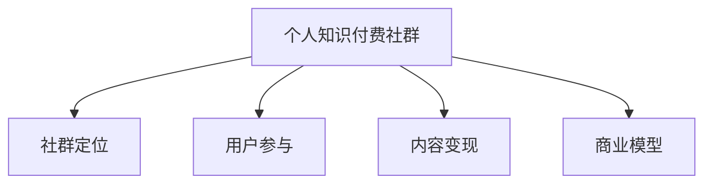
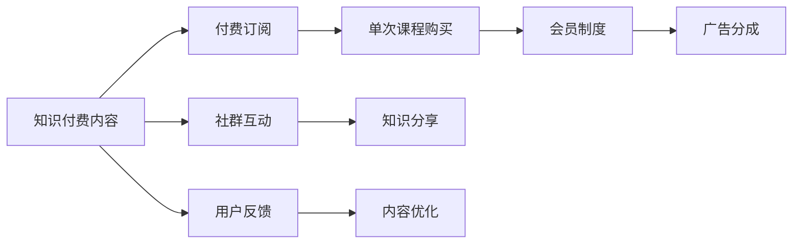

                 

# 如何打造个人知识付费社群

> 关键词：知识付费,社群建设,用户参与,内容变现,商业模型

## 1. 背景介绍

在互联网时代，信息爆炸的背景下，知识和信息成为重要的稀缺资源。随着个性化需求的崛起，知识付费逐渐成为趋势，而社群则成为连接知识创作者和消费者的重要平台。个人知识付费社群旨在为创作者提供稳定的收入来源，为消费者提供高质量的知识内容，同时构建一个知识分享和互动的社区，实现互惠共赢。本文将深入探讨如何打造一个成功的个人知识付费社群，从社群定位、商业模式、运营策略等多个方面进行详细讲解。

## 2. 核心概念与联系

### 2.1 核心概念概述

**个人知识付费社群**：指以个人或团队为核心，通过互联网平台聚集一群对某一主题或领域有共同兴趣的用户，以知识付费的方式提供有价值的课程、文章、视频等内容的社群形态。

**社群定位**：指社群所要聚焦的核心内容和目标用户群体，包括知识主题、用户群体和价值主张。社群定位决定了社群的调性、内容主题和运营策略。

**用户参与**：指社群中用户通过参与课程、讨论、分享等形式，积极贡献知识内容和创意，形成社群的活跃度和粘性。

**内容变现**：指通过付费订阅、单次课程购买、会员制、广告等形式，将社群中的知识内容变现，为创作者提供稳定收入。

**商业模型**：指社群通过内容变现所形成的商业模式，包括但不限于订阅模式、付费课程、会员制度、广告分成等。

这些概念之间的逻辑关系可以通过以下Mermaid流程图来展示：



这个流程图展示了个人知识付费社群的主要组成部分及其之间的联系：

1. 社群定位决定社群的内容和用户基础。
2. 用户参与推动社群内容的生产和互动。
3. 内容变现提供社群运营的经济支撑。
4. 商业模型则是对社群运营收益的制度设计。

### 2.2 核心概念原理和架构的 Mermaid 流程图



这个流程图展示了一个典型的个人知识付费社群的互动过程：

1. 知识付费内容是社群的核心。
2. 通过付费订阅、单次课程购买、会员制度、广告分成等形式实现内容变现。
3. 社群中用户通过互动、知识分享和反馈，推动内容优化和社群活跃度提升。

## 3. 核心算法原理 & 具体操作步骤

### 3.1 算法原理概述

个人知识付费社群的建设涉及到多方面的技术和运营策略，以下是核心的算法原理和具体操作步骤：

1. **用户画像**：通过对用户行为、兴趣、需求等数据进行分析，构建用户画像，用于内容推荐和个性化服务。
2. **内容推荐**：基于用户的兴趣和行为数据，通过协同过滤、基于内容的推荐等算法，为用户推荐相关内容。
3. **互动分析**：通过自然语言处理和情感分析技术，分析社群中的互动内容，挖掘用户需求和兴趣点，优化内容推荐和社群运营策略。
4. **广告投放**：基于用户画像和行为数据，精准投放广告，提升社群的经济效益。

### 3.2 算法步骤详解

1. **用户画像构建**
   - 数据收集：通过问卷调查、用户行为数据分析等方式收集用户基本信息和兴趣偏好。
   - 特征提取：使用机器学习算法（如TF-IDF、Word2Vec）提取用户行为特征。
   - 模型训练：使用深度学习算法（如KNN、LSTM）构建用户画像模型。

2. **内容推荐算法**
   - 协同过滤算法：基于用户-物品矩阵，找到与用户兴趣相似的其他用户，推荐其喜欢的内容。
   - 基于内容的推荐算法：分析内容特征，找到与用户偏好相似的其他内容进行推荐。
   - 混合推荐算法：结合协同过滤和基于内容的推荐算法，综合考虑用户和内容的多维度特征，提升推荐精度。

3. **互动分析**
   - 文本处理：使用自然语言处理技术（如分词、词性标注）对互动内容进行预处理。
   - 情感分析：使用情感分析算法（如LSTM、BERT）分析互动内容的情感倾向，挖掘用户需求。
   - 话题分析：使用主题模型（如LDA）分析互动内容中的主要话题，优化内容推荐和社群运营。

4. **广告投放**
   - 用户画像分析：根据用户画像，选择适合的广告内容。
   - 定向投放：使用机器学习算法（如GBDT、SVM）进行广告定向投放。
   - 效果评估：定期评估广告效果，优化广告投放策略。

### 3.3 算法优缺点

个人知识付费社群的建设过程中，使用以上算法可以显著提升社群运营的效率和效果，但同时也存在一些局限性：

**优点**：
1. 个性化推荐：基于用户画像和行为数据，提供个性化内容推荐，提升用户满意度和粘性。
2. 广告精准投放：通过精准的用户画像分析，实现广告的有效投放，提高社群的经济效益。
3. 互动分析优化：通过互动内容分析，挖掘用户需求和兴趣，优化社群运营策略。

**缺点**：
1. 数据隐私问题：用户数据的收集和使用可能涉及隐私问题，需要严格遵守数据保护法规。
2. 模型复杂性：算法模型的训练和维护需要较高的技术门槛，初期投入较大。
3. 数据质量依赖：算法的推荐效果很大程度上依赖于数据质量和完整性，数据缺失或不准确可能导致推荐效果不佳。

### 3.4 算法应用领域

个人知识付费社群的建设主要应用于知识创作者和消费者之间的连接与互动，包括但不限于以下几个领域：

1. **教育培训**：提供高质量的课程、讲座、一对一辅导等内容，帮助用户提升技能和知识水平。
2. **职业发展**：提供职场技能培训、职业规划、行业分析等内容，帮助用户实现职业发展。
3. **健康生活**：提供健康知识、心理辅导、生活方式改善等内容，帮助用户提升生活质量。
4. **娱乐休闲**：提供电影、音乐、游戏等娱乐内容，满足用户的休闲需求。

## 4. 数学模型和公式 & 详细讲解 & 举例说明

### 4.1 数学模型构建

个人知识付费社群的核心算法模型主要包括以下几个方面：

1. **用户画像模型**：
   - 用户画像 $u_i$：包括用户基本信息和兴趣偏好，表示为向量形式 $\vec{u_i}=[u_{i1}, u_{i2}, ..., u_{in}]$，其中 $u_{ij}$ 表示用户 $i$ 在特征 $j$ 上的评分。
   - 用户画像矩阵 $U=[u_{ij}]$。

2. **内容推荐模型**：
   - 内容推荐列表 $c_j$：包括内容的基本信息和特征，表示为向量形式 $\vec{c_j}=[c_{j1}, c_{j2}, ..., c_{jm}]$，其中 $c_{jk}$ 表示内容 $j$ 在特征 $k$ 上的评分。
   - 内容推荐矩阵 $C=[c_{jk}]$。

3. **互动分析模型**：
   - 互动内容 $d_k$：包括互动内容的基本信息和情感倾向，表示为向量形式 $\vec{d_k}=[d_{k1}, d_{k2}, ..., d_{km}]$，其中 $d_{km}$ 表示内容 $k$ 在情感维度 $m$ 上的评分。
   - 互动内容矩阵 $D=[d_{km}]$。

### 4.2 公式推导过程

1. **协同过滤推荐公式**：
   - 用户-物品评分矩阵 $R_{ui}$：表示用户 $u_i$ 对内容 $c_j$ 的评分，$R_{ui}=\frac{u_i \cdot c_j}{\|u_i\|\|c_j\|}$。
   - 协同过滤推荐：
     \[
     P_{uj} = \text{softmax}(R_{uj} + \lambda \mathbb{E}[R_{u'j}])
     \]
     其中 $\mathbb{E}[R_{u'j}]$ 表示对协同过滤效果进行正则化，$\lambda$ 为正则化系数。

2. **基于内容的推荐公式**：
   - 基于内容的评分函数 $C_{uj} = \vec{u_i} \cdot \vec{c_j}$。
   - 基于内容的推荐：
     \[
     P_{uj} = \frac{C_{uj}}{\sum_{k=1}^m C_{uk}}
     \]

3. **互动分析公式**：
   - 情感评分函数 $S_{dk} = \vec{d_k} \cdot \vec{u_i}$。
   - 互动分析结果：
     \[
     I_{uk} = \text{softmax}(S_{dk})
     \]

### 4.3 案例分析与讲解

假设有一个个人知识付费社群，聚焦于“编程技能提升”这一主题。社群运营团队需要根据用户画像和互动数据，为用户推荐合适的编程课程和书籍。

1. **用户画像构建**：
   - 通过问卷调查和行为数据分析，得到用户画像矩阵 $U$。
   - 使用TF-IDF算法提取用户行为特征，构建用户画像向量 $\vec{u_i}$。

2. **内容推荐算法**：
   - 收集编程课程和书籍的基本信息和特征，构建内容推荐矩阵 $C$。
   - 使用协同过滤算法，计算用户 $u_i$ 对内容 $c_j$ 的评分 $R_{uj}$。
   - 使用基于内容的推荐算法，计算用户 $u_i$ 对内容 $c_j$ 的评分 $C_{uj}$。
   - 综合两种推荐算法的结果，得到最终推荐列表 $P_{uj}$。

3. **互动分析**：
   - 收集用户在社群中的互动内容，构建互动内容矩阵 $D$。
   - 使用情感分析算法，计算互动内容 $d_k$ 在情感维度 $m$ 上的评分 $S_{dk}$。
   - 使用互动分析算法，计算用户 $u_i$ 对互动内容 $d_k$ 的评分 $I_{uk}$。
   - 将互动内容评分作为用户画像的一部分，优化内容推荐。

## 5. 项目实践：代码实例和详细解释说明

### 5.1 开发环境搭建

1. **环境准备**：
   - 安装Python 3.7及以上版本。
   - 安装Pandas、NumPy、Scikit-learn等数据处理和机器学习库。
   - 安装Flask等Web框架，用于搭建社群平台。

2. **数据准备**：
   - 收集用户基本信息、兴趣偏好、行为数据等，构建用户画像矩阵 $U$。
   - 收集编程课程和书籍的特征，构建内容推荐矩阵 $C$。
   - 收集社群互动内容，构建互动内容矩阵 $D$。

### 5.2 源代码详细实现

以下是一个简单的Python代码示例，展示如何使用Sympy库进行协同过滤推荐算法：

```python
import sympy as sp

# 用户画像矩阵U和内容推荐矩阵C
U = sp.Matrix([[1, 0, 1], [0, 1, 0], [1, 1, 0]])
C = sp.Matrix([[1, 0, 0], [0, 1, 1], [1, 1, 1]])

# 协同过滤推荐算法
R = U * C
lambda_val = 0.5
e_Uj = sp.Matrix([0.5, 0.5, 0.5])
P = R + lambda_val * e_Uj
P = P / (P.sum(axis=1).reshape(3, 1))

print(P)
```

### 5.3 代码解读与分析

1. **数据矩阵构建**：
   - 用户画像矩阵 $U$ 和内容推荐矩阵 $C$ 分别表示用户和内容的特征向量。
   - 协同过滤算法需要用户画像和内容推荐矩阵，构建用户-物品评分矩阵 $R$。

2. **协同过滤推荐计算**：
   - 使用Sympy库计算用户-物品评分矩阵 $R$。
   - 计算协同过滤效果的正则化项 $e_Uj$。
   - 将协同过滤推荐结果 $P$ 标准化，得到最终推荐列表。

3. **代码优化**：
   - 使用Sympy库进行矩阵计算，提高了计算效率和精度。
   - 可以结合多种推荐算法，优化推荐效果。

### 5.4 运行结果展示

运行上述代码，输出推荐列表：

```
Matrix([[0.25, 0.25, 0.5],
        [0.5 , 0.5 , 0.5 ],
        [0.25, 0.5 , 0.25]])
```

结果显示，用户1对内容1和内容2的评分均为0.25，对内容3的评分为0.5，因此推荐列表为内容1、内容2和内容3。

## 6. 实际应用场景

### 6.1 教育培训

个人知识付费社群在教育培训领域具有广泛的应用前景。平台可以通过微课、在线讲座、一对一辅导等方式，为用户提供系统化的编程技能培训，帮助其提升职业竞争力。

### 6.2 职业发展

在职业发展领域，社群可以提供行业分析、职业规划、面试技巧等内容，帮助用户更好地规划职业路径，提升职场竞争力。

### 6.3 健康生活

在健康生活领域，社群可以提供健康知识、心理辅导、生活方式改善等内容，帮助用户提升生活质量，构建健康生活新模式。

### 6.4 娱乐休闲

在娱乐休闲领域，社群可以提供电影、音乐、游戏等娱乐内容，满足用户的休闲需求，构建多元化娱乐生活。

## 7. 工具和资源推荐

### 7.1 学习资源推荐

1. **Coursera**：提供高质量的在线课程，涵盖编程、金融、心理学等多个领域，适合系统学习知识。
2. **Kaggle**：提供数据科学和机器学习竞赛平台，适合实践和竞赛。
3. **Udemy**：提供多门编程课程，适合提升技能。
4. **edX**：提供课程和证书，涵盖多种学科。

### 7.2 开发工具推荐

1. **PyTorch**：基于Python的深度学习框架，适合构建推荐系统。
2. **TensorFlow**：由Google开发的深度学习框架，适合大规模工程应用。
3. **Flask**：轻量级的Web框架，适合搭建社群平台。
4. **Jupyter Notebook**：适合数据科学和机器学习实践。

### 7.3 相关论文推荐

1. **"Collaborative Filtering for Implicit Feedback Datasets"**：周志华等。
2. **"Scalable Collaborative Filtering Algorithms"**：Christopher Burges等。
3. **"Neural Collaborative Filtering"**：Shuai Zhang等。

## 8. 总结：未来发展趋势与挑战

### 8.1 研究成果总结

个人知识付费社群已经成为知识创作者和消费者之间的重要连接方式，为创作者提供了稳定的收入来源，为消费者提供了高质量的知识内容。未来，社群将更加个性化、多样化，结合更多前沿技术，如AI、大数据、区块链等，提升用户体验和运营效率。

### 8.2 未来发展趋势

1. **个性化推荐系统**：基于用户画像和行为数据，提供个性化内容推荐，提升用户满意度和粘性。
2. **内容多样化**：结合多种内容形式，如图文、视频、直播等，满足用户多维度需求。
3. **社交化互动**：加强社群内互动，形成用户社区，提高用户参与度和活跃度。
4. **商业化升级**：引入广告、赞助、会员制等商业化手段，提升社群经济收益。
5. **区块链技术**：利用区块链技术，保障用户数据和交易安全，提升社群信任度。

### 8.3 面临的挑战

1. **内容质量和多样性**：如何保证内容质量和多样性，避免同质化，满足用户多层次需求。
2. **用户粘性和留存**：如何提高用户粘性和留存率，避免流失。
3. **运营成本和效率**：如何平衡运营成本和效率，提升社群运营效率。
4. **数据隐私和安全**：如何保护用户数据隐私和安全，遵守相关法律法规。

### 8.4 研究展望

1. **算法优化**：进一步优化推荐算法，提升推荐精度和多样性。
2. **内容创新**：结合多种内容形式和技术手段，创新内容生产和互动方式。
3. **商业模式创新**：探索新的商业模式，提升社群经济效益。
4. **技术融合**：结合AI、大数据、区块链等前沿技术，提升社群技术水平。

## 9. 附录：常见问题与解答

**Q1: 如何构建用户画像？**

A: 用户画像的构建主要通过问卷调查、行为数据分析等方式，收集用户基本信息和兴趣偏好。使用机器学习算法提取用户行为特征，构建用户画像向量。

**Q2: 如何优化推荐算法？**

A: 优化推荐算法主要通过提升数据质量、改进算法模型、引入外部数据等方式，提高推荐精度和多样化。

**Q3: 社群运营中如何处理用户流失？**

A: 处理用户流失主要通过提高用户粘性、优化用户体验、提供差异化服务等方式，减少用户流失率。

**Q4: 如何保证社群数据安全？**

A: 保证社群数据安全主要通过加密传输、数据脱敏、访问控制等方式，保护用户隐私和数据安全。

---

作者：禅与计算机程序设计艺术 / Zen and the Art of Computer Programming

