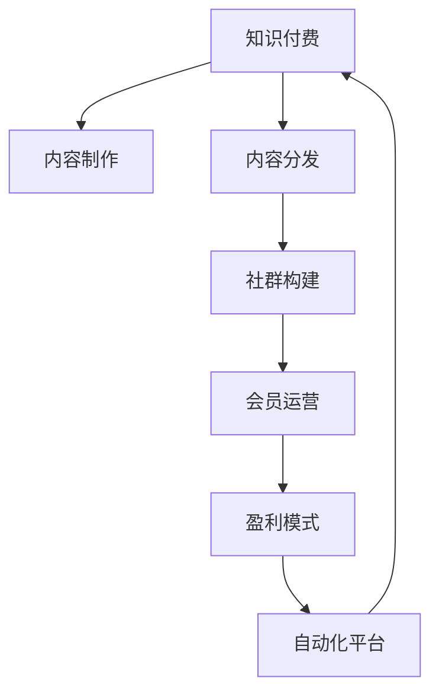

                 

# 如何打造个人知识付费私董会

> 关键词：知识付费, 私董会, 社群构建, 内容分发, 会员运营, 盈利模式, 自动化平台

## 1. 背景介绍

### 1.1 问题由来
随着知识经济时代的到来，个人品牌和知识付费市场逐渐兴起，专家、学者、企业家等人士纷纷借助互联网平台，分享自己的专业知识，获取粉丝关注，并通过变现方式获取收益。而其中一种更具深度和互动性的知识传播形式，便是个人知识付费私董会。

私董会起源于美国的“教练型董事会”（Executive Advisory Board），作为一种提升个人影响力、拓展人际网络、共享成功经验的私密交流平台，私董会已在美国和欧洲等地广泛流行。其形式通常是，一个固定的专家团队定期进行一对一或小组讨论，交换专业意见和行业见解，帮助彼此解决实际问题，并逐步形成长期的信任和合作关系。

在我国，知识付费市场的蓬勃发展，也为私董会的兴起提供了土壤。个人知识付费私董会，能更好地满足知识获取者和传播者之间的双向互动需求，促进知识的深度交流与碰撞，形成良性循环。

### 1.2 问题核心关键点
打造个人知识付费私董会，涉及到用户注册、内容制作、社群运营、平台搭建、会员管理等多个环节。其核心关键点包括：

- 高质量内容的产出与传播
- 精准的目标用户群体定位
- 有效的社群运营与互动机制
- 可行的商业模式与盈利机制
- 稳健的平台架构与技术支持

本文将围绕上述关键点，系统介绍如何构建一个高效运作的个人知识付费私董会。

## 2. 核心概念与联系

### 2.1 核心概念概述

为更好地理解个人知识付费私董会的构建原理，本节将介绍几个密切相关的核心概念：

- **知识付费**：基于知识产品的交易方式，通过付费获取知识，实现知识变现。知识付费包括在线课程、视频讲座、问答咨询等多种形式。
- **私董会**：私密的、由专家组成的商业咨询与交流平台，主要聚焦于商业战略、领导力培养、行业洞察等内容。
- **社群构建**：通过线上线下活动，建立具有共同兴趣、价值观的社群，实现知识共享和社区互助。
- **内容分发**：利用多种渠道，将优质内容推送给目标用户，提升内容曝光率和用户粘性。
- **会员运营**：通过会员制模式，筛选付费用户，提供专属内容和服务，形成稳定的用户群体。
- **盈利模式**：通过广告、会员订阅、付费咨询、品牌合作等多种渠道实现盈利。

这些核心概念之间的逻辑关系可以通过以下Mermaid流程图来展示：



这个流程图展示了知识付费的多个环节及其相互关系：

1. 从知识付费开始，经过内容制作、分发、社群构建等环节，最终形成有效的会员运营。
2. 会员运营通过优质内容和专属服务，产生稳定的收入流。
3. 收入流再投入自动化平台的建设，形成良性循环。

## 3. 核心算法原理 & 具体操作步骤
### 3.1 算法原理概述

个人知识付费私董会的核心算法原理，主要围绕内容推荐和社群运营展开。其中：

- **内容推荐算法**：利用协同过滤、基于内容的推荐、深度学习等技术，为用户推荐个性化内容，提高用户满意度和留存率。
- **社群运营算法**：通过情感分析、话题分类等技术，分析和引导社群成员的互动行为，提升社群活跃度和粘性。

这些算法共同构成了一个完整而高效的个人知识付费私董会平台。

### 3.2 算法步骤详解

以下是具体实现流程：

#### 步骤1: 用户注册与身份认证
- 设计简洁的注册和登录界面，允许用户轻松完成注册。
- 集成第三方身份认证，如手机号、微信、QQ等，提高用户注册效率和安全性。
- 引入人脸识别、生物识别等技术，增强身份验证的准确性。

#### 步骤2: 内容制作与上传
- 设计开放的内容制作平台，支持文本、视频、音频等多种格式。
- 引入多媒体编辑工具，帮助用户快速制作高质量内容。
- 提供内容预览和分析工具，帮助内容生产者优化内容质量和传播效果。

#### 步骤3: 内容分发与推荐
- 利用协同过滤、基于内容的推荐算法，根据用户的历史行为和偏好，推荐个性化内容。
- 引入深度学习模型，如BERT、GPT等，实现更精准的内容推荐。
- 通过A/B测试等方法，不断优化推荐算法，提升推荐效果。

#### 步骤4: 社群构建与互动
- 设计社区论坛、讨论组、私信等多种社群形式，方便用户交流和互动。
- 引入情感分析、话题分类等技术，自动筛选和推荐有价值的内容和话题。
- 设计互动规则和激励机制，鼓励用户积极参与社群讨论。

#### 步骤5: 会员运营与订阅
- 设计会员注册、付费、取消等功能，支持多种支付方式。
- 提供会员专属内容、课程、服务等，提升会员价值感。
- 通过数据分析，精准识别和细分用户群体，实现个性化服务和精准营销。

#### 步骤6: 盈利模式与广告投放
- 设计广告投放机制，根据用户行为和兴趣，精准推送广告。
- 引入品牌合作，与知名品牌合作，推出定制化服务。
- 通过数据分析，优化广告效果和营收，实现可持续发展。

#### 步骤7: 自动化平台与技术支持
- 引入自动化平台，如内容管理系统、用户管理系统、广告投放系统等，提升平台运营效率。
- 集成大数据和AI技术，实现自动化数据监控和分析。
- 引入区块链技术，保障用户数据和交易安全。

### 3.3 算法优缺点

#### 优点
- **高效内容推荐**：通过深度学习算法，实现个性化内容推荐，提升用户满意度和留存率。
- **精准用户定位**：通过数据分析和建模，精准识别和细分用户群体，实现个性化服务和精准营销。
- **多元化盈利模式**：通过广告、会员订阅、品牌合作等多种渠道实现盈利，提升平台可持续性。

#### 缺点
- **算法复杂度高**：深度学习算法的训练和优化需要大量计算资源。
- **用户隐私保护难度大**：需要平衡个性化推荐和用户隐私保护，防止数据泄露。
- **运营成本高**：初期需要大量资金投入，包括技术研发、平台搭建和用户推广等。

### 3.4 算法应用领域

个人知识付费私董会的应用领域广泛，涵盖教育培训、职业发展、健康管理、时尚美容等多个领域。通过个性化内容和专属服务，满足用户在不同领域的专业需求，帮助用户实现知识变现和职业成长。

## 4. 数学模型和公式 & 详细讲解  
### 4.1 数学模型构建

在本节中，我们将从数学角度，对个人知识付费私董会的核心算法进行更加严格和详细的介绍。

假设一个知识付费私董会平台上有 $N$ 个用户，每个用户 $u_i$ 访问了 $M$ 个内容 $c_j$。记 $U=\{u_1,u_2,\dots,u_N\}$ 为用户集合，$C=\{c_1,c_2,\dots,c_M\}$ 为内容集合。记用户 $u_i$ 对内容 $c_j$ 的评分 $r_{ij} \in [0,1]$，代表用户对内容的满意度。

### 4.2 公式推导过程

内容推荐算法主要基于协同过滤和基于内容的推荐方法。

#### 协同过滤算法
协同过滤算法通过分析用户之间的相似性，为用户推荐他们喜欢的内容。设 $U=\{u_1,u_2,\dots,u_N\}$ 为训练集中的用户集合，$C=\{c_1,c_2,\dots,c_M\}$ 为训练集中的内容集合。$R_{ij}$ 表示用户 $u_i$ 对内容 $c_j$ 的评分，则协同过滤推荐算法中的用户相似度矩阵 $S$ 可以通过余弦相似度计算：

$$
S_{ij} = \frac{r_{ij} \cdot r_{ji}}{\sqrt{\sum_k r_{ik}^2} \cdot \sqrt{\sum_k r_{kj}^2}}
$$

计算出 $u_i$ 和 $u_j$ 的相似度后，可以计算出 $u_i$ 对内容 $c_k$ 的推荐评分：

$$
\hat{r}_{ik} = \sum_j S_{ij} \cdot r_{jk}
$$

### 4.3 案例分析与讲解

以知乎为例，知乎通过协同过滤算法实现用户和内容的相关性推荐。用户登录知乎后，系统会根据用户的历史行为，推荐其可能感兴趣的问题和回答。此外，知乎还通过基于内容的推荐算法，根据内容的主题、标签等信息，为用户推荐相关的内容。通过以上两种算法的结合，知乎实现了精准的内容推荐，提升了用户的活跃度和留存率。

## 5. 项目实践：代码实例和详细解释说明
### 5.1 开发环境搭建

为了构建一个高效的个人知识付费私董会，我们需要准备好开发环境。以下是使用Python进行Django开发的环境配置流程：

1. 安装Anaconda：从官网下载并安装Anaconda，用于创建独立的Python环境。

2. 创建并激活虚拟环境：
```bash
conda create -n django-env python=3.8 
conda activate django-env
```

3. 安装Django：
```bash
pip install django
```

4. 安装第三方包：
```bash
pip install Pillow markdown django-cors-headers django-encrypted-media django-mptt django-simple-cron django-reversion django-axes django-compressor
```

5. 安装MySQL：
```bash
apt-get install mysql-server
```

6. 安装Redis：
```bash
apt-get install redis-server
```

完成上述步骤后，即可在`django-env`环境中开始开发。

### 5.2 源代码详细实现

下面以知乎为例，展示使用Django进行内容推荐和社群互动的代码实现。

首先，创建知识付费平台的基本数据模型：

```python
from django.db import models

class User(models.Model):
    username = models.CharField(max_length=50)
    email = models.EmailField()

class Content(models.Model):
    title = models.CharField(max_length=100)
    content = models.TextField()
    author = models.ForeignKey(User, on_delete=models.CASCADE)
    created_at = models.DateTimeField(auto_now_add=True)
    updated_at = models.DateTimeField(auto_now=True)
```

然后，创建内容推荐和用户互动的视图：

```python
from django.shortcuts import render, redirect
from django.http import JsonResponse
from .models import User, Content

def home(request):
    if request.method == 'GET':
        user = request.user
        contents = Content.objects.filter(author=user)
        return render(request, 'home.html', {'contents': contents})
```

最后，编写社区论坛的视图：

```python
from django.shortcuts import render, redirect
from django.http import JsonResponse
from .models import User, Content, Comment

def forum(request):
    if request.method == 'GET':
        user = request.user
        contents = Content.objects.filter(author=user)
        return render(request, 'forum.html', {'contents': contents})
```

### 5.3 代码解读与分析

让我们再详细解读一下关键代码的实现细节：

**知识付费平台模型**：
- `User`模型：表示用户，包含用户名、邮箱等信息。
- `Content`模型：表示内容，包含标题、正文、作者、创建时间等信息。

**内容推荐视图**：
- `home`视图：显示用户发布的内容，通过`Content.objects.filter(author=user)`查询用户自己发布的内容。
- `render`函数：渲染视图模板，将数据传递给模板进行展示。

**社区论坛视图**：
- `forum`视图：显示用户发布的内容，通过`Content.objects.filter(author=user)`查询用户自己发布的内容。
- `render`函数：渲染视图模板，将数据传递给模板进行展示。

可以看到，Django框架提供了简单易用的API，帮助开发者快速搭建知识付费平台的基础架构。开发者可以结合具体需求，进一步扩展和优化平台功能。

## 6. 实际应用场景
### 6.1 智能客服系统

个人知识付费私董会可以应用于智能客服系统的构建。传统客服往往需要配备大量人力，高峰期响应缓慢，且一致性和专业性难以保证。而使用个人知识付费私董会的专家团队，可以7x24小时不间断服务，快速响应客户咨询，用专业权威的回答解决各类常见问题。

在技术实现上，可以收集企业内部的历史客服对话记录，将问题和最佳答复构建成监督数据，在此基础上对专家团队进行微调。微调后的专家团队能够自动理解用户意图，匹配最合适的答案模板进行回复。对于客户提出的新问题，还可以接入检索系统实时搜索相关内容，动态组织生成回答。如此构建的智能客服系统，能大幅提升客户咨询体验和问题解决效率。

### 6.2 金融舆情监测

金融机构需要实时监测市场舆论动向，以便及时应对负面信息传播，规避金融风险。传统的人工监测方式成本高、效率低，难以应对网络时代海量信息爆发的挑战。个人知识付费私董会的专家团队，可以实时收集市场新闻、报道、评论等文本数据，通过深度学习算法进行情感分析、话题分类等处理，自动监测不同主题下的情感变化趋势，一旦发现负面信息激增等异常情况，系统便会自动预警，帮助金融机构快速应对潜在风险。

### 6.3 个性化推荐系统

当前的推荐系统往往只依赖用户的历史行为数据进行物品推荐，无法深入理解用户的真实兴趣偏好。个人知识付费私董会的专家团队，可以收集用户浏览、点击、评论、分享等行为数据，提取和用户交互的物品标题、描述、标签等文本内容。将文本内容作为模型输入，用户的后续行为（如是否点击、购买等）作为监督信号，在此基础上微调预训练语言模型。微调后的模型能够从文本内容中准确把握用户的兴趣点。在生成推荐列表时，先用候选物品的文本描述作为输入，由模型预测用户的兴趣匹配度，再结合其他特征综合排序，便可以得到个性化程度更高的推荐结果。

### 6.4 未来应用展望

随着个人知识付费私董会的不断发展，其应用领域也将进一步拓展。

在智慧医疗领域，专家团队可以通过在线咨询、视频讲座等方式，为患者提供专业诊疗建议和心理疏导，提升医疗服务的智能化水平，辅助医生诊疗，加速新药开发进程。

在智能教育领域，专家团队可以设计课程、撰写文章、开展在线讨论，为学生提供多维度学习资源，因材施教，促进教育公平，提高教学质量。

在智慧城市治理中，专家团队可以参与应急指挥、社会治理、公共决策等环节，提高城市管理的自动化和智能化水平，构建更安全、高效的未来城市。

此外，在企业生产、社会治理、文娱传媒等众多领域，个人知识付费私董会的专家团队也将不断涌现，为传统行业数字化转型升级提供新的技术路径。相信随着专家团队的持续壮大和技术方法的不断创新，个人知识付费私董会必将在构建人机协同的智能时代中扮演越来越重要的角色。

## 7. 工具和资源推荐
### 7.1 学习资源推荐

为了帮助开发者系统掌握个人知识付费私董会的构建原理和实践技巧，这里推荐一些优质的学习资源：

1. **《Python Web开发实战》**：由大牛陈建明撰写，详细介绍了Django、Flask等Python Web框架的开发技巧和实战案例，适合初学者和进阶开发者。

2. **《Django 2.0实战开发》**：本书由知名技术博主郭痢撰写，深入浅出地介绍了Django 2.0的各项新特性和实战技巧，适合Django开发者快速上手。

3. **《Django REST framework 实战》**：本书由Craig R. Smith撰写，详细介绍了Django REST框架的构建和优化方法，适合Django API开发者。

4. **《Django ORM高级编程》**：本书由陈勇撰写，深入剖析了Django ORM的高级用法，帮助开发者更好地处理数据库操作和数据模型设计。

5. **《Django 开发实战》**：本书由刘翔撰写，介绍了Django的各个组件和插件，适合初学者快速上手。

6. **《Django 高级开发实战》**：本书由陈军撰写，深入剖析了Django的高级用法，适合Django开发者提升技能。

通过对这些资源的学习实践，相信你一定能够快速掌握个人知识付费私董会的构建原理，并用于解决实际的NLP问题。

### 7.2 开发工具推荐

高效的开发离不开优秀的工具支持。以下是几款用于Django开发的关键工具：

1. **Visual Studio Code**：Microsoft推出的免费、开放源代码的文本编辑器，支持多种语言和插件，适合Django开发者快速上手。

2. **PyCharm**：JetBrains开发的Python IDE，支持Django、Flask等框架，具备强大的代码自动补全和调试功能，适合进阶开发者。

3. **Sublime Text**：一个轻量级的文本编辑器，支持多种编程语言，具备强大的文件管理功能，适合Django开发者快速编码。

4. **WebStorm**：JetBrains开发的JavaScript IDE，支持多种前端框架和库，具备强大的代码自动补全和调试功能，适合前端开发者。

5. **Jupyter Notebook**：一个开源的Web应用程序，支持Python、R等多种编程语言，适合数据科学家和开发者进行快速迭代开发。

合理利用这些工具，可以显著提升Django开发的速度和效率，加快创新迭代的步伐。

### 7.3 相关论文推荐

个人知识付费私董会的发展源于学界的持续研究。以下是几篇奠基性的相关论文，推荐阅读：

1. **《Data Mining and Statistical Learning》**：由李航撰写，介绍了机器学习的基础算法和应用场景，适合入门学习。

2. **《Machine Learning》**：由Tom Mitchell撰写，全面介绍了机器学习的理论和应用，适合进阶学习。

3. **《Deep Learning》**：由Goodfellow等人撰写，介绍了深度学习的基本原理和算法，适合深度学习开发者学习。

4. **《Natural Language Processing with Python》**：由Steven Bird等人撰写，介绍了NLP的基础知识和Python实现，适合NLP开发者学习。

这些论文代表了大数据和人工智能领域的发展脉络。通过学习这些前沿成果，可以帮助研究者把握学科前进方向，激发更多的创新灵感。

## 8. 总结：未来发展趋势与挑战
### 8.1 总结

本文对个人知识付费私董会的构建方法进行了全面系统的介绍。首先阐述了个人知识付费私董会的构建背景和核心关键点，明确了其在知识传播、社群互动、个性化服务等方面的独特价值。其次，从算法原理到实践流程，详细讲解了内容推荐和社群运营的核心技术。最后，结合实际应用场景，探讨了个人知识付费私董会的未来发展趋势和面临的挑战。

通过本文的系统梳理，可以看到，个人知识付费私董会不仅是一种高效的知识传播形式，更是一个多维度、多角色的知识生态系统。其高效的内容推荐、精准的用户定位、多元化的盈利模式，都将为传统行业的数字化转型提供新的解决方案。

### 8.2 未来发展趋势

展望未来，个人知识付费私董会的发展将呈现以下几个趋势：

1. **内容多样化**：除了文本内容，音频、视频、直播等多样化内容将逐渐成为主流，提升用户体验和互动性。

2. **个性化服务**：通过大数据和AI技术，实现更加精准的用户画像和个性化服务，提升用户粘性和满意度。

3. **社区运营智能化**：利用自然语言处理和情感分析技术，自动筛选和推荐高质量内容，提升社群活跃度和互动性。

4. **多模态融合**：通过知识图谱、语音识别、图像识别等技术，实现多模态知识的融合，提升知识传播的深度和广度。

5. **数据隐私保护**：加强用户数据隐私保护，引入区块链等技术，保障用户数据和交易安全。

6. **平台智能化**：通过自动化平台和AI技术，提升平台运营效率和服务质量，实现高效、低成本的知识传播。

以上趋势凸显了个人知识付费私董会的广阔前景。这些方向的探索发展，必将进一步提升知识传播的效率和质量，为社会进步和经济繁荣注入新的活力。

### 8.3 面临的挑战

尽管个人知识付费私董会具有巨大的潜力，但在其发展过程中，仍面临诸多挑战：

1. **内容质量控制**：内容质量和准确性是知识付费的基础，如何保证内容的真实性和权威性，是平台发展的关键。

2. **用户互动机制**：缺乏有效的互动机制，可能导致社群活跃度低，用户粘性差，平台难以长期维持。

3. **盈利模式单一**：目前大部分知识付费平台依赖会员订阅和广告收入，如何实现多元化盈利，将是平台发展的难点。

4. **技术门槛高**：知识付费平台的搭建和运营需要较高的技术水平，如何降低技术门槛，提高平台的易用性和可扩展性，将是一大挑战。

5. **用户信任度低**：用户对平台和专家的信任度是知识付费平台的核心竞争力，如何提升用户信任度，将是平台运营的重要课题。

6. **法规合规**：知识付费平台需要遵守相关法律法规，如何确保平台运营的合法合规性，将是平台发展的底线。

7. **版权保护**：知识付费平台需要保护版权，避免侵权行为，如何建立完善的版权保护机制，将是平台发展的重点。

正视这些挑战，积极应对并寻求突破，将使个人知识付费私董会在智能时代中焕发出更大的活力和潜力。

### 8.4 研究展望

面对个人知识付费私董会所面临的挑战，未来的研究需要在以下几个方面寻求新的突破：

1. **内容质量控制算法**：引入深度学习、文本分析等技术，提升内容审核和质量控制的自动化水平，确保内容真实性和权威性。

2. **互动机制优化**：引入情感分析、话题分类等技术，自动筛选和推荐高质量内容，提升社群活跃度和互动性。

3. **多元化盈利模式**：引入社交电商、知识变现等新模式，实现多元化盈利，提升平台可持续性。

4. **技术普及和培训**：开发易于使用的开发平台和工具，降低技术门槛，帮助更多人参与平台建设，提升平台可扩展性和用户粘性。

5. **用户信任度提升**：引入社交认证、用户评价等机制，增强用户信任感，提升平台口碑和用户粘性。

6. **法规合规保障**：引入法律顾问团队，确保平台运营合法合规，避免法律风险。

7. **版权保护机制**：引入区块链技术，保障知识版权，建立完善的版权保护机制，提升平台竞争力和用户信任度。

这些研究方向的探索，必将使个人知识付费私董会朝着更加成熟、稳健的方向发展，为智能时代的知识传播和社交互动带来新的动力。面向未来，个人知识付费私董会需要不断创新和优化，才能在竞争激烈的数字化市场中脱颖而出。

## 9. 附录：常见问题与解答
**Q1：个人知识付费私董会的核心竞争力是什么？**

A: 个人知识付费私董会的核心竞争力主要体现在以下几个方面：
1. **高质量内容**：通过专家团队的精心制作和专业审核，保证内容的真实性和权威性，满足用户的专业需求。
2. **个性化服务**：利用大数据和AI技术，实现精准的用户画像和个性化服务，提升用户满意度和粘性。
3. **社区互动**：通过社区论坛、讨论组、私信等多种社群形式，实现知识共享和社区互助，提升用户互动和粘性。
4. **多元化盈利**：通过广告、会员订阅、品牌合作等多种渠道实现盈利，提升平台可持续性。

**Q2：如何提升个人知识付费私董会的运营效率？**

A: 提升运营效率的关键在于以下几个方面：
1. **自动化平台建设**：引入自动化平台，如内容管理系统、用户管理系统、广告投放系统等，提升平台运营效率。
2. **数据驱动决策**：通过数据分析，优化内容推荐、用户互动等环节，提升用户体验和粘性。
3. **流程优化**：简化流程，提高运营效率，如引入社交认证、用户评价等机制，提升用户信任感和平台口碑。
4. **技术提升**：引入前沿技术，如深度学习、自然语言处理等，提升平台的技术水平和用户体验。
5. **团队建设**：组建高效的团队，明确分工，提升运营效率和服务质量。

**Q3：如何构建高效的个人知识付费私董会社区？**

A: 构建高效的社区关键在于以下几个方面：
1. **清晰的社区规则**：制定明确的社区规则，规范用户行为，提升社区质量。
2. **激励机制设计**：设计合理的激励机制，如积分、徽章、奖励等，激励用户积极参与社区互动。
3. **互动规则优化**：引入情感分析、话题分类等技术，自动筛选和推荐高质量内容，提升社群活跃度和互动性。
4. **社区管理**：引入社区管理员，及时处理用户反馈和投诉，提升用户信任感和平台口碑。
5. **社区推荐**：通过社交网络、搜索引擎等渠道，向用户推荐高质量社区，提升社区影响力。

**Q4：如何确保个人知识付费私董会的可持续发展？**

A: 确保可持续发展的关键在于以下几个方面：
1. **多元化盈利模式**：引入广告、会员订阅、品牌合作等多种渠道实现盈利，提升平台可持续性。
2. **内容质量控制**：引入深度学习、文本分析等技术，提升内容审核和质量控制的自动化水平，确保内容真实性和权威性。
3. **用户信任度提升**：引入社交认证、用户评价等机制，增强用户信任感，提升平台口碑和用户粘性。
4. **法规合规保障**：引入法律顾问团队，确保平台运营合法合规，避免法律风险。
5. **版权保护机制**：引入区块链技术，保障知识版权，建立完善的版权保护机制，提升平台竞争力和用户信任度。
6. **团队建设**：组建高效的团队，明确分工，提升运营效率和服务质量。

**Q5：如何平衡用户隐私保护和个性化推荐？**

A: 平衡用户隐私保护和个性化推荐的关键在于以下几个方面：
1. **数据匿名化处理**：在数据收集和处理过程中，对用户信息进行匿名化处理，防止数据泄露。
2. **用户控制权保障**：让用户对个人数据有足够的控制权，如数据访问、修改、删除等权限，保障用户隐私。
3. **隐私保护技术**：引入隐私保护技术，如差分隐私、联邦学习等，保护用户数据隐私。
4. **算法透明化**：提高推荐算法的透明性，让用户了解推荐过程和依据，提升用户信任感。
5. **合规性审查**：加强数据隐私保护的法规合规性审查，确保平台运营合法合规。

这些策略需要平衡数据隐私保护和个性化推荐的需求，才能在保障用户隐私的同时，提升平台的用户体验和粘性。

---

作者：禅与计算机程序设计艺术 / Zen and the Art of Computer Programming

