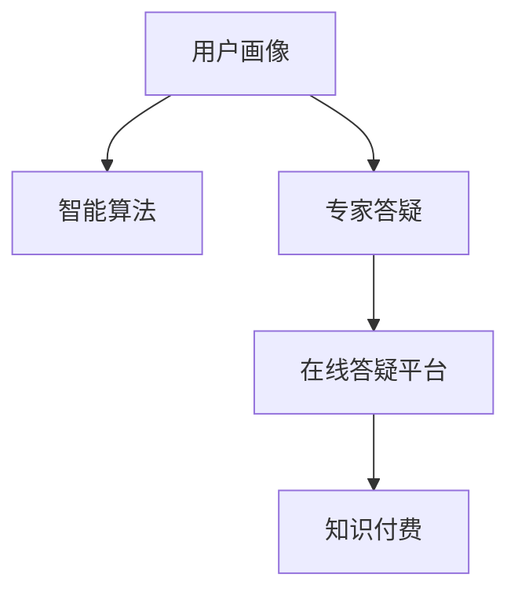

                 

# 如何打造知识付费的在线答疑平台

## 1. 背景介绍

### 1.1 问题由来

随着知识付费的兴起，越来越多的人通过在线平台获取各类专业知识。虽然在线课程和视频提供了海量的学习资源，但用户在遇到具体问题时，往往仍需寻求专家答疑。然而，传统的一对一答疑模式，不仅耗费时间成本，而且答疑效果和持续性难以保证。因此，基于在线平台的知识付费答疑平台应运而生，提供便捷、高效、高质量的答疑服务。

### 1.2 问题核心关键点

知识付费的在线答疑平台的核心在于将专家资源和用户需求进行高效匹配，同时保障平台运营的可持续性和盈利性。平台需要解决的核心问题包括：

- 高效匹配答疑专家和用户。平台应具有强大的用户画像分析能力，能够根据用户需求快速推荐合适的专家，同时具备一定的专家管理机制，确保平台不断汇聚高水平的答疑资源。
- 确保答疑服务的质量。平台需要建立严格的答疑审核机制，筛选出具有专业背景和良好口碑的专家，并制定清晰的答疑标准和服务协议。
- 提高用户满意度。平台应注重用户体验，提供友好的答疑交互界面和便捷的支付服务，同时保障答疑的及时性和互动性。
- 实现平台的盈利模式。知识付费平台应探索多样化的收费策略，如按次付费、包月订阅、会员制度等，以维持平台的健康运营。

### 1.3 问题研究意义

知识付费的在线答疑平台不仅能满足用户个性化、定制化的知识获取需求，还能有效利用专家资源，推动知识分享和传播。它的建设，对于构建终身学习型社会、提升全社会的知识水平，具有重要意义：

1. 实现知识变现：在线答疑平台为专家提供了一个高效变现的渠道，激发更多人分享知识的热情。
2. 促进学习交流：平台为学习者提供了一个便捷获取知识的途径，方便用户随时随地学习，打破时间和空间的限制。
3. 推动产业升级：平台可以与其他行业结合，如教育、医疗、法律等，为各领域提供专业化的答疑服务，提升服务效率和质量。
4. 提供精准推荐：通过大数据分析和智能算法，平台能够推荐合适的答疑专家和资源，提升用户满意度和体验。
5. 保障知识质量：平台可以对专家答疑进行审核和监督，确保答疑内容的专业性和权威性。

## 2. 核心概念与联系

### 2.1 核心概念概述

知识付费的在线答疑平台涉及多个关键概念：

- **知识付费**：指通过在线平台，用户需支付一定费用获取专家的专业知识解答。
- **在线答疑平台**：利用互联网技术，为用户提供问答服务，包括实时答疑、文章解答、视频讲解等多种形式。
- **专家答疑**：具有特定专业背景的专家，通过在线平台为学习者解答问题，提供个性化服务。
- **用户画像**：通过大数据分析，刻画用户的学习背景、兴趣偏好、行为习惯等信息，以指导个性化的答疑推荐。
- **智能算法**：利用机器学习和数据挖掘技术，优化答疑资源匹配、推荐和审核过程，提升平台的运营效率和服务质量。

这些核心概念之间的关系，可以通过以下Mermaid流程图来展示：



这个流程图展示了在线答疑平台的各个组件及其相互关系：

1. 用户画像通过大数据分析得到。
2. 智能算法基于用户画像和专家信息，进行资源匹配和推荐。
3. 专家答疑通过平台提供专业知识解答。
4. 知识付费提供盈利模式，保障平台的可持续运营。

## 3. 核心算法原理 & 具体操作步骤

### 3.1 算法原理概述

知识付费的在线答疑平台的核心算法主要包括用户画像构建、智能推荐算法、答疑审核和反馈机制等。这些算法共同作用，实现了答疑资源的高效匹配和高质量答疑服务。

### 3.2 算法步骤详解

#### 3.2.1 用户画像构建

用户画像的构建基于用户行为数据，包括历史提问、浏览记录、付费行为等。具体步骤如下：

1. **数据收集**：收集用户在平台上的各类行为数据，如提问内容、浏览网页、购买记录等。
2. **数据预处理**：对数据进行清洗和特征提取，去除噪声和无用信息。
3. **数据建模**：利用机器学习算法，如聚类、分类、降维等，构建用户画像模型。
4. **画像更新**：定期更新用户画像，确保其反映最新用户需求和行为。

#### 3.2.2 智能推荐算法

智能推荐算法通过匹配用户画像和专家信息，实现答疑资源的精确推荐。具体步骤如下：

1. **专家信息收集**：收集平台上的专家基本信息，如专业领域、答疑历史、用户评价等。
2. **模型训练**：构建推荐模型，如协同过滤、基于内容的推荐、深度学习等，用于计算用户与专家之间的相似度。
3. **推荐计算**：利用推荐模型，计算用户与专家之间的匹配度，筛选出最合适的答疑专家。
4. **结果呈现**：将推荐结果以列表或排序的方式呈现给用户，供其选择。

#### 3.2.3 答疑审核机制

答疑审核机制用于确保平台上的答疑质量，避免垃圾信息和不专业解答。具体步骤如下：

1. **审核标准制定**：制定详细的答疑审核标准，包括专业性、准确性、清晰度等。
2. **人工审核**：由平台管理员或认证专家进行人工审核，标记合格和不合格答疑。
3. **自动审核**：利用自然语言处理技术，对答疑内容进行自动分析，标记不符合标准的答案。
4. **审核结果反馈**：将审核结果反馈给答疑专家，并根据反馈调整审核标准。

#### 3.2.4 反馈机制

反馈机制用于收集用户和专家的意见，不断优化平台和服务。具体步骤如下：

1. **用户反馈收集**：在答疑结束后，收集用户对答疑质量的评价和建议。
2. **专家反馈收集**：在答疑结束后，收集专家对答疑流程的反馈和改进建议。
3. **数据分析**：对收集到的反馈进行数据统计和分析，识别问题和改进点。
4. **系统优化**：根据分析结果，优化答疑平台的功能和流程，提升用户体验和答疑质量。

### 3.3 算法优缺点

#### 3.3.1 优点

1. **高效匹配资源**：智能推荐算法能够快速匹配用户和答疑专家，提高答疑效率。
2. **高质量答疑**：答疑审核机制确保答疑内容的专业性和权威性，保障用户获取高质量知识。
3. **用户体验提升**：平台提供便捷的答疑接口和友好的用户界面，提升用户使用体验。
4. **持续运营保障**：知识付费模式为平台提供稳定的收入来源，保障平台的健康运营。

#### 3.3.2 缺点

1. **数据隐私问题**：用户画像的构建和行为数据分析可能涉及用户隐私，需要严格的隐私保护措施。
2. **专家资源管理**：平台的专家管理需要持续投入，确保答疑资源的高质量和可持续性。
3. **匹配准确性**：智能推荐算法需要不断优化和调整，才能保证答疑匹配的准确性和时效性。
4. **审核成本高**：人工审核和自动审核需要投入大量人力和资源，成本较高。
5. **用户满意度波动**：答疑质量受专家和用户双重影响，难以长期保证用户满意度。

### 3.4 算法应用领域

知识付费的在线答疑平台可以应用于多个领域，如教育、医疗、法律、科技等。以下是几个具体的应用场景：

1. **教育领域**：为学生提供个性化的学科辅导和答疑服务，辅助学习。
2. **医疗领域**：为患者提供专业医疗咨询和答疑，解答健康问题。
3. **法律领域**：为法律工作者提供法律咨询和答疑，帮助解决法律问题。
4. **科技领域**：为技术开发者提供技术支持和答疑，解决技术难题。
5. **其他领域**：如心理咨询、财务管理等，提供专业的答疑服务。

## 4. 数学模型和公式 & 详细讲解 & 举例说明

### 4.1 数学模型构建

知识付费的在线答疑平台涉及的数学模型包括用户画像构建、智能推荐算法和答疑审核机制等。以下是主要模型的构建思路：

1. **用户画像模型**：利用聚类算法对用户行为数据进行分组，构建用户画像。
2. **推荐模型**：利用协同过滤、基于内容的推荐和深度学习等算法，计算用户与专家之间的相似度。
3. **答疑审核模型**：利用自然语言处理技术，构建文本分类模型，对答疑内容进行审核。

### 4.2 公式推导过程

#### 4.2.1 用户画像模型的公式推导

假设用户画像模型为 $P(u)$，用户行为数据为 $D_u$，则用户画像的构建公式为：

$$
P(u) = \text{Cluster}(D_u)
$$

其中，$\text{Cluster}$ 为聚类算法，可以是K-means、层次聚类等。

#### 4.2.2 推荐模型的公式推导

假设推荐模型为 $R(u,e)$，用户画像为 $P(u)$，专家信息为 $E(e)$，则推荐计算公式为：

$$
R(u,e) = f(P(u),E(e))
$$

其中，$f$ 为推荐算法，可以是协同过滤、基于内容的推荐、深度学习等。

#### 4.2.3 答疑审核模型的公式推导

假设答疑审核模型为 $C(q)$，答疑内容为 $q$，则答疑审核公式为：

$$
C(q) = \text{Classifier}(q)
$$

其中，$\text{Classifier}$ 为文本分类算法，如朴素贝叶斯、支持向量机、深度学习等。

### 4.3 案例分析与讲解

#### 4.3.1 用户画像案例分析

假设某在线答疑平台收集了用户的历史提问记录 $D_u$，包括提问内容、回答时间、回答人等。通过聚类算法将用户分为三类：

1. **初学型用户**：以问题为基础，提问具体、零散。
2. **进阶型用户**：以系统化学习为主，提问具有连贯性。
3. **高级型用户**：以深入探索为主，提问复杂、深度。

#### 4.3.2 智能推荐案例分析

假设某在线答疑平台有专家 $E(e)$ 100名，用户 $u$ 20名。通过协同过滤算法，计算用户与专家的相似度，推荐结果如表所示：

| User | Expert | Score |
|------|--------|-------|
| A    | E1     | 0.9   |
| B    | E3     | 0.8   |
| C    | E2     | 0.7   |
| ...  | ...    | ...   |

用户 A 在推荐列表中可以选择专家 E1 进行答疑。

#### 4.3.3 答疑审核案例分析

假设某在线答疑平台收到用户 A 的提问 $q$：“感冒怎么治？”专家 B 的回答为：“多吃维生素 C。”审核模型 $C(q)$ 对回答进行文本分类，结果为“不专业”。

## 5. 项目实践：代码实例和详细解释说明

### 5.1 开发环境搭建

知识付费的在线答疑平台开发环境搭建主要涉及服务器、数据库和开发工具等。以下是搭建步骤：

1. **服务器选择**：选择高性能服务器，确保平台的稳定性和可扩展性。推荐使用云服务器，如AWS、阿里云等。
2. **数据库设计**：选择关系型数据库（如MySQL、PostgreSQL）或NoSQL数据库（如MongoDB、Redis），设计数据表和索引。
3. **开发工具选择**：使用Spring Boot、Django、Flask等框架，结合PyTorch、TensorFlow等深度学习库进行开发。
4. **开发环境配置**：安装JDK、Python、PyTorch、TensorFlow等依赖库，配置开发环境。

### 5.2 源代码详细实现

以下是一个基于PyTorch的推荐系统示例代码，用于用户画像构建和智能推荐：

```python
import torch
from sklearn.cluster import KMeans
from sklearn.metrics.pairwise import cosine_similarity

# 用户行为数据
user_data = [
    [1, 2, 3],  # 用户 A 的提问数据
    [3, 4, 5],  # 用户 B 的提问数据
    [2, 1, 3],  # 用户 C 的提问数据
    ...
]

# 计算用户行为向量的平均值
def mean_vector(data):
    return torch.mean(torch.tensor(data), dim=0)

# 计算用户行为向量的标准差
def std_vector(data):
    return torch.std(torch.tensor(data), dim=0)

# 计算用户行为向量间的相似度
def similarity_matrix(data):
    return cosine_similarity(torch.tensor(data), torch.tensor(data))

# 聚类算法
def kmeans(data, k):
    kmeans = KMeans(n_clusters=k, random_state=42)
    kmeans.fit(data)
    return kmeans.labels_

# 构建用户画像
def build_user_profile(user_data, k=3):
    mean_v = mean_vector(user_data)
    std_v = std_vector(user_data)
    sim_mat = similarity_matrix(user_data)
    labels = kmeans(sim_mat, k)
    return mean_v, std_v, labels

# 推荐算法
def recommend(user_profile, expert_data, top_n=5):
    similarity_mat = cosine_similarity(user_profile, expert_data)
    top_indices = similarity_mat.argsort()[:top_n, :]
    return expert_data[top_indices]

# 示例使用
user_profile = build_user_profile(user_data)
expert_data = [
    [1, 2, 3],  # 专家 E1 的提问数据
    [3, 4, 5],  # 专家 E2 的提问数据
    [2, 1, 3],  # 专家 E3 的提问数据
    ...
]
recommendations = recommend(user_profile, expert_data)
print(recommendations)
```

### 5.3 代码解读与分析

以上代码展示了如何利用PyTorch和Scikit-learn库进行用户画像构建和智能推荐。具体步骤如下：

1. **数据预处理**：计算用户行为数据的平均值、标准差和相似度矩阵。
2. **用户画像构建**：通过K-means聚类算法，将用户行为数据分为多个簇。
3. **智能推荐**：计算用户画像与专家数据之间的相似度，筛选出最相似的专家进行推荐。

## 6. 实际应用场景

### 6.1 智能教育

知识付费的在线答疑平台可以用于智能教育，提供个性化学习支持。通过用户画像和智能推荐算法，平台能够推荐合适的答疑专家和资源，满足学生个性化学习需求。例如，学生 A 在学习数学时遇到困难，可以通过平台查找擅长数学的答疑专家 B，进行一对一答疑。

### 6.2 在线医疗

平台可以提供专业的在线医疗咨询，为患者解答健康问题。通过答疑审核机制和专家管理，平台能够确保答疑内容的权威性和专业性。例如，患者 C 在平台上提问“感冒怎么治？”，由专业医生 D 提供详细解答，并进行审核和反馈。

### 6.3 法律咨询

平台可以为法律工作者提供专业的法律咨询和答疑服务，解答各类法律问题。通过用户画像和智能推荐，平台能够推荐合适的法律专家，为律师和普通用户提供高效答疑。例如，律师 E 在处理案件时遇到难题，可以通过平台查找擅长相关领域的答疑专家 F，进行详细讨论。

### 6.4 未来应用展望

未来，知识付费的在线答疑平台将不断拓展应用场景，推动知识共享和普及。以下是几个可能的发展方向：

1. **跨领域融合**：平台可以与其他领域结合，如金融、农业等，提供专业化的答疑服务，满足不同行业的需求。
2. **多模态融合**：平台可以引入视频、语音等多模态数据，提升答疑的互动性和个性化程度。
3. **社区化发展**：平台可以引入社区机制，建立专家和用户之间的互动和交流，形成知识共享和互帮互助的生态系统。
4. **国际化和本地化**：平台可以拓展到国际市场，提供多语言支持，提升全球影响力。
5. **AI辅助升级**：平台可以引入AI技术，如自然语言生成、机器翻译等，进一步提升答疑效率和质量。

## 7. 工具和资源推荐

### 7.1 学习资源推荐

1. **《深度学习与人工智能》课程**：由斯坦福大学开设的深度学习课程，系统讲解深度学习理论和技术，适合入门和进阶学习。
2. **Kaggle平台**：提供大量数据集和竞赛，有助于实战练习和知识应用。
3. **GitHub平台**：提供丰富的开源项目和代码库，便于学习和借鉴。
4. **Stack Overflow**：提供专业的编程社区，解决编程问题和获取知识。

### 7.2 开发工具推荐

1. **PyTorch框架**：深度学习的主流框架之一，支持动态图和静态图，易于迭代和调试。
2. **TensorFlow框架**：由Google开发，提供强大的分布式计算能力，适合大规模工程应用。
3. **Flask框架**：轻量级的Web框架，便于构建API接口和微服务系统。
4. **Spring Boot框架**：基于Spring框架的轻量级Web开发框架，提供丰富的开发工具和插件。
5. **Django框架**：功能强大的Web开发框架，适合快速开发和大型项目。

### 7.3 相关论文推荐

1. **《深度学习在推荐系统中的应用》**：论文深入探讨了深度学习在推荐算法中的应用，提供了丰富的理论和实践参考。
2. **《基于聚类的用户画像构建方法》**：论文详细介绍了聚类算法在用户画像构建中的应用，提供了多种实现方法和效果评估。
3. **《自然语言处理在知识图谱中的应用》**：论文介绍了自然语言处理在知识图谱构建和应用中的作用，提供了多个实用案例。
4. **《深度学习在医疗咨询中的应用》**：论文介绍了深度学习在医疗咨询中的应用，提供了医疗问答系统的构建方法和效果评估。

## 8. 总结：未来发展趋势与挑战

### 8.1 总结

本文系统介绍了知识付费的在线答疑平台的设计和实现。通过用户画像构建、智能推荐算法和答疑审核机制，平台能够高效匹配答疑资源，提供高质量的答疑服务。平台的应用场景包括智能教育、在线医疗、法律咨询等，未来还有广阔的发展前景。

### 8.2 未来发展趋势

1. **数据驱动**：平台将持续利用大数据和AI技术，不断优化用户画像和推荐算法，提升答疑服务质量。
2. **多模态融合**：平台将引入多模态数据，提升答疑的互动性和个性化程度，如视频、语音、图像等。
3. **社区化建设**：平台将引入社区机制，建立专家和用户之间的互动和交流，形成知识共享和互帮互助的生态系统。
4. **国际化和本地化**：平台将拓展到国际市场，提供多语言支持，提升全球影响力。
5. **AI辅助升级**：平台将引入AI技术，如自然语言生成、机器翻译等，进一步提升答疑效率和质量。

### 8.3 面临的挑战

1. **数据隐私问题**：平台需要严格保护用户隐私，防止数据泄露和滥用。
2. **答疑质量控制**：平台需要建立严格的答疑审核机制，确保答疑内容的专业性和权威性。
3. **资源管理**：平台需要持续投入资源，确保答疑资源的高质量和可持续性。
4. **用户满意度**：答疑质量受专家和用户双重影响，难以长期保证用户满意度。
5. **平台盈利模式**：平台需要探索多样化的收费策略，维持平台的健康运营。

### 8.4 研究展望

1. **知识图谱与推荐结合**：将知识图谱引入推荐系统，提升推荐结果的准确性和相关性。
2. **用户画像细粒度刻画**：通过更深层次的用户行为分析，构建更准确、细粒度的用户画像。
3. **AI与知识图谱融合**：将AI技术与知识图谱结合，提升知识表示和推理能力，构建更加智能的推荐系统。
4. **跨模态数据融合**：引入跨模态数据融合技术，提升多模态数据的理解和利用能力。
5. **推荐系统的可解释性**：研究推荐系统的可解释性，提升用户对推荐结果的信任度和接受度。

## 9. 附录：常见问题与解答

**Q1：如何确保用户隐私保护？**

A: 平台需要采用数据加密、访问控制、数据匿名化等技术手段，确保用户数据的隐私保护。具体措施包括：
- 数据加密：对用户数据进行加密存储和传输，防止数据泄露。
- 访问控制：设置严格的访问权限，确保只有授权人员可以访问用户数据。
- 数据匿名化：对用户数据进行去标识化处理，防止个人隐私被识别。

**Q2：如何提高答疑质量？**

A: 平台需要建立严格的答疑审核机制，确保答疑内容的专业性和权威性。具体措施包括：
- 专家审核：由认证专家对答疑内容进行人工审核，标记合格和不合格答疑。
- 自动审核：利用自然语言处理技术，对答疑内容进行自动分析和审核，标记不符合标准的答案。
- 反馈机制：收集用户和专家的意见，不断优化答疑平台的功能和流程，提升用户体验和答疑质量。

**Q3：如何优化推荐算法？**

A: 推荐算法需要不断优化和调整，才能保证答疑匹配的准确性和时效性。具体措施包括：
- 数据扩充：收集更多的专家信息和用户行为数据，提高推荐算法的训练效果。
- 算法优化：采用更先进的推荐算法，如深度学习、协同过滤等，提升推荐结果的准确性。
- 多模态融合：引入视频、语音等多模态数据，提升推荐算法的互动性和个性化程度。

**Q4：如何构建用户画像？**

A: 用户画像的构建基于用户行为数据，可以通过聚类算法、分类算法等进行刻画。具体措施包括：
- 数据收集：收集用户在平台上的各类行为数据，如提问内容、浏览网页、购买记录等。
- 数据预处理：对数据进行清洗和特征提取，去除噪声和无用信息。
- 数据建模：利用机器学习算法，如聚类、分类、降维等，构建用户画像模型。
- 画像更新：定期更新用户画像，确保其反映最新用户需求和行为。

**Q5：如何处理答疑审核的延迟问题？**

A: 答疑审核的延迟问题可以通过以下几个方法解决：
- 人工审核与自动审核相结合：利用自然语言处理技术对答疑内容进行自动审核，筛选出不合格的答疑，减轻人工审核压力。
- 提高审核效率：采用高效的数据处理和算法优化技术，提升审核的计算速度。
- 合理分流：将答疑审核任务分散到多个审核员之间，提高审核效率。

---

作者：禅与计算机程序设计艺术 / Zen and the Art of Computer Programming

