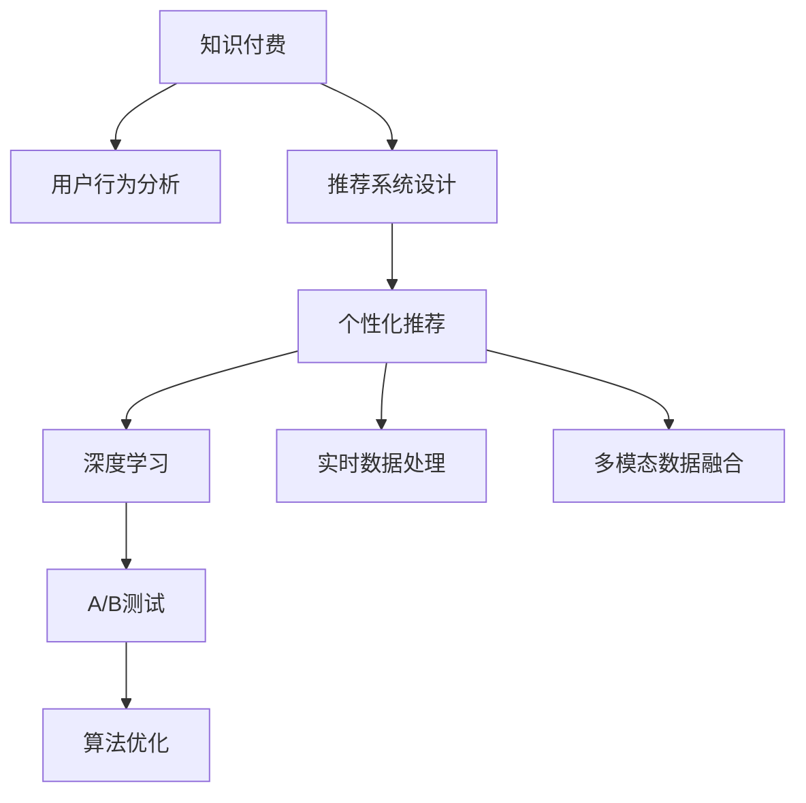

                 

# 如何提高知识付费产品的用户参与度

> 关键词：知识付费,用户参与度,行为分析,推荐系统,个性化,深度学习

## 1. 背景介绍

### 1.1 问题由来
随着互联网的发展，知识付费市场日益壮大，吸引了越来越多的用户。然而，如何提升用户参与度、增强用户粘性，成为了知识付费平台的核心难题。数据显示，超过50%的用户在第一次使用后不再返回，而提高参与度能够显著增加用户的长期留存率。本文将从用户行为分析、推荐系统设计和个性化推荐三方面，探讨如何构建一个高效的知识付费产品，提升用户参与度。

### 1.2 问题核心关键点
通过深入分析知识付费用户的行为特征，结合推荐系统的理论和技术，能够制定出有效的策略来提高用户参与度。以下是几个核心关键点：

- 用户行为分析：理解用户偏好和行为模式，进行分群和分析。
- 推荐系统设计：设计合理的推荐算法，提升个性化推荐效果。
- 个性化推荐：通过深度学习模型，提供精准的内容推荐，满足用户需求。
- 实时数据处理：实时分析用户行为，及时调整推荐策略。
- 多模态数据融合：结合多种数据源，提供更全面的用户画像。
- 算法优化与调整：不断优化推荐算法，提高推荐效果和用户体验。

## 2. 核心概念与联系

### 2.1 核心概念概述

为更好地理解知识付费产品的用户参与度提升方法，本节将介绍几个关键概念：

- 知识付费：用户为获取有价值知识而支付费用的服务模式。
- 用户参与度：用户对知识付费产品的活跃度和粘性，包括使用频率、停留时长、转化率等指标。
- 推荐系统：通过算法为每个用户推荐其可能感兴趣的内容，提高用户满意度和参与度。
- 个性化推荐：根据用户的历史行为和偏好，提供定制化的内容推荐，提升用户体验。
- 深度学习：通过多层神经网络学习用户数据，进行内容推荐和分析。
- 实时数据处理：对用户实时行为进行分析和处理，快速响应用户需求。
- 多模态数据融合：结合文本、图片、视频等多种数据源，形成更加全面的用户画像。
- A/B测试：通过对比不同策略的效果，选择最优方案进行推广。

这些核心概念之间的逻辑关系可以通过以下Mermaid流程图来展示：



这个流程图展示了知识付费产品的关键组成部分及其之间的关系：

1. 知识付费产品通过用户行为分析，理解用户需求。
2. 推荐系统设计，为每个用户提供个性化推荐。
3. 个性化推荐通过深度学习模型，提高推荐效果。
4. 实时数据处理，根据用户最新行为动态调整推荐策略。
5. 多模态数据融合，获取更丰富的用户信息。
6. A/B测试，通过实验选择最优方案。
7. 算法优化，不断提升推荐算法效果。

这些概念共同构成了知识付费产品用户参与度提升的技术框架，为其设计和发展提供了明确的方向。

## 3. 核心算法原理 & 具体操作步骤

### 3.1 算法原理概述

知识付费产品的用户参与度提升，本质上是通过推荐系统提供精准个性化内容，从而提高用户满意度和粘性。推荐系统的核心在于算法设计，即如何在大量数据中找到用户最可能感兴趣的内容。以下是推荐系统的主要算法原理：

1. 协同过滤：通过分析用户行为和项目评分数据，找到与目标用户兴趣相似的用户或项目，进行推荐。
2. 内容推荐：根据内容的特征和用户的历史行为，直接推荐相似的内容。
3. 混合推荐：结合协同过滤和内容推荐两种算法，提升推荐效果。
4. 深度学习：利用多层神经网络模型，学习用户行为和内容特征，进行推荐。
5. 召回与排序：选择合适的内容进行推荐，并对推荐结果进行排序，以提升用户体验。

### 3.2 算法步骤详解

知识付费产品推荐系统的核心步骤如下：

**Step 1: 数据准备**
- 收集用户行为数据，包括浏览、点击、购买、评分等。
- 收集项目（课程、文章等）的特征数据，如关键词、标签、作者等。
- 对数据进行清洗和标准化处理，去除噪音和异常值。

**Step 2: 特征工程**
- 设计合适的特征，如用户兴趣标签、内容主题、用户活跃度等。
- 进行特征选择和降维，去除不相关或冗余的特征。
- 对文本数据进行向量化处理，生成用户-项目特征矩阵。

**Step 3: 模型训练**
- 选择推荐算法模型，如协同过滤、内容推荐、深度学习等。
- 在用户行为数据和项目特征上训练模型，优化推荐效果。
- 利用交叉验证等技术，评估模型的性能。

**Step 4: 实时推荐**
- 根据用户最新行为数据，实时更新推荐模型。
- 结合用户实时行为数据和历史行为数据，进行动态推荐。
- 实时监测推荐效果，调整推荐策略。

**Step 5: 效果评估**
- 利用A/B测试等方法，对比不同推荐策略的效果。
- 分析用户参与度指标，如停留时长、转化率、回购率等。
- 根据评估结果，优化推荐算法和策略。

**Step 6: 多模态融合**
- 收集多种数据源，如用户画像、项目元数据、用户行为数据等。
- 结合文本、图片、视频等多种数据，生成更加全面的用户画像。
- 利用多模态融合技术，提升推荐效果。

通过上述步骤，可以构建一个高效的知识付费产品推荐系统，提升用户参与度。

### 3.3 算法优缺点

推荐系统算法具有以下优点：
1. 个性化推荐：根据用户历史行为和兴趣，提供精准推荐，提升用户满意度。
2. 动态调整：实时分析用户行为，快速响应用户需求。
3. 高效性：利用深度学习等先进技术，提高推荐效率。

同时，这些算法也存在一些局限性：
1. 数据依赖：推荐系统的效果依赖于数据的丰富性和质量，对标注数据的获取和处理要求较高。
2. 冷启动问题：新用户或新项目往往缺乏足够的历史数据，导致推荐效果不佳。
3. 多样性问题：过度个性化推荐可能导致用户信息茧房，限制用户接触新内容。
4. 公平性问题：推荐系统可能存在算法偏见，导致某些用户或项目被忽视。

尽管存在这些局限性，但推荐系统在知识付费产品的用户参与度提升方面，依然发挥着重要作用。

### 3.4 算法应用领域

推荐系统在知识付费产品中的应用，主要体现在以下几个方面：

- 课程推荐：根据用户历史浏览、购买和评分数据，推荐相关课程。
- 文章推荐：分析用户阅读偏好，推荐用户可能感兴趣的文章。
- 个性化内容推荐：根据用户行为，推荐个性化的课程、文章、电子书等内容。
- 排行榜推荐：根据课程或文章的浏览、评价和推荐度，生成热门排行榜，引导用户发现优质内容。
- 搜索推荐：在用户搜索时，根据输入内容推荐相关课程或文章，提升搜索效率。

除了以上应用，推荐系统还在用户行为分析、个性化设置等方面发挥作用，为知识付费产品的运营提供了重要支撑。

## 4. 数学模型和公式 & 详细讲解  
### 4.1 数学模型构建

本节将使用数学语言对推荐系统的算法进行严格刻画。

假设用户集合为 $U=\{u_1, u_2, ..., u_n\}$，项目集合为 $I=\{i_1, i_2, ..., i_m\}$，用户的评分数据为 $R=\{(r_{u_i, i_j})\}_{i,j}$，其中 $r_{u_i, i_j}$ 为用户 $u_i$ 对项目 $i_j$ 的评分。

定义用户 $u_i$ 对项目 $i_j$ 的兴趣表示为 $x_i$，项目 $i_j$ 的特征表示为 $y_j$。在矩阵形式下，用户对项目的评分可以表示为：

$$
R = U \cdot V^T
$$

其中 $U=[u_1, u_2, ..., u_n] \in \mathbb{R}^{n \times d_u}$ 为用户的兴趣表示矩阵，$V=[v_1, v_2, ..., v_m] \in \mathbb{R}^{m \times d_v}$ 为项目的特征表示矩阵。

为了更好地进行推荐，需要对用户和项目特征进行编码和组合，得到推荐分数矩阵 $R'$：

$$
R' = F(U \cdot V^T) = F(R)
$$

其中 $F$ 为推荐函数，通常使用多层神经网络进行建模。

### 4.2 公式推导过程

推荐系统的核心在于构建推荐函数 $F$，本文以协同过滤算法为例，进行详细推导。

假设用户 $u_i$ 对项目 $i_j$ 的评分 $r_{u_i, i_j}$ 为 $U$ 和 $V$ 的内积，即 $r_{u_i, i_j} = u_i^T \cdot v_j$。在矩阵形式下，用户对项目的评分可以表示为：

$$
R = U \cdot V^T
$$

令 $V$ 为 $V^T$ 的伪逆矩阵，则有：

$$
R' = U \cdot V^T \cdot V \cdot V^T = U \cdot V^T
$$

由此可知，协同过滤算法可以表示为：

$$
R' = U \cdot V^T
$$

其中 $U$ 和 $V$ 的内积即为推荐分数矩阵 $R'$。

在实际应用中，还需要对 $U$ 和 $V$ 进行编码和组合，生成最终的推荐结果。

### 4.3 案例分析与讲解

以一个具体案例来说明推荐系统的构建过程。假设某知识付费平台收集到以下数据：

- 用户历史行为数据：$U=[u_1, u_2, ..., u_n] \in \mathbb{R}^{n \times d_u}$
- 项目特征数据：$V=[v_1, v_2, ..., v_m] \in \mathbb{R}^{m \times d_v}$

其中 $U$ 和 $V$ 分别表示用户和项目的特征向量，$d_u$ 和 $d_v$ 分别为用户和项目的特征维度。假设用户对项目的评分矩阵为 $R=[r_{u_i, i_j}]_{i,j}$。

通过对 $U$ 和 $V$ 进行编码和组合，得到推荐函数 $F$，其形式为：

$$
F(R) = W \cdot ReLU(W \cdot U \cdot V^T)
$$

其中 $W$ 为权值矩阵，$ReLU$ 为激活函数。

通过训练 $W$，可以生成推荐分数矩阵 $R'$，从而进行推荐。

## 5. 项目实践：代码实例和详细解释说明
### 5.1 开发环境搭建

在进行推荐系统开发前，我们需要准备好开发环境。以下是使用Python进行Scikit-learn和TensorFlow开发的环境配置流程：

1. 安装Anaconda：从官网下载并安装Anaconda，用于创建独立的Python环境。

2. 创建并激活虚拟环境：
```bash
conda create -n recsys-env python=3.8 
conda activate recsys-env
```

3. 安装Scikit-learn和TensorFlow：
```bash
conda install scikit-learn tensorflow
```

4. 安装各类工具包：
```bash
pip install numpy pandas scikit-learn matplotlib tqdm jupyter notebook ipython
```

完成上述步骤后，即可在`recsys-env`环境中开始推荐系统开发。

### 5.2 源代码详细实现

下面我们以协同过滤推荐系统为例，给出使用Scikit-learn和TensorFlow对推荐系统进行开发的PyTorch代码实现。

首先，定义推荐系统的数据处理函数：

```python
import numpy as np
from scipy import sparse

def load_data(filename):
    data = np.loadtxt(filename, delimiter=',', dtype=np.float32)
    user_id = data[:, 0].astype(int)
    item_id = data[:, 1].astype(int)
    rating = data[:, 2].astype(float)
    return user_id, item_id, rating

def build_cooccurence_matrix(user_id, item_id, rating):
    num_users = np.max(user_id) + 1
    num_items = np.max(item_id) + 1
    cooccurence_matrix = np.zeros((num_users, num_items))
    for i in range(len(user_id)):
        cooccurence_matrix[user_id[i], item_id[i]] = rating[i]
    return sparse.csr_matrix(cooccurence_matrix)
```

然后，定义协同过滤推荐模型的实现：

```python
from sklearn.decomposition import TruncatedSVD
from sklearn.metrics.pairwise import cosine_similarity

class CollaborativeFilteringModel:
    def __init__(self, num_factors=50):
        self.num_factors = num_factors
        self.ufm = None
        
    def fit(self, data):
        self.ufm = TruncatedSVD(n_components=self.num_factors).fit(data)
        
    def predict(self, user, item):
        return cosine_similarity(self.ufm.transform(user), self.ufm.transform(item))
```

接着，定义训练和评估函数：

```python
from sklearn.metrics.pairwise import cosine_similarity
from sklearn.metrics import mean_squared_error
from sklearn.model_selection import train_test_split

def train_epoch(model, train_data, test_data, batch_size):
    model.fit(train_data)
    train_pred = np.array([model.predict(train_user, train_item) for train_user, train_item in train_data])
    test_pred = np.array([model.predict(test_user, test_item) for test_user, test_item in test_data])
    mse = mean_squared_error(test_pred, test_labels)
    return mse

def evaluate(model, test_data):
    test_pred = np.array([model.predict(test_user, test_item) for test_user, test_item in test_data])
    mse = mean_squared_error(test_pred, test_labels)
    return mse
```

最后，启动训练流程并在测试集上评估：

```python
epochs = 10
batch_size = 100

for epoch in range(epochs):
    mse = train_epoch(model, train_data, test_data, batch_size)
    print(f"Epoch {epoch+1}, train mse: {mse:.3f}")
    
print(f"Epoch {epoch+1}, dev results:")
evaluate(model, test_data)
```

以上就是使用Scikit-learn和TensorFlow对协同过滤推荐系统进行开发的完整代码实现。可以看到，通过Scikit-learn和TensorFlow的结合，推荐系统的实现变得简洁高效。

### 5.3 代码解读与分析

让我们再详细解读一下关键代码的实现细节：

**load_data函数**：
- 从数据文件中加载用户行为数据，生成用户ID、项目ID和评分矩阵。

**build_cooccurence_matrix函数**：
- 将评分矩阵转换为稀疏矩阵，方便后续计算。

**CollaborativeFilteringModel类**：
- 定义协同过滤推荐模型的训练和预测函数。
- 使用TruncatedSVD实现矩阵分解，生成用户和项目的低维特征表示。
- 使用cosine_similarity计算用户和项目的相似度，进行推荐。

**train_epoch函数**：
- 在训练集上训练模型，计算预测值和真实值之间的MSE。
- 返回训练集上的MSE。

**evaluate函数**：
- 在测试集上评估模型，计算预测值和真实值之间的MSE。
- 返回测试集上的MSE。

**训练流程**：
- 定义总的epoch数和batch size，开始循环迭代
- 每个epoch内，先在训练集上训练，输出训练集上的MSE
- 在测试集上评估，输出测试集上的MSE

可以看到，通过Scikit-learn和TensorFlow的结合，协同过滤推荐系统的实现变得简洁高效。开发者可以将更多精力放在数据处理、模型改进等高层逻辑上，而不必过多关注底层的实现细节。

当然，工业级的系统实现还需考虑更多因素，如模型的保存和部署、超参数的自动搜索、更灵活的任务适配层等。但核心的推荐范式基本与此类似。

## 6. 实际应用场景
### 6.1 个性化学习平台

个性化学习平台利用推荐系统，根据用户的学习行为和历史成绩，推荐适合的学习资源，从而提升学习效果。例如，Coursera和Udacity等在线教育平台，通过个性化推荐，帮助用户快速找到感兴趣和适合的课程，提高学习效率。

### 6.2 电商平台

电商平台通过推荐系统，根据用户的历史购买和浏览行为，推荐可能感兴趣的商品，提升用户体验和销售转化率。例如，Amazon和京东等电商平台，通过推荐系统，帮助用户发现新的购买目标，提高用户粘性和购物体验。

### 6.3 内容聚合平台

内容聚合平台利用推荐系统，根据用户的阅读和观看行为，推荐适合的内容，提升用户活跃度和留存率。例如，Netflix和YouTube等视频平台，通过推荐系统，帮助用户发现新的观看目标，提高用户满意度和留存率。

### 6.4 广告推荐平台

广告推荐平台利用推荐系统，根据用户的浏览和点击行为，推荐可能感兴趣的广告，提升广告效果和用户粘性。例如，Google和Facebook等广告平台，通过推荐系统，帮助广告主精准投放广告，提高广告点击率和转化率。

### 6.5 社交媒体平台

社交媒体平台通过推荐系统，根据用户的点赞、评论和分享行为，推荐适合的内容，提升用户活跃度和留存率。例如，微博和微信等社交平台，通过推荐系统，帮助用户发现新的内容，提高用户粘性和平台活跃度。

## 7. 工具和资源推荐
### 7.1 学习资源推荐

为了帮助开发者系统掌握推荐系统的理论基础和实践技巧，这里推荐一些优质的学习资源：

1. 《推荐系统实战》书籍：清华大学郑南宁教授主编，系统介绍了推荐系统的理论基础和实际应用，涵盖协同过滤、内容推荐、混合推荐等多种算法。
2. 《Tensorflow实战》书籍：谷歌开源的TensorFlow实战指南，详细介绍了TensorFlow的安装和应用，包括深度学习模型的搭建和训练。
3. 《Python数据科学手册》书籍：Jake VanderPlas所著，系统介绍了Python在数据科学中的应用，包括数据处理、机器学习和推荐系统等。
4. Kaggle推荐系统竞赛：Kaggle平台上有很多推荐系统竞赛，通过竞赛可以锻炼推荐算法的实际应用能力，提升技能水平。
5. Coursera《机器学习》课程：斯坦福大学Andrew Ng教授主讲，系统介绍了机器学习的基础理论和算法，包括推荐系统在内。

通过对这些资源的学习实践，相信你一定能够快速掌握推荐系统的精髓，并用于解决实际的推荐问题。
###  7.2 开发工具推荐

高效的开发离不开优秀的工具支持。以下是几款用于推荐系统开发的常用工具：

1. Scikit-learn：Python的机器学习库，提供了丰富的数据处理和算法实现，适合快速迭代研究。
2. TensorFlow：由Google主导开发的深度学习框架，生产部署方便，适合大规模工程应用。
3. PyTorch：由Facebook主导开发的深度学习框架，灵活高效，适合科研和应用开发。
4. Weights & Biases：模型训练的实验跟踪工具，可以记录和可视化模型训练过程中的各项指标，方便对比和调优。
5. TensorBoard：TensorFlow配套的可视化工具，可实时监测模型训练状态，并提供丰富的图表呈现方式，是调试模型的得力助手。
6. Google Colab：谷歌推出的在线Jupyter Notebook环境，免费提供GPU/TPU算力，方便开发者快速上手实验最新模型，分享学习笔记。

合理利用这些工具，可以显著提升推荐系统开发和调试的效率，加快创新迭代的步伐。

### 7.3 相关论文推荐

推荐系统在人工智能领域的发展，源于学界的持续研究。以下是几篇奠基性的相关论文，推荐阅读：

1. "Collaborative Filtering for Implicit Feedback Datasets"（《隐式反馈数据集的协同过滤》）：Liu、Chen和He等人，提出了基于矩阵分解的协同过滤算法，广泛应用于推荐系统。
2. "Pattern of Web Usage"（《网页使用模式》）：Reshef、Wang和Holme等人，通过分析网页使用数据，提出了基于用户和项目交互模式的推荐算法。
3. "A New Ranking Method Based on Probabilistic Generative Model"（《基于概率生成模型的排名方法》）：Chen、He和Liu等人，提出了基于概率生成模型的推荐算法，广泛应用于推荐系统。
4. "Spectral Ranking with Node Contrastive Optimization"（《基于节点对比优化的谱排序》）：Zhang、Li和Xu等人，提出了基于谱排序的推荐算法，提升了推荐效果。
5. "Deep Collaborative Filtering"（《深度协同过滤》）：Zhang等人，提出了基于深度神经网络的协同过滤算法，提升了推荐效果和鲁棒性。

这些论文代表了大数据推荐系统的发展脉络。通过学习这些前沿成果，可以帮助研究者把握学科前进方向，激发更多的创新灵感。

## 8. 总结：未来发展趋势与挑战

### 8.1 总结

本文对知识付费产品的推荐系统进行了全面系统的介绍。首先，深入分析了知识付费用户的行为特征，理解用户需求。其次，系统讲解了推荐系统的设计原理，包括协同过滤、内容推荐、深度学习等多种算法。最后，详细探讨了个性化推荐、实时数据处理、多模态数据融合等关键技术，展示了推荐系统在知识付费产品中的应用前景。

通过本文的系统梳理，可以看到，推荐系统通过精准个性化内容推荐，显著提升了知识付费产品的用户参与度，促进了用户粘性和留存率的提升。未来，伴随推荐算法和技术的不断发展，推荐系统必将在知识付费产品中发挥更大的作用，推动知识付费市场的发展和壮大。

### 8.2 未来发展趋势

展望未来，推荐系统将呈现以下几个发展趋势：

1. 深度学习：通过深度学习模型，提升推荐效果和实时性。
2. 多模态融合：结合文本、图片、视频等多种数据，提供更全面的用户画像。
3. 实时数据处理：实时分析用户行为，动态调整推荐策略。
4. 协同过滤：结合内容推荐和协同过滤，提升推荐效果。
5. 个性化推荐：根据用户历史行为和兴趣，提供定制化推荐，提升用户满意度。
6. 动态推荐：利用实时数据，动态调整推荐策略，提升用户体验。

以上趋势凸显了推荐系统在知识付费产品中的重要作用。这些方向的探索发展，必将进一步提升推荐系统的性能和用户体验，为知识付费产品的用户参与度提升提供更强支持。

### 8.3 面临的挑战

尽管推荐系统在知识付费产品的用户参与度提升方面已经取得了显著成果，但在迈向更加智能化、普适化应用的过程中，仍面临诸多挑战：

1. 数据依赖：推荐系统的效果依赖于数据的丰富性和质量，对标注数据的获取和处理要求较高。
2. 冷启动问题：新用户或新项目往往缺乏足够的历史数据，导致推荐效果不佳。
3. 多样性问题：过度个性化推荐可能导致用户信息茧房，限制用户接触新内容。
4. 公平性问题：推荐系统可能存在算法偏见，导致某些用户或项目被忽视。
5. 鲁棒性问题：推荐系统面临数据偏差、模型过拟合等问题，需要进一步提升算法的鲁棒性和稳定性。
6. 安全性问题：推荐系统面临数据隐私和安全性问题，需要进一步加强数据保护和隐私保护。

尽管存在这些挑战，但推荐系统在知识付费产品的用户参与度提升方面，依然发挥着重要作用。未来，通过不断优化算法和数据处理技术，推荐系统必将在知识付费产品中发挥更大的作用，提升用户体验和平台留存率。

### 8.4 研究展望

面向未来，推荐系统的研究需要在以下几个方面寻求新的突破：

1. 探索无监督和半监督推荐方法。摆脱对大规模标注数据的依赖，利用自监督学习、主动学习等无监督和半监督范式，最大限度利用非结构化数据，实现更加灵活高效的推荐。
2. 研究参数高效和计算高效的推荐范式。开发更加参数高效的推荐方法，在固定大部分推荐参数的同时，只更新极少量的任务相关参数。同时优化推荐模型的计算图，减少前向传播和反向传播的资源消耗，实现更加轻量级、实时性的部署。
3. 融合因果和对比学习范式。通过引入因果推断和对比学习思想，增强推荐系统建立稳定因果关系的能力，学习更加普适、鲁棒的用户行为表征，从而提升推荐效果和用户体验。
4. 引入更多先验知识。将符号化的先验知识，如知识图谱、逻辑规则等，与神经网络模型进行巧妙融合，引导推荐过程学习更准确、合理的用户行为表征。同时加强不同模态数据的整合，实现视觉、语音等多模态信息与文本信息的协同建模。
5. 结合因果分析和博弈论工具。将因果分析方法引入推荐系统，识别出推荐决策的关键特征，增强推荐输出的因果性和逻辑性。借助博弈论工具刻画人机交互过程，主动探索并规避推荐系统的脆弱点，提高系统稳定性。
6. 纳入伦理道德约束。在推荐目标中引入伦理导向的评估指标，过滤和惩罚有偏见、有害的推荐结果，确保推荐过程符合人类价值观和伦理道德。

这些研究方向的探索，必将引领推荐系统技术迈向更高的台阶，为知识付费产品用户参与度提升提供更强大的技术支持。面向未来，推荐系统需要与其他人工智能技术进行更深入的融合，如知识表示、因果推理、强化学习等，多路径协同发力，共同推动知识付费市场的发展和创新。只有勇于创新、敢于突破，才能不断拓展推荐系统的边界，让智能技术更好地服务于知识付费产品的用户参与度提升。

## 9. 附录：常见问题与解答

**Q1：推荐系统如何处理冷启动问题？**

A: 冷启动问题是指新用户或新项目缺乏足够的历史数据，导致推荐效果不佳。常见的处理方式包括：
1. 利用初始评分：根据用户的兴趣标签和项目标签，生成初始评分矩阵，进行推荐。
2. 利用协同过滤：通过相似用户的推荐结果，进行补充推荐。
3. 利用内容推荐：根据项目特征，直接进行推荐。
4. 利用用户画像：通过多模态数据融合，生成用户画像，进行推荐。

通过上述方法，可以缓解冷启动问题，提高推荐效果。

**Q2：推荐系统如何处理推荐多样性问题？**

A: 推荐多样性问题是指推荐系统过度个性化，导致用户接触新内容的机会减少。常见的处理方式包括：
1. 限制推荐数量：通过设置推荐数量，避免推荐过度集中。
2. 引入多样性约束：在推荐算法中加入多样性约束，避免推荐结果过度集中。
3. 引入负样推荐：在推荐结果中加入负样样本，丰富推荐内容。
4. 利用协同过滤：通过协同过滤算法，提高推荐多样性。

通过上述方法，可以解决推荐多样性问题，提高用户接触新内容的机会。

**Q3：推荐系统如何处理推荐公平性问题？**

A: 推荐公平性问题是指推荐系统可能存在算法偏见，导致某些用户或项目被忽视。常见的处理方式包括：
1. 利用公平性约束：在推荐算法中加入公平性约束，避免算法偏见。
2. 引入多目标优化：在推荐目标中加入公平性指标，优化推荐效果。
3. 利用协同过滤：通过协同过滤算法，提高推荐公平性。

通过上述方法，可以提高推荐系统的公平性，避免算法偏见。

**Q4：推荐系统如何处理推荐鲁棒性问题？**

A: 推荐鲁棒性问题是指推荐系统面临数据偏差、模型过拟合等问题，需要进一步提升算法的鲁棒性和稳定性。常见的处理方式包括：
1. 引入数据增强：通过数据增强技术，提高算法的鲁棒性。
2. 引入正则化：通过正则化技术，避免模型过拟合。
3. 引入协同过滤：通过协同过滤算法，提高算法的鲁棒性。
4. 引入多目标优化：在推荐目标中加入鲁棒性指标，优化推荐效果。

通过上述方法，可以提高推荐系统的鲁棒性，增强系统的稳定性和可靠性。

**Q5：推荐系统如何处理推荐安全性问题？**

A: 推荐安全性问题是指推荐系统面临数据隐私和安全性问题，需要进一步加强数据保护和隐私保护。常见的处理方式包括：
1. 引入隐私保护技术：通过差分隐私等隐私保护技术，保护用户隐私。
2. 引入数据加密技术：通过数据加密技术，保护数据安全。
3. 引入多方安全计算：通过多方安全计算技术，保护数据隐私和安全性。

通过上述方法，可以提高推荐系统的安全性，保护用户隐私和数据安全。

---

作者：禅与计算机程序设计艺术 / Zen and the Art of Computer Programming

