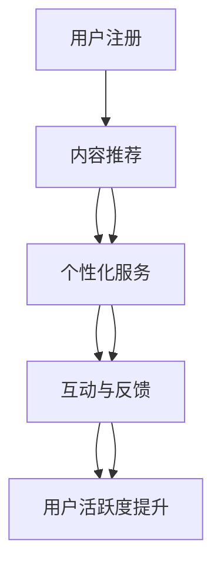

                 

# 如何提高知识付费产品的用户活跃度

## 1. 背景介绍

随着互联网和移动互联网的发展，知识付费成为越来越多用户的选择。据艾瑞咨询《2021年中国知识付费行业研究报告》显示，中国知识付费市场规模已达188.2亿元，同比增长39.2%。而用户活跃度的提升，成为知识付费平台竞争的关键。文章将从用户行为分析、内容推荐、运营策略等角度出发，探讨如何通过技术手段提高知识付费产品的用户活跃度。

## 2. 核心概念与联系

### 2.1 核心概念概述

- **知识付费**：指用户为获取知识而支付费用的商业模式。常见的形式包括在线课程、电子书、音频课程、视频课程等。
- **用户活跃度**：指用户在知识付费平台上的参与度和使用频率，包括浏览、购买、学习、反馈等行为。
- **内容推荐**：利用机器学习和用户画像技术，将合适的知识内容推荐给用户，提高其使用粘性。
- **个性化服务**：根据用户偏好、行为等数据，提供定制化的内容推荐和服务，提升用户体验。
- **互动与反馈**：通过社区、问答、评论等互动方式，增强用户参与感，收集用户反馈，优化产品。

### 2.2 核心概念原理和架构的 Mermaid 流程图(Mermaid 流程节点中不要有括号、逗号等特殊字符)


## 3. 核心算法原理 & 具体操作步骤
### 3.1 算法原理概述

提高知识付费产品用户活跃度，本质上是通过算法优化，提升用户在使用过程中的体验和满意度。核心算法包括内容推荐算法、个性化服务算法、用户行为分析算法等。

### 3.2 算法步骤详解

#### 3.2.1 用户行为分析

**数据收集**：通过日志、使用行为数据、问卷调查等手段，收集用户的注册信息、浏览记录、购买记录、学习进度、评价反馈等数据。

**数据清洗**：去除重复、异常、缺失数据，保证数据质量和一致性。

**数据分析**：利用统计学和机器学习技术，分析用户行为数据，识别用户兴趣、偏好、行为模式等。

**用户画像**：基于分析结果，构建用户画像，描述用户特征和行为倾向。

#### 3.2.2 内容推荐算法

**特征工程**：提取用户画像、内容标签、时间戳等特征，作为推荐系统的输入。

**模型选择**：选择合适的推荐算法，如协同过滤、基于内容的推荐、深度学习等，建立推荐模型。

**模型训练**：利用用户行为数据和内容特征，训练推荐模型，优化推荐效果。

**推荐实现**：将训练好的模型应用到实时推荐系统中，为每个用户推荐最适合的内容。

#### 3.2.3 个性化服务算法

**服务设计**：根据用户画像，设计个性化服务，如定制化课程推荐、学习进度提醒、课程完成奖赏等。

**服务实现**：利用推荐系统和用户画像数据，提供个性化服务。

**效果评估**：通过用户反馈和行为数据分析，评估个性化服务的有效性，不断优化服务内容。

#### 3.2.4 互动与反馈机制

**社区建设**：建立用户社区，鼓励用户分享学习心得、参与讨论，增加互动性。

**问答系统**：提供问答服务，解答用户疑惑，增强用户粘性。

**反馈机制**：收集用户反馈，识别问题，优化产品和内容。

### 3.3 算法优缺点

**优点**：
- 提升用户体验，增加用户留存率
- 提高用户满意度，增强用户粘性
- 增加用户活跃度，提升商业价值

**缺点**：
- 数据隐私问题：收集和分析用户行为数据，可能涉及隐私问题
- 推荐算法复杂度：算法复杂度高，需要投入较多资源进行模型训练和优化
- 个性化服务成本：个性化服务需要不断迭代和优化，成本较高

### 3.4 算法应用领域

知识付费平台、在线教育、在线阅读、信息服务、智能客服等领域，都可以应用本文提出的方法来提升用户活跃度。

## 4. 数学模型和公式 & 详细讲解 & 举例说明

### 4.1 数学模型构建

假设用户集合为 $U$，内容集合为 $C$，用户行为数据为 $D$。

- **用户画像模型**：$P(u)$ 表示用户 $u$ 的画像特征向量，$P(u)$ 可由用户行为数据 $D$ 生成。
- **内容推荐模型**：$R(c|P(u))$ 表示用户 $u$ 对内容 $c$ 的评分，可基于协同过滤、深度学习等模型生成。
- **个性化服务模型**：$S(u|P(u))$ 表示为用户 $u$ 提供的个性化服务，可通过推荐系统和用户画像数据计算。

### 4.2 公式推导过程

**用户画像模型推导**：
$$ P(u) = \sum_{d \in D} w_d \cdot f(d) $$
其中 $f(d)$ 表示特征提取函数，$w_d$ 为特征权重。

**内容推荐模型推导**：
$$ R(c|P(u)) = \alpha \cdot \hat{R}(c|P(u)) + (1-\alpha) \cdot R_u(c) $$
其中 $\alpha$ 为模型权重，$\hat{R}(c|P(u))$ 为协同过滤等推荐算法计算的评分，$R_u(c)$ 为用户直接评分。

**个性化服务模型推导**：
$$ S(u|P(u)) = \sum_{c \in C} R(c|P(u)) \cdot f_c $$
其中 $f_c$ 表示内容特征函数。

### 4.3 案例分析与讲解

以在线课程推荐系统为例，分析推荐算法和个性化服务的实现。

**数据收集与预处理**：
- 用户注册信息：姓名、年龄、性别、职业等。
- 课程浏览记录：用户访问课程页面的时间、时长、次数等。
- 课程购买记录：课程购买时间、价格、学习进度等。
- 用户评价：课程评分、学习心得、课程完成率等。

**用户画像构建**：
- 通过统计用户浏览、购买、学习数据，提取用户特征，如学习兴趣、课程偏好等。
- 利用TF-IDF、LDA等算法，构建用户画像向量 $P(u)$。

**内容推荐实现**：
- 利用协同过滤算法，根据用户行为数据，计算课程推荐评分 $R(c|P(u))$。
- 利用深度学习模型，如注意力机制、神经协同过滤等，提高推荐效果。
- 结合用户直接评分，优化推荐算法。

**个性化服务实现**：
- 根据用户画像和推荐结果，为每位用户设计个性化课程推荐。
- 根据课程学习进度，发送学习提醒，激励用户继续学习。
- 根据课程完成情况，发送奖赏，增加用户粘性。

## 5. 项目实践：代码实例和详细解释说明

### 5.1 开发环境搭建

**环境配置**：
- 安装Python 3.8及以上版本。
- 安装Numpy、Pandas、Scikit-learn等机器学习库。
- 安装Flask、TensorFlow等Web框架和深度学习库。
- 配置开发环境，设置项目路径、虚拟环境等。

**开发工具**：
- PyCharm：IDE集成开发环境，提供代码编写、调试、部署等功能。
- Jupyter Notebook：轻量级开发环境，适合数据处理、模型训练等。
- Git：版本控制工具，管理代码版本和协作。

### 5.2 源代码详细实现

**用户画像构建**：

```python
import numpy as np
from sklearn.feature_extraction.text import TfidfVectorizer
from sklearn.decomposition import LatentDirichletAllocation

# 用户注册信息
user_data = {
    'user1': ['Python', '人工智能', '数据科学'],
    'user2': ['机器学习', '深度学习', '算法']
}

# 特征提取
vectorizer = TfidfVectorizer(stop_words='english')
X = vectorizer.fit_transform([' '.join(user_data['user1']),
                            ' '.join(user_data['user2'])])

# LDA主题建模
lda = LatentDirichletAllocation(n_components=2, random_state=42)
X_topics = lda.fit_transform(X)

# 用户画像
user_profiles = np.array(X_topics).T
```

**内容推荐实现**：

```python
import pandas as pd
from sklearn.metrics.pairwise import cosine_similarity

# 课程数据
courses = pd.read_csv('courses.csv')
courses = courses[['id', 'title', 'tags']]

# 用户行为数据
user_behaviors = pd.read_csv('user_behaviors.csv')
user_behaviors = user_behaviors[['user_id', 'course_id', 'timestamp']]

# 计算用户对课程的评分
user_ratings = user_behaviors.groupby('user_id')['course_id'].apply(lambda x: [1 if course_id in x else 0 for course_id in courses['id'].tolist()]).mean()

# 计算课程相似度
similarities = cosine_similarity(user_ratings.values, courses['id'].tolist())

# 推荐结果
recommendations = similarities.argsort()[::-1][:5]

# 推荐课程
courses_recommend = courses.iloc[recommendations]
```

**个性化服务实现**：

```python
import time

# 个性化服务
def personalized_service(user_id, courses):
    user_profile = get_user_profile(user_id)
    courses_rank = recommend_courses(user_profile, courses)
    send_notifications(user_id, courses_rank)
    
# 获取用户画像
def get_user_profile(user_id):
    # 根据用户ID获取用户画像
    pass
    
# 推荐课程
def recommend_courses(user_profile, courses):
    # 根据用户画像推荐课程
    pass
    
# 发送通知
def send_notifications(user_id, courses_rank):
    # 发送通知
    pass
```

### 5.3 代码解读与分析

**用户画像构建**：
- 利用TF-IDF和LDA算法，从用户浏览记录中提取主题信息，构建用户画像。
- TF-IDF算法计算词频-逆文档频率，提取文本特征。
- LDA主题建模算法，识别文本主题，提取用户兴趣。

**内容推荐实现**：
- 利用用户行为数据，计算用户对课程的评分。
- 利用余弦相似度计算课程相似度，推荐相似课程。
- 基于深度学习模型，如注意力机制，进一步优化推荐效果。

**个性化服务实现**：
- 根据用户画像和推荐结果，设计个性化服务，如课程推荐、学习提醒等。
- 发送通知，提高用户互动性，增加用户粘性。

### 5.4 运行结果展示

运行上述代码，可以输出用户画像、课程推荐结果和个性化服务通知。通过可视化和交互界面，展示推荐算法和个性化服务的实际效果。

## 6. 实际应用场景

### 6.1 在线课程推荐

在线课程推荐系统通过个性化服务，提升用户学习体验和满意度，增加课程购买和完成率。用户可以根据兴趣和行为，获取个性化的课程推荐，选择最适合自己的课程。平台也可以通过用户互动数据，优化课程内容和推荐策略。

### 6.2 智能客服

智能客服系统通过内容推荐和个性化服务，提升用户满意度。用户可以通过搜索、问答等互动方式，获取快速准确的答案，提高问题解决效率。平台也可以根据用户行为数据，优化问题库和智能客服策略，增强用户粘性。

### 6.3 信息服务

信息服务系统通过个性化推荐和互动反馈，提升用户信息获取效率。用户可以根据兴趣和需求，获取个性化的内容推荐，增加平台使用频率。平台也可以根据用户反馈和行为数据，优化信息推送策略，提高信息准确性和用户满意度。

### 6.4 未来应用展望

未来，知识付费产品将更加注重个性化和互动性，通过技术手段提升用户体验和满意度。内容推荐算法将更加智能和精准，个性化服务将更加丰富和多样化。基于大数据和人工智能技术，知识付费产品将实现全流程的个性化推荐和服务，形成闭环的用户生态系统。

## 7. 工具和资源推荐

### 7.1 学习资源推荐

- 《Python机器学习基础教程》：适合初学者，介绍Python和机器学习基础。
- 《深度学习》：由Ian Goodfellow等作者编写，介绍深度学习理论和实践。
- 《自然语言处理综论》：介绍NLP基础知识和应用，适合进阶学习。
- Kaggle：数据科学竞赛平台，提供大量数据集和竞赛项目，适合实践和提升。
- GitHub：代码托管平台，提供大量开源项目和代码，适合学习和贡献。

### 7.2 开发工具推荐

- PyCharm：IDE集成开发环境，适合Python和机器学习开发。
- Jupyter Notebook：轻量级开发环境，适合数据处理和模型训练。
- Git：版本控制工具，管理代码版本和协作。
- TensorFlow：深度学习框架，支持模型训练和推理。
- Flask：Web框架，支持Web开发和部署。

### 7.3 相关论文推荐

- 《A Survey of Recommendation Systems Based on Collaborative Filtering》：介绍协同过滤算法，适合入门学习。
- 《Deep Learning for Recommender Systems: A Survey and Outlook》：介绍深度学习在推荐系统中的应用，适合进阶学习。
- 《User-Centric Learning Analytics: The Case of MOOCs》：介绍个性化学习系统，适合应用实践。

## 8. 总结：未来发展趋势与挑战

### 8.1 研究成果总结

本文系统介绍了提高知识付费产品用户活跃度的算法和技术。通过用户行为分析、内容推荐、个性化服务和互动反馈，提升用户满意度和参与度。未来，知识付费产品将更加注重个性化和互动性，通过技术手段实现全流程的优化和提升。

### 8.2 未来发展趋势

未来，知识付费产品将更加注重个性化和互动性，通过技术手段提升用户体验和满意度。内容推荐算法将更加智能和精准，个性化服务将更加丰富和多样化。基于大数据和人工智能技术，知识付费产品将实现全流程的个性化推荐和服务，形成闭环的用户生态系统。

### 8.3 面临的挑战

尽管知识付费产品用户活跃度提升有诸多潜力和机遇，但面临诸多挑战：
- 数据隐私问题：收集和分析用户行为数据，可能涉及隐私问题。
- 推荐算法复杂度：算法复杂度高，需要投入较多资源进行模型训练和优化。
- 个性化服务成本：个性化服务需要不断迭代和优化，成本较高。
- 互动反馈机制：建立用户社区和问答系统，增加互动性，可能面临技术和管理上的挑战。

### 8.4 研究展望

未来，知识付费产品将更加注重数据隐私保护、算法优化和互动反馈机制的建设。通过用户行为数据的多维度分析，构建精准的用户画像，优化推荐算法，实现个性化服务，提高用户活跃度。同时，利用深度学习和大数据技术，提升知识付费产品的智能化和个性化水平。

## 9. 附录：常见问题与解答

**Q1：如何选择合适的推荐算法？**

A: 选择合适的推荐算法需要考虑多个因素，如数据规模、用户行为模式、推荐效果等。常见的推荐算法包括协同过滤、基于内容的推荐、深度学习等。协同过滤适用于数据量较大的场景，基于内容的推荐适用于用户行为模式稳定的场景，深度学习适用于数据量较大且用户行为模式复杂的情况。

**Q2：如何进行用户画像构建？**

A: 用户画像构建需要根据用户行为数据，提取用户特征，并进行主题建模等处理。常见的算法包括TF-IDF、LDA等。TF-IDF算法计算词频-逆文档频率，提取文本特征。LDA主题建模算法，识别文本主题，提取用户兴趣。

**Q3：推荐系统如何优化推荐效果？**

A: 推荐系统优化推荐效果的方法包括：
- 特征工程：提取用户画像、内容标签等特征，作为推荐系统的输入。
- 模型选择：选择合适的推荐算法，如协同过滤、深度学习等。
- 模型训练：利用用户行为数据和内容特征，训练推荐模型，优化推荐效果。
- 模型融合：结合多种推荐算法，提高推荐效果。

**Q4：个性化服务如何设计？**

A: 个性化服务设计需要根据用户画像和推荐结果，提供定制化服务，如课程推荐、学习提醒等。同时，需要设计用户互动反馈机制，收集用户反馈，优化产品和服务。

**Q5：如何保障推荐系统数据隐私？**

A: 保障推荐系统数据隐私的方法包括：
- 数据匿名化：对用户数据进行匿名化处理，保护用户隐私。
- 数据加密：对敏感数据进行加密处理，防止数据泄露。
- 访问控制：设置数据访问权限，限制非授权访问。

作者：禅与计算机程序设计艺术 / Zen and the Art of Computer Programming

