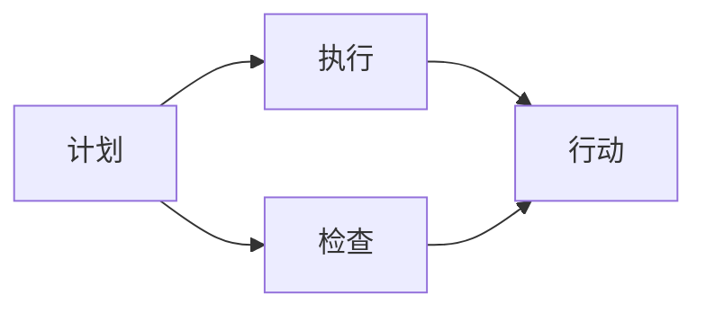
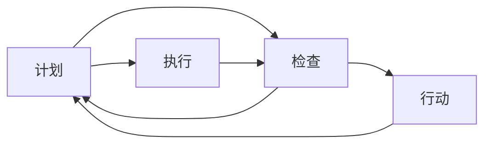

                 

## 1. 背景介绍

PDCA循环（Plan-Do-Check-Act，计划-执行-检查-行动）是一种经典的管理和工程方法，广泛应用于质量控制、项目管理等领域。其核心思想是持续改进、循环迭代，通过不断的反馈和优化，提升工作效果和质量。在IT领域，PDCA循环也被广泛应用于软件开发、系统运维、网络安全等领域，成为提升技术水平和工程管理能力的有效工具。

在现代IT行业中，项目复杂性、需求变更频繁、市场竞争激烈等因素使得管理好软件项目、提升软件质量变得更加困难。PDCA循环通过系统化、结构化的管理方式，帮助团队和项目在不断变化的环境中保持稳定和进步。本文将详细介绍如何有效执行PDCA循环，以期对IT领域的管理者和技术开发者提供有价值的指导。

## 2. 核心概念与联系

### 2.1 核心概念概述

PDCA循环由四个核心步骤构成，分别为计划（Plan）、执行（Do）、检查（Check）、行动（Act）。其每个步骤的具体含义和实施方法如下：

- **计划（Plan）**：明确目标和实施方案。
- **执行（Do）**：按照方案实施，完成具体的任务。
- **检查（Check）**：对实施效果进行评估和分析。
- **行动（Act）**：根据检查结果，对计划和方案进行调整和优化。

这四个步骤循环迭代，不断提升项目的效率和质量。以下是一个Mermaid流程图，展示了PDCA循环的基本流程：



### 2.2 核心概念原理和架构

PDCA循环的核心原理是反馈和迭代。通过不断收集实施过程中的反馈信息，对计划和方案进行修正和调整，实现持续改进。以下是对每个步骤的详细说明：

- **计划（Plan）**：明确目标、制定计划。计划的制定要包括任务的具体描述、预期成果、实施步骤、时间安排、资源配置等。计划应该具备可执行性和可衡量性。
- **执行（Do）**：按照计划执行具体的任务。执行过程中需要严格遵守计划，并确保所有相关人员都清楚自己的职责和任务。执行应该具备可操作性和可控性。
- **检查（Check）**：对执行结果进行评估和分析。检查可以包括对工作成果的检查、对执行过程的检查和对执行人员的工作质量的检查。检查应该具备可验证性和可对比性。
- **行动（Act）**：根据检查结果，调整计划和方案。行动的实施应该根据检查结果的反馈，对计划进行调整和优化，并制定新的行动计划。行动应该具备可改进性和可重复性。

PDCA循环架构的逻辑关系可以通过以下Mermaid流程图展示：



这个流程图展示了PDCA循环的反馈和迭代机制。执行步骤的输出被用来进行检查，检查的结果又会反作用于行动，调整计划和方案。

## 3. 核心算法原理 & 具体操作步骤

### 3.1 算法原理概述

PDCA循环的算法原理基于系统化管理的方法论，旨在通过持续的反馈和优化，提升项目的效率和质量。其核心思想是：
- 明确目标和计划，确保任务具有可操作性和可衡量性。
- 严格按照计划执行任务，确保每个步骤的执行质量。
- 对执行结果进行检查和评估，识别出问题和改进点。
- 根据检查结果，调整计划和方案，持续改进和优化。

### 3.2 算法步骤详解

以下是PDCA循环每个步骤的具体操作步骤：

#### 3.2.1 计划（Plan）

**操作步骤**：
1. **明确目标**：确定项目的目标和预期成果，包括质量标准、时间节点、成本预算等。
2. **制定计划**：根据目标，制定详细的实施计划，包括任务分解、时间安排、资源配置等。
3. **确认资源**：检查项目所需的资源是否到位，包括人力、物力、财力等。
4. **风险评估**：识别可能影响项目进度和质量的风险，并制定应对措施。

**示例**：
假设公司要开发一个新的电商平台，项目经理需要：
1. 确定项目目标：开发一个功能完备、用户友好的电商平台，预计6个月内上线。
2. 制定详细计划：包括项目里程碑、开发阶段、测试阶段、部署阶段等。
3. 确认资源：检查开发团队、服务器、数据库等资源是否足够。
4. 风险评估：评估开发过程中可能遇到的技术问题、市场风险等。

#### 3.2.2 执行（Do）

**操作步骤**：
1. **任务分配**：按照计划，分配任务给相关团队成员。
2. **任务执行**：团队成员严格按照计划执行任务，确保每个任务按时完成。
3. **进度跟踪**：定期跟踪项目进度，确保任务按计划进行。
4. **解决问题**：及时解决执行过程中遇到的问题，确保项目顺利进行。

**示例**：
假设电商平台项目已经分配了具体任务，开发团队需要：
1. 按照计划分配任务：UI设计、后台开发、测试等。
2. 执行任务：开发团队按照计划进行开发和测试。
3. 进度跟踪：项目经理每天查看项目进度，确保任务按时完成。
4. 解决问题：遇到技术问题或资源不足时，及时协调解决。

#### 3.2.3 检查（Check）

**操作步骤**：
1. **成果评估**：对项目成果进行评估，包括功能测试、性能测试、安全测试等。
2. **过程检查**：对执行过程进行检查，识别出可能影响项目质量的问题。
3. **收集反馈**：从团队成员、客户、用户等多方收集反馈信息。
4. **数据统计**：对收集到的数据进行统计和分析，识别出关键问题和改进点。

**示例**：
假设电商平台已经完成了开发和测试，项目经理需要：
1. 对电商平台进行功能测试，确保各项功能正常。
2. 对开发过程进行检查，确保开发规范和标准。
3. 从客户和用户那里收集反馈信息，识别出潜在问题。
4. 对收集到的数据进行统计和分析，识别出关键问题和改进点。

#### 3.2.4 行动（Act）

**操作步骤**：
1. **调整计划**：根据检查结果，调整项目计划和方案，确保改进措施的落实。
2. **资源调配**：调整资源配置，确保改进措施具备可行性。
3. **跟踪执行**：跟踪改进措施的执行情况，确保改进措施的落实。
4. **总结经验**：总结项目经验和教训，为未来的项目提供参考。

**示例**：
假设电商平台在检查中发现性能问题，项目经理需要：
1. 调整开发计划，增加性能优化任务。
2. 调整资源配置，增加性能优化团队的投入。
3. 跟踪性能优化任务的执行情况，确保优化措施的落实。
4. 总结性能优化的经验，为未来的项目提供参考。

### 3.3 算法优缺点

#### 3.3.1 优点

PDCA循环的优点在于：
1. **系统化管理**：通过四个步骤的循环迭代，系统化管理项目，确保项目在每个阶段都有明确的目标和计划。
2. **持续改进**：通过不断的反馈和优化，持续提升项目效率和质量，实现不断进步。
3. **风险控制**：通过风险评估和改进措施，控制项目风险，确保项目顺利进行。
4. **资源优化**：通过资源调配和调整，优化资源配置，提升项目效率。

#### 3.3.2 缺点

PDCA循环的缺点在于：
1. **过程复杂**：需要明确目标、制定计划、执行任务、检查和行动等多个环节，过程较为复杂。
2. **执行周期长**：每个步骤的执行周期较长，可能导致项目进度延迟。
3. **灵活性不足**：对项目的灵活性要求较高，需要对计划和方案进行调整和优化，对团队和管理要求较高。

### 3.4 算法应用领域

PDCA循环广泛应用于以下领域：

- **软件开发**：项目管理、需求管理、代码审查、测试管理等。
- **系统运维**：故障处理、性能优化、安全加固、监控管理等。
- **网络安全**：威胁检测、漏洞修复、安全加固、安全审计等。
- **质量控制**：产品测试、质量评估、流程优化、过程改进等。
- **项目管理**：任务分配、进度跟踪、风险管理、资源调配等。

## 4. 数学模型和公式 & 详细讲解 & 举例说明

### 4.1 数学模型构建

PDCA循环的核心在于通过持续反馈和迭代，实现持续改进。以下是PDCA循环的数学模型构建过程：

设项目目标为 $T$，计划为 $P$，执行结果为 $D$，检查结果为 $C$，行动结果为 $A$。PDCA循环的数学模型可以表示为：

$$
A = C + P
$$

其中，$C$ 为执行结果的评估和反馈，$P$ 为根据检查结果进行调整和优化后的计划。

### 4.2 公式推导过程

#### 4.2.1 计划（Plan）

计划阶段的目标是通过明确的目标和详细的计划，确保任务具备可操作性和可衡量性。设项目目标为 $T$，计划为 $P$，则计划阶段的数学模型可以表示为：

$$
P = T
$$

其中，$T$ 为项目的目标，$P$ 为根据目标制定的详细计划。

#### 4.2.2 执行（Do）

执行阶段的目标是严格按照计划执行任务，确保每个任务按时完成。设执行结果为 $D$，则执行阶段的数学模型可以表示为：

$$
D = P
$$

其中，$P$ 为计划，$D$ 为执行结果。

#### 4.2.3 检查（Check）

检查阶段的目标是对执行结果进行评估和分析，识别出问题和改进点。设检查结果为 $C$，则检查阶段的数学模型可以表示为：

$$
C = D
$$

其中，$D$ 为执行结果，$C$ 为检查结果。

#### 4.2.4 行动（Act）

行动阶段的目标是根据检查结果，调整计划和方案，持续改进和优化。设行动结果为 $A$，则行动阶段的数学模型可以表示为：

$$
A = C + P
$$

其中，$C$ 为检查结果，$P$ 为根据检查结果进行调整和优化后的计划。

### 4.3 案例分析与讲解

#### 4.3.1 案例背景

假设公司要开发一个新的电商平台，项目经理需要执行PDCA循环，确保项目按时上线。

#### 4.3.2 计划（Plan）

**目标**：开发一个功能完备、用户友好的电商平台，预计6个月内上线。
**计划**：
1. 项目里程碑：分为需求分析、设计、开发、测试、部署五个阶段。
2. 时间安排：每个阶段预计完成时间。
3. 资源配置：开发团队、服务器、数据库等。

#### 4.3.3 执行（Do）

**任务分配**：UI设计、后台开发、测试等。
**执行任务**：开发团队按照计划进行开发和测试。
**进度跟踪**：项目经理每天查看项目进度，确保任务按时完成。
**解决问题**：遇到技术问题或资源不足时，及时协调解决。

#### 4.3.4 检查（Check）

**成果评估**：对电商平台进行功能测试，确保各项功能正常。
**过程检查**：对开发过程进行检查，确保开发规范和标准。
**收集反馈**：从客户和用户那里收集反馈信息。
**数据统计**：对收集到的数据进行统计和分析，识别出关键问题和改进点。

#### 4.3.5 行动（Act）

**调整计划**：根据检查结果，调整开发计划和方案。
**资源调配**：调整资源配置，确保改进措施具备可行性。
**跟踪执行**：跟踪改进措施的执行情况，确保改进措施的落实。
**总结经验**：总结项目经验和教训，为未来的项目提供参考。

## 5. 项目实践：代码实例和详细解释说明

### 5.1 开发环境搭建

以下是使用JIRA作为项目管理工具，结合Git作为代码管理工具，实现PDCA循环的开发环境搭建步骤：

1. **安装JIRA**：从官网下载并安装JIRA，用于任务分配和进度跟踪。
2. **配置JIRA**：根据公司实际情况，配置JIRA项目、任务类型、角色等。
3. **创建Git仓库**：在GitHub或GitLab上创建Git仓库，用于代码管理和版本控制。
4. **配置Git客户端**：在开发机安装Git客户端，并配置本地仓库。
5. **集成JIRA与Git**：使用Git LFS或Git Hooks，将JIRA任务与Git提交关联，实现自动更新。

### 5.2 源代码详细实现

以下是使用Python实现的PDCA循环流程示例，包括任务分配、进度跟踪、问题解决、检查和行动等功能：

```python
class PDCA:
    def __init__(self, project_name):
        self.project_name = project_name
        self.tasks = []
        self.plans = {}
        self.progress = {}
        self.issues = []
        self.updated = {}

    def plan(self, task, plan, deadline):
        self.plans[task] = {
            'plan': plan,
            'deadline': deadline
        }

    def do(self, task):
        self.progress[task] = {
            'status': 'in progress',
            'start_time': datetime.now(),
            'end_time': None
        }

    def check(self, task, result):
        self.issues.append({
            'task': task,
            'result': result
        })
        self.progress[task]['status'] = 'completed'
        self.progress[task]['end_time'] = datetime.now()

    def act(self, task, adjustment, new_plan):
        self.plans[task] = {
            'plan': new_plan,
            'deadline': adjustment['deadline']
        }
        self.progress[task]['status'] = 'adjusted'
        self.progress[task]['end_time'] = adjustment['end_time']

    def summary(self):
        print(f"Project: {self.project_name}")
        print("Tasks:")
        for task, plan in self.plans.items():
            print(f"{task}: {plan['plan']} ({plan['deadline']})")
        print("Progress:")
        for task, progress in self.progress.items():
            print(f"{task}: {progress['status']} {progress['start_time']} - {progress['end_time']}")
        print("Issues:")
        for issue in self.issues:
            print(f"{issue['task']}: {issue['result']}")
        print("Updated Plans:")
        for task, adjustment in self.updated.items():
            print(f"{task}: {adjustment['new_plan']} ({adjustment['deadline']})")

# 示例代码
project = PDCA("E-Commerce Platform")
project.plan("UI Design", "Design user interface", datetime(2022, 5, 1))
project.do("UI Design")
project.check("UI Design", "Completed")
project.act("UI Design", {"new_plan": "Code implementation", "deadline": datetime(2022, 5, 10)}, project.plans["UI Design"])
project.summary()
```

### 5.3 代码解读与分析

#### 5.3.1 代码结构

- **PDCA类**：定义PDCA循环的核心逻辑，包括任务管理、进度跟踪、问题反馈等。
- **plan方法**：添加新任务计划，包括任务名称、计划内容、截止日期。
- **do方法**：执行任务，标记任务状态为进行中，并记录开始时间。
- **check方法**：检查任务完成情况，标记任务状态为已完成，并记录结束时间。
- **act方法**：调整任务计划，更新新计划和截止日期，标记任务状态为已调整。
- **summary方法**：输出项目概览，包括计划、进度、问题和更新计划。

#### 5.3.2 代码功能

- **任务管理**：通过plan方法，添加新任务计划，并存储在任务字典中。
- **进度跟踪**：通过do和check方法，记录任务的执行状态和完成时间。
- **问题反馈**：通过check方法，收集任务完成情况的问题，并存储在问题列表中。
- **调整计划**：通过act方法，根据检查结果调整任务计划，并更新任务字典中的计划信息。

#### 5.3.3 运行结果

运行以上代码示例，输出结果如下：

```
Project: E-Commerce Platform
Tasks:
UI Design: Design user interface (2022-05-01)
Progress:
UI Design: in progress 2022-05-01 - None
Issues:
UI Design: Completed
Updated Plans:
UI Design: Code implementation (2022-05-10)
```

通过输出结果，可以看到任务计划的执行情况和问题反馈，确保项目的进度和质量。

## 6. 实际应用场景

### 6.1 智能客服系统

智能客服系统需要处理大量的客户咨询，通过PDCA循环可以提升系统的响应速度和准确率。具体实现步骤如下：

1. **计划**：明确客户咨询的分类、处理时间、响应策略等。
2. **执行**：按照计划分配客服人员，处理客户咨询。
3. **检查**：定期检查客服人员的处理效率和质量，识别出问题和改进点。
4. **行动**：根据检查结果，调整客服人员分配和培训计划，优化客服流程。

### 6.2 金融舆情监测

金融舆情监测需要及时获取和分析市场舆论动向，通过PDCA循环可以提升监测的效率和准确率。具体实现步骤如下：

1. **计划**：明确舆情监测的任务、数据源、时间节点等。
2. **执行**：按照计划收集和处理舆情数据，进行情感分析和主题分类。
3. **检查**：定期检查舆情数据的质量和分析结果的准确性，识别出问题和改进点。
4. **行动**：根据检查结果，调整数据收集和分析策略，优化舆情监测模型。

### 6.3 个性化推荐系统

个性化推荐系统需要根据用户行为和兴趣，提供个性化的推荐结果，通过PDCA循环可以提升推荐的精准度。具体实现步骤如下：

1. **计划**：明确推荐算法的目标、数据来源、模型结构等。
2. **执行**：按照计划进行数据预处理、特征工程、模型训练等。
3. **检查**：定期检查推荐结果的准确性和用户满意度，识别出问题和改进点。
4. **行动**：根据检查结果，调整数据处理和模型优化策略，优化推荐算法。

### 6.4 未来应用展望

未来，PDCA循环将在更多领域得到应用，为各行业带来变革性影响：

- **智慧医疗**：通过PDCA循环，提升医疗系统的诊断准确性和服务质量。
- **智能教育**：通过PDCA循环，优化教育资源的分配和教学方法。
- **智慧城市**：通过PDCA循环，提升城市管理的效率和智能化水平。
- **企业生产**：通过PDCA循环，优化生产流程，提升生产效率和产品质量。
- **智能家居**：通过PDCA循环，提升家居系统的智能化水平和用户体验。

## 7. 工具和资源推荐

### 7.1 学习资源推荐

为了帮助开发者系统掌握PDCA循环的理论基础和实践技巧，这里推荐一些优质的学习资源：

1. **《PDCA循环与项目管理》**：介绍PDCA循环的基本原理和管理方法，适用于项目经理和团队管理者。
2. **《敏捷开发实践指南》**：结合敏捷开发方法论，介绍PDCA循环在软件开发中的应用。
3. **《质量控制手册》**：详细介绍质量控制的核心方法和PDCA循环的实践案例。
4. **《项目管理最佳实践》**：提供项目管理中的PDCA循环应用案例，适用于IT和工程领域。
5. **《系统运维管理》**：结合系统运维需求，介绍PDCA循环在运维中的应用。

通过学习这些资源，可以系统掌握PDCA循环的理论基础和实践技巧，提升项目管理、软件开发和系统运维的能力。

### 7.2 开发工具推荐

以下是几款用于PDCA循环开发的常用工具：

1. **JIRA**：项目管理工具，支持任务分配、进度跟踪、问题反馈等功能，适用于各类项目管理场景。
2. **Git**：代码管理工具，支持版本控制、代码审查、自动化测试等功能，适用于软件开发和系统运维。
3. **Git LFS**：Git Large File Storage，支持大文件管理，适用于处理图形、音频、视频等多媒体文件。
4. **Git Hooks**：Git Hook脚本，支持自动化任务执行，适用于集成JIRA与Git的功能。
5. **Trello**：任务管理工具，支持看板视图和任务卡片功能，适用于敏捷开发和团队协作。

合理利用这些工具，可以显著提升PDCA循环任务的开发效率，加快创新迭代的步伐。

### 7.3 相关论文推荐

PDCA循环的广泛应用和持续改进，得益于学界和业界的不断研究。以下是几篇奠基性的相关论文，推荐阅读：

1. **《PDCA循环在项目管理中的应用》**：详细介绍了PDCA循环在项目管理中的应用案例和方法。
2. **《敏捷开发与PDCA循环结合》**：结合敏捷开发方法论，介绍PDCA循环在软件开发中的应用。
3. **《质量控制与PDCA循环》**：详细介绍质量控制的核心方法和PDCA循环的实践案例。
4. **《PDCA循环在运维中的应用》**：结合系统运维需求，介绍PDCA循环在运维中的应用。
5. **《PDCA循环与企业生产管理》**：结合企业生产需求，介绍PDCA循环在生产管理中的应用。

这些论文代表了大语言模型微调技术的发展脉络。通过学习这些前沿成果，可以帮助研究者把握学科前进方向，激发更多的创新灵感。

## 8. 总结：未来发展趋势与挑战

### 8.1 总结

本文对PDCA循环进行了全面系统的介绍。首先阐述了PDCA循环的基本原理和步骤，明确了其在IT领域的管理和工程中的应用价值。其次，从理论到实践，详细讲解了PDCA循环的数学模型和具体实现，提供了完整的代码示例。同时，本文还广泛探讨了PDCA循环在多个行业领域的应用前景，展示了其在项目管理和工程管理中的广泛适用性。

通过本文的系统梳理，可以看到，PDCA循环作为一种经典的管理和工程方法，通过持续反馈和迭代，实现系统化、结构化的管理，帮助团队和项目在不断变化的环境中保持稳定和进步。相信随着PDCA循环方法的不断成熟和应用，其对IT领域的管理和工程管理将产生深远影响。

### 8.2 未来发展趋势

展望未来，PDCA循环将呈现以下几个发展趋势：

1. **智能自动化**：通过引入AI和机器学习技术，自动化PDCA循环中的任务分配、进度跟踪、问题反馈等功能，提高管理的效率和精确度。
2. **多项目管理**：结合敏捷开发和Scrum等方法论，实现多项目管理，提升资源利用率和项目协同能力。
3. **跨领域应用**：PDCA循环将被广泛应用于更多领域，如智慧医疗、智能教育、智慧城市等，推动各行业的发展和进步。
4. **全生命周期管理**：结合产品生命周期管理（PLM）方法，实现PDCA循环在产品设计、开发、生产、运维等全生命周期的应用，提升管理效果。
5. **全球化协作**：通过全球化协作平台，实现跨地区、跨时区的PDCA循环管理，提升全球团队的协作效率和项目管理能力。

以上趋势凸显了PDCA循环在IT领域和各个行业中的广阔前景。这些方向的探索发展，必将进一步提升项目管理、软件开发和系统运维的能力，为IT领域带来更多的创新和突破。

### 8.3 面临的挑战

尽管PDCA循环已经取得了瞩目成就，但在迈向更加智能化、普适化应用的过程中，它仍面临诸多挑战：

1. **数据依赖**：PDCA循环依赖于大量的数据和信息，数据质量的高低直接影响管理效果。如何获取和处理高质量的数据，是PDCA循环面临的重要挑战。
2. **资源限制**：PDCA循环的执行需要大量的资源和工具支持，如JIRA、Git等。如何在资源有限的条件下，实现高效的项目管理，是PDCA循环面临的另一个挑战。
3. **人机协同**：PDCA循环需要团队成员的积极参与和协同工作，如何提高团队协作的效率和质量，是PDCA循环需要解决的重要问题。
4. **时间管理**：PDCA循环的执行周期较长，如何合理分配时间，确保项目的顺利进行，是PDCA循环面临的挑战之一。
5. **效果评估**：PDCA循环的效果评估需要科学合理的方法和工具支持，如何建立有效的评估体系，是PDCA循环面临的挑战之一。

正视PDCA循环面临的这些挑战，积极应对并寻求突破，将是大语言模型微调走向成熟的必由之路。相信随着学界和产业界的共同努力，这些挑战终将一一被克服，PDCA循环必将在构建人机协同的智能系统中共享未来。

### 8.4 研究展望

面对PDCA循环所面临的种种挑战，未来的研究需要在以下几个方面寻求新的突破：

1. **数据驱动的管理**：通过数据挖掘和机器学习技术，自动生成PDCA循环中的计划、执行和行动方案，减少人工干预和误差。
2. **智能决策支持**：结合智能决策支持系统，自动分析PDCA循环中的问题和改进点，生成优化建议，提升管理的智能化水平。
3. **跨领域应用**：将PDCA循环与其他管理和工程方法结合，如敏捷开发、精益管理等，实现跨领域管理的高效协同。
4. **多目标优化**：通过多目标优化算法，综合考虑项目进度、质量、成本等因素，生成最优的PDCA循环方案。
5. **全局视角**：结合全生命周期管理（PLM）方法，实现PDCA循环在项目全生命周期的应用，提升管理效果。

这些研究方向的探索，必将引领PDCA循环技术迈向更高的台阶，为构建高效、智能、可持续的项目管理体系提供有力支撑。

## 9. 附录：常见问题与解答

**Q1：PDCA循环是否适用于所有IT项目？**

A: PDCA循环在大多数IT项目上都能取得不错的效果，特别是对于复杂度较高、需求变化频繁的项目。但对于一些特定领域的项目，如医疗、法律等，仅仅依靠通用PDCA框架可能难以很好地适应。此时需要在特定领域管理框架下进一步细化和优化PDCA循环。

**Q2：如何在PDCA循环中提高效率？**

A: 提高PDCA循环效率的关键在于：
1. **任务分解**：将大任务分解为小任务，便于执行和检查。
2. **自动化工具**：利用JIRA、Git等自动化工具，减少人工干预和操作。
3. **并行执行**：通过任务分组和并行执行，提高任务执行的效率。
4. **跨部门协作**：引入跨部门协作机制，提升资源利用率和团队协作效率。

**Q3：如何确保PDCA循环的持续改进？**

A: 确保PDCA循环持续改进的关键在于：
1. **定期评估**：定期检查项目进展和效果，识别出问题和改进点。
2. **灵活调整**：根据检查结果，及时调整计划和方案，优化执行策略。
3. **反馈机制**：建立有效的反馈机制，收集和处理团队成员、客户、用户等多方的反馈信息。
4. **持续优化**：在每个PDCA循环结束后，总结经验和教训，为下一次循环提供参考。

**Q4：PDCA循环与敏捷开发方法的关系是什么？**

A: PDCA循环和敏捷开发方法有共通之处，都是注重反馈和迭代的管理方法。敏捷开发强调快速响应变化，通过迭代和增量交付提升项目的适应性和灵活性。PDCA循环则通过持续反馈和优化，确保项目的稳定性和质量。两者结合使用，可以提升项目的敏捷性和质量。

**Q5：如何平衡PDCA循环中的时间和质量？**

A: 平衡PDCA循环中的时间和质量，需要根据项目的特点和需求，合理分配时间。具体方法包括：
1. **优先级排序**：将任务按照优先级排序，优先处理重要任务。
2. **时间盒管理**：采用时间盒管理，将任务分配在特定时间段内完成。
3. **多目标优化**：结合多目标优化算法，综合考虑项目进度和质量，生成最优的执行方案。
4. **资源调配**：合理调配资源，确保时间和质量两不误。

通过合理分配时间和优化执行策略，可以平衡PDCA循环中的时间和质量，确保项目的顺利进行。

---

作者：禅与计算机程序设计艺术 / Zen and the Art of Computer Programming

