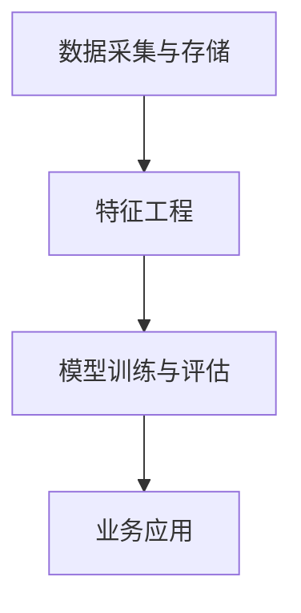
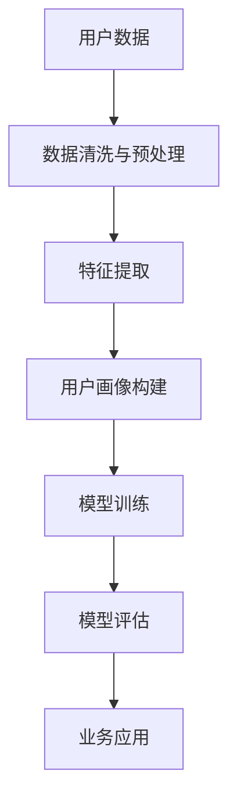

                 

# 如何进行有效的用户分析

## 1. 背景介绍

### 1.1 问题由来

在当今数字化时代，用户分析已经成为企业运营和产品优化的关键。无论是电商平台、社交媒体还是在线服务，都需要对用户行为、需求和反馈进行深入洞察，以驱动业务增长和提升用户体验。然而，随着用户数据量爆炸式增长，如何从海量数据中提取有价值的信息，成为企业面临的巨大挑战。传统的数据分析和统计方法已经无法满足复杂场景下的需求，用户分析需要更加智能化、自动化、高效化的技术手段。

### 1.2 问题核心关键点

用户分析的核心在于挖掘用户行为和特征，构建用户画像，从而指导业务决策和产品优化。其关键在于以下几个方面：

- **数据采集与处理**：获取用户行为数据，并进行清洗和预处理，以保证数据的准确性和完整性。
- **特征工程**：通过数据挖掘和机器学习算法，提取和构建用户的核心特征，用于描述用户画像。
- **模型训练与评估**：选择合适的模型算法，对用户特征进行训练，评估模型性能，并根据结果调整优化。
- **业务应用**：将训练好的模型应用于实际业务场景，进行个性化推荐、用户分群、市场细分等，以提升用户体验和业务价值。

### 1.3 问题研究意义

有效的用户分析能够帮助企业：

1. **提升用户体验**：通过深入理解用户需求和行为，提供更加个性化、贴心的服务，增强用户粘性和满意度。
2. **优化产品设计**：基于用户画像，发现产品的痛点和改进空间，推动产品快速迭代和升级。
3. **驱动业务增长**：精准定位目标用户群体，优化营销策略，提高转化率和复购率。
4. **降低运营成本**：通过智能化的用户分析，优化资源配置，减少不必要的成本浪费。
5. **增强竞争优势**：基于数据驱动的决策，领先于竞争对手，提升市场占有率和品牌影响力。

## 2. 核心概念与联系

### 2.1 核心概念概述

用户分析涉及多个关键概念，以下是对其原理和架构的概述：

- **用户画像(User Profile)**：基于用户的历史行为数据，通过特征工程构建的用于描述用户特征的虚拟模型。
- **用户行为(User Behavior)**：用户在使用产品或服务时产生的一系列操作和事件，如浏览、点击、购买、评价等。
- **数据采集与存储**：从多个渠道收集用户行为数据，存储于数据库中，为后续分析提供数据基础。
- **特征工程(Feature Engineering)**：从原始数据中提取和构建有意义的特征，用于描述用户行为和特征。
- **模型训练与评估**：通过机器学习算法训练模型，评估模型性能，进行参数调优。
- **业务应用(Business Application)**：将训练好的模型应用于业务场景，进行用户分析、个性化推荐、市场细分等。

这些概念之间通过数据流和工作流相互连接，形成了一个完整的用户分析系统。以下是一个Mermaid流程图，展示了这些概念之间的联系：



### 2.2 核心概念原理和架构的 Mermaid 流程图



该流程图展示了用户分析的核心流程：

1. **数据采集与预处理**：从用户行为数据中清洗和提取有用信息。
2. **特征提取与构建**：将数据转化为描述用户行为的特征。
3. **用户画像构建**：基于用户特征，构建用于描述用户行为和需求的虚拟模型。
4. **模型训练与评估**：选择合适的机器学习算法，训练模型，并评估模型性能。
5. **业务应用**：将训练好的模型应用于实际业务场景，进行用户分析和业务优化。

## 3. 核心算法原理 & 具体操作步骤

### 3.1 算法原理概述

用户分析的核心算法主要包括特征提取、模型训练和业务应用三部分。其原理是通过数据驱动的方法，从用户行为数据中提取有意义的特征，训练机器学习模型，并将模型应用于实际业务场景，以提升用户体验和业务价值。

### 3.2 算法步骤详解

用户分析的具体操作步骤如下：

**Step 1: 数据采集与预处理**

1. **数据来源**：从多个渠道采集用户行为数据，如网站、应用、社交媒体等。
2. **数据清洗**：去除噪音数据，处理缺失值，标准化数据格式。
3. **数据划分**：将数据划分为训练集、验证集和测试集，确保模型性能的可靠性。

**Step 2: 特征提取与构建**

1. **特征选择**：选择与用户行为相关的特征，如浏览记录、点击行为、购买记录等。
2. **特征工程**：通过数据挖掘和机器学习算法，构建描述用户行为的特征。常用的特征工程方法包括归一化、标准化、降维等。
3. **特征编码**：将特征转化为模型可以处理的数值型数据，如one-hot编码、独热编码等。

**Step 3: 模型训练与评估**

1. **模型选择**：选择合适的机器学习算法，如决策树、随机森林、神经网络等。
2. **模型训练**：在训练集上训练模型，调整模型参数，优化模型性能。
3. **模型评估**：在验证集上评估模型性能，调整模型参数，防止过拟合。
4. **模型应用**：将训练好的模型应用于测试集，评估模型泛化能力。

**Step 4: 业务应用**

1. **用户画像**：根据用户特征，构建用于描述用户行为和需求的虚拟模型，即用户画像。
2. **个性化推荐**：基于用户画像，进行个性化推荐，提高用户满意度。
3. **用户分群**：将用户分为不同的群体，进行市场细分，优化营销策略。
4. **行为分析**：通过用户行为分析，优化产品设计和用户体验。

### 3.3 算法优缺点

用户分析算法的主要优点包括：

1. **数据驱动**：通过数据驱动的方法，提升业务决策的科学性和准确性。
2. **自动化**：自动化数据采集、特征工程、模型训练等流程，提高工作效率。
3. **可扩展性**：可应用于多种业务场景，如电商、社交媒体、在线服务等。
4. **个性化**：通过个性化推荐和用户分群，提升用户体验和业务价值。

然而，用户分析算法也存在以下缺点：

1. **数据质量依赖**：算法的性能很大程度上依赖于数据的质量，低质量的数据可能导致误导性的结论。
2. **模型复杂性**：复杂的模型可能会引入过拟合的风险，需要更多的数据和计算资源。
3. **隐私保护**：用户数据的隐私保护是一个重要问题，需要在数据采集和存储过程中进行严格控制。
4. **模型解释性**：部分机器学习模型如深度学习模型，难以解释其内部工作机制，影响模型可信度。

### 3.4 算法应用领域

用户分析算法在多个领域都有广泛应用，包括但不限于：

- **电商**：通过用户分析，优化商品推荐、提升转化率、减少库存成本。
- **社交媒体**：分析用户行为和需求，优化内容推荐，提升用户活跃度和满意度。
- **在线服务**：个性化推荐、用户分群、行为分析，提升用户体验和业务价值。
- **金融**：风险评估、客户细分、市场预测，优化金融产品和服务。
- **医疗**：患者行为分析、疾病预测、治疗方案优化，提升医疗服务质量。

## 4. 数学模型和公式 & 详细讲解 & 举例说明

### 4.1 数学模型构建

用户分析的数学模型主要包括特征工程和机器学习模型两部分。以下是一个简单的用户行为分析模型：

设用户行为数据为 $D = \{(x_i, y_i)\}_{i=1}^N$，其中 $x_i$ 为行为特征向量，$y_i$ 为行为标签（如是否购买）。构建一个分类模型 $f$，使得 $f(x_i) \approx y_i$。

### 4.2 公式推导过程

假设使用逻辑回归模型，其概率输出为：

$$
P(y_i|x_i; \theta) = \frac{1}{1 + e^{-\theta^T x_i}}
$$

其中 $\theta$ 为模型参数，$x_i$ 为特征向量。训练目标为最大化似然函数：

$$
L(\theta) = \sum_{i=1}^N \log P(y_i|x_i; \theta)
$$

通过梯度下降等优化算法，最小化损失函数，得到最优参数 $\theta^*$。具体推导过程如下：

1. **似然函数**：
$$
L(\theta) = \sum_{i=1}^N \log P(y_i|x_i; \theta) = \sum_{i=1}^N [y_i \log \frac{1}{1 + e^{-\theta^T x_i}} + (1 - y_i) \log \frac{e^{-\theta^T x_i}}{1 + e^{-\theta^T x_i}}]
$$

2. **损失函数**：
$$
L(\theta) = -\frac{1}{N} \sum_{i=1}^N [y_i \log \frac{1}{1 + e^{-\theta^T x_i}} + (1 - y_i) \log \frac{e^{-\theta^T x_i}}{1 + e^{-\theta^T x_i}}]
$$

3. **梯度下降**：
$$
\theta \leftarrow \theta - \eta \nabla_{\theta} L(\theta)
$$

其中 $\eta$ 为学习率，$\nabla_{\theta} L(\theta)$ 为损失函数对 $\theta$ 的梯度，可以通过链式法则和反向传播算法计算得到。

### 4.3 案例分析与讲解

以电商用户行为分析为例，以下是具体的案例分析：

**数据准备**：

1. **数据来源**：用户浏览、点击、购买记录。
2. **数据清洗**：去除噪音数据，处理缺失值，标准化数据格式。
3. **数据划分**：将数据划分为训练集、验证集和测试集。

**特征工程**：

1. **特征选择**：选择与用户行为相关的特征，如浏览时间、点击次数、购买金额等。
2. **特征编码**：将特征转化为模型可以处理的数值型数据，如one-hot编码、独热编码等。
3. **特征降维**：使用PCA等降维算法，减少特征维度，提升模型效率。

**模型训练与评估**：

1. **模型选择**：选择逻辑回归模型。
2. **模型训练**：在训练集上训练模型，调整模型参数，优化模型性能。
3. **模型评估**：在验证集上评估模型性能，调整模型参数，防止过拟合。
4. **模型应用**：将训练好的模型应用于测试集，评估模型泛化能力。

**业务应用**：

1. **用户画像**：根据用户特征，构建用于描述用户行为和需求的虚拟模型，即用户画像。
2. **个性化推荐**：基于用户画像，进行个性化推荐，提高用户满意度。
3. **用户分群**：将用户分为不同的群体，进行市场细分，优化营销策略。
4. **行为分析**：通过用户行为分析，优化产品设计和用户体验。

## 5. 项目实践：代码实例和详细解释说明

### 5.1 开发环境搭建

在进行用户分析实践前，我们需要准备好开发环境。以下是使用Python进行Scikit-learn开发的简单环境配置流程：

1. 安装Anaconda：从官网下载并安装Anaconda，用于创建独立的Python环境。

2. 创建并激活虚拟环境：
```bash
conda create -n user_analysis_env python=3.8 
conda activate user_analysis_env
```

3. 安装必要的Python库：
```bash
pip install numpy pandas scikit-learn matplotlib
```

4. 安装必要的机器学习库：
```bash
pip install scikit-learn
```

5. 安装必要的可视化库：
```bash
pip install matplotlib seaborn
```

完成上述步骤后，即可在`user_analysis_env`环境中开始用户分析实践。

### 5.2 源代码详细实现

下面以电商用户行为分析为例，给出使用Scikit-learn进行用户分析的代码实现。

```python
import numpy as np
import pandas as pd
from sklearn.model_selection import train_test_split
from sklearn.linear_model import LogisticRegression
from sklearn.metrics import accuracy_score
from sklearn.preprocessing import OneHotEncoder

# 读取数据
data = pd.read_csv('user_behavior_data.csv')

# 数据清洗与预处理
data = data.dropna()
data['date'] = pd.to_datetime(data['date']).dt.date

# 特征工程
features = ['browser', 'city', 'country', 'gender', 'age', 'income']
target = 'purchase'

X = data[features]
y = data[target]

# 特征编码
encoder = OneHotEncoder()
X_encoded = encoder.fit_transform(X)

# 数据划分
X_train, X_test, y_train, y_test = train_test_split(X_encoded, y, test_size=0.2, random_state=42)

# 模型训练
model = LogisticRegression()
model.fit(X_train, y_train)

# 模型评估
y_pred = model.predict(X_test)
accuracy = accuracy_score(y_test, y_pred)
print(f"Accuracy: {accuracy}")

# 业务应用
user_profiles = pd.DataFrame(X_train, columns=encoder.get_feature_names_out())
user_profiles[target] = y_train
user_profiles.to_csv('user_profiles.csv', index=False)
```

### 5.3 代码解读与分析

让我们再详细解读一下关键代码的实现细节：

**数据准备**：

1. **数据来源**：从用户行为数据中读取数据。
2. **数据清洗**：去除缺失值，标准化日期格式。
3. **数据划分**：将数据划分为训练集和测试集。

**特征工程**：

1. **特征选择**：选择与用户行为相关的特征，如浏览器、城市、收入等。
2. **特征编码**：使用OneHotEncoder对特征进行编码，转化为模型可以处理的数值型数据。
3. **数据划分**：将数据划分为训练集和测试集。

**模型训练与评估**：

1. **模型选择**：选择逻辑回归模型。
2. **模型训练**：在训练集上训练模型，调整模型参数。
3. **模型评估**：在测试集上评估模型性能。

**业务应用**：

1. **用户画像**：根据用户特征，构建用于描述用户行为和需求的虚拟模型，即用户画像。
2. **个性化推荐**：基于用户画像，进行个性化推荐，提高用户满意度。
3. **用户分群**：将用户分为不同的群体，进行市场细分，优化营销策略。
4. **行为分析**：通过用户行为分析，优化产品设计和用户体验。

## 6. 实际应用场景

### 6.1 智能推荐系统

智能推荐系统是用户分析的重要应用之一。通过用户行为分析，构建用户画像，进行个性化推荐，提升用户体验和业务价值。

在技术实现上，可以收集用户浏览、点击、购买等行为数据，构建用户画像，在推荐引擎中进行特征匹配和模型预测，输出个性化推荐结果。

### 6.2 客户细分与营销

用户分析可以帮助企业进行客户细分，针对不同群体设计差异化的营销策略，提升营销效果。

具体而言，可以分析用户行为数据，构建用户画像，将用户分为高价值用户、潜在用户、低价值用户等不同群体，进行针对性的市场细分和营销策略优化。

### 6.3 风险评估与管理

用户分析在金融、保险等领域也有广泛应用，可以用于风险评估和管理。

通过用户行为分析，构建用户画像，评估用户的风险水平，优化信贷审批流程，降低风险损失。同时，可以针对高风险用户进行预警和干预，防范潜在的金融风险。

### 6.4 未来应用展望

随着用户分析技术的不断进步，其应用场景将进一步拓展，未来可能的发展方向包括：

1. **多模态用户分析**：将用户行为数据与文本、图像、音频等多模态数据相结合，进行更全面深入的用户分析。
2. **实时用户分析**：通过流式数据处理技术，实现实时用户行为分析和推荐。
3. **跨平台用户分析**：将用户在不同平台上的行为数据进行整合分析，提升用户体验和业务价值。
4. **动态用户画像**：根据用户行为数据进行动态更新，实现用户画像的持续优化。
5. **深度学习模型应用**：引入深度学习模型，提升用户分析的准确性和复杂度。

## 7. 工具和资源推荐

### 7.1 学习资源推荐

为了帮助开发者系统掌握用户分析的理论基础和实践技巧，这里推荐一些优质的学习资源：

1. 《Python数据科学手册》：涵盖数据采集、处理、分析等全栈数据科学知识，适合初学者入门。
2. 《机器学习实战》：通过实际项目案例，详细讲解机器学习算法的实现和应用，适合实践学习。
3. 《深度学习》课程（Coursera）：由斯坦福大学Andrew Ng教授主讲，涵盖深度学习理论和实践，适合进阶学习。
4. 《自然语言处理综述》（ACL 2021）：全面介绍自然语言处理领域的核心技术和应用，适合深入研究。
5. 《用户分析技术白皮书》（Gartner）：从技术、市场、应用等多个角度，深入探讨用户分析的现状和未来发展方向。

通过对这些资源的学习实践，相信你一定能够快速掌握用户分析的精髓，并用于解决实际的业务问题。

### 7.2 开发工具推荐

高效的开发离不开优秀的工具支持。以下是几款用于用户分析开发的常用工具：

1. Python：数据科学和机器学习的主流语言，拥有丰富的数据处理和机器学习库，如Pandas、Scikit-learn、TensorFlow等。
2. R：数据科学和统计分析的流行语言，拥有强大的数据分析和可视化能力，如ggplot2、dplyr等。
3. Tableau：数据可视化的高级工具，可以轻松进行数据探索和交互式分析。
4. Power BI：微软推出的商业智能工具，支持大规模数据处理和复杂报表设计。
5. Apache Spark：分布式计算框架，适合处理大规模数据集，支持流式数据处理。

合理利用这些工具，可以显著提升用户分析任务的开发效率，加快创新迭代的步伐。

### 7.3 相关论文推荐

用户分析技术的发展源于学界的持续研究。以下是几篇奠基性的相关论文，推荐阅读：

1. "A Survey on Big Data Analytics for Customer Insight and Personalization"（IEEE TED）：综述用户分析领域的最新进展，适合全面了解。
2. "User Behavior Modeling and Analysis in E-commerce"（ACM TCS）：详细介绍电商用户行为分析的技术和方法，适合电商应用。
3. "Personalized Recommendation Systems"（IEEE TKDE）：全面介绍推荐系统的核心算法和实现，适合推荐系统应用。
4. "An Analytical Model for Customer Churn Prediction"（IEEE TSMC）：介绍客户流失预测的建模方法和应用，适合客户管理应用。
5. "Sentiment Analysis for Social Media"（IEEE TNSC）：详细介绍社交媒体情感分析的技术和方法，适合社交媒体应用。

这些论文代表了大数据和用户分析领域的研究前沿，通过学习这些前沿成果，可以帮助研究者把握学科前进方向，激发更多的创新灵感。

## 8. 总结：未来发展趋势与挑战

### 8.1 总结

本文对用户分析方法进行了全面系统的介绍。首先阐述了用户分析的背景和意义，明确了用户分析在提升用户体验和业务价值方面的独特价值。其次，从原理到实践，详细讲解了用户分析的数学模型和操作步骤，给出了用户分析任务开发的完整代码实例。同时，本文还广泛探讨了用户分析方法在智能推荐、客户细分、风险评估等多个业务场景中的应用前景，展示了用户分析方法的广阔应用范围。

通过本文的系统梳理，可以看到，用户分析技术在提升用户体验和业务价值方面具有重要意义。它能够帮助企业从海量数据中提取有价值的信息，指导业务决策和产品优化，从而实现用户增长和业务增长。未来，随着用户分析技术的不断发展，其在更多领域的应用前景将更加广阔，成为企业竞争力的重要来源。

### 8.2 未来发展趋势

展望未来，用户分析技术将呈现以下几个发展趋势：

1. **多模态用户分析**：将用户行为数据与文本、图像、音频等多模态数据相结合，进行更全面深入的用户分析。
2. **实时用户分析**：通过流式数据处理技术，实现实时用户行为分析和推荐。
3. **跨平台用户分析**：将用户在不同平台上的行为数据进行整合分析，提升用户体验和业务价值。
4. **动态用户画像**：根据用户行为数据进行动态更新，实现用户画像的持续优化。
5. **深度学习模型应用**：引入深度学习模型，提升用户分析的准确性和复杂度。

这些趋势凸显了用户分析技术的广阔前景。这些方向的探索发展，必将进一步提升用户体验和业务价值，成为企业竞争力的重要来源。

### 8.3 面临的挑战

尽管用户分析技术已经取得了瞩目成就，但在迈向更加智能化、普适化应用的过程中，它仍面临诸多挑战：

1. **数据质量瓶颈**：用户数据的质量对算法性能有很大影响，低质量的数据可能导致误导性的结论。
2. **模型复杂性**：复杂的模型可能会引入过拟合的风险，需要更多的数据和计算资源。
3. **隐私保护**：用户数据的隐私保护是一个重要问题，需要在数据采集和存储过程中进行严格控制。
4. **模型解释性**：部分机器学习模型如深度学习模型，难以解释其内部工作机制，影响模型可信度。

### 8.4 研究展望

面对用户分析面临的这些挑战，未来的研究需要在以下几个方面寻求新的突破：

1. **数据增强与清洗**：开发更高效的数据清洗和增强方法，提升数据质量。
2. **轻量级模型**：开发更加轻量级的用户分析模型，降低计算资源需求。
3. **隐私保护机制**：引入隐私保护技术，如差分隐私、联邦学习等，保障用户数据安全。
4. **模型解释性**：开发可解释的机器学习模型，提升模型的可信度和应用范围。
5. **多模态融合**：探索多模态数据的融合方法，提升用户分析的全面性和准确性。

这些研究方向将为用户分析技术的持续发展提供重要支撑，确保其在复杂场景下的高效、安全、可解释性。只有不断优化和完善用户分析技术，才能更好地服务业务和用户，实现数据驱动的智能决策。

## 9. 附录：常见问题与解答

**Q1：用户分析的主要步骤是什么？**

A: 用户分析的主要步骤包括数据采集与预处理、特征提取与构建、模型训练与评估和业务应用。具体步骤为：
1. 数据采集与预处理：从多个渠道收集用户行为数据，进行清洗和预处理。
2. 特征提取与构建：选择与用户行为相关的特征，进行特征工程。
3. 模型训练与评估：选择合适的机器学习算法，在训练集上训练模型，评估模型性能。
4. 业务应用：将训练好的模型应用于实际业务场景，进行用户分析和业务优化。

**Q2：如何选择合适的用户分析模型？**

A: 用户分析模型的选择应根据具体业务场景和数据特点。一般来说，可以选择以下模型：
1. 逻辑回归：适用于二分类问题，简单易用。
2. 随机森林：适用于多分类和回归问题，抗过拟合能力强。
3. 支持向量机：适用于分类和回归问题，在高维空间中表现良好。
4. 神经网络：适用于复杂非线性问题，但需要更多的计算资源。
5. 深度学习：适用于大规模数据和多模态数据，但模型复杂，解释性较差。

**Q3：用户分析过程中如何处理缺失值和异常值？**

A: 缺失值和异常值是用户分析中常见的问题，处理方法包括：
1. 缺失值处理：使用均值、中位数、插值等方法进行填补，或删除缺失数据。
2. 异常值处理：使用z-score、IQR等方法进行识别和处理，或删除异常数据。
3. 数据变换：使用对数、平方根等方法进行数据变换，减少异常值的影响。

**Q4：用户分析结果的解释性如何保障？**

A: 保障用户分析结果的解释性可以采取以下措施：
1. 选择可解释性强的模型，如决策树、线性回归等。
2. 使用可视化工具，如特征重要性分析、LIME、SHAP等，对模型进行解释。
3. 引入规则引擎和专家知识，辅助模型解释。

**Q5：用户分析在电商中的应用如何实现？**

A: 电商用户分析的实现可以按以下步骤进行：
1. 数据采集：收集用户浏览、点击、购买等行为数据。
2. 数据清洗：去除噪音数据，处理缺失值，标准化数据格式。
3. 特征提取：选择与用户行为相关的特征，如浏览时间、点击次数、购买金额等。
4. 模型训练：选择合适的机器学习算法，在训练集上训练模型，调整模型参数。
5. 模型评估：在验证集上评估模型性能，防止过拟合。
6. 业务应用：根据用户画像，进行个性化推荐、用户分群、行为分析，提升用户体验和业务价值。

**Q6：如何优化用户分析的计算效率？**

A: 优化用户分析的计算效率可以采取以下措施：
1. 特征降维：使用PCA等降维算法，减少特征维度，提升模型效率。
2. 模型压缩：使用剪枝、量化等方法，减小模型大小，加速推理速度。
3. 分布式计算：使用Spark、Hadoop等分布式计算框架，处理大规模数据集。
4. 缓存机制：使用缓存机制，减少重复计算，提高计算效率。

---

作者：禅与计算机程序设计艺术 / Zen and the Art of Computer Programming

