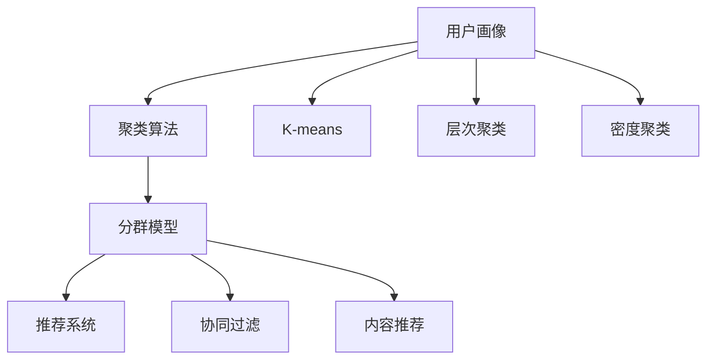
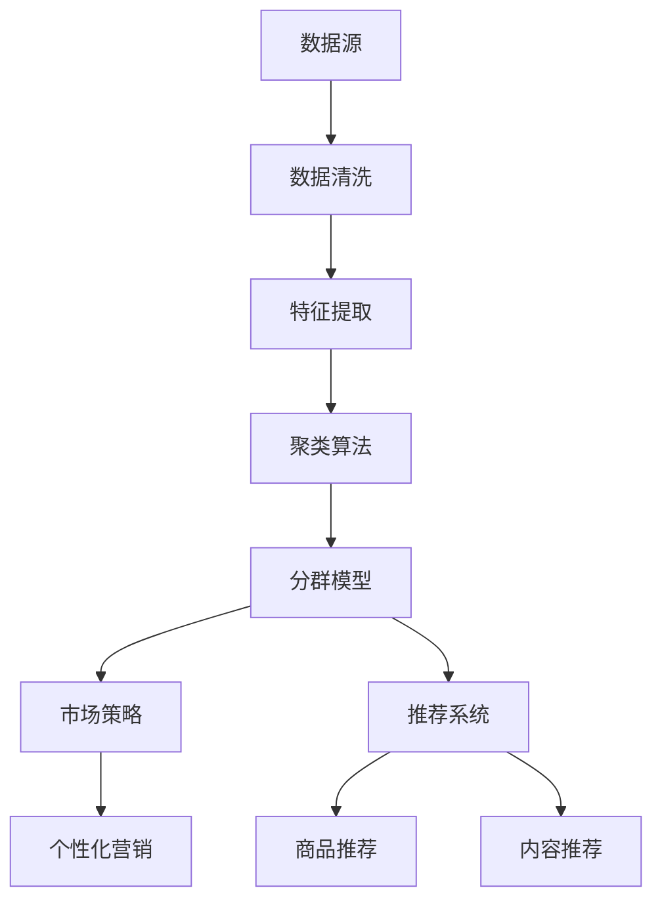

                 

# 如何进行有效的用户分群管理

用户分群（User Segmentation）是大数据和人工智能技术在市场营销和客户管理中的重要应用之一。通过将用户划分为不同的群体，企业可以更精准地定位目标用户，实施更有效的市场策略，提升销售转化率，提高用户满意度。本文将深入探讨用户分群管理的核心概念、算法原理和操作步骤，提供数学模型和代码实例，并展望其未来的发展趋势和面临的挑战。

## 1. 背景介绍

### 1.1 问题由来

在数字化转型的大背景下，互联网和移动设备的使用已成为现代消费者生活的一部分。如何高效地利用这些数据，提升企业的运营效率和市场竞争力，成为各大企业关注的焦点。用户分群管理（User Segmentation）即是一种重要手段，通过将用户分为具有相似特征和行为倾向的群体，企业可以制定更为精准的营销策略，提升用户满意度和忠诚度，最终实现更高的商业价值。

### 1.2 问题核心关键点

用户分群管理的核心在于如何准确识别和定义用户群体的特征，以及如何利用这些特征来优化企业决策。其主要关键点包括：

1. **用户特征提取**：从用户的属性、行为、交易记录等多个维度提取关键特征，构建用户画像。
2. **聚类算法选择**：选择合适的聚类算法，将用户划分为不同的群体。
3. **模型评估与优化**：评估分群模型的效果，并根据反馈进行优化。
4. **应用实施**：将分群结果应用于市场策略、产品推荐、个性化营销等场景，提升用户体验。

## 2. 核心概念与联系

### 2.1 核心概念概述

用户分群管理涉及多个关键概念，包括但不限于：

- **用户画像（User Profile）**：详细描述用户特征和行为的概貌，通常包含用户基本信息、行为偏好、交易记录等。
- **聚类算法（Clustering Algorithm）**：一种无监督学习方法，将相似特征的用户划分到同一群体中。
- **分群模型（Segmentation Model）**：基于聚类算法和用户画像构建的模型，用于对用户进行分组。
- **K-means**：一种常见的聚类算法，将用户数据点映射到预定义的K个簇中。
- **层次聚类（Hierarchical Clustering）**：一种自下而上的聚类方法，可以生成不同层级的簇。
- **密度聚类（Density-Based Clustering）**：如DBSCAN，根据数据点的密度进行聚类。
- **混合聚类（Mixed Clustering）**：结合多种聚类算法，优化聚类效果。
- **推荐系统（Recommendation System）**：利用用户分群结果，实现个性化推荐。
- **协同过滤（Collaborative Filtering）**：根据用户历史行为，推荐相似用户喜爱的商品或内容。
- **内容推荐（Content-Based Recommendation）**：根据用户特征，推荐相关内容。

这些概念之间的关系可以通过以下Mermaid流程图来展示：



### 2.2 核心概念原理和架构

用户分群管理的核心在于构建用户画像和聚类算法，其原理和架构如图示：



1. **数据源**：用户行为数据、交易记录、用户画像等，是用户分群的基础。
2. **数据清洗**：处理缺失值、异常值，提升数据质量。
3. **特征提取**：提取用户的关键特征，如年龄、性别、地理位置、消费习惯等。
4. **聚类算法**：将用户按照相似度进行分组，构建用户分群。
5. **分群模型**：基于聚类结果构建模型，定义不同用户群体的特征。
6. **市场策略**：根据分群结果，制定市场策略，提升营销效果。
7. **个性化营销**：针对不同用户群体，实施个性化营销，提升用户满意度。
8. **推荐系统**：利用分群结果，实现商品或内容的个性化推荐。

## 3. 核心算法原理 & 具体操作步骤

### 3.1 算法原理概述

用户分群管理的过程主要涉及两个关键步骤：特征提取和聚类算法选择。特征提取是从用户数据中提取出有用的特征，构建用户画像；聚类算法则是根据用户特征，将用户划分为不同的群体。

### 3.2 算法步骤详解

#### 3.2.1 特征提取

特征提取的目的是从用户数据中提取出最具代表性的特征，用于描述用户行为和偏好。具体步骤如下：

1. **数据收集**：收集用户的基本信息、行为数据、交易记录等。
2. **数据清洗**：处理缺失值、异常值，提升数据质量。
3. **特征选择**：选择对用户行为和偏好影响最大的特征，如年龄、性别、地理位置、消费频率等。
4. **数据归一化**：对特征进行归一化处理，保证不同特征之间的可比性。
5. **特征组合**：将单一特征组合成复合特征，如将年龄和消费频率组合成“中高消费用户”。

#### 3.2.2 聚类算法选择

聚类算法用于将用户按照相似度进行分组，常见的聚类算法包括：

1. **K-means**：预定义簇的数量K，将用户数据点映射到预定义的K个簇中。
2. **层次聚类（Hierarchical Clustering）**：自下而上的聚类方法，可以生成不同层级的簇。
3. **密度聚类（Density-Based Clustering）**：如DBSCAN，根据数据点的密度进行聚类。
4. **混合聚类（Mixed Clustering）**：结合多种聚类算法，优化聚类效果。

选择聚类算法时，需要考虑用户数据的特点和聚类效果的要求，如图像数据适合使用密度聚类，而文本数据则更适合使用混合聚类。

#### 3.2.3 模型评估与优化

模型评估和优化是用户分群管理的核心步骤之一，其目的是确保分群模型的准确性和可靠性。具体步骤如下：

1. **模型训练**：基于用户数据和聚类算法，训练分群模型。
2. **模型评估**：使用交叉验证、准确率、召回率等指标评估模型的性能。
3. **模型优化**：根据评估结果，优化模型参数，提高分群效果。
4. **结果验证**：将分群结果应用于实际场景，验证模型的效果和可靠性。

#### 3.2.4 应用实施

分群结果可以应用于多个场景，如图像识别、个性化营销、推荐系统等。具体步骤如下：

1. **市场策略**：根据分群结果，制定针对性的市场策略，提升营销效果。
2. **个性化营销**：针对不同用户群体，实施个性化营销，提升用户满意度。
3. **推荐系统**：利用分群结果，实现商品或内容的个性化推荐，提升用户体验。

### 3.3 算法优缺点

用户分群管理的优点在于能够提升营销效果和用户满意度，缺点在于需要处理大规模数据，对算法要求较高，且效果可能受到数据质量的影响。

### 3.4 算法应用领域

用户分群管理广泛应用于市场营销、客户管理、个性化推荐等多个领域，如图像识别、视频推荐、电商营销等。通过用户分群，企业可以更好地理解用户需求，制定更有效的市场策略，提升销售转化率和用户满意度。

## 4. 数学模型和公式 & 详细讲解

### 4.1 数学模型构建

用户分群管理的数学模型构建主要包括以下几个步骤：

1. **数据准备**：收集用户数据，包括基本信息、行为数据、交易记录等。
2. **特征选择**：选择对用户行为和偏好影响最大的特征。
3. **数据归一化**：对特征进行归一化处理，保证不同特征之间的可比性。
4. **聚类算法选择**：选择合适的聚类算法，如K-means、层次聚类、密度聚类等。
5. **模型训练**：基于用户数据和聚类算法，训练分群模型。

### 4.2 公式推导过程

以K-means算法为例，其数学推导过程如下：

1. **目标函数**：将用户数据点映射到预定义的K个簇中，最小化簇内平方和误差。
2. **初始化簇中心**：随机选择K个簇中心。
3. **聚类更新**：将每个数据点分配到距离最近的簇中。
4. **簇中心更新**：根据簇内数据点更新簇中心。
5. **迭代优化**：重复执行聚类更新和簇中心更新，直至收敛。

### 4.3 案例分析与讲解

以电商平台的个性化推荐系统为例，用户分群管理的过程如下：

1. **数据准备**：收集用户的浏览记录、购买记录、用户画像等数据。
2. **特征选择**：选择对用户行为影响最大的特征，如浏览时间、浏览次数、购买频率等。
3. **数据归一化**：对特征进行归一化处理，保证不同特征之间的可比性。
4. **聚类算法选择**：选择K-means算法进行用户聚类。
5. **模型训练**：基于用户数据和聚类算法，训练分群模型。
6. **模型评估**：使用交叉验证、准确率、召回率等指标评估模型的性能。
7. **模型优化**：根据评估结果，优化模型参数，提高分群效果。
8. **应用实施**：根据分群结果，实现个性化推荐，提升用户体验。

## 5. 项目实践：代码实例和详细解释说明

### 5.1 开发环境搭建

用户分群管理的开发环境搭建主要涉及以下几个步骤：

1. **数据准备**：准备用户数据，包括基本信息、行为数据、交易记录等。
2. **环境安装**：安装Python、R、PyTorch等开发工具。
3. **代码编写**：编写用户分群管理的代码，包括数据处理、特征提取、聚类算法选择等。
4. **模型训练**：基于用户数据和聚类算法，训练分群模型。
5. **模型评估**：使用交叉验证、准确率、召回率等指标评估模型的性能。

### 5.2 源代码详细实现

以下是一个简单的用户分群管理代码实现示例，使用Python和scikit-learn库：

```python
from sklearn.cluster import KMeans
import pandas as pd

# 读取数据
data = pd.read_csv('user_data.csv')

# 特征选择
selected_features = ['age', 'gender', 'location', 'purchase_frequency']

# 数据归一化
normalized_data = (data[selected_features] - data[selected_features].mean()) / data[selected_features].std()

# 聚类算法选择
kmeans = KMeans(n_clusters=3)

# 模型训练
kmeans.fit(normalized_data)

# 分群结果输出
labels = kmeans.labels_
```

### 5.3 代码解读与分析

这段代码的详细解读如下：

1. **数据读取**：使用pandas库读取用户数据。
2. **特征选择**：选择对用户行为和偏好影响最大的特征，如年龄、性别、地理位置、消费频率等。
3. **数据归一化**：对特征进行归一化处理，保证不同特征之间的可比性。
4. **聚类算法选择**：选择K-means算法进行用户聚类，预定义簇的数量为3。
5. **模型训练**：基于用户数据和聚类算法，训练分群模型。
6. **分群结果输出**：将每个用户分配到距离最近的簇中，输出分群结果。

## 6. 实际应用场景

### 6.1 电商平台个性化推荐

电商平台通过用户分群管理，可以更精准地实现个性化推荐，提升用户满意度和购买转化率。具体应用场景包括：

1. **商品推荐**：根据用户分群结果，实现商品个性化推荐，提升用户购买意愿。
2. **活动策划**：针对不同用户群体，策划个性化营销活动，提升用户参与度。
3. **客服优化**：根据用户分群结果，优化客服响应策略，提升用户满意度。

### 6.2 金融领域风险控制

金融领域通过用户分群管理，可以实现风险控制和客户流失预警。具体应用场景包括：

1. **信用评分**：根据用户分群结果，制定差异化的信用评分标准，降低违约风险。
2. **用户流失预警**：通过分析用户分群结果，预测高风险用户，提前采取措施，降低用户流失率。
3. **客户服务**：针对不同用户群体，制定个性化的客户服务策略，提升用户满意度。

### 6.3 健康领域个性化治疗

健康领域通过用户分群管理，可以实现个性化治疗和健康管理。具体应用场景包括：

1. **疾病诊断**：根据用户分群结果，制定个性化的疾病诊断方案，提升诊疗效果。
2. **健康管理**：通过分析用户分群结果，制定个性化的健康管理策略，提升用户健康水平。
3. **营养指导**：针对不同用户群体，制定个性化的营养指导方案，提升用户健康水平。

## 7. 工具和资源推荐

### 7.1 学习资源推荐

以下是几个学习用户分群管理相关知识的资源：

1. **《Python机器学习》**：由Sebastian Raschka所著，全面介绍了Python在机器学习中的应用。
2. **《数据科学导论》**：由Coursera开设的入门课程，涵盖数据处理、特征选择、聚类算法等多个主题。
3. **《机器学习实战》**：由Peter Harrington所著，通过实际案例介绍机器学习算法及其应用。
4. **Kaggle**：数据科学竞赛平台，提供大量真实世界的数据集和比赛任务，是实践用户分群管理的最佳场所。

### 7.2 开发工具推荐

以下是几个常用的用户分群管理开发工具：

1. **PyTorch**：开源深度学习框架，支持多种聚类算法和模型训练。
2. **scikit-learn**：Python的机器学习库，包含多种聚类算法和模型评估工具。
3. **TensorFlow**：开源深度学习框架，支持分布式计算和模型优化。
4. **Hadoop**：分布式计算平台，适用于处理大规模用户数据。
5. **Spark**：分布式计算框架，支持大规模数据处理和分析。

### 7.3 相关论文推荐

以下是几篇关于用户分群管理的相关论文：

1. **“Clustering Algorithms: A Review”**：由Xu et al.所著，全面综述了多种聚类算法及其应用。
2. **“Customer Segmentation: A Critical Review”**：由Sajeer et al.所著，详细介绍了客户分群的方法和案例。
3. **“User Segmentation: A Survey”**：由Rana et al.所著，综述了用户分群管理的最新研究进展。
4. **“User Segmentation in Social Media: A Review”**：由Khan et al.所著，介绍了社交媒体用户分群管理的方法和应用。

## 8. 总结：未来发展趋势与挑战

### 8.1 总结

用户分群管理在大数据和人工智能技术中的应用广泛，其核心在于通过聚类算法将用户划分为不同的群体，并利用这些群体特征优化市场策略和提升用户体验。本文介绍了用户分群管理的核心概念、算法原理和操作步骤，提供了数学模型和代码实例，并展望了其未来的发展趋势和面临的挑战。

### 8.2 未来发展趋势

用户分群管理的未来发展趋势包括：

1. **多模态聚类**：将用户数据的多模态特征（如文本、图像、音频等）融合进行聚类，提升聚类效果。
2. **深度学习应用**：利用深度学习算法，如神经网络、Transformer等，提升聚类算法的准确性和泛化能力。
3. **联邦学习**：利用联邦学习技术，保护用户隐私的同时，提升用户分群管理的效率和效果。
4. **自适应聚类**：根据用户行为的变化，动态调整聚类算法和模型参数，提高聚类模型的适应性。
5. **混合聚类**：结合多种聚类算法，优化聚类效果，提升聚类模型的鲁棒性。

### 8.3 面临的挑战

用户分群管理在发展过程中也面临一些挑战：

1. **数据隐私和安全**：用户数据涉及隐私保护，如何在保护用户隐私的同时进行聚类分析是一个重要问题。
2. **算法复杂度**：用户分群管理涉及多种聚类算法，算法复杂度高，如何在保证准确性的同时，提高算法的效率和可解释性。
3. **模型泛化能力**：用户行为数据存在不确定性，如何在不同的场景和用户群体中，保持聚类模型的泛化能力。
4. **资源消耗**：用户分群管理涉及大量数据处理和计算，如何优化资源使用，降低计算成本。
5. **模型解释性**：用户分群管理模型往往是“黑盒”模型，缺乏可解释性，如何提高模型的可解释性和可理解性。

### 8.4 研究展望

面对这些挑战，未来的研究需要在以下几个方面进行突破：

1. **隐私保护技术**：研究隐私保护技术，如差分隐私、联邦学习等，保护用户隐私的同时，提升聚类效果。
2. **高效算法设计**：研究高效算法设计，如分布式计算、自适应聚类等，提升聚类算法的效率和可解释性。
3. **泛化能力提升**：研究模型泛化能力提升方法，如迁移学习、自监督学习等，提高聚类模型的泛化能力。
4. **资源优化技术**：研究资源优化技术，如模型压缩、剪枝等，优化资源使用，降低计算成本。
5. **模型可解释性提升**：研究模型可解释性提升方法，如可视化、解释性算法等，提高聚类模型的可解释性和可理解性。

## 9. 附录：常见问题与解答

**Q1：如何选择合适的聚类算法？**

A: 选择合适的聚类算法需要考虑数据的特点和聚类效果的要求。如K-means适用于处理数值型数据，层次聚类适用于生成不同层级的簇，密度聚类适用于处理离散型数据。

**Q2：用户分群管理如何保护用户隐私？**

A: 用户分群管理需要保护用户隐私，常见的隐私保护技术包括差分隐私、联邦学习等，这些技术可以在保护用户隐私的同时，提升聚类效果。

**Q3：用户分群管理如何提升模型的泛化能力？**

A: 用户分群管理需要提升模型的泛化能力，常见的泛化能力提升方法包括迁移学习、自监督学习等，这些方法可以在不同的场景和用户群体中，保持聚类模型的泛化能力。

**Q4：用户分群管理如何优化资源使用？**

A: 用户分群管理需要优化资源使用，常见的优化技术包括模型压缩、剪枝等，这些技术可以减小模型尺寸，降低计算成本。

**Q5：用户分群管理如何提高模型的可解释性？**

A: 用户分群管理需要提高模型的可解释性，常见的可解释性提升方法包括可视化、解释性算法等，这些方法可以提高聚类模型的可解释性和可理解性。

---

作者：禅与计算机程序设计艺术 / Zen and the Art of Computer Programming

