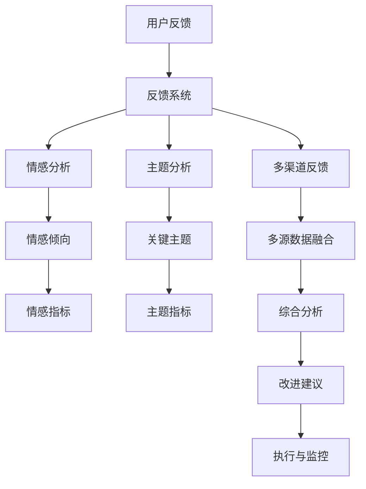

                 

# 如何进行有效的用户反馈收集与应用

## 1. 背景介绍

### 1.1 问题由来
在快速迭代和竞争激烈的现代互联网时代，如何高效收集用户反馈，并将其转化为实际的产品改进，成为每个公司都面临的重大挑战。有效的用户反馈不仅能揭示产品的薄弱环节，还能挖掘用户未明确表达的隐性需求，从而驱动产品快速迭代、提升用户体验。

然而，目前市场上的用户反馈系统，往往存在以下问题：

- **反馈收集难**：用户不愿意填写冗长且繁琐的调查问卷，使得收集到的反馈数据量不足，无法形成有价值的洞察。
- **反馈质量低**：收集到的反馈多为模糊、笼统的意见，难以直接转化为具体的改进建议。
- **反馈应用难**：即使收集到有用的反馈，如何高效分析、分类、优先级排序，并将其转化为可执行的产品改进方案，也成为了一个难题。

这些问题导致了用户反馈收集与应用的效率低下，严重阻碍了产品迭代和创新进程。因此，本文将深入探讨如何通过科学方法和技术手段，提高用户反馈收集的效率和质量，以及如何将收集到的反馈转化为实际的产品改进，从而提升用户满意度和产品竞争力。

## 2. 核心概念与联系

### 2.1 核心概念概述

为了更清晰地理解如何进行有效的用户反馈收集与应用，本节将介绍几个关键概念：

- **用户反馈**：用户在使用产品过程中，对产品功能、设计、体验等方面提供的意见、建议或投诉。
- **反馈系统**：用于收集、分析和应用用户反馈的软件系统，包括问卷设计、数据收集、数据分析、反馈展示等多个环节。
- **情感分析**：通过自然语言处理技术，识别用户反馈中的情感倾向（如积极、消极、中性），以便更精准地理解用户情绪。
- **主题分析**：对用户反馈进行关键词提取和主题建模，从大量无序文本中提炼出有价值的信息，进行结构化分析。
- **多渠道反馈**：通过多种渠道（如应用内、邮件、社交媒体等）收集用户反馈，全面了解用户需求和痛点。
- **闭环管理**：实现从反馈收集到分析、优先级排序、执行、监控的闭环管理，确保每一个反馈都能得到有效响应和持续改进。

这些概念之间的逻辑关系可以通过以下Mermaid流程图来展示：



这个流程图展示了从用户反馈收集到最终产品改进的全过程：

1. 用户反馈通过反馈系统收集。
2. 系统对反馈进行情感分析和主题分析，提炼关键情感和主题指标。
3. 通过多渠道收集的多源数据进行融合，综合分析用户需求。
4. 基于分析结果，提出改进建议。
5. 改进建议进入执行与监控环节，确保实施效果。

## 3. 核心算法原理 & 具体操作步骤

### 3.1 算法原理概述

有效的用户反馈收集与应用是一个多步骤的复杂过程，涉及情感分析、主题建模、多源数据融合等多个环节。其核心算法原理可以概括为以下几个方面：

- **情感分析**：利用自然语言处理技术，识别用户反馈中的情感倾向，以评估用户对产品的满意度。
- **主题建模**：通过关键词提取和文本聚类，将用户反馈提炼为关键主题，揭示用户最关注的问题和需求。
- **多源数据融合**：将不同渠道收集到的用户反馈数据进行整合，综合分析得出更为全面和准确的结论。

### 3.2 算法步骤详解

#### 3.2.1 用户反馈的收集与管理

**3.2.1.1 设计反馈问卷**
- **简洁明了**：问卷设计应简洁明了，避免使用复杂术语，确保用户能快速理解并填写。
- **多选题和评分题**：使用多选题、评分题等形式，使得用户可以方便地表达自己的意见和评价。
- **激励机制**：通过抽奖、优惠券等激励措施，鼓励用户填写问卷。

**3.2.1.2 多渠道收集反馈**
- **应用内反馈**：通过应用内的评分、评论、客服对话等功能，实时收集用户反馈。
- **邮件反馈**：在用户注册、购买等关键节点发送邮件，邀请用户填写反馈问卷。
- **社交媒体反馈**：在社交媒体上发布调查问卷链接，利用社交网络效应扩大收集范围。

**3.2.1.3 数据清洗与存储**
- **数据清洗**：对收集到的反馈数据进行去重、去噪、格式化等处理，确保数据质量。
- **数据存储**：采用关系型数据库或NoSQL数据库，对反馈数据进行结构化存储，便于后续分析和检索。

#### 3.2.2 情感分析与主题建模

**3.2.2.1 情感分析**
- **情感词典**：使用情感词典（如SentiWordNet、AFINN等）对用户反馈进行情感极性标注。
- **情感分类**：通过机器学习算法（如朴素贝叶斯、支持向量机等）对用户反馈进行情感分类，识别积极、消极和中性的反馈。

**3.2.2.2 主题建模**
- **TF-IDF**：使用TF-IDF算法计算关键词的重要性，筛选出对主题有贡献的词汇。
- **LDA主题模型**：利用LDA算法对用户反馈进行主题建模，识别出潜在的关键主题。

#### 3.2.3 多源数据融合

**3.2.3.1 数据整合**
- **数据对齐**：将来自不同渠道的用户反馈数据进行对齐，消除冗余和重复。
- **数据补充**：补充缺失数据，确保数据的完整性。

**3.2.3.2 数据融合**
- **集成学习**：采用集成学习算法（如Bagging、Boosting等）对多源数据进行融合，提升分析的准确性。
- **联合建模**：将不同渠道的数据结合，构建联合分布模型，进行综合分析。

### 3.3 算法优缺点

**3.3.1 优点**

- **高效性**：通过自动化处理，快速收集和分析用户反馈，缩短产品迭代周期。
- **全面性**：利用多渠道数据，全面了解用户需求和痛点，提升分析的准确性。
- **精确性**：通过情感分析和主题建模，精确识别用户反馈中的情感倾向和关键主题，指导产品改进。

**3.3.2 缺点**

- **隐私问题**：用户反馈涉及个人隐私，数据存储和处理需要严格遵守隐私保护法规。
- **模型偏差**：情感分析、主题建模等算法可能存在偏差，影响分析结果的公正性。
- **复杂性**：算法实现较为复杂，需要一定的技术背景和资源支持。

### 3.4 算法应用领域

用户反馈收集与应用技术在多个领域都有广泛的应用，以下是几个典型的例子：

- **电商零售**：电商平台通过用户反馈了解产品缺陷和用户需求，优化商品描述、物流服务、客服系统等，提升用户体验。
- **金融服务**：金融机构利用用户反馈改进金融产品和服务，提升用户满意度和忠诚度。
- **医疗健康**：医疗机构通过用户反馈优化诊疗流程，提升患者体验和医疗服务质量。
- **教育培训**：教育机构利用学生反馈改进课程内容和教学方法，提升教学效果。
- **智能家居**：智能家居设备通过用户反馈优化产品功能和用户体验，提升产品的市场竞争力。

## 4. 数学模型和公式 & 详细讲解 & 举例说明

### 4.1 数学模型构建

用户反馈的情感分析和主题建模可以分别建模为两个数学模型。

设用户反馈文本为 $X$，情感标签为 $Y$，情感分类模型可以表示为：

$$
P(Y|X; \theta) = \frac{e^{Z(X;\theta)}}{e^{Z(X;\theta)} + \sum_{y\neq y_i} e^{Z(X;\theta_y)}}
$$

其中 $Z(X;\theta)$ 是情感分类模型的输出，$\theta$ 是模型参数。

设用户反馈文本为 $X$，主题集合为 $T$，主题模型可以表示为：

$$
P(T|X; \theta) = \prod_{t \in T} \frac{e^{Z_t(X;\theta)}}{e^{Z_t(X;\theta)} + \sum_{t' \neq t} e^{Z_{t'}(X;\theta)}}
$$

其中 $Z_t(X;\theta)$ 是主题模型对文本 $X$ 输出主题 $t$ 的概率。

### 4.2 公式推导过程

**4.2.1 情感分类模型**

情感分类模型的核心是利用机器学习算法对情感词典标注的用户反馈进行训练，得到情感分类器。常见的算法包括朴素贝叶斯、支持向量机、深度学习模型（如LSTM、Transformer等）。

以朴素贝叶斯分类器为例，其公式推导如下：

设情感词典中包含 $n$ 个词汇 $W_1, W_2, \ldots, W_n$，情感词典中词汇 $w_i$ 对情感 $y$ 的情感强度为 $a_{i,j}$。用户反馈 $X$ 中包含词汇 $w_1, w_2, \ldots, w_m$，则情感分类模型的输出为：

$$
Z(X;\theta) = \log \left( \prod_{i=1}^m a_{i,j} \right)
$$

其中 $\theta$ 为模型参数，包括每个词汇对每个情感的情感强度 $a_{i,j}$。

**4.2.2 主题建模模型**

LDA主题模型的核心是利用主题词表 $T$ 和文本词表 $V$ 对用户反馈进行建模。其公式推导如下：

设用户反馈文本 $X$ 包含 $m$ 个词汇 $w_1, w_2, \ldots, w_m$，主题集合 $T$ 包含 $k$ 个主题 $t_1, t_2, \ldots, t_k$，主题模型对文本 $X$ 输出主题 $t$ 的概率为：

$$
Z_t(X;\theta) = \log \left( \prod_{i=1}^m \sum_{j=1}^k a_{i,j} \right)
$$

其中 $\theta$ 为模型参数，包括每个词汇 $w_i$ 对每个主题 $t_j$ 的强度 $a_{i,j}$。

### 4.3 案例分析与讲解

假设某电商平台收集到以下用户反馈：

| 用户反馈 | 情感标签 |
|----------|----------|
| 商品质量很好，性价比高 | 积极 |
| 物流太慢了，不推荐 | 消极 |
| 客服态度很差，没解决任何问题 | 消极 |
| 网站界面简洁，但商品搜索功能不够强大 | 中性 |

采用情感分析模型，可以识别出积极反馈和消极反馈，为平台改进物流、客服和搜索功能提供指导。

采用主题模型，可以识别出用户反馈中的主题“商品质量”和“物流服务”，为平台优化商品和物流管理提供依据。

## 5. 项目实践：代码实例和详细解释说明

### 5.1 开发环境搭建

在进行用户反馈收集与应用实践前，我们需要准备好开发环境。以下是使用Python进行PyTorch开发的环境配置流程：

1. 安装Anaconda：从官网下载并安装Anaconda，用于创建独立的Python环境。

2. 创建并激活虚拟环境：
```bash
conda create -n feedback-env python=3.8 
conda activate feedback-env
```

3. 安装PyTorch：根据CUDA版本，从官网获取对应的安装命令。例如：
```bash
conda install pytorch torchvision torchaudio cudatoolkit=11.1 -c pytorch -c conda-forge
```

4. 安装NLTK库：用于处理文本数据和构建情感词典。
```bash
pip install nltk
```

5. 安装Gensim库：用于构建主题模型。
```bash
pip install gensim
```

完成上述步骤后，即可在`feedback-env`环境中开始反馈系统开发。

### 5.2 源代码详细实现

下面我们以电商零售领域为例，给出使用NLTK和Gensim库对用户反馈进行情感分析和主题建模的PyTorch代码实现。

首先，导入必要的库：

```python
import torch
import torch.nn as nn
from torchtext.data import Field, LabelField, BucketIterator
from torchtext.vocab import Vocab
from nltk.corpus import stopwords
from nltk.tokenize import word_tokenize
from gensim.models import LdaModel
```

然后，定义数据预处理函数：

```python
class Tokenizer:
    def __init__(self):
        self.stopwords = set(stopwords.words('english'))
    
    def tokenize(self, text):
        tokens = word_tokenize(text.lower())
        tokens = [token for token in tokens if token not in self.stopwords]
        return tokens

class FieldProcessor:
    def __init__(self):
        self.tokenizer = Tokenizer()
    
    def process(self, text):
        return self.tokenizer.tokenize(text)
```

接着，定义数据集和迭代器：

```python
class FeedbackDataset:
    def __init__(self, texts, labels):
        self.texts = texts
        self.labels = labels
    
    def __getitem__(self, index):
        return self.texts[index], self.labels[index]
    
    def __len__(self):
        return len(self.texts)

train_dataset = FeedbackDataset(train_texts, train_labels)
dev_dataset = FeedbackDataset(dev_texts, dev_labels)
test_dataset = FeedbackDataset(test_texts, test_labels)

tokenizer = FieldProcessor()
TEXT = Field(tokenize=tokenizer.process, lower=True)
LABEL = LabelField(dtype=torch.int64)
train_data, dev_data, test_data = BucketIterator.splits((train_dataset, dev_dataset, test_dataset),
                                                    sort_within_batch=True, batch_size=32,
                                                    device="cuda")
```

然后，定义情感分析模型：

```python
class SentimentClassifier(nn.Module):
    def __init__(self, vocab_size, embedding_dim, hidden_dim):
        super(SentimentClassifier, self).__init__()
        self.embedding = nn.Embedding(vocab_size, embedding_dim)
        self.rnn = nn.LSTM(embedding_dim, hidden_dim)
        self.fc = nn.Linear(hidden_dim, 2)
    
    def forward(self, x):
        embedded = self.embedding(x)
        output, (hidden, cell) = self.rnn(embedded)
        hidden = hidden[-1]
        return self.fc(hidden)
```

接着，定义主题模型：

```python
def train_lda(texts, num_topics, num_words):
    lda_model = LdaModel(texts, num_topics=num_topics, id2word=vocab, passes=10)
    topics = lda_model.print_topics(num_words=num_words)
    return lda_model, topics
```

最后，启动情感分析和主题建模流程：

```python
num_words = 10
num_topics = 5

lda_model, topics = train_lda(train_texts, num_topics, num_words)

print("LDA Model Topics:")
for topic in topics:
    print(topic)

# 情感分析模型训练
model = SentimentClassifier(vocab_size, embedding_dim, hidden_dim)
criterion = nn.CrossEntropyLoss()
optimizer = torch.optim.Adam(model.parameters(), lr=0.001)

for epoch in range(num_epochs):
    for batch in tqdm(train_data):
        optimizer.zero_grad()
        output = model(batch)
        loss = criterion(output, batch[1])
        loss.backward()
        optimizer.step()

# 情感分析模型评估
correct = 0
total = 0
with torch.no_grad():
    for batch in dev_data:
        output = model(batch)
        _, predicted = torch.max(output, 1)
        total += batch[1].size(0)
        correct += (predicted == batch[1]).sum().item()

print("Accuracy:", correct/total)

# 主题分析模型训练
lda_model = LdaModel(texts, num_topics=num_topics, id2word=vocab, passes=10)

print("LDA Model Topics:")
for topic in topics:
    print(topic)
```

以上就是使用PyTorch对电商零售领域用户反馈进行情感分析和主题建模的完整代码实现。可以看到，通过利用NLTK和Gensim库，我们能够较为简单地实现情感分类和主题建模。

### 5.3 代码解读与分析

让我们再详细解读一下关键代码的实现细节：

**Tokenizer类**：
- `__init__`方法：初始化停用词列表。
- `tokenize`方法：对输入文本进行分词和停用词去除。

**FieldProcessor类**：
- `__init__`方法：初始化分词器。
- `process`方法：对文本进行预处理，包括分词和停用词去除。

**Field类**：
- `__getitem__`方法：获取数据集中的一个样本。
- `__len__`方法：返回数据集的样本数量。

**SentimentClassifier模型**：
- `__init__`方法：初始化情感分类器，包括嵌入层、LSTM层和全连接层。
- `forward`方法：对输入进行前向传播，得到分类结果。

**LDA模型训练**：
- `train_lda`方法：对文本进行LDA主题建模，得到主题和对应的词汇。

**情感分析模型训练和评估**：
- 利用`SentimentClassifier`模型对情感进行分类，使用交叉熵损失函数进行训练。
- 在验证集上评估模型准确率，检查模型的泛化能力。

**主题分析模型训练和展示**：
- 利用`LdaModel`对文本进行LDA主题建模，得到主题和对应的词汇。
- 打印主题及其对应的关键词。

## 6. 实际应用场景

### 6.1 智能客服系统

基于用户反馈的智能客服系统，能够实时收集用户的投诉和建议，快速响应并解决问题。通过情感分析，客服系统可以识别用户的情绪，智能分配客服资源，提高用户体验。

在技术实现上，可以采用自然语言处理技术，对用户对话进行情感分类和主题建模，从而优化客服回答模板和训练数据。同时，可以引入机器学习算法，不断优化客服系统，提升其准确性和响应速度。

### 6.2 金融服务

金融机构通过收集用户的交易反馈，利用情感分析和主题建模，优化金融产品和服务，提升用户满意度和忠诚度。

在技术实现上，可以采用机器学习算法，对交易反馈进行情感分类，识别用户对产品或服务的满意度。同时，可以利用主题建模技术，识别用户关注的主要问题，如交易速度、安全性、客服等，从而有针对性地改进服务。

### 6.3 医疗健康

医疗机构通过收集患者的反馈，利用情感分析和主题建模，优化诊疗流程，提升患者体验和医疗服务质量。

在技术实现上，可以采用自然语言处理技术，对患者的反馈进行情感分类和主题建模。同时，可以利用机器学习算法，分析患者的反馈，找出共性问题和趋势，为医院管理提供决策支持。

### 6.4 教育培训

教育机构通过收集学生的反馈，利用情感分析和主题建模，优化教学内容和教学方法，提升教学效果。

在技术实现上，可以采用自然语言处理技术，对学生的反馈进行情感分类和主题建模。同时，可以利用机器学习算法，分析学生的反馈，找出课程内容和教学方法的改进点，为教师和教育管理提供参考。

### 6.5 智能家居

智能家居设备通过收集用户的反馈，利用情感分析和主题建模，优化产品功能和用户体验，提升产品的市场竞争力。

在技术实现上，可以采用自然语言处理技术，对用户的反馈进行情感分类和主题建模。同时，可以利用机器学习算法，分析用户的反馈，找出产品功能和用户体验的改进点，为产品设计提供参考。

## 7. 工具和资源推荐

### 7.1 学习资源推荐

为了帮助开发者系统掌握用户反馈收集与应用的技术基础和实践技巧，这里推荐一些优质的学习资源：

1. **《自然语言处理综论》**：清华大学郑涌教授的NLP课程，涵盖了自然语言处理的基本概念和核心算法。
2. **《Python数据科学手册》**：由Jake VanderPlas撰写，介绍使用Python进行数据分析和机器学习的经典书籍。
3. **NLTK官方文档**：自然语言工具包的官方文档，提供丰富的文本处理工具和示例。
4. **Gensim官方文档**：主题模型的官方文档，详细介绍了LDA、LSI等模型的使用方法。
5. **Kaggle机器学习竞赛**：在Kaggle上参加机器学习竞赛，通过实战提升数据分析和模型训练的能力。

通过对这些资源的学习实践，相信你一定能够快速掌握用户反馈收集与应用的核心技术，并将其应用于实际项目中。

### 7.2 开发工具推荐

高效的开发离不开优秀的工具支持。以下是几款用于用户反馈收集与应用开发的常用工具：

1. **TensorFlow**：由Google主导开发的开源深度学习框架，生产部署方便，适合大规模工程应用。
2. **PyTorch**：由Facebook开发的高性能深度学习框架，支持动态计算图，适合快速迭代研究。
3. **NLTK**：自然语言工具包，提供丰富的文本处理工具和算法。
4. **Gensim**：主题建模库，提供LDA、LSI等模型的实现。
5. **BeautifulSoup**：用于HTML解析的Python库，方便从网页中提取文本数据。

合理利用这些工具，可以显著提升用户反馈收集与应用任务的开发效率，加快创新迭代的步伐。

### 7.3 相关论文推荐

用户反馈收集与应用技术的发展离不开学界的持续研究。以下是几篇奠基性的相关论文，推荐阅读：

1. **“A Survey on Feedback and Customer Satisfaction Analytics”**：该综述论文总结了反馈分析和客户满意度分析的多种方法和技术，提供了丰富的参考资料。
2. **“Sentiment Analysis for Service Operations”**：该论文探讨了情感分析在服务运营中的应用，提出了多种情感分类模型和评估指标。
3. **“LDA Topic Modeling and Its Application in Social Media”**：该论文介绍了LDA主题建模在社交媒体分析中的应用，展示了主题建模的强大能力。
4. **“Multi-Source Feedback Fusion for Personalized Recommendation”**：该论文研究了多源反馈融合技术，提升了个性化推荐系统的准确性。
5. **“Using Sentiment Analysis for Feedback Management in Service-Oriented Businesses”**：该论文讨论了情感分析在服务型企业反馈管理中的应用，提出了多种情感分析模型和应用案例。

这些论文代表了大规模数据处理和情感分析的研究方向，对于深入理解用户反馈收集与应用技术具有重要参考价值。

## 8. 总结：未来发展趋势与挑战

### 8.1 总结

本文对用户反馈收集与应用技术进行了全面系统的介绍。首先阐述了用户反馈的重要性和当前存在的问题，明确了反馈系统设计的关键点。其次，从算法原理到具体操作，详细讲解了情感分析和主题建模等核心技术，给出了完整的代码实例。同时，本文还广泛探讨了用户反馈在多个行业领域的应用前景，展示了反馈系统带来的广泛价值。

通过本文的系统梳理，可以看到，用户反馈收集与应用技术在提高产品迭代速度、提升用户体验方面具有重要作用。合理利用情感分析和主题建模等技术，可以大幅提升用户反馈的价值，为产品设计和优化提供有力支撑。

### 8.2 未来发展趋势

展望未来，用户反馈收集与应用技术将呈现以下几个发展趋势：

1. **自动化和智能化**：随着人工智能技术的进步，未来反馈系统将实现自动化、智能化的反馈收集和处理，提高收集效率和数据质量。
2. **多模态反馈**：除了文本反馈，未来的反馈系统将支持语音、视频等多种模态的反馈，更全面地了解用户需求。
3. **个性化反馈**：利用机器学习算法，对用户反馈进行个性化分析，提供更精准的产品改进方案。
4. **实时反馈处理**：利用流处理技术，实现实时反馈处理，提高反馈响应的速度和效率。
5. **跨平台反馈集成**：将用户在不同平台上的反馈数据集成，进行综合分析，提供更全面的产品改进建议。

这些趋势将进一步推动反馈系统的智能化和自动化，提升用户反馈的价值和应用效果。

### 8.3 面临的挑战

尽管用户反馈收集与应用技术已经取得了显著进展，但在实现高效、准确、个性化的反馈处理过程中，仍面临诸多挑战：

1. **数据隐私保护**：用户反馈涉及隐私信息，如何保护用户隐私，确保数据安全，是一个重要的课题。
2. **情感分析的准确性**：情感分析算法的准确性直接影响反馈系统的性能，如何提高情感分析的准确性和鲁棒性，是一个长期的挑战。
3. **主题模型的复杂性**：主题模型的复杂度较高，如何设计有效的模型结构，简化主题建模过程，是一个需要深入研究的问题。
4. **多源数据融合的难度**：多源数据融合涉及多种数据格式和来源，如何实现高效的数据整合和融合，是一个复杂的问题。
5. **用户反馈的多样性**：用户反馈多样性和噪声较多，如何有效去除噪声，提高反馈的准确性，是一个需要解决的问题。

面对这些挑战，未来需要在算法优化、模型设计、数据处理等方面进行深入研究，以提高用户反馈收集与应用技术的可靠性和效果。

### 8.4 研究展望

面对用户反馈收集与应用技术的未来挑战，未来的研究需要在以下几个方面寻求新的突破：

1. **自动化反馈系统**：开发智能化的反馈收集系统，自动抓取和处理用户反馈，减少人工干预，提高收集效率和准确性。
2. **实时反馈处理技术**：研究实时反馈处理技术，实现快速响应和处理，提高用户体验和满意度。
3. **多模态反馈融合**：探索多模态反馈融合技术，提升反馈系统的全面性和准确性。
4. **个性化反馈算法**：研究个性化反馈算法，提供更精准的产品改进建议。
5. **数据隐私保护技术**：研究数据隐私保护技术，确保用户数据的安全性和隐私保护。

这些研究方向将推动用户反馈收集与应用技术的进一步发展和应用，为构建更加智能、高效、个性化的反馈系统提供技术支撑。

## 9. 附录：常见问题与解答

**Q1：用户反馈系统是否适用于所有产品和服务？**

A: 用户反馈系统适用于大多数产品和服务，特别是那些需要快速迭代和改进的领域。例如电商、金融、医疗、教育等。对于不需要实时反馈的领域，如传统制造业，反馈系统的效果可能不如预期。

**Q2：如何判断用户反馈的质量？**

A: 用户反馈的质量可以通过多种方式进行判断，包括：
- **反馈数量**：用户反馈的数量越多，通常意味着用户对产品的关注度越高，反馈的质量可能越好。
- **反馈内容**：用户反馈的具体内容和细节，反映了用户对产品或服务的真实感受，比简单的满意度评分更有价值。
- **反馈时间**：用户反馈的时效性，反映了用户对产品或服务的即时感受，比事后反馈更具有参考价值。

**Q3：用户反馈如何转化为产品改进建议？**

A: 用户反馈转化为产品改进建议的过程通常包括以下几个步骤：
- **情感分析**：通过情感分析，识别用户反馈中的情感倾向，判断用户对产品或服务的满意度。
- **主题分析**：通过主题分析，提炼出用户反馈中的关键主题，识别出用户关注的主要问题和需求。
- **优先级排序**：对不同反馈进行优先级排序，根据影响范围、解决难度等因素，确定优先改进的事项。
- **执行与监控**：根据优先级排序，制定具体的改进方案，并监控执行效果，持续优化产品。

**Q4：如何处理用户反馈中的噪音和误报？**

A: 用户反馈中的噪音和误报可以通过以下方法进行处理：
- **数据清洗**：对用户反馈进行去重、去噪、格式化等处理，确保数据质量。
- **模型验证**：利用交叉验证等方法，评估情感分析、主题建模等模型的准确性和鲁棒性。
- **人工审核**：对于特别重要的反馈，可以引入人工审核，确保反馈的真实性和准确性。

**Q5：用户反馈系统如何与业务系统集成？**

A: 用户反馈系统与业务系统的集成通常需要以下步骤：
- **数据接口**：设计数据接口，实现反馈数据与业务系统的数据共享。
- **API接口**：设计API接口，实现反馈系统的自动化处理和业务系统的自动响应。
- **业务流程优化**：优化业务流程，确保反馈系统的及时性和准确性，提升用户体验。

通过合理设计和使用用户反馈系统，企业可以更好地了解用户需求，优化产品和服务，提升市场竞争力。

