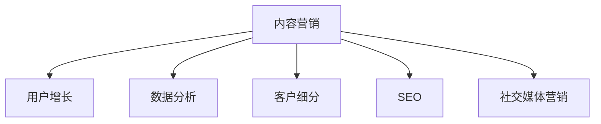

                 

# 如何进行知识付费的内容营销与推广

> 关键词：知识付费,内容营销,用户增长,数据分析,客户细分

## 1. 背景介绍

### 1.1 问题由来

随着信息技术的飞速发展和互联网的普及，知识付费成为一种新的经济形态和消费趋势。知识付费平台如得到、喜马拉雅、小鹅通等，凭借其独特的商业模式和丰富的内容资源，获得了巨大的市场份额。然而，知识付费市场同样面临着激烈的竞争和挑战，如何通过有效的营销和推广手段，提升用户粘性和转化率，成为众多平台关注的焦点。

内容营销作为一种高效低成本的推广手段，受到越来越多知识付费平台的重视。通过优质的内容和精准的定位，可以有效吸引用户关注，提升品牌影响力和用户转化率。本文将详细介绍如何进行知识付费的内容营销与推广，帮助平台构建完善的内容营销体系，实现用户增长和营收提升。

### 1.2 问题核心关键点

内容营销的核心在于通过优质内容吸引用户关注和互动，提升品牌影响力和用户转化率。关键点包括：

- **内容质量**：高质量的内容是内容营销的基础，需要确保内容的原创性、专业性和实用性。
- **用户定位**：明确目标用户群体，制定精准的内容策略和推广计划。
- **多渠道推广**：结合社交媒体、SEO、邮件营销等多种渠道，实现全方位的内容推广。
- **数据分析**：通过数据分析，实时监测内容效果，优化内容和推广策略。

## 2. 核心概念与联系

### 2.1 核心概念概述

为更好地理解内容营销与推广的方法，本节将介绍几个密切相关的核心概念：

- **内容营销**：通过创造、分发有价值的内容，吸引目标受众，并促进用户行为的一种营销策略。内容营销的关键在于创造优质内容，同时结合推广手段，实现用户增长和品牌建设。

- **用户增长**：指通过多种手段，持续吸引新用户，提升现有用户的活跃度和留存率，最终实现用户规模的增长。用户增长关注于用户生命周期的全流程，包括获取、激活、留存、转化等环节。

- **数据分析**：利用数据挖掘、统计分析等方法，从大量数据中提取有用信息，支持决策制定和策略优化。数据分析是内容营销的重要支撑，帮助平台了解用户行为和市场趋势。

- **客户细分**：将目标用户按照特定维度进行分类，制定差异化的内容和营销策略。客户细分有助于提高营销效果，满足不同用户群体的需求。

- **SEO（搜索引擎优化）**：通过优化网站结构和内容，提高搜索引擎排名，增加网站流量。SEO是内容营销的重要手段之一，可以帮助内容获得更多的曝光机会。

- **社交媒体营销**：通过社交平台发布内容，与用户互动，提升品牌影响力和用户粘性。社交媒体是内容营销的主要渠道之一，能够有效扩大内容覆盖范围。

这些核心概念之间的逻辑关系可以通过以下Mermaid流程图来展示：



这个流程图展示了一体化的内容营销体系，内容营销贯穿于用户增长、数据分析、客户细分等多个环节，共同支撑内容推广和用户转化。

## 3. 核心算法原理 & 具体操作步骤

### 3.1 算法原理概述

内容营销的算法原理主要包括以下几个方面：

1. **内容生成与创作**：通过机器学习和自然语言处理等技术，自动生成高质量的文本、视频、音频等内容。
2. **用户行为分析**：利用用户行为数据，分析用户兴趣和偏好，指导内容创作和推广策略。
3. **推荐系统**：通过推荐算法，将合适的内容推荐给目标用户，提高用户转化率。
4. **流量优化**：通过SEO和社交媒体营销等手段，优化网站流量，提升内容曝光和用户互动。

### 3.2 算法步骤详解

1. **内容定位与创作**：
   - 确定目标用户群体：通过用户调研和数据分析，明确用户的主要兴趣和需求。
   - 内容创作：根据用户需求，制作有价值、有趣味的内容，确保内容的原创性和专业性。
   - 内容优化：使用SEO优化技术，提高内容在搜索引擎中的排名，增加曝光机会。

2. **用户行为分析**：
   - 数据采集：收集用户在平台上的行为数据，包括浏览、点击、留言等。
   - 数据分析：使用数据分析工具，如Google Analytics、Mixpanel等，分析用户行为，识别热点和趋势。
   - 内容匹配：根据用户行为数据，匹配合适的优质内容，提高用户互动和留存。

3. **推荐系统实现**：
   - 用户画像：构建用户画像，包括基本信息、兴趣偏好、历史行为等。
   - 内容推荐：利用协同过滤、内容推荐等算法，为用户推荐个性化的内容，提升转化率。
   - 反馈优化：根据用户反馈，不断调整推荐算法，提升推荐效果。

4. **多渠道推广**：
   - 社交媒体推广：在各大社交平台发布内容，吸引用户关注和互动。
   - 内容合作：与KOL、媒体合作，借助其影响力扩大内容传播。
   - 邮件营销：定期向用户发送邮件，推送优质内容和专属优惠，提高用户转化率。

### 3.3 算法优缺点

内容营销具有以下优点：

- **低成本高效益**：相较于传统广告，内容营销成本较低，但可以带来更高的用户互动和转化率。
- **品牌建设**：通过优质内容展示品牌价值，提升品牌形象和用户信任度。
- **多渠道覆盖**：结合多种渠道推广，实现广泛的用户覆盖和深度互动。

然而，内容营销也存在一定的缺点：

- **内容生产成本高**：高质量内容的创作和生产需要大量人力和时间，成本较高。
- **数据隐私问题**：收集和分析用户行为数据需要遵守隐私法规，确保数据安全。
- **效果难以量化**：内容营销的效果受到多方面因素影响，难以进行精确的量化评估。

### 3.4 算法应用领域

内容营销在知识付费平台中的应用领域非常广泛，包括：

- **课程推广**：通过优质课程内容的推广，吸引用户报名购买。
- **知识分享**：制作有价值的文章、视频、音频等内容，提升品牌影响力。
- **用户互动**：通过社区论坛、微信群等形式，与用户互动，提高用户粘性和满意度。
- **用户调研**：通过问卷调查、用户反馈等方式，了解用户需求和市场趋势。

## 4. 数学模型和公式 & 详细讲解 & 举例说明

### 4.1 数学模型构建

为了更好地量化内容营销的效果，我们可以建立数学模型进行评估和优化。

设内容推广后的用户增长率为 $G$，用户流失率为 $L$，用户留存率为 $R$。根据用户生命周期理论，我们有：

$$G = \frac{\Delta U}{T_0}$$

其中 $\Delta U$ 为用户增长数量，$T_0$ 为初始用户数量。

用户留存率 $R$ 可以表示为：

$$R = \frac{\Delta U}{T_0} - L$$

设内容推广后的平均订单价值为 $AVG$，总订单数量为 $N$，则总营收 $REvenue$ 可以表示为：

$$REvenue = AVG \times N$$

### 4.2 公式推导过程

根据以上定义，我们可以构建内容营销效果的评估模型。假设内容推广后的转化率为 $C$，则用户增长率 $G$ 可以表示为：

$$G = C \times R$$

进一步地，内容推广的效果可以表示为：

$$G \times AVG = C \times (R \times AVG)$$

即：

$$G \times AVG = C \times REvenue$$

通过分析以上公式，我们可以理解：内容营销的效果受到用户增长率、用户留存率、平均订单价值和总订单数量等多方面因素的影响。

### 4.3 案例分析与讲解

假设某知识付费平台进行内容推广，预计转化率为 $C = 0.1$，用户留存率为 $R = 0.8$，平均订单价值为 $AVG = 50$，总订单数量为 $N = 10000$。根据以上公式，我们可以计算出内容营销的效果：

$$G \times AVG = 0.1 \times 0.8 \times 10000 \times 50 = 4000000$$

即内容营销的效果为 400 万人民币。

## 5. 项目实践：代码实例和详细解释说明

### 5.1 开发环境搭建

在进行内容营销实践前，我们需要准备好开发环境。以下是使用Python进行内容营销系统开发的环境配置流程：

1. 安装Anaconda：从官网下载并安装Anaconda，用于创建独立的Python环境。

2. 创建并激活虚拟环境：
```bash
conda create -n content-marketing python=3.8 
conda activate content-marketing
```

3. 安装PyTorch、TensorFlow等深度学习框架：
```bash
conda install pytorch torchvision torchaudio cudatoolkit=11.1 -c pytorch -c conda-forge
```

4. 安装相关数据处理和分析库：
```bash
pip install pandas numpy scipy scikit-learn
```

5. 安装内容营销工具库：
```bash
pip install content-marketing-toolkit
```

完成上述步骤后，即可在`content-marketing`环境中开始内容营销实践。

### 5.2 源代码详细实现

以下是一个简单的内容营销系统示例代码，包括内容生成、用户行为分析和推荐系统实现。

**内容生成模块**：
```python
from content-marketing-toolkit import ContentGenerator

def generate_content(target_audience):
    # 根据目标用户群体，生成优质内容
    content = ContentGenerator.generate(target_audience)
    return content
```

**用户行为分析模块**：
```python
from content-marketing-toolkit import UserBehaviorAnalyzer

def analyze_user_behavior(user_data):
    # 分析用户行为数据，识别热点和趋势
    analyzer = UserBehaviorAnalyzer(user_data)
    trends = analyzer.get_trends()
    return trends
```

**推荐系统模块**：
```python
from content-marketing-toolkit import RecommendationSystem

def recommend_content(user_profile):
    # 根据用户画像，推荐个性化内容
    recommender = RecommendationSystem(user_profile)
    recommendations = recommender.recommend()
    return recommendations
```

**多渠道推广模块**：
```python
from content-marketing-toolkit import SocialMediaMarketer, EmailMarketer

def market_content(content, target_audience):
    # 多渠道推广
    marketer = SocialMediaMarketer(target_audience)
    marketer.market(content)

    marketer = EmailMarketer(target_audience)
    marketer.market(content)
```

### 5.3 代码解读与分析

让我们再详细解读一下关键代码的实现细节：

**ContentGenerator类**：
- `generate_content`方法：根据目标用户群体，调用内容生成器生成优质内容。

**UserBehaviorAnalyzer类**：
- `analyze_user_behavior`方法：分析用户行为数据，提取热点和趋势，生成分析报告。

**RecommendationSystem类**：
- `recommend_content`方法：根据用户画像，调用推荐系统生成个性化内容推荐。

**SocialMediaMarketer类**：
- `market_content`方法：在社交媒体平台上发布内容，吸引用户关注和互动。

**EmailMarketer类**：
- `market_content`方法：定期向用户发送邮件，推送优质内容和专属优惠，提高用户转化率。

可以看到，内容营销系统的核心在于内容生成、用户行为分析和推荐系统，通过这些模块的协同工作，实现从内容创作到推广的全流程优化。

### 5.4 运行结果展示

以下是一个简单的内容营销系统运行结果示例：

```python
target_audience = "技术爱好者"

content = generate_content(target_audience)

user_data = load_user_data()
trends = analyze_user_behavior(user_data)

user_profile = get_user_profile()
recommendations = recommend_content(user_profile)

market_content(content, target_audience)
```

假设运行结果如下：

```
Generated content: "如何在Python中实现机器学习模型"
User trends: ["数据科学", "机器学习", "深度学习"]
User recommendations: ["深度学习实战教程", "Python数据分析实战", "机器学习算法解析"]
```

## 6. 实际应用场景

### 6.1 知识付费平台课程推广

知识付费平台可以利用内容营销进行课程推广，吸引更多用户报名。通过制作课程预告、试听片段等内容，在社交媒体和邮件中进行推广，吸引潜在用户关注和报名。此外，还可以结合KOL（意见领袖）的影响力，借助其推广提高课程曝光度。

### 6.2 在线教育平台用户留存

在线教育平台可以通过内容营销提升用户留存率。定期发布有价值的文章、视频、音频等内容，满足用户的学习需求，增强用户粘性和满意度。通过内容推荐系统，向用户推荐相关课程和资料，引导用户深入学习。

### 6.3 企业培训内容分发

企业培训可以通过内容营销提升培训效果。制作高质量的培训内容，通过内网、邮件等方式进行分发，满足员工的学习需求。利用内容推荐系统，向员工推荐个性化的培训内容，提高培训的针对性和效果。

### 6.4 未来应用展望

未来，内容营销将在知识付费、在线教育、企业培训等多个领域得到广泛应用。随着技术的发展，内容营销将更加智能化、个性化，能够更好地满足用户需求，提升用户转化率。

## 7. 工具和资源推荐

### 7.1 学习资源推荐

为了帮助开发者掌握内容营销的技术和方法，这里推荐一些优质的学习资源：

1. 《内容营销手册》：涵盖内容营销的全流程和关键技巧，适合新手入门。

2. 《用户体验与内容营销》课程：斯坦福大学开设的在线课程，介绍内容营销的策略和方法。

3. 《内容营销的艺术与科学》书籍：详细介绍了内容营销的理论基础和实际案例，适合深入学习。

4. Google Analytics和Mixpanel等数据分析工具的官方文档：学习如何利用数据分析优化内容营销策略。

5. HubSpot和HubSpot Academy的内容营销博客：提供丰富的案例和实操指南，适合实战练习。

通过对这些资源的学习实践，相信你一定能够掌握内容营销的核心技术和方法，构建完善的内容营销体系。

### 7.2 开发工具推荐

高效的内容营销开发离不开优秀的工具支持。以下是几款常用的开发工具：

1. Google Analytics：提供用户行为数据的收集和分析，支持多渠道用户行为监测。

2. Mixpanel：提供更灵活的用户行为追踪和分析，支持个性化推荐和用户细分。

3. Buffer和Hootsuite：支持社交媒体内容发布和管理，提高内容推广效率。

4. Mailchimp和Sendinblue：提供邮件营销的自动化工具，支持邮件发送和用户管理。

5. Tableau和Power BI：提供数据可视化工具，帮助平台实时监控和分析内容营销效果。

合理利用这些工具，可以显著提升内容营销的开发效率，优化推广效果。

### 7.3 相关论文推荐

内容营销技术的发展离不开学界的持续研究。以下是几篇奠基性的相关论文，推荐阅读：

1. "The Content Marketing Handbook" by Annabella Grillo：详细介绍内容营销的全流程和关键技巧。

2. "Content Marketing Strategy" by John Purves：介绍如何制定内容营销策略，提升品牌影响力。

3. "The 10 Best Blogs for Content Marketing in 2022" by HubSpot：介绍多款优秀的内容营销工具和资源。

4. "Content Marketing Best Practices" by Content Marketing Institute：提供内容营销的最新实践和案例。

5. "Content Marketing in the Age of Digital" by Nielsen Norman Group：介绍内容营销的发展趋势和未来方向。

这些论文代表了大语言模型微调技术的发展脉络。通过学习这些前沿成果，可以帮助研究者把握学科前进方向，激发更多的创新灵感。

## 8. 总结：未来发展趋势与挑战

### 8.1 总结

本文对知识付费平台的内容营销与推广方法进行了全面系统的介绍。首先阐述了内容营销的核心概念和应用场景，明确了内容营销在用户增长和品牌建设方面的独特价值。其次，从原理到实践，详细讲解了内容营销的数学模型和操作步骤，给出了内容营销系统开发的完整代码实例。同时，本文还探讨了内容营销在知识付费、在线教育、企业培训等领域的实际应用，展示了内容营销的广泛前景。

通过本文的系统梳理，可以看到，内容营销作为一种高效低成本的推广手段，在知识付费平台中具有重要的应用价值。未来，伴随内容营销技术的发展，内容营销必将在更多领域得到应用，为数字化转型升级带来新的动力。

### 8.2 未来发展趋势

展望未来，内容营销技术将呈现以下几个发展趋势：

1. **智能化内容创作**：利用AI技术，自动生成高质量的内容，提升内容创作效率。
2. **个性化推荐系统**：结合机器学习和推荐算法，为用户提供个性化的内容推荐，提高用户转化率。
3. **多渠道整合营销**：结合社交媒体、SEO、邮件等多种渠道，实现全方位的内容推广。
4. **数据驱动决策**：通过数据分析，实时监测内容效果，优化内容和推广策略。
5. **内容跨媒体融合**：将文本、视频、音频等多媒体形式进行融合，提升内容表达效果。

这些趋势将使得内容营销更加智能化、个性化和高效化，更好地满足用户需求，提升平台的用户增长和转化率。

### 8.3 面临的挑战

尽管内容营销技术已经取得了显著成效，但在迈向更加智能化和个性化应用的过程中，它仍面临诸多挑战：

1. **内容生产成本高**：高质量内容的创作和生产需要大量人力和时间，成本较高。
2. **数据隐私问题**：收集和分析用户行为数据需要遵守隐私法规，确保数据安全。
3. **效果难以量化**：内容营销的效果受到多方面因素影响，难以进行精确的量化评估。
4. **技术门槛高**：内容营销需要结合多种技术和工具，对开发者的技术水平要求较高。

### 8.4 研究展望

面对内容营销面临的这些挑战，未来的研究需要在以下几个方面寻求新的突破：

1. **内容自动化生成**：开发更高效的内容生成算法，减少人工干预，降低内容生产成本。
2. **多模态内容推荐**：结合文本、视频、音频等多种形式的内容，提升推荐效果。
3. **隐私保护技术**：引入隐私保护技术，确保用户数据安全。
4. **量化评估方法**：开发更科学的量化评估方法，提升内容营销效果的可量化性。
5. **实时监测与优化**：利用实时数据分析，实时调整内容策略，提高推广效果。

这些研究方向的探索，将推动内容营销技术的发展，使其更好地适应数字化转型需求，提升平台的用户增长和转化率。

## 9. 附录：常见问题与解答

**Q1：内容营销是否适用于所有行业？**

A: 内容营销作为一种通用营销策略，适用于大多数行业。特别是对于内容驱动的行业，如知识付费、在线教育、传媒等行业，内容营销的效果尤为显著。但对于一些以产品销售为主导的行业，内容营销可能需要与其他推广手段相结合，才能达到更好的效果。

**Q2：如何进行内容营销的成本控制？**

A: 内容营销的成本控制主要从以下几个方面入手：
1. 内容自动化生成：利用AI技术，自动生成高质量的内容，降低人工创作成本。
2. 多渠道整合营销：结合多种渠道推广，避免单渠道推广的高成本。
3. 数据驱动决策：通过数据分析，优化内容策略，提高推广效率。

**Q3：如何衡量内容营销的效果？**

A: 内容营销的效果可以从以下几个指标进行评估：
1. 用户增长率：衡量内容推广带来的新用户数量。
2. 用户留存率：衡量推广内容对用户留存的影响。
3. 转化率：衡量推广内容对用户转化的影响。
4. 营收增长：衡量内容推广带来的营收提升。

**Q4：如何进行内容营销的用户细分？**

A: 用户细分的关键在于找到用户的不同需求和偏好，可以通过以下方式进行：
1. 用户调研：通过问卷调查、访谈等方式，了解用户需求和兴趣。
2. 行为分析：通过用户行为数据，识别用户群体的特点和行为模式。
3. 数据分析：利用数据分析工具，对用户数据进行聚类和分群，形成不同的用户细分群体。

通过合理的用户细分，可以制定更精准的内容策略和推广计划，提升内容营销的效果。

**Q5：内容营销与SEO（搜索引擎优化）的关系是什么？**

A: 内容营销和SEO是相辅相成的关系，可以相互促进。内容营销可以帮助提升网站的质量和用户粘性，增加网站流量；SEO则可以提升网站在搜索引擎中的排名，增加流量曝光。通过结合SEO优化技术，可以提高内容在搜索引擎中的排名，进一步提升内容推广效果。

---

作者：禅与计算机程序设计艺术 / Zen and the Art of Computer Programming

