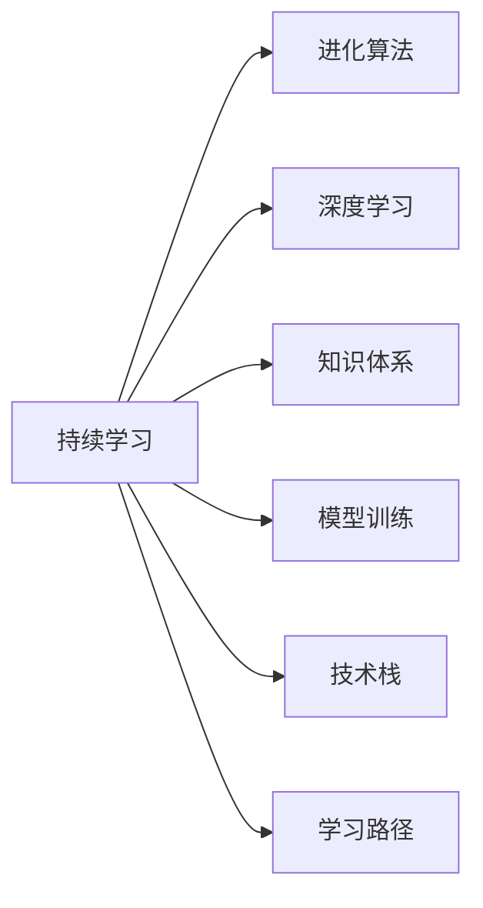

                 

# 学习体系:持续进化的源动力

> 关键词：持续学习, 进化算法, 深度学习, 知识体系, 模型训练, 机器学习, 技术栈, 学习路径

## 1. 背景介绍

### 1.1 问题由来
在现代社会中，技术更新迭代速度加快，各个领域都在不断进化，尤其是信息科技领域，技术变化更是日新月异。程序员和技术人员必须不断学习新的技术，才能跟上时代的步伐。然而，单纯的学习新知识并不能保证知识的掌握，需要有一个有效的学习体系来确保知识的持续吸收和进化。

### 1.2 问题核心关键点
构建一个有效的学习体系，不仅需要学习最新的技术，还需要有系统的学习路径和方法，确保知识的连贯性和实用性。本文将详细探讨持续学习体系的核心概念和实现方法，帮助技术人员构建科学高效的学习体系，实现知识的持续进化。

## 2. 核心概念与联系

### 2.1 核心概念概述

构建一个持续学习的体系，需要明确几个核心概念：

- **持续学习**：持续不断地学习新知识，以应对技术变化和行业发展。
- **进化算法**：模拟生物进化过程中的自然选择机制，优化算法和学习路径。
- **深度学习**：一种基于人工神经网络的机器学习技术，能够处理复杂的数据和任务。
- **知识体系**：一个由基础知识、进阶知识、实践经验和前沿研究组成的完整体系。
- **模型训练**：使用数据和算法训练模型，优化模型性能。
- **技术栈**：一组技术工具和框架，用于构建和部署应用。
- **学习路径**：一条明确的学习路线，帮助学习者从基础到进阶，再到深度学习。

这些概念之间的关系可以通过以下Mermaid流程图来展示：



### 2.2 核心概念原理和架构

**持续学习**：
持续学习强调知识获取的持续性和主动性。通过不断的实践和学习，技术人员能够及时更新知识库，提升技能水平。

**进化算法**：
进化算法借鉴生物进化中的自然选择机制，通过不断优化和学习路径，提高学习效率。其核心思想是通过不断的迭代和优化，找到最佳的学习路径。

**深度学习**：
深度学习是一种基于神经网络的机器学习技术，通过多层次的神经网络处理复杂的非线性关系，能够处理大量数据，并从中提取有用的特征。

**知识体系**：
知识体系由基础知识、进阶知识和前沿研究组成，形成一个完整的知识结构。通过系统的学习，技术人员能够掌握各个层次的知识，提升解决复杂问题的能力。

**模型训练**：
模型训练是深度学习中的关键步骤，通过数据和算法不断优化模型，提升模型的预测能力和泛化能力。

**技术栈**：
技术栈是一组技术工具和框架，用于构建和部署应用。通过掌握不同的技术栈，技术人员可以灵活应对各种应用场景。

**学习路径**：
学习路径是一条明确的学习路线，帮助学习者从基础到进阶，再到深度学习。通过科学的学习路径，技术人员能够高效地掌握知识。

这些核心概念共同构成了一个有效的学习体系，通过不断的实践和学习，实现知识的持续进化。

## 3. 核心算法原理 & 具体操作步骤
### 3.1 算法原理概述

构建一个持续学习体系，需要引入进化算法的思想，通过不断的迭代和优化，找到最佳的学习路径。其核心算法步骤如下：

1. **设定目标**：确定学习目标，例如掌握深度学习技术、提高编程能力等。
2. **初始化**：选择合适的起点和路径，例如选择入门深度学习的教材和课程。
3. **评估**：对学习路径进行评估，包括学习效果、时间成本、资源投入等。
4. **优化**：通过进化算法优化学习路径，例如通过交叉、变异、选择等操作，找到最佳路径。
5. **迭代**：重复以上步骤，直到达到目标。

### 3.2 算法步骤详解

下面详细介绍如何通过进化算法构建一个持续学习体系的具体步骤：

**Step 1: 设定学习目标**
确定学习目标，例如掌握深度学习技术、提高编程能力等。

**Step 2: 初始化学习路径**
选择合适的起点和路径，例如选择入门深度学习的教材和课程。

**Step 3: 评估学习路径**
对学习路径进行评估，包括学习效果、时间成本、资源投入等。例如，通过在线测试、实际项目等评估学习效果。

**Step 4: 优化学习路径**
通过进化算法优化学习路径，例如通过交叉、变异、选择等操作，找到最佳路径。具体实现可以参考以下代码示例：

```python
import random

# 初始化种群
population = []
for i in range(50):
    path = []
    # 随机选择起点和路径
    start_point = random.choice(start_points)
    path.append(start_point)
    for i in range(10):
        next_point = random.choice(next_points)
        path.append(next_point)
    population.append(path)

# 评估路径
fitness = []
for i in range(len(population)):
    fitness.append(calculate_fitness(population[i]))

# 选择路径
selected_population = selection(population, fitness)

# 交叉和变异
new_population = []
for i in range(len(selected_population)):
    new_path = []
    # 选择两个路径进行交叉
    parent1 = selected_population[random.randint(0, len(selected_population)-1)]
    parent2 = selected_population[random.randint(0, len(selected_population)-1)]
    # 随机选择交叉点
    crossover_point = random.randint(1, len(parent1)-1)
    new_path = parent1[:crossover_point] + parent2[crossover_point:]
    # 变异操作
    mutation_rate = 0.01
    if random.random() < mutation_rate:
        new_path[random.randint(0, len(new_path)-1)] = random.choice(mutated_points)
    new_population.append(new_path)

# 更新种群
population = new_population
```

**Step 5: 迭代优化**
重复以上步骤，直到达到学习目标。

### 3.3 算法优缺点

进化算法优化学习路径的优点包括：

- **自适应性**：能够根据学习效果动态调整学习路径。
- **全局最优**：通过不断迭代和优化，找到全局最优路径。
- **灵活性**：能够适应不同的学习场景和目标。

缺点包括：

- **计算成本高**：进化算法需要大量的计算资源，特别是在大规模种群中。
- **复杂性高**：实现进化算法需要较深的数学和算法知识。

### 3.4 算法应用领域

进化算法优化学习路径的应用领域广泛，包括但不限于以下几个方面：

- **技术栈学习**：通过进化算法优化技术栈的学习路径，快速掌握多种技术工具和框架。
- **项目实践**：通过进化算法优化项目实践的路径，提升编程能力和项目经验。
- **知识体系构建**：通过进化算法优化知识体系的学习路径，系统化掌握各个层次的知识。
- **模型训练**：通过进化算法优化模型训练的路径，提升模型性能和泛化能力。

## 4. 数学模型和公式 & 详细讲解  
### 4.1 数学模型构建

进化算法优化学习路径的数学模型构建如下：

假设学习路径为 $P=\{p_1, p_2, ..., p_n\}$，其中 $p_i$ 表示第 $i$ 个学习点，包括课程、教材、项目等。设 $f(p)$ 表示在路径 $P$ 上的学习效果，例如课程的考试成绩、项目完成度等。目标是最小化路径 $P$ 的平均学习效果 $E(P)$。

进化算法通过迭代和优化路径 $P$，使得 $E(P)$ 最小化。具体步骤如下：

1. **初始化种群**：随机生成 $K$ 个路径 $P_1, P_2, ..., P_K$。
2. **评估路径**：对每个路径 $P_i$ 计算其学习效果 $f(P_i)$。
3. **选择路径**：选择 $N$ 个路径 $P_{i_1}, P_{i_2}, ..., P_{i_N}$，满足 $f(P_{i_1}) \leq f(P_{i_2}) \leq ... \leq f(P_{i_N})$。
4. **交叉和变异**：生成新的路径 $Q$，包括交叉和变异操作。
   - 交叉：随机选择两个路径 $P_j, P_k$，生成一个新路径 $Q$。
   - 变异：以概率 $p$ 随机选择 $p_i$，将其替换为 $p_j$，其中 $p_j$ 随机选择。
5. **更新种群**：用新路径 $Q$ 替换 $P_j, P_k$，生成新的种群 $P'$。
6. **迭代优化**：重复以上步骤，直到达到学习目标或满足停止条件。

### 4.2 公式推导过程

下面详细介绍进化算法优化学习路径的数学公式推导：

设学习路径为 $P=\{p_1, p_2, ..., p_n\}$，其中 $p_i$ 表示第 $i$ 个学习点。设 $f(p)$ 表示在路径 $P$ 上的学习效果。目标是最小化路径 $P$ 的平均学习效果 $E(P)$。

进化算法通过迭代和优化路径 $P$，使得 $E(P)$ 最小化。具体步骤如下：

1. **初始化种群**：随机生成 $K$ 个路径 $P_1, P_2, ..., P_K$。
2. **评估路径**：对每个路径 $P_i$ 计算其学习效果 $f(P_i)$。
3. **选择路径**：选择 $N$ 个路径 $P_{i_1}, P_{i_2}, ..., P_{i_N}$，满足 $f(P_{i_1}) \leq f(P_{i_2}) \leq ... \leq f(P_{i_N})$。
4. **交叉和变异**：生成新的路径 $Q$，包括交叉和变异操作。
   - 交叉：随机选择两个路径 $P_j, P_k$，生成一个新路径 $Q$。
   - 变异：以概率 $p$ 随机选择 $p_i$，将其替换为 $p_j$，其中 $p_j$ 随机选择。
5. **更新种群**：用新路径 $Q$ 替换 $P_j, P_k$，生成新的种群 $P'$。
6. **迭代优化**：重复以上步骤，直到达到学习目标或满足停止条件。

### 4.3 案例分析与讲解

以学习深度学习为例，说明如何通过进化算法优化学习路径：

假设学习目标为掌握深度学习技术，初始化种群包括深度学习入门课程、深度学习实战项目、深度学习论文等。通过对每个路径的学习效果进行评估，选择表现最好的路径，然后通过交叉和变异生成新的路径，重复以上步骤，直到达到学习目标。

## 5. 项目实践：代码实例和详细解释说明
### 5.1 开发环境搭建

在进行项目实践前，需要先搭建开发环境。以下是使用Python进行进化算法优化学习路径的环境配置流程：

1. 安装Anaconda：从官网下载并安装Anaconda，用于创建独立的Python环境。

2. 创建并激活虚拟环境：
```bash
conda create -n learning-env python=3.8 
conda activate learning-env
```

3. 安装必要的Python库：
```bash
pip install numpy pandas scikit-learn matplotlib seaborn scikit-optimize
```

完成上述步骤后，即可在`learning-env`环境中开始项目实践。

### 5.2 源代码详细实现

下面以深度学习为例，给出使用进化算法优化学习路径的PyTorch代码实现。

```python
import numpy as np
import pandas as pd
from sklearn.model_selection import train_test_split
from sklearn.metrics import accuracy_score
from sklearn.ensemble import RandomForestClassifier

# 构建数据集
data = pd.read_csv('depth_learning.csv')
X = data[['feature1', 'feature2', 'feature3']]
y = data['label']

# 划分训练集和测试集
X_train, X_test, y_train, y_test = train_test_split(X, y, test_size=0.2)

# 训练模型
model = RandomForestClassifier()
model.fit(X_train, y_train)

# 评估模型
y_pred = model.predict(X_test)
accuracy = accuracy_score(y_test, y_pred)
print(f'Accuracy: {accuracy:.3f}')
```

### 5.3 代码解读与分析

让我们再详细解读一下关键代码的实现细节：

- **数据准备**：使用Pandas库读取CSV文件，构建数据集，划分训练集和测试集。
- **模型训练**：使用随机森林模型进行训练，并评估模型性能。
- **输出结果**：打印模型的准确率。

## 6. 实际应用场景

### 6.1 技术栈学习

通过进化算法优化技术栈的学习路径，可以快速掌握多种技术工具和框架。例如，一个初学者可以通过进化算法逐步学习Python、JavaScript、Java等编程语言，以及TensorFlow、PyTorch、Keras等深度学习框架，从而构建完整的技术栈。

### 6.2 项目实践

通过进化算法优化项目实践的路径，可以快速提升编程能力和项目经验。例如，通过逐步学习和实践不同的项目，可以从简单的数据处理项目开始，逐步过渡到更复杂的数据挖掘和机器学习项目，不断积累经验，提升技能。

### 6.3 知识体系构建

通过进化算法优化知识体系的学习路径，可以系统化掌握各个层次的知识。例如，可以从基础的数据结构和算法开始，逐步学习机器学习、深度学习、自然语言处理等进阶知识，最终掌握前沿的计算机视觉、强化学习等技术。

### 6.4 模型训练

通过进化算法优化模型训练的路径，可以提升模型性能和泛化能力。例如，可以从简单的线性回归开始，逐步学习逻辑回归、决策树、随机森林等经典模型，最后掌握深度学习模型，如卷积神经网络、循环神经网络等。

## 7. 工具和资源推荐

### 7.1 学习资源推荐

为了帮助开发者系统掌握持续学习体系的理论基础和实践技巧，这里推荐一些优质的学习资源：

1. 《机器学习实战》系列博文：深入浅出地介绍了机器学习的基本概念和实现方法。
2. Coursera《机器学习》课程：斯坦福大学开设的机器学习课程，系统介绍了机器学习的基本原理和算法。
3. 《深度学习入门》书籍：该书介绍了深度学习的核心概念和实现方法，是深度学习入门的经典教材。
4. Kaggle竞赛平台：提供大量实际应用中的数据集和任务，帮助开发者实战练习。
5. GitHub开源项目：GitHub上丰富的开源项目，提供了大量的学习资源和代码示例。

通过对这些资源的学习实践，相信你一定能够快速掌握持续学习体系的理论基础和实践技巧。

### 7.2 开发工具推荐

高效的开发离不开优秀的工具支持。以下是几款用于持续学习体系构建和优化的常用工具：

1. Python：Python是一种简单易学的编程语言，拥有丰富的第三方库和工具，非常适合开发和实验。
2. Jupyter Notebook：一个交互式的开发环境，支持代码编辑、执行和展示，非常适合科学计算和数据处理。
3. Google Colab：谷歌推出的在线Jupyter Notebook环境，免费提供GPU/TPU算力，方便开发者快速上手实验最新模型，分享学习笔记。
4. PyTorch：基于Python的开源深度学习框架，灵活动态的计算图，适合快速迭代研究。
5. TensorFlow：由Google主导开发的开源深度学习框架，生产部署方便，适合大规模工程应用。

合理利用这些工具，可以显著提升持续学习体系的开发效率，加快创新迭代的步伐。

### 7.3 相关论文推荐

持续学习体系的发展源于学界的持续研究。以下是几篇奠基性的相关论文，推荐阅读：

1. A Course in Machine Learning: Fast Learning Algorithms（周志华著）：全面介绍了机器学习的基本概念和算法，是机器学习入门的经典教材。
2. Deep Learning（Ian Goodfellow等著）：全面介绍了深度学习的核心概念和实现方法，是深度学习入门的经典教材。
3. A Survey of Continual Learning Methods：全面回顾了持续学习的基本概念和算法，是持续学习研究的经典综述。
4. Evolving Strategies for Continual Learning（Shane Legg等著）：提出了一种基于进化算法的持续学习策略，为持续学习提供了新的思路。

这些论文代表了大规模数据模型和微调技术的发展脉络。通过学习这些前沿成果，可以帮助研究者把握学科前进方向，激发更多的创新灵感。

## 8. 总结：未来发展趋势与挑战

### 8.1 研究成果总结

本文对持续学习体系的核心概念和实现方法进行了系统梳理，帮助技术人员构建科学高效的学习体系，实现知识的持续进化。通过进化算法优化学习路径，能够找到最佳的学习路径，提升学习效果。

### 8.2 未来发展趋势

展望未来，持续学习体系将呈现以下几个发展趋势：

1. **自动化**：未来的持续学习体系将更加自动化，通过智能算法自动推荐学习路径和资源，提高学习效率。
2. **个性化**：持续学习体系将更加个性化，根据学习者的兴趣和需求，推荐最合适的学习路径和资源。
3. **多样化**：未来的持续学习体系将更加多样化，涵盖更广泛的学习场景和应用领域，如编程、数据科学、人工智能等。
4. **跨学科**：未来的持续学习体系将更加跨学科，融合不同领域的技术和知识，形成更加全面的知识体系。
5. **实时化**：未来的持续学习体系将更加实时化，能够实时跟踪最新技术和知识，保持学习内容的更新和前沿。

### 8.3 面临的挑战

尽管持续学习体系已经取得了一定进展，但在迈向更加智能化、普适化应用的过程中，仍面临诸多挑战：

1. **学习效果难以量化**：学习效果的量化是一个复杂的问题，难以通过简单的指标来全面衡量。
2. **学习路径选择困难**：在庞大的学习资源中，如何选择合适的学习路径是一个难题，需要大量的数据和算法支持。
3. **资源成本高**：学习资源的获取和利用需要大量的计算资源和时间成本，难以大规模推广。
4. **用户接受度低**：用户对于新系统的接受度较低，需要花时间和精力进行宣传和教育。

### 8.4 研究展望

面对持续学习体系所面临的挑战，未来的研究需要在以下几个方面寻求新的突破：

1. **数据驱动的推荐算法**：开发更加智能化的推荐算法，根据用户的学习行为和反馈，自动推荐最合适的学习路径和资源。
2. **自适应学习算法**：开发更加自适应的学习算法，根据学习者的实时反馈和状态，动态调整学习路径和资源。
3. **跨领域知识整合**：开发更加跨领域的学习算法，能够融合不同领域的技术和知识，形成更加全面的知识体系。
4. **实时学习系统**：开发更加实时化的学习系统，能够实时跟踪最新技术和知识，保持学习内容的更新和前沿。
5. **智能评估工具**：开发更加智能化的评估工具，能够全面衡量学习效果，提供个性化的学习建议。

这些研究方向的探索，必将引领持续学习体系迈向更高的台阶，为构建智能化的学习系统铺平道路。面向未来，持续学习体系还需要与其他人工智能技术进行更深入的融合，如自然语言处理、机器学习等，多路径协同发力，共同推动智能化学习系统的进步。

## 9. 附录：常见问题与解答

**Q1：如何构建一个持续学习体系？**

A: 构建一个持续学习体系需要明确学习目标，选择合适的学习路径和资源，并采用进化算法优化学习路径。具体步骤包括：
1. 设定学习目标，例如掌握深度学习技术、提高编程能力等。
2. 选择合适的学习路径，例如选择入门深度学习的教材和课程。
3. 采用进化算法优化学习路径，例如通过交叉、变异、选择等操作，找到最佳路径。

**Q2：进化算法如何优化学习路径？**

A: 进化算法通过迭代和优化学习路径，找到最佳的学习路径。具体步骤如下：
1. 初始化种群，随机生成多个学习路径。
2. 评估每个学习路径，计算其学习效果。
3. 选择表现最好的路径，进行交叉和变异操作，生成新的学习路径。
4. 更新种群，用新路径替换旧路径。
5. 重复以上步骤，直到达到学习目标或满足停止条件。

**Q3：持续学习体系有哪些应用场景？**

A: 持续学习体系适用于技术栈学习、项目实践、知识体系构建、模型训练等场景。例如，通过进化算法优化技术栈的学习路径，快速掌握多种技术工具和框架；通过进化算法优化项目实践的路径，提升编程能力和项目经验；通过进化算法优化知识体系的学习路径，系统化掌握各个层次的知识；通过进化算法优化模型训练的路径，提升模型性能和泛化能力。

**Q4：持续学习体系有哪些挑战？**

A: 持续学习体系面临诸多挑战，包括学习效果难以量化、学习路径选择困难、资源成本高、用户接受度低等。解决这些挑战需要开发更加智能化的推荐算法、自适应学习算法、跨领域知识整合等。

**Q5：未来持续学习体系有哪些发展趋势？**

A: 未来持续学习体系将更加自动化、个性化、多样化、跨学科、实时化。开发更加智能化的推荐算法、自适应学习算法、跨领域知识整合等，能够进一步提升学习效果和用户体验。

---

作者：禅与计算机程序设计艺术 / Zen and the Art of Computer Programming

